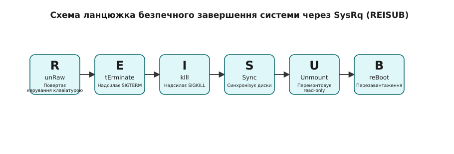

# Магічний SysRq: аварійні команди ядра з клавіатури

<details><summary>Що треба знати перед читанням</summary>
<preknowlist>
- Базові знання про архітектуру ядра Linux та простір користувача (userspace).
- Розуміння процесів, сигналів (SIGTERM, SIGKILL) та їхнього впливу на завершення програм.
- Уявлення про файлові системи, монтування та синхронізацію буферів (sync).
- Розуміння віртуальних терміналів (TTY) та графічних серверів (X11/Wayland).
</preknowlist>
</details>

Уявіть ситуацію: ваша система геть зависла. Графічний сервер X11 або Wayland більше не реагує на мишу чи клавіатуру. Зображення на екрані «замерзло». Ви намагаєтеся перемкнутися на віртуальну консоль (TTY) за допомогою `Ctrl+Alt+F3`, але система не відповідає. Навіть підключитися через SSH з іншого пристрою неможливо — мережевий стек або обробник SSH також недоступні. У вас відкриті важливі документи, бази даних працюють з кешем у пам'яті, і жорстке вимкнення живлення кнопкою Reset може призвести до незворотного пошкодження файлової системи або втрати критично важливих даних. Як врятувати незаписані дані на дисках та безпечно перезавантажити сервер, коли, здавалося б, усе втрачено? 

Саме для таких критичних ситуацій у ядрі Linux існує механізм **Magic SysRq Key** (магічна кнопка SysRq). Це спеціальна комбінація клавіш, яка дозволяє передавати команди безпосередньо ядру, в обхід простору користувача (userspace). Навіть якщо всі користувацькі процеси (включно з графічною оболонкою та системним менеджером) зависли, ядро зазвичай продовжує обробляти апаратні переривання клавіатури. Магічний SysRq дає можливість виконати безпечне завершення роботи, синхронізувати диски та перезавантажити комп'ютер без ризику втрати даних.

## Механізм обробки переривань клавіатури ядра в обхід простору користувача

Коли ви натискаєте клавішу на клавіатурі, апаратний контролер генерує переривання. Ядро перехоплює це переривання і, в нормальному режимі роботи, передає його драйверу термінала, який потім надсилає його до простору користувача (наприклад, графічному серверу, який зрештою відправляє його у вашу програму). Якщо система зависла через перевантаження процесора, брак пам'яті (OOM - Out of Memory) або блокування в userspace, ці події можуть ніколи не дійти до обробника.

Проте, обробник клавіатури в ядрі Linux (особливо для клавіатур PS/2 та певних конфігурацій USB) має вбудовану систему розпізнавання спеціальної комбінації `Alt + SysRq` (або `Alt + Print Screen`). Коли ядро фіксує цю комбінацію разом з певною командною клавішею, воно негайно викликає внутрішні функції ядра, оминаючи будь-які процеси в просторі користувача. Це означає, що команди виконуються на найнижчому рівні системи, з максимальним пріоритетом.

Завдяки цьому, навіть якщо графічне середовище повністю паралізоване, ядро все одно здатне виконати екстрені дії: зупинити процеси, скинути буфери дисків або викликати паніку ядра для отримання дампу пам'яті.

## Класичний рятувальний порядок REISUB

Щоб безпечно перезавантажити завислу систему, використовується спеціальна послідовність команд SysRq, відома як **REISUB**. Літери розшифровують англійською фразою «Reboot Even If System Utterly Broken» («перезавантаж, навіть якщо система геть зламана»); задом наперед ті самі шість літер складаються в слово BUSIER — так їх теж часто запам'ятовують. Ця абревіатура допомагає запам'ятати правильний порядок дій, який мінімізує ризик пошкодження даних.

Зазвичай комбінація викликається так: потрібно натиснути і утримувати `Alt + SysRq` (або `Alt + Print Screen`), а потім послідовно, з інтервалом у кілька секунд (щоб дати ядру час на виконання попередньої команди), натискати клавіші `R`, `E`, `I`, `S`, `U`, `B`.

Давайте детально розберемо функцію кожної з цих клавіш у рятувальному ланцюжку.


*Шість клавіш ланцюжка йдуть у жорстко визначеному порядку: спершу повернути собі клавіатуру, потім завершити процеси — м'яко, а тоді примусово, — і лише після цього скинути кеш на диск, замкнути файлові системи на читання й перезавантажитися.*

### Функція кожної клавіші ланцюжка

*   **r (unraw):** Перехоплює керування клавіатурою у графічного сервера (X сервер або Wayland). Захопивши консоль, графічний сервер перемикає режим клавіатури тієї віртуальної консолі: старий X ставив «сирий» `K_RAW` і читав скан-коди сам, а сучасні X та композитори Wayland ставлять `K_OFF` і беруть події з `evdev`. В обох випадках сама консоль на натискання не реагує. Команда `r` повертає режим `K_XLATE`, тобто віддає клавіатуру ядру й віртуальним консолям. Це може бути достатньо для того, щоб натиснути `Ctrl+Alt+F3` і перейти в текстовий термінал, якщо зависла лише графіка.
*   **e (sigterm):** Надсилає сигнал `SIGTERM` (Signal Terminate) всім процесам, окрім `init` (або `systemd`, процес з PID 1). Це «ввічливе» прохання до програм завершити роботу. Програми можуть перехопити цей сигнал, зберегти свої дані, закрити файли і коректно завершитися. Після натискання `e` рекомендується зачекати кілька секунд (залежно від завантаженості системи).
*   **i (sigkill):** Надсилає сигнал `SIGKILL` (Signal Kill) всім процесам, окрім `init`. Це «жорстке» завершення. Процеси не можуть перехопити цей сигнал — він потрібен саме для тих, хто завис і не відреагував на `SIGTERM` з попереднього кроку. Єдиний виняток принциповий: задача в непереривному сні (стан `D`, зазвичай усередині драйвера чи операції вводу-виводу) сигнал отримає, але помре лише тоді, коли з того сну вийде. Через такі задачі зависання інколи переживає й `i`.
*   **s (sync):** Найважливіший крок для збереження даних. Команда `s` запускає в ядрі аварійну синхронізацію (`emergency_sync`) — той самий скид, що й системний виклик `sync`, але зроблений зсередини ядра, без участі простору користувача. Ядро скидає всі незаписані дані з кешу в оперативній пам'яті (buffers) на фізичні диски. Скид не миттєвий: обробник натискання лише ставить роботу в чергу ядра, а виконується вона окремо — тому повідомлення `Emergency Sync complete` на екрані (якщо ви перейшли в текстовий режим) і є єдиним підтвердженням, що черга справді відпрацювала. Зачекайте, доки диски перестануть активно працювати (або індикатор диска на корпусі перестане постійно світитися).
*   **u (remount read-only):** Перемонтовує всі підключені файлові системи в режим «тільки для читання» (read-only). Це фінальна гарантія того, що після успішного скидання буферів (`s`), жоден процес не зможе записати нічого у файлові системи і тим самим порушити їхню цілісність перед перезавантаженням. Після завершення цієї операції ви побачите напис `Emergency Remount complete`.
*   **b (reboot):** Негайне перезавантаження системи. Це еквівалент жорсткого скидання (Reset), але оскільки ми вже коректно завершили процеси, скинули буфери на диск і перемонтували файлові системи в read-only, перезавантаження є повністю безпечним.

Окрім REISUB, SysRq має інші корисні команди:
*   **t (task dump):** Виводить список поточних завдань (процесів) та їхню інформацію на консоль. Допомагає визначити, який процес викликає зависання.
*   **m (memory dump):** Виводить інформацію про використання пам'яті на консоль. Корисно для діагностики проблем з браком пам'яті (OOM).
*   **o (power off):** Повністю вимикає систему (якщо підтримується апаратним забезпеченням).

## Контроль через /proc/sys/kernel/sysrq та тригери /proc/sysrq-trigger

Магічний SysRq є потужним, але потенційно небезпечним інструментом. Дозволити будь-якому користувачеві з фізичним доступом до клавіатури миттєво перезавантажити сервер або змінити режим монтування дисків — це серйозний ризик для безпеки. Тому ядро Linux дозволяє налаштовувати, які саме команди SysRq дозволені.

Цей контроль здійснюється через файл `/proc/sys/kernel/sysrq`. Значення в цьому файлі є бітовою маскою, яка визначає дозволені функції:
*   `0` — SysRq повністю вимкнено.
*   `1` — Усі функції SysRq дозволені (таке значення ставить саме ядро, але дистрибутиви його часто звужують).
*   Інші значення — сума бітів окремих груп: `2` — рівень журналювання консолі, `4` — керування клавіатурою (`unraw`, SAK), `8` — діагностичні дампи, `16` — `sync`, `32` — перемонтування в read-only, `64` — сигнали процесам (term, kill, oom-kill), `128` — reboot і poweroff, `256` — зниження пріоритету RT-задач. Скажімо, `48` (16 + 32) дозволяє лише sync і remount-ro, забороняючи і reboot, і kill, а типове для Ubuntu `176` (16 + 32 + 128) додає до них ще й перезавантаження.

Ви можете перевірити поточне значення:
```bash
cat /proc/sys/kernel/sysrq
```

Щоб дозволити всі команди (тимчасово, до перезавантаження), як root:
```bash
echo 1 > /proc/sys/kernel/sysrq
```
Для постійних змін слід додати `kernel.sysrq = 1` до файлу `/etc/sysctl.conf`.

### Використання sysrq-trigger

Команди SysRq можна викликати не лише з фізичної клавіатури, але й з командного рядка (якщо ви маєте права root). Це дуже корисно під час віддаленого адміністрування, коли SSH ще працює, але система веде себе нестабільно і ви хочете запустити безпечне завершення.

Для цього використовується спеціальний файл-тригер: `/proc/sysrq-trigger`. Запис символу в цей файл має такий самий ефект, як і натискання відповідної комбінації клавіш.

Одна відмінність тут принципова: бітова маска з `/proc/sys/kernel/sysrq` стримує **лише клавіатурний виклик**. Виклик через тригер ядро проти маски не звіряє взагалі — навіть при `0` запис у `/proc/sysrq-trigger` виконає команду, бо єдиний захист у цьому шляху — права на сам файл, а він доступний на запис тільки root.

Наприклад, щоб примусово скинути буфери на диск, можна виконати:
```bash
echo s > /proc/sysrq-trigger
```

А щоб перезавантажити сервер:
```bash
echo b > /proc/sysrq-trigger
```

**Приклад скрипта bash: скидання буферів через тригер, маска — довідково:**
```bash
#!/bin/bash
# Скид буферів через /proc/sysrq-trigger.
# Маска тут нічого не забороняє — вона стосується лише клавіатури,
# тому перевіряємо її винятково щоб попередити адміністратора.

SYSRQ_MASK=$(cat /proc/sys/kernel/sysrq)

if [ "$SYSRQ_MASK" -eq 0 ]; then
    echo "Увага: клавіатурний SysRq вимкнено (маска = 0); через тригер команда все одно спрацює."
elif [ "$SYSRQ_MASK" -ne 1 ] && [ $(( SYSRQ_MASK & 16 )) -eq 0 ]; then
    echo "Увага: у масці $SYSRQ_MASK немає біта sync (16) — з клавіатури 's' не спрацює."
fi

echo "Скидання буферів..."
# Увага: потрібні права root!
echo s > /proc/sysrq-trigger
echo "Команду надіслано; на завершення скиду вкаже 'Emergency Sync complete' у dmesg."
```

Механізм Magic SysRq — це остання лінія оборони адміністратора. Розуміння його роботи та вміння правильно використовувати ланцюжок REISUB може врятувати години роботи та критично важливі дані у разі фатального зависання системи.
