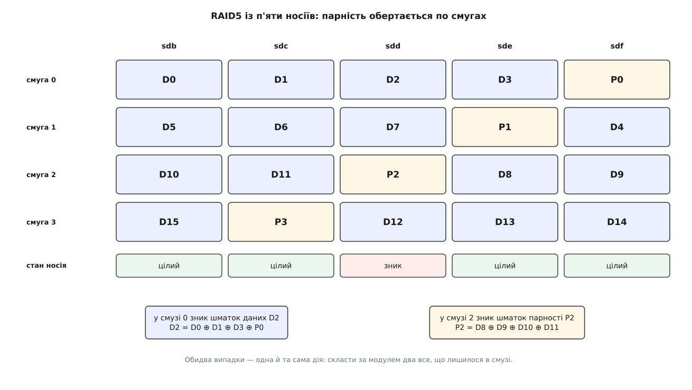
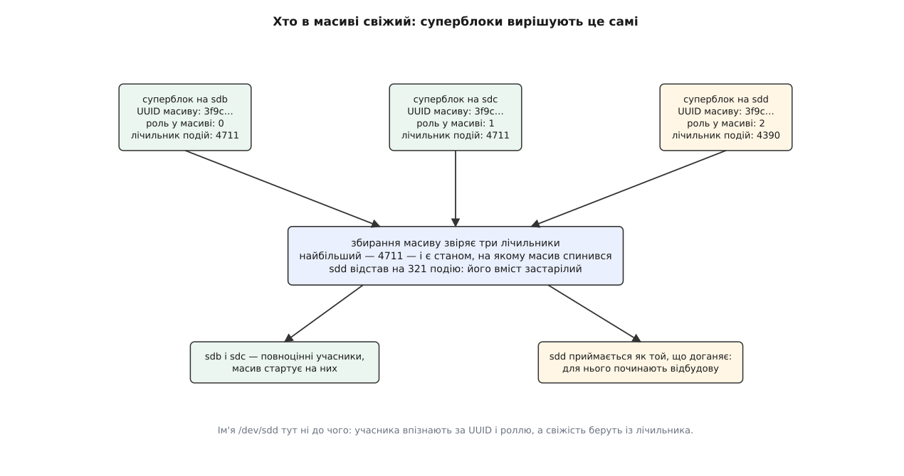
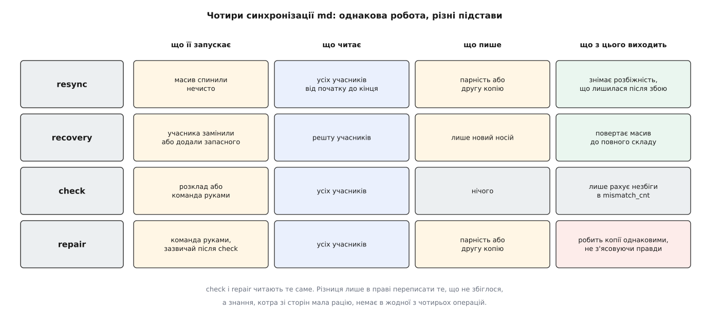
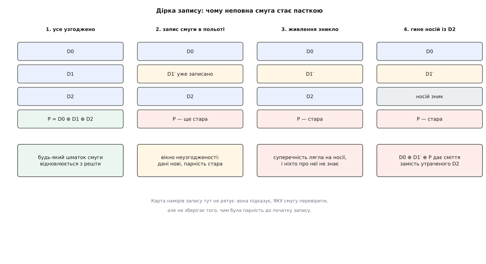

# Програмний RAID у Linux: md, рівні масиву й відновлення

<preknowlist>
- [Блоковий пристрій: сектори, блоки й черга запитів](topic:unix-linux/block-device-model) — носій виглядає для ядра масивом пронумерованих секторів по 512 байтів, а запит до нього оформлений окремою структурою з номером сектора, довжиною й сторінками пам'яті.
- [Файл пристрою: символьний і блоковий](topic:unix-linux/device-file-model) — доступ до пристрою йде через файл у `/dev`, і саме блокові файли віддають дані діапазонами секторів.
- [Розділи диска: таблиця розділів і вирівнювання](topic:unix-linux/disk-partitions) — носій зазвичай поділений на розділи, і кожен розділ сам виглядає окремим блоковим пристроєм.
- [RAID: смуги, дзеркала й парність](topic:algorithms/raid-levels) — сама ідея надлишкового масиву й що дає кожен її різновид.
- [Біт парності](topic:communications/parity-bit) — порозрядна сума за модулем два, обернена сама до себе: з неї відновлюють одну втрачену величину.
- [Кеш сторінок, fsync і довговічність запису](topic:unix-linux/page-cache-durability) — записане програмою не одразу лежить на носії, тож «узгоджений стан на диску» треба забезпечувати навмисно.
- [udev: іменування пристроїв і правила](topic:unix-linux/udev-rules) — на появу кожного блокового пристрою система реагує подією й запускає обробку.
- [Модель пристроїв у sysfs](topic:unix-linux/sysfs-device-model) — ядро показує пристрої, їхні зв'язки й налаштування каталогами й файлами в `/sys`.
- [Модулі ядра](topic:unix-linux/kernel-modules) — потрібний драйвер довантажується на льоту, тож набір доступних рівнів масиву не зафіксований під час збирання ядра.
</preknowlist>

## Дві копії й жодного арбітра

Носій помирає — і це не аварія, а розклад. У сховищі з тисячі дисків відмова трапляється щотижня; у ноутбуку той самий процес просто розтягнений на роки. Питання не «чи», а «коли». Поки все цінне лежить на одному носії, його смерть дорівнює смерті даних.

Ліки напрошуються самі: тримати те саме на двох носіях. Один помер — другий цілий, працюємо далі.

Але саме з цієї миті починається справжня складність, і вона не про копіювання. Поки носій був один, на питання «що записано в секторі 5 000 000?» система мала рівно одну відповідь, і та була правильною за визначенням: іншої просто не існувало. Тепер відповідей дві. Доки вони однакові — усе гаразд. Однаковими вони не залишаться: живлення зникне між першим записом і другим; один носій на десять хвилин відвалиться по шлейфу й повернеться; на одному з них тихо посиплеться сектор. І тоді в системі лежать два різні байти на одну адресу — і жодної підстави сказати, котрий із них справжній.

Отже, надлишковість сама собою не рятує. Рятує надлишковість плюс механізм, який щомиті знає, котра копія свіжа, і вміє привести до неї решту. Усе, з чого зроблено md — рівні масиву, суперблок, карта намірів, чотири різні синхронізації, журнал, — виросло саме з цієї потреби, а не з бажання зчепити докупи кілька дисків.

## Пристрій, у якого немає власного заліза

Підсистема ядра, яка це робить, зветься **md** (від англ. *multiple devices* — кілька пристроїв). Її виріб `/dev/md0` — звичайнісінький блоковий пристрій: пара номерів, файл у `/dev`, розмір у секторах і ті самі два дієслова, читати й писати. Власного заліза під ним немає жодного: на кожен запит він звертається до носіїв-учасників — так само, як звертався б до них шар вище.

Це той самий трюк, на якому стоїть [device mapper](topic:unix-linux/device-mapper) — механізм, що збирає блоковий пристрій із шарів за таблицею відображення, поданою з простору користувача. Але md зроблено інакше у двох місцях, і жодна з відмінностей не випадкова.

Перша: **md зберігає власний стан на самих учасниках**. Пристрій device mapper не пам'ятає про себе нічого — таблицю йому щоразу подають зовні. Масиву так не можна. Якщо корінь системи лежить на масиві, то до збирання масиву читати конфігурацію нема звідки: файл із описом лежав би всередині того, що ще не зібрано. Тому на кожному учаснику записано **суперблок** — опис масиву очима цього конкретного носія.

Друга: **політика відновлення живе в ядрі**. Коли носій відмовляє посеред ночі, спитати простір користувача, що робити далі, часом ніде: сторінки самих програм читаються з того ж масиву й у момент відмови можуть бути недоступні. Тож рішення «виключити носія, перейти в неповний склад, почати відбудову на запасний» драйвер ухвалює сам, не питаючи нікого.

Той самий код можна вести й через device mapper: ціль `raid` — це двигун md, яким керує таблиця dm. Саме так надлишковість роблять [логічні томи LVM](topic:unix-linux/lvm-and-snapshots). Механізм спільний, різниця лише в тому, хто тримає віжки. Як цей двигун складався з початкового драйвера Марка Зенж'є, переписаного Інґо Молнаром, і хто далі його вів — окремо: [звідки взявся md і його інструмент](topic:unix-linux/md-raid/hist-md-lineage.md).

## Скільки правди й де вона лежить

Рівень масиву відповідає на одне питання: скільки в системі має бути надлишкової правди і в якому вигляді її зберігати.

Найдешевша відповідь — «жодної». Режими `linear` (зчепити носії один за одним) і `raid0` (розкидати шматками по всіх) дають більший і швидший пристрій, але множать ризик: кожен сектор існує в одному примірнику, тож відмова будь-якого учасника вбиває масив цілком. Це не надлишковість, а тільки геометрія.

Наступна відповідь — «стільки ж, скільки корисних даних». `raid1`, дзеркало: кожен запис іде на всіх учасників, кожне читання можна взяти з будь-кого. Половина ємності (а при трьох копіях — дві третини) відходить під повтори, зате відновлення тривіальне: узяти цілу копію й переписати. Читання масштабується числом учасників, запис — ні, він однаково мусить дійти до всіх.

`raid10` складає обидва підходи: смуги над дзеркалами. У Linux це не механічне поєднання двох рівнів, а окремий драйвер із трьома розкладками. `near` тримає копії на близьких зсувах різних носіїв — так поводиться класичний RAID 1+0, і це усталений вибір. `far` розносить копії на протилежні кінці носіїв: читання тоді йде зовнішніми доріжками, де лінійна швидкість обертового диска більша, а платить за це запис довшими переміщеннями голівки. `offset` дублює цілу смугу наступним рядком зі зсувом на один носій — компроміс між двома попередніми.

І остання відповідь, найощадливіша: тримати не копію, а **обчислювану** надлишковість.

Візьмемо смугу — по одному шматку з кожного носія, вирівняних за адресою. Замість повторювати дані запишемо на один із носіїв їхню порозрядну суму за модулем два: `P = D0 ⊕ D1 ⊕ D2`. Ця операція обернена сама до себе, тож із будь-яких трьох чисел четверте виводиться однією й тією ж дією. Надлишковість перестала коштувати половину ємності й почала коштувати один носій із n. Це `raid5`.

Чому парність не тримають на одному виділеному носії? Такий варіант існує й зветься `raid4`. Але парність міняється при **кожному** записі в масив, хоч би куди він ішов, — і виділений носій парності стає вузьким місцем, у яке впирається геть усе. Тому в `raid5` шматок парності обертають: у першій смузі він на останньому носії, у другій — на передостанньому, і так по колу. Запис розмазується рівномірно, виділеного винуватця немає.

`raid6` додає до P другу обчислену величину, Q. Вона вже не проста сума: Q — зважена сума тих самих шматків у скінченному полі GF(2⁸), тобто другий синдром коду [Ріда–Соломона](topic:communications/reed-solomon). Два незалежні рівняння дають дві невідомі, тож масив переживає одночасну втрату двох учасників. Математику цього різновиду для Linux розписав H. Peter Anvin — його праця «The mathematics of RAID-6» (перша редакція 2004 року) і лежить в основі реалізації в ядрі.



*Носій, що зник, не має особливого статусу: чи ніс він дані, чи парність, відновлення однакове — скласти за модулем два все, що лишилося в смузі.*

## Чому парність дорого коштує на записі

Дзеркало на записі поводиться просто: скільки копій, стільки й записів, кожен незалежний. Парність так не вміє, і причина проста: `P` залежить від **усіх** шматків смуги. Змінили один байт — парність усієї смуги стала неправильною.

Звідси у md два способи оновити смугу, і драйвер щоразу обирає дешевший.

**Умова: RAID5 із п'яти носіїв, шматок 512 КіБ, програма записує 4 КіБ усередину смуги.**

```
Смуга: 4 шматки даних + 1 шматок парності = 2 МіБ корисних

Спосіб «прочитати — змінити — записати»
   прочитати старі дані на місці запису        4 КіБ
   прочитати стару парність                    4 КіБ
   P_нова = P_стара ⊕ D_стара ⊕ D_нова
   записати дані                               4 КіБ
   записати парність                           4 КіБ
   разом: 2 читання + 2 записи

Спосіб «дочитати смугу»
   прочитати 3 інші шматки даних           3 × 4 КіБ
   P_нова = D1 ⊕ D2 ⊕ D3 ⊕ D_нова
   записати дані                               4 КіБ
   записати парність                           4 КіБ
   разом: 3 читання + 2 записи

Запис цілої смуги, 2 МіБ рівно від її межі
   читань                                          0
   записів                                5 × 512 КіБ
```

Перший спосіб коштує двох читань незалежно від ширини масиву; другий коштує (n − 2) читань, де n — число носіїв. На п'яти носіях виграє перший, на чотирьох вони рівні, а на трьох дешевшим виявляється другий — там дочитати треба всього один шматок; і що ширший масив, то більший запас у першого. Але обидва означають одне й те саме: **одне логічне записування 4 КіБ обертається чотирма операціями на двох носіях**. Класичне число «запис у RAID5 коштує вчетверо» — саме звідси.

Третій рядок пояснює, чому це не вирок. Коли запит покриває смугу цілком і починається рівно з її межі, читати нічого не треба: усі дані вже в руках, парність рахується з них, на носії йдуть тільки записи. Тому масив із парністю байдужий до послідовного навантаження й болісно чутливий до дрібного розкиданого запису.

> 🔧 **Навіщо це.** Звідси беруться дві практичні речі. Перша: розділ на масиві варто починати з межі смуги, а файловій системі під час створення повідомляти ширину смуги й розмір шматка — інакше половина записів гарантовано лягатиме впоперек меж і вимагатиме читань. Друга: базу даних із дрібним випадковим записом на RAID5 ставлять або з великим кешем контролера, або не ставлять узагалі — дзеркало на тому самому залізі виявиться швидшим, дарма що дорожчим за ємністю.

## Масив мусить упізнати себе сам

Щоб масив зібрався без сторонньої підказки, кожен учасник має знати три речі: до якого масиву він належить, яке місце в ньому займає і наскільки свіжий його вміст. Усі три лежать у суперблоці.

**Належність** — це UUID масиву, випадкове 128-бітове число, породжене при створенні. Саме воно, а не ім'я файлу, є посвідченням: імена `/dev/sd*` роздаються за порядком появи пристроїв і між завантаженнями міняються місцями.

**Місце** — номер ролі. Для дзеркала він мало важить, для парності важить критично: у смузі RAID5 треба знати не тільки те, які шматки є, а й у якому вони порядку, інакше `D0 ⊕ D1 ⊕ D2` складеться правильно, а от куди покласти результат — ні.

**Свіжість** — лічильник подій. Це найцікавіше поле, бо саме воно розв'язує задачу з початку розмови. Лічильник зростає на кожній помітній зміні стану масиву: старт, чиста зупинка, виключення учасника, завершення відбудови. Коли учасник випадає — хай навіть через кабель, а не через смерть, — масив живе далі й далі рахує події, а суперблок того, хто випав, застигає зі старим числом. Під час збирання md звіряє лічильники всіх знайдених учасників. Найбільше число і є станом, на якому масив спинився насправді; носій із меншим числом ніс застарілий вміст: у робочий склад його не беруть — масив стартує без нього, а сам він повертається щонайбільше як той, кого доганяють відбудовою.



*Арбітр, якого бракувало двом копіям, — це просто число, що зростає в такт зі змінами стану масиву й записане на кожному учаснику.*

Тепер стає зрозуміло, чому суперблок має кілька версій і чому важить, де саме на носії він лежить. Формат 0.90 та новіший 1.0 кладуть його **наприкінці** носія, 1.1 — на самому **початку**, 1.2 — за **4 КіБ від початку**; останній і є усталеним для `mdadm` починаючи з версії 3.1.2.

Хвіст носія зручний тим, що масив можна зробити з наявного розділу, не рухаючи даних: усе, що там уже було, лишається на місці. Це ж і небезпечно. Учасник із суперблоком у хвості на перший погляд не відрізняється від самостійного тому — на початку в нього звична сигнатура файлової системи. Систему легко спокусити змонтувати такого учасника напряму, повз масив; а це запис в обхід надлишковості, тобто рівно та розбіжність копій, від якої масив і мав захистити. Суперблок на початку носія цю двозначність знімає: там, де очікується сигнатура файлової системи, лежить сигнатура md. Відступ у 4 КіБ додатково залишає місце завантажувальному секторові й вирівнює службові структури під розмір фізичного блока сучасних носіїв.

Точні поля суперблока, формат `/proc/mdstat` і файли керування в `/sys/block/mdX/md/` зібрано в довідці: [метадані md, mdstat і керуючі файли](topic:unix-linux/md-raid/api-md-metadata.md).

## Чотири синхронізації, які легко сплутати

Розбіжність між учасниками треба не лише виявити, а й усунути. У md для цього чотири операції, і за іменем `sync_action` вони виглядають як варіації одного, хоча підстави в них геть різні.

**resync** запускається, коли масив спинили нечисто. Стан кожної смуги невідомий, тому md проходить масив від початку до кінця й приводить надлишковість до даних: на дзеркалі копіює з першого учасника на решту, на парності перераховує P (і Q) з даних.

**recovery** — це відбудова одного носія. Учасника замінили або ввели запасного; решта масиву вважається правильною, читається вся, і результат пишеться тільки на нового.

**check** нічого не виправляє. Він читає всіх учасників і рахує, у скількох місцях вони не збіглися, складаючи це число у `mismatch_cnt`. Дистрибутиви зазвичай ганяють його за розкладом раз на місяць.

**repair** робить те саме читання, але має право переписати те, що не збіглося.



*Робота в усіх чотирьох майже однакова — повний прохід по масиву; розрізняє їх лише підстава й право на запис.*

І тут виринає межа, яку слід усвідомити чесно. Коли `check` на дзеркалі знаходить два різні байти, md **не знає**, котрий правильний. Жодного натяку на це в масиві немає: суперблок каже, хто свіжіший загалом, але не каже нічого про окремий сектор. Тому `repair` на дзеркалі не «виправляє помилку» — він оголошує першу копію еталоном і переписує решту. На парності так само: він приймає дані за істину й перераховує парність під них, хоча зіпсуватися міг саме шматок даних.

Причина цієї безпорадності в тому, що md не має контрольних сум. Він порівнює копії між собою, а не звіряє кожну з незалежним свідченням про те, якою вона має бути. Хто хоче саме такого свідчення, кладе його окремим шаром — [dm-integrity](topic:unix-linux/dm-integrity) додає до кожного блока контрольну суму, і тоді зіпсований учасник повертає не інші байти, а помилку читання, з якою масив уже вміє поводитися однозначно.

Побачити всі чотири операції руками — небагато роботи: кілька файлів, [підкладених як блокові пристрої](topic:unix-linux/loop-device), масив на них і навмисне псування. Розписаний дослід зібрано окремо: [зібрати масив на файлах, зламати його й полагодити](topic:unix-linux/md-raid/proj-md-lab.md).

## Карта намірів запису

Повний `resync` на сучасних носіях триває годинами: він читає й пише кожен сектор масиву. При цьому в переважній більшості випадків розбігтися встигли одиниці смуг — ті, у які саме йшов запис у мить збою. Решта масиву в порядку, але md про це не знає й тому перевіряє все.

Дізнатися можна, якщо записувати намір **до** запису. Карта намірів (`write-intent bitmap`) ділить масив на ділянки — типово в десятки мегабайтів — і тримає на кожну по біту. Перед тим як послати на носії запис у смугу, md ставить біт відповідної ділянки й дочікується, поки цей біт справді ляже на носій; після завершення запису біт із затримкою знімається. Після нечистої зупинки перевіряти треба тільки ділянки з поставленими бітами: замість годин — секунди.

Той самий механізм рятує в куди частішому випадку. Носій відвалився по шлейфу на десять хвилин і повернувся цілим. Без карти його доводиться відбудовувати повністю — це знову години й повне навантаження на решту. З картою видно рівно ті ділянки, у які писали за час його відсутності, і догнати відсталого можна за хвилини.

Плата — додаткова операція запису перед кожним записом у «чисту» ділянку, і саме тому карту тримають грубою: бітів мало, ділянки великі, тож більшість записів потрапляє в ділянку, біт якої вже стоїть. Карту можна класти у службове місце поруч із суперблоком або окремим файлом на іншій файловій системі — другий варіант існує через обертові диски, де зайвий рух голівки до службової ділянки коштував дорого.

## Дірка запису

Карта намірів вирішує, **що** перевіряти. Вона нічого не вирішує про смугу з парністю, і тут ховається найнеприємніша властивість RAID5 і RAID6.

Оновлення смуги — це кілька записів на різні носії: новий шматок даних і нова парність. Атомарно їх зробити неможливо: це фізично різні пристрої, кожен зі своєю чергою. Між першим завершеним записом і останнім існує вікно, у якому смуга неузгоджена — дані вже нові, парність ще стара. У нормальному житті вікно закривається за мілісекунди й нікого не турбує.

Але якщо саме в цю мить зникло живлення, неузгодженість лягає на носії й лишається там. Формально масив цілий: усі учасники на місці, дані читаються з них напряму, парність ніхто не питає. Біда виявляється пізніше — коли один з учасників помре і його вміст доведеться рахувати з решти. Реконструкція складе стару парність із новими даними й видасть **сміття**, причому сміття тихе: воно виглядатиме як звичайні байти, і жоден лічильник про це не скаже.



*Карта намірів позначить смугу як підозрілу, але відновити з неї правильну парність уже нічим: старого вмісту, з якого її рахували, більше немає.*

Цю ваду звуть **дірка запису** (англ. *write hole*). Замкнути її можна лише одним способом: зберегти десь достатньо відомостей, щоб після збою смугу можна було довести до узгодженого стану. Тобто зробити те саме, що [журнал робить для файлової системи](topic:unix-linux/journaling-consistency) — записати намір у надійне місце раніше, ніж міняти дані на місці.

У md для цього є два різні механізми.

**Журнал** (`raid5-cache`) — окремий швидкий носій, на який спершу лягають і дані, і парність смуги, і тільки після їхнього успішного запису зміни розкладаються по учасниках масиву. Після збою журнал програють наново, і смуга доходить до цілісного стану. Наскрізний режим, що закриває саме дірку запису, з'явився в ядрі 4.4, режим зі зворотним записом — у 4.10. Ціна очевидна: усе пишеться двічі, а сам журнальний носій стає єдиною точкою відмови, якщо його не задублювати.

**Журнал часткової парності** (`PPL`, від англ. *partial parity log*) обходиться без окремого носія: перед оновленням смуги він пише в службову ділянку самих учасників часткову парність — рівно ту величину, якої після збою забракне, щоб відновити стару. Механізм увійшов у ядро 4.12; він працює лише для RAID5, коштує до 30–40 % швидкості запису й, на відміну від журналу, не рятує від утрати даних, які були в польоті, — тільки від тихого псування.

Тому в багатьох установках дірку запису просто приймають, спираючись на джерело безперебійного живлення й на те, що вона стріляє лише в збігу двох подій: раптова зупинка, а потім відмова носія до найближчої перевірки.

## Коли гине не носій, а сектор

Носій рідко помирає весь одразу. Значно частіше він повертає помилку на окремому секторі — дані там уже не читаються, хоча решта пластини ціла.

Для масиву це навіть простіше за смерть учасника: відповідь є в надлишковості. md бере другу копію або рахує втрачений шматок зі смуги — і віддає правильні дані вгору, наче нічого не сталося. Але на цьому він не спиняється: одразу після цього md **записує** відновлений шматок назад на той самий носій. Логіка тут не в тому, щоб «полагодити диск». Носій, отримавши запис у поганий сектор, перенаправляє його на резервний зі свого запасу; сектор фізично міняється, а масив перевіряє результат читанням. Якщо запис не вдався й перечитування дало не те — учасника виключають остаточно.

Небезпечне тут інше. Поки масив у неповному складі, другої відповіді немає. Одна невиправна помилка читання під час відбудови означає втрачену смугу — а відбудова читає **весь** решту масиву, тобто зачіпає найбільший обсяг за все життя масиву й саме тоді, коли захисту немає.

**Умова: RAID5 із п'яти носіїв по 8 ТБ, один помер, іде відбудова на запасний.**

```
прочитати треба        4 × 8 ТБ = 32 × 10¹² байтів
                                = 2.56 × 10¹⁴ бітів
паспортна межа дешевого носія:
   менш ніж 1 невиправна помилка на 10¹⁴ прочитаних бітів
очікуване число помилок  λ = 2.56 × 10¹⁴ / 10¹⁴ = 2.56
P(жодної помилки)          = e^(−2.56) ≈ 0.077
```

До цього числа слід ставитися як до **верхньої оцінки**, а не до виміру: паспортна межа — це гарантія «не гірше», і польові спостереження дають частоту помилок помітно нижчу. Але порядок величини правильний, і висновок від точності не залежить: на носіях у кілька терабайтів одинарна парність перестає бути надійною, бо ймовірність спіткнутися під час відбудови вже не мала. Звідси й правило — від певної ємності беруть `raid6` або дзеркало з трьох копій. Як така ймовірність рахується для складених систем, розібрано в темі про [математику надійності](topic:math/system-reliability-math); тут важливий лише сам зв'язок «обсяг відбудови × частота помилок».

md, до речі, уміє й не виключати носія одразу: у суперблоці є список поганих блоків, куди можна занести адреси, що не читаються. Масив тоді лишається в складі, але чесно віддає помилку на ці конкретні сектори замість того, щоб втратити цілого учасника через кілька секторів.

## Масив ніхто не вмикає

Лишилося питання, з якого все й починалося: як масив збирається, коли жодної конфігурації ще не прочитано.

Ніхто не «вмикає» масив командою. На появу кожного блокового пристрою система дістає подію від [udev](topic:unix-linux/udev-rules), і правило запускає `mdadm --incremental` на новачка. Той читає суперблок: якщо це учасник масиву — його додають до наявного набору. Щойно набір ролей стає достатнім, щоб масив працював, md його запускає. Порядок появи носіїв не має значення, а разом із ним не має значення й порядок імен: масив збирається за UUID і ролями. Саме тому збирання працює всередині [initramfs](topic:unix-linux/initramfs), де ще немає ані кореневої файлової системи, ані її конфігурації.

Окремо треба вирішувати, що робити з неповним набором. Масив, у якому бракує учасника, здатний працювати — але запускати його автоматично небезпечно: якщо носій просто спізнився з'явитися, автозапуск у неповному складі створить розбіжність із тим, що зараз під'єднається. Тому неповний старт роблять за таймаутом і за явним дозволом, а масив, у якому бракує **двох** учасників RAID5, не запуститься без прямої команди `--force`, бо його вміст уже не відновлюваний і будь-який запис туди лише погіршить справу.

Останній штрих — масиви із зовнішніми метаданими, тими, що їх формує мікропрограма материнської плати (Intel IMSM або DDF). Ядро таких форматів не розуміє, а вести масив однаково треба, і робити це доводиться в просторі користувача. Для них є `mdmon` — крихітна служба, що стереже зміни стану масиву й записує їх у чужий формат. Вона навмисно заблокована в пам'яті й пише метадані просто на учасників, ніколи не звертаючись до вводу-виводу через сам масив, бо мусить працювати тоді, коли масив під нею вже не обслуговує запитів.

## Що з цього виходить

Надлишковість у Linux виявилася не властивістю заліза й не властивістю файлової системи, а окремим блоковим пристроєм, під яким немає жодного заліза. Рівень масиву задає, скільки надлишкової правди тримати; суперблок дає масивові тотожність і, головне, порядок у часі, за яким видно, чия копія свіжа; синхронізації приводять учасників до згоди; карта намірів робить це швидким; журнал закриває вікно, у якому згоди не існує в принципі.

Помітно, чого в цьому переліку немає. Немає жодного механізму, який відповідав би на питання «а які байти правильні?». md уміє лише порівнювати учасників між собою й тримати їх однаковими. Правильність — це вже свідчення ззовні: контрольна сума в шарі під масивом чи в самій файловій системі. Дві копії й арбітр свіжості рятують від смерті носія; від тихого псування рятує щось інше.
