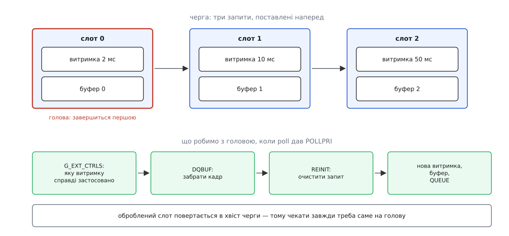

# ⚙️ Три витримки за оберт: програма, яка друкує заявлене поруч із застосованим

Ця програма на C знімає безперервну серію кадрів, де витримка міняється щокадру по колу 2 → 10 → 50 мс, і для кожного кадру друкує два числа: те, що замовила програма, і те, що драйвер справді застосував саме до цього кадру. Другий стовпчик — весь сенс затії: він або збігається з першим, або показує, у чому залізо з нами не погодилося.

## Чого варта друга колонка

Без запитів це питання навіть поставити нема як. `VIDIOC_S_CTRL` записує значення «щойно вийде», а `VIDIOC_G_CTRL` після `VIDIOC_DQBUF` віддає поточне значення керування — те, яке стоїть у драйвері **зараз**, і жодного стосунку до щойно забраного кадру воно не має. Два числа є, але вони про різні моменти, тож порівнювати їх безглуздо.

`VIDIOC_G_EXT_CTRLS` із `which = V4L2_CTRL_WHICH_REQUEST_VAL` читає значення **конкретного запиту**, а в цьому запиті лежав рівно той буфер, який ми щойно забрали. Уперше обидва числа говорять про один і той самий кадр — і вперше різниця між ними щось означає.

А різниця буває, і не через помилку. Сенсор має свій діапазон витримки й свій крок, тож замовлене значення він підтягне до найближчого дозволеного. Витримка ще й обмежена кадровим проміжком — так і сказано в описі керування, — тому 50 мс не вміщаються в кадр при тридцяти кадрах на секунду: драйвер або вкоротить витримку, або розтягне сам проміжок. Що саме він зробив, видно лише в другій колонці — помилки він не повертає.

## Задум: три слоти, які йдуть по колу

Один запит у польоті нічого не дає: доки програма розбирає завершений кадр, апаратура стоїть без роботи. Тому запитів заводять стільки, скільки кадрів має бути «в дорозі» одночасно — тут три, по одному на витримку. Кожен слот тримає свій дескриптор запиту й свій буфер; усі три ставлять у чергу ще до `VIDIOC_STREAMON`.

Далі працює один інваріант, на якому тримається вся проста форма циклу. Запити виконуються **в порядку постановки**, а ми ставимо їх по колу — 0, 1, 2, 0, 1, 2. Отже й завершуються вони по тому самому колу, і чекати щоразу треба на голову черги. Слот, який ми щойно обробили й наповнили заново, стає новим хвостом.



*Кількість слотів — це глибина, на яку програма забігає вперед: менше за конвеєрну затримку драйвера — і апаратура періодично простоюватиме.*

Обробка голови — це рівно чотири дії: прочитати з запиту застосоване значення, забрати буфер, очистити запит через `MEDIA_REQUEST_IOC_REINIT` і наповнити його знову. Порядок тут не декоративний: читати керування можна лише із завершеного запиту, а `REINIT` стирає саме те, що ми хочемо прочитати.

## Програма

```c
/* expseries.c — серія кадрів із різними витримками через медіазапити.
 *
 *   cc -O2 -Wall -o expseries expseries.c
 *   ./expseries /dev/media0 /dev/video0 [/dev/v4l-subdev0]
 *
 * Третій аргумент — вузол, якому належить витримка; якщо його немає,
 * керування шукають на самому відеовузлі.
 * Потрібні заголовки ядра 4.20 або новіші.
 */
#include <errno.h>
#include <fcntl.h>
#include <poll.h>
#include <stdio.h>
#include <stdlib.h>
#include <string.h>
#include <sys/ioctl.h>
#include <sys/mman.h>
#include <unistd.h>

#include <linux/media.h>
#include <linux/videodev2.h>

#define NSLOT   3    /* стільки запитів тримаємо в польоті одночасно */
#define FRAMES 12    /* стільки кадрів знімаємо всього */
#define TYPE   V4L2_BUF_TYPE_VIDEO_CAPTURE

/* витримки в одиницях по 100 мкс: 2 мс, 10 мс, 50 мс */
static const int EXPOSURE[NSLOT] = { 20, 100, 500 };

struct slot {
    int    req_fd;   /* дескриптор запиту */
    void  *start;    /* відображений буфер */
    size_t length;
    int    want;     /* витримка, яку ми поклали в цей запит */
};

static void die(const char *what)
{
    fprintf(stderr, "%s: %s\n", what, strerror(errno));
    exit(EXIT_FAILURE);
}

/* ioctl, який не здається на сигналі */
static int xioctl(int fd, unsigned long cmd, void *arg)
{
    int r;
    do { r = ioctl(fd, cmd, arg); } while (r == -1 && errno == EINTR);
    return r;
}

/* ── три дії над вмістом запиту ───────────────────────────────────────── */

/* Покласти витримку В ЗАПИТ. Без request_fd те саме значення пішло б
   у залізо негайно — тобто не в той кадр. */
static int want_exposure(int ctrl_fd, int req_fd, int value)
{
    struct v4l2_ext_control c = { .id = V4L2_CID_EXPOSURE_ABSOLUTE, .value = value };
    struct v4l2_ext_controls ec = {
        .which      = V4L2_CTRL_WHICH_REQUEST_VAL,
        .request_fd = req_fd,
        .count      = 1,
        .controls   = &c,
    };
    return xioctl(ctrl_fd, VIDIOC_S_EXT_CTRLS, &ec);
}

/* Прочитати з ЗАВЕРШЕНОГО запиту те, що драйвер справді застосував. */
static int applied_exposure(int ctrl_fd, int req_fd, int *value)
{
    struct v4l2_ext_control c = { .id = V4L2_CID_EXPOSURE_ABSOLUTE };
    struct v4l2_ext_controls ec = {
        .which      = V4L2_CTRL_WHICH_REQUEST_VAL,
        .request_fd = req_fd,
        .count      = 1,
        .controls   = &c,
    };
    if (xioctl(ctrl_fd, VIDIOC_G_EXT_CTRLS, &ec) == -1)
        return -1;
    *value = c.value;
    return 0;
}

/* Покласти буфер У ЗАПИТ, а не у вхідну чергу драйвера. Прапорець і поле
   пишемо в одному місці: нарізно про друге забувають. */
static int put_buffer(int video_fd, int req_fd, unsigned index)
{
    struct v4l2_buffer b = {
        .type       = TYPE,
        .memory     = V4L2_MEMORY_MMAP,
        .index      = index,
        .flags      = V4L2_BUF_FLAG_REQUEST_FD,
        .request_fd = req_fd,
    };
    return xioctl(video_fd, VIDIOC_QBUF, &b);
}

int main(int argc, char **argv)
{
    const char *media_path = argc > 1 ? argv[1] : "/dev/media0";
    const char *video_path = argc > 2 ? argv[2] : "/dev/video0";
    const char *ctrl_path  = argc > 3 ? argv[3] : NULL;

    struct slot   slot[NSLOT];
    struct pollfd pfd[NSLOT];
    enum v4l2_buf_type type = TYPE;
    int i, head = 0, done = 0;

    int media_fd = open(media_path, O_RDWR);
    if (media_fd == -1)
        die(media_path);

    /* O_NONBLOCK навмисно: DQBUF ми кличемо лише після завершення запиту,
       тож блокуватися він не має права. Якщо все-таки заблокувався б,
       ми побачимо EAGAIN замість тихого зависання. */
    int video_fd = open(video_path, O_RDWR | O_NONBLOCK);
    if (video_fd == -1)
        die(video_path);

    int ctrl_fd = video_fd;
    if (ctrl_path && (ctrl_fd = open(ctrl_path, O_RDWR)) == -1)
        die(ctrl_path);

    /* Чи має ця черга право приймати буфери в запитах.
       count = 0 — проба без побічних дій. */
    struct v4l2_requestbuffers rb = {
        .count = 0, .type = TYPE, .memory = V4L2_MEMORY_MMAP,
    };
    if (xioctl(video_fd, VIDIOC_REQBUFS, &rb) == -1)
        die("VIDIOC_REQBUFS (проба)");
    if (!(rb.capabilities & V4L2_BUF_CAP_SUPPORTS_REQUESTS)) {
        fprintf(stderr, "%s: черга не вміє запитів — далі йти нема куди\n", video_path);
        return EXIT_FAILURE;
    }

    rb.count = NSLOT;
    if (xioctl(video_fd, VIDIOC_REQBUFS, &rb) == -1)
        die("VIDIOC_REQBUFS");
    if (rb.count < NSLOT) {
        fprintf(stderr, "драйвер дав %u буферів замість %d\n", rb.count, NSLOT);
        return EXIT_FAILURE;
    }

    for (i = 0; i < NSLOT; i++) {
        struct v4l2_buffer b = { .type = TYPE, .memory = V4L2_MEMORY_MMAP, .index = i };

        if (xioctl(video_fd, VIDIOC_QUERYBUF, &b) == -1)
            die("VIDIOC_QUERYBUF");
        slot[i].length = b.length;
        slot[i].start  = mmap(NULL, b.length, PROT_READ | PROT_WRITE,
                              MAP_SHARED, video_fd, b.m.offset);
        if (slot[i].start == MAP_FAILED)
            die("mmap");

        if (xioctl(media_fd, MEDIA_IOC_REQUEST_ALLOC, &slot[i].req_fd) == -1)
            die("MEDIA_IOC_REQUEST_ALLOC");
        pfd[i].fd     = slot[i].req_fd;
        pfd[i].events = POLLPRI;
    }

    /* Режим перемикають один раз і напряму: доки автоекспозиція ввімкнена,
       ручну витримку драйвер має право просто ігнорувати. */
    struct v4l2_control mode = {
        .id = V4L2_CID_EXPOSURE_AUTO, .value = V4L2_EXPOSURE_MANUAL,
    };
    if (xioctl(ctrl_fd, VIDIOC_S_CTRL, &mode) == -1)
        fprintf(stderr, "увага: автоекспозицію вимкнути не вдалося (%s)\n",
                strerror(errno));

    /* Три запити наперед: у кожному своя витримка і свій буфер. */
    for (i = 0; i < NSLOT; i++) {
        slot[i].want = EXPOSURE[i];
        if (want_exposure(ctrl_fd, slot[i].req_fd, slot[i].want) == -1)
            die("VIDIOC_S_EXT_CTRLS у запит");
        if (put_buffer(video_fd, slot[i].req_fd, i) == -1)
            die("VIDIOC_QBUF у запит");
        if (xioctl(slot[i].req_fd, MEDIA_REQUEST_IOC_QUEUE, NULL) == -1)
            die("MEDIA_REQUEST_IOC_QUEUE");
    }

    if (xioctl(video_fd, VIDIOC_STREAMON, &type) == -1)
        die("VIDIOC_STREAMON");

    printf(" кадр слот   заявлено  застосовано  буфер  sequence\n");

    while (done < FRAMES) {
        int n = poll(pfd, NSLOT, 2000);

        if (n == -1) {
            if (errno == EINTR)
                continue;
            die("poll");
        }
        if (n == 0) {
            fprintf(stderr, "за 2 с не завершився жоден запит\n");
            break;
        }

        /* Запити виконуються в порядку черги, а ставимо ми їх по колу —
           отже й завершуються вони по колу. Чекаємо саме на голову. */
        while (pfd[head].revents & POLLPRI) {
            struct v4l2_buffer b = { .type = TYPE, .memory = V4L2_MEMORY_MMAP };
            struct slot *s = &slot[head];
            int got = 0;

            if (applied_exposure(ctrl_fd, s->req_fd, &got) == -1)
                die("VIDIOC_G_EXT_CTRLS із запиту");
            if (xioctl(video_fd, VIDIOC_DQBUF, &b) == -1)
                die("VIDIOC_DQBUF");

            printf("%5d %4d %8.1f мс %9.1f мс %6u %9u\n",
                   done, head, s->want / 10.0, got / 10.0, b.index, b.sequence);

            /* тут була б робота з пікселями: s->start, b.bytesused */

            if (xioctl(s->req_fd, MEDIA_REQUEST_IOC_REINIT, NULL) == -1)
                die("MEDIA_REQUEST_IOC_REINIT");

            /* Наступне значення в справжній програмі дав би регулятор
               яскравості; тут слот просто лишається на своїй витримці. */
            s->want = EXPOSURE[head];
            if (want_exposure(ctrl_fd, s->req_fd, s->want) == -1)
                die("VIDIOC_S_EXT_CTRLS у запит");
            if (put_buffer(video_fd, s->req_fd, b.index) == -1)
                die("VIDIOC_QBUF у запит");
            if (xioctl(s->req_fd, MEDIA_REQUEST_IOC_QUEUE, NULL) == -1)
                die("MEDIA_REQUEST_IOC_QUEUE");

            pfd[head].revents = 0;
            head = (head + 1) % NSLOT;
            if (++done >= FRAMES)
                break;
        }
    }

    if (xioctl(video_fd, VIDIOC_STREAMOFF, &type) == -1)
        die("VIDIOC_STREAMOFF");
    for (i = 0; i < NSLOT; i++) {
        close(slot[i].req_fd);
        munmap(slot[i].start, slot[i].length);
    }
    if (ctrl_fd != video_fd)
        close(ctrl_fd);
    close(video_fd);
    close(media_fd);
    return 0;
}
```

Тут навмисно немає всього, що запитів не стосується: вибору формату, розбору пікселів, підрахунку кадрів за секунду. Ця частина однакова для будь-якої зйомки й розібрана окремо — у [програмі звичайного циклу зйомки без запитів](topic:unix-linux/v4l2-video-devices/proj-capture-loop.md).

## Як її запускати й що вона друкує

Третій аргумент — вузол, якому належить витримка. На простих драйверах керування живе на самому відеовузлі й аргумент не потрібен; на камерах, зібраних із графа, витримка належить вузлу сенсора, і знайти потрібний `/dev/v4l-subdevN` допомагає [обхід графа медіапристрою](topic:unix-linux/media-controller-graph). Саме тому в програмі два окремі дескриптори — один для керувань, другий для буферів: вузли різні, а запит один на всіх.

На драйвері, який тримає тридцять кадрів на секунду, вивід може виглядати так:

```
 кадр слот   заявлено  застосовано  буфер  sequence
    0    0      2.0 мс      2.0 мс      0         0
    1    1     10.0 мс     10.0 мс      1         1
    2    2     50.0 мс     33.2 мс      2         2
    3    0      2.0 мс      2.0 мс      0         3
```

Третій рядок і є вся користь від другої колонки: 50 мс не влізли в кадровий проміжок, драйвер укоротив витримку до 33.2 мс і нікому про це не сказав. Помилки немає, кадр є, яскравість не та, яку планували. Без запиту таке шукали б днями.

Перевірити, що зв'язок справді тримається, а не здається, можна найгрубішим способом: додати в цикл підрахунок середньої яскравості по буферу й друкувати її четвертою колонкою. Із запитами темні й світлі кадри йдуть рівно тим колом, що й надруковані витримки, і так само з першого ж кадру. Якщо ту саму зйомку зробити звичайним `VIDIOC_S_CTRL` між кадрами, коло яскравості буде те саме, але зсунуте на конвеєрну затримку драйвера — і зсув поїде знову, щойно машину навантажать чимось іще.

## Регулятор замість сталого кола

Стале коло з трьох витримок — найпростіше, що можна покласти в цю програму, і водночас каркас для набагато цікавішого. Рядок `s->want = EXPOSURE[head]` — єдине місце, де вирішують, яким буде наступний кадр; замініть його на обчислення з щойно забраного буфера, і вийде автоекспозиція: порахували яскравість `s->start`, порівняли з бажаною, посунули витримку в потрібний бік.

Але глибина кільця тут перестає бути дрібницею. У мить, коли ми наповнюємо звільнений слот, поперед нього в черзі стоять іще два запити — тож нове значення подіє аж на третьому кадрі від цієї миті. Це чиста затримка в петлі зворотного зв'язку. Регулятор, який про неї не знає й щоразу цілиться просто в потрібну яскравість, устигне зробити три однакові виправлення на ту саму помилку — і промахнеться втричі, потім у другий бік, і так далі. Ліки звичайні для будь-якої петлі із затримкою: або рухати витримку частками потрібної поправки, або тримати кільце якомога коротшим. Друге дешевше, і саме тому `NSLOT` не беруть «із запасом побільше», хоча пам'яті на це вистачило б.

## Пастки

**`request_fd`, залишений нулем.** Найпідступніша з усіх, бо структури заповнюють призначеними ініціалізаторами, а ті мовчки занулюють решту полів. Прапорець `V4L2_BUF_FLAG_REQUEST_FD` виставлено, поле `request_fd` — нуль, буфер у запит не потрапив, і `MEDIA_REQUEST_IOC_QUEUE` повертає `ENOENT`: у запиті немає жодного буфера. Лікується не уважністю, а структурою: прапорець і поле пишуться в одному місці — тому в програмі є `put_buffer()`, а не голий `VIDIOC_QBUF` на кожен виклик.

**Змішані буфери.** Перший `VIDIOC_QBUF` вирішує спосіб на всю сесію зйомки: або всі буфери йдуть через запити, або жоден. Спроба покласти буфер напряму після того, як хоч один пішов у запиті, дає `EBUSY` — і навпаки. Найчастіше на цьому горить код, який ставить кілька буферів «на прогрів» перед головним циклом.

**Читання керувань зарано.** `VIDIOC_G_EXT_CTRLS` на запиті, що стоїть у черзі й ще не завершився, повертає `EACCES`: значення в цю мить може змінитися будь-коли, і ядро радше відмовляє, ніж віддає напівправду. Звідси й порядок у циклі — спершу `poll` дав `POLLPRI`, і лише потім читання. Симетрична помилка з іншого боку: `poll` на щойно виділеному запиті, який ще не поставили в чергу, одразу поверне `POLLERR`, а не чекатиме.

**Забутий `REINIT`.** Другий `MEDIA_REQUEST_IOC_QUEUE` на тому самому дескрипторі без очищення дає `EBUSY` — з погляду ядра цей запит уже ставили. Парна до неї помилка: `REINIT` зробили, а наповнити забули, і `QUEUE` падає з `ENOENT` — очищений запит порожній так само, як щойно виділений.

**Здогад замість числа.** У наповненні слота стоїть `put_buffer(..., b.index)`, а не `put_buffer(..., head)`, хоча на цьому колі обидва вирази дають одне й те саме. Різниця в тому, звідки береться число: `b.index` — це буфер, який щойно повернуло ядро, а `head` — наше уявлення про те, який мав повернутися. Поки уявлення правильне, різниці немає; коли воно поїде — а поїде воно від першої ж зміни в циклі, — перший варіант просто покладе назад те, що взяв, а другий почне ставити в чергу чужий буфер. Правило просте: у запит вертають той буфер, який із нього вийшов.

## Скільки це коштує

На кожен кадр припадає сім системних викликів: `poll`, `VIDIOC_G_EXT_CTRLS`, `VIDIOC_DQBUF`, `MEDIA_REQUEST_IOC_REINIT`, `VIDIOC_S_EXT_CTRLS`, `VIDIOC_QBUF`, `MEDIA_REQUEST_IOC_QUEUE`.

```
30 кадрів/с × 7 викликів = 210 викликів/с
```

Двісті десять викликів на секунду — це ніщо навіть для найповільнішої плати. Головне ж не в їхній кількості: у циклі немає жодного виділення пам'яті. Запити виділяють один раз на старті, буфери відображають один раз, а `REINIT` замість `close` + нового `MEDIA_IOC_REQUEST_ALLOC` існує саме для того, щоб дескриптори не текли крізь цикл зйомки. Витрата пам'яті стала й дорівнює трьом кадрам плюс три невеликі об'єкти ядра.

Єдиний параметр, який справді треба підбирати, — `NSLOT`. Знизу його підпирає конвеєрна затримка драйвера: якщо апаратура тримає в роботі два кадри, а слотів теж два, то кожен оберт вона чекатиме, доки програма поверне слот у чергу. Згори — не пам'ять (три-чотири кадрові буфери нікого не розорять), а та сама затримка в петлі: кожен зайвий слот відсуває будь-яке рішення програми на кадр далі. Для сталої серії з трьох витримок це нічого не міняє й помилятися варто вгору; для програми, яка на щось реагує, зайва глибина — це прямий програш.
