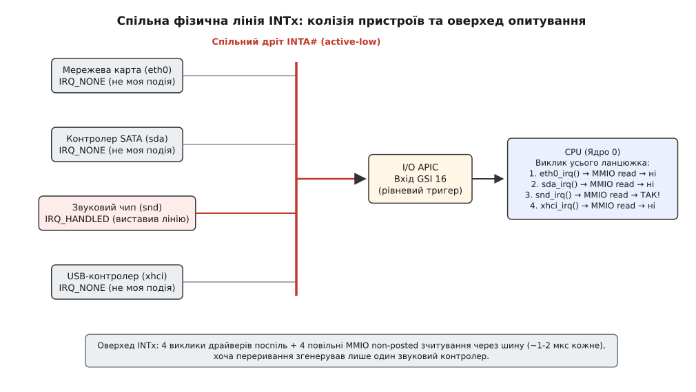
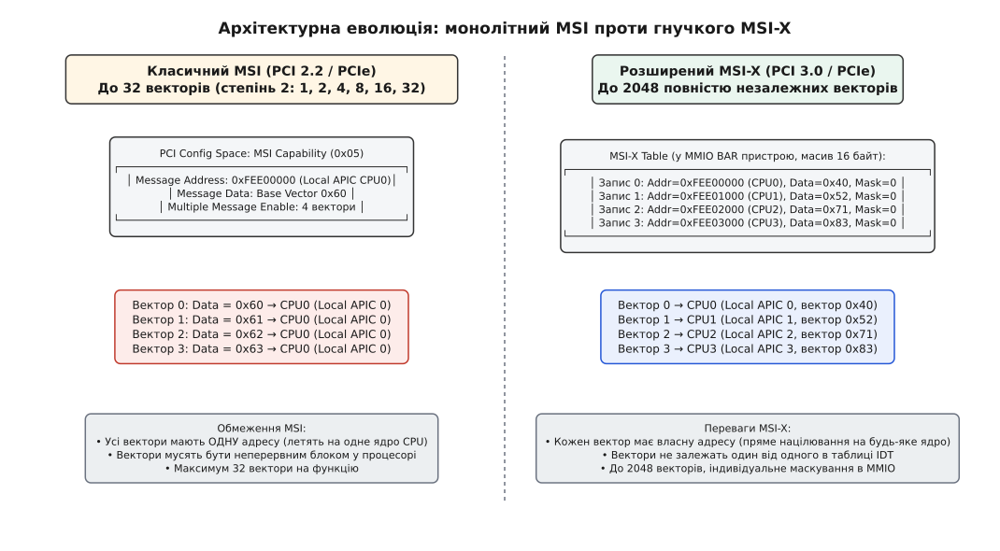
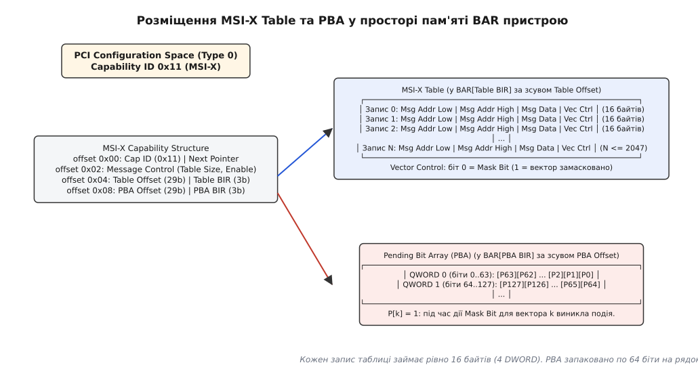
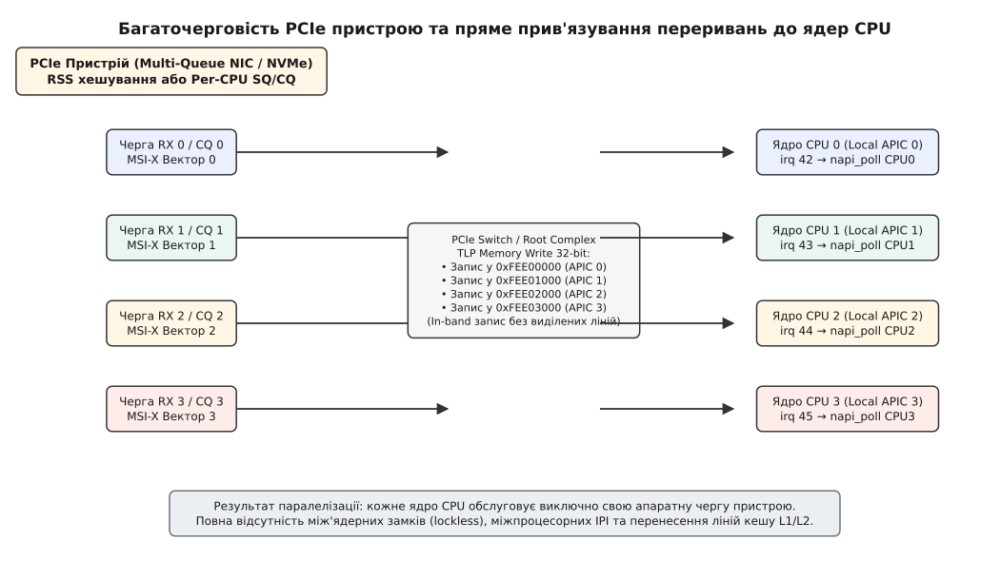

# Переривання MSI та MSI-X: від лінії INTx до запису в пам'ять

<preknowlist>
- [Файл пристрою: символьний і блоковий](book:unix-linux/device-file-model) — доступ до апаратних вузлів організовано через вузли файлової системи, а передавання даних спирається на внутрішні структури ядра.
- [DMA і відображення буферів у ядрі](book:unix-linux/dma-and-buffers) — периферійні контролери самостійно переносять дані в системну оперативну пам'ять фізичними адресами без участі процесора.
- [Переривання, softirq і робочі черги](book:unix-linux/interrupts-bottom-halves) — обробка апаратного сигналу розділена на синхронну верхню половину та асинхронні відкладені механізми.
- [Шина PCI та адресні простори](book:unix-linux/pci-in-linux) — конфігураційний простір, базові адресні регістри BAR та транзакції адресації на шині.
- [Контролер переривань: irqchip та irq_domain](book:unix-linux/irq-chip-and-domain) — відображення апаратних ліній контролера на віртуальні номери векторів ядра Linux.
</preknowlist>

## Тупик чотирьох дротів на спільній шині

Коли мережевий контролер на гігабітній швидкості приймає пакет або накопичувач завершує читання сектора з пластини, центральний процесор мусить дізнатися про подію за частки мікросекунди. Процесор не може витрачати такти на безупинне опитування регістрів тисяч периферійних вузлів: йому потрібен прямий апаратний сигнал.

У первісній специфікації шини PCI (англ. *Peripheral Component Interconnect*) зв'язок між картою розширення та системним контролером переривань було вирішено в лоб: прокладанням фізичних мідних доріжок на материнській платі. Кожен слот шини отримав чотири апаратні лінії переривань — `INTA#`, `INTB#`, `INTC#` та `INTD#` (символ `#` позначає активний низький рівень напруги, англ. *active-low*). Багатофункційний пристрій міг використовувати до чотирьох ліній (по одній на функцію), а однофункційні карти завжди підключалися до лінії `INTA#`.

Фізично ці лінії спроєктовано за схемою з відкритим колектором (англ. *open-drain / open-collector*) із підтягувальним резистором до лінії живлення. Це означає, що переривання є рівневим (англ. *level-triggered*): коли пристрою треба привернути увагу процесора, його транзистор відкривається і примусово притискає напругу на спільній лінії до нуля вольтів (логічний нуль). Лінія залишається притиснутою до землі доти, доки драйвер у ядрі операційної системи не виконає команду скидання статусного регістра в самому пристрої.


*Спільний дріт INTA# притискається до нуля будь-яким активним пристроєм; ядро змушене послідовно викликати всі зареєстровані обробники ланцюжка, виконуючи повільні MMIO-читання.*

Проблема виникла там, де кількість пристроїв перевищила кількість фізичних ліній. Стандартний південний міст материнської плати або контролер I/O APIC (англ. *Advanced Programmable Interrupt Controller*) мав усього від 16 до 24 входів переривань (GSI, англ. *Global System Interrupt*). Якщо на материнській платі розташовано 6 слотів PCI, кожен із яких підтримує до 8 функцій, система потенційно має 48 джерел сигналів на 4 фізичні лінії шини.

Щоб лінії не перевантажувалися на першому ж дроті, стандартом було введено циклічне зміщення підключення ліній у мостах PCI-to-PCI (англ. *bridge swizzling*). Для слота з номером `slot` і лінії дочірнього пристрою `pin_child` (де `INTA# = 1`, `INTB# = 2`, `INTC# = 3`, `INTD# = 4`) вихідна лінія на батьківській шині обчислювалася за формулою:

```
pin_parent = ((pin_child - 1 + slot) mod 4) + 1
```

Зсув розподіляв навантаження між чотирма доріжками, але не рятував від головного: лінії неминуче об'єднувалися в єдині електричні вузли. Переривання ставало спільним (англ. *shared IRQ*).

Коли чотири різні контролери — мережева карта, звуковий чип, контролер жорстких дисків та USB-хост — висять на одній лінії `INTA#`, контролер I/O APIC бачить лише факт падіння напруги на вході. Він повідомляє процесору номер глобального вектора, але не має жодного уявлення, який саме з чотирьох пристроїв притиснув лінію.

У цей момент ядро операційної системи змушене запускати ланцюжок спільних обробників (англ. *interrupt service routine chain*). Ядро послідовно викликає функцію обробника кожного зареєстрованого драйвера:

1. Драйвер мережевої карти звертається до свого пристрою через шину й читає регістр стану.
2. Якщо прапорець події не виставлено, драйвер повертає `IRQ_NONE`.
3. Ядро викликає наступний обробник — драйвер дискового контролера. Той знову робить читання регістрів через шину й повертає `IRQ_NONE`.
4. Драйвер звукової карти зчитує свої регістри, бачить біт завершення відтворення буфера, скидає його записом у регістр і повертає `IRQ_HANDLED`.
5. Ядро переходить до четвертого драйвера, щоб переконатися, що лінію більше ніхто не тримає.

Головна руйнівна ціна цього процесу криється у фізиці зчитування MMIO (англ. *Memory-Mapped I/O*). Читання регістра на шині PCI/PCIe є непотоковою транзакцією (англ. *non-posted transaction*): процесорне ядро виставляє запит на читання через системний міст і повністю зупиняє виконання конвеєра інструкцій, очікуючи на повернення пакета відповіді з даними (англ. *Completion with Data*). На звичайній шині PCI такий раунд-трип забирає від 500 наносекунд до 2 мікросекунд.

Чотири послідовні зчитування статусів порожніх пристроїв на одне реальне переривання спалювали тисячі тактів процесора. За високого навантаження виникали «шторми переривань» (англ. *interrupt storms*), коли ядра процесора проводили 80% часу в холостому опитуванні чужих регістрів по заблокованій шині. Детальний історичний контекст того, як розробники апаратних стандартів боролися з цією кризою, наведено в нарисі [від дротів до повідомлень](book:unix-linux/msi-x-interrupts/hist-from-wires-to-messages.md).

## Перегони даних DMA та необхідність скидання буферів

Крім втрати продуктивності, фізичні лінії INTx створювали фундаментальну проблему цілісності даних у багатопроцесорних системах — розсинхронізацію між прямим доступом до пам'яті (DMA) та сигналом переривання.

Шина PCI та її спадкоємиця PCI Express працюють за моделлю розділених транзакцій. Запис даних пристроєм у системну оперативну пам'ять (DMA write) є потоковою транзакцією (англ. *posted write*). Пристрій відправляє байти в бік процесора й не чекає на підтвердження: системний міст (Root Complex) приймає пакети у свої внутрішні FIFO-буфери і повертає шині статус успіху, поки самі дані ще рухаються до контролера оперативної пам'яті DDR.

Фізична лінія `INTA#` — це окремий електричний дріт, сигнал по якому поширюється зі швидкістю світла в міді (~15–20 см за наносекунду) прямо в обхід черг буферів шини.

```
+-------------------------------------------------------------------+
| Хронологія розсинхронізації DMA та лінії INTx:                    |
|                                                                   |
| 1. Мережева карта: DMA-запис пакета 1500 байт у RAM (Posted TLP)  |
|    → Пакети застрягають у FIFO-буфері проміжного PCIe-комутатора  |
|                                                                   |
| 2. Мережева карта: притискає дріт INTA# до 0V (миттєвий сигнал)   |
|                                                                   |
| 3. Local APIC процесора отримує переривання й будити ISR драйвера  |
|                                                                   |
| 4. CPU читає дескриптор пакета з RAM: ТАМ СТАРЕ СМІТТЯ!          |
|    (Дані DMA ще не виштовхнуті з FIFO-буферів комутатора)         |
+-------------------------------------------------------------------+
```

Щоб запобігти зчитуванню неповних або пошкоджених даних, драйвер був зобов'язаний перед обробкою буфера виконати «скидальне читання» (англ. *flush read*) — зробити синхронне читання будь-якого довільного регістра свого пристрою через шину. Згідно з правилами впорядкування шини PCI (англ. *PCI transaction ordering rules*), транзакція читання не має права обігнати попередні потокові записи (posted writes) у тому самому напрямку. Тільки коли відповідь на читання поверталася, драйвер отримував апаратну гарантію, що байти DMA фізично лягли в оперативну пам'ять.

Це означало, що повільне, блокувальне зчитування через шину було не просто наслідком спільних ліній, а обов'язковою умовою коректності кожного переривання INTx. Архітектура вимагала докорінної зміни: переривання мало стати частиною того самого потоку даних, що й сам DMA.

## MSI: переривання як транзакція запису в пам'ять

Рішення з'явилося у специфікації PCI 2.2 і стало базовим стандартом для PCI Express під назвою Message Signaled Interrupts (MSI).

Головна концептуальна ідея MSI полягає у відмові від будь-яких виділених ліній переривань. Замість зміни напруги на фізичному контакті пристрій сигналізує про подію так само, як записує дані в пам'ять: шляхом виконання стандартної 32-бітної транзакції запису (англ. *Memory Write TLP* у термінах PCI Express) за наперед визначеною системною адресою.

У комп'ютерній архітектурі x86/x86_64 для доставки переривань зарезервовано спеціальне вікно фізичної пам'яті в діапазоні `0xFEE00000`–`0xFEEFFFFF`. Цей діапазон фізично перехоплюється системним системним агентом (Root Complex) або шиною процесора і ніколи не транслюється в модуль оперативної пам'яті DRAM. Коли туди надходить транзакція запису, системний агент розбирає її як команду доставки переривання у внутрішній блок Local APIC конкретного процесорного ядра.

```
Формат адреси повідомлення MSI в архітектурі x86 (32 біти):
 31                  20 19          12 11     4 3   2 1 0
┌──────────────────────┬──────────────┬────────┬─────┬───┐
│     0xFEE (фіксовано)│ Destination  │ Резерв │ RH  │DM │XX │
│      (20 бітів)      │   APIC ID    │ (8 б)  │(1б) │(1)│(2)│
└──────────────────────┴──────────────┴────────┴─────┴───┘
```

Поля адреси кодують адресата:
- **Біти 31:20 (`0xFEE`)** — базовий магічний префікс, за яким апаратура розпізнає транзакцію переривання.
- **Біти 19:12 (`Destination ID`)** — фізичний або логічний APIC ID цільового процесорного ядра, яке має прийняти переривання.
- **Біт 3 (`RH`, Redirection Hint)** — `0` означає пряму доставку процесору, вказаному в Destination ID; `1` дозволяє системі направити переривання ядру з найнижчим пріоритетом.
- **Біт 2 (`DM`, Destination Mode)** — `0` для фізичної адресації APIC, `1` для логічної кластерної адресації.

Разом з адресою пристрій записує 32-бітне слово даних (DWORD), корисне навантаження якого займає молодші 16 бітів (англ. *Message Data*):

```
Формат даних повідомлення MSI (Message Data, 16 бітів):
 15  14  13 11 10   8 7                                 0
┌───┬───┬─────┬──────┬───────────────────────────────────┐
│TM │LV │Рез. │ Deliv│    Вектор переривання (0x20..0xFF)│
│(1)│(1)│(3 б)│ Mode │       в таблиці IDT ядра CPU      │
└───┴───┴─────┴──────┴───────────────────────────────────┘
```

Поля даних визначають спосіб обробки в ядрі:
- **Біти 7:0 (`Interrupt Vector`)** — точний номер вектора в таблиці дескрипторів переривань (IDT, англ. *Interrupt Descriptor Table*) процесора (діапазон 32–255, оскільки перші 32 вектори зарезервовані процесором під винятки на кшталт Page Fault або Divide Error).
- **Біти 10:8 (`Delivery Mode`)** — режим доставки (зазвичай `000` — фіксований вектор Fixed).
- **Біт 14 (`Level`)** — рівень сигналу (для MSI завжди `1`, активний стан).
- **Біт 15 (`Trigger Mode`)** — режим тригера (`0` — фронтальний, англ. *edge-triggered*).

Цей механізм автоматично вирішує проблему синхронізації DMA. Оскільки повідомлення MSI — це звичайний пакет Memory Write, воно надсилається в тому самому віртуальному каналі шини (VC0), що й попередні DMA-пакети даних. Правила впорядкування PCIe гарантують: пакет переривання **не може обігнати** пакети DMA, що були відправлені перед ним.

Коли процесор отримує переривання MSI, дані гарантовано вже лежать у системній пам'яті. Необхідність у повільних блокувальних «скидальних читаннях» через шину повністю зникає.


*Класичний MSI націлює всю групу степеня двійки векторів на єдиний Local APIC; MSI-X містить повнорозмірну таблицю в MMIO BAR, даючи кожному вектору індивідуальну адресу.*

## Структура Capability MSI та її архітектурні глухі кути

Для конфігурації MSI у стандартному 256-байтовому конфігураційному просторі пристрою PCI виділяється структура можливості (англ. *MSI Capability Structure*) з ідентифікатором `0x05`.

```
Розкладка регістрів MSI Capability:
Зсув  Розмір   Призначення
0x00  1 байт   Capability ID (завжди 0x05)
0x01  1 байт   Next Pointer (вказівник на наступну структуру в списку)
0x02  2 байти  Message Control Register (керування та статус)
0x04  4 байти  Message Address Lower (молодші 32 біти адреси)
0x08  4 байти  Message Address Upper (старші 32 біти для 64-бітної адресації, опційно)
0x0C  2 байти  Message Data (значення даних вектора)
0x10  4 байти  Mask Bits (32-бітна бітова маска блокування векторів, опційно)
0x14  4 байти  Pending Bits (32-бітна бітова маска відкладених подій, опційно)
```

Регістр `Message Control` кодує можливості пристрою:
- **Біт 0 (`MSI Enable`)** — увімкнення генерації MSI-повідомлень замість емуляції INTx.
- **Біти 3:1 (`Multiple Message Capable, MMC`)** — апаратна кількість векторів, які підтримує пристрій. Вона кодується як степінь двійки: `2^N`, де `N` від 0 до 5 (тобто 1, 2, 4, 8, 16 або 32 вектори).
- **Біти 6:4 (`Multiple Message Enable, MME`)** — кількість векторів, яку операційна система фактично виділила пристрою (також степінь двійки).
- **Біт 7 (`64-bit Address Capable`)** — підтримка 64-бітної адреси повідомлення.
- **Біт 8 (`Per-vector Masking Capable`)** — наявність регістрів маскування Mask/Pending Bits.

Попри колосальний крок уперед порівняно з INTx, базовий MSI зіткнувся з чотирма важкими архітектурними обмеженнями, які унеможливили його застосування у багатоядерних серверах:

1. **Жорстке обмеження степенем двійки.** Якщо мережевій карті потрібно 5 векторів переривань (наприклад, 4 черги пакетів і 1 лінія помилок), ядро змушене виділяти 8 неперервних векторів у таблиці IDT процесора. Три вектори марнуються.
2. **Спільна адреса для всіх векторів.** Структура MSI Capability має лише **один** регістр `Message Address`. Це означає, що всі 32 вектори пристрою відправляються за однією й тією самою системною адресою `0xFEE00000 | (APIC_ID << 12)`. Усі переривання багаточергового пристрою неминуче потрапляють на **одне й те саме ядро процесора**.
3. **Неперервність номерів векторів у даних.** Пристрій має один базовий регістр `Message Data`. Коли карта генерує переривання для внутрішньої черги `k`, вона просто замінює молодші біти базового слова даних на число `k`:
   ```
   vector_sent = (Message_Data & ~((1 << MME) - 1)) | (k & ((1 << MME) - 1))
   ```
   Це вимагає від операційної системи знайти в таблиці дескрипторів переривань процесора блок із `2^N` підряд ідучих вільних номерів, що за тривалої роботи системи спричиняє сильну фрагментацію простору IDT.
4. **Стеля у 32 вектори.** Для сучасного адаптера 100GbE або NVMe-накопичувача на 64–128 черг 32 векторів недостатньо навіть для базової роботи.

## MSI-X: динамічні таблиці та масштабування до тисяч ядер

Щоб подолати обмеження базового MSI, консорціум PCI-SIG у специфікації PCI 3.0 та PCI Express впровадив розширений стандарт — MSI-X (англ. *Extended Message Signaled Interrupts*).

Головна зміна архітектури полягає у винесенні параметрів повідомлень із тісного конфігураційного простору PCI безпосередньо в адресувану пам'ять самого пристрою (MMIO BAR). У конфігураційному просторі залишилася лише компактна 12-байтова структура MSI-X Capability (ID `0x11`), яка містить покажчики на дві таблиці у просторі BAR:

```
Розкладка регістрів MSI-X Capability:
Зсув  Розмір   Призначення
0x00  1 байт   Capability ID (завжди 0x11)
0x01  1 байт   Next Pointer (вказівник на наступну структуру)
0x02  2 байти  Message Control (розмір таблиці, увімкнення, загальна маска)
0x04  4 байти  Table Offset (29 бітів) + Table BIR (молодші 3 біти)
0x08  4 байти  PBA Offset (29 бітів) + PBA BIR (молодші 3 біти)
```

Поле `Table Size` у регістрі `Message Control` займає 11 бітів і кодує розмір таблиці як `N - 1`. Це дозволяє пристрою мати до `2048` повністю незалежних векторів переривань (`0x000`..`0x7FF`), причому кількість векторів не обов'язково має бути степенем двійки.

Поля `BIR` (англ. *BAR Indicator Register*, біти 2:0) вказують, у якому саме базовому адресному регістрі (від BAR0 до BAR5) розташовані таблиці, а біти 31:3 задають 8-байтово вирівняний зсув від початку цього BAR.


*Структура MSI-X Capability у конфігураційному просторі вказує на зміщення таблиці MSI-X Table та масиву PBA у відповідних регістрах BAR пристрою.*

Сама таблиця `MSI-X Table` є звичайним масивом структур у пам'яті MMIO пристрою. Кожен запис таблиці займає рівно 16 байтів (4 слова DWORD):

```
Структура одного запису MSI-X Table (16 байтів):
Зсув    Розмір   Поле               Опис
0x00    4 байти  Msg Addr Lower     Молодші 32 біти системної адреси переривання
0x04    4 байти  Msg Addr Upper     Старші 32 біти адреси (для 64-бітної платформи)
0x08    4 байти  Msg Data           32-бітні дані (вектор IDT, Delivery Mode)
0x0C    4 байти  Vector Control     Біт 0: Mask Bit (1 = вектор замасковано)
```

Кожен вектор із двох тисяч отримує **власну незалежну адресу** і **власні дані**. Вектор 0 може містити адресу Local APIC процесорного ядра 0 (`0xFEE00000`) із вектором `0x42`, а вектор 1 — адресу Local APIC ядра 63 (`0xFEE3F000`) із вектором `0x87`. Операційній системі більше не потрібно шукати неперервні діапазони векторів у процесорі, а трафік переривань можна ідеально розсіювати по всій топології NUMA.

## Pending Bit Array (PBA) та техніка індивідуального маскування

Під час зміни конфігурації черги або міграції переривання на інше ядро процесора операційна система мусить тимчасово заборонити пристрою генерацію конкретного переривання.

У MSI-X це робиться безпосередньо у відповідному рядку таблиці: ядро записує `1` у молодший біт поля `Vector Control` (біт `Mask Bit`). Пристрій миттєво припиняє відправку повідомлень Memory Write для цього вектора.

Однак події в залізі не зупиняються: пакети продовжують надходити в кільцевий буфер мережевої карти, а дискові транзакції — завершуватися. Щоб подія не загубилася, апаратна частина використовує масив відкладених бітів — PBA (англ. *Pending Bit Array*).

PBA являє собою бітовий масив, де кожному вектору таблиці відповідає рівно один біт (`0` або `1`). Масив упаковано у 64-бітні елементи QWORD. Якщо вектор `k` замасковано (`Mask Bit == 1`), але в пристрої виникає подія, яка вимагає виклику цього переривання, внутрішня логіка контролера виставляє біт `k` у масиві PBA:

```
Номер QWORD у масиві PBA = k / 64
Позиція біта всередині QWORD = k % 64
```

Коли операційна система завершує реконфігурацію і скидає `Mask Bit` у `0`, контролер перевіряє відповідний біт у PBA. Якщо біт дорівнює `1`, пристрій негайно відправляє відкладене повідомлення Memory Write по шині PCIe і автоматично скидає біт у PBA. Жодна апаратна подія не втрачається.

> 🔧 **Навіщо це.** Знання розкладки MSI-X Table та PBA у просторі MMIO дозволяє напряму контролювати пристрої через механізм VFIO (англ. *Virtual Function I/O*) з простору користувача. Замість написання модуля ядра користувацький драйвер (наприклад, у DPDK чи SPDK) мапить відповідний BAR у свій віртуальний простір пам'яті через `mmap()`, програмує вектори в MSI-X Table і прив'язує дескриптори подій `eventfd` через ioctl `VFIO_DEVICE_SET_IRQS`.

## Багаточерговість заліза: зв'язок MSI-X із RSS та чергами NVMe

Справжня революція у швидкодії мережевого та дискового підсистем Linux відбулася завдяки поєднанню MSI-X з архітектурами апаратної багаточерговості (англ. *Hardware Multi-Queue*).

У класичній одночерговій моделі всі пакети з мережі складалися в єдиний кільцевий буфер RX Ring, який обслуговувався одним перериванням. Усі процесорні ядра багатоядерного сервера боролися за один спинлок черги, скидаючи кеші L1/L2 одне одного (англ. *cache-line bouncing*).

MSI-X дозволив побудувати архітектуру без блокувань (англ. *lockless shared-nothing architecture*):

```
Топологія зв'язку черг RSS / NVMe та ядер CPU:
Черга пристрою       Вектор MSI-X       PCIe Memory Write     Local APIC     Ядро CPU & NAPI Poll
┌──────────────┐    ┌──────────────┐    ┌─────────────────┐   ┌────────────┐   ┌────────────────────┐
│ RX Queue 0   │───>│ MSI-X Vec 0  │───>│ Write 0xFEE00000│──>│ APIC ID 0  │──>│ CPU 0 (Local SoftIRQ)│
├──────────────┤    ├──────────────┤    ├─────────────────┤   ├────────────┤   ├────────────────────┤
│ RX Queue 1   │───>│ MSI-X Vec 1  │───>│ Write 0xFEE01000│──>│ APIC ID 1  │──>│ CPU 1 (Local SoftIRQ)│
├──────────────┤    ├──────────────┤    ├─────────────────┤   ├────────────┤   ├────────────────────┤
│ RX Queue 2   │───>│ MSI-X Vec 2  │───>│ Write 0xFEE02000│──>│ APIC ID 2  │──>│ CPU 2 (Local SoftIRQ)│
├──────────────┤    ├──────────────┤    ├─────────────────┤   ├────────────┤   ├────────────────────┤
│ RX Queue 3   │───>│ MSI-X Vec 3  │───>│ Write 0xFEE03000│──>│ APIC ID 3  │──>│ CPU 3 (Local SoftIRQ)│
└──────────────┘    └──────────────┘    └─────────────────┘   └────────────┘   └────────────────────┘
```

1. **Мережеві адаптери (RSS, Receive Side Scaling).** Апаратний контролер карти обчислює симетричний хеш Toeplitz за заголовками вхідного IP/TCP пакета (`src_ip`, `dst_ip`, `src_port`, `dst_port`). За молодшими бітами хешу пакет спрямовується у відповідну чергу `RX Ring N`. Черга `N` прив'язана до вектора `MSI-X N`, який націлено на ядро `CPU N`. Ядро отримує переривання, запускає цикл опитування NAPI (англ. *New API*) і обробляє мережевий стек повністю локально на власному кеші процесора.
2. **Накопичувачі NVMe (Non-Volatile Memory Express).** Протокол NVMe підтримує до 64 000 черг подання (Submission Queue) та завершення (Completion Queue). Драйвер ядра створює рівно по одній парі SQ/CQ на кожне доступне ядро CPU системи. Переривання від кожної CQ призначається на власний вектор MSI-X цього ядра. Потік, що виконує системний виклик `write()`, надсилає команду в локальну чергу ядра й на тому самому ядрі отримує апаратне сповіщення про завершення I/O.


*Апаратне розкладання завдань по незалежних чергах усуває міжпроцесорні IPI та блокування спільних структур ядра.*

## Керування спорідненістю переривань у Linux

Операційна система Linux експортує стан кожного вектора переривання через віртуальну файлову систему `procfs`.

Каталог `/proc/irq/<N>/` містить файли налаштування спорідненості (англ. *IRQ Affinity*):
- `smp_affinity` — шістнадцяткова бітова маска процесорних ядер, яким дозволено приймати переривання з номером `N`. Наприклад, значення `00000001` означає виключно ядро CPU0, а `0000000f` — перші чотири ядра CPU0–CPU3.
- `smp_affinity_list` — список ядер у десятковому форматі діапазонів (наприклад, `0-3,8`).

Коли системний адміністратор або фоновий демон `irqbalance` змінює маску у файлі `smp_affinity`:

```
# echo 4 > /proc/irq/125/smp_affinity
```

Ядро Linux не просто змінює внутрішню змінну. Підсистема ядра `irq_chip` знаходить відповідний запис у таблиці `MSI-X Table` фізичного пристрою і перезаписує регістр `Message Address Lower`, підставляючи туди APIC ID процесорного ядра CPU2 (маска `1 << 2 = 4`). Наступний транзакційний пакет від пристрою летить уже за новою адресою на шині.

Статистику спрацьовувань векторів по кожному ядру можна спостерігати у файлі `/proc/interrupts`:

```
           CPU0       CPU1       CPU2       CPU3
 124:  15423019          0          0          0  PCI-MSI-X 524288-edge  eth0-rx-0
 125:         0   18940211          0          0  PCI-MSI-X 524289-edge  eth0-rx-1
 126:         0          0   14029184          0  PCI-MSI-X 524290-edge  eth0-rx-2
 127:         0          0          0   16781923  PCI-MSI-X 524291-edge  eth0-rx-3
```

У стовпці контролера вказано тип `PCI-MSI-X` та режим тригера `edge` (фронтальний). Лічильники чітко демонструють, що кожне ядро монопольно обслуговує свій потік пакетів.

## Роль IOMMU та технологія Interrupt Remapping

У сучасних віртуалізованих серверах пряма відправка повідомлень MSI-X на фізичні адреси Local APIC створює вразливість безпеки: скомпрометований пристрій PCIe або гостьова віртуальна машина з прямим прокиданням карти (PCIe Passthrough) може згенерувати DMA-запис у діапазон `0xFEE00000` із довільним номером вектора, підробивши будь-яке системне переривання хоста (англ. *Interrupt Spoofing*).

Для захисту платформи та подолання 8-бітного ліміту APIC ID виробники процесорів інтегрували в контролер пам'яті IOMMU механізм перенаправлення переривань — Interrupt Remapping (Intel VT-d Interrupt Remapping або AMD IOMMU Interrupt Virtualization).

```
Трансляція переривання через таблицю IRTE:
1. Пристрій відправляє MSI/MSI-X запис:
   Адреса: 0xFEE00000 | (Handle << 2) | SubHandle
   Дані:   Індекс у таблиці IRTE (16 бітів)
                │
                ▼
2. Апаратний блок IOMMU перехоплює запис і знаходить запис у пам'яті:
   IRTE (Interrupt Remapping Table Entry, 128 бітів)
   ┌─────────────────────────────────────────────────────────────┐
   │ Destination: 32-бітний x2APIC ID | Vector: 8 бітів          │
   │ Source-ID Validation: Bus/Dev/Fn пристрою                   │
   └─────────────────────────────────────────────────────────────┘
                │
                ▼
3. IOMMU перевіряє право пристрою генерувати цей вектор і надсилає
   справжнє повідомлення на системну шину процесора.
```

IOMMU бере на себе захист і маршрутизацію:
1. **Валідація джерела (Source-ID Verification).** IOMMU перевіряє, чи збігається ідентифікатор шини, пристрою та функції (BDF, англ. *Bus/Device/Function*) відправника з дозволеним у таблиці IRTE. Гостьова машина не може надіслати чужий вектор.
2. **Підтримка x2APIC.** Класичний формат адреси MSI резервує під APIC ID лише 8 бітів (максимум 255 процесорних ядер). Interrupt Remapping підтримує 32-бітні ідентифікатори ядер x2APIC, дозволяючи адресувати системи з тисячами логічних CPU.

## API ядра Linux для роботи з векторами переривань

У сучасних версіях ядра Linux для драйверів реалізовано єдиний, уніфікований інтерфейс виділення векторів переривань, який повністю замінив старі розрізнені функції `pci_enable_msi()` та `pci_enable_msix_range()`.

Центральною точкою входу є функція:

```c
int pci_alloc_irq_vectors(struct pci_dev *dev,
                          unsigned int min_vecs,
                          unsigned int max_vecs,
                          unsigned int flags);
```

Функція приймає діапазон бажаної кількості векторів (від `min_vecs` до `max_vecs`) і бітову маску підтримуваних типів:
- `PCI_IRQ_MSIX` — запит на використання MSI-X;
- `PCI_IRQ_MSI` — запит на використання класичного MSI;
- `PCI_IRQ_LEGACY` — відкат до фізичної лінії INTx у разі відсутності підтримки MSI;
- `PCI_IRQ_ALL_TYPES` — комбінація всіх трьох типів із пріоритетом у порядку: `MSI-X -> MSI -> INTx`.
- `PCI_IRQ_AFFINITY` — автоматичне призначення масок спорідненості векторів ядрам CPU з урахуванням вузлів NUMA (через допоміжну структуру `struct irq_affinity`).

Функція повертає кількість реально виділених векторів або від'ємний код помилки. Повний перелік сигнатур, прапорців та прикладів використання наведено в [довіднику функцій pci_alloc_irq_vectors](book:unix-linux/msi-x-interrupts/api-pci-irq-vectors.md).

Після успішного виділення драйвер перетворює порядковий індекс вектора пристрою (`0 .. N-1`) у глобальний системний номер переривання Linux за допомогою виклику `pci_irq_vector(dev, nr)`. Отриманий номер передається у стандартні функції реєстрації обробника `request_irq()` або `request_threaded_irq()`.

Практичний приклад створення повноцінного модуля драйвера з автоматичним налаштуванням багаточерговості та перевіркою через інструменти простору користувача детально розібрано в практичному керівництві [каркас драйвера з підтримкою MSI-X](book:unix-linux/msi-x-interrupts/proj-msix-driver-skeleton.md).

## Внутрішня ієрархія доменів ядра: від hwirq до дескриптора Linux

Коли драйвер викликає `pci_alloc_irq_vectors()`, ядро Linux будує багаторівневий зв'язок між апаратною таблицею пристрою та абстракцією переривань ОС.

Для кожного пристрою створюється зв'язний список дескрипторів `struct msi_desc`, прикріплений до `struct pci_dev`. Кожен такий дескриптор зберігає параметри конкретного повідомлення: порядковий номер у таблиці пристрою (`msi_index`), копію адреси та даних повідомлення (`struct msi_msg`), а також вказівник на відповідний віртуальний номер переривання Linux (`irq_num`).

Щоб транслювати апаратний номер повідомлення у системний номер переривання Linux, ядро використовує ієрархічні домени переривань (англ. *Hierarchical IRQ Domains*):

```
Ієрархія доменів переривань у ядрі Linux (x86_64 з IOMMU):
  ┌─────────────────────────────────────────────────────────────┐
  │ PCI MSI Domain (msi_domain_ops)                             │
  │ • Відповідає за запис Address/Data у MSI-X Table в MMIO BAR │
  └──────────────────────────────┬──────────────────────────────┘
                                 │
                                 ▼
  ┌─────────────────────────────────────────────────────────────┐
  │ IRQ Remapping Domain (dmar_domain / amd_iommu_irq_domain)   │
  │ • Виділяє та програмує запис IRTE в таблиці IOMMU           │
  │ • Формує віртуалізовану адресу для PCI MSI Domain           │
  └──────────────────────────────┬──────────────────────────────┘
                                 │
                                 ▼
  ┌─────────────────────────────────────────────────────────────┐
  │ Vector Domain (x86_vector_domain)                           │
  │ • Виділяє вільний 8-бітний вектор (0x20..0xFF) у таблиці IDT│
  │ • Прив'язує вектор до конкретного Local APIC процесора      │
  └──────────────────────────────┬──────────────────────────────┘
                                 │
                                 ▼
  ┌─────────────────────────────────────────────────────────────┐
  │ Local APIC (irq_chip: apic_chip)                            │
  │ • Фізичний приймач на кристалі процесора                    │
  └─────────────────────────────────────────────────────────────┘
```

Кожен рівень ієрархії виконує свою ізольовану задачу:
1. `Vector Domain` знаходить вільний слот у таблиці IDT цільового процесорного ядра (наприклад, вектор `0x42` на ядрі CPU3).
2. Якщо увімкнено IOMMU, `IRQ Remapping Domain` виділяє запис у таблиці IRTE, записує туди цільовий APIC ID та вектор, а для пристрою генерує зашифровану адресу з індексом запису.
3. `PCI MSI Domain` бере готові 64-бітну адресу та 32-бітне слово даних і через функцію `pci_msi_domain_write_msg()` записує їх у рядок таблиці `MSI-X Table` або регістри `MSI Capability`.

## Інспекція стану та діагностика через sysfs

Ядро Linux відкриває внутрішню структуру виділених переривань для простору користувача через ієрархію `sysfs`.

Для кожного PCI-пристрою, що успішно перейшов на MSI або MSI-X, у каталозі `/sys/bus/pci/devices/<BDF>/` створюється підкаталог `msi_irqs/`. У ньому для кожного виділеного вектора створюється окремий вузол, ім'ям якого є системний номер Linux IRQ:

```
$ ls -l /sys/bus/pci/devices/0000:01:00.0/msi_irqs/
total 0
-r--r--r-- 1 root root 4096 Aug 21 10:00 124
-r--r--r-- 1 root root 4096 Aug 21 10:00 125
-r--r--r-- 1 root root 4096 Aug 21 10:00 126
-r--r--r-- 1 root root 4096 Aug 21 10:00 127
```

Зчитування вмісту такого файлу повертає тип вектора (`msix` або `msi`):

```
$ cat /sys/bus/pci/devices/0000:01:00.0/msi_irqs/124
msix
```

Крім того, детальну інформацію про фізичний стан та розміщення таблиць можна отримати за допомогою утиліти `lspci -vvv`:

```
Capabilities: [110] MSI-X: Enable+ Count=4 Masked-
        Vector table: BAR=0 offset=00002000
        PBA:          BAR=0 offset=00003000
```

Рядок показує:
- `Enable+` — генерація MSI-X активована;
- `Count=4` — апаратура підтримує 4 вектори;
- `Masked-` — глобальна маска функції вимкнена;
- `Vector table: BAR=0 offset=00002000` — таблиця розташована у нульовому BAR за зсувом `0x2000`;
- `PBA: BAR=0 offset=00003000` — масив відкладених бітів розташований за зсувом `0x3000`.

## Крайові випадки: вичерпання векторів, збійні чіпсети та динамічний PCIe Hot-plug

На практиці експлуатація систем із тисячами векторів MSI-X стикається з трьома критичними крайовими випадками:

1. **Векторний голод (Vector Exhaustion) на архітектурі x86.**
   Кожне ядро x86 процесора має рівно 256 векторів у таблиці IDT. Вектори `0..31` зарезервовано архітектурою, вектори `128` (`0x80`) та деякі старші зайняті системними викликами, IPI-таймерами та планувальником. Для периферійних пристроїв залишається приблизно 190–200 вільних векторів на ядро. Якщо в системі встановлено 4 мережеві адаптери по 64 черги і всі вони намагаються прикріпити свої переривання до ядру CPU0 без увімкненого IOMMU Interrupt Remapping, ядро вичерпує вектори вже на третьому адаптері. Функція `pci_alloc_irq_vectors()` повертає помилку `-ENOSPC`. Наявність Interrupt Remapping вирішує цю проблему, дозволяючи віртуалізувати та динамічно перерозподіляти вектори.
2. **Апаратні вади та несумісні мости (Broken Chipset Quirks).**
   Деякі старі або спрощені контролери шини PCIe ковтають транзакції Memory Write за адресою `0xFEE00000` або спотворюють дані пакетів. Ядро Linux має вбудовану базу апаратних вад (англ. *PCI quirks*). Якщо знайдено чипсет із відомим дефектом, ядро виставляє прапорець `PCI_DEV_FLAGS_NO_MSI` і автоматично блокує перехід на MSI/MSI-X, змушуючи драйвер відкотитися до ліній INTx. Адміністратор також може форсувати таку поведінку параметром завантаження ядра `pci=nomsi`.
3. **PCIe Hot-Plug та динамічна зміна розміру черг.**
   Під час гарячої заміни пристрою або зміні кількості робочих черг мережевого інтерфейсу командою `ethtool -L eth0 rx 8 tx 8` ядро не просто перезавантажує черги. Воно викликає `pci_free_irq_vectors()`, що обнуляє записи в MSI-X Table, повертає вектори IDT системі, і знову викликає `pci_alloc_irq_vectors()` з новим діапазоном.

## Зведена порівняльна характеристика трьох поколінь

Еволюцію технологій доставки переривань на шині PCI/PCIe можна звести до структурованого порівняння:

```
Характеристика          Legacy INTx         MSI (PCI 2.2)         MSI-X (PCI 3.0 / PCIe)
──────────────────────────────────────────────────────────────────────────────────────────
Фізичний носій сигналу  Виділений мідний    Транзакція Memory     Транзакція Memory
                        дріт (active-low)   Write TLP (DWORD)     Write TLP (DWORD)

Максимальна кількість   4 лінії на слот     32 вектори            2048 векторів
векторів на пристрій    (INTA#..INTD#)      (степінь двійки)      (довільне число)

Спільне використання    Так (shared IRQ     Ні (кожен вектор      Ні (кожен вектор
ліній (лінійний оверхед)ланцюжок обробників)унікальний)           унікальний)

Незалежні адреси        Ні (одна лінія)     Ні (одна спільна      Так (кожен вектор має
(націлювання на ядра)                       адреса на всі)        власний Message Address)

Синхронізація з DMA     Потребує MMIO flush Автоматична           Автоматична
(ordering rules)        читання регістрів   (posted write stream) (posted write stream)

Місце конфігурації      Регістри моста      PCI Config Space      Таблиця в MMIO BAR
                        та I/O APIC         (256 байтів)          пристрою (16 байт / запис)

Індивідуальне           Ні                  Опційно               Так (Mask Bit у таблиці +
маскування векторів                         (Mask Bits регістр)   масив Pending Bit Array)
```

Перехід від фізичних ліній до транзакцій запису в пам'ять трансформував переривання з вузького апаратного пляшкового горла на повноцінний масштабований протокол обміну повідомленнями. Сучасні обчислювальні системи, що обробляють мільйони операцій введення-виведення на секунду, завдячують своєю продуктивністю саме непомітному запису 32-бітного слова за адресою `0xFEE00000`.
