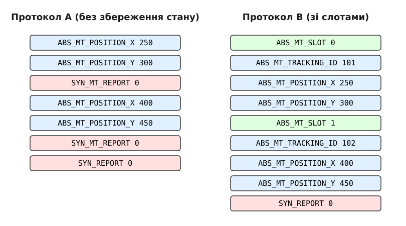

# Протокол мультидотику: слоти, контакти й два способи їх описати

<details>
<summary>Що треба знати перед читанням</summary>

- **Підсистема `input` у Linux**: загальне розуміння того, як ядро передає події (events) від пристроїв вводу у простір користувача через вузли `/dev/input/eventX`.
- **Події та їх типи**: знання про `EV_KEY`, `EV_ABS`, `EV_REL`, `EV_SYN` та структуру `input_event` (час, тип, код, значення).
- **Базові концепції сенсорних екранів**: розуміння координат X та Y, сили натискання та геометрії дотику.
- Мова програмування C (для розуміння прикладів розбору подій).
</details>

Коли ви торкаєтеся екрана смартфона двома пальцями, щоб наблизити фотографію (жест pinch-to-zoom), підсистема вводу вашої операційної системи виконує нетривіальну роботу. Стандартний протокол миші (який передає зміну координат X та Y) не розрахований на те, щоб відслідковувати кілька незалежних точок одночасно. Миша — це один вказівник. Але сенсорний екран чи сучасний тачпад може фіксувати п'ять, десять чи навіть більше одночасних дотиків. Як ядру Linux передати цю інформацію у простір користувача (наприклад, композитному серверу Wayland чи libinput) так, щоб програма зрозуміла, який палець куди рухається, і не сплутала їх між собою? Відповіддю на це стала розробка протоколу Multi-touch (MT) у підсистемі `input`. 

Щоб вирішити цю задачу гнучко і з підтримкою різноманітного апаратного забезпечення, розробники ядра Linux створили два варіанти протоколу мультидотику, відомі як Протокол типу A (Protocol A) та Протокол типу B (Protocol B). Обидва вони використовують події типу `EV_ABS` (абсолютні координати), але застосовують абсолютно різні філософії щодо того, хто повинен відслідковувати стан і рух кожного окремого пальця.

## Проблема відслідковування кількох точок

Уявіть класичну мишу: вона надсилає відносні зміщення (`EV_REL`, `REL_X`, `REL_Y`). Уявіть графічний планшет: він надсилає абсолютні координати (`EV_ABS`, `ABS_X`, `ABS_Y`). В обох випадках події стосуються одного логічного інструмента. Серія подій завершується подією синхронізації `SYN_REPORT`, яка каже простору користувача: "це повний кадр даних, можеш обробляти".

Якщо ми маємо два пальці на екрані, ми не можемо просто послати два `ABS_X` підряд, тому що простір користувача не знатиме, якому з пальців належить перше значення, а якому — друге. Ба більше, під час наступного кадру (коли обидва пальці трохи змістилися), програма має якось зрозуміти, що нове значення X1 стосується першого пальця, а X2 — другого, а не навпаки. Це класична проблема *tracking* (відслідковування).

Апаратні контролери сенсорних панелей бувають різними. Деякі старі або дешеві контролери просто повідомляють: "зараз я бачу два дотики, один тут, інший там". Вони не ідентифікують їх. Наступної мілісекунди вони знову кажуть: "я бачу два дотики, один тут, інший там". Апаратна частина не знає, що дотик 1 у цьому кадрі — це той самий дотик 1 з попереднього кадру. 

Досконаліші контролери мають вбудовану логіку (DSP або мікроконтролер), яка здатна відслідковувати кожен контакт апаратно. Такий контролер каже: "Контакт ID 45 зараз знаходиться на координаті X, Y; Контакт ID 46 знаходиться на X, Y".

Через ці відмінності в "інтелекті" апаратного забезпечення ядру знадобилися два протоколи.

## Протокол A: Stateless (без збереження стану)

Протокол типу A (Stateless) був першою спробою стандартизувати мультидотик у Linux. Він розроблений для "дурного" апаратного забезпечення, яке не вміє відслідковувати контакти.

У Протоколі A ядро передає дані про всі наявні дотики кожен кадр. Воно не ідентифікує, який дотик є яким. Щоб розділити дані одного дотику від іншого в межах одного кадру (між `SYN_REPORT`), використовується спеціальна подія синхронізації — `SYN_MT_REPORT`.

Послідовність подій для двох пальців виглядає так:

1. Передаємо властивості першого дотику (координати, тиск тощо).
2. Надсилаємо `SYN_MT_REPORT` (повідомляємо: "опис цього дотику завершено, зараз буде наступний").
3. Передаємо властивості другого дотику.
4. Надсилаємо `SYN_MT_REPORT`.
5. Надсилаємо `SYN_REPORT` (повідомляємо: "всі дотики кадру передано").

Зверніть увагу, що в цій послідовності немає жодних ідентифікаторів (ID): для Протоколу A подія `ABS_MT_TRACKING_ID` необов'язкова і трапляється лише тоді, коли контакти вміє розрізняти саме залізо. Коли приходить наступний кадр, і там знову передаються два дотики, драйвер простору користувача (наприклад, `libinput` або X.org `evdev` драйвер) мусить самостійно порівняти нові координати зі старими і здогадатися (зазвичай на основі того, які точки знаходяться найближче одна до одної), який з дотиків є продовженням попереднього. Це покладає серйозне алгоритмічне навантаження на простір користувача.

Крім того, Протокол A надсилає повний набір даних про *всі* контакти щоразу, коли хоча б один з них змінює свій стан. Якщо ви поклали 10 пальців на екран і рухаєте лише одним, ядро згенерує події для всіх 10 пальців у кожному кадрі. Це створює надмірний трафік подій і витрачає процесорний час на розбір і відслідковування незмінних контактів.

## Протокол B: Stateful (зі збереженням стану та слотами)

Протокол типу B (Stateful) був введений пізніше і сьогодні є стандартом де-факто для сучасних пристроїв. Він розроблений для розумних сенсорних контролерів, або ж драйвер ядра бере на себе роботу з відслідковування (software tracking), щоб надати простору користувача зручний і чистий інтерфейс.

Головна інновація Протоколу B — це концепція **слотів (slots)** та **ідентифікаторів відслідковування (tracking ID)**.

Слот — це логічний контейнер, який відповідає одному можливому одночасному дотику. Якщо екран підтримує 10 одночасних дотиків, він має 10 слотів (пронумерованих від 0 до 9). Замість того, щоб передавати всі дотики щоразу, Протокол B працює як машина станів. У кожному слоті зберігаються поточні координати та стан. Ядро надсилає лише ті значення, які змінилися в конкретному слоті; самі значення при цьому лишаються абсолютними — це не відносні прирости.

Щоб змінити дані конкретного дотику, драйвер спочатку обирає активний слот за допомогою події `ABS_MT_SLOT`. Усі наступні події типу `ABS_MT_*` будуть застосовані саме до цього слота.

Щоб повідомити, що палець торкнувся екрана (початок дотику), у вибраний слот записується унікальний ідентифікатор події `ABS_MT_TRACKING_ID` (невід'ємне ціле число, тобто нуль або більше). 
Щоб повідомити, що палець відірвався від екрана, у цей слот передається `ABS_MT_TRACKING_ID` зі значенням `-1`.

### Як виглядає кадр у Протоколі B?

Припустимо, користувач торкнувся екрана одним пальцем, а потім другим.

**Кадр 1: Перший дотик**
```text
EV_ABS  ABS_MT_SLOT        0
EV_ABS  ABS_MT_TRACKING_ID 105
EV_ABS  ABS_MT_POSITION_X  500
EV_ABS  ABS_MT_POSITION_Y  600
EV_SYN  SYN_REPORT         0
```
*Пояснення: У слот 0 призначено новий дотик (ID=105). Передано його координати.*

**Кадр 2: Другий дотик (перший стоїть на місці)**
```text
EV_ABS  ABS_MT_SLOT        1
EV_ABS  ABS_MT_TRACKING_ID 106
EV_ABS  ABS_MT_POSITION_X  800
EV_ABS  ABS_MT_POSITION_Y  400
EV_SYN  SYN_REPORT         0
```
*Пояснення: Обрано слот 1. Розпочато новий дотик (ID=106). Передано його координати. Дані про слот 0 не передаються, бо вони не змінилися.*

**Кадр 3: Перший палець рухається, другий стоїть**
```text
EV_ABS  ABS_MT_SLOT        0
EV_ABS  ABS_MT_POSITION_X  510
EV_ABS  ABS_MT_POSITION_Y  610
EV_SYN  SYN_REPORT         0
```
*Пояснення: Знову обрано слот 0. Надіслано нові координати. Tracking ID не передається, оскільки дотик продовжується.*

**Кадр 4: Перший палець відпущено**
```text
EV_ABS  ABS_MT_SLOT        0
EV_ABS  ABS_MT_TRACKING_ID -1
EV_SYN  SYN_REPORT         0
```
*Пояснення: У слот 0 записано ID -1, що означає завершення дотику.*


*Рис. 1. Окремий приклад: один кадр, у якому одразу з'являються два нові дотики, поданий кожним із протоколів (координати й ідентифікатори тут власні, не з кадрів 1–4 вище). У Протоколі A дотики анонімні й відокремлені один від одного лише подією `SYN_MT_REPORT`. У Протоколі B кожен дотик адресується своїм слотом (`ABS_MT_SLOT`) і отримує власний Tracking ID — саме це дозволяє в наступних кадрах передавати лише те, що змінилося.*

Переваги Протоколу B очевидні:
1. **Економія пропускної здатності**: передаються лише зміни. Якщо 9 пальців нерухомі, а рухається лише один, передаються координати лише одного.
2. **Знята з простору користувача задача відслідковування**: `libinput` не потрібно вгадувати, який палець куди змістився. Ядро вже все ідентифікувало за допомогою Tracking ID.

## Ключові осі (Axes) мультидотику

Окрім базових `ABS_MT_POSITION_X` та `ABS_MT_POSITION_Y`, протокол визначає багато інших осей, що дозволяють передати багату інформацію про геометрію контакту:

- **`ABS_MT_TOUCH_MAJOR` та `ABS_MT_TOUCH_MINOR`**: Описують еліпс, який утворюється площею дотику пальця до екрана. Major — довга вісь, Minor — коротка вісь.
- **`ABS_MT_WIDTH_MAJOR` та `ABS_MT_WIDTH_MINOR`**: Аналогічно, але описують розмір інструмента, що наближається до екрана (наприклад, самого пальця або стилуса, включно з частиною, що не торкається поверхні). Це корисно для технологій розпізнавання сили натискання за площею.
- **`ABS_MT_ORIENTATION`**: Орієнтація еліпса дотику (наприклад, кут нахилу пальця).
- **`ABS_MT_PRESSURE`**: Сила натискання. Одні сенсори вимірюють справжній фізичний тиск, інші виводять це значення з площі контакту.
- **`ABS_MT_TOOL_TYPE`**: Тип інструмента — протокол наразі оперує переважно значеннями `MT_TOOL_FINGER` (палець), `MT_TOOL_PEN` (перо-стилус) та `MT_TOOL_PALM` (долоня). Дозволяє відрізнити торкання долонею або дотик стилуса від звичайного пальця.

## Обробка у просторі користувача (libevdev)

У сучасному Linux безпосередньо з `eventX` вузлами рідко працюють сирим читанням структур. Натомість використовується бібліотека `libevdev`, яка значно спрощує підтримку стану (особливо для Протоколу B) і розбір подій. `libevdev` зберігає кеш поточного стану кожного слота.

Коли пристрій підключається, програма має перевірити, чи підтримує він Протокол B (наявність `ABS_MT_SLOT`):

```c
#include <stdio.h>
#include <string.h>
#include <fcntl.h>
#include <unistd.h>
#include <libevdev/libevdev.h>

int main() {
    struct libevdev *dev = NULL;
    int fd = open("/dev/input/event0", O_RDONLY|O_NONBLOCK);
    int rc = libevdev_new_from_fd(fd, &dev);
    
    if (rc < 0) {
        printf("Помилка ініціалізації: %s\n", strerror(-rc));
        return 1;
    }
    
    if (libevdev_has_event_code(dev, EV_ABS, ABS_MT_SLOT)) {
        printf("Пристрій підтримує Протокол B (Slots)\n");
        int num_slots = libevdev_get_num_slots(dev);
        printf("Максимальна кількість одночасних дотиків: %d\n", num_slots);
    } else if (libevdev_has_event_code(dev, EV_ABS, ABS_MT_POSITION_X)) {
        printf("Пристрій підтримує Протокол A (Stateless)\n");
    } else {
        printf("Пристрій не підтримує мультидотик\n");
    }
    
    // Читання подій. Дескриптор відкрито з O_NONBLOCK, тож щойно черга
    // порожня, libevdev_next_event поверне -EAGAIN і цикл завершиться;
    // у справжній програмі на дескрипторі чекають через poll() чи epoll.
    struct input_event ev;
    while (libevdev_next_event(dev, LIBEVDEV_READ_FLAG_NORMAL, &ev) == LIBEVDEV_READ_STATUS_SUCCESS) {
        if (ev.type == EV_ABS && ev.code == ABS_MT_SLOT) {
            printf("Перемикання на слот %d\n", ev.value);
        } else if (ev.type == EV_ABS && ev.code == ABS_MT_TRACKING_ID) {
            if (ev.value == -1)
                printf("Дотик завершено\n");
            else
                printf("Новий дотик, ID = %d\n", ev.value);
        } else if (ev.type == EV_ABS && ev.code == ABS_MT_POSITION_X) {
            // Отримати поточний активний слот можна через libevdev
            int slot = libevdev_get_current_slot(dev);
            printf("Слот %d: X = %d\n", slot, ev.value);
        }
    }
    
    libevdev_free(dev);
    close(fd);
    return 0;
}
```

Високорівневі бібліотеки, такі як `libinput` (що використовується у більшості сучасних середовищ Wayland), йдуть ще далі. Вони приховують усі складнощі `ABS_MT_*` подій і надають розробнику композитного сервера абстрактні події типу `LIBINPUT_EVENT_TOUCH_DOWN`, `LIBINPUT_EVENT_TOUCH_MOTION` та `LIBINPUT_EVENT_TOUCH_UP`. Проте під капотом `libinput` ретельно обробляє саме ту машину станів слотів Протоколу B, яку ми розглянули.

Еволюція від Протоколу A до Протоколу B ілюструє загальну тенденцію в розробці інтерфейсів ядра: перенесення складних алгоритмічних задач (як-от відслідковування контактів) у спеціалізовані драйвери або апаратне забезпечення, натомість надаючи простору користувача максимально чистий і ощадний протокол, який передає лише те, що змінилося.
