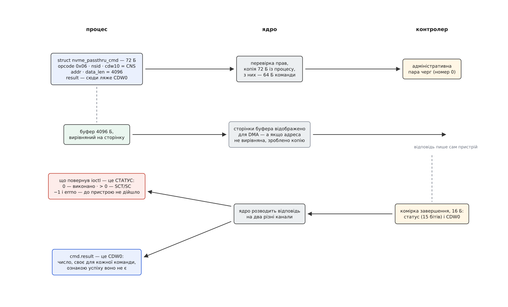
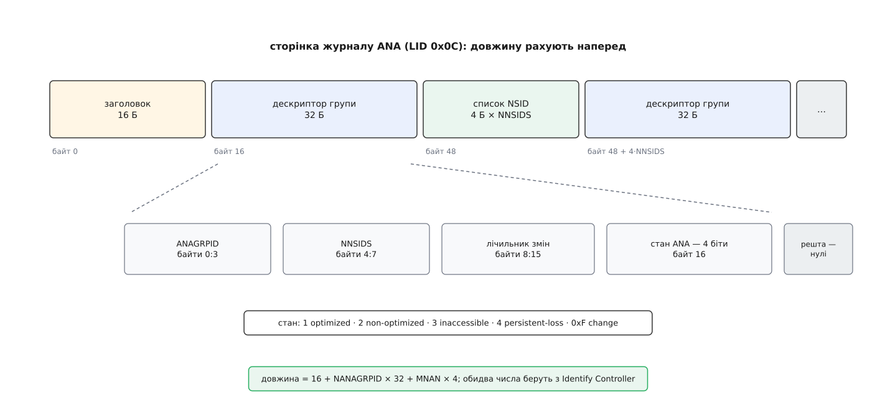

# ⚙️ Спитати контролер напряму: Identify і журнал ANA через ioctl

Це робоча програма на C, яка подає накопичувачеві дві команди протоколу NVMe власними руками — `Identify` і `Get Log Page` — і розбирає відповіді байт за байтом. Писати її варто не щоб замінити `nvme-cli`, а щоб знати, звідки береться кожне число, яке та утиліта друкує, і вміти дістати те, чого вона не друкує, — у власному агенті нагляду, інсталяторі чи тесті.

## Задача

Дістати з контролера три речі. Хто він — модель, серійний номер, ім'я підсистеми NQN. Як улаштований простір імен — глобальні ідентифікатори NGUID і EUI-64 та формат логічного блока. І який зараз стан ANA у кожної групи просторів імен, тобто через які двері до сховища ходити добре, а через які лише можна.

## Ідея: конверт навколо команди

Двері до контролера — символьний вузол `/dev/nvme0` і `ioctl` на ньому ([керуючий канал до драйвера](book:unix-linux/ioctl-interface) — саме той механізм, де номер запиту вибирає операцію, а структура довільної форми йде в обидва боки).

Структура тут одна на всі команди — `struct nvme_passthru_cmd` із `<linux/nvme_ioctl.h>`, і в ній сімдесят два байти. Розрізняти це важливо: структура — не сама команда. Команда NVMe — шістнадцять чотирибайтових слів, тобто рівно 64 байти, які ляжуть у комірку черги подань, і ядро складає їх із полів структури. Частина ж полів на шину не поїде взагалі — це конверт для драйвера: `data_len` і `metadata_len`, `timeout_ms` і `result`, куди повернеться відповідь.

Найцінніше в цьому конверті — те, чого в ньому **немає**. Справжня команда NVMe несе фізичні адреси сторінок під дані (список PRP або SGL), і скласти їх програма з простору користувача не змогла б: вона не знає фізичних адрес і не має права закріплювати сторінки. Тому в структурі стоять `addr` і `data_len` — звичайний вказівник і довжина. Ядро бере на себе те, чого не може взяти програма: перевіряє права, відображає сторінки буфера для DMA, підставляє в команду адреси, які зрозуміє пристрій, і дає команді свій ідентифікатор.

Тепер сама команда. `Identify` має код операції `0x06`, а що саме описати — каже поле CNS (Controller or Namespace Structure) у молодшому байті CDW10. `CNS = 01h` — розкажи про контролер, номер простору імен тоді не потрібен. `CNS = 00h` — розкажи про простір імен, і ось тут NSID обов'язковий. Відповідь в обох випадках однакова завдовжки: рівно 4096 байтів.

Лишається відповідь. І вона приходить **двома різними каналами**, які легко переплутати.



*Значення, яке повернув `ioctl`, — це статус виконання команди; поле `result` — це CDW0, число, своє для кожної команди, і про успіх воно не говорить нічого.*

## Довжина, яку не питають

З `Identify` просто: 4096 байтів завжди. З журналом ANA складніше — його довжина залежить від того, скільки груп оголосив контролер і скільки просторів імен у них живе. А команди «скажи, якої довжини твоя сторінка» в протоколі немає: буфер треба подати одразу правильного розміру.

Виручає те саме оголошення. `Identify Controller` уже назвав два числа: NANAGRPID — скільки груп ANA підтримує контролер, і MNAN — стеля кількості просторів імен. Із них довжина рахується наперед:

```
довжина = 16 + NANAGRPID × 32 + MNAN × 4
          ↑          ↑              ↑
    заголовок   дескриптори    списки NSID
```



*Дескриптори не мають сталого кроку: наступний починається за списком NSID попереднього, тож іти сторінкою можна лише послідовно.*

Пораховану довжину треба ще й сказати контролерові — і тут вилазить вік протоколу. Міряють її не в байтах, а в чотирибайтових словах, рахують **із нуля** (NUMD = довжина ÷ 4 − 1), а саме число розкладене на дві половини в сусідніх полях команди: молодші шістнадцять бітів у CDW10, старші — у CDW11. Причина в тому, що поля команди NVMe нерухомі: місце й ширина кожного зафіксовані назавжди, бо розбирає їх залізо. Коли довжини журналу забракло, розсунути поле на місці було нікуди — лишалося прибудувати старші біти в сусіднє слово. Номер простору імен у цій команді теж особливий: журнал ANA описує контролер цілком, а не окремий простір імен, тож туди йде `0xFFFFFFFF` — «усі».

Так само рахує і ядро — у `nvme_mpath_init_identify()` стоїть та сама формула. Там же видно межу: якщо порахована довжина перевищує MDTS (Maximum Data Transfer Size — найбільший обсяг даних, який контролер бере за одну команду; поле 77 в `Identify Controller`), ядро пише в журнал «ANA log page size larger than MDTS» і вимикає підтримку ANA для цього контролера. Одну передачу не можна розрізати надвоє, а сторінку журналу треба взяти цілою.

## Програма

```c
/* nvme-id.c — Identify і журнал ANA власними руками.
 *   cc -O2 -Wall -std=gnu11 -o nvme-id nvme-id.c
 *   sudo ./nvme-id /dev/nvme0 1
 */
#include <errno.h>
#include <fcntl.h>
#include <stdint.h>
#include <stdio.h>
#include <stdlib.h>
#include <string.h>
#include <unistd.h>
#include <sys/ioctl.h>
#include <linux/nvme_ioctl.h>

enum { OP_GET_LOG = 0x02, OP_IDENTIFY = 0x06 };
enum { CNS_NS = 0x00, CNS_CTRL = 0x01 };
enum { LID_ANA = 0x0c };
#define NSID_ALL 0xffffffffu

/* Відповідь пристрою — little-endian і без C-вирівнювання: читаємо байтами. */
static uint16_t le16(const uint8_t *p) { return (uint16_t)(p[0] | p[1] << 8); }
static uint32_t le32(const uint8_t *p) { return le16(p) | (uint32_t)le16(p + 2) << 16; }
static uint64_t le64(const uint8_t *p) { return le32(p) | (uint64_t)le32(p + 4) << 32; }

/* Єдине місце, де розрізняють «не дійшло» і «дійшло, та контролер відмовив». */
static int admin(int fd, struct nvme_passthru_cmd *c, const char *what)
{
    int rc = ioctl(fd, NVME_IOCTL_ADMIN_CMD, c);

    if (rc < 0) {                       /* команду навіть не подали */
        fprintf(stderr, "%s: %s\n", what, strerror(errno));
        return -1;
    }
    if (rc > 0) {                       /* подали, відмовив контролер */
        unsigned st = (unsigned)rc;     /* біти: 14 DNR · 10:8 SCT · 7:0 SC */
        fprintf(stderr, "%s: статус NVMe SCT=%u SC=0x%02x%s\n", what,
                (st >> 8) & 0x7, st & 0xff, (st & 0x4000) ? ", DNR" : "");
        return -1;
    }
    return 0;
}

static int identify(int fd, uint32_t cns, uint32_t nsid, void *buf)
{
    struct nvme_passthru_cmd c = {
        .opcode   = OP_IDENTIFY,
        .nsid     = nsid,
        .addr     = (uint64_t)(uintptr_t)buf,
        .data_len = 4096,               /* Identify віддає рівно 4 КіБ */
        .cdw10    = cns,                /* CNS — молодший байт CDW10 */
    };
    return admin(fd, &c, "Identify");
}

/* Рядкові поля доповнені пробілами і НЕ завершені нулем. */
static void ascii(char *dst, const uint8_t *src, size_t n)
{
    memcpy(dst, src, n);
    while (n && (dst[n - 1] == ' ' || dst[n - 1] == '\0'))
        n--;
    dst[n] = '\0';
}

static const char *ana_state(unsigned s)
{
    switch (s) {
    case 1:    return "optimized";
    case 2:    return "non-optimized";
    case 3:    return "inaccessible";
    case 4:    return "persistent-loss";
    case 0xf:  return "change";
    default:   return "невідомий";
    }
}

int main(int argc, char **argv)
{
    const char *node = argc > 1 ? argv[1] : "/dev/nvme0";
    uint32_t nsid = argc > 2 ? (uint32_t)strtoul(argv[2], NULL, 0) : 1;
    size_t page = (size_t)sysconf(_SC_PAGESIZE);
    uint8_t *buf, *log;
    int fd;

    fd = open(node, O_RDONLY);
    if (fd < 0) {
        perror(node);
        return 1;
    }
    /* Вирівнювання на сторінку: інакше ядро мовчки скопіює буфер у свій. */
    if (posix_memalign((void **)&buf, page, 4096)) {
        perror("posix_memalign");
        return 1;
    }

    /* ── 1. Identify Controller, CNS 01h: NSID тут не потрібен ───────────── */
    if (identify(fd, CNS_CTRL, 0, buf))
        return 1;

    char mn[41], sn[21], fr[9], nqn[257];
    ascii(mn,  buf +  24, 40);
    ascii(sn,  buf +   4, 20);
    ascii(fr,  buf +  64,  8);
    ascii(nqn, buf + 768, 256);

    unsigned cmic      = buf[76];       /* біт 1 — багато контролерів, біт 3 — ANA */
    unsigned mdts      = buf[77];
    uint32_t nanagrpid = le32(buf + 348);
    uint32_t nn        = le32(buf + 516);
    uint32_t mnan      = le32(buf + 540);

    printf("модель       %s\n", mn);
    printf("серійний     %s\n", sn);
    printf("прошивка     %s\n", fr);
    printf("NQN          %s\n", nqn);
    printf("CMIC 0x%02x    ANA: %s · контролерів у підсистемі: %s\n", cmic,
           (cmic & 8) ? "є" : "нема", (cmic & 2) ? "багато" : "один");
    printf("MDTS %u · просторів імен %u · ANA-груп %u\n", mdts, nn, nanagrpid);

    /* ── 2. Identify Namespace, CNS 00h: а тут NSID обов'язковий ─────────── */
    if (identify(fd, CNS_NS, nsid, buf))
        return 1;

    unsigned flbas = buf[26];
    unsigned fmt   = (flbas & 0x0f) | ((flbas >> 5) & 0x03) << 4;
    const uint8_t *lbaf = buf + 128 + 4u * fmt;   /* дескриптор чинного формату */

    printf("\nпростір імен %u\n", nsid);
    printf("  блоків     %llu × %u Б, метаданих %u Б на блок\n",
           (unsigned long long)le64(buf), 1u << lbaf[2], (unsigned)le16(lbaf));
    printf("  ANAGRPID   %u\n", le32(buf + 92));
    printf("  NGUID      ");                       /* нулі = ідентифікатора немає */
    for (int i = 0; i < 16; i++) printf("%02x", buf[104 + i]);
    printf("\n  EUI-64     ");
    for (int i = 0; i <  8; i++) printf("%02x", buf[120 + i]);
    putchar('\n');

    /* ── 3. Сторінка журналу ANA, LID 0Ch ────────────────────────────────── */
    if (!(cmic & 8)) {
        printf("\nконтролер не повідомляє ANA — журналу в нього немає\n");
        return 0;
    }
    if (!mnan || mnan > nn) {
        fprintf(stderr, "MNAN=%u при NN=%u — числу не віримо\n", mnan, nn);
        return 1;
    }

    size_t len = 16 + (size_t)nanagrpid * 32 + (size_t)mnan * 4;
    if (posix_memalign((void **)&log, page, len)) {
        perror("posix_memalign");
        return 1;
    }
    uint32_t numd = (uint32_t)(len / 4) - 1;      /* довжина у двослів'ях, з нуля */
    struct nvme_passthru_cmd c = {
        .opcode   = OP_GET_LOG,
        .nsid     = NSID_ALL,
        .addr     = (uint64_t)(uintptr_t)log,
        .data_len = (uint32_t)len,
        .cdw10    = LID_ANA | (numd & 0xffff) << 16,
        .cdw11    = numd >> 16,
    };
    if (admin(fd, &c, "Get Log Page ANA"))
        return 1;

    unsigned ngrps = le16(log + 8);
    const uint8_t *d = log + 16, *end = log + len;

    printf("\nжурнал ANA: лічильник змін %llu, груп %u\n",
           (unsigned long long)le64(log), ngrps);

    for (unsigned i = 0; i < ngrps; i++) {
        /* Довжини прийшли з пристрою — рахуємо їх ворожими, поки не перевірені. */
        if (d + 32 > end)
            break;
        uint32_t nnsids = le32(d + 4);
        if (nnsids > (uint32_t)((end - d - 32) / 4))
            break;

        printf("  група %-4u %-16s простори імен:", le32(d), ana_state(d[16] & 0x0f));
        for (uint32_t j = 0; j < nnsids; j++)
            printf(" %u", le32(d + 32 + 4u * j));
        putchar('\n');
        d += 32 + 4u * nnsids;
    }
    return 0;
}
```

## Що вона друкує

На хості, підключеному до двох контролерів однієї підсистеми поверх TCP:

```
$ sudo ./nvme-id /dev/nvme0 1
модель       Linux
серійний     ab7f1e0c4d92
прошивка     6.12.0
NQN          nqn.2014-08.org.nvmexpress:uuid:9f2e…c1
CMIC 0x0a    ANA: є · контролерів у підсистемі: багато
MDTS 5 · просторів імен 8 · ANA-груп 2

простір імен 1
  блоків     2097152 × 4096 Б, метаданих 0 Б на блок
  ANAGRPID   1
  NGUID      0025385a71b1c4f20000000000000001
  EUI-64     0025385a71b1c4f2

журнал ANA: лічильник змін 3, груп 2
  група 1    optimized        простори імен: 1
  група 2    non-optimized    простори імен: 2
```

Найцікавіше видно, якщо запустити те саме на `/dev/nvme1`. Модель, NGUID і EUI-64 будуть **ті самі** — це той самий простір імен, побачений іншими дверима. А стани в журналі ANA поміняються місцями: група, оголошена `optimized` з першого контролера, з другого оголошена `non-optimized`. Саме на цій різниці драйвер і будує вибір шляху.

## Пастки

**Права — це два різні замки, і перевіряють їх у різних місцях.** Перший — звичайні права на вузол: `/dev/nvme0` типово належить `root` і має режим `0600`, тож без root його навіть не відкрити. Другий — усередині драйвера, у функції `nvme_cmd_allowed()`, і він тонший. Невеликий добір команд `Identify` (зокрема CNS 00h і 01h) там дозволено **без** `CAP_SYS_ADMIN` — свідомо, бо в них немає нічого чутливого, а простору користувача ці дані потрібні, щоб правильно складати команди вводу-виводу. Усе інше, і `Get Log Page` теж, падає у `capable(CAP_SYS_ADMIN)`. Тому цілком буває так, що дві перші частини програми відпрацювали, а третя повернула `EACCES` ([можливості процесу](book:unix-linux/capabilities) — саме про те, як root розібрано на окремі права й чому `CAP_SYS_ADMIN` серед них найгрубіше).

**Невирівняний буфер нічого не ламає — він мовчки коштує.** Ядро дивиться, чи збігається вирівнювання вашої адреси з вимогою черги, і якщо ні — не відображає ваші сторінки, а заводить свої й копіює. Помилки не буде, буде зайва копія на кожен виклик ([відображення буферів для пристрою](book:unix-linux/dma-and-buffers) — про те, чому пристрій узагалі не може писати просто «за вказівником»). `posix_memalign` на сторінку не коштує нічого, тож немає причин цього не робити.

**`ADMIN_CMD` і `ADMIN64_CMD` — не синоніми.** Це різні номери запиту (`0x41` і `0x47`) і різні структури: у першій `result` завширшки 32 біти, у другій — 64. Команди, чиє завершення повертає число з CDW0 **і** CDW1, крізь тридцятидвобітні двері втрачають старшу половину. Підмінити структуру, не змінивши номера, не вийде: розмір закодовано в самому номері, тож помилка обернеться `ENOTTY`, а не зіпсованою пам'яттю. Для `Identify` вистачає й вужчих дверей — CDW0 там не несе нічого.

**`result` — не статус.** Це найдорожча плутанина в усій темі. Поле `cmd.result` — це CDW0 комірки завершення: для `Get Features` там значення налаштування, для `Create I/O Completion Queue` — щось третє, для `Identify` — просто нуль. Успіх живе **лише** у значенні, яке повернув `ioctl`. Програма, що перевіряє `result == 0`, доповість про успіх там, де контролер відмовив, і про помилку там, де `Get Features` чесно повернув нуль. Розрізняти треба навіть знак: від'ємне — до пристрою не дійшло (це `errno`), додатне — дійшло й пристрій відмовив (це SCT і SC).

**Не стріляти наосліп у робочий накопичувач.** Ці ж сімдесят два байти з іншим кодом операції — то `Format NVM`, `Sanitize` чи `Set Features`. Ядро не зовсім беззахисне: воно звіряється з журналом підтримуваних команд та їхніх наслідків і, побачивши команду, що змінює стан простору імен чи контролера, спиняє на час ввід-вивід і перечитує змінене. Але працює це рівно доти, доки пристрій чесно оголосив наслідки, і жодна команда від цього не стає менш руйнівною. Окремо підступний випадок — багатошляховість: адміністративний `ioctl`, поданий на **головний** диск `/dev/nvme0n1`, піде тим шляхом, який зараз живий, а не тим, який ви мали на увазі. Коли розбираєтеся з конкретним контролером, беріть його символьний вузол, а вчитися краще на цілі, яку самі й підняли — модуль `nvmet` віддає простір імен поверх TCP на власному ж хості, і зіпсувати там нема чого.
