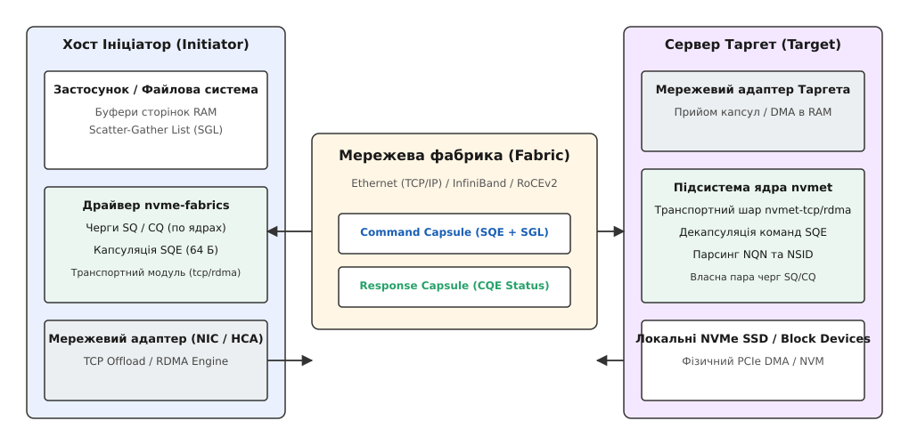
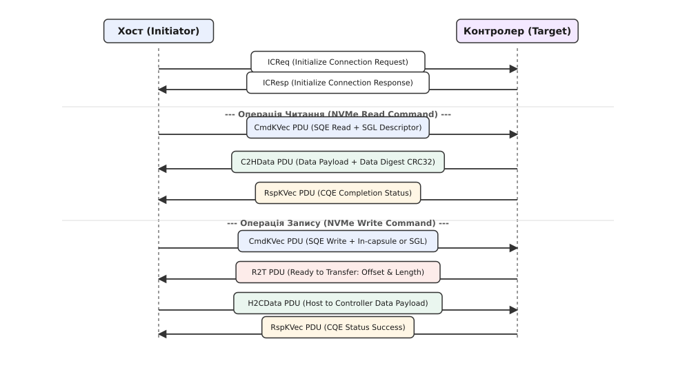
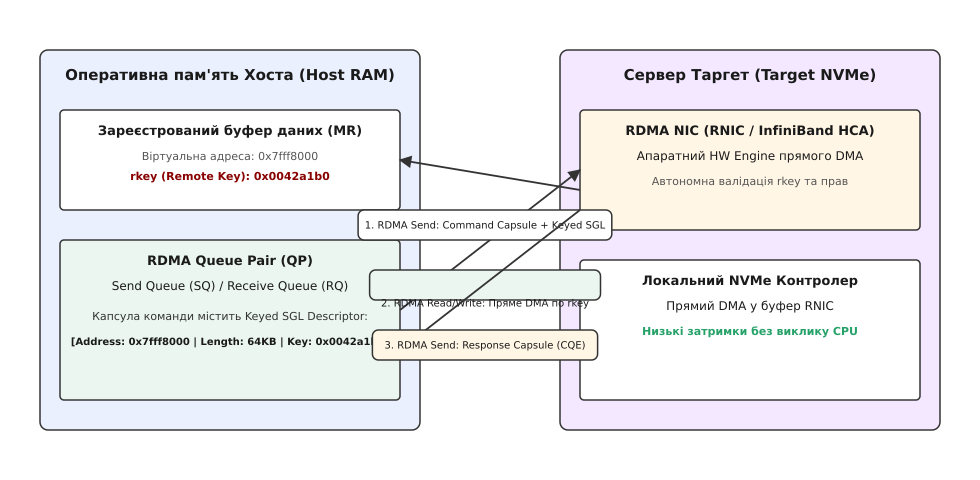

# Мережевий доступ до блочних пристроїв NVMe over Fabrics (RDMA/TCP)

<preknowlist>
- [Архітектура NVMe у Linux: черги SQ/CQ та PRP/SGL дескриптори](topic:unix-linux/nvme-in-linux) — апаратні черги submission queue та completion queue в ОЗП хоста й адресація пам'яті через PRP-покажчики.
- [Загальний огляд технології NVMe over Fabrics](topic:unix-linux/nvme-over-fabrics) — базові концепції винесення командного набору NVMe у мережі зберігання.
</preknowlist>

При підключенні локального накопичувача NVMe через шину PCIe 4.0 x4 затримка обробки 4-кілобайтного запису введення-виведення становить 7–10 мікросекунд, оскільки апаратні черги submission queue (SQ) та completion queue (CQ) розміщуються безпосередньо у фізичній оперативній пам'яті хоста. Спроба передати ті самі командні блоки на віддалений сервер зберігання через традиційний стековий протокол iSCSI збільшує затримку до 150–200 мікросекунд через серіалізацію SCSI-команд, блокування у стекі iSCSI target та багаторазове копіювання даних між буферами ядра. Специфікація NVM Express over Fabrics (NVMe-oF) усуває трансляційний прошарок SCSI, пропускаючи нативні 64-байтні капсули команд NVMe безпосередньо через мережеві фабрики Ethernet TCP, RoCEv2 та InfiniBand із додатковою накладною затримкою всього 2–15 мікросекунд.

Докладну хронологію витіснення класичних систем SAN на базі iSCSI та Fibre Channel новим стандартом викладено у вставці [Історичний еволюційний перехід від SCSI/iSCSI до NVMe-oF](topic:unix-linux/nvme-over-fabrics-nvme-of/hist-iscsi-to-nvmeof.md).

## Архітектура капсульного обміну та моделі транспорту

У нативному PCIe NVMe передача команд здійснюється шляхом запису 64-байтних елементів SQE у кільцевий буфер SQ в ОЗП хоста та активації дверного дзвінка (Doorbell Register) контролера через PCI MMIO. У мережевому середовищі безпосередній доступ до регістрів контролера відсутній, тому NVMe-oF замінює фізичні черги концепцією **мережевих капсул (Capsules)**.


*Мережева архітектура обміну капсулами команд (SQE) та відповідей (CQE) між хостом-ініціатором та підсистемою таргета.*

Будь-яка взаємодія між хостом (Initiator) та віддаленою підсистемою (Target) складається з двох типів капсул:
1. **Command Capsule (Капсула команди):** Містить 64-байтний елемент SQE, а також необовʼязкові вбудовані дані (In-capsule Data) розміром від 0 до 8192 байтів. Якщо обсяг операції запису не перевищує поріг In-capsule Data, дані надсилаються в один прийом разом із заголовком команди, що усуває зайвий мережевий оберт (Round Trip Time — RTT).
2. **Response Capsule (Капсула відповіді):** Містить 16-байтний елемент CQE, який повертається контролером після завершення обробки запиту й несе статус виконання `Status Field` та повернутий `Command ID (CID)`.

Адресація великих масивів пам'яті у NVMe-oF повністю відмовляється від сторінкових списків PRP (Physical Region Page), які прив'язані до архітектури x86 MMU, на користь універсальних дескрипторів **SGL (Scatter-Gather List)**.

## Порівняльний аналіз адресації: PRP проти Transport SGL

У локальному PCIe NVMe для адресації сторінок пам'яті застосовуються списки сторінок фізичного регіону PRP (Physical Region Page). Драйвер хоста передає у командах SQE два 64-бітних поля: `PRP1` (вказує на першу фізичну сторінку 4 КіБ) та `PRP2` (вказує на другу сторінку або на суцільний масив покажчиків решти сторінок). Система PRP висуває сувору вимогу: усі сторінки у списку, крім першої, повинні бути строго вирівняні по межі 4096 байтів.

У мережевому середовищі NVMe-oF використання PRP є неможливим з двох причин:
1. Мережевий адаптер віддаленого сервера не має доступу до віртуальної пам'яті хоста й не може самостійно обходити ланцюжки покажчиків PRP List через шину PCIe хоста.
2. Буфери пам'яті у мережевих сокетах часто є фрагментованими і складаються з довільних порцій даних розрізненого розміру.

Тому специфікація NVMe-oF замінює PRP на **Transport SGL (Scatter-Gather List)**. Кожен SGL-дескриптор явним чином описує довжину, тип буфера та мережеву адресу або ключ пам'яті `rkey`. Це дозволяє передавати дані між фрагментованими буферами ОЗП без додаткового перевиділення суцільних сторінок у ядрі операційної системи.

## Передача даних у NVMe over TCP (TP 8000)

Транспортний рівень NVMe/TCP, затверджений у специфікації Technical Position 8000, дозволяє розгортати мережі зберігання NVMe-oF поверх звичайної стандартної інфраструктури Ethernet 10/25/100GbE без закупівлі спеціалізованого обладнання RDMA.

Усі повідомлення у NVMe/TCP упаковуються у кадри **PDU (Protocol Data Unit)**, які починаються з уніфікованого 8-байтного заголовка `struct nvme_tcp_hdr`.


*Послідовність обміну кадрами PDU для операцій читання (C2HData) та запису (R2T і H2CData) в протоколі NVMe/TCP.*

Сценарії обміну PDU залежать від напрямку передачі даних:

### Зчитування даних з віддаленого таргета (NVMe Read)
1. Хост відправляє кадр `CapsuleCmd` (PDU type `0x04`), що містить 64-байтну командну капсулу Read із дескриптором Transport SGL.
2. Таргет зчитує дані з SSD і надсилає ініціатору один або декілька кадрів `C2HData` (PDU type `0x07`). Якщо прапорець `NVME_TCP_F_DATA_SUCCESS` активовано у останньому `C2HData`, статус CQE повертається всередині цього кадру, заощаджуючи мережевий пакет.
3. У разі відсутності суміщеного статусу таргет додатково надсилає `CapsuleResp` (PDU type `0x05`).

### Запис даних на віддалений таргет (NVMe Write)
1. Хост передає `CapsuleCmd` (PDU type `0x04`) із вказівкою загальної довжини запису.
2. Якщо дані не помістилися у In-capsule Data, таргет відповідає кадром `R2T` (Ready to Transfer, PDU type `0x09`), вказуючи зсув `offset` та розмір порції `length`, яку він готовий прийняти у свій мережевий буфер.
3. Хост у відповідь передає потік кадрів `H2CData` (PDU type `0x06`).
4. Після завершення запису на носій таргет відправляє остаточний `CapsuleResp`.

Для підвищення надійності в умовах мережевих завад у NVMe/TCP передбачено обчислення 32-бітних контрольних сум CRC32c окремо для заголовка (Header Digest) та для корисного навантаження (Data Digest).

Повний опис бінарного макету PDU-структур, полів командних капсул та статусних кодів наведено у вставці [Специфікація бінарних кадрів PDU та дескрипторів Keyed SGL](topic:unix-linux/nvme-over-fabrics-nvme-of/api-nvmeof-pdu-structures.md).

## Нульове копіювання та апное ядра у NVMe over RDMA (RoCEv2 / InfiniBand)

Транспорт NVMe/RDMA забезпечує найвищу продуктивність за рахунок прямого доступу до пам'яті (Remote Direct Memory Access), оминаючи процесор та стек мережевих протоколів операційної системи на обох кінцях з'єднання.


*Схема прямого апаратного читання та запису у пам'ять хоста через RDMA Read/Write з використанням remote key (rkey).*

Для адресації пам'яті у RDMA хост попередньо реєструє буфер ОЗП у системі мережевого адаптера (RNIC), отримуючи 32-бітний ключ дистанційного доступу `rkey`. Цей ключ разом із 64-бітною віртуальною адресою кодується у 16-байтний дескриптор **Keyed SGL Data Block Descriptor** (`SGL Type = 0x04`).

Механіка виконання прямого читання/запису:
1. Хост надсилає капсулу команди (Send Operation) у чергу QP (Queue Pair) таргета. Усередині SQE передається Keyed SGL дескриптор із ключем `rkey`.
2. Отримавши команду, апаратний адаптер RNIC таргета самостійно ініціює операцію `RDMA Write` (при читанні з диска) або `RDMA Read` (при записі на диск). Мережева карта таргета зчитує або записує дані безпосередньо у фізичні сторінки ОЗП хоста без участі CPU хоста.
3. Після завершення апаратного трансферу таргет відправляє 16-байтну капсулу відповіді звичайною операцією `RDMA Send`; адаптери, які це вміють, шлють `Send with Invalidate`, одночасно скасовуючи використаний `rkey`.

Математичні формули розрахунку затримок, порівняння пропускної здатності та накладних витрат framing для TCP і RDMA виведено у вставці [Математичний розрахунок затримок та пропускної здатності NVMe/TCP та NVMe/RDMA](topic:unix-linux/nvme-over-fabrics-nvme-of/math-nvmeof-latency-throughput.md).

## Підсистеми ядра Linux: `nvme-core`, `nvme-fabrics` та `nvmet`

У ядрі Linux архітектура NVMe-oF розділена на дві чіткі сторони: **Ініціатор (Host Client)** та **Таргет (Target Subsystem)**.

```
                  Простір користувача (User Space)
  nvme-cli / libnvme                     nvmetcli / ConfigFS
         │                                         │
─────────┼─────────────────────────────────────────┼─────────
         ▼        Ядро Linux (Kernel Space)        ▼
┌──────────────────┐                     ┌──────────────────┐
│   nvme-core      │                     │   nvmet (Target) │
└────────┬─────────┘                     └────────┬─────────┘
         │                                        │
┌────────┴─────────┐                     ┌────────┴─────────┐
│   nvme-fabrics   │                     │   порти nvmet    │
└────┬────────┬────┘                     └────┬────────┬────┘
     │        │                               │        │
     ▼        ▼                               ▼        ▼
┌────────┐┌────────┐                     ┌────────┐┌────────┐
│nvme-tcp││nvme-   │                     │nvmet-  ││nvmet-  │
│        ││rdma    │                     │tcp     ││rdma    │
└────────┘└────────┘                     └────────┘└────────┘
```

Модуль `nvme-core` надає загальну інфраструктуру реєстрації блокових пристроїв `/dev/nvmeXn1` та взаємодії зі стеком `blk-mq`. При підключенні мережевого диска модуль `nvme-fabrics` обробляє текстовий рядок конфігурації з `/dev/nvme-fabrics` і створює контролер, передаючи сокети відповідному транспортному модулю `nvme-tcp.ko` або `nvme-rdma.ko`.

На боці сервера функціонує ядерний модуль `nvmet.ko`. Конфігурація віддалених просторів імен, мережевих портів та прав доступу виконується через деревну файлову систему ConfigFS (`/sys/kernel/config/nvmet/`). Драйвер `nvmet-tcp` або `nvmet-rdma` відкриває мережеві сокети на порту 4420 і транслює отримані PDU-кадри у виклики до локальних NVMe SSD або томів LVM.

Практичну реалізацію клієнта простору користувача мовами C та C++20 для роботи з `/dev/nvme-fabrics` та викликами `ioctl` наведено у вставці [Низькорівнева реалізація клієнта NVMe-oF у просторі користувача](topic:unix-linux/nvme-over-fabrics-nvme-of/proj-nvmeof-c-cpp-client.md).

## Специфікація FC-NVMe (NVMe over Fibre Channel)

Для підприємств із наявною інфраструктурою Fibre Channel (FC SAN) специфікація **FC-NVMe** інкапсулює капсули NVMe у стандартні кадри Fibre Channel Protocol (FCP-4):

- **Апаратні HBAs:** Використовуються ті самі оптичні адаптери 16G/32G/64G Host Bus Adapter (Emulex, QLogic), що й для класичного FCP SCSI.
- **Паралельне співіснування:** Один і той самий оптичний кабель та комутатор FC-Switch можуть одночасно передавати кадри SCSI FCP та FC-NVMe без поділу на окремі VLAN.
- **N_Port ID Virtualization (NPIV):** Віртуальні ідентифікатори WWPN мапуються на текстові NQN ініціаторів.

Затримка у FC-NVMe помітно нижча, ніж у FCP SCSI: зникає трансляція NVMe у SCSI і робота з єдиною чергою тегованих команд у драйвері HBA. Конкретний виграш залежить від моделі адаптера й профілю навантаження.

## Інтеграція у Ceph, SPDK та Kubernetes (CSI Drivers)

У сучасних хмарних інфраструктурах NVMe-oF виступає високошвидкісним транспортом для розподілених систем зберігання:

### 1. Шлюз Ceph NVMe-oF Gateway
Починаючи з версії Ceph Reef, утиліта `ceph-nvmeof` дозволяє розгортати HA-шлюзи NVMe/TCP поверх розподілених томів RADOS (RBD). Мережеві клієнти підключаються до кластера Ceph як до звичайного NVMe SSD по протоколу NVMe/TCP без встановлення важкого демона `rbd-nbd`.

### 2. Юзерспейс таргет у SPDK (Storage Performance Development Kit)
Фреймворк SPDK реалізує юзерспейс таргет `spdk_nvmf_tgt`, який обробляє мережеві PDU NVMe/TCP та NVMe/RDMA у режимі Polling Mode Drivers (PMD) без використання ядра Linux. Це дозволяє знімати з одного серверного вузла мільйони IOPS.

### 3. Kubernetes NVMe-oF CSI Plugin
Плагіни Container Storage Interface (CSI) автоматично підключають мережеві простори імен NVMe-oF до Pods контейнерів під час їхнього завантаження у вузлах Kubernetes, забезпечуючи динамічний провіжинінг Persistent Volumes (PV).

## Практичне налаштування NVMe Target через утиліти `nvmetcli`

Для управління підсистемою `nvmet` у системному адмініструванні замість прямої маніпуляції псевдофайлами ConfigFS використовується Python-інструмент `nvmetcli`. Утиліта зберігає конфігурацію у форматі JSON:

```json
{
  "hosts": [
    {
      "nqn": "nqn.2024-08.com.example:host1"
    }
  ],
  "ports": [
    {
      "addr": {
        "adrfam": "ipv4",
        "traddr": "192.168.1.100",
        "trsvcid": "4420",
        "trtype": "tcp"
      },
      "portid": 1,
      "subsystems": [
        "nqn.2024-08.com.example:nvme.target1"
      ]
    }
  ],
  "subsystems": [
    {
      "attr": {
        "allow_any_host": "0"
      },
      "namespaces": [
        {
          "device": {
            "path": "/dev/nvme0n1"
          },
          "nsid": 1
        }
      ],
      "nqn": "nqn.2024-08.com.example:nvme.target1"
    }
  ]
}
```

Завантаження цієї конфігурації командою `nvmetcli restore config.json` створює всі необхідні каталоги у ConfigFS, вмикає мережевий порт TCP `4420` та прив'язує фізичний дисковий том `/dev/nvme0n1` до NQN підсистеми з авторизацією за списком NQN ініціаторів.

## Оптимізація мережевого стека Linux під NVMe/TCP

Для досягнення високої пропускної здатності 100GbE у NVMe/TCP необхідна специфічна оптимізація сокетів та переривань ядра Linux:

### 1. Налаштування мережевих буферів sysctl
За замовчуванням максимальний розмір вікна TCP є замалим для добутку пропускної здатності на затримку (BDP — Bandwidth-Delay Product):

```bash
# Збільшення системних меж мережевих буферів
sysctl -w net.core.rmem_max=67108864
sysctl -w net.core.wmem_max=67108864
sysctl -w net.ipv4.tcp_rmem="4096 87380 33554432"
sysctl -w net.ipv4.tcp_wmem="4096 65536 33554432"
```

### 2. Прив'язка черг переривань (CPU Affinity)
Для уникнення контекстних перемикань між ядрами CPU при обробці мережевих пакетів черги `nvme_tcp_io_work` та переривання мережевої карти (MSI-X vectors) прив'язують до того самого NUMA-вузла, на якому розміщено мережевий адаптер:

```bash
# Прив'язка IRQ мережевої карти до ядра CPU 4
echo 4 | sudo tee /proc/irq/142/smp_affinity_list
```

### 3. Режим активного опитування `SO_BUSY_POLL`
Активне опитування сокета (`net.core.busy_poll=50`, значення в мікросекундах) дозволяє процесору опитувати чергу пакетів без переходу у стан сну, що знижує затримку обробки кадрів `C2HData` на кілька мікросекунд.

## Апаратне розвантаження Offload у сучасних SmartNIC

Для усунення накладних витрат процесора хоста при роботі з протоколом NVMe/TCP виробники мережевого обладнання впроваджують апаратні рушії **NVMe/TCP Offload** у SmartNIC (наприклад, NVIDIA ConnectX-7, Marvell FastLinQ):

1. **CRC32c Offload:** Обчислення контрольних сум Header Digest та Data Digest виконується безпосередньо апаратними кремнієвими блоками мережевої карти під час формування Ethernet-кадрів.
2. **Direct Data Placement (DDP):** Апаратний адаптер аналізує заголовки PDU у вхідному потоці TCP і копіює корисне навантаження кадру `C2HData` прямо у цільовий буфер введення-виведення через DMA, минаючи проміжні буфери socket receive buffer у ядрі.
3. **TLS Hardware Offload:** Апаратне симетричне шифрування та дешифрування кадрів kTLS на швидкості лінійного каналу 100/200 Gbps.

Апаратний Offload зменшує навантаження на процесор хоста при роботі з NVMe/TCP майже до рівня RDMA (RoCEv2), зберігаючи при цьому переваги стандартної маршрутизації TCP/IP.

## Захист цілісності даних T10-PI та підсистема метаданих MPTR

У критично важливих корпоративних системах зберігання даних витоки пам'яті чи мовчки виникаючі бітові спотворення (Silent Data Corruption) недопустимі. Специфікація NVMe-oF інтегрує нативну підтримку технології **End-to-End Data Protection (T10-PI / Protection Information)**.

При формуванні блокового простору імен із підтримкою T10-PI кожний логічний сектор (наприклад, 4096 байтів) супроводжується додатковим 8-байтним полем метаданих:
- **Guard Tag (2 байти):** Контрольна сума CRC16 всієї області даних сектора.
- **Application Tag (2 байти):** Значення, що задається застосунком (наприклад, прапорець вибіркового блокування СУБД).
- **Reference Tag (4 байти):** Нижча частина логічної адреси LBA. Запобігає помилкам «переплутаних секторів» (Misdirected Writes), коли контролер записує правильні дані не у той сектор.

У командних капсулах NVMe-oF 64-бітне поле **MPTR (Metadata Pointer)** вказує на окремий SGL-дескриптор, у якому передається масив T10-PI метаданих. Мережевий таргет `nvmet` перевіряє цілісність CRC16 перед записом на фізичний NAND-носій, що гарантує наскрізний захист даних від хоста до комірки flash-пам'яті.

## Протокол аутентифікації DH-HMAC-CHAP та криптографічний захист

Підключення до віддаленої підсистеми NVMe-oF по відкритій Ethernet-мережі вимагає надійного перевірки автентичності ініціатора. Стандарт NVMe-oF 1.1 визначає обов'язковий механізм аутентифікації **DH-HMAC-CHAP (Diffie-Hellman Handshake Message Authentication Code Challenge Handshake Authentication Protocol)**.

Процедура взаємної аутентифікації виконується одразу після команди `Connect` за допомогою Fabrics-команд `AUTH_SEND` (`fctype = 0x05`) та `AUTH_RECV` (`fctype = 0x06`):

```
     Хост (Initiator)                                Таргет (Target)
            │                                               │
            │────── Connect (nqn.host, nqn.target) ────────>│
            │<───── Connect Response (AUTH Required) ───────│
            │                                               │
            │────── AUTH_SEND (Negotiate Hash/DH Group) ───>│
            │<───── AUTH_RECV (Challenge + Target DH Key) ──│
            │                                               │
            │────── AUTH_SEND (Response + Host DH Key) ────>│
            │<───── AUTH_RECV (Success / Failure) ──────────│
```

Ключові етапи криптографічного рукостискання:
1. **Узгодження параметрів (Negotiation):** Хост пропонує список підтримуваних функцій хешування (SHA-256, SHA-384, SHA-512) та груп Діффі-Гелмана (MODP-групи 2048, 3072, 4096, 6144 та 8192 біти).
2. **Запит (Challenge):** Таргет генерує криптографічно випадковий 256-бітний виклик `Challenge` та надсилає свій публічний ключ DH.
3. **Відповідь (Response):** Хост обчислює HMAC від послідовності виклику, спільного таємного ключа (Pre-Shared Key — PSK) та згенерованого сесійного ключа Diffie-Hellman, надсилаючи відповідь та свій публічний ключ.
4. **Перевірка:** Таргет перевіряє відповідність HMAC. У разі успіху утворюється двосторонній захищений сесійний контекст. Захищений сесійний ключ унеможливлює атаку підміни пакетів (Session Hijacking) у відкритому L2-сегменті.

## Централізоване виявлення CDC (Centralized Discovery Controller)

У масштабних корпоративних ЦОД із тисячами хостів ручний моніторинг IP-адрес кожного таргета стає неможливим. Технічна пропозиція TP 8010, зведена до бази NVMe 2.0, впроваджує архітектуру **CDC (Centralized Discovery Controller)**.

Замість прямого опитування кожного сервера ініціатори та класичні контролери виявлення (Direct Discovery Controllers) реєструються у єдиному центральному реєстрі CDC. Таргети відправляють повідомлення `Explicit Registration`, реєструючи свої NQN, IP-адреси та доступні простори імен. Хост при завантаженні робить лише один запит до CDC і миттєво отримує повну динамічну карту топології зберігання.

Крім того, CDC підтримує механізм сповіщень про зміни топології **AEN (Asynchronous Event Notification)**. Якщо у кластер додається новий дисковий масив або змінюються права доступу, CDC надсилає хосту кадр AEN, стимулюючи фонове оновлення конфігурації без перезавантаження системних служб.

## Обробка збоїв, таймаути та відновлення з'єднань (Reconnection & Multipathing Failover)

Мережеве середовище Ethernet або InfiniBand схильне до тимчасових обривів зв'язку, тимчасової втрати пакетів або перезавантаження мережевих комутаторів. Для запобігання фатальним помилкам читання/запису диска у ядрі Linux реалізовано багаторівневий механізм відновлення.

### Параметри таймерів відновлення в ядрі Linux
- **`keep_alive_tmo` (KATO):** Інтервал надсилання періодичних підтверджень зв'язку (за замовчуванням 15 секунд). Якщо таргет не отримує KATO протягом заданого часу, він звільняє черги SQ/CQ та ресурси сокета.
- **`reconnect_delay`:** Інтервал між повторними спробами відкриття сокета після обриву мережі (типово одиниці секунд).
- **`fast_io_fail_tmo`:** Час у секундах, протягом якого підсистема блокового рівня `blk-mq` тримає нові запити I/O у черзі (Queued status) під час перепідключення. Якщо з'єднання відновлюється до закінчення цього таймауту, застосунок користувача не отримує жодної помилки.
- **`offlink_io_tmo`:** Граничний таймаут видалення блочного пристрою `/dev/nvmeXn1` із системи у разі повної втрати зв'язку.

### Поведінка системи під час перемикання станів ANA
Коли активний мережевий порт таргета переходить у стан `inaccessible` або `change`:
1. Ядерний модуль `nvme-core` миттєво призупиняє відправлення нових SQE у дану чергу.
2. Система Multipathing вибирає альтернативний контролер із масиву `subsystem`, що перебуває у стані `optimized`.
3. Невиконані запити (In-flight Commands) витягуються з черги відключеного контролера та повторно надсилаються у SQ нового live-контролера. Оскільки команда read/write адресує конкретні LBA й повторне її виконання дає той самий результат, це відбувається прозоро для файлової системи (ext4, XFS, Btrfs).

## Простеження, моніторинг та відлагодження NVMe-oF

Для діагностики продуктивності та виявлення вузьких місць мережевої підсистеми у Linux використовуються інструменти простеження ядра та утиліти аналізу.

### Моніторинг системних регістрів через sysfs
Шлях `/sys/class/nvme/nvmeX/` містить ключові діагностичні лічильники:

```bash
# Перевірка поточного стану контролера
cat /sys/class/nvme/nvme0/state

# Транспорт і адреса таргета, до якого підключено контролер
cat /sys/class/nvme/nvme0/transport
cat /sys/class/nvme/nvme0/address
```

### Профільування навантаження за допомогою `fio`
Для вимірювання затримок (Latency P99.9) та IOPS мережевого блочного пристрою `/dev/nvme0n1` використовується генератор навантаження `fio` з прямим асинхронним двигуном `io_uring`:

```ini
[global]
ioengine=io_uring
direct=1
group_reporting
time_based
runtime=60
filename=/dev/nvme0n1

[randread-4k]
rw=randread
bs=4k
iodepth=64
numjobs=4
```

Тестування дозволяє оцінити реальний внесок мережевого стека у загальний профіль затримки: при використанні NVMe/TCP на затримку мережі припадає близько 10–12 мкс, тоді як при NVMe/RDMA цей показник не перевищує 2–3 мкс.

## Порівняльний аналіз транспортів та рекомендації з вибору

Оцінка характеристик трьох основних транспортів NVMe-oF підсумовується у порівняльній таблиці:

| Критерій порівняння | NVMe over TCP | NVMe over RoCEv2 | NVMe over InfiniBand |
| :--- | :--- | :--- | :--- |
| **Необхідна інфраструктура** | Стандартні Ethernet-комутатори 10/25/100G | Ethernet-комутатори з підтримкою PFC/ECN (Lossless) | Спеціалізоване обладнання InfiniBand (Subnet Manager) |
| **Додаткова затримка RTT** | 8 – 15 мкс | 2 – 4 мкс | 1.5 – 3 мкс |
| **Навантаження на CPU хоста** | Середнє (обробка TCP/IP, оптимізується kTLS) | Мінімальне (Hardware Offload, Zero-Copy) | Мінімальне (Hardware Offload, Zero-Copy) |
| **Максимальна відстань** | Без обмежень (рутінг через L3-мережі) | Обмежена L2-сегментом або ретельно налаштованим ECN | Локальна обчислювальна фабрика (Data Center) |
| **Складність розгортання** | Низька (використовує наявні сокети Linux) | Висока (вимагає налаштування QoS/PFC) | Висока (вимагає спеціальних HCA та SM) |
| **Вартість володіння (TCO)** | Мінімальна | Середня | Висока |

## Висновки та практичні рекомендації

NVMe over Fabrics кардинально змінює архітектуру побудови центрів обробки даних, усуваючи затримки традиційних мережевих стеків SAN та наближаючи продуктивність віддалених дискових масивів до рівня локальних PCIe SSD.

1. Для загальносистемних веб-серверів, середовищ віртуалізації та кластерів Kubernetes оптимальним вибором є **NVMe/TCP**, який забезпечує добрий баланс продуктивності (затримка <20 мкс) та не вимагає заміни мережевої інфраструктури.
2. Для високонавантажених СУБД (PostgreSQL, ScyllaDB, ClickHouse) та систем навчання штучного інтелекту рекомендується розгортання **NVMe/RoCEv2** із підтримкою zero-copy та hardware offload.
3. Налаштування систем безпеки повинно включати обов'язкову криптографічну аутентифікацію DH-HMAC-CHAP на етапі `Connect` та використання вбудованого шифрування **kTLS** для запобігання перехопленню даних у відкритих Ethernet-мережах.
4. Правильний вибір транспортного шару та параметрів таймаутів дозволяє проектувати надійні інфраструктури зберігання з гарантованим рівнем доступності SLA 99.999%.
