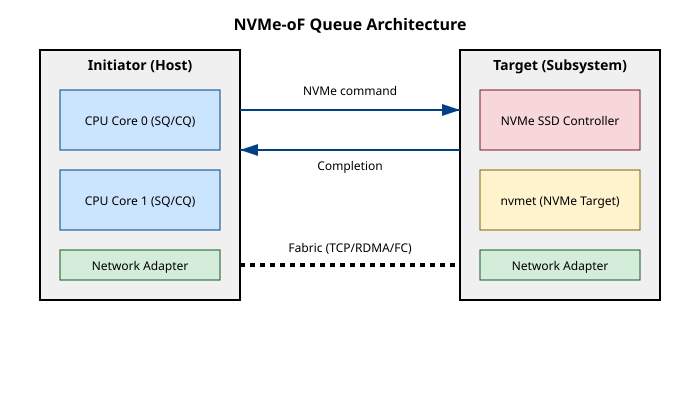

# NVMe поверх мереж: той самий набір команд по TCP, RDMA і Fibre Channel

<preknowlist>
- [NVMe у Linux](book:unix-linux/nvme-in-linux) — протокол доступу до високошвидкісних накопичувачів через шину PCIe: множинні черги (Submission та Completion) і жодної складної трансляції команд, як у випадку з SCSI.
- [iSCSI у Linux](book:unix-linux/iscsi-in-linux) — традиційний протокол інкапсуляції команд SCSI у TCP/IP пакети для передачі по мережі.
- [RDMA у Linux](book:unix-linux/rdma-in-linux) — мережевий адаптер безпосередньо звертається до пам'яті комп'ютера в обхід процесора та ядра ОС, забезпечуючи низькі затримки та високу пропускну здатність.
- **Модель клієнт-сервер у сховищах** — у термінології мережевих сховищ клієнт називається **Initiator** (ініціатор), а сервер — **Target** (ціль).
</preknowlist>

Коли швидкості твердотільних накопичувачів (SSD) злетіли до небес, і вони почали підключатися напряму до шини PCIe, розробники швидко зрозуміли одну річ: старі протоколи стали вузьким місцем. iSCSI, який роками служив вірою і правдою для підключення віддалених дисків по мережі, раптом виявився занадто повільним. Річ у тім, що він тягне за собою весь багаж SCSI-команд, складного стека і послідовної обробки. NVMe, натомість, спроектований з нуля під високу паралельність — десятки тисяч черг, у кожній з яких можуть бути десятки тисяч команд. Виникла нетривіальна проблема: як винести NVMe у мережу так, щоб не втратити цю магію паралелізму і не перетворити мережевий стек на нове вузьке місце? Відповіддю став NVMe-oF (NVMe over Fabrics).

## Від локальної шини до глобальної мережі

Ідея NVMe-oF дуже проста: давайте візьмемо ті самі структури даних, ті самі команди NVMe (наприклад, Read, Write, Flush), які ми відправляємо на локальний контролер через PCIe, і замість цього інкапсулюємо їх у мережеві пакети. 

Якщо на локальній машині процесор кладе команду в Submission Queue (SQ) безпосередньо в оперативній пам'яті, а контролер диска забирає її звідти по PCIe, то в NVMe-oF нам потрібен **транспорт**, який перенесе ці команди з пам'яті ініціатора (вашого комп'ютера) в пам'ять таргета (сервера з дисками).

Специфікація NVMe-oF розроблена так, щоб бути максимально незалежною від конкретного транспорту. Головне, щоб транспорт забезпечував надійну доставку повідомлень. Тому сьогодні існує три основні варіанти:

1. **NVMe/RDMA:** Використовує мережі з підтримкою віддаленого прямого доступу до пам'яті (RoCEv2, iWARP або InfiniBand). Це найшвидший варіант, оскільки мережева карта (NIC) на стороні ініціатора бере команду прямо з пам'яті і кладе її в пам'ять таргета. Процесор практично не бере участі в передачі даних.
2. **NVMe/TCP:** Найдоступніший варіант. Використовує звичайні Ethernet-мережі та стандартний стек TCP/IP. Хоча він створює більше навантаження на процесор, ніж RDMA, він набагато дешевший у розгортанні, бо працює на будь-якому обладнанні.
3. **NVMe/FC:** Для тих корпоративних середовищ, де вже побудовані потужні мережі Fibre Channel (SAN).

Кожен із трьох має власні різновиди й власні вимоги до заліза — RoCEv2 проти iWARP проти InfiniBand усередині RDMA, потреба в безвтратній фабриці, співіснування FC-NVMe зі старим FCP на тій самій SAN. Перелік із цими подробицями зібрано окремо: [транспорти NVMe-oF](book:unix-linux/nvme-over-fabrics/api-nvmeof-transports.md).

## Архітектура: Initiator та Target

В екосистемі NVMe-oF архітектура складається з двох ключових компонентів:

- **Host (Initiator):** Машина, якій потрібен доступ до диска. У Linux для цього завантажується модуль `nvme-fabrics` і відповідний транспортний модуль (наприклад, `nvme-tcp`). Ініціатор створює віртуальні пристрої `/dev/nvmeXn1`, які для операційної системи і застосунків виглядають абсолютно так само, як локальні NVMe-диски.
- **Subsystem (Target):** Сервер, де фізично знаходяться диски. Ядро Linux містить підсистему **nvmet** (NVMe Target), яка експортує локальні диски, файли або логічні томи у мережу.

Коли ви підключаєтесь до таргета, ініціатор домовляється з ним про створення черг. Зазвичай виходить по одній черзі вводу-виводу на кожне ядро процесора на стороні ініціатора — стільки, скільки дозволить таргет (він оголошує свою стелю під час підключення). Тоді ядра не сперечаються за спільну чергу, і саму чергу не доводиться захищати блокуванням.



*Кожне ядро ініціатора має власну пару черг SQ/CQ; команда виходить через мережевий адаптер у фабрику (TCP, RDMA або FC), на іншому боці її приймає підсистема nvmet і передає контролеру накопичувача, а відповідь про завершення повертається тим самим шляхом. Черги ніде не зливаються в одну — паралелізм локального NVMe зберігається й у мережі.*

## Нульове копіювання і жодних блокувань

Одним із головних досягнень реалізації NVMe-oF у ядрі Linux є архітектура, націлена на мінімізацію накладних витрат. 

У NVMe/TCP нульове копіювання виходить лише в один бік — на відправленні. Сторінки з буфера блокового рівня драйвер `nvme-tcp` віддає сокету як є, без окремої копії в буфер сокета; варто ввімкнути контрольну суму даних (data digest), і ця перевага зникає — ядро мусить пройти весь буфер, щоб її порахувати. А на прийомі копія неминуча: дані спершу осідають у буфері сокета, і драйвер переносить їх звідти у власні буфери. На стороні таргета так само: `nvmet-tcp` забирає байти з сокета, розпаковує NVMe-капсулу і передає команду драйверу локального диска. Саме ця копія на прийомі плюс робота TCP-стека і роблять NVMe/TCP дорожчим для процесора, ніж RDMA.

У випадку з RDMA дані не проходять через процесори взагалі. Ініціатор реєструє свій буфер у мережевому адаптері й кладе в командну капсулу не самі дані, а дескриптор пам'яті — адресу буфера та ключ доступу до нього. Далі рух даних починає **таргет**, а не ініціатор: на запис він виконує RDMA Read і сам витягує вміст буфера з пам'яті ініціатора, на читання — RDMA Write і кладе результат просто в цей буфер. Обидві операції виконують адаптери: процесори обох машин бачать лише капсулу команди та повідомлення про завершення, а самих даних не торкаються. Тому NVMe/RDMA додає до локальної затримки PCIe одиниці — десятки мікросекунд, а не сотні.

## Практика: як це виглядає у командному рядку

Для роботи з NVMe в Linux існує утиліта `nvme-cli`. Підключення до мережевого диска — це зазвичай двоетапний процес.

Підключатися є до чого лише тоді, коли на іншому боці вже піднято таргет. Далі всі команди йдуть на стенд, зібраний у вставці [налаштування NVMe Target (nvmet)](book:unix-linux/nvme-over-fabrics/proj-nvmet-setup.md): через `configfs` там заведено підсистему `nqn.2024-01.com.example:test-target` з одним простором імен і порт TCP на `192.168.1.100:4420`. Саме ці адреса, порт і назва підсистеми і стоять у прикладах нижче.

Спочатку ініціатор повинен дізнатися, які диски йому доступні. Це називається **Discovery**:

```bash
# Знайти доступні підсистеми на сервері з IP 192.168.1.100 по TCP
nvme discover --transport=tcp --traddr=192.168.1.100 --trsvcid=4420
```

Ця команда повертає список NVMe-підсистем (NQN — NVMe Qualified Name), до яких можна підключитися.

Після цього виконується власне **Connect**:

```bash
# Підключитися до знайденої підсистеми
nvme connect --transport=tcp --traddr=192.168.1.100 --trsvcid=4420 \
             --nqn=nqn.2024-01.com.example:test-target
```

У `--nqn` іде **NQN підсистеми** — рівно та назва, під якою її завели на таргеті (`nvme-connect(1)`: «name for the NVMe subsystem to connect to»). Тут легко підставити не те: специфікація NVM Express Base у розділі «NVMe Qualified Names» описує дві однаково законні форми NQN — доменну `nqn.<рік-місяць>.<домен навиворіт>:<рядок>`, як у нашому прикладі, і UUID-ову `nqn.2014-08.org.nvmexpress:uuid:<UUID>`. Друга виглядає «стандартнішою», але в Linux її генерують для **хоста**, а не для підсистеми: `nvmf_host_default()` у `drivers/nvme/host/fabrics.c` складає рядок за шаблоном `"nqn.2014-08.org.nvmexpress:uuid:%pUb"`, і те саме віддає `nvme gen-hostnqn`. Хостовий NQN передають окремим ключем `--hostnqn` або беруть із `/etc/nvme/hostnqn`. Якщо в `--nqn` потрапить назва, якої на цьому порту немає, підключення просто не відбудеться: `nvmet_alloc_ctrl()` у `drivers/nvme/target/core.c` не знайде підсистему, напише в журнал `connect request for invalid subsystem …` і поверне ініціаторові статус `NVME_SC_CONNECT_INVALID_PARAM`.

Після виконання цієї команди у системі з'явиться новий блоковий пристрій, наприклад `/dev/nvme1n1`, з яким можна працювати як з будь-яким іншим диском: форматувати, створювати файлові системи, монтувати.

## Підсумок

NVMe-oF — це тріумф еволюції. Взявши за основу протокол, що був розроблений суворо для локальної шини PCIe, інженери зуміли «натягнути» його на глобальні мережі, зберігши головне — паралельну архітектуру черг. Це дозволило створювати масиви з тисяч NVMe-накопичувачів, доступ до яких по мережі майже такий самий швидкий, як якби вони стояли просто у вашому сервері.

А чому для цього довелося вигадувати новий стандарт, замість того щоб доточити наявний iSCSI, — [окрема розповідь](book:unix-linux/nvme-over-fabrics/hist-iscsi-to-nvmeof.md): про трансляцію команд SCSI туди й назад, про одну чергу проти 65 535 і про те, що на дисках із затримкою в десятки мікросекунд накладні витрати перестали ховатися за механікою.
