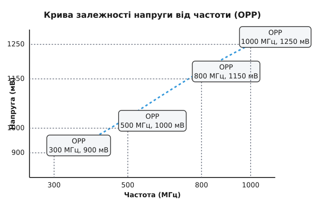

# Таблиці робочих точок (OPP): частота, напруга й рівень домену

<preknowlist>
- [Присипляння пристрою на ходу: runtime PM](book:unix-linux/runtime-power-management) — ядро зменшує споживання енергії, керуючи станом кожного пристрою окремо, а не лише машиною загалом.
- [Дерево пристроїв](book:unix-linux/device-tree) — залізо, яке не можна перелічити, описують вузлами з властивостями, і ядро читає цей опис під час завантаження.
- [Каркас тактування](book:unix-linux/clock-framework) — тактову частоту пристрою роздає й міняє окрема підсистема ядра, а не сам драйвер.
- [Підсистема регуляторів](book:unix-linux/regulator-framework) — напругу живлення пристрою вмикає й переставляє окрема підсистема з тим самим стилем інтерфейсу.
</preknowlist>

Коли ми вимагаємо від сучасного процесора (CPU) або графічного прискорювача (GPU) виконання складніших завдань, ми звикли очікувати, що система просто підвищить його тактову частоту, щоб швидше впоратися з навантаженням. Але за лаштунками апаратного забезпечення криється **нетривіальна проблема**: для стабільного перемикання транзисторів на вищих частотах пристрою обов'язково треба пропорційно підвищити напругу живлення. Якщо підняти частоту без підняття напруги, логічні рівні не встигатимуть встановлюватися, що призведе до катастрофічних апаратних помилок і зависань. З іншого боку, підвищення напруги квадратично збільшує енергоспоживання та тепловиділення. Як підсистеми DVFS (Dynamic Voltage and Frequency Scaling) узгоджують безпечні пари (частота, напруга), не допускаючи руйнівних помилок і мінімізуючи споживання струму? Відповідь полягає у використанні фреймворку Operating Performance Points (OPP).

## Проблема: Баланс між стабільністю та енергоспоживанням

Фізика CMOS-транзисторів визначає, що затримка розповсюдження сигналу залежить від прикладеної напруги. На високій частоті (коли період тактового сигналу дуже короткий) транзистори повинні заряджати і розряджати паразитні ємності значно швидше. Щоб забезпечити достатній струм для такого швидкого перезаряджання, напруга живлення (VDD) має бути збільшена. 

Якщо напруга виявиться надто низькою для даної частоти, логічний вентиль не встигне змінити свій стан до наступного тактового імпульсу. Це явище, відоме як порушення часових обмежень (timing violation), призводить до того, що процесор зчитує сміття замість правильних даних. 

Тому розробники мікросхем (SoC) ретельно тестують свої кристали і формують дискретні набори безпечних пар "частота-напруга". Кожна така пара гарантує стабільну роботу за визначених умов. Цей набір дискретних точок і є основою динамічного масштабування.


*Крива залежності напруги від частоти. Зі збільшенням частоти зростає необхідна напруга живлення. Червоні точки позначають визначені OPP, між якими система може перемикатися.*

## Фреймворк Operating Performance Points (OPP) у ядрі Linux

У ранніх версіях ядра Linux драйвери cpufreq (керування частотою CPU) містили власні таблиці з парами частоти й напруги, зашиті просто в код. З розвитком ARM SoC, де різні плати могли мати різні схеми живлення для однакових процесорів, цей підхід став некерованим.

Для розв'язання цієї проблеми в ядро Linux було додано фреймворк **Operating Performance Points (OPP)**. Його основне завдання — надати централізований інтерфейс для реєстрації, пошуку та управління дискретними робочими точками пристроїв. OPP абстрагує поняття "робочої точки", зводячи його до сукупності частоти, напруги та інших специфічних параметрів (наприклад, рівня продуктивності домену живлення).

Фреймворк OPP дозволяє:
1. Ізолювати дані про робочі точки від коду драйверів (винісши їх у Device Tree).
2. Забезпечити узгоджене керування як частотою (через Clock API), так і напругою (через Regulator API) під час перемикання.
3. Підтримувати спільні таблиці OPP для кластерів ядер (наприклад, у конфігураціях big.LITTLE, де всі ядра в кластері живляться від одного регулятора).

## Опис таблиць OPP у Device Tree

Сучасний стандарт опису робочих точок у Device Tree має назву `operating-points-v2`. Він замінив старіший формат масивів `operating-points` на користь структурованих вузлів. Кожен вузол таблиці містить перелік точок з їхніми детальними характеристиками.

Розгляньмо типовий приклад опису OPP-таблиці для процесора:

```include
proj-opp-dt-example.md
```

У цьому прикладі:
* Вузол `cpu@0` має посилання `operating-points-v2 = <&cpu_opp_table>;`, вказуючи, де шукати його робочі точки.
* Вузол `cpu_opp_table` містить властивість `opp-shared`. Це означає, що всі пристрої, які посилаються на цю таблицю (наприклад, інші ядра того ж кластера), повинні узгоджено змінювати свій стан, оскільки вони поділяють одну лінію живлення і тактовий генератор.
* Кожна підлегла гілка (`opp-300000000` тощо) описує одну робочу точку:
  * `opp-hz`: 64-бітне значення частоти в герцах (300 МГц, 500 МГц і т.д.).
  * `opp-microvolt`: Напруга в мікровольтах, яка необхідна для безпечної роботи на цій частоті (900 мВ, 1000 мВ).
  * `clock-latency-ns`: Час у наносекундах, необхідний системі PLL і регуляторам напруги для стабілізації після запиту на зміну стану. Цей параметр потрібен підсистемі cpufreq та її губернаторам, щоб оцінити "ціну" перемикання частоти.

Окрім базових пар, v2 дозволяє вказувати підтримувані версії апаратного забезпечення (hardware versions), мінімальні/максимальні допуски напруг (`opp-microvolt = <target min max>`), рівні продуктивності доменів живлення (power domain performance states) та потрібну пропускну здатність системних шин (`opp-peak-kBps` для interconnect).

## Динамічний пошук та встановлення OPP (OPP API)

Коли драйвер пристрою, наприклад `cpufreq-dt`, ініціалізується, він звертається до OPP API, щоб зчитати таблицю з Device Tree і заповнити внутрішні структури даних ядра.

```include
api-opp-functions.md
```

Процес перемикання частоти зазвичай відбувається так:
1. **Запит**: Підсистема cpufreq або devfreq визначає, що поточне навантаження вимагає вищої (або нижчої) продуктивності і розраховує бажану цільову частоту (`target_freq`).
2. **Пошук**: Викликається функція на зразок `dev_pm_opp_find_freq_ceil(dev, &target_freq)`. Вона шукає в OPP-таблиці пристрою найближчу доступну робочу точку, яка здатна забезпечити не меншу частоту, ніж запрошена.
3. **Застосування (Set Rate)**: Замість того, щоб драйвер пристрою самостійно перемикав регулятор напруги і тактовий генератор, він делегує це завдання ядру через функцію `dev_pm_opp_set_rate()`.

### Послідовність перемикання (Voltage Scaling)

Магія `dev_pm_opp_set_rate` полягає в тому, що вона точно знає правильну послідовність дій для уникнення апаратних збоїв:

* **Під час підвищення частоти (Scaling UP):**
  1. Спершу викликається Regulator API для **підвищення напруги** до потрібного рівня (`opp-microvolt`).
  2. Ядро чекає стабілізації напруги (затримка regulator'а).
  3. Тільки після того, як напруга стабілізувалася на вищому рівні, викликається Clock API для **збільшення частоти** генератора (`opp-hz`).
  Це гарантує, що процесор ніколи не опиниться в стані, коли частота вже висока, а напруга ще низька.

* **Під час зниження частоти (Scaling DOWN):**
  1. Спершу викликається Clock API для **зниження частоти**. (Менша частота цілком безпечно працює на високій напрузі, хоч і марнує енергію).
  2. Далі викликається Regulator API для **зниження напруги**, що дозволяє зекономити енергію після того, як частоту вже скинуто.

Ця асиметрія є ключовим правилом DVFS, і OPP фреймворк бере на себе гарантію її дотримання, звільняючи авторів драйверів від написання складного і схильного до помилок boilerplate-коду.

## Вплив на cpufreq та devfreq

Розвиток OPP суттєво спростив підсистеми управління продуктивністю в Linux. 

Драйвер **cpufreq-dt** (Generic CPUfreq Driver) став універсальним рішенням для більшості ARM SoC. Він не містить жодних специфічних для конкретного чипа таблиць. Замість цього він повністю покладається на OPP фреймворк. Він просто запитує таблицю OPP для кожного CPU і реєструє їх як доступні частоти для губернаторів (governors) cpufreq (schedutil, ondemand, performance).

Аналогічно, фреймворк **devfreq** використовує OPP для управління частотою GPU, контролерів пам'яті (DDR PHY), шин даних (NOC) та інших не-CPU пристроїв. Це дозволяє створювати загальні драйвери (наприклад, `panfrost` для GPU Mali), які можуть динамічно регулювати напругу і частоту відеоядра, просто використовуючи стандартизовані виклики `dev_pm_opp_set_rate`.

## Розширені можливості: Домени продуктивності та налаштування шин

Зі зростанням складності SoC (System-on-Chip), виявилося, що простої зміни частоти і напруги на самому процесорі недостатньо. Наприклад, якщо CPU працює на частоті 2 ГГц і намагається перекачати великі обсяги даних, системна шина (interconnect) або контролер пам'яті теж повинні бути переведені у більш продуктивний стан, інакше CPU просто простоюватиме в очікуванні даних (memory wall).

Для цього в OPP-таблицях з'явилася можливість вказувати `required-opps` або рівні продуктивності (performance states) для пов'язаних доменів живлення (power domains). Це дозволяє системі сказати: "Коли CPU переходить на точку 2 ГГц, він автоматично вимагає, щоб системна шина перейшла принаймні у свій стан OPP №3". OPP фреймворк в Linux автоматично відстежує ці залежності, об'єднує вимоги від різних споживачів (CPU, GPU, DSP) і встановлює такий стан спільної шини пам'яті, який задовольнить найвимогливішого клієнта в даний момент.

## Висновок

Operating Performance Points (OPP) фреймворк є фундаментом сучасного енергоефективного управління в Linux. Завдяки виносу апаратно-залежних даних у Device Tree та наданню стандартизованого API для послідовної зміни тактової частоти й напруги, OPP дозволяє створювати універсальні, надійні та гнучкі драйвери DVFS. Без нього кожна зміна архітектури вимагала б переписування сотень рядків коду в драйверах, а ризик отримати нестабільну роботу через неправильну послідовність перемикання напруги був би значно вищим.

Завдяки OPP сучасні мобільні пристрої та сервери можуть блискавично реагувати на зміни навантаження, залишаючись в межах безпечних робочих температур і продовжуючи час автономної роботи.
