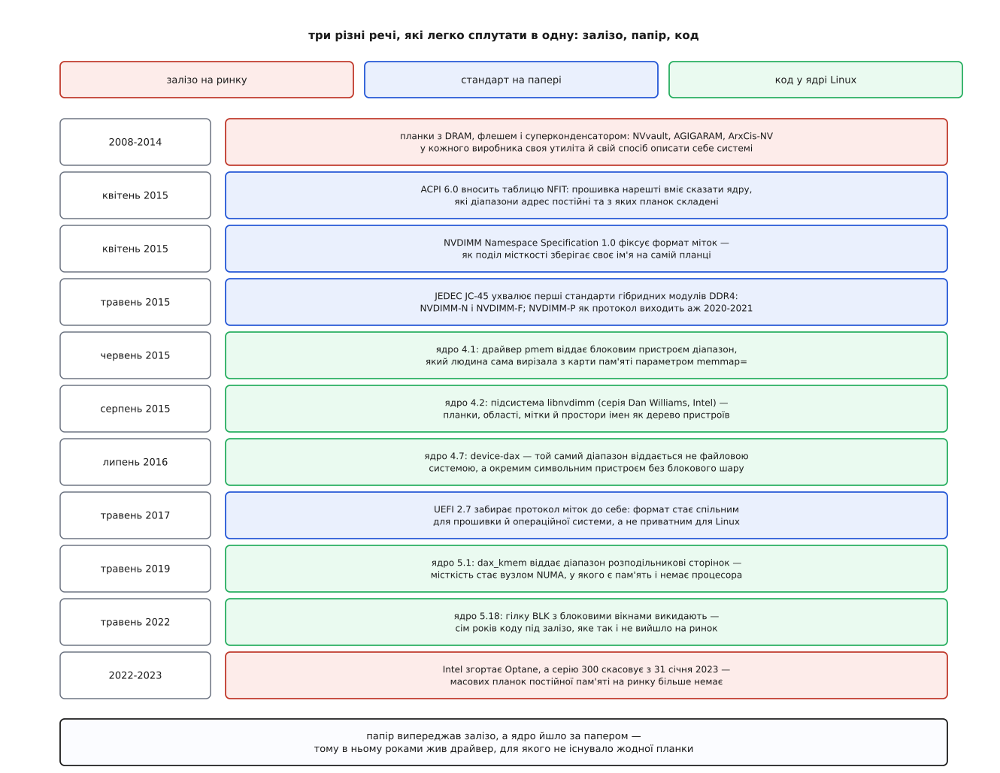

# 📜 Як домовилися про NVDIMM

Планка, що переживає вимкнення живлення, існувала майже десять років до того, як операційна система навчилася бачити її сама — і ця історія про те, чому найважчою частиною виявилося не залізо, а домовленість про те, як про залізо розповісти.

## Планка з батарейкою: задум, що працював без жодного стандарту

Задум простий настільки, що дивує, чому його не зробили раніше. Береш звичайну планку DDR, ставиш поруч мікросхеми флеш-пам'яті і джерело енергії — суперконденсатор або невелику батарею. Поки живлення є, планка працює як звичайна DRAM: контролер пам'яті нічого особливого не бачить, швидкість повна. Коли живлення зникає, запасеної енергії вистачає, щоб місцевий контролер планки встиг перелити весь вміст DRAM у флеш; при наступному ввімкненні він заливає його назад ще до того, як система почне завантажуватися. Неруйнівність тут не властивість комірки, а властивість процедури вимкнення.

Такі планки продавали задовго до будь-якого стандарту: Netlist із родиною NVvault, AgigA Tech із AGIGARAM на ультраконденсаторах, Viking Technology з ArxCis-NV. У гнізді DIMM вони були взаємозамінні — електрично й механічно це звичайні модулі.

А от у системі — ні. Як програма дізнається, що ця планка з батарейкою, а сусідня ні? Як наказати їй зберегтися просто зараз? Як спитати, чи вдалося минуле відновлення, чи не здох конденсатор, чи не вичерпався ресурс флешу? На кожне з цих питань виробник відповідав сам: власні регістри на службовій шині I²C, власна утиліта, власний драйвер. Планки були сумісні в гнізді й несумісні в операційній системі — і саме це, а не електроніка, тримало технологію в ніші.

## Дві половини стандарту, які писали різні організації

Перша половина — сам модуль. 26 травня 2015 року комітет JC-45 організації JEDEC оголосив про перші стандарти гібридних модулів DDR4, розроблені спільно з галузевою групою NVDIMM SIG, і разом з ними закріпив класифікацію, якою користуються дотепер:

- **NVDIMM-N** — та сама планка з батарейкою: працює DRAM, флеш потрібен лише для резервної копії й відновлення;
- **NVDIMM-F** — навпаки, назовні видно флеш, адресований як блоковий носій, а DRAM працює буфером;
- **NVDIMM-P** — змішаний варіант, найважчий, бо шина пам'яті мусить стерпіти непередбачувану затримку відповіді. Протокол шини для DDR4 (JESD304-4.01) вийшов аж у лютому 2021-го — редакційне оновлення публікації жовтня 2020 року, тобто на п'ять із гаком років пізніше за N і F.

Але JEDEC описує **модуль**: висновки, тайминги, службові дані SPD, підписи на наліпці. У його документах немає жодного слова про те, як операційна система дізнається, що діапазон фізичних адрес отакий-то — це постійна пам'ять, і як зветься те, що там записано. Це друга половина стандарту, і писала її зовсім інша спільнота.

> 🔧 **Навіщо це.** Розділення пояснює, чому планки NVDIMM-N роками продавалися й нікого не рятували від вендорних утиліт: стандарт на модуль робить планку купованою, а стандарт на опис робить її придатною для звичайного системного коду. Друге без першого безглузде, перше без другого — безсиле.

## 2015-й: чотири документи і одна підсистема

Другу половину дописали протягом одного року — і майже одночасно.

У квітні 2015 року вийшла специфікація ACPI 6.0 з новою таблицею NFIT (англ. *NVDIMM Firmware Interface Table*). Тепер прошивка могла перелічити діапазони постійної пам'яті, розписати, з яких планок і в якій пропорції складений кожен діапазон, і назвати методи звертання до прошивки самої планки ([Таблиці ACPI та простір імен](topic:unix-linux/acpi-tables-and-namespace) — прошивка лишає в пам'яті набір таблиць, з яких ядро вичитує те, чого не може виявити саме, від переліку процесорів до опису пристроїв). Того ж місяця з'явився документ **NVDIMM Namespace Specification 1.0** — формат ділянки міток на самій планці, тобто відповідь на питання, як поділ місткості зберігає своє ім'я між вимкненнями.

Далі документ мандрував: у травні 2017 року протокол міток увійшов до специфікації UEFI 2.7 і став спільним майном прошивки й операційних систем ([Прошивка UEFI](topic:unix-linux/uefi-firmware) — стандартизоване середовище, яке готує машину до запуску ядра й лишає йому опис заліза). Формат перестав бути приватною домовленістю однієї компанії з однією операційною системою.

Ядро йшло слідом, і по його версіях добре видно різницю між «є стандарт» і «є підтримка». У версії 4.1 (червень 2015) з'явився драйвер `pmem`: він віддавав блоковим пристроєм діапазон, який людина **сама** вирізала з карти пам'яті параметром завантаження `memmap=`. Ніякого переліку планок, ніяких імен — просто «оцей шматок адрес вважати носієм». Справжня підсистема прийшла в наступній версії, 4.2 (серпень 2015): серія Dan Williams з Intel завела **libnvdimm**, яка читала щойно опублікований NFIT і будувала з нього дерево пристроїв — планки, області, ділянки міток, простори імен.

Варто розрізняти шари цієї історії, бо їх легко злити в один. Задум був старий; стандарти дописали навесні 2015-го; реалізація в ядрі з'явилася за кілька місяців; а масовий товар, заради якого все це затівали, — Optane DC Persistent Memory — вийшов на ринок аж у 2019 році, майже через чотири роки після коду, що ним керує.

*Три різні лінії, кожна зі своїм темпом; збіг у 2015 році — не випадковість, а результат того, що всі три спільноти вперлися в одну й ту саму нерозв'язану проблему опису.*

## Гілка BLK: сім років коду під залізо, якого не сталося

NFIT описував **два** способи дістатися вмісту планки. Перший — знайомий: діапазон системних адрес, який процесор читає й пише звичайними інструкціями. Другий звався **блоковим вікном** (англ. *block data window*): планка виставляє кілька керівних регістрів і невелике вікно даних; ти записуєш у регістр внутрішню адресу всередині планки, а потім читаєш або пишеш крізь вікно.

Навіщо такий гак, коли є пряме відображення? Заради двох речей, яких пряме відображення не дає. Вікно звертається до **однієї конкретної планки**, обходячи чергування, — отже, збій носія псує дані лише цієї планки, а не всієї області, складеної з чотирьох. І передача крізь вікно природно має початок та кінець, тобто атомарність сектора дістається майже задарма, без окремої надбудови. Платня — кожне звертання коштує двох, і жодного відображення в пам'ять процесу.

Підсистема `libnvdimm` несла драйвер цієї гілки з першого дня: окремий режим простору імен, окремий драйвер `nd_blk`, окремий шлях у коді, який доводилося супроводжувати при кожній перебудові. Проблема виявилася в тому, що **жоден виробник не випустив планки з блоковими вікнами**. Механізм існував лише на папері ACPI та в ядрі Linux.

Розв'язка настала в травні 2022 року: Dan Williams видалив драйвер комітом з промовистою назвою «nvdimm/blk: Delete the block-aperture window driver». Файл `drivers/nvdimm/blk.c` ще є у версії 5.17 і зникає у 5.18; слідом із файлу супроводжувачів прибрали й окремий розділ про цей драйвер. Обґрунтування було не сентиментальне, а практичне: мертвий код заважав новим можливостям — зокрема просторам імен із кількох незв'язних шматків.

Висновок звідси не «стандарт помилився». Стандарт, написаний попереду заліза, — це гіпотеза, і поки її не спростовано, ядро платить за неї супроводом. Сім років — ціна перевірки.

## Що лишилося, коли скінчилося залізо

Решта історії підсистеми — рух від носія до пам'яті. Ядро 4.7 (липень 2016) додало `device-dax`: той самий діапазон віддається не файловою системою, а окремим символьним пристроєм, який уміє єдине — лягти у відображення процесу ([Прямий доступ DAX](topic:unix-linux/dax-direct-access) — шлях, на якому сторінки носія відображаються в пам'ять напряму, без проміжної копії в сторінковому кеші). Ядро 5.1 (травень 2019) додало `dax_kmem`, і місткість стало можна віддати розподільникові сторінок як звичайну пам'ять.

Апаратна гілка обірвалася швидко. Intel оголосив про згортання бізнесу Optane, підбиваючи підсумки другого кварталу 2022 року — зі списанням 559 мільйонів доларів, — а серію Persistent Memory 300 скасував з 31 січня 2023-го. Планок, заради яких писали NFIT, у нових серверах немає.

Домовленість пережила товар, бо вона з самого початку відповідала не на питання «як підтримати Optane», а на три загальніші: як прошивці описати ядру діапазон, якого ядро не вміє знайти саме; де такий діапазон зберігає імена своїх частин; і як один діапазон віддати різним за характером споживачам. Пристрої на лінку CXL ставлять ті самі три питання наново ([Пам'ять на CXL](topic:unix-linux/cxl-memory-devices) — модулі пам'яті, під'єднані не в гніздо DIMM, а через лінк, і те, як ядро зводить їх у діапазони) — і відповідають на них тими самими поняттями, які виробилися в суперечках 2015 року.
