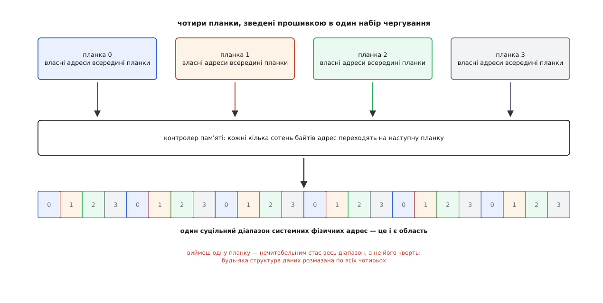
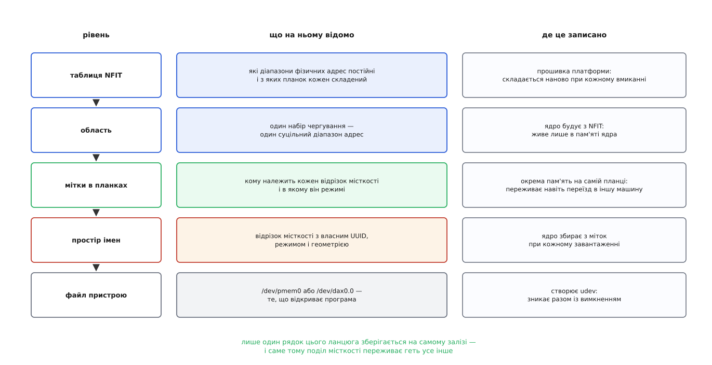
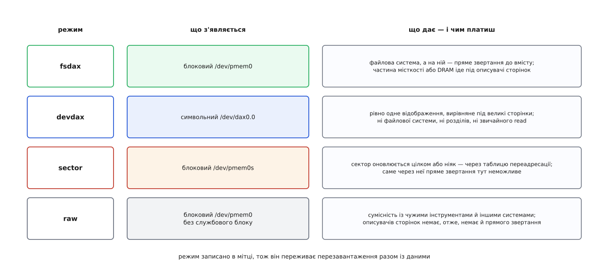
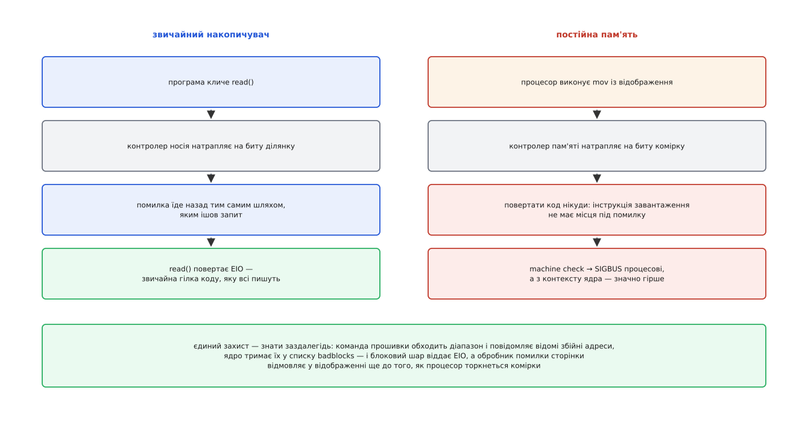

# Постійна пам'ять як пристрій: NVDIMM, простори імен і /dev/pmem

<preknowlist>
- [Сторінки, таблиці сторінок і MMU](topic:unix-linux/paging-and-mmu) — різниця між фізичною адресою й віртуальною та звідки ядро бере карту фізичної пам'яті.
- [Файл пристрою: символьний і блоковий](topic:unix-linux/device-file-model) — два різні способи, якими залізо показується програмам через файл у `/dev`.
- [Блоковий пристрій: сектори, блоки й черга запитів](topic:unix-linux/block-device-model) — накопичувач обмінюється блоками фіксованого розміру через чергу запитів.
- [Модель пристроїв у sysfs](topic:unix-linux/sysfs-device-model) — ядро показує все під'єднане деревом каталогів із шинами, пристроями й драйверами.
- [Розділи диска](topic:unix-linux/disk-partitions) — таблиця розділів лежить на самому носії, тому поділ диска їде разом із диском.
- [ACPI: таблиці прошивки](topic:unix-linux/acpi-tables-and-namespace) — прошивка залишає ядру набір таблиць з описом заліза й методи для керування ним.
- [DAX: пряме звертання](topic:unix-linux/dax-direct-access) — коли носій сам є пам'яттю, ядро вписує в таблицю сторінок адресу носія, і кеш сторінок зникає з дороги.
- [Модель фізичної пам'яті: SPARSEMEM і vmemmap](topic:unix-linux/sparsemem-and-vmemmap) — на кожен кадр фізичної пам'яті ядро тримає окремий описувач `struct page`.
</preknowlist>

## Пам'ять, якій потрібне ім'я

Планка оперативної пам'яті обходиться без драйвера. Прошивка налаштовує контролер пам'яті, передає ядру карту фізичних адрес — і знайомство на цьому закінчено: далі ядро просто роздає сторінки з тієї карти всім охочим. Ніхто не «відкриває» планку DRAM, у `/dev` вона не з'являється, і жодна програма не питає її на ім'я.

Поставмо в те саме гніздо планку, вміст якої переживає вимкнення живлення. Процесор працює з нею так само: звичайна інструкція, фізична адреса, точність до байта. Драйвер, здавалося б, тим паче зайвий.

А тепер покладімо на неї дві бази даних: одна займає перші триста гігабайтів, друга — решту. Машину вимкнули, увімкнули. Ядро бачить той самий діапазон фізичних адрес — і не має жодного способу дізнатися, де закінчується перша база й починається друга. Дані пережили вимкнення. Знання про те, як вони поділені, — ні.

Записати поділ у файл на диску не можна: планки виймають і переставляють в іншу машину, систему на диску переставляють, а дані лишаються там, де лежали. Тримати поділ у конфігурації ядра теж не можна з тієї самої причини. Поділ місткості мусить жити рівно стільки, скільки живуть дані, — тобто на самому залізі.

Ось звідки береться ціла підсистема навколо простої, здавалося б, планки. Оперативній пам'яті ім'я не потрібне, бо вона забуває: після ввімкнення це чисте поле, яке ядро ділить як йому зручно. Пам'яті, що не забуває, ім'я потрібне так само, як його потребує диск. І далі все розгортається з цієї єдиної вимоги: ядро мусить дізнатися від прошивки, яке залізо стоїть і як воно розкладене по адресах; прочитати з самого заліза, як місткість поділено; і дати кожній частині щось, що програма вміє відкрити.

## Звідки ядро дізнається, що планка є

Шину PCI можна перелічити: ядро читає конфігураційний простір і дізнається, хто там стоїть. З гніздами пам'яті так не вийде. У них немає ні конфігураційного простору, ні стандартного способу запитати «хто ти» — розшифровкою адрес займається контролер пам'яті, а налаштовує його прошивка ще до того, як ядро отримає керування ([UEFI як середовище виконання](topic:unix-linux/uefi-firmware) — прошивка не лише запускає завантажувач, а й лишає системі опис платформи та власні служби).

Отже, знає прошивка — вона й мусить розповісти. У версії ACPI 6.0 (2015) для цього з'явилася окрема таблиця: **NFIT** (англ. *NVDIMM Firmware Interface Table*). У ній записано три речі: які діапазони системних фізичних адрес є постійною пам'яттю; з яких планок кожен діапазон складено й у якій пропорції; і якими методами звертатися до прошивки самої планки — питати її здоров'я, читати службові дані, замовляти перевірку носія.

Ядро розбирає цю таблицю модулем `nfit` і передає розібране підсистемі **libnvdimm** — вона з'явилася в ядрі 4.2 (серпень 2015, серія Dan Williams з Intel) саме під щойно опублікований стандарт. Підсистема заводить власну псевдошину `nd` і будує на ній дерево пристроїв, яке видно в `/sys/bus/nd/devices`: окремий пристрій на кожну планку, окремий на кожен діапазон, а нижче — те, на що діапазон поділено. Далі все, що робиться з постійною пам'яттю, робиться в цьому дереві — або записом у sysfs, або утилітою `ndctl`, яка ті самі записи робить за людину.

## Область: одиницею є набір, а не планка

Контролер пам'яті ніколи не кладе суцільний шматок адрес на одну планку. Заради пропускної здатності він **чергує** (англ. *interleave*): кілька сотень послідовних байтів адрес обслуговує перша планка, наступні стільки ж — друга, і так по колу. Поки планки працюють паралельно, чотири канали дають учетверо ширший потік.

Для летючої пам'яті це деталь налаштування, про яку можна не думати. Для постійної — вирішальна обставина. Будь-яка структура даних, записана в такий діапазон, фізично розмазана по всіх планках набору: заголовок на першій, тіло на другій і третій, хвіст на четвертій. Виймеш одну — нечитабельним стає весь діапазон, а не його чверть.

Звідси випливає, що найменше, що має сенс саме по собі, — не планка, а весь набір чергування. Саме його libnvdimm і робить окремим пристроєм; називається він **областю** (англ. *region*). Одна область — один суцільний діапазон системних фізичних адрес і фіксований перелік планок з відрізками їхніх внутрішніх адрес, які в цей діапазон складаються.

*Цифра в кожній комірці смуги — номер планки, що обслуговує цей відрізок адрес; саме тому набір неподільний, а областю стає він увесь.*

Область ніде не зберігається: ядро складає її з NFIT наново при кожному ввімкненні. Це факт про платформу, а не про дані. А от поділ місткості області — це вже факт про дані, і йому потрібне інше місце.

## Мітка: поділ, що їде разом із залізом

На диску поділ вирішено давно: таблиця розділів лежить у перших секторах самого диска, тому переїжджає разом із ним. Здавалося б, зроби так само — відріж початок діапазону під заголовок, і готово.

Не вийде, і з двох причин одразу. Перша — той початок фізично лежить на одній планці з чотирьох, тоді як описує місткість усіх чотирьох; переставили планки в машину з іншим чергуванням — і заголовок опинився не там, де його шукають. Друга — увесь діапазон до останнього байта є місткістю для користувача, і будь-який службовий шматок у ньому мусили б однаково розуміти всі системи, які колись цю планку побачать.

Тому службові дані винесли зовсім з іншого боку. Кожна планка має власну невелику пам'ять, яка **не входить** в адресований діапазон і недосяжна звичайною інструкцією: до неї звертаються командою до прошивки планки. Це **область міток** (англ. *label storage area*), а формат записів у ній стандартизовано окремо — як протокол міток NVDIMM у специфікації UEFI.

Одна мітка каже приблизно таке: на цій планці, починаючи з такого зсуву її внутрішніх адрес, відрізок такої довжини належить простору імен з таким UUID і працює в такому режимі. Ядро збирає мітки з усіх планок області й складає з них **простори імен** (англ. *namespace*): простір імен, розтягнутий на чотири планки, — це чотири мітки зі спільним UUID.

Мітки треба вміти міняти так, щоб зникнення живлення посеред зміни не лишило набір напівпереписаним. Розв'язок той самий, що й у журналі файлової системи: в області міток є два блоки покажчиків із номерами поколінь, новий набір пишеться поверх старішого з них, і лише останнім рухом оновлюється номер покоління. Ядро при завантаженні бере той блок, чий номер більший і чия контрольна сума сходиться, — тобто бачить або старий поділ цілком, або новий цілком.

> 🔧 **Навіщо це.** Практичних наслідків три. Планка, вийнята з машини й переставлена в іншу, приносить із собою не лише байти, а й увесь поділ разом із режимами — жодного «імпорту конфігурації» робити не треба. Далі: `ndctl create-namespace` — операція над залізом, а не над файлом налаштувань, тож вона вимагає, щоб планка підтримувала команди доступу до міток; на платформах і у віртуальних машинах, де їх немає, поділ просто неможливий. І нарешті, коли справних міток немає взагалі — а це трапляється і в емуляції, і на простому залізі, — ядро не здається: воно заводить рівно один простір імен на всю область і робить це заново при кожному завантаженні. Саме так поводиться діапазон, вирізаний параметром `memmap=4G!12G`, яким постійну пам'ять емулюють на звичайній машині: `/dev/pmem0` з'явиться, а спроба поділити його на частини — ні.

*Усе, крім міток, ядро відбудовує щоразу заново; постійним є рівно один рівень — і тільки завдяки йому поділ місткості означає бодай щось після перезавантаження.*

Як усе це стандартизували — і чому знадобилося зводити разом планки з батарейкою, флеш-пам'ять і зовсім нову технологію, — розказано окремо ([Як домовилися про NVDIMM](topic:unix-linux/persistent-memory-devices/hist-nvdimm-standardisation.md) — від планок NVDIMM-N із суперконденсатором і вендорних утиліт до NFIT в ACPI 6.0, протоколу міток і підсистеми libnvdimm, а також про гілку BLK, яка так і не дочекалася заліза).

## Режим: що саме з'явиться в /dev

Простір імен — це відрізок постійної місткості з іменем. Лишається питання, яким інтерфейсом його віддати програмам, і відповідь на нього не одна: різні споживачі хочуть різних гарантій. Оскільки вибір мусить пережити перезавантаження, він записаний там само, де й межі відрізка, — у мітці.

**fsdax** — типовий вибір. З'являється блоковий пристрій `/dev/pmem0`, на ньому створюють звичайну файлову систему й монтують її звичайною командою; а оскільки діапазон водночас зареєстровано в підсистемі пам'яті, для нього існують описувачі сторінок, і файли на такій системі можна відображати напряму. За це доводиться платити місцем: `struct page` займає 64 байти на кожні 4096 байтів носія, тобто близько півтора відсотка місткості. Де тримати цей масив — вирішують під час створення простору імен: `--map=dev` кладе його в саму постійну пам'ять (тоді блоковий пристрій виходить трохи меншим за місткість, а на початку відрізка з'являється службовий блок з геометрією), `--map=mem` — у DRAM, і тоді на терабайтну планку піде понад сімнадцять гігабайтів оперативної пам'яті. Ці описувачі потрібні не заради краси: без них не працює ні закріплення сторінок під пряму передачу в пристрій, ні `sendfile` ([Закріплення сторінок і get_user_pages](topic:unix-linux/page-pinning-gup) — перш ніж пристрій напише в пам'ять процесу, ядро мусить узяти на її сторінки посилання).

**devdax** — це відмова від файлової системи. З'являється символьний пристрій `/dev/dax0.0`, який уміє майже одне: віддати весь свій діапазон у відображення. Ні розділів, ні каталогів, ні метаданих, які могли б розсипатися після аварії, — і відображення гарантовано вирівняне так, щоб його накривали великі сторінки ([Великі сторінки](topic:unix-linux/huge-pages) — один запис у таблиці накриває 2 МіБ чи 1 ГіБ замість 4 КіБ, і буфер трансляції адрес не захлинається на терабайтних відображеннях). Так беруть постійну пам'ять бази даних, яким потрібен один плаский шматок і жодного посередника між ними й комірками.

**sector** відповідає на протилежну потребу. Байтова адресація ламає припущення, на яке спирається кожна стара програма: сектор або записався цілком, або не записався зовсім. На постійній пам'яті зникнення живлення посеред запису лишає півсектора нового й півсектора старого, і ніхто цього не помітить. Тому в цьому режимі поверх місткості будують **таблицю переадресації блоків** (англ. *block translation table*, BTT): частина простору імен іде під запасні блоки й карту, запис лягає у вільний блок, і лише потім один атомарний запис у карті переводить номер сектора на нього. Ціна очевидна з того, як це влаштовано: адреса, яку бачить програма, більше не має сталого зв'язку з фізичною коміркою — отже, пряме звертання в цьому режимі неможливе в принципі.

**raw** не додає нічого: увесь відрізок віддано як блоковий пристрій без службового блоку й без описувачів сторінок, а значить і без прямого звертання. Це режим сумісності — так виглядає простір імен, створений інструментом, який про службовий блок Linux нічого не знає.

*Режим не є властивістю носія: він визначає, який драйвер ядро прив'яже до простору імен, а вже той вирішує, чим місткість стане для програм.*

Повний перелік того, що видно в дереві `nd` і якими важелями це крутять — від атрибутів у sysfs до команд `ndctl` і `daxctl`, — зібрано окремо ([Дерево nd і його важелі](topic:unix-linux/persistent-memory-devices/api-nd-tree-and-ndctl.md) — які пристрої й атрибути з'являються в `/sys/bus/nd/devices`, чим `ndctl list` відрізняється від обходу sysfs руками і які команди створюють, перемикають і руйнують простір імен).

## Помилка, яку нікуди повернути

На диску збійний сектор — рутина. Контролер носія не зміг прочитати, повідомив про це, блоковий шар передав вище, `read()` повернув `EIO`. Помилка їде назад тим самим шляхом, яким ішов запит, і потрапляє в гілку коду, яку програміст усе одно мусив написати.

На постійній пам'яті шляху назад немає. Програма читає байт інструкцією `mov`; комірка непоправно зіпсована; повернути код помилки нікуди — інструкція завантаження просто не має місця, куди його покласти. Замість цього спрацьовує апаратний механізм повідомлення про невиправну помилку пам'яті. Якщо адреса належала відображенню процесу, ядро вбиває доступ сигналом `SIGBUS`; якщо ж до битої комірки дотягнулося саме ядро, наслідки значно гірші ([Апаратна помилка пам'яті: hwpoison і SIGBUS](topic:unix-linux/memory-failure-hwpoison) — як ядро отруює сторінку з невиправною помилкою, кого й чим воно про це сповіщає і коли рятувати вже нічого).

Раз про помилку не можна дізнатися вчасно, лишається дізнаватися заздалегідь. Прошивка вміє обійти діапазон і повідомити адреси, які вона вже знає як биті, — це **перевірка діапазону адрес** (англ. *address range scrub*, ARS). Ядро тримає зібраний список для кожної області й кожного простору імен і показує його в sysfs файлом `badblocks`. Маючи список, обидва шляхи до даних встигають зупинитися завчасно: блоковий шар віддає `EIO` на такий сектор, не торкаючись комірок, а обробник помилки сторінки відмовляється відображати сторінку — програма дістає `SIGBUS` у зрозумілий момент, а не невиправну помилку посеред інструкції.

*Список збійних адрес потрібен не для звітності: він єдиний спосіб перетворити невиправну апаратну помилку на звичайний код помилки, який програма вміє обробити.*

Прибрати биту комірку зі списку звичайним записом не вийде: процесор пише в неї повз усі драйвери, і носій від такого запису нічого про себе не дізнається. Потрібна явна команда до прошивки планки, яку ядро видає, коли відповідний блок переписують через драйвер, — на практиці це або утиліта, або вирізання дірки у файлі поверх зіпсованого відрізка з наступним перезаписом. Виходить рідкісна для цієї підсистеми інверсія: у гарячому шляху драйвера немає взагалі, а от полагодити носій без нього не можна.

Як програма має поводитися, щоб пережити такий сигнал і не втратити всього, розібрано на робочому прикладі ([Пережити збійну комірку](topic:unix-linux/persistent-memory-devices/proj-survive-a-bad-cell.md) — відображення файлу на постійній пам'яті, обробник `SIGBUS` з адресою збою, повернення в безпечну точку, пошук ділянки в `badblocks` і її розчищення).

## Та сама місткість, віддана як звичайна пам'ять

Постійність потрібна не завжди. Часом від планки хочуть іншого: багато місткості за помірні гроші, хай і повільнішої за DRAM. І тут виявляється, що нічого робити не треба — діапазон уже є справжньою пам'яттю в фізичному адресному просторі.

Досить відв'язати пристрій `devdax` від його звичайного драйвера й прив'язати до драйвера `dax_kmem` (ядро 5.1, 2019). Той віддає діапазон розподільникові сторінок ядра як гаряче додану пам'ять ([Гаряче додавання пам'яті](topic:unix-linux/memory-hotplug) — ядро вміє брати нові діапазони фізичної пам'яті на ходу, блоками, і переводити їх у робочий стан). Місткість з'являється як вузол NUMA, у якого є пам'ять і немає жодного процесора ([Нерівномірний доступ до пам'яті](topic:programming/numa) — пам'ять машини поділена на вузли з різною вартістю доступу, і планувальник із розподільником це враховують). Далі з нею працює все, що вже вміє рахуватися з відстанями між вузлами: механізм ярусів пам'яті сам зсуває туди сторінки, до яких давно не зверталися.

На носії при цьому не змінилося нічого: ті самі комірки, ті самі адреси, та сама мітка з тим самим UUID. Змінилося лише те, який драйвер тримає пристрій, — і разом із цим зникла постійність як властивість, бо ядро віднині поводиться з діапазоном як зі звичайною летючою пам'яттю й нічого не обіцяє про його вміст після перезавантаження.

## Що пережило залізо

Постійної пам'яті у форматі планки на ринку більше немає. Intel згорнув Optane — єдину масову таку пам'ять — улітку 2022 року, а серію 300, розраховану на наступну платформу, скасував остаточно з кінця січня 2023-го. Планки, під які писали NFIT, зі свіжих серверів зникли.

Підсистема лишилася, бо розв'язувала не їхню приватну проблему. Питань було три, і жодне не про Optane: як ядру дізнатися про діапазон пам'яті, який воно не вміє перелічити саме; як поділ такого діапазону зберігає своє ім'я; і як один діапазон віддати різним за характером споживачам. Пристрої CXL ставлять ті самі три питання наново — пам'ять на лінку, описана власними таблицями, зібрана в області й віддана тому самому механізмові `devdax` ([Пам'ять на CXL](topic:unix-linux/cxl-memory-devices) — модулі пам'яті, під'єднані не в гніздо DIMM, а через лінк, і те, як ядро зводить їх у діапазони). Тим самим шляхом ідуть і діапазони, які прошивка позначає в карті пам'яті як призначені для особливого вжитку.

Отже, вирішальним виявилося не те, що пам'ять швидка, і навіть не те, що вона постійна. Вирішальним було те, що вона перестала забувати — а щойно пам'ять перестає забувати, їй потрібно рівно все, що потрібно диску: перелік, таблиця поділу, яка їде разом із носієм, файл у `/dev` і список збійних місць. Підсистема навколо NVDIMM — це і є ті чотири речі, зібрані для пам'яті замість диска.
