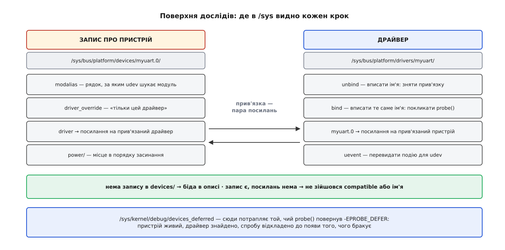

# ⚙️ Платформний драйвер, який можна зібрати й завантажити сьогодні

Тут зібрано два позаядерні модулі на кілька десятків рядків кожен: перший створює платформний пристрій, другий його обслуговує. Плати не треба, патчити ядро не треба — досить звичайної віртуальної машини; на ній видно все, заради чого ця шина існує: як пара сходиться, як її знімають руками, і що лишається на місці, коли вона не сходиться.

## Дві дороги дістати пристрій

Пристрій тут не знаходять, його **записують**. Отже, щоб мати з чим гратися, запис треба зробити самому — і зробити його можна двома способами.

**Накладка на [дерево пристроїв](topic:unix-linux/device-tree).** Дорога для справжньої плати: окремий шматок опису, який доклеюється до дерева машини й додає в нього вузол.

```dts
/dts-v1/;
/plugin/;

&{/} {
        fakeuart@40000000 {
                compatible = "acme,myuart-r1p2";
                reg = <0x0 0x40000000 0x0 0x100>;
                interrupts = <0 42 4>;
                clock-frequency = <24000000>;
        };
};
```

Збирається це звичайним компілятором дерева: `dtc -@ -I dts -O dtb -o fakeuart.dtbo fakeuart.dtso`. Розрядність комірок у `reg` і форма `interrupts` залежать від кореня дерева й від контролера переривань конкретної плати — звіряйте з її власним файлом, бо це саме ті числа, яких ніхто не перевіряє.

Прикласти накладку з простору користувача на ванільному ядрі **не вийде**: у `drivers/of/` є `overlay.c` із внутрішнім `of_overlay_fdt_apply()`, але файлу `configfs.c` там нема, і каталогу `/sys/kernel/config/device-tree/overlays` теж — цей інтерфейс так і лишився позаядерним і живе тільки у вендорних ядрах на кшталт Raspberry Pi. *Статус доказовості: перелік файлів `drivers/of/` звірено з деревом ядра.* Практично накладку прикладає завантажувач: `fdt apply` в U-Boot або рядок `dtoverlay=` у конфігурації Raspberry Pi.

Тому далі — друга дорога, яка працює будь-де: **пристрій, зареєстрований з коду** другим модулем.

## Куди показувати ресурс пам'яті

Драйвер відображатиме нульовий ресурс типу пам'яті, тож у цьому ресурсі має стояти діапазон фізичних адрес, який ядро дозволить відобразити. Спокуса очевидна: виділити сторінку й узяти її фізичну адресу. Це не працює, і не працює двічі.

По-перше, `devm_platform_ioremap_resource()` спершу просить діапазон у спільного дерева ділянок вводу-виводу, а вся оперативна пам'ять уже зайнята ділянками «System RAM», позначеними як виключні, — прохання повертається з `-EBUSY`. По-друге, навіть якби воно пройшло, `ioremap()` на x86 прямо відмовляється відображати звичайну пам'ять: у ньому стоїть перевірка, яка на такий діапазон видає `WARN_ONCE(1, "ioremap on RAM ...")` і повертає `NULL`. Причина не бюрократична: [відображення регістрів](topic:unix-linux/mmio-and-ioremap) робиться без кешування й без переставляння звертань, а та сама фізична сторінка вже видна ядру через звичайне кешоване відображення — два несумісні описи однієї сторінки.

Отже, шматок пам'яті треба забрати в ядра **до старту**. На x86 це один параметр [командного рядка ядра](topic:unix-linux/bootloader-and-cmdline):

```
memmap=1M$0x40000000
```

Долар означає «оголосити цей діапазон зарезервованим». Ядро занесе його в мапу пам'яті типом `E820_TYPE_RESERVED`, у `/proc/iomem` він з'явиться рядком `reserved`, і — це головне — виключним він **не** стане: у функції `do_mark_busy()` цей тип дає `false`. Тому прохання драйвера пройде, а `ioremap()` не побачить там системної пам'яті. *Статус доказовості: обидві перевірки звірено з поточним джерелом ядра.* Після перезавантаження переконайтеся: `grep -i reserved /proc/iomem` має показати рядок на `40000000-400fffff`.

## Модуль, що створює пристрій

Найкоротша форма реєстрації — один виклик, що бере ім'я, номер примірника й масив ресурсів:

```c
pdev = platform_device_register_simple("myuart", 0, fake_res, ARRAY_SIZE(fake_res));
```

Нам, однак, потрібна ще й властивість — щоб драйверу було що прочитати. Для властивостей є повніша форма з тими самими полями плюс `properties`:

```c
// SPDX-License-Identifier: GPL-2.0
#include <linux/module.h>
#include <linux/platform_device.h>
#include <linux/property.h>
#include <linux/err.h>

#define FAKE_BASE 0x40000000UL
#define FAKE_SIZE 0x100
#define FAKE_IRQ  11

static struct platform_device *fake;

static const struct resource fake_res[] = {
        DEFINE_RES_MEM(FAKE_BASE, FAKE_SIZE),
        DEFINE_RES_IRQ(FAKE_IRQ),
};

static const struct property_entry fake_props[] = {
        PROPERTY_ENTRY_U32("clock-frequency", 24000000),
        { }
};

static int __init fake_init(void)
{
        struct platform_device_info info = {
                .name       = "myuart",
                .id         = 0,
                .res        = fake_res,
                .num_res    = ARRAY_SIZE(fake_res),
                .properties = fake_props,
        };

        fake = platform_device_register_full(&info);
        return PTR_ERR_OR_ZERO(fake);
}

static void __exit fake_exit(void)
{
        platform_device_unregister(fake);
}

module_init(fake_init);
module_exit(fake_exit);
MODULE_DESCRIPTION("Підроблений платформний пристрій для дослідів");
MODULE_LICENSE("GPL");
```

Ім'я `"myuart"` тут не декоративне. Ні `compatible`, ні таблиці імен у цього запису нема, тож збіг відбудеться аж на останньому щаблі — порівнянням цього рядка з полем `driver.name` драйвера.

> 🔧 **Навіщо це.** Модуль, який реєструє пристрій без жодного заліза за ним, — не тільки навчальна іграшка. Точно так само драйвер багатофункційної мікросхеми роздає записи на свої внутрішні блоки, і точно так само заводять запис для суто програмної речі, щоб дістати `probe()`, вузол у `/sys` і місце в порядку засинання. Але найкорисніше застосування — розробка драйвера до того, як приїхала плата: підроблений запис дає справжній `probe()`, справжню прив'язку й справжнє вивантаження, і коли плата нарешті з'явиться, у драйвері доведеться змінити рівно одне — джерело чисел.

## Драйвер

```c
// SPDX-License-Identifier: GPL-2.0
#include <linux/module.h>
#include <linux/platform_device.h>
#include <linux/property.h>
#include <linux/io.h>

struct myuart {
        void __iomem *regs;
        int           irq;
        u32           rate;
};

static int myuart_probe(struct platform_device *pdev)
{
        struct device *dev = &pdev->dev;
        struct myuart *up;

        up = devm_kzalloc(dev, sizeof(*up), GFP_KERNEL);
        if (!up)
                return -ENOMEM;

        up->regs = devm_platform_ioremap_resource(pdev, 0);
        if (IS_ERR(up->regs))
                return PTR_ERR(up->regs);

        up->irq = platform_get_irq(pdev, 0);
        if (up->irq < 0)
                return up->irq;              /* сюди приходить і -EPROBE_DEFER */

        if (device_property_read_u32(dev, "clock-frequency", &up->rate))
                up->rate = 50000000;         /* властивості нема — усталене */

        platform_set_drvdata(pdev, up);
        dev_info(dev, "прив'язано: лінія %d, такт %u Гц, перше слово 0x%08x\n",
                 up->irq, up->rate, readl(up->regs));
        return 0;
}

static void myuart_remove(struct platform_device *pdev)
{
        struct myuart *up = platform_get_drvdata(pdev);

        dev_info(&pdev->dev, "від'єднано, такт був %u Гц\n", up->rate);
}

static const struct of_device_id myuart_of_match[] = {
        { .compatible = "acme,myuart-r1p2" },
        { }
};
MODULE_DEVICE_TABLE(of, myuart_of_match);

static struct platform_driver myuart_driver = {
        .probe  = myuart_probe,
        .remove = myuart_remove,
        .driver = {
                .name           = "myuart",
                .of_match_table = myuart_of_match,
        },
};
module_platform_driver(myuart_driver);

MODULE_DESCRIPTION("Навчальний платформний драйвер");
MODULE_LICENSE("GPL");
```

Три речі варті уваги. Функція `remove` повертає `void` починаючи з ядра 6.11; на 6.10 і старіших вона мусить повертати `int`, а для варіанта без значення там окреме поле `.remove_new` — воно з'явилося в 6.7 і зникло в 6.15, коли перехід завершили. *Статус доказовості: підписи звірено в заголовку `platform_device.h` версій 6.6, 6.11, 6.12 і 6.15.*

Префікс `devm_` означає, що [взяте прив'язано до пристрою й звільниться разом із ним](topic:unix-linux/devres-managed-resources) — тому в `probe()` нема жодного шляху виходу з прибиранням, а `remove()` нічого не звільняє й існує лише заради повідомлення. І `readl(up->regs)` у цьому повідомленні — не прикраса, а доказ: якби відображення не сталося, ми б до нього не дійшли, а так у зарезервованому шматку лежить те, що там лежало, і воно надрукується.

## Збірка

```make
obj-m += myuart.o fakedev.o

KDIR ?= /lib/modules/$(shell uname -r)/build

all:
	$(MAKE) -C $(KDIR) M=$(CURDIR) modules

clean:
	$(MAKE) -C $(KDIR) M=$(CURDIR) clean
```

Збирати треба заголовками саме того ядра, під яким модуль вантажитимуть: [двійковий інтерфейс ядра не стабільний](topic:unix-linux/kernel-abi-stability), і модуль, зібраний під сусідню версію, просто не завантажиться. Потрібен пакет заголовків (`linux-headers-$(uname -r)`) — звідки він береться, описано в темі про [збирання ядра](topic:unix-linux/kernel-config-and-build), а що таке модуль як об'єкт — у темі про [модулі ядра](topic:unix-linux/kernel-modules).

## Досліди

Порядок навмисний: спершу запис, і лише потім драйвер.

```sh
sudo insmod fakedev.ko
ls /sys/bus/platform/devices/ | grep myuart   # myuart.0 — запис уже є
ls /sys/bus/platform/drivers/ | grep myuart   # драйвера ще нема
sudo insmod myuart.ko
dmesg | tail -1                               # «прив'язано: лінія 11 …»
```

Запис прожив якийсь час сам, без драйвера, — і це не збій, а нормальний стан. Решта дослідів робиться на одній маленькій поверхні:



*Прив'язка видима як пара символьних посилань; те, чого нема, — теж діагноз.*

**Зняти й повернути прив'язку.** Найдешевший спосіб перевірити, що обидві половини драйвера справді працюють:

```sh
cd /sys/bus/platform/drivers/myuart
echo myuart.0 | sudo tee unbind    # remove(), посилання зникають
echo myuart.0 | sudo tee bind      # probe() знову, у журналі новий рядок
```

**Вивантажити по черзі.** Модулів два, і вивантажуються вони незалежно — це найкоротший спосіб побачити, що запис і драйвер таки різні речі:

```sh
sudo rmmod myuart                              # запис лишається, прив'язки нема
ls /sys/bus/platform/devices/ | grep myuart
sudo insmod myuart.ko                          # probe() кличеться одразу
sudo rmmod fakedev                             # спершу remove(), потім зникає запис
```

Тут голими очима видно обидва напрямки пошуку пари. Реєстрація драйвера змушує ядро перебрати наявні пристрої — тому повторний `insmod` дає `probe()` без жодних додаткових дій. Знищення пристрою змушує ядро спершу від'єднати від нього драйвер — тому `rmmod fakedev` дає спочатку рядок про від'єднання, а вже потім тишу.

**Нав'язати драйвер.** Файл `driver_override` у каталозі пристрою — це «прив'язуйся тільки до цього драйвера, і ні до кого більше»; порожній рядок повертає звичайний пошук. Сам запис у файл нічого не перевибирає, тож ефект видно вже після `unbind` і `bind`. У житті цим важелем віддають платформний пристрій узагальненому драйверу замість «рідного» — щоб, наприклад, прокинути його у віртуальну машину.

**Зламати збіг.** Поміняйте в `fakedev.c` ім'я на `"myuart-x"`, перезберіть і перезавантажте обидва модулі. У `/sys/bus/platform/devices/` буде `myuart-x.0`, драйвер на місці, посилань між ними нема — і в журналі ані слова. Тиша тут правильна: незбіг не є помилкою, бо шина не знає, чи мав хтось узагалі до цього запису підходити. На дорозі з накладкою те саме дає одна зайва літера в `compatible`.

**Відкласти спробу.** Поставте першим рядком `probe()` рядок `return -EPROBE_DEFER;` і перезберіть:

```sh
sudo cat /sys/kernel/debug/devices_deferred
myuart.0	myuart
```

Ліворуч пристрій, праворуч драйвер, який відклався. Файл лежить у `debugfs` — одній із [псевдофайлових систем](topic:unix-linux/pseudo-filesystems), зазвичай уже примонтованій у `/sys/kernel/debug`. Ядро повертатиметься до цього пристрою щоразу, коли в системі з'явиться новий драйвер: відкладена спроба — не смерть, а очікування. Механіку цього очікування розібрано в темі про [прив'язку драйвера до пристрою](topic:unix-linux/driver-probe-and-binding).

## Пастки

**Перейменування `driver.name`.** Поле виглядає як підпис для людини, а насправді це діючий ідентифікатор. У нашій підробці збіг тримається саме на ньому: перейменували драйвер — пара розпалася мовчки. На дорозі з деревом наслідок підступніший: пара далі сходиться за `compatible`, зате переїжджає каталог `/sys/bus/platform/drivers/<ім'я>/`, і разом з ним ламаються всі скрипти, що писали в `bind` та `unbind`.

**Номер переривання, узятий із ресурсу напряму.** Написати `platform_get_resource(pdev, IORESOURCE_IRQ, 0)->start` замість `platform_get_irq()` — помилка, яка блискуче працюватиме саме на цьому підробленому пристрої, бо тут у ресурсі й справді лежить готовий номер Linux. У пристрої з дерева такого ресурсу може не бути взагалі, а коли він є, там лежить інше — вхід того контролера переривань, на який посилається вузол, — і перетворити його в номер Linux можна лише тоді, коли контролер уже зареєстрував свій простір номерів. Разом із коротким шляхом губиться й `-EPROBE_DEFER`, тобто драйвер не дочекається, а візьме сміття.

**Забутий `MODULE_DEVICE_TABLE`.** Без цього макроса таблиця збігу лишається всередині модуля й не потрапляє в його метадані. Поки ви вантажите модуль руками через `insmod`, усе працює бездоганно. На чистій системі, де модуль мав би підтягнутися сам, `udev` дістане з пристрою рядок `modalias` і не знайде за ним нічого — пристрій буде, драйвер буде на диску, а прив'язки не буде. Це найтиповіший вид «у мене працює»: помилку видно не там, де вона зроблена, і не в тих, хто її зробив.
