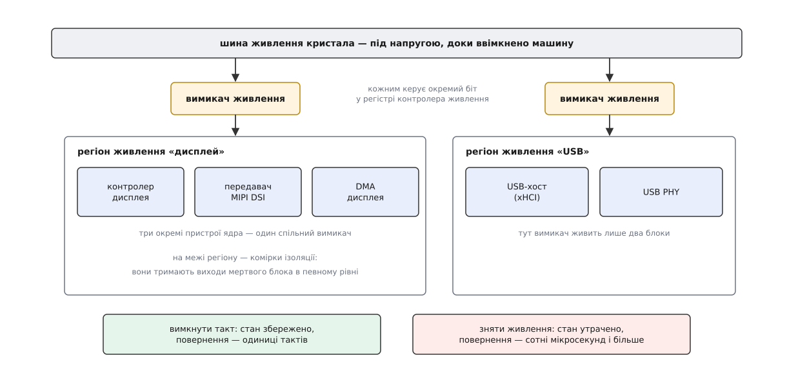
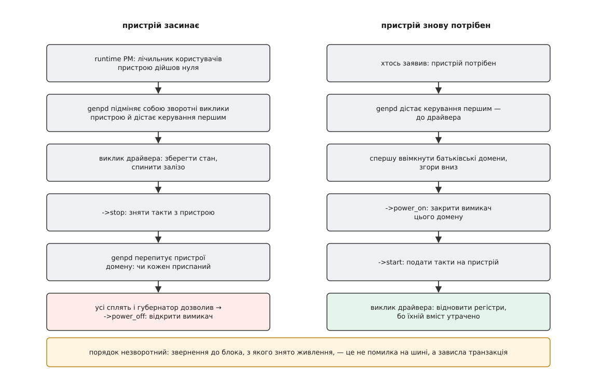
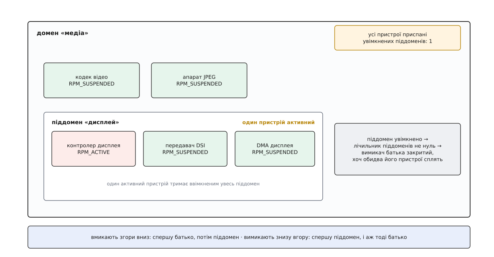

# Домени живлення в ядрі: genpd і спільний вимикач на групу пристроїв

<preknowlist>
- [Присипляння пристрою на ходу: runtime PM](book:unix-linux/runtime-power-management) — ядро рахує заявників на кожен пристрій і присипляє його, коли лічильник дійшов нуля.
- [Модель пристроїв у sysfs](book:unix-linux/sysfs-device-model) — усі пристрої зібрані в одне дерево «батько — дитина», і кожен видно назовні каталогом з файлами-атрибутами.
- [Дерево пристроїв](book:unix-linux/device-tree) — прошивка описує ядру залізо, якого не можна перелічити опитуванням шини, і зв'язки між його вузлами.
- [Прив'язка драйвера до пристрою](book:unix-linux/driver-probe-and-binding) — probe, збіг за таблицею й відкладена спроба, коли потрібного постачальника ще немає.
- [Шина platform](book:unix-linux/platform-bus) — дім для вбудованих у кристал блоків, які не вміють оголосити себе самі.
- [Підрахунок посилань](book:programming/reference-counting) — лічильник живих користувачів ресурсу: доки він не нуль, ресурс чіпати не можна.
- [Призупинення й пробудження системи](book:unix-linux/suspend-and-resume) — окремий шлях, яким уся машина разом лягає в сон.
- [Стіна потужності](book:programming/power-wall) — чому саме енергія й струм витоку, а не швидкодія, диктують устрій сучасних кристалів.
</preknowlist>

## Драйвер зробив усе правильно, а струм не впав

Планшет показує статичну картинку. Контролер дисплея відмалював кадр і йому більше нема чого робити: драйвер акуратно дочекався кінця обміну, зберіг регістри й повідомив ядру, що пристрій можна приспати. Ядро приспало. У `/sys/devices/.../power/runtime_status` чесно написано `suspended`.

Ви ставите амперметр у розрив живлення плати й не бачите нічого. Струм не змінився ані на міліампер.

Пояснення не в драйвері й не в ядрі. Воно в кремнії: **те, що фізично знімає струм із контролера дисплея, не належить контролеру дисплея**. І доки ми не розберемо, кому воно належить, жодна кількість правильних драйверів нічого не заощадить.

## Чому вимикачів менше, ніж блоків

Усередині кристала блок не приєднаний до шини живлення напряму. Між шиною й блоком стоїть ряд транзисторів-ключів, розкиданих по його площі, — їх відкриває або закриває біт у регістрі контролера живлення. Закрили ключі — блок під напругою; відкрили — блок знеструмлено, і разом зі струмом витоку зникає весь його стан: вміст регістрів, стан кінцевих автоматів, усе.

Це не те саме, що зняти з блока такт. Зупинка такту прибирає динамічну потужність — ту, що витрачається на перемикання транзисторів, — але залишає струм витоку, зате й зберігає стан: подали такт назад, і блок продовжив із того самого місця через кілька тактів. Зняття живлення прибирає й витік, але коштує повного відновлення: подати напругу, дочекатися, доки вона усталиться, зняти скидання, наново записати всі регістри. Різниця в ціні повернення — чотири-п'ять порядків за часом.

Тепер найважливіше. Ряд ключів — це не одна деталь, а десятки тисяч транзисторів, розсіяних по площі блока: вони мусять пропускати весь його піковий струм, не просідаючи. Це площа кристала. Далі: кожен сигнал, що виходить із знеструмленої частини назовні, треба перехопити коміркою ізоляції — інакше «плаваючий» вихід мертвого блока подасть на живого сусіда невизначений рівень і зжере в ньому наскрізний струм. Це ще площа, і вона пропорційна кількості проводів через межу. Далі: кожна така частина потребує власної послідовності вмикання, власного скидання, власного біта в контролері живлення й власної перевірки на всіх режимах.

Уся ця ціна платиться за таку частину кристала цілком, а не за транзистор усередині неї. Частину, яку живить один спільний ряд ключів, називають **регіоном живлення**. Тому проєктувальник кристала малює регіонів мало, а в кожен складає те, що зазвичай працює разом: контролер дисплея разом із передавачем MIPI DSI і його DMA; приймач камери разом із процесором зображення; USB-хост разом зі своїм фізичним рівнем.



*Кожен блок усередині регіону ядро бачить окремим пристроєм, а вимикач у них один на всіх.*

Звідси й береться розрив, з якого почалася розмова. **Зернистість вимикання в залізі грубіша за зернистість пристроїв у ядрі.** Контролер дисплея — окремий пристрій із власним драйвером і власним лічильником користувачів. Передавач DSI — теж. А струм у них спільний, і зняти його можна тільки в обох одночасно.

## Чому драйвер не має права вирішувати це сам

Найпростіший здогад — навчити драйвер контролера дисплея питати сусіда. Він розсипається з двох боків.

По-перше, драйвер не знає сусіда й не повинен знати. Той самий драйвер контролера дисплея працює на п'ятьох різних кристалах, і на кожному межі регіонів живлення пролягають інакше: тут DSI в одному регіоні з контролером, а там — в окремому, разом із HDMI. Групування — властивість конкретного кристала, а не драйвера. Властивості конкретного кристала ядро дізнається з [дерева пристроїв](book:unix-linux/device-tree), і саме там групування й описане.

По-друге, навіть якби знав — двоє не домовляться. Щоб вирішити «вимикати чи ні», треба одночасно бачити стан усіх учасників і не дати нікому змінити свій стан посеред рішення. Це вимагає одного замка на всю групу. Замок мусить комусь належати, і цей хтось за визначенням не є жоден із учасників.

Отже, потрібна третя сторона, яка знає склад групи, бачить стан кожного її члена й володіє бітом у регістрі. У ядрі вона зветься **доменом живлення** (від лат. *dominium* — володіння), а її втілення — `struct generic_pm_domain`, скорочено genpd. Домен у ядрі — це модель фізичного регіону: регіон є на кристалі, домен є в пам'яті, і кожен домен володіє рівно одним вимикачем. Об'єкт з'явився 2011 року під один-єдиний кристал, а через дванадцять років пережив показове перейменування всієї підсистеми — [як народився genpd](book:unix-linux/power-domains-genpd/hist-genpd-birth.md).

## Домен не вигадує критерію — він рахує краї

Домену не треба відповідати на питання «чи потрібен зараз контролер дисплея». На це питання вже відповідає [runtime PM](book:unix-linux/runtime-power-management): кожен, хто збирається користуватися пристроєм, підвищує його лічильник, а закінчивши — знижує, і коли лічильник дійшов нуля, ядро переводить пристрій у стан `RPM_SUSPENDED`. Знання про потрібність живе там, де пристроєм користуються, і руками драйвера вже перетворене на стан.

Тож домену вистачає **країв цього стану**: миті, коли пристрій став приспаним, і миті, коли він знову знадобився. Свого лічильника активних домен не веде: діставши край, він щоразу проходить список приєднаних до нього пристроїв і питає в кожного, чи той уже приспаний. Останній заснув, жодного активного не лишилось — можна відкривати вимикач. Перший знадобився — вимикач треба закрити ще до того, як драйвер торкнеться першого регістра.

Щоб дістати ці краї, genpd вклинюється в шлях виклику. У `struct device` є поле `pm_domain`, і ядро перевіряє його **першим**: якщо воно не порожнє, викликаються зворотні виклики домену, а не шини, класу чи драйвера. Це не обхідний шлях, а задокументована черга старшинства — домен старший за все інше саме тому, що описує обмеження, про яке решта не знає. Прив'язавши пристрій, genpd підставляє власні `runtime_suspend` і `runtime_resume`, які обгортають рідні виклики драйвера.



*Домен дістає керування першим і в обидва боки, тому вимикач завжди відкривається після того, як залізо спинено, і закривається до того, як драйвер до нього звернеться.*

Порядок усередині цієї обгортки не є питанням смаку. На засинанні спершу працює драйвер — доводить обмін до кінця й зберігає те, що доведеться відновлювати; потім `->stop` знімає такти (сам домен їх не роздає — він просить про це [каркас тактування](book:unix-linux/clock-framework), який рахує споживачів кожного такту так само, як runtime PM рахує споживачів пристрою); і аж тоді домен зменшує лічильник і, можливо, відкриває вимикач. На пробудженні все дзеркально: спершу живлення, потім такти, і лише потім драйвер. Порушити цей порядок означає звернутися до блока, який не має напруги. На шинах усередині кристала це зазвичай не помилка, яку хтось поверне, а **транзакція, що не завершиться ніколи**: процесор чекає відповіді від того, кого вже немає, і система зависає без жодного повідомлення.

Ті самі міркування чинні й тоді, коли засинає вся машина: домен перехоплює не лише виклики runtime PM, а й системні, і гасить свій вимикач у пізній фазі [призупинення](book:unix-linux/suspend-and-resume), коли всі його пристрої вже приспані, а переривання вимкнені. Механізм той самий, змінюється лише привід.

> 🔧 **Навіщо це.** Через цей самий порядок домен — типове місце падіння при неакуратному переносі драйвера на новий кристал. Якщо драйвер читає регістр пристрою у своєму `probe` до того, як увімкнув живлення, на платі зі спільним вимикачем він працюватиме через раз: коли сусід у тому самому регіоні вже активний, регіон живий і читання проходить; коли сусід спить — машина зависає намертво. «Плаває залежно від порядку завантаження модулів» — характерний почерк саме цієї помилки.

## Найчастіша хвороба: домен, який ніколи не спить

З того, що домен їде на краях runtime PM своїх членів, випливає неприємний наслідок. Достатньо одного пристрою в регіоні, чий драйвер не реалізує runtime PM або тримає лічильник піднятим назавжди, — і перевірка «чи всі приспані» ніколи не пройде. Вимикач не відкриється. Уся акуратність решти драйверів у цьому регіоні не заощадить нічого.

Тому діагноз «домен не засинає» майже ніколи не стосується того драйвера, з якого починали. Шукати треба, хто саме тримає, і genpd показує це прямо. У debugfs є каталог `pm_genpd`, у ньому — по підкаталогу на домен із файлами `current_state`, `devices`, `sub_domains`, `idle_states`, `active_time`, `total_idle_time`, а поруч зведення на всі домени одразу:

```
$ cat /sys/kernel/debug/pm_genpd/pm_genpd_summary
domain                          status          children
    /device                                             runtime status
----------------------------------------------------------------------
pd-display                      on
    /devices/platform/soc/1c40000.display                active
    /devices/platform/soc/1c41000.dsi                    suspended
pd-camera                       off-0
```

Читається просто: домен `pd-display` увімкнено, бо серед його пристроїв є `active`, і винен у цьому саме контролер дисплея, а не DSI. Сусідній домен вимкнено, і `off-0` каже, у якому саме зі своїх станів вимкнення він лежить. Далі питання переїжджає до драйвера пристрою-винуватця — і воно вже не про домени.

## Регіони вкладаються — і домени теж

На кристалі регіони рідко лежать поруч як рівні. Частіше великий регіон живить кілька менших: спільна шина медіапідсистеми, а всередині — окремі ключі на дисплей і на камеру. Щоб зняти напругу з великого, треба спершу зняти її з усіх малих усередині.

Ядро повторює цю вкладеність один в один: домен може бути членом іншого домену — **піддоменом**. Симетрія тут точна. Пристрій для свого домену — це щось, що буває активним або приспаним; піддомен для батьківського домену — теж. Тому батько тримає лічильник увімкнених піддоменів — єдине число такого роду в домені: пристрої він опитує щоразу наново, а от піддомен сам повідомляє про кожну свою зміну. Відкрити свій вимикач батько має право лише тоді, коли жоден його пристрій не активний і цей лічильник — нуль.



*Обидва пристрої батьківського домену сплять, але ввімкнений піддомен тримає його лічильник піддоменів — і вимикач лишається закритим.*

Напрям поширення в цієї конструкції різний у два боки, і теж не довільний. Вимкнення йде **знизу вгору**: піддомен погасив себе, зменшив лічильник батька, і аж тепер батько дивиться, чи може погаснути сам. Увімкнення йде **згори вниз**: перш ніж закривати ключ піддомену, треба, щоб на нього було що подавати, тобто батько вже мусить бути живим. Спроба ввімкнути дитину раніше за батька — це знову звертання до знеструмленого регістра, з тим самим наслідком.

## Вимкнути можна — але чи варто

Домен не вимикають щоразу, коли можна. Повернення коштує часу: напруга має усталитися в регіоні, треба зняти скидання, а потім кожен драйвер у регіоні наново запише свої регістри, бо їхній вміст утрачено разом із живленням. Разом набігає від сотень мікросекунд до одиниць мілісекунд — і весь цей час пристрій, якого раптом захотіли, недоступний.

Для когось це байдуже, а для когось — зірваний контракт. Аудіотракт, що віддає буфер кожні кілька мілісекунд, не може дозволити собі пробудження на три мілісекунди. Тому споживач має спосіб оголосити межу: у файл `power/pm_qos_resume_latency_us` (або з коду ядра — запитом до підсистеми обмежень якості обслуговування, [PM QoS](book:unix-linux/pm-qos-constraints)) записується найбільша прийнятна затримка пробудження цього пристрою. Домен збирає такі оголошення з усіх своїх членів і бере **найжорсткіше**: обіцянка, дана одному, обов'язкова для всієї групи.

Рішення ухвалює губернатор домену — окремий змінний шматок логіки, у якого genpd питає `power_down_ok()` перед кожним вимиканням.

**Умова.** У домені «дисплей» два пристрої. Аудіоканал, що ділить із ним регіон, оголосив межу пробудження 5 мс; контролер дисплея межі не ставив. Сам домен вертає живлення за 1.8 мс, а драйвери після цього відновлюють регістри ще 0.4 мс. Найдрібніший стан вимкнення в домені має витримку 3 мс.

```
затримка домену на ввімкнення   = 1.8 мс
відновлення регістрів драйверами = 0.4 мс
------------------------------------------------
повне пробудження                = 2.2 мс

найжорсткіша межа серед членів   = min(5 мс, ∞) = 5 мс
запас                            = 5.0 − 2.2 = 2.8 мс  → вимикати дозволено

якщо ж домен устигне пролежати вимкненим менше за 3 мс —
енергія переходу не окупиться, і губернатор відмовляє
```

Друга умова тут — та сама, що й у сну процесорних ядер: перехід сам коштує енергії, тому надто короткий сон збитковий. Розрахунок точки окупності однаковий для будь-якого рівня, і його докладно розібрано на прикладі [сну ядра процесора](book:unix-linux/cpuidle-and-cstates/math-break-even.md). Різниця в тому, звідки береться оцінка тривалості: процесорний губернатор має передбачення з таймерів, а домен пристроїв здебільшого спирається на оголошені межі, і лише для доменів із процесорами всередині враховує ще й найближче пробудження.

Домен, як і ядро процесора, може мати не один стан вимкнення, а кілька різної глибини — масив `states`, де в кожного свої `power_on_latency_ns` і `residency_ns`. Губернатор вибирає найглибший, що вкладається в бюджет.

## Не тільки «увімкнено чи ні»

Спільною буває не лише наявність напруги, а і її величина. Регіон живиться від перетворювача, у якого напругу можна ставити ступенями — тими самими, що дають кристалу змогу працювати то повільно й ощадно, то швидко й гаряче ([DVFS](book:programming/dvfs)). Ступінь один на весь регіон, бо перетворювач один. Отже, вибрати треба такий, який влаштує **найвимогливішого** члена групи: якщо відеокодек просить високу напругу, а дисплей поруч задовольнився б низькою, регіон стоятиме на високій, і дисплей платитиме за апетит сусіда.

Тому домен агрегує ще одне число — рівень продуктивності, і агрегує його **максимумом**, на відміну від лічильника активних, який є сумою. Драйвер оголошує свою вимогу викликом `dev_pm_genpd_set_performance_state()`, genpd перераховує максимум по всіх членах і піддоменах і, якщо він змінився, просить постачальника перевести регіон на новий рівень. Коли вимогливий пристрій засинає, його голос зникає з підрахунку й рівень падає сам.

Вручну це майже ніколи не пишуть. У таблиці робочих точок пристрою (*operating points*) кожна точка має властивість `required-opps`, яка ставить у відповідність частоті пристрою потрібний рівень його домену; після цього одна зміна частоти через `dev_pm_opp_set_rate()` сама виставляє такт, напругу [регулятора](book:unix-linux/regulator-framework) і рівень домену узгоджено.

## Звідки ядро дізнається склад групи

Усе описане тримається на знанні «хто в якому домені», і це знання приходить із дерева пристроїв. Вузол-постачальник оголошує, що вміє віддавати домени, і скільки чисел потрібно, щоб назвати один із них; вузол-споживач посилається на постачальника:

```dts
pmu: power-controller@1c00000 {
        compatible = "vendor,soc-power-controller";
        reg = <0x1c00000 0x1000>;
        #power-domain-cells = <1>;
};

display@1c40000 {
        compatible = "vendor,soc-display";
        reg = <0x1c40000 0x1000>;
        power-domains = <&pmu 3>;
};

dsi@1c41000 {
        compatible = "vendor,soc-dsi";
        reg = <0x1c41000 0x1000>;
        power-domains = <&pmu 3>;   /* той самий домен, що й у дисплея */
};
```

Момент прив'язки — probe. Перш ніж покликати `probe` драйвера, ядро само шукає властивість `power-domains`, знаходить домен і приєднує до нього пристрій, щоб драйвер уже стартував із гарантованим живленням. Звідси звичайна колізія порядку: якщо драйвер контролера живлення ще не завантажився, домену просто немає. Ядро повертає `-EPROBE_DEFER`, прив'язка драйвера відкладається й повторюється пізніше — той самий механізм [відкладеної спроби](book:unix-linux/driver-probe-and-binding), яким розв'язуються всі залежності між драйверами.

Один домен на пристрій ядро підключає само. Кілька — не може: воно не знає, який із них вмикати першим і чи потрібні вони одночасно. Тоді у вузлі перелічують кілька доменів і дають їм імена в `power-domain-names`, а драйвер підключає їх сам викликом `dev_pm_domain_attach_by_name()`. Той створює на кожен домен **віртуальний пристрій**, який драйвер прив'язує до свого справжнього [зв'язком між пристроями](book:unix-linux/device-links) — явним ребром «постачальник → споживач», що змушує ядро присипляти й будити їх у правильному порядку, якого з дерева «батько — дитина» не видно. Так описують блок, що живиться від двох регіонів одразу — скажімо, окремо логіка й окремо пам'ять усередині нього.

> 🔧 **Навіщо це.** Питання «чому цей драйвер завантажується з десятої спроби» й «чому пристрій зник після оновлення дерева пристроїв» майже завжди читаються звідси. Пропущений `power-domains` у вузлі означає, що ядро вважає блок живим завжди, і драйвер працюватиме рівно доти, доки регіон випадково тримає ввімкненим хтось інший.

З протилежного боку — з боку того, хто домени постачає, — треба заповнити структуру домену, обрати губернатора й зареєструватися постачальником для дерева пристроїв. Перелік полів, прапорців поведінки й функцій реєстрації зібрано в [довідці на інтерфейс genpd](book:unix-linux/power-domains-genpd/api-genpd-provider.md), а невеликий працездатний постачальник із двома доменами й піддоменом, який одразу видно в debugfs, розібраний у [прикладі коду](book:unix-linux/power-domains-genpd/proj-genpd-provider.md).

## Що з цього лишається

Домени живлення не додають ядру нової політики економії — політика вся в runtime PM. Вони додають те, чого в моделі пристроїв немає й не могло бути: **межу, проведену не по логіці, а по кремнію**. Модель пристроїв росте з того, як залізо влаштоване функційно — контролер, шина, дитина, батько. Регіони живлення ріжуть кристал інакше — за тим, що вигідно вимикати разом, і цей поріз не збігається з першим.

Практичний наслідок один, зате твердий: правильність керування живленням не буває локальною. Драйвер, бездоганний сам по собі, не заощадить нічого, доки його сусіди по регіону не такі ж бездоганні, — і навпаки, один недбалий драйвер знецінює роботу всіх, з ким ділить вимикач. Саме тому економія на вбудованій системі ніколи не робиться по драйверу за раз: одиницею роботи є регіон, а не пристрій.
