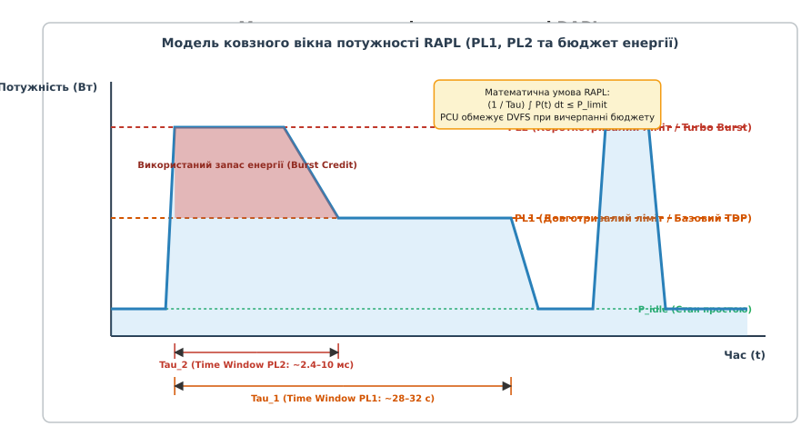
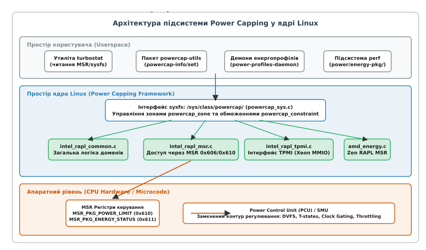
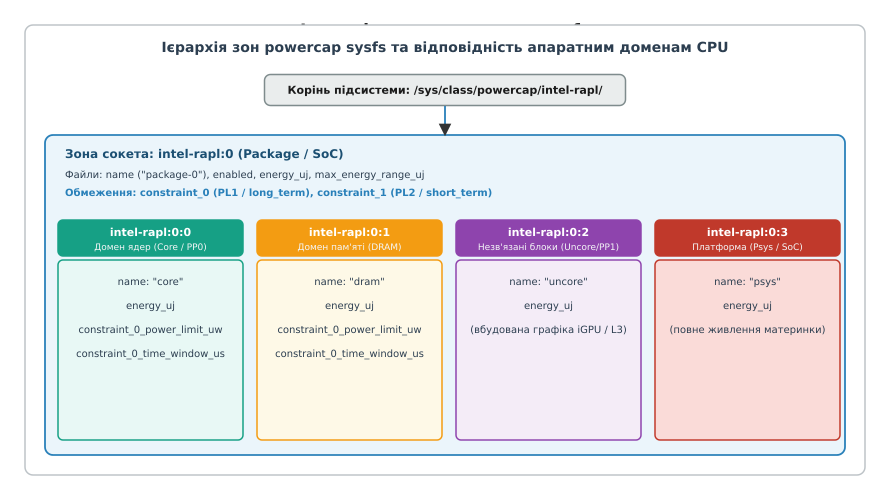
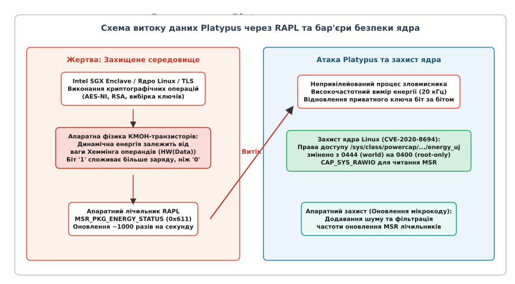

# Підсистема powercap та ліміти потужності RAPL

<preknowlist>
- [Управління частотою та станами CPU](topic:unix-linux/cpufreq-and-cpuidle) — динамічне масштабування напруги й частоти (DVFS), P-стани продуктивності та C-стани простою.
- [Модель пристроїв та sysfs](topic:unix-linux/sysfs-device-model) — ієрархія kobject, атрибути драйверів та віртуальна файлова система `/sys`.
- [Керування тепловими режимами ядра](topic:unix-linux/thermal-management-framework) — термальні зони, пристрої охолодження (cooling devices) та точки спрацьовування (trip points).
</preknowlist>

Коли сучасний 64-ядерний серверний процесор виконує інтенсивні векторні обчислення AVX-512, його миттєва споживана потужність може стрибнути зі 120 до 400 Вт за кілька десятків мікросекунд. Якщо кілька десятків таких серверів в одній стійці одночасно запустять важке навантаження, сумарний струм перевантажить модулі регуляторів напруги (VRM) та спрацюють автоматичні вимикачі розподільчих блоків живлення (PDU), знеструмивши всю серверні шафу. Традиційні засоби терморегуляції не здатні запобігти такій аварії: масивні мідні радіатори прогріваються секундами, тоді як електричне перевантаження руйнує силові ланцюги за мілісекунди. Для гарантованого утримання процесора в заданих електричних і теплових рамках ядро Linux використовує підсистему **powercap** разом з апаратною технологією **RAPL (Running Average Power Limit)**, яка перетворює ліміт потужності на жорсткий математичний закон керування тактовою частотою та напругою.

## 1. Фізичні та електричні передумови лімітування потужності

Динамічне енергоспоживання цифрової КМОН-логіки процесора описується рівнянням перезарядки паразитних ємностей p-n переходів і мікропровідників кремнієвого кристала:

```
P_dyn = α · C_eq · V_dd² · f
```

де `α` — коефіцієнт активності перемикання вентилів, `C_eq` — сумарна еквівалентна ємність схеми, `V_dd` — напруга живлення цифрового ядра, а `f` — тактова частота перемикання. До цього значення додається статична потужність витоку КМОН-структур:

```
P_stat = V_dd · I_leak(T, V_dd)
```

Струм витоку `I_leak` експоненційно зростає з підвищенням температури кристала `T`. Під час виконання важких SIMD/векторних операцій (AVX2, AVX-512, Intel AMX) коефіцієнт активності `α` різко зростає: замість кількох 64-бітних АЛП одночасно активуються сотні тисяч паралельних 512-бітних обчислювальних трактів матричного множення. У результаті споживаний струм `I = P / V_dd` зростає від кількох десятків до 250–350 амперів за лічені мікросекунди.

Така крутизна наростання струму (`di/dt`) створює падіння напруги на паразитної індуктивності силових ліній живлення (`ΔV = L · di/dt`), що загрожує нестабільністю живлення (Voltage Droop) та перевантаженням польових транзисторів у багатофазних стабілізаторах VRM материнської плати.

Існує принципова функціональна відмінність між **термальним захистом** та **лімітуванням потужності (Power Capping)**:

1. **Термальний захист (Thermal Throttling / PROCHOT#)** — це реактивний механізм останнього рубежу. Він активується тоді, коли вбудований аналоговий термодіод фіксує перегрів кремнію (`T_junction` наближається до критичних 100–105 °C). Теплоємність кристала та мідного радіатора має значну інерційність (від 5 до 30 секунд), тому термозахист не здатний зреагувати на мікросекундні електричні сплески.
2. **Лімітування потужності (Power Capping / RAPL)** — це проактивний механізм керування енергетичним бюджетом. Він встановлює гарантовану верхню межу споживаної потужності (у ватах) незалежно від поточної температури кристала. Навіть якщо процесор охолоджений до 15 °C рідким холодоагентом, ліміт у 65 Вт примусово обмежить частоту ядер, щойно сумарна потужність досягне цієї межі.

Детальний аналіз передумов виникнення технологій лімітування потужності та еволюції стандарту висвітлено в [історичному нарисі](topic:unix-linux/powercap-and-rapl/hist-powercap-and-rapl.md).

## 2. Апаратна технологія Running Average Power Limit (RAPL)

Технологія **RAPL (Running Average Power Limit)** була розроблена інженерами Intel для точного вимірювання та апаратного обмеження споживання енергії кремнієвими компонентами. Головна математична концепція RAPL полягає в тому, що обмеження накладається не на миттєве значення потужності, а на **середню інтегральну потужність за ковзне часове вікно** `τ` (Time Window).

### 2.1. Математична модель ковзного вікна

Процесору дозволяється короткочасно перевищувати встановлений тепловий пакет TDP (наприклад, під час прискорення Turbo Boost для швидкого завершення інтерактивної або короткої обчислювальної задачі), за умови, що накопичена за вікно `τ` енергія не перевищує допустимого бюджету:

```
(1 / τ) · ∫[t - τ ... t] P(t) dt ≤ P_limit
```

Вбудований мікроконтролер керування живленням (Intel PCU — Power Control Unit або AMD SMU — System Management Unit) реалізує модель накопичувача енергії (Energy Credit Leaky Bucket):

1. **Накопичення кредиту:** Коли процесор перебуває у стані простою (C-стани) або виконує легку роботу, фактична потужність `P(t)` нижча за встановлений ліміт `P_limit`. Система накопичує "кредит енергії" у внутрішньому лічильнику.
2. **Витрата кредиту (Turbo Burst):** При надходженні важкої задачі процесор піднімає тактову частоту до максимального турбо-рівня. Споживання стрибає до значення `PL2` (Power Limit 2), спалюючи накопичений кредит енергії протягом короткого часового вікна `τ_2` (зазвичай від 2.4 до 10 мілісекунд).
3. **Примусова стабілізація:** Щойно запас кредиту вичерпується, вбудований PID-регулятор PCU примусово знижує тактову частоту ядер (через механізм DVFS) до такого рівня, за якого середня потужність за тривале вікно `τ_1` (зазвичай 28–32 секунди) суворо дорівнює базовому теплопакету `PL1` (Power Limit 1).


*Принцип регулювання за двома рівнями потужності PL1 та PL2. Заштрихована червона зона відображає використання короткочасного запасу енергії (Burst Credit) під час вікна Tau_2 з подальшим виходом на стабільний рівень PL1 за вікно Tau_1.*

### 2.2. Ієрархія апаратних доменів RAPL

Фізична архітектура сучасних процесорів x86 розділена на кілька незалежних енергетичних площин (Power Domains):

* **Package (PKG)**: Весь процесорний сокет цілком. Включає обчислювальні ядра, кеш останнього рівня (LLC/L3), інтегровані контролери пам'яті, системний агент, міжчипові шини Ultra Path Interconnect (UPI) та лінії PCIe.
* **Core / Power Plane 0 (PP0)**: Сукупність усіх обчислювальних ядер центрального процесора разом із їхніми персональними кешами L1-Instruction, L1-Data та L2.
* **Uncore / Power Plane 1 (PP1)**: Вбудоване графічне ядро (iGPU) на процесорах клієнтського класу або спеціалізовані позаядерні апаратні прискорювачі.
* **DRAM**: Інтерфейсні лінії живлення та мікросхеми оперативної пам'яті DDR4/DDR5, що живляться від материнської плати (моніторинг та обмеження здійснюються на основі лічильників активності контролера пам'яті сокета).
* **Platform / Psys (Platform System)**: Повне енергоспоживання всієї системи, включаючи чипсет PCH, лінії живлення платформи, дискові накопичувачі та периферію (підтримується на сучасних SoC та серверних вузлах з інтелектуальними контролерами PMIC).

### 2.3. Відмінності апаратних реалізацій: Intel PCU проти AMD SMU

Хоча математичний принцип обмеження однаковий, апаратні механізми суттєво різняться:

* **Архітектура Intel**: Використовує виділений мікроконтролер PCU (Power Control Unit), інтегрований безпосередньо у кристал процесора. PCU містить прошивку мікрокоду, яка в реальному часі аналізує сотні апаратних подій PMU (Performance Monitoring Unit) — кількість виконаних інструкцій за типами, промахи кешів, активність шин — і на основі каліброваної фізичної моделі кремнію обчислює енерговитрати кожні кілька мікросекунд. Точність моделі PCU становить близько 3–5% відносно показників лабораторних осцилографів.
* **AMD Zen Microarchitecture (Family 17h/19h/1Ah)**: Починаючи з першого покоління Zen, компанія AMD впровадила аналогічний функціонал у свій мікроконтролер SMU (System Management Unit). SMU виконує моніторинг енергії через фірмові алгоритми Fast Frequency and Voltage Scaling та експортує показники через специфічні MSR-регістри сокета й окремих ядер (`MSR_AMD_PKG_ENERGY_CTL` та `MSR_AMD_PKG_ENERGY_STATUS`).

## 3. Регістри MSR та низькорівневий інтерфейс керування

На апаратному рівні взаємодія ядра операційної системи з підсистемою RAPL реалізується через регістри специфічні для моделі (**MSR — Model-Specific Registers**). Доступ до них здійснюється процесорними інструкціями `RDMSR` (читання) та `WRMSR` (запис) у нульовому кільці захисту (Ring 0).

### 3.1. Базові одиниці масштабування: `MSR_RAPL_POWER_UNIT` (0x606)

Перед зчитуванням лічильників або встановленням лімітів ядро Linux зобов'язане зчитати регістр `MSR_RAPL_POWER_UNIT` (адреса `0x606`). Цей 64-бітний регістр задає коефіцієнти масштабування для всіх доменів процесора:

```
+----------------+----------------+----------------+----------------+
| Зарезервовано  | Time Units     | Energy Units   | Power Units    |
| [63:20]        | [19:16]        | [12:8]         | [3:0]          |
+----------------+----------------+----------------+----------------+
```

Значення полів кодуються як від'ємні степені двійки:

```
Одиниця потужності (Power Unit)  = 1 / (2 ^ PU)   Ватів
Одиниця енергії (Energy Unit)    = 1 / (2 ^ ESU)  Джоулів
Одиниця часу (Time Unit)         = 1 / (2 ^ TU)   Секунд
```

Розглянемо числовий приклад декодування типових значень:
* Поле `Power Units` [3:0] містить значення `3` (`0011b`):
  `Одиниця потужності = 1 / (2^3) = 1/8 = 0.125 Вт`.
* Поле `Energy Status Units` [12:8] містить значення `16` (`10000b`):
  `Одиниця енергії = 1 / (2^16) = 1/65536 Дж ≈ 15.258789 мікроджоулів (мкДж)`.
* Поле `Time Units` [19:16] містить значення `10` (`1010b`):
  `Одиниця часу = 1 / (2^10) = 1/1024 с ≈ 976.5625 мікросекунд (мкс)`.

### 3.2. Конфігурація лімітів сокета: `MSR_PKG_POWER_LIMIT` (0x610)

Цей регістр визначає конфігурацію двох рівнів ліміту потужності для всього процесорного сокета (Package):

```
 63      56 55      49 48 47 46                32 31      24 23      17 16 15 14                 0
+----------+----------+--+--+--------------------+----------+----------+--+--+--------------------+
| Резерв   | Time_Win2|C2|E2| Power_Limit_2 (PL2)| Резерв   | Time_Win1|C1|E1| Power_Limit_1 (PL1)|
+----------+----------+--+--+--------------------+----------+----------+--+--+--------------------+
```

Призначення бітових полів кожного ліміту:

* **`Power_Limit_1` [14:0]** / **`Power_Limit_2` [46:32]**: Цілочисельне значення ліміту в одиницях `Power Unit`. Наприклад, якщо одиниця становить `0.125 Вт`, то для встановлення ліміту 125 Вт у поле необхідно записати число `125 / 0.125 = 1000` (`0x03E8`).
* **`Enable` (E1 біт 15, E2 біт 47)**: Біт активації ліміту. Якщо біт встановлено в `1`, апаратний контролер PCU застосовує ліміт; якщо `0`, відповідне обмеження ігнорується.
* **`Clamp` (C1 біт 16, C2 біт 48)**: Дозвіл на глибоке обмеження продуктивності. Якщо біт Clamp встановлено в `1`, контролеру PCU дозволено примусово знижувати тактову частоту ядер нижче гарантованої базової частоти (P1 / Base Frequency) аж до мінімальної робочої частоти процесора (Pn / Low Frequency Mode — LFM, зазвичай 800 МГц), якщо навіть базової частоти недостатньо для утримання ліміту.
* **`Time_Window` [23:17]** / **[55:49]**: Кодування тривалості часового вікна. Формат складається з двох полів: мантиси `X = біти[23:22]` (2 біти) та експоненти `Y = біти[21:17]` (5 бітів).
  Розрахунок фізичного часу вікна здійснюється за формулою:
  ```
  Time_Window = (1 + X / 4) · (2 ^ Y) · Time_Unit
  ```

Таблиця декодування типових часових вікон:

| X (мантиса) | Y (експонента) | Множник | Time_Unit | Результуючий час вікна |
| :--- | :--- | :--- | :--- | :--- |
| `0` (`00b`) | `10` (`01010b`) | `(1 + 0) · 2^10 = 1024` | `976.56 мкс` | `1024 · 976.56 мкс = 1.000 с` |
| `3` (`11b`) | `14` (`01110b`) | `(1 + 0.75) · 2^14 = 28672` | `976.56 мкс` | `28672 · 976.56 мкс = 28.000 с` (типове PL1) |
| `0` (`00b`) | `0` (`00000b`) | `(1 + 0) · 2^0 = 1` | `976.56 мкс` | `1 · 976.56 мкс = 0.976 мс` |

### 3.3. Апаратний лічильник енергії: `MSR_PKG_ENERGY_STATUS` (0x611)

Регістр `0x611` містить 32-бітний беззнаковий лічильник (Free-running accumulator). Кожен такт PCU додає до нього значення поглинутої сокетом енергії в одиницях `Energy Status Unit`.

Оскільки лічильник є 32-бітним, його максимальне значення дорівнює `2^32 - 1 = 4 294 967 295`. При одиниці `15.258789 мкДж` повний діапазон лічильника становить:

```
E_max = 4294967295 · 15.258789 мкДж ≈ 65 536 000 000 мкДж = 65 536 Джоулів
```

Під час роботи процесора з високим споживанням (наприклад, 250 Вт) лічильник переповнюється за час:

```
T_rollover = 65 536 Дж / 250 Вт ≈ 262.14 секунди (близько 4.3 хвилини)
```

Для коректного розрахунку спожитої енергії між двома вимірами в моменти часу `t1` та `t2` ядро Linux застосовує беззнакову модульну арифметику:

```
uint32_t delta_raw = curr_energy_raw - prev_energy_raw;
double delta_joules = (double)delta_raw * energy_unit;
double power_watts = delta_joules / (time_t2 - time_t1);
```

### 3.4. Реалізація енергетичних MSR на процесорах AMD Zen

На процесорах AMD Zen для зчитування енергії виділено окремий простір MSR:
* **`MSR_AMD_PKG_ENERGY_CTL` (`0xC0010299`)**: Керує конфігурацією та масштабуванням одиниць вимірювання енергії для сокета;
* **`MSR_AMD_PKG_ENERGY_STATUS` (`0xC001029A`)**: 32-бітний накопичувач енергії всього сокета (Package). Роздільна здатність за замовчуванням становить `1 / 2^16` Джоулів (близько `15.26 мкДж`), що забезпечує пряму сумісність з математичною моделлю розрахунку енергії;
* **`MSR_AMD_CORE_ENERGY_STATUS` (`0xC001029B`)**: Індивідуальні лічильники енергії на рівні кожного процесорного ядра (Core Domain).

Таблиця MSR-регістрів архітектури x86 для керування живленням:

| Назва регістру | Адреса MSR | Домен | Доступ | Призначення |
| :--- | :--- | :--- | :--- | :--- |
| `MSR_RAPL_POWER_UNIT` | `0x606` | Усі | `RO` | Одиниці вимірювання потужності, енергії та часу |
| `MSR_PKG_POWER_LIMIT` | `0x610` | Package | `RW` | Ліміти PL1/PL2, часові вікна та прапорці Clamp/Enable |
| `MSR_PKG_ENERGY_STATUS` | `0x611` | Package | `RO` | 32-бітний накопичувач спожитої енергії сокета |
| `MSR_PKG_PERF_STATUS` | `0x613` | Package | `RO` | Лічильник часу тротлінгу сокета через обмеження RAPL |
| `MSR_DRAM_POWER_LIMIT` | `0x618` | DRAM | `RW` | Ліміти споживання оперативної пам'яті |
| `MSR_DRAM_ENERGY_STATUS` | `0x619` | DRAM | `RO` | Накопичувач енергії оперативної пам'яті |
| `MSR_PP0_POWER_LIMIT` | `0x638` | Core | `RW` | Ліміти потужності обчислювальних ядер |
| `MSR_PP0_ENERGY_STATUS` | `0x639` | Core | `RO` | Накопичувач енергії обчислювальних ядер |
| `MSR_PP1_POWER_LIMIT` | `0x640` | Uncore | `RW` | Ліміти потужності вбудованої графіки |
| `MSR_PP1_ENERGY_STATUS` | `0x641` | Uncore | `RO` | Накопичувач енергії вбудованої графіки |
| `MSR_PLATFORM_POWER_LIMIT`| `0x65C` | Platform | `RW` | Ліміти споживання всієї материнської плати (Psys) |
| `MSR_PLATFORM_ENERGY_STATUS`| `0x64D`| Platform | `RO` | Накопичувач енергії платформи (Psys) |

## 4. Архітектура підсистеми Power Capping (`powercap`) у ядрі Linux

Прямий доступ до MSR-регістрів з простору користувача вимагає привілеїв суперкористувача (`CAP_SYS_RAWIO`), не має перевірки валідності діапазонів і не масштабується на архітектури без MSR (наприклад, ARM або нові системи з MMIO-інтерфейсами). Для вирішення цих проблем у ядрі Linux 3.13 було створено уніфіковану підсистему **Linux Power Capping Framework (`powercap`)** (каталог ядра `drivers/powercap/`).


*Архітектура стека керування powercap: від простору користувача через sysfs до драйверів ядра та апаратного контролера PCU.*

### 4.1. Внутрішні структури ядра (`powercap_sys.c`)

Ядро підсистеми powercap абстрагує апаратні особливості через три базові структури:

1. **`struct powercap_control_type`**: Представляє тип або сімейство пристроїв керування (наприклад, `intel-rapl` або `dtpm`).
2. **`struct powercap_zone`**: Представляє фізичний або логічний вузол топології (сокет, група ядер, контролер пам'яті). Кожна зона може містити посилання на батьківську зону `parent`, формуючи деревоподібну структуру.
3. **`struct powercap_constraint`**: Описує конкретне числове обмеження всередині зони (наприклад, довготривалий ліміт `constraint_0` або короткочасний `constraint_1`).

Структури ядра у файлі `include/linux/powercap.h`:

:::tabs
```c
struct powercap_zone {
    struct device dev;
    struct powercap_zone *parent;
    const struct powercap_zone_ops *ops;
    const struct powercap_zone_constraint_ops *const_ops;
    int nr_constraints;
    struct powercap_control_type *control_type;
    void *allocated_zone_name;
    void *drv_data;
};
```
```cpp
// Концептуальне представлення структури powercap_zone для C++ підсистем
struct PowercapZone {
    struct device dev;
    PowercapZone* parent;
    const struct powercap_zone_ops* ops;
    const struct powercap_zone_constraint_ops* const_ops;
    int nr_constraints;
    struct powercap_control_type* control_type;
    void* allocated_zone_name;
    void* drv_data;
};
```
:::

### 4.2. Драйвери бекенду

Підсистема powercap відокремлює інтерфейс sysfs від апаратного рівня за допомогою модульних драйверів:

* **`intel_rapl_common.c`**: Містить апаратно-незалежну логіку: парсинг бітових полів, автоматичну конвертацію фізичних одиниць у системні мікровати (`uW`) та мікросекунди (`us`), обробку переповнення лічильників і керування блокуваннями (`mutex`).
* **`intel_rapl_msr.c`**: Традиційний бекенд для архітектур Intel Core та Xeon до 3-го покоління включно. Здійснює доступ до апаратних регістрів через інструкції MSR (`rdmsrl_safe()` / `wrmsrl_safe()`).
* **`intel_rapl_tpmi.c`**: Сучасний бекенд для масштабованих процесорів Intel Xeon 4-го та 5-го поколінь (Sapphire Rapids, Emerald Rapids, Granite Rapids). На багатосокетних системах з сотнями ядер доступ через MSR створював надмірні накладні витрати. Інтерфейс **TPMI (Topology Aware Register and PM Feature Access)** відображає тисячі регістрів керування живленням у системну фізичну пам'ять (MMIO) через спеціальні структури PCIe VSEC (Vendor Specific Extended Capability), що дозволяє читати лічильники за лічені наносекунди без перемикання контексту ядра.
* **`amd_energy.c` / `rapl_amd`**: Апаратний бекенд для процесорів AMD EPYC та Ryzen, що транслює уніфіковані виклики powercap у специфічні для архітектури Zen регістри SMU.

### 4.3. Відображення на віртуальну файлову систему sysfs

Підсистема експортує ієрархічне дерево керування у віртуальній файловій системі за шляхом `/sys/class/powercap/`. Кожна зона отримує власний каталог виду `intel-rapl:X` (де `X` — індекс сокета) та вкладені підкаталоги `intel-rapl:X:Y` (підзони сокета).


*Деревоподібна структура каталогів powercap sysfs та їх відповідність апаратним підсистемам сокета.*

Усі числові значення у sysfs стандартизовані у системних одиницях СІ:
* Енергія — у **мікроджоулях** (`energy_uj`, `1 Дж = 1 000 000 мкДж`);
* Потужність — у **мікроваттах** (`power_limit_uw`, `1 Вт = 1 000 000 мкВт`);
* Час — у **мікросекундах** (`time_window_us`, `1 с = 1 000 000 мкс`).

Повний опис файлової структури, специфікацію полів та таблиці операцій наведено у [довіднику інтерфейсу sysfs](topic:unix-linux/powercap-and-rapl/api-powercap-sysfs.md).

## 5. Механізми примусового регулювання (Enforcement Mechanisms)

Коли системний демон або адміністратор записує новий поріг потужності у файл `constraint_0_power_limit_uw`, драйвер перетворює мікровати в апаратне значення та записує його у відповідний MSR-регістр або MMIO-структуру TPMI. З цього моменту операційна система повністю передає контроль апаратному мікроконтролеру (PCU/SMU).

### 5.1. Замкнений контур регулювання PCU

Вбудований мікроконтролер процесора виконує замкнений цикл регулювання зі зворотним зв'язком (Closed-Loop Feedback Controller) із частотою опитування до кількох кілогерців.

Якщо поточна середня потужність перевищує встановлений ліміт `P_limit`, мікрокод PCU послідовно активує такі механізми обмеження:

1. **Зниження P-станів (DVFS Throttling)**: Контролер плавно знижує коефіцієнт множника частоти ядер та одночасно зменшує напругу живлення `V_dd`. Оскільки потужність КМОН-схеми зменшується пропорційно квадрату напруги (`P ∝ V_dd² · f`), зменшення напруги навіть на 50 мВ дає різке зниження споживання енергії.
2. **Активація RAPL Clamping**: Якщо стандартний драйвер частоти (наприклад, `intel_pstate`) намагається утримувати базову гарантовану частоту процесора (Base TDP Frequency / P1), але навантаження настільки важке (наприклад, суцільні AVX-512 матричні інструкції), що споживання все одно перевищує поріг, активується прапорець **Clamp**. Він надає PCU право ігнорувати мінімальні обмеження операційної системи та примусово опускати частоту нижче базової — аж до мінімальної робочої частоти кремнію (LFM / Pn, 800 МГц).
3. **Модуляція тактової частоти (T-states / Clock Modulation)**: Якщо навіть на мінімальній напрузі та частоті 800 МГц ліміт потужності порушується (екстремальний тепловий або електричний ліміт), контролер починає апаратно пропускати тактові імпульси (Duty Cycle Throttling). Конвеєр ядер вимикається на 12.5%, 25%, 50% або 87.5% часу кожного тактового вікна.

### 5.2. Співпраця з cpufreq та Thermal Framework

Підсистема `powercap` не замінює собою стандартні регулятори частоти `cpufreq` (такі як `schedutil` або `performance`), а встановлює для них непереборну апаратну межу. Наприклад, регулятор `schedutil` може запросити максимальну частоту 4.8 ГГц у відповідь на появу важкого потоку, але якщо активне обмеження RAPL утримує ліміт сокета на рівні 65 Вт, апаратний блок Speed Shift просто зафіксує фактичну частоту на рівні 3.1 ГГц.

Крім того, термальний фреймворк ядра Linux (`thermal framework`) може виступати активним клієнтом powercap. При наближенні температури процесора до пасивних точок спрацьовування (passive trip points) термальний губернатор ядра динамічно зменшує значення `power_limit_uw` у sysfs, примушуючи процесор плавно знизити споживання без виникнення різких аварійних зупинок конвеєра (PROCHOT#).

## 6. Інструменти моніторингу та конфігурації в просторі користувача

Для діагностики та конфігурації лімітів потужності в Linux використовується набір стандартних системних інструментів.

### 6.1. Утиліта `turbostat`

Утиліта `turbostat` (входить до складу пакета `linux-tools-common`) забезпечує прямий доступ до MSR-регістрів процесора та виводить детальний звіт про споживання кожного домену:

```bash
sudo turbostat --quiet --show Package,Core,CPU,Bzy_MHz,PkgWatt,CorWatt,RAMWatt,Pkg% --interval 1
```

Приклад виводу утиліти:

```text
Package Core    CPU     Bzy_MHz PkgWatt CorWatt RAMWatt Pkg%
-       -       -       3450    85.12   64.30   8.45    -
0       0       0       3600    85.12   64.30   8.45    100.00
0       1       1       3300    -       -       -       -
```

Стовпці `PkgWatt`, `CorWatt` та `RAMWatt` відображають середню споживану потужність у ватах за інтервал спостереження, розраховану на основі дельти лічильників `MSR_PKG_ENERGY_STATUS`. Стовпець `Pkg%` показує відсоток часу, протягом якого сокет перебував у стані примусового тротлінгу через досягнення лімітів RAPL.

### 6.2. Пакет `powercap-utils`

Пакет `powercap-utils` надає дві високорівневі утиліти для адміністрування:

* **`powercap-info`**: Сканує файлову систему sysfs і виводить повне дерево зон, поточні ліміти та накопичені лічильники мікроджоулів:
  ```bash
  $ sudo powercap-info -p intel-rapl
  intel-rapl
    intel-rapl:0
      name = package-0
      enabled = 1
      max_energy_range_uj = 262143328850
      energy_uj = 145023940120
      constraint_0
        name = long_term
        power_limit_uw = 65000000
        time_window_us = 27983872
      constraint_1
        name = short_term
        power_limit_uw = 90000000
        time_window_us = 2441
  ```
* **`powercap-set`**: Дозволяє модифікувати параметри обмежень без ручної роботи з файлами:
  ```bash
  # Встановлення довготривалого ліміту PL1 = 45 Вт на сокет 0
  sudo powercap-set -p intel-rapl -z 0 -c 0 -l 45000000
  ```

### 6.3. Моніторинг через підсистему `perf`

Ядро Linux транслює лічильники RAPL у стандартні події підсистеми `perf` у групі `power`:

```bash
sudo perf stat -a -e power/energy-pkg/,power/energy-cores/,power/energy-ram/ sleep 5
```

Приклад результату профілювання:

```text
 Performance counter stats for 'system wide':

            425.62 Joules power/energy-pkg/
            320.15 Joules power/energy-cores/
             42.18 Joules power/energy-ram/

       5.001249512 seconds time elapsed
```

Створення власного демона моніторингу та автоматичного лімітування потужності розібрано в [практичному проєкті](topic:unix-linux/powercap-and-rapl/proj-rapl-power-limiter.md).

## 7. Інтеграція з планувальником та керуванням живленням платформи

Сучасні версії ядра Linux інтегрують підсистему powercap у глобальні механізми планування завдань та балансування навантаження.

### 7.1. Взаємодія з Energy-Aware Scheduling (EAS)

На гетерогенних процесорах (архітектури ARM big.LITTLE / DynamIQ або гібридні процесори Intel Core 12–14 поколінь із комбінацією продуктивних P-ядер та енергоефективних E-ядер) планувальник задач використовує модель енергії **EAS (Energy-Aware Scheduler)**. Алгоритм вибору ядра `select_task_rq_fair` оцінює зміну сумарної енергії системи `ΔE` при розміщенні задачі на тому чи іншому кластері ядер на основі метрик завантаженості PELT (Per-Entity Load Tracking).

Коли для процесора активовано жорсткий ліміт powercap, енергетична ціна виконання важких задач на P-ядрах різко зростає: робота P-ядра на максимальній частоті швидко спалює весь ліміт сокета, примушуючи сусідні ядра знижувати частоту. Врахування лімітів powercap дозволяє планувальнику оптимізувати розміщення задач, перенаправляючи фонові низькопріоритетні процеси на E-ядра.

### 7.2. Фреймворк DTPM (Dynamic Thermal and Power Management)

Для складних гетерогенних платформ (смартфони, сервери штучного інтелекту, робототехнічні комплекси з кількома джерелами тепловиділення) у ядрі Linux реалізовано підсистему **DTPM** (`drivers/powercap/dtpm/`). Вона розширює функціонал powercap, будуючи ієрархічне дерево розподілу енергетичного бюджету між різнорідними пристроями:

```text
               [ Загальний бюджет платформи: 120 Вт ]
                        /                  \
        [ Підсистема CPU: 45 Вт ]    [ Підсистема GPU: 75 Вт ]
          /                 \
   [ P-ядра: 35 Вт ]   [ E-ядра: 10 Вт ]
```

Якщо графічний процесор GPU перебуває в простої (наприклад, споживає лише 10 Вт із виділених 75 Вт), DTPM динамічно перерозподіляє вільні 65 Вт на користь центрального процесора, підвищуючи його ліміт `constraint_0_power_limit_uw` у зоні `intel-rapl:0`.

### 7.3. Хмарне перепідписування потужності (Power Oversubscription)

У великих дата-центрах (Open Compute Project — OCP) ліміти powercap використовуються для оптимізації капітальних витрат на електропостачання. Якщо в серверній стійці встановлено 40 серверів із номінальним піковим споживанням 500 Вт кожен, сумарна потужність становила б 20 кВт. Оскільки сервери рідко працюють на 100% одночасно, оператори використовують PDU потужністю лише 12 кВт (перепідписування коефіцієнтом 1.6×).

Централізований контролер дата-центру в режимі реального часу моніторить енергію через RAPL і при виникненні сплесків навантаження динамічно надсилає команди `powercap-set` для зниження лімітів PL1 на другорядних обчислювальних вузлах, гарантуючи захист від відключення силових автоматів стійки.

## 8. Безпековий аспект: атака Platypus та захист ядра Linux

До листопада 2020 року інтерфейс RAPL вважався суто діагностичним інструментом і не розглядався як вектор кібератак. У більшості дистрибутивів Linux віртуальні файли `/sys/class/powercap/intel-rapl/*/energy_uj` створювалися з правами доступу `0444` (*world-readable*), дозволяючи будь-якому непривілейованому користувачеві чи скрипту читати показники енергії.

### 8.1. Суть атаки Platypus (CVE-2020-8694, CVE-2020-8695)

Група дослідників з Грацького технічного університету (Michael Schwarz, Moritz Lipp et al.) опублікувала дослідження атаки **PLATYPUS (Power Leakage Attacks: Targeting Your Protected User Secrets)**.

В основі атаки лежить фізичний зв'язок між інформацією, що обробляється процесором, та споживанням електроенергії КМОН-транзисторами:
1. **Вага Хеммінга (Hamming Weight):** Кількість одиничних бітів у слові даних. Зарядка внутрішніх паразитних ємностей шин передачі даних для біта `1` вимагає споживання електричного заряду, тоді як для біта `0` перемикання не відбувається.
2. **Дистанція Хеммінга (Hamming Distance):** Кількість бітів, що змінюють свій стан між двома послідовними тактами процесорного конвеєра.


*Механізм витоку секретних ключів через апаратний лічильник RAPL при атаці Platypus та ешелони захисту ядра.*

Оскільки апаратні лічильники `MSR_PKG_ENERGY_STATUS` оновлювалися вбудованим мікрокодом з високою точністю (до 20 000 вимірів на секунду) і містили інформацію з дискретністю близько 15.26 мікроджоулів, непривілейований локальний процес міг:

1. Запустити високочастотне опитування файлу `energy_uj` системним викликом `pread()`;
2. Синхронізувати вимірювання з виконанням цільової криптографічної операції (наприклад, інструкцій `AES-NI` або операцій модульного піднесення до степеня RSA);
3. Відновити секретні криптографічні ключі біт за бітом за мікроскопічними енергетичними дельтами споживання, навіть якщо операція виконувалася всередині апаратно ізольованого захищеного анклаву **Intel SGX** або в просторі ядра операційної системи.

Це була перша в історії атака по сторонніх каналах живлення (Power Analysis Attack), яка не вимагала фізичного підключення осцилографів до плати і виконувалася повністю програмним шляхом звичайним непривілейованим користувачем.

### 8.2. Комплекс захисних заходів ядра Linux та виробників процесорів

Для повної ліквідації вразливості спільнота ядра Linux та виробники обладнання запровадили комплексний багаторівневий захист:

1. **Жорстке обмеження прав доступу в sysfs (CVE-2020-8694)**: У вихідному коді драйвера `intel_rapl_common.c` права на читання файлів `energy_uj` було змінено з `0444` на `0400` (*читання дозволено виключно користувачу root*). Непривілейовані процеси втратили можливість отримувати показники лічильників енергії.
2. **Обмеження доступу до MSR (`CAP_SYS_RAWIO`)**: Доступ до пристроїв `/dev/cpu/CPUN/msr` вимагає наявності привілею `CAP_SYS_RAWIO`, а в сучасних версіях ядра доступ за замовчуванням заблокований у режимі безпечного завантаження (Kernel Lockdown).
3. **Фільтрація подій у perf**: Непривілейованим процесам заблоковано доступ до PMU-лічильників енергії `power/energy-*` через параметр захисту `kernel.perf_event_paranoid >= 1`.
4. **Оновлення мікрокоду процесорів (CVE-2020-8695)**: Intel та AMD випустили патчі мікрокоду, які додають штучний шум до лічильників RAPL під час виконання операцій у захищених анклавах SGX та знижують частоту оновлення регістрів при виконанні криптографічних інструкцій з постійним часом виконання.

Завдяки цим заходам підсистема powercap у сучасному ядрі Linux забезпечує надійне та безпечне керування енергетичними бюджетами як на потужних хмарних серверах, так і на мобільних пристроях, унеможливлюючи витік конфіденційних даних через фізичні канали споживання енергії.
