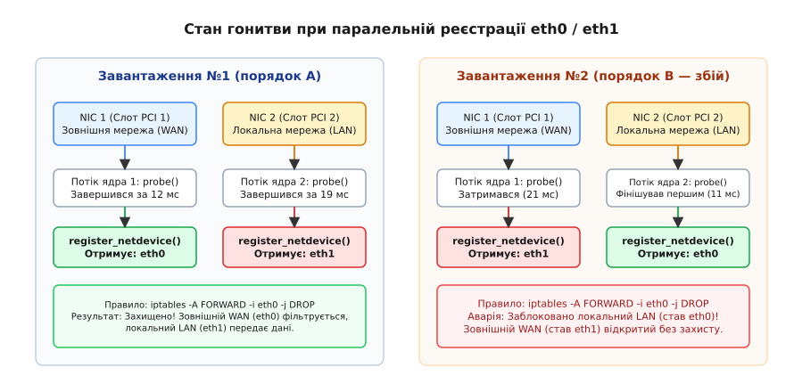
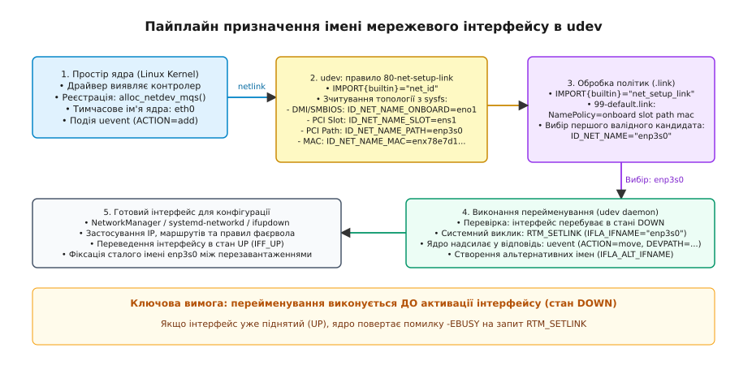
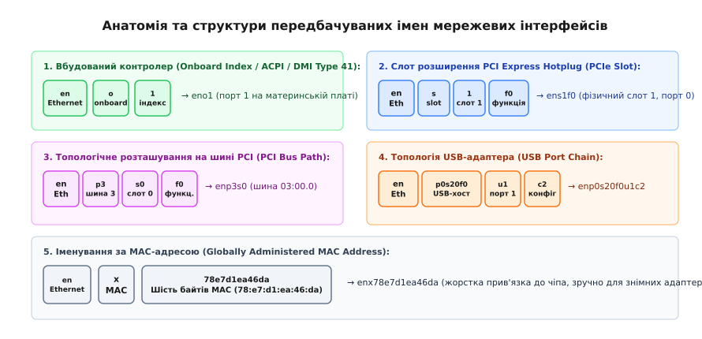

# Передбачувані імена мережевих інтерфейсів: enp3s0 замість eth0

<preknowlist>
- [Модель пристроїв у sysfs](topic:unix-linux/sysfs-device-model) — дерево `/sys/devices`, зв'язок пристроїв із шиною та атрибути.
- [udev: іменування пристроїв і правила](topic:unix-linux/udev-rules) — обробка uevent, зіставлення ключів і створення імен у просторі користувача.
- [Шина PCI та PCIe в Linux](topic:unix-linux/pcie-express-bus-subsystem) — домени, номери шин, слоти та функції конфігураційного простору.
- [Обмін повідомленнями через netlink](topic:unix-linux/netlink-protocol) — сокети ядра для керування мережевими інтерфейсами й маршрутизацією.
- [Ініціалізація та прив'язка драйверів](topic:unix-linux/driver-probe-and-binding) — процес probe і реєстрація пристроїв під час паралельного завантаження.
</preknowlist>

Шлюзовий сервер маршрутизації має два фізичні порти Ethernet: перший порт підключено до зовнішнього інтернет-провайдера (публічна IP-адреса `198.51.100.2`), а другий — до закритої локальної мережі офісу (`192.168.1.1`). Під час першого налаштування операційна система присвоїла зовнішньому порту ім'я `eth0`, а локальному — `eth1`. Адміністратор зафіксував політику міжмережевого екрана:

```sh
iptables -A FORWARD -i eth0 -m state --state NEW -j DROP
iptables -A FORWARD -i eth1 -o eth0 -j ACCEPT
```

Після планового перезавантаження сервера та оновлення мікрокоду ядра контролери ініціалізувалися в іншому часовому інтервалі. Порт локальної мережі фінішував у процедурі реєстрації на шість мілісекунд раніше за зовнішній порт. Ядро призначило ім'я `eth0` внутрішньому порту, а ім'я `eth1` — зовнішньому. У результаті правило міжмережевого екрана заблокувало весь трафік робочих станцій офісу, а зовнішній інтерфейс `eth1` залишився без захисного фільтра вхідних з'єднань.

Класична порядкова схема імен `eth0`, `eth1`, `wlan0` не гарантує зв'язку між назвою інтерфейсу та конкретним фізичним роз'ємом на материнській платі чи корпусі сервера.

## Чому ядро роздає випадкові імена

Початкове ім'я мережевого пристрою формується всередині ядра Linux під час виконання процедури виявлення обладнання (англ. *device probe*).

Коли драйвер мережевого адаптера (наприклад, `e1000e` або `r8169`) виявляє підтримуваний контролер на шині PCI Express, він виділяє структуру мережевого пристрою за допомогою функції `alloc_etherdev_mqs()` і реєструє її у внутрішній таблиці мережевої підсистеми викликом `register_netdevice()`.

```c
/* Фрагмент логіки ядра: net/core/dev.c */
int dev_alloc_name(struct net_device *dev, const char *name)
{
    char buf[IFNAMSIZ];
    struct net *net = dev_net(dev);
    int ret;

    ret = __dev_alloc_name(net, name, buf);
    if (ret >= 0)
        strscpy(dev->name, buf, IFNAMSIZ);
    return ret;
}
```

Функція `__dev_alloc_name()` отримує від драйвера шаблон форматування `eth%d`. Вона сканує наявні в поточному мережевому просторі імен (`struct net`) пристрої та знаходить найменше вільне ціле число, починаючи від `0`.

Для швидкого пошуку інтерфейсів мережевий стек ядра підтримує дві окремі хеш-таблиці в кожному просторі імен `struct net`:
- `net->dev_name_head` — хеш-таблиця за назвою пристрою (рядок `dev->name`);
- `net->dev_index_head` — хеш-таблиця за числовим індексом `ifindex`.

Коли викликається `register_netdevice()`, ядро перевіряє унікальність імені в `dev_name_head`. Якщо назва `eth0` уже існує, лічильник збільшується, і пристрій отримує `eth1`.

Структура `struct net_device` також містить спеціальне поле `name_assign_type`, яке документує походження поточного імені:
- `NET_NAME_ENUM` — ім'я виділено ядром за порядковим номером переліку (`eth0`);
- `NET_NAME_PREDICTABLE` — ім'я сформовано простором користувача на основі незмінної апаратної топології;
- `NET_NAME_USER` — ім'я призначено адміністратором вручну через команду `ip` або файл конфігурації;
- `NET_NAME_RENAMED` — інтерфейс було перейменовано після початкової реєстрації.



*Паралельне виконання функцій probe для двох контролерів призводить до випадкового розподілу імен eth0 та eth1 залежно від мілісекундних коливань часу ініціалізації.*

На стадії завантаження сучасного ядра діють три фактори невизначеності:

1. **Асинхронне зондування шин (`async_probe`):** ядро запускає опитування різних слотів PCIe у паралельних потоках виконання через механізм робочих черг `system_unbound_wq` для прискорення старту операційної системи на багатоядерних процесорах. Функція `pci_device_probe()` викликається одночасно на різних ядрах процесора.
2. **Різний час готовності контролерів:** контролери від різних виробників потребують різного часу на вичитування службових таблиць з EEPROM, скидання внутрішнього процесора MAC і калібрування трансивера PHY. Контролер, який витратив 12 мілісекунд, фінішує раніше за контролер, якому знадобилося 19 мілісекунд.
3. **Порядок завантаження модулів ядра:** драйвери постачаються як окремі файли `.ko` в рамдиску `initramfs`. Модулі завантажуються паралельно демоном `systemd-udevd`. Залежно від затримок читання з диска модуль для другої карти може завантажитися на мілісекунду раніше за модуль першої карти.

Якщо сервер містить дві однакові двопортові мережеві карти, контролер у слоті 2 може завершити скидання швидше за контролер у слоті 1. Будь-яка зміна версії ядра, температури чипа чи швидкості зчитування прошивки змінює переможця в цьому стані гонитви (англ. *race condition*).

Детальний опис того, чому перша спроба вирішити цю проблему через динамічний генератор файлів на диску зазнала невдачі, викладено в [історичному нарисі еволюції мережевих імен](topic:unix-linux/predictable-network-interface-names/hist-eth0-to-predictable.md).

## Чому статичні правила на диску виявилися глухим кутом

У середині 2000-х років розробники підсистеми `udev` намагалися вирішити проблему гонитви за допомогою динамічно створюваного файлу правил `/etc/udev/rules.d/70-persistent-net.rules`. Під час першого виявлення мережевого пристрою спеціальний скрипт зчитував його апаратну MAC-адресу та записував жорстку прив'язку:

```udev
SUBSYSTEM=="net", ACTION=="add", ATTR{address}=="00:1a:4b:16:32:01", NAME="eth0"
```

Хоча на звичайних домашніх комп'ютерах ця схема створювала враження стабільності, в інфраструктурних та хмарних середовищах вона спричинила каскадні відмови:

1. **Незмінні кореневі файлові системи (Read-Only Root):** бездискові сервери, системи мережевого завантаження PXE, середовища Live-CD та сучасні незмінні операційні системи монтують корінь лише для читання. Скрипт не міг створити або змінити файл правил, повертаючи систему до стану випадкової нумерації.
2. **Заміна несправного обладнання:** якщо мережевий адаптер `eth0` на сервері виходив з ладу і його замінювали новим, новий контролер мав іншу MAC-адресу. Демон udev зберігав старе правило для `eth0` і призначав новій карті наступне вільне ім'я `eth1`. Конфігураційні скрипти сервера продовжували очікувати `eth0`, через що сервер після апаратного ремонту не підключався до мережі. Після трьох замін карт інтерфейси отримували назви `eth4`, `eth5`.
3. **Клонування віртуальних машин у хмарах:** створення сотень віртуальних машин із єдиного базового образу («золотого образу») призводить до того, що гіпервізор генерує кожній машині новий віртуальний MAC. Кожен клон завантажувався з уже наявним файлом `70-persistent-net.rules`, призначав новій карті ім'я `eth1` замість `eth0` і залишався без мережевого зв'язку.
4. **Конфлікти взаємного обміну іменами:** якщо ядро призначило карті A ім'я `eth0`, а карті B — `eth1`, але правило udev вимагало призначити карті B `eth0`, а карті A — `eth1`, прямий системний виклик перейменування відхилявся ядром з помилкою `EEXIST` (ім'я вже зайняте). Доводилося впроваджувати складні проміжні схеми перейменування у тимчасові назви `rename0`, `rename1`.

Ці фундаментальні обмеження змусили інженерів відмовитися від збереження змінного стану на диску й перейти до концепції функціонального обчислення імен на основі незмінної фізичної топології обладнання.

## Архітектура Predictable Network Interface Names

Щоб гарантувати детермінованість без збереження змінного стану на диску, проєкт systemd та підсистема `udev` реалізували механізм **передбачуваних імен мережевих інтерфейсів** (англ. *Predictable Network Interface Names*).

Головний принцип полягає у відмові від порядкових номерів виявлення на користь топологічних координат: фізичного слота материнської плати, адреси шини PCIe, ланцюга портів USB або унікальної апаратної MAC-адреси.

Обробка події появи мережевого пристрою відбувається за суворим конвеєром між ядром та простором користувача.



*Послідовність обробки мережевого інтерфейсу від генерації uevent ядром до застосування політики перейменування через RTNetlink.*

### 1. Сигнал від ядра та запуск udev

Після успішної реєстрації `register_netdevice()` ядро створює тимчасовий вузол у файловій системі `sysfs` (наприклад, `/sys/class/net/eth0`) і транслює подію `uevent` із дією `ACTION=add` через широкомовний сокет Netlink (`NETLINK_KOBJECT_UEVENT`).

Демон `systemd-udevd` перехоплює повідомлення та запускає обробку системного правила `/usr/lib/udev/rules.d/80-net-setup-link.rules`:

```udev
# /usr/lib/udev/rules.d/80-net-setup-link.rules
SUBSYSTEM!="net", GOTO="net_setup_link_end"
ACTION!="add", GOTO="net_setup_link_end"

IMPORT{builtin}="net_id"
IMPORT{builtin}="net_setup_link"

ENV{ID_NET_NAME}!="", NAME="$env{ID_NET_NAME}"

LABEL="net_setup_link_end"
```

### 2. Генератор імен: udev-builtin-net_id

Команда `IMPORT{builtin}="net_id"` викликає внутрішню функцію `builtin_net_id()` демона udev (код `src/udev/udev-builtin-net_id.c`). Ця функція виконує обхід дерева sysfs вгору від мережевого пристрою до кореневого контролера шини й генерує набір змінних оточення з префіксом `ID_NET_NAME_*`.

Функція аналізує топологію в такому порядку:

```c
/* Логіка обчислення кандидатів імен у systemd */
int dev_to_net_names(sd_device *dev, NetNames *names) {
    /* 1. Пошук вбудованих індексів прошивки (ACPI / SMBIOS Type 41) */
    names_onboard(dev, names);

    /* 2. Пошук слотів гарячої заміни PCI Express (PCI Hotplug) */
    names_slot(dev, names);

    /* 3. Обчислення топологічного шляху шини (PCI / USB / CCW) */
    names_path(dev, names);

    /* 4. Отримання глобально адміністрованої MAC-адреси */
    names_mac(dev, names);

    return 0;
}
```

Усі успішно згенеровані варіанти експортуються як змінні події udev:
- `ID_NET_NAME_ONBOARD`
- `ID_NET_NAME_SLOT`
- `ID_NET_NAME_PATH`
- `ID_NET_NAME_MAC`

### 3. Застосування політики: net_setup_link

Команда `IMPORT{builtin}="net_setup_link"` завантажує правила конфігураційних файлів `.link` (зокрема базового `/usr/lib/systemd/network/99-default.link`).

Помічник зіставляє властивості пристрою із секцією `[Match]` і читає директиву `NamePolicy=`:

```ini
[Link]
NamePolicy=keep kernel database onboard slot path mac
```

udev послідовно перевіряє схеми зліва направо. Перша схема, для якої утиліта `net_id` змогла побудувати валідне ім'я, стає значенням змінної `ID_NET_NAME`.

Повний опис усіх ключів секцій `[Match]` та `[Link]` міститься в [довіднику специфікації .link-файлів](topic:unix-linux/predictable-network-interface-names/api-net-naming-policies.md).

### 4. Фіксація імені через RTNetlink

Отримавши значення `NAME="$env{ID_NET_NAME}"`, демон `systemd-udevd` виконує запит до ядра через інтерфейс `NETLINK_ROUTE` із типом повідомлення `RTM_SETLINK` та атрибутом `IFLA_IFNAME`.

Ядро перевіряє стан прапорців інтерфейсу `dev->flags`. Оскільки інтерфейс ще не активовано користувацькими службами (він перебуває в стані `DOWN`), ядро змінює `dev->name` на нову назву (наприклад, `enp3s0`), оновлює символічні посилання в `/sys/class/net/` і надсилає повідомлення `uevent` із дією `ACTION=move`.

Мережеві диспетчери (`systemd-networkd` або `NetworkManager`) підхоплюють інтерфейс уже за його постійним, передбачуваним ім'ям і накладають IP-конфігурацію.

> 🔧 **Навіщо це.** Якщо мережева служба підніме інтерфейс (викличе `ip link set dev eth0 up`) до того, як udev виконає правило перейменування, ядро заблокує зміну назви з помилкою `-EBUSY`. Усі диспетчери мережі в сучасних дистрибутивах синхронізуються з подіями udev і очікують завершення транзакції `net_setup_link`.

## П'ять схем іменування

Типове ім'я інтерфейсу складається з дволітерного префікса типу середовища передачі, літери схеми розташування та числових специфікаторів координат.

| Префікс | Тип фізичного інтерфейсу |
| :--- | :--- |
| `en` | Ethernet (дротовий мережевий адаптер) |
| `wl` | Wireless LAN (бездротовий адаптер Wi-Fi 802.11) |
| `ww` | Wireless WAN (модеми 3G, LTE, 5G, мобільний зв'язок) |
| `ib` | InfiniBand (високошвидкісна комутаційна архітектура) |
| `sl` | Serial Line IP (послідовне з'єднання SLIP) |

Після префікса типу додається позначення схеми.



*Анатомія формування назв для вбудованих інтерфейсів, слотів розширення, координат шини PCI, адаптерів USB та MAC-адрес.*

Розгляньмо кожну з п'яти схем докладно.

### Схема 1. Вбудовані порти материнської плати (`eno1`, `eno2`)

Схема використовує літеру `o` (від англ. *onboard* — «на платі») та індекс порту, зафіксований виробником материнської плати в таблицях ACPI або SMBIOS (DMI Type 41).

Формат: `eno<index>[d<dev_port>][n<port_name>]`

Приклад: `eno1` — перший вбудований мережевий порт на платі сервера. Якщо чип містить кілька портів, які використовують один спільний індекс прошивки, додається номер фізичного порту `dev_port` (`eno1d1`).

Ця схема має найвищий пріоритет у політиці за замовчуванням, оскільки вона прямо відповідає маркуванню роз'ємів на корпусі сервера («Port 1», «Port 2»).

### Схема 2. Слоти розширення PCI Express (`ens1`, `ens1f0`)

Схема використовує літеру `s` (від англ. *slot* — «слот») та номер слота гарячої заміни (англ. *PCI Express Hotplug Slot*).

Формат: `ens<slot>[f<function>][d<dev_port>][n<port_name>][v<virtual_function>]`

Приклад: `ens1` — мережевий адаптер у слоті розширення №1. Якщо встановлено багатопортову мережеву карту, де кожен порт є окремою функцією PCI (англ. *PCI Function*), до імені додається індекс функції: `ens1f0` для першого порту та `ens1f1` для другого порту.

Схема спирається на індекс слота, який контролер шини PCIe транслює операційній системі. Якщо плату переставити в сусідній слот №2, ім'я автоматично зміниться на `ens2f0`. Якщо на карті активовано віртуальні функції SR-IOV, дочірні інтерфейси отримують суфікс `v<N>` (наприклад, `ens1f0v1` для першої віртуальної функції першого порту).

### Схема 3. Географічне розташування на шині (`enp3s0`, `enp0s20f0u1c2`)

Схема використовує літеру `p` (від англ. *path* або *PCI bus*) та повну апаратну адресу топології шини від кореневого моста до кінцевого пристрою. Це найбільш універсальна схема, яка працює на будь-якому залізі, навіть якщо BIOS або ACPI не надали жодних даних про індекси слотів чи материнської плати.

Формат для PCI: `enp<bus>s<slot>[f<function>][d<dev_port>]`

Якщо контролер розташовано в додатковому домені PCI (Domain > 0), на початок додається ідентифікатор домену з великою літерою `P`: `enP<domain>p<bus>s<slot>`. Наприклад, на великих багатопроцесорних NUMA-серверах із двома сокетами процесори створюють окремі PCI-сегменти: пристрій у першому сегменті отримає назву `enP1p3s0`.

Розберемо ім'я `enp3s0f1`:
- `en` — інтерфейс Ethernet;
- `p3` — шина PCI №3 (десяткове `3`, що відповідає `03:00.0` у шістнадцятковому виводі `lspci`);
- `s0` — слот пристрою №0;
- `f1` — функція пристрою №1 (другий порт контролера).

Для адаптерів USB топологічний шлях включає ланцюг портів концентратора (англ. *USB Hub port chain*). Якщо мережевий перехідник USB увімкнено в порт 1 зовнішнього хаба, підключеного до порту 2 концентратора хост-контролера, ім'я матиме вигляд:

`enp0s20f0u1u2`
- `p0s20f0` — хост-контролер USB xHCI на шині PCI 0, слот 20, функція 0;
- `u1` — перший порт кореневого концентратора USB;
- `u2` — другий порт зовнішнього USB-хаба.

Якщо USB-пристрій є складеним (композитним) і використовує окрему конфігурацію або інтерфейс, до імені можуть додаватися суфікси `c<config>` (конфігурація) та `i<interface>` (інтерфейс), наприклад `enp0s20f0u1c2i0`.

Доки кабель увімкнено в той самий фізичний роз'єм USB, ім'я пристрою залишатиметься незмінним, навіть якщо сам адаптер замінити на аналогічний іншої моделі.

### Схема 4. Іменування за MAC-адресою (`enx78e7d1ea46da`)

Схема використовує літеру `x` та дванадцять шістнадцяткових цифр повної фізичної MAC-адреси мережевого інтерфейсу.

Формат: `enx<MAC>`

Приклад: `enx78e7d1ea46da` відповідає пристрою з адресою `78:e7:d1:ea:46:da`.

> ⚠️ **Критичне обмеження.** Алгоритм systemd формує ім'я за схемою `enx*` **лише** для глобально адміністрованих адрес. Якщо другий біт першого байта MAC-адреси встановлено в `1` (що означає локально адміністровану адресу, англ. *Locally Administered Address*), udev ігнорує цю схему. Це зроблено тому, що віртуальні мережеві інтерфейси (контейнери, тунелі, генератори випадкових адрес) часто створюють динамічні локальні адреси, які змінюються при кожному запуску.

Іменування за MAC-адресою є ідеальним вибором для мобільних інженерних ноутбуків, де донгл USB-Ethernet часто підключають у різні фізичні порти USB, але системні правила прив'язані до конкретного чипа адаптера.

### Схема 5. Класичні назви ядра (`eth0`, `wlan0`)

Традиційні назви ядра використовуються як резервний варіант (англ. *fallback*), якщо жодна з попередніх чотирьох схем не змогла отримати коректні дані з апаратного дерева, або якщо системний адміністратор явно вимкнув передбачувані імена у параметрах завантаження.

## Джерела топології в ядрі та файловій системі sysfs

udev не виконує прямого доступу до портів введення-виведення чи пам'яті контролера. Усі дані зчитуються через стандартизовані вузли псевдофайлової системи `sysfs`.

Кожен зареєстрований пристрій зв'язується з відповідним вузлом у дереві kobject ядра Linux.

### 1. Зв'язок із деревом шини PCI

Тека мережевого інтерфейсу `/sys/class/net/<ifname>/` містить символічне посилання `device`, яке вказує на вузол фізичного пристрою в ієрархії шин `/sys/devices/`:

```sh
$ ls -l /sys/class/net/enp3s0/device
lrwxrwxrwx 1 root root 0 сер 21 10:15 /sys/class/net/enp3s0/device -> ../../../0000:03:00.0
```

Шлях `/sys/devices/pci0000:00/0000:00:1c.4/0000:03:00.0/` містить повну історію мостів шини:
- `0000:00` — кореневий PCI-комплекс (Root Complex);
- `0000:00:1c.4` — міст PCI Express Root Port (шина 0, слот 28, функція 4);
- `0000:03:00.0` — кінцевий мережевий контролер (шина 3, слот 0, функція 0).

З цього шляху функція `names_path()` витягує числа `3` та `0`, формуючи `enp3s0`.

Якщо на шляху зустрічаються комутаційні мости PCIe (PCI-to-PCI bridge), udev розбирає повний ланцюг мостів і будує ім'я за кінцевим підпорядкованим сегментом шини.

### 2. Таблиці SMBIOS Type 41 та методи ACPI

Для вбудованих пристроїв драйвер ядра зчитує структури SMBIOS під час ініціалізації. Якщо таблиця SMBIOS Type 41 («Onboard Devices Extended Information») містить запис про мережевий контролер, ядро створює в теці пристрою sysfs файл `index` або `acpi_index`:

```sh
$ cat /sys/class/net/eno1/device/index
1
$ cat /sys/class/net/eno1/device/acpi_index
1
```

Структура SMBIOS Type 41 формується виробником материнської плати й містить такі обов'язкові поля:
- `Reference Designation` — текстовий рядок опису (наприклад, «Onboard LAN 1»);
- `Device Type` — числовий код типу пристрою (`0x05` для Ethernet);
- `Device Type Instance` — порядковий номер пристрою на материнській платі (ціле число `>= 1`);
- `Segment / Bus / Device / Function` — BDF-координати контролера на шині PCI.

Драйвер ядра `drivers/pci/pci-label.c` парсить цю таблицю під час завантаження системи. Коли він знаходить пристрій PCI із відповідними BDF-координатами, він експортує атрибут `index` у sysfs.

Крім SMBIOS, сучасні платформи UEFI використовують метод ACPI `_DSM` (англ. *Device Specific Method*) із зафіксованим UUID `1a0db9fac-0013-40a2-aa5f-621fecab6428`. Метод повертає індекс порту на материнській платі, який драйвер ядра зберігає в атрибуті `acpi_index`.

Якщо файл `index` містить число `1`, функція `names_onboard()` створює змінну `ID_NET_NAME_ONBOARD=eno1`.

### 3. Багатопортові контролери, комутатори DSA та SR-IOV

Якщо одна фізична мікросхема обслуговує кілька роз'ємів Ethernet (наприклад, чотирипортова карта на базі Intel i350), або розбита на віртуальні функції SR-IOV, всі порти можуть мати одну й ту саму адресу шини PCIe (`0000:03:00.0`).

Для розрізнення таких портів ядро експортує додаткові атрибути:

```sh
$ cat /sys/class/net/enp3s0d1/dev_port
1
$ cat /sys/class/net/enp3s0np0/phys_port_name
p0
$ cat /sys/class/net/enp3s0np0/phys_switch_id
78e7d1ea4600
```

- `dev_port` — цілочисельний індекс апаратного порту всередині одного чипа (додає суфікс `d<N>`, наприклад `enp3s0d1`);
- `phys_port_name` — символьне позначення фізичного порту від драйвера (додає суфікс `np<N>`, наприклад `enp3s0np0` або `ens1f0np0` для мережевих адаптерів Mellanox/NVIDIA ConnectX);
- `phys_switch_id` — унікальний ідентифікатор комутаційної матриці ASIC (використовується в комутаторах DSA та SmartNIC для розмежування апаратних черг).

На вбудованих маршрутизаторах під керуванням Linux, де процесор з'єднаний з комутатором DSA (Distributed Switch Architecture) через один спільний інтерфейс RGMII/SGMII, атрибут `phys_port_name` запобігає колізіям між портами `lan1`, `lan2`, `wan`, дозволяючи кожному інтерфейсу отримати стале відокремлене ім'я.

## Налаштування та перевизначення політик через .link-файли

Системний адміністратор може перевизначити правила за замовчуванням двома способами: змінити глобальну чергу пріоритетів або призначити статичне ім'я конкретному порту.

Конфігураційні `.link`-файли дозволяють гнучко налаштовувати поведінку мережевих пристроїв на рівні окремих портів чи груп адаптерів.

### Створення власного статичного правила

Якщо сервер виконує роль маршрутизатора і системні скрипти вимагають зрозумілих імен `wan0` та `lan0`, у каталозі `/etc/systemd/network/` створюють відповідні `.link`-файли:

```ini
# /etc/systemd/network/10-wan.link
[Match]
MACAddress=00:11:22:33:44:55

[Link]
Name=wan0
WakeOnLan=off
MTUBytes=1500
```

```ini
# /etc/systemd/network/20-lan.link
[Match]
Path=pci-0000:03:00.0-*

[Link]
Name=lan0
MTUBytes=9000
```

Файли в `/etc/systemd/network/` мають вищий пріоритет за системний файл `99-default.link`. Під час завантаження udev застосує статичні імена `wan0` та `lan0` до відповідних портів.

### Детермінована генерація MAC-адрес (MACAddressPolicy=persistent)

Для віртуальних пристроїв (мостів, агрегованих зв'язок `bond`, інтерфейсів `veth`), які не мають фізичного чіпа з прошивкою, ядро раніше генерувало випадкову MAC-адресу при кожному старті. Це призводило до того, що корпоративні DHCP-сервери виділяли віртуальному серверу нову IP-адресу після кожного перезавантаження.

Директива `MACAddressPolicy=persistent` усуває цю проблему за допомогою детермінованого розрахунку:

1. Демон `systemd-networkd` зчитує системний 128-бітний ідентифікатор Machine ID з файлу `/etc/machine-id`.
2. Формується рядок, що складається з назви інтерфейсу, його топологічного шляху та фіксованого системного префікса.
3. Розраховується криптографічний хеш за алгоритмом HMAC-SHA256 або SipHash-2-4.
4. Перші шість байтів результату приводяться до стандарту IEEE 802: біт групової розсилки (Multicast bit) встановлюється в `0`, а біт локального адміністрування (Locally Administered bit) — в `1`.

У результаті міст `br0` або агрегатор `bond0` завжди отримує точно таку саму MAC-адресу на цьому конкретному комп'ютері, забезпечуючи стабільність мережевих оренд DHCP.

### Механізм альтернативних імен (Alternative Names)

Починаючи з версії `systemd v245` та ядра Linux 5.4, мережеві пристрої підтримують множинні імена через атрибут Netlink `IFLA_ALT_IFNAME`.

Якщо основне ім'я було обрано як `enp3s0`, udev реєструє всі інші згенеровані кандидати як альтернативні назви пристрою:

```sh
$ ip link show
2: enp3s0: <BROADCAST,MULTICAST,UP,LOWER_UP> mtu 1500 qdisc fq_codel state UP mode DEFAULT group default qlen 1000
    link/ether 78:e7:d1:ea:46:da brd ff:ff:ff:ff:ff:ff
    altname eno1
    altname ens1f0
    altname enx78e7d1ea46da
```

Будь-яка системна команда розуміє всі альтернативні назви:

```sh
$ ping -I eno1 1.1.1.1
$ tcpdump -i enx78e7d1ea46da -n
$ ip addr show dev ens1f0
```

Адміністратор може додати власну альтернативну назву наживо без перезавантаження:

```sh
$ sudo ip link property add dev enp3s0 altname office-gateway
```

Практичну реалізацію програми на C та C++, яка працює з альтернативними іменами через сокети Netlink, наведено в [проєкті низькорівневого перейменування інтерфейсів](topic:unix-linux/predictable-network-interface-names/proj-interface-renamer.md).

## Поведінка в контейнерах і мережевих просторах імен

Коли мережевий інтерфейс переміщується з основного простору імен хоста в ізольований простір імен контейнера (наприклад, викликом `ip link set dev enp3s0 netns <PID>`), ядро виконує функцію `dev_change_net_namespace()`.

У цей момент відбуваються такі події:
1. Інтерфейс автоматично переводиться в неактивний стан (`DOWN`).
2. Усі зареєстровані альтернативні назви (`altname`) повністю очищуються, оскільки в цільовому просторі імен вони можуть конфліктувати з наявними пристроями.
3. Первинне ім'я зберігається, якщо воно не зайняте всередині контейнера. Якщо в контейнері вже існує інтерфейс з такою самою назвою, операція переміщення зазнає невдачі з помилкою `EEXIST`.

Контейнерні диспетчери (Docker, Podman, Kubernetes CNI) зазвичай створюють віртуальні пари `veth`. Кінець пари, який залишається на хості, отримує передбачуване ім'я виду `veth<hash>`, а кінець, який переміщується в простір імен контейнера, перейменовується в локальний `eth0`. Оскільки кожен контейнер має власний незалежний мережевий простір імен, локальне використання `eth0` всередині контейнера не створює колізій із фізичними інтерфейсами хоста.

## Порівняння з підходами інших операційних систем Unix

Різні операційні системи сімейства Unix розв'язували проблему ідентифікації мережевих контролерів різними шляхами:

- **BSD-системи (FreeBSD, OpenBSD):** використовують префікс імені драйвера разом із порядковим номером екземпляра (наприклад, `em0`, `igb0`, `re0`, `ixgbe0`). Це полегшує діагностику драйвера, але за наявності кількох однакових карт зберігає проблему випадкової черговості виявлення на шині.
- **Solaris / illumos:** використовують шар абстракції `dladm` (Data Link Administration), який відокремлює фізичні драйвери від логічних каналів зв'язку `net0`, `net1`, фіксуючи зв'язок у системній базі даних конфігурації.
- **macOS (Darwin):** призначає інтерфейсам імена `en0`, `en1` за пріоритетом фізичного типу (вбудований Wi-Fi або Ethernet отримує `en0`), а керування порядком служб здійснюється через `SystemConfiguration.framework`.

Підхід Linux через Predictable Network Interface Names виділяється тим, що він поєднує повну безстатусність (відсутність необхідності зберігати конфігураційні файли на диску) із прямою прив'язкою до апаратної топології материнської плати та шини PCI.

## Еволюція схем іменування та версійна стабільність

Алгоритм обчислення топологічних шляхів удосконалювався в міру виходу нових версій systemd. Щоб оновлення системних пакунків не змінювало назви інтерфейсів на працюючих продуктових серверах, розробники systemd запровадили параметр версіонування схем `net.naming-scheme=`.

Наприклад:
- У схемі `v238` віртуальні функції SR-IOV іменувалися як звичайні пристрої PCIe;
- У схемі `v239` було впроваджено суфікс `v<N>` для явного позначення віртуальних функцій (`ens1f0v1`);
- У схемі `v240` виправлено розрахунок шляхів для мостів PCI Express із розширеними доменами;
- У схемі `v250` додано підтримку роз'ємів USB Type-C та інтерфейсів WWAN;
- У схемі `v252` оптимізовано обробку комутаторів DSA.

Виробники корпоративних дистрибутивів (Red Hat Enterprise Linux, Ubuntu LTS, Debian) фіксують версію схеми в конфігурації завантажувача. Якщо операційна система була встановлена на версії `v245`, вона продовжує використовувати правила `v245` навіть після оновлення systemd до версії 252, гарантуючи незмінність файлів налаштувань.

## Способи вимкнення передбачуваних імен та сумісність

У разі перенесення застарілого програмного забезпечення, яке жорстко розраховує на наявність `eth0`, передбачувані імена можна вимкнути.

### 1. Параметр командного рядка ядра

Найпростіший спосіб — передати ядру прапорець `net.ifnames=0` через конфігурацію завантажувача GRUB у файлі `/etc/default/grub`:

```text
GRUB_CMDLINE_LINUX="net.ifnames=0 biosdevname=0"
```

Після виконання `sudo update-grub` та перезавантаження помічник udev `net_id` припиняє генерацію імен, і система повертається до класичної нумерації ядра `eth0`, `eth1`, `wlan0`.

> ⚠️ **Ціна вимкнення.** Вимкнення `net.ifnames` повертає систему до стану гонитви між драйверами. Якщо комп'ютер має кілька мережевих карт, порядок їхньої ініціалізації знову стане випадковим.

### 2. Маскування базового файлу .link

Альтернативний спосіб, який не вимагає модифікації параметрів ядра, — замаскувати системний файл правил створення символічним посиланням на `/dev/null`:

```sh
$ sudo ln -s /dev/null /etc/systemd/network/99-default.link
```

Це скасовує дію `NamePolicy=` для всіх інтерфейсів, які не мають власних специфічних `.link`-файлів, залишаючи їм початкові імена ядра.

## Практичне дослідження та діагностика топології

Для з'ясування того, чому інтерфейс отримав конкретне ім'я, і які альтернативні назви доступні в системі, використовують утиліту `udevadm`.

### Покрокова емуляція роботи net_id

Команда `test-builtin net_id` запускає внутрішній рушій безпосередньо над текою пристрою в sysfs і виводить усі розраховані параметри:

```sh
$ udevadm test-builtin net_id /sys/class/net/enp3s0
=== Режим емуляції net_id ===
Parsed configuration file "/usr/lib/systemd/network/99-default.link"
Using default naming scheme: v252
ID_NET_NAMING_SCHEME=v252
ID_NET_NAME_MAC=enx78e7d1ea46da
ID_NET_NAME_PATH=enp3s0
ID_NET_NAME_SLOT=ens1
ID_NET_NAME_ONBOARD=eno1
ID_NET_NAME=eno1
```

### Перегляд дерева батьківських пристроїв

Команда `udevadm info` з ключем `--attribute-walk` дозволяє дослідити повний ланцюг контролерів від фізичного роз'єму до кореневого моста процесора:

```sh
$ udevadm info --attribute-walk --path=/sys/class/net/enp3s0
  looking at device '/devices/pci0000:00/0000:00:1c.4/0000:03:00.0/net/enp3s0':
    KERNEL=="enp3s0"
    SUBSYSTEM=="net"
    ATTR{address}=="78:e7:d1:ea:46:da"
    ATTR{type}=="1"

  looking at parent device '/devices/pci0000:00/0000:00:1c.4/0000:03:00.0':
    KERNELS=="0000:03:00.0"
    SUBSYSTEMS=="pci"
    ATTRS{vendor}=="0x8086"
    ATTRS{device}=="0x1539"
```

Ці дані дозволяють точно скласти фільтр для секції `[Match]` у разі написання власних правил автоматизації мережі.

---

Передбачувані імена мережевих інтерфейсів замінили недетермінований порядковий номер на незмінну апаратну координату пристрою. Завдяки переносу логіки з ядра до безстатусного конвеєра `systemd-udevd` та використанню даних ACPI, DMI й топології шини PCIe операційна система гарантує, що мережевий кабель у конкретному гнізді завжди відповідатиме тим самим правилам безпеки, маршрутизації та конфігурації.
