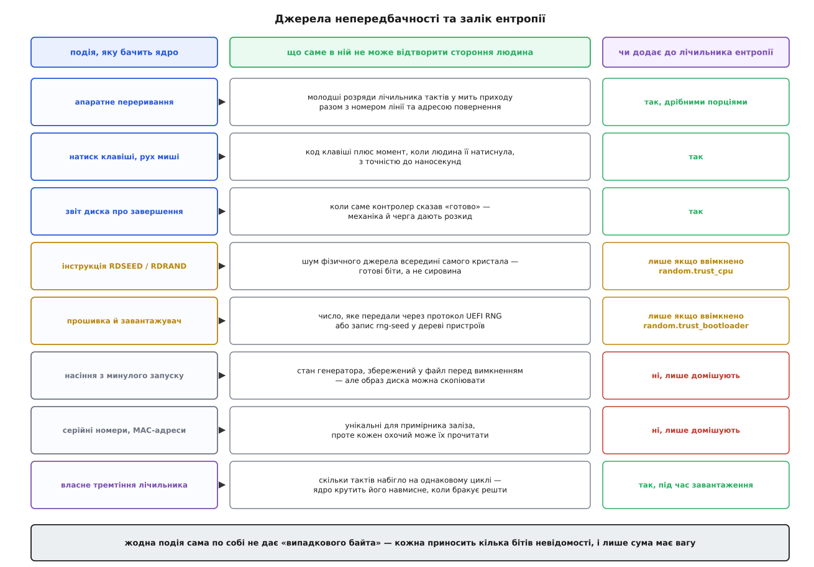
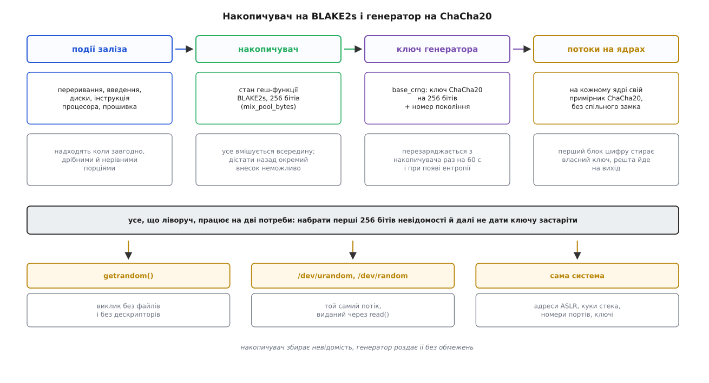
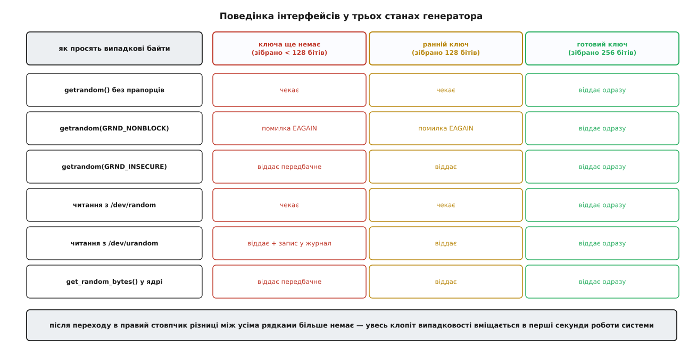

# Джерело випадковості в ядрі: /dev/random, /dev/urandom і getrandom

<preknowlist>
- [«Усе є файлом»](book:unix-linux/everything-is-a-file) — доступ до різнорідних речей у Unix зведено до одного набору дій: відкрити, прочитати, записати, закрити.
- [Файл пристрою: символьний і блоковий](book:unix-linux/device-file-model) — за іменем у `/dev` стоїть не вміст на носії, а драйвер у ядрі; символьний пристрій віддає байти потоком, без адресації блоків.
- [Ядро й простір користувача](book:unix-linux/kernel-and-userspace) — програма не має прямого доступу до заліза; усе, що йде від пристроїв, проходить через ядро.
- [Системний виклик: як програма просить ядро](book:unix-linux/syscall-mechanics) — механізм переходу з програми в ядро й назад, разом із його ціною.
- [Криптографічний генератор випадкових чисел (CSPRNG)](book:algorithms/csprng) — з невеликого таємного стану можна детерміновано розгорнути потік, який без знання стану не відрізнити від справжнього шуму.
- [Джерело ентропії (TRNG)](book:algorithms/entropy-source) — фізичний процес, що дає справжню непередбачність: шум, тремтіння частоти, метастабільність.
- [Ентропія Шеннона](book:communications/shannon-entropy) — міра невизначеності в бітах: скільки двійкових питань треба, щоб дізнатися невідоме.
</preknowlist>

## Число, якого не має знати ніхто

Програма, що встановлює захищене з'єднання, найпершою дією вигадує собі секретний ключ. Від того, чи вгадає його стороння людина, залежить усе інше: найкращий шифр не рятує, якщо ключ передбачний.

І тут програма впирається в стіну, складену з її ж природи. Код детермінований: та сама послідовність інструкцій із тими самими вхідними даними завжди дає той самий результат. Це властивість, заради якої обчислювальні машини й будували, і скасувати її неможливо. Але з неї випливає незручний наслідок: хто має ту саму програму, той повторить її обчислення крок у крок і дістане той самий «випадковий» ключ. Спроби викрутитися — узяти поточний час, номер процесу, адресу змінної — лише відсувають проблему: усе це величини, які стороння людина або знає, або звузить до кількох тисяч варіантів і перебере.

Отже, непередбачність мусить прийти ззовні логіки програми. У машині є місце, де вона справді береться: фізичний світ. Момент, коли з мережі прийшов пакет, з точністю до такту процесора; наскільки саме розійшлися два незалежні генератори частоти; теплове тремтіння в напівпровіднику. Такі величини не відтворити навіть маючи ідентичну машину — не тому, що їх важко порахувати, а тому, що їх не задано нічим, крім самої фізики.

Біда в тім, що звичайна програма цих подій не бачить. Вона не обробляє переривань і не має доступу до апаратних лічильників. Бачить їх ядро — воно й приймає переривання від кожного пристрою, і знає з точністю до такту, коли клацнула клавіша.

Тож завдання розпадається надвоє: ядро мусить зібрати непередбачність із заліза й мусить віддати її програмам. Друга половина в Unix має очевидну форму. Якщо все є файлом, то й джерело випадковості — файл.

## Файл, за яким нічого не лежить

У `/dev` цих файлів два: `random` і `urandom`. Обидва символьні, обидва зі старшим номером 1, молодші — 8 і 9. Старший номер каже ядру, який драйвер обслуговує звертання, молодший розрізняє два входи в той самий драйвер ([старший і молодший номери](book:unix-linux/major-minor-numbers)).

Незвичне тут те, що за цим файлом немає ніякого вмісту. Читання зі звичайного файлу дістає байти, які хтось колись записав; читання зі `/dev/urandom` змушує ядро **обчислити** байти просто зараз, у момент виклику. Звідси все дивне в поведінці цих файлів. Розмір — нуль, бо розміру немає: потік нескінченний. Переміщення позиції нічого не означає, бо позиції немає: немає носія, на якому вона щось адресує. Два читання того самого «місця» дають різні байти — і це не помилка, а сама суть пристрою.

Запис у ці файли теж не кладе нічого на носій. Він означає інше: «ось тобі ще трохи шуму, домішай до себе». Такий запис ніхто не перевіряє на якість, бо перевірити її неможливо, і саме тому він дозволений усім — домішування нікому не шкодить.

Файлова форма виявилася напрочуд зручною. Щоб дістати шістнадцять непередбачних байтів, не треба ні бібліотеки, ні спеціального виклику: `head -c 16 /dev/urandom` працює в будь-якій оболонці, а `dd` заливає ними цілий розділ перед шифруванням.

## Звідки береться те, чого не можна вгадати

Ядро сидить у потоці подій, і майже кожна з них несе крихту невідомості. Важливо тільки правильно бачити, **де саме** ця крихта лежить.

Візьмімо апаратне переривання. Той факт, що мережева карта отримала пакет, ніяка не таємниця — сторонній спостерігач може навіть сам його надіслати. Але ядро цікавить не факт, а мить: воно читає лічильник тактів процесора в момент входу в обробник і бере молодші розряди цього числа. Скільки саме тактів минуло — залежить від стану кешів, від того, що робив процесор мілісекундою раніше, від глибини черги в контролері. Відтворити це число ззовні не вміє ніхто, включно з тим, хто пакет надіслав ([переривання й нижні половини](book:unix-linux/interrupts-bottom-halves)).

Внесок від одного переривання мізерний — одиниці бітів, часом менше. Тому ядро не чіпає накопичувача на кожному перериванні: на кожному ядрі процесора стоїть маленький швидкий буфер, куди дані просто перемішують дешевою функцією, а раз на 64 переривання або раз на секунду вміст цього буфера цілком віддають далі. Так гарячий шлях обробки переривання лишається коротким.

Інші джерела влаштовані так само: цінне в них — момент, а не подія. Натиск клавіші дає код клавіші плюс час, коли людська рука її натиснула; звіт диска про завершення операції дає мить, коли контролер сказав «готово». Окремо стоять два джерела, що дають готову непередбачність, а не сировину: інструкція процесора `RDSEED`, за якою всередині кристала працює справжнє фізичне джерело шуму, і число, передане прошивкою через протокол UEFI RNG чи запис `rng-seed` у дереві пристроїв.

Є ще одне джерело, яке ядро вмикає з відчаю. Коли подій замало, воно навмисне крутить цикл із заведеним таймером і міряє, скільки тактів набігло, — і щоразу набігає трохи різне, бо на це впливає геть усе, що діється в кремнії. Прийом суперечливий, бо чесно оцінити зібране з нього неможливо, і в ядрі він з'явився не з любові до краси, а з цілком конкретної біди.


*Ядро цінує не події, а моменти. Праворуч видно другий важливий поділ: частину джерел домішують, але не зараховують — бо їх можна скопіювати разом із образом системи.*

Останній стовпчик таблиці варто прочитати уважно. Серійний номер диска чи MAC-адреса унікальні для примірника заліза — і саме тому спокусливо вважати їх випадковими. Але унікальне не означає таємне: обидва читає будь-яка програма. Тому такі значення домішують, а заліку не дають. За тією ж логікою не зараховують і насіння, збережене з минулого запуску: файл лежить на диску, а образ диска копіюють.

## Дві машини замість однієї

Здавалося б, зібране можна віддавати як є. Не можна, і причин три. Шум надходить повільно — кількома бітами на подію, тоді як програмі потрібні кілограми байтів для заповнення диска. Шум нерівний: у молодших розрядах лічильника тактів одні значення трапляються частіше за інші. І шум частково передбачний: хтось, хто керує навантаженням на машину, впливає на те, коли приходять переривання.

Тому ядро розділяє роботу між двома різними механізмами.

**Накопичувач** приймає все підряд і робить із суміші коротке ядро невідомості. Технічно це стан криптографічної геш-функції BLAKE2s — 256 бітів, у які вмішують кожен новий внесок ([криптографічні геш-функції](book:programming/cryptographic-hash)). Геш тут не декорація. Якби внески просто складали в масив побітовим додаванням, той, хто знає стан і встигає підкидати свої дані, міг би вести стан куди схоче — аж до обнулення. Геш-функція робить внесок незворотним і некерованим: не знаючи всієї попередньої суміші, неможливо підібрати добавку, що дасть потрібний результат.

**Генератор** розгортає ці 256 бітів у скільки завгодно байтів. Це потоковий шифр ChaCha20 ([потоковий шифр](book:algorithms/stream-cipher)), який із ключа й лічильника видає послідовність, яку без знання ключа не відрізнити від шуму. Ключ зберігається в одній спільній структурі разом із номером покоління; від нього кожне ядро процесора виводить власний примірник генератора, тож у звичайній роботі видача не змагається за спільний замок і масштабується на всі ядра.

Усередині генератора діє прийом, вартий окремої уваги: перший блок виходу шифру не йде читачеві, а **затирає ключ, яким його щойно отримано**. Далі працює вже новий ключ, а старого не існує ніде. Через це той, хто заволодіє станом генератора зараз, не відновить нічого з виданого раніше. Прийом зветься швидким стиранням ключа (англ. *fast-key-erasure*), і його влаштування, разом із робочим кодом, розібрано окремо — [швидке стирання ключа](book:algorithms/csprng/proj-fast-key-erasure.md).

Раз на шістдесят секунд ключ генератора замінюють свіжим витягом із накопичувача, а номер покоління зростає — після чого примірники на ядрах бачать, що застаріли, і виводять свої ключі заново. Одразу після завантаження перезарядка йде значно частіше, поступово розріджуючись: саме на початку впевненості в зібраному найменше.


*Ліва половина ланцюга працює на дві потреби: набрати перші 256 бітів невідомості й далі не давати ключу застаріти. Права половина роздає результат без обмежень.*

> 🔧 **Навіщо це.** Поділ на дві машини пояснює, чому вимірювання швидкості читання зі `/dev/urandom` не має нічого спільного з «швидкістю збирання ентропії». Читання впирається в ChaCha20 і в копіювання буфера, тобто в гігабайти за секунду; збирання ж іде своїм темпом і на швидкість видачі не впливає взагалі.

## Чому ентропія — не рідина в бочці

У `/proc/sys/kernel/random/entropy_avail` живе число, навколо якого наросло більше непорозумінь, ніж навколо всієї решти теми. Це оцінка, скільки бітів справжньої невідомості ядро вважає зібраними. Спокуса читати його як рівень пального в баку велика — і саме вона хибна.

Розберімо, звідки хибність. Тому, хто не знає ключа, вихід генератора неможливо відрізнити від шуму. Це не поетичний зворот, а строге твердження: побачивши гігабайт виданих байтів, спостерігач не дістає жодної переваги в угадуванні наступного байта проти чистого перебору ключа. А якщо спостерігач нічого не дізнається, то його невідомість не меншає. Отже, видача **нічого не витрачає**: скільки не читай, ключ лишається таким самим невідомим, яким був.

Помилковою була сама картинка «ентропія лежить у басейні, читач її вичерпує». Ентропія (гр. *entropía* — поворот, перетворення) — не речовина, що є в системі, а міра **незнання спостерігача**. Витратити її можна лише одним способом: розповівши спостерігачеві щось про ключ. Читання виходу цього не робить.

Що ж тоді число справді означає? Один-єдиний, зате критично важливий рубіж. Поки зібраного мало, ключ генератора можна перебрати, а разом із ним передбачити геть усе, що з нього вийшло: стійкість ключа дорівнює не його довжині, а кількості зібраної невідомості. Але місткість ключа — 256 бітів, тож після цієї межі зростання лічильника вже нічого не додає. Тому лічильник і затиснено стелею 256: більше не потрібно, а вдавати, що «запас росте», було б обманом. Оцінка навмисне занижена — точно виміряти, скільки невідомості несе один момент приходу переривання, неможливо, тож ядро зараховує помітно менше, ніж там насправді є.

## Дві двері, що вели в різні боки

Тепер видно, чому файлів історично два.

Первісний задум був такий: `/dev/random` вважає лічильник справжньою мірою запасу й **зупиняє читача**, коли запас нижче за замовлену кількість байтів, а `/dev/urandom` роздає з генератора, не зупиняючись ніколи. Різниця подавалася як різниця в якості, і звідси пішла порада «для ключів беріть `/dev/random`, для дрібниць — `/dev/urandom`».

Порада коштувала дорого. Сервер без клавіатури, без миші й на твердотілому диску майже не породжує подій, які ядро зараховує. Програма, що просила з `/dev/random` кілька десятків байтів на ключ, зависала на хвилини — а адміністратор, замучившись, ставив службу, яка підливала в пул щось скороспіле, і робив систему **гіршою**, ніж якби просто читав `/dev/urandom`. Як саме визріла ця пастка й хто з нею воював — окрема розповідь: [дві двері одного джерела](book:unix-linux/random-devices/hist-two-devices.md).

У Linux 5.6 (2020) блокувальний пул прибрали цілком. Відтоді `/dev/random` більше не зупиняється через «нестачу запасу» — він чекає рівно одного: щоб генератор було вперше засіяно. Після цієї миті обидва файли віддають байти з того самого генератора й поводяться однаково, як це давно зроблено у FreeBSD й macOS.

Різниця між ними лишилася одна — і стосується вона тільки перших секунд життя системи.

## Найнебезпечніша мить — перші секунди

Стан генератора ядро тримає в трьох положеннях: ключа ще немає; ключ уже є, але зібрано лише 128 бітів; зібрано повні 256 і генератор вважається готовим. Перехід у третє положення — та сама межа, про яку йшлося вище.

Прикрість у тім, що завантаження — водночас і найбідніший на події момент, і той, коли випадковість найпотрібніша. Диски ще не крутилися, людина за клавіатуру не сідала, мережа мовчить, переривань одиниці. А саме тепер `sshd` породжує ключі вузла, systemd робить ідентифікатор машини, ядро тягне жереб на розкладку адрес кожного процесу, що стартує ([рандомізація адресного простору](book:unix-linux/address-space-randomization)). Тому історично найгучніші провали випадковості траплялися не в теорії шифрів, а саме тут: партія однакових пристроїв, породивши ключі за першої ж хвилини роботи, діставала однакові ключі.


*Уся різниця між інтерфейсами вміщається в лівих двох стовпчиках. Щойно генератор готовий, вони поводяться однаково, і питання «звідки брати» перестає мати сенс.*

Наскільки гострою буває ця мить, показав випадок 2019 року. Оптимізація у файловій системі ext4 зменшила кількість переривань під час завантаження — сама собою цілком невинна. Наслідок був катастрофічний: генератор не встигав засіятися, служба, що просила байтів на старті, зупинялася в очікуванні, а зупинившись — гальмувала завантаження, під час якого мали б з'явитися ті самі переривання. Система не піднімалася взагалі. Розімкнув цю петлю Лінус Торвальдс у версії 5.4 (листопад 2019), додавши те саме навмисне тремтіння лічильника: коли зібраного бракує, ядро само крутить цикл і збирає невідомість із власного дрейфу. До цього прийому й досі ставляться сторожко, зокрема й сам автор, — але петлю він розірвав, і за роки роботи нарікань не викликав.

Другий спосіб пройти цю мить — принести невідомість із минулого запуску. Перед вимкненням systemd записує порцію байтів у файл, а на старті вливає її назад. Але заліку така порція здебільшого не отримує, і причина вже названа: файл лежить на диску, а образ диска клонують разом із машиною. Залік дають лише тому насінню, чиє походження можна вважати довіреним, — числу від прошивки або від завантажувача, і лише поки довіру до нього не вимкнено параметром ядра (типово вона ввімкнена).

Окремий випадок — віртуальна машина. Своїх фізичних переривань у неї фактично немає: усе, що вона бачить, породжує гіпервізор, і моменти надходження вже не такі непередбачні. Тому гостю дають пристрій, крізь який невідомість тече від господаря ([virtio-rng](book:unix-linux/virtio-rng)). І тому ж клонування знімка стану — окрема небезпека: два гостьові ядра прокидаються з **однаковим ключем генератора** й видають однакові послідовності, аж поки їх не перезарядять.

## Чому файла виявилося замало

Файлова форма, така зручна в оболонці, має три вади, і кожна з них — з тих, що спрацьовують у найгіршу мить.

Перша: щоб читати файл, потрібен дескриптор, а щоб дістати дескриптор, треба виконати `open`. Якщо процес вичерпав ліміт відкритих файлів, `open` не вдасться саме тоді, коли бібліотеці шифрування потрібен ключ, — і бібліотека опиняється перед вибором між аварійним завершенням і мовчазним використанням чогось передбачного. Саме на це у 2014 році поскаржилися розробники LibreSSL, і саме ця скарга дала поштовх наступному кроку.

Друга: файла може просто не бути. У `chroot` чи в мінімальному контейнері `/dev` часто не заповнюють. Гірший варіант — файл є, але це підкладений звичайний файл із наперед відомим вмістом, і програма цього не помітить.

Третя: файловий інтерфейс не має способу сказати «зачекай, поки генератор буде готовий». Читання зі `/dev/urandom` до готовності мовчки видає передбачні байти; ядро пише про це в журнал, але програма нічого не дізнається.

Відповіддю став системний виклик `getrandom`, доданий у Linux 3.17 (жовтень 2014). Він не потребує ні дескриптора, ні шляху, ні змонтованої файлової системи — просто буфер, довжина і прапорці:

```c
ssize_t getrandom(void *buf, size_t buflen, unsigned int flags);
```

Без прапорців він робить рівно те, що потрібно в переважній більшості випадків: чекає, поки генератор буде готовий, а після того не чекає ніколи. Прапорці міняють поведінку саме в тому вузькому проміжку, коли готовності ще немає: `GRND_NONBLOCK` замість очікування повертає помилку `EAGAIN`, а `GRND_INSECURE` (доданий у 5.6) віддає байти негайно, чесно попереджаючи назвою, що для ключів вони не годяться, — це для потреб на кшталт початкового заповнення геш-таблиці. Прапорець `GRND_RANDOM` лишили заради сумісності; після об'єднання двох джерел він більше нічого не змінює.

Одну незручність виклик усе-таки приніс. Читання файлу дешевшало з роками, а тут кожне звертання — перехід у ядро, і програмі, якій треба випадковість у циклі, це помітно. Тому в Linux 6.11 (2024) `getrandom` навчили працювати без переходу: код виклику покладено у vDSO — сторінку, яку ядро вкладає в кожен процес ([vDSO](book:unix-linux/vdso)). Кожен потік тримає власний примірник ChaCha20 у пам'яті, що її ядро зобов'язується обнулити при `fork` і при клонуванні віртуальної машини, і звіряє номер покоління зі значенням, яке ядро виставляє. Збігається — байти породжуються тут-таки, без системного виклику; не збігається — робиться справжній виклик і стан заводиться заново. Саме тому це не «швидкий, але слабший» шлях: обидві небезпеки, через які власний генератор у програмі зазвичай і ламається, зняті ядром.

Як обгорнути це все в надійну функцію, що не падає ні на старому ядрі без виклику, ні на перерваному сигналі, розібрано покроково з кодом — [як програмі правильно взяти випадкові байти](book:unix-linux/random-devices/proj-getting-random-bytes.md).

## Що з цього видно й що крутиться

Спостерігати за системою дає той самий каталог `/proc/sys/kernel/random` ([sysctl](book:unix-linux/sysctl-tunables), [/proc](book:unix-linux/proc-filesystem)). `entropy_avail` показує оцінку зібраного, `poolsize` — розмір накопичувача, який після переписування підсистеми дорівнює тим самим 256 бітам замість давніх 4096. Читання `uuid` щоразу дає новий ідентифікатор, `boot_id` — сталий на весь час роботи системи.

Керування йде через `ioctl` на відкритому файлі пристрою ([керуючий канал до драйвера](book:unix-linux/ioctl-interface)). Головна пара — `RNDGETENTCNT`, що читає лічильник, і `RNDADDENTROPY`, що домішує байти **й одночасно збільшує залік**. Друга операція потребує повноважень адміністратора, і зрозуміло чому: залік — це заява «тут стільки-то справжньої невідомості», і брехлива заява робить систему беззахисною, тимчасом як звичайний запис у файл нікому не шкодить. Повний перелік прапорців, помилок, операцій `ioctl` і параметрів командного рядка ядра зібрано окремо — [інтерфейс випадковості: виклики, файли, параметри](book:unix-linux/random-devices/api-random-surface.md).

Отже, з усього набору важелів програмісту лишається одне справжнє рішення — не «звідки брати», а «як поводитися до готовності генератора». Джерело в системі одне, і воно те саме за будь-яким з імен. Для програми правильний шлях — `getrandom` без прапорців: він сам знає, коли треба почекати. Для оболонки й службових скриптів — `/dev/urandom`, бо в них потреба виникає тоді, коли система давно працює. `/dev/random` лишається для рідкісного випадку, коли програма стартує в самісінькому початку завантаження й хоче саме зупинитися, а не отримати передбачне. А власний накопичувач у програмі, зібраний з часу, номера процесу й адрес, — це рівно та конструкція, яка кожні кілька років приносить нову гучну катастрофу з ключами.
