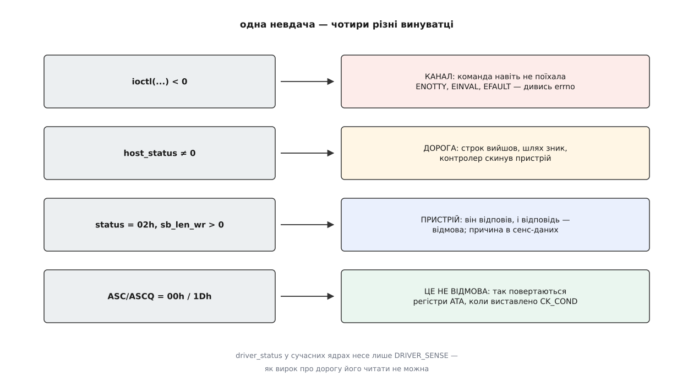
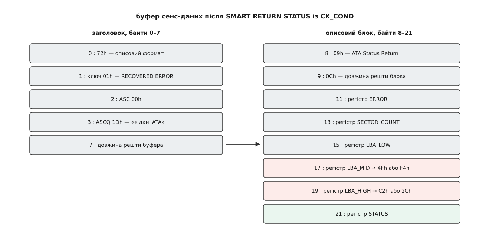

# ⚙️ Спитати носій про нього самого: INQUIRY, IDENTIFY DEVICE і відповідь SMART

Напишемо програму, яка відкриває `/dev/sda` і друкує те, чого немає в жодному файлі системи: повну модель так, як її називає сам пристрій, серійний номер, версію прошивки і головну відповідь SMART — чи не збирається диск помирати. Без `smartctl`, без `hdparm`, без `sg3_utils`: три `ioctl` і трохи роботи з байтами.

Замінити готові утиліти тут не мета. Мета в тому, що ці три питання лежать на трьох різних глибинах: перше сказане рідною мовою каналу, друге — командою, запханою в команду, третє повертає відповідь під виглядом помилки, якої не було. Хто пройшов усі три, більше не переплутає «пристрій не відповів» із «пристрій відповів відмовою» — а на цій плутанині тримається більшість поспішних вироків про несправні диски.

## Три глибини

**Крок 1 — `INQUIRY`.** Найпростіша команда SCSI: шість байтів, у відповідь — назва виробника, назва виробу й версія. Її пропускає навіть фільтр кодів операцій у ядрі, тож достатньо права відкрити вузол на читання. Для диска SATA відповідь складає не диск, а [libata](book:unix-linux/libata) — шар, який видає SATA-пристрій за пристрій SCSI й вигадує на нього правдоподібний `INQUIRY`. Це видно неозброєним оком: у полі виробу буде рівно шістнадцять перших знаків моделі, бо стільки в цьому полі місця. Обрізана модель — найкоротший доказ, що переклад таки відбувся.

**Крок 2 — `ATA PASS-THROUGH (16)` з `IDENTIFY DEVICE`.** Повну модель і серійний номер знає лише ATA. У словнику SCSI відповідника немає, тож команду ATA складаємо самі й кладемо всередину CDB: шістнадцять байтів, де більшість — це просто регістри, які шар трансляції виставить на дріт. Диск відповість 512 байтами, розкладеними на 256 шістнадцятибітних слів; рядки в них лежать із переставленими всередині слова байтами, і це не примха реалізації, а сам формат.

**Крок 3 — `SMART RETURN STATUS` із виставленим `CK_COND`.** Ця команда не передає жодного байта даних: усю відповідь вона кладе в регістри. А в наскрізному каналі місця під регістри немає — є місце лише під сенс-дані. Тому в CDB виставляють біт `CK_COND`, і шар трансляції навмисно завершує цілком успішну команду станом `CHECK CONDITION`, ховаючи регістри в описовий блок сенс-даних. Програма, яка бачить `CHECK CONDITION` і здається, тут не побачить нічого.

## Спершу — суддя

Перш ніж писати три команди, треба написати одну функцію, яка чесно розбирає результат. Інакше кожен крок обросте власним хибним `if`.



*Три перші рядки — це три різні місця дороги, а четвертий узагалі не про помилку.*

Найпідступніший рядок тут останній. Коли `CK_COND` виставлено, а команда ATA вдалася, `libata` віддає ключ `RECOVERED ERROR` із додатковим кодом `00h/1Dh` — «доступна інформація ATA PASS-THROUGH». Формально це відмова; фактично це і є відповідь. Тому судити про успіх самої команди ATA треба не за станом SCSI й не за сенс-ключем, а за регістром `STATUS`, який приїхав усередині: біт `ERR` у ньому — єдине правдиве «диск сказав ні».

Другий підступ дрібніший, але коштує дорого. У полі `driver_status` сучасні ядра ставлять рівно одне значення — `DRIVER_SENSE`, і лише тоді, коли стан дорівнює `CHECK CONDITION`. Стара звичка перевіряти `driver_status` на будь-яку ненульовість перетворює кожну успішну команду з `CK_COND` на «помилку драйвера».



*Байт 8 називає блок, байт 9 каже його довжину; регістри `LBA_MID` і `LBA_HIGH` — на зсувах 17 і 19 від початку буфера.*

> 🔧 **Навіщо це.** Описовий блок не має сталого місця: у буфері їх може бути кілька й у будь-якому порядку. Тому регістри не беруть за жорстким зсувом, а йдуть ланцюжком «код блока, довжина, вміст» і зупиняються на коді `09h`. Код, який читає `sense[17]` навпростець, працюватиме рівно доти, доки якийсь контролер не додасть перед блоком ATA власний блок із міткою часу.

## Код

Мова тут одна й вибору не має: ідеться про `ioctl`, сирі структури ядра й байтові поля CDB, де важить кожен зсув. Обгортка будь-якою іншою мовою однаково зведеться до тих самих шістнадцяти байтів.

```c
/* askdrive.c — три питання до носія одним наскрізним каналом.
   Складання: cc -O2 -Wall -Wextra -o askdrive askdrive.c
   Запуск:    sudo ./askdrive /dev/sda      (вузол ЦІЛОГО диска, не розділу) */
#include <errno.h>
#include <fcntl.h>
#include <scsi/sg.h>
#include <stdint.h>
#include <stdio.h>
#include <string.h>
#include <sys/ioctl.h>
#include <unistd.h>

enum { INQ_LEN = 96, ID_LEN = 512, SENSE_MAX = 64 };

struct reply {
    uint8_t  status;              /* байт стану від пристрою                */
    uint8_t  host;                /* вирок контролера-ініціатора            */
    uint8_t  sense[SENSE_MAX];
    unsigned sense_len;
    unsigned got;                 /* скільки байтів пристрій справді віддав */
    uint8_t  key, asc, ascq;      /* розібраний звіт про відмову            */
    uint8_t  ata[14];             /* описовий блок ATA Status Return (09h)  */
    int      have_ata;
};

/* Розкласти сенс-дані обох форматів і витягти описовий блок 09h. */
static void parse_sense(struct reply *r)
{
    const uint8_t *s = r->sense;
    unsigned code;

    if (r->sense_len < 8) return;                 /* звіту фактично немає */
    code = s[0] & 0x7F;

    if (code == 0x72 || code == 0x73) {           /* описовий формат */
        unsigned addl = s[7], off;
        r->key = s[1] & 0x0F; r->asc = s[2]; r->ascq = s[3];
        if (8u + addl > r->sense_len)             /* буфер виявився замалим */
            addl = r->sense_len - 8u;
        for (off = 8; off + 2u <= 8u + addl; off += (unsigned)s[off + 1] + 2u) {
            if (s[off] == 0x09 && s[off + 1] >= 12 && off + 14u <= r->sense_len) {
                memcpy(r->ata, s + off, 14);
                r->have_ata = 1;
            }
        }
    } else if (code == 0x70 || code == 0x71) {    /* сталий формат */
        r->key = s[2] & 0x0F;
        if (r->sense_len > 13) { r->asc = s[12]; r->ascq = s[13]; }
    }
}

/* Надіслати команду й розсудити результат.
    0 — пристрій виконав команду;
    1 — пристрій відповів ненульовим станом (звіт розібрано в r);
   -1 — до пристрою не дійшло: r->host ≠ 0 — дорога, інакше дивись errno. */
static int ask(int fd, const uint8_t *cdb, unsigned cdb_len,
               void *data, unsigned data_len, struct reply *r)
{
    sg_io_hdr_t io;

    memset(r, 0, sizeof *r);
    memset(&io, 0, sizeof io);
    io.interface_id    = 'S';
    io.dxfer_direction = data_len ? SG_DXFER_FROM_DEV : SG_DXFER_NONE;
    io.cmd_len         = (unsigned char)cdb_len;
    io.cmdp            = (unsigned char *)cdb;    /* ядро цих байтів не змінює */
    io.dxferp          = data;
    io.dxfer_len       = data_len;
    io.sbp             = r->sense;
    io.mx_sb_len       = SENSE_MAX;
    io.timeout         = 10000;                   /* мілісекунд */

    if (ioctl(fd, SG_IO, &io) < 0)                /* конверт не поїхав */
        return -1;

    r->status    = io.status;
    r->host      = io.host_status;
    r->sense_len = io.sb_len_wr;
    r->got       = io.resid > 0 ? data_len - (unsigned)io.resid : data_len;
    if (r->sense_len) parse_sense(r);

    if (io.host_status) return -1;                /* дорога, а не пристрій */
    return io.status ? 1 : 0;
}

static void complain(const char *what, const struct reply *r)
{
    if (r->host)
        fprintf(stderr, "%s: команда не доїхала, host_status = %02x\n", what, r->host);
    else if (r->status)
        fprintf(stderr, "%s: пристрій відмовив: стан %02x, ключ %x, ASC/ASCQ %02x/%02x\n",
                what, r->status, r->key, r->asc, r->ascq);
    else
        fprintf(stderr, "%s: %s\n", what, strerror(errno));
}

/* Поле INQUIRY доповнене пробілами праворуч. */
static void scsi_field(const uint8_t *p, int len, char *out)
{
    memcpy(out, p, (size_t)len);
    out[len] = '\0';
    while (len > 0 && out[len - 1] == ' ') out[--len] = '\0';
}

/* Рядок з IDENTIFY DEVICE: у кожному 16-бітному слові байти переставлені. */
static void ata_string(const uint8_t *id, int first_word, int nwords, char *out)
{
    int n = nwords * 2, i;
    for (i = 0; i < n; i += 2) {
        out[i]     = (char)id[first_word * 2 + i + 1];
        out[i + 1] = (char)id[first_word * 2 + i];
    }
    out[n] = '\0';
    while (n > 0 && out[n - 1] == ' ') out[--n] = '\0';
}

int main(int argc, char **argv)
{
    uint8_t inq[INQ_LEN], id[ID_LEN];
    struct reply r;
    char s[64];
    int fd, ata_ok = 0;

    if (argc != 2) { fprintf(stderr, "вжиток: %s /dev/sdX\n", argv[0]); return 2; }
    fd = open(argv[1], O_RDONLY | O_NONBLOCK);    /* читання досить для питань */
    if (fd < 0) { perror(argv[1]); return 1; }

    /* ── Крок 1: INQUIRY — рідною мовою каналу ─────────────────────────── */
    {
        const uint8_t cdb[6] = { 0x12, 0, 0, 0, INQ_LEN, 0 };
        if (ask(fd, cdb, sizeof cdb, inq, sizeof inq, &r) != 0) {
            complain("INQUIRY", &r);
            return 1;
        }
        if (r.got < 36) {                          /* коротша відповідь — не наша */
            fprintf(stderr, "INQUIRY: віддано лише %u байтів\n", r.got);
            return 1;
        }
        printf("тип пристрою : %02x\n", inq[0] & 0x1F);
        scsi_field(inq +  8,  8, s); printf("виробник     : %s\n", s);
        scsi_field(inq + 16, 16, s); printf("виріб        : %s\n", s);
        scsi_field(inq + 32,  4, s); printf("версія       : %s\n", s);
    }

    /* ── Крок 2: ATA PASS-THROUGH (16) з IDENTIFY DEVICE ───────────────── */
    {
        uint8_t cdb[16] = { 0 };
        cdb[0]  = 0x85;        /* ATA PASS-THROUGH (16)                       */
        cdb[1]  = 4 << 1;      /* PROTOCOL = 4 (PIO Data-In), EXTEND = 0      */
        cdb[2]  = 0x0E;        /* T_DIR=1 з пристрою, BYT_BLOK=1, T_LENGTH=2  */
        cdb[6]  = 1;           /* SECTOR_COUNT = 1 сектор                     */
        cdb[14] = 0xEC;        /* COMMAND = ECh, IDENTIFY DEVICE              */

        if (ask(fd, cdb, sizeof cdb, id, sizeof id, &r) != 0) {
            complain("IDENTIFY DEVICE", &r);
            fprintf(stderr, "  (пристрій не розуміє ATA PASS-THROUGH — далі не йдемо)\n");
        } else {
            unsigned rpm = (unsigned)id[217 * 2] | ((unsigned)id[217 * 2 + 1] << 8);
            ata_ok = 1;
            ata_string(id, 27, 20, s); printf("модель ATA   : %s\n", s);
            ata_string(id, 10, 10, s); printf("серійний     : %s\n", s);
            ata_string(id, 23,  4, s); printf("прошивка     : %s\n", s);
            if (rpm == 1)
                printf("носій        : без обертових частин\n");
            else if (rpm >= 0x0401 && rpm <= 0xFFFE)
                printf("носій        : %u об/хв\n", rpm);
        }
    }

    /* ── Крок 3: SMART RETURN STATUS із CK_COND ────────────────────────── */
    if (ata_ok) {
        uint8_t cdb[16] = { 0 };
        cdb[0]  = 0x85;
        cdb[1]  = 3 << 1;      /* PROTOCOL = 3 (Non-data)                     */
        cdb[2]  = 0x20;        /* CK_COND = 1; даних немає, T_LENGTH = 0      */
        cdb[4]  = 0xDA;        /* FEATURES = DAh, SMART RETURN STATUS         */
        cdb[10] = 0x4F;        /* LBA_MID  = 4Fh — підпис SMART               */
        cdb[12] = 0xC2;        /* LBA_HIGH = C2h — підпис SMART               */
        cdb[14] = 0xB0;        /* COMMAND  = B0h, SMART                       */

        /* Тут «1» — очікуваний результат: CK_COND навмисно дає CHECK CONDITION. */
        if (ask(fd, cdb, sizeof cdb, NULL, 0, &r) < 0 || !r.have_ata) {
            complain("SMART RETURN STATUS", &r);
            if (r.status && !r.have_ata)
                fprintf(stderr, "  (регістрів не повернуто: CK_COND не спрацював)\n");
        } else {
            uint8_t err = r.ata[3], mid = r.ata[9], high = r.ata[11], st = r.ata[13];
            printf("регістри     : STATUS %02x  ERROR %02x  LBA_MID %02x  LBA_HIGH %02x\n",
                   st, err, mid, high);
            if (st & 0x01)                                  /* біт ERR у STATUS */
                printf("SMART        : команду відхилено самим диском\n");
            else if (mid == 0x4F && high == 0xC2)
                printf("SMART        : пороги не перевищено\n");
            else if (mid == 0xF4 && high == 0x2C)
                printf("SMART        : ПОРІГ ПЕРЕВИЩЕНО — диск попереджає про відмову\n");
            else
                printf("SMART        : незрозуміла пара %02x/%02x\n", mid, high);
        }
    }

    close(fd);
    return 0;
}
```

## Що воно каже

На звичайному SATA-накопичувачі вивід виглядає так:

```
тип пристрою : 00
виробник     : ATA
виріб        : Samsung SSD 870
версія       : 1B6Q
модель ATA   : Samsung SSD 870 EVO 1TB
серійний     : S5Y2NJ0NB01234X
прошивка     : SVT01B6Q
носій        : без обертових частин
регістри     : STATUS 50  ERROR 00  LBA_MID 4F  LBA_HIGH C2
SMART        : пороги не перевищено
```

Перші чотири рядки — це слова `libata`, а не диска: виробник «ATA» вигаданий цілком, виріб обрізано на шістнадцятому знаку, а «версія» — це чотири останні знаки прошивки. Рядок нижче показує те саме поле без посередника, і різниця між ними — точна міра того, скільки правди губиться в перекладі.

Пара `4F C2` у двох останніх регістрах — не дані, а сигнал: диск повертає той самий підпис, який ми йому надіслали, і це означає «жоден показник не перетнув порога». Побачити замість неї `F4 2C` — рідкісна й лиха мить: носій сам заявляє, що котрийсь із його показників вийшов за межу, після якої виробник відмовляється ручатися. Це не прогноз на завтра, але це єдина відповідь SMART, заради якої варто негайно рятувати дані.

## Пастки

**Потрібне повноваження `CAP_SYS_RAWIO`.** Ядро не розуміє пересланої команди, тому судить її за єдиною ознакою, яку бачить, — за першим байтом CDB, звіряючи його зі списком дозволених кодів операцій. Кодів `85h` і `A1h` у тому списку немає й бути не може: під ними ховається будь-яка команда ATA, зокрема й стирання. Перевірку цілком вимикає лише [повноваження](book:unix-linux/capabilities) `CAP_SYS_RAWIO` — тому крок 1 працює й від звичайного користувача, який має право читати вузол, а кроки 2 і 3 без `sudo` (чи без `setcap cap_sys_rawio+ep`) повертають `EPERM`.

**На `/dev/sda1` буде не те, що здається.** Драйвер `sd` відхиляє `ioctl` до вузла [розділу](book:unix-linux/disk-partitions), коли в того, хто просить, немає `CAP_SYS_RAWIO`, — і відхиляє кодом `ENOIOCTLCMD`, який ядро дорогою назад перетворює на `ENOTTY`. Виглядає це так, ніби вузол узагалі не вміє `SG_IO`, хоч насправді це відмова за правом. Гірша половина новини — зворотна: із `CAP_SYS_RAWIO` команда пройде, і жодного зсуву розділу до неї ніхто не додасть, бо ядро не знає, яке з полів CDB є адресою. Команда, надіслана «в перший розділ», доїде до всього диска. Тому в програмі стоїть вузол цілого носія — не з обережності, а тому що іншого сенсу тут немає.

**Перехідник USB часто не тримає цієї розмови.** Флешка чи кишеня з диском усередині приходять у систему як пристрій SCSI, і крок 1 на них працює завжди. А от крок 2 упреться в те, чи вміє мікросхема-перехідник трансляцію SAT. Одні не вміють і чесно відповідають ключем `ILLEGAL REQUEST` із кодом `20h/00h` — «невідомий код операції». Другі приймають лише дванадцятибайтовий варіант `A1h` замість `85h` — і тут своя халепа: у наборі команд MMC, яким розмовляють приводи CD і DVD, код `A1h` означає геть іншу команду, тож перехідник, що видає себе ще й за привід, може розтлумачити її хибно. Треті вимагають власного, ні в якому стандарті не описаного коду: `smartctl` тримає для них окремі різновиди `-d usbjmicron`, `-d usbsunplus`, `-d usbprolific`, `-d usbcypress`. Четверті пропускають команду, але не повертають регістрів, і крок 3 мовчить, хоч крок 2 працює. Коротко: [USB](book:unix-linux/usb-in-linux) між вами й диском — це ще один перекладач, і словник у нього свій.

**Змонтована файлова система.** Наші три команди нічого не пишуть і на змонтованому носії безпечні. Небезпечним стає той-таки скелет, щойно в CDB поставити код, який щось міняє: байти, записані наскрізь, пройдуть повз [кеш сторінок](book:unix-linux/page-cache-durability), ядро не дізнається, які сектори змінилися, і нічого не знецінить. Є й друга, менш очевидна причина: коли наскрізна команда не вкладеться в строк, справу забирає обробник помилок [підсистеми SCSI](book:unix-linux/scsi-subsystem), а той не вміє акуратно зняти одну незрозумілу команду — він піднімається від скасування до скидання пристрою, зачіпаючи все, що на той момент у польоті. Один невдалий дослід над регістрами може обірвати запис чужої файлової системи.

**Три різні «не вийшло».** Найдорожча пастка — та, заради якої написано `ask()`. `ioctl` повернув −1 — команда не поїхала взагалі, і причина в `errno`. `host_status` ненульовий — команда поїхала й не доїхала: строк, зниклий шлях, скидання. Стан `02h` із сенс-даними — доїхала й повернулася відмовою самого пристрою. І окремо від усіх трьох — `ASC/ASCQ` рівні `00h/1Dh`: це не відмова, а домовлений спосіб повернути регістри. Програма, яка звела ці випадки до одного `if (rc)`, доповість «диск несправний» на команді, яку просто не пропустило ядро.

## Скільки це коштує

Робота тут уся в дорозі, не в обчисленнях. Три команди — три оберти «склали CDB, чекаємо, розібрали відповідь», і кожен коштує від сотень мікросекунд до одиниць мілісекунд, залежно від того, чи пристрій зайнятий і чи не спить. Байтів передано 96, 512 і нуль; розбір усього цього — кілька десятків операцій над байтами.

Зате `IDENTIFY DEVICE` вартий далеко більшого, ніж три надруковані рядки. У тих самих 512 байтах лежить підтримка [надійного стирання](book:unix-linux/secure-erase-and-sanitize), стан захисту паролем, розмір фізичного сектора, підтримка [TRIM](book:unix-linux/discard-and-trim) і десятки прапорців можливостей. Каркас із трьох кроків не міняється взагалі: змінюється лише код команди в чотирнадцятому байті CDB — і те, які слова відповіді ви вирішите прочитати.
