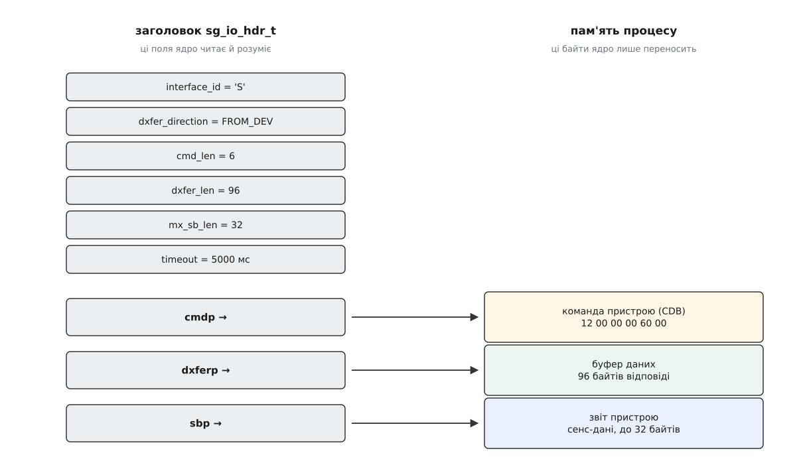
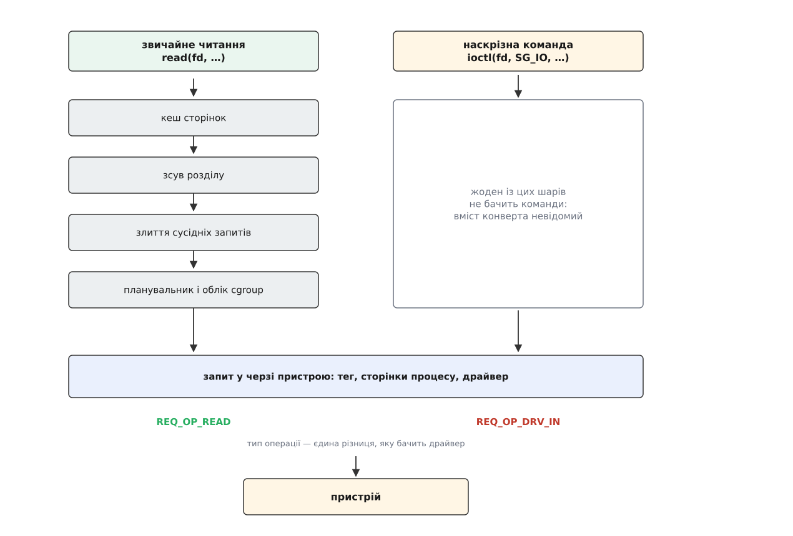
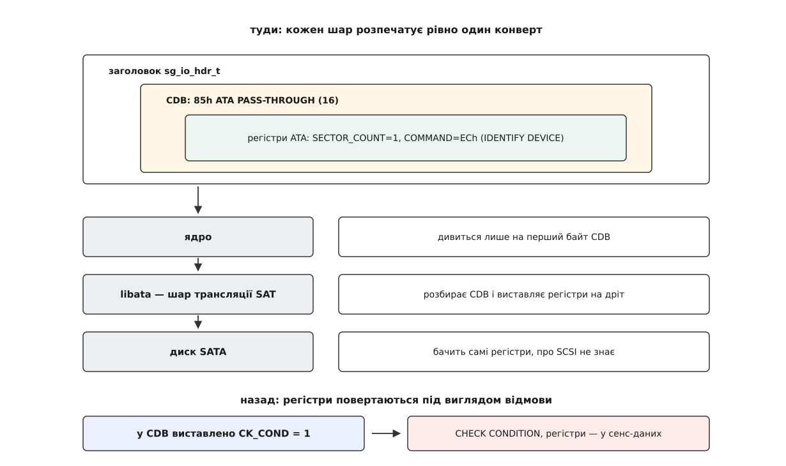

# Наскрізні команди до пристрою: SG_IO, ATA passthrough і чому вони йдуть повз блоковий шар

<preknowlist>
- [Блоковий пристрій: сектори, блоки й черга запитів](book:unix-linux/block-device-model) — носій показує себе масивом пронумерованих секторів, а звертання до нього ядро складає в чергу запитів, ділить і зливає.
- [Файл пристрою: символьний і блоковий](book:unix-linux/device-file-model) — вузол у `/dev` веде не до вмісту носія, а до драйвера.
- [Керуючий канал до драйвера: ioctl](book:unix-linux/ioctl-interface) — як процес передає драйверові дію, для якої немає `read` і `write`.
- [Підсистема SCSI](book:unix-linux/scsi-subsystem) — команда їде до пристрою самодостатнім блоком байтів (CDB), а назад повертається байт стану й, коли щось не так, сенс-дані з причиною.
- [Буферизований і прямий ввід-вивід](book:unix-linux/buffered-and-direct-io) — між програмою й носієм за звичайних умов стоїть кеш сторінок, і читання може взагалі не дійти до заліза.
- [Можливості (capabilities)](book:unix-linux/capabilities) — права root розсипано на окремі повноваження, і кожне перевіряється своїм місцем у ядрі.
</preknowlist>

Треба дізнатися серійний номер диска, його температуру й скільки годин він відпрацював. У системі є файл майже на кожну дрібницю — але файлу з цими відповідями немає, і не тому, що його забули зробити.

Усе, що пропонує `/dev/sda`, — це вміст носія: прочитати сектор, записати сектор. Серійний номер у жодному секторі не записаний. Він живе в самому пристрої, а пристрій — окрема машина зі своїм процесором і своїм набором питань, на які вона вміє відповідати. Щоб дістати відповідь, її треба спитати.

Дещо ядро таки питає. Під час виявлення пристрою воно надсилає кілька команд, розкладає відповіді по атрибутах і показує їх файлами: місткість, розмір сектора, чи обертовий носій, чи ввімкнено кеш запису. Але там лежить рівно те, про що ядро вирішило спитати — і про що воно знає, як спитати. Все інше в цій картині просто не існує.

## Чому наказ не пройде звичайною дорогою

Здавалося б, вихід простий: додати блоковому шарові ще одну дію, як колись додали скидання кешу й [discard](book:unix-linux/discard-and-trim). Але кожна така дія коштує дорого, і зрозуміло чому, якщо подивитися, що блоковий шар робить із запитом.

Він ділить запит, який перетнув межу; зливає сусідні; додає до номера сектора зсув розділу; переставляє в черзі; рахує статистику; притримує, коли cgroup вичерпала свою частку. Жодна з цих дій неможлива без розуміння змісту: у якому напрямку йдуть дані і яких саме секторів вони стосуються. Блоковий шар працює із запитом лише настільки, наскільки він знає, що той означає.

Тепер візьмімо «прочитай сторінку журналу SMART номер 02». Ділити нема чого — тут немає діапазону. Зливати з сусідом нема з чим. Додати зсув розділу до номера сторінки журналу — безглуздя, яке зіпсує команду. Виходить, щоб пропустити таку команду крізь блоковий шар, довелося б навчити його самої команди: описати її поля, її напрямок, її неподільність. І так — для кожної з кількох сотень команд кожної мови, якою розмовляють носії, разом із приватними командами кожного виробника.

Тому рішення прийняли протилежне: **не перекладати взагалі**. Процес складає готову команду мовою самого пристрою, а ядро переносить її запечатаним пакетом — не читаючи, не змінюючи й не тлумачачи. Це і є наскрізний прохід (англ. *passthrough* — «наскрізь»).

## Конверт і три вказівники

Наскрізний канал відкривається запитом `ioctl` з кодом `SG_IO`. Аргумент — структура `sg_io_hdr_t`, і вся її суть у тому, що вона майже нічого не описує. Це набір службових полів плюс три вказівники в пам'ять процесу: де лежить команда, де лежить буфер даних і куди покласти звіт пристрою.



*Ядро розбирає поля заголовка — довжини, напрямок, строк очікування — і жодного разу не заглядає в те, на що показує `cmdp`, крім першого байта.*

Виглядає це так — запит найпростішої команди SCSI, яка просить пристрій розповісти, хто він:

```c
unsigned char cdb[6]   = { 0x12, 0, 0, 0, 96, 0 };  /* INQUIRY, 96 байтів відповіді */
unsigned char data[96];
unsigned char sense[32];

sg_io_hdr_t io = {
    .interface_id    = 'S',
    .dxfer_direction = SG_DXFER_FROM_DEV,
    .cmd_len         = sizeof cdb,
    .cmdp            = cdb,
    .dxferp          = data,
    .dxfer_len       = sizeof data,
    .sbp             = sense,
    .mx_sb_len       = sizeof sense,
    .timeout         = 5000,            /* мілісекунд */
};

if (ioctl(fd, SG_IO, &io) < 0)
    perror("SG_IO");                    /* канал не спрацював */
else if (io.status != 0)
    fprintf(stderr, "пристрій відмовив, статус %02x\n", io.status);
else
    printf("виробник: %.8s, модель: %.16s\n", data + 8, data + 16);
```

Два різні `else` тут не для краси. Результат приходить на двох рівнях, і плутати їх дорого. Нуль від `ioctl` означає «конверт доїхав і відповідь повернулася» — не більше. Що пристрій зробив із наказом, написано в полях структури. Програма, яка перевіряє лише повернене `ioctl`, мовчки проковтне будь-яку відмову.

> 🔧 **Навіщо це.** Саме на цьому місці найчастіше ламаються власні утиліти обслуговування дисків: команда «стерти» повертає нуль, звіт ніхто не читає, а пристрій тим часом відповів `ILLEGAL REQUEST`. Перевіряти треба обидва рівні — і повернення `ioctl`, і `io.status` разом із сенс-даними, якщо `io.sb_len_wr` більший за нуль.

Полів стану, до речі, не одне, а чотири, і кожне відповідає за свою ділянку дороги. `status` — відповідь самого пристрою. `host_status` — вирок контролера-ініціатора: команда не доїхала, скінчився строк, зник шлях. `driver_status` — що з приводу цього зробив драйвер. Строк очікування тут не формальність: коли він спливає, справу забирає обробник помилок [підсистеми SCSI](book:unix-linux/scsi-subsystem), а той не має способу акуратно зняти одну незрозумілу команду — він піднімається сходинками від скасування до скидання пристрою, зачіпаючи все, що на той момент у польоті. І `sbp` — буфер, куди ядро копіює сенс-дані, звіт пристрою про причину відмови, байт у байт таким, як його склав пристрій.

Останнє — прямий наслідок головного рішення. Ядро не розуміє команди, яку переслало, отже не може й розтлумачити відмову: воно не знає, що для цієї команди означає «неправильне поле в CDB». Тому воно не тлумачить, а віддає звіт як є. Повний перелік полів заголовка, констант напрямку й кодів стану зібрано [окремо](book:unix-linux/scsi-generic-passthrough/api-sg-io-hdr.md), щоб не перетворювати виклад на таблицю.

Той самий `SG_IO` приймають три різні вузли. `/dev/sg0` — символьний вузол драйвера `sg`, який існує для будь-якого пристрою SCSI, навіть коли блокового пристрою немає взагалі: корпус-полиця з вентиляторами, робот стрічкової бібліотеки, сканер. `/dev/sda` — звичайний блоковий вузол диска. `/dev/bsg/0:0:0:0` — вузол драйвера `bsg`. Чому дверей три, а кімната одна, розказано в [історії наскрізного каналу](book:unix-linux/scsi-generic-passthrough/hist-three-doors.md): драйвер, написаний 1992 року для заліза, якому ще не було класу, двічі перероблений інтерфейс і два пізніші додатки, кожен зі своєї причини.

Цим каналом ходить усе, що розмовляє з носієм не про його вміст: `smartctl`, коли дістає журнали й температуру; `hdparm`, коли вмикає захист паролем чи запускає стирання; утиліти `sg3_utils`, які по суті є тонкою обгорткою навколо одного `ioctl`; `nvme-cli` на своєму боці. Записувачі дисків користувалися ним ще тоді, коли ядро взагалі не мало поняття про запис на носій, — і саме звідти в цього каналу репутація «останнього виходу».

## Що саме «повз»

Слово «повз» варто уточнити, бо буквально воно неправдиве. Запит `SG_IO` до блокового вузла цілком собі проходить крізь машинерію блокового шару: ядро бере запит у тій самій черзі пристрою, дає йому тег, прикріплює сторінки процесу до запиту, а потім віддає драйверові тим самим шляхом, що й звичайне читання. Різниця в одному полі — тип операції. Замість «читання» чи «запису» там стоїть `REQ_OP_DRV_IN` або `REQ_OP_DRV_OUT`, і це рівно те саме, що напис «вміст невідомий» на конверті.

Слова «ядро лише переносить байти» теж варто розкрити, бо переносить воно їх не копіюванням. Сторінки, на які показує `dxferp`, ядро закріплює в пам'яті, щоб вони не поїхали під час операції, і будує з них список ділянок для [прямого доступу пристрою до пам'яті](book:unix-linux/dma-and-buffers) — пристрій пише відповідь просто в буфер програми. Коли контролер фізично не дотягується до тих адрес, ядро підставляє проміжний буфер і копіює, але це виняток, а не правило. Звідси й одне з обмежень, на яке легко наштовхнутися: розмір передачі не може перевищувати того, що витримує черга пристрою, і зайве `dxfer_len` дає відмову ще до того, як команда кудись поїде. Скільки байтів пристрій насправді передав, видно потім у полі `resid` — різниці між замовленим і реальним, яку виставляє драйвер контролера, а не блоковий шар.

Повз іде не машинерія, а **зміст**. І з цього одного факту випливають усі три обмеження наскрізного каналу.

**Кеш сторінок не знає про запис.** Байти, які пристрій отримав наскрізною командою, повз кеш і пройшли: ядро не мало як зрозуміти, які сектори змінилися, тому нічого не знецінило. Програма, яка читає той самий файл звичайним чином, і далі бачитиме старе. Тому послідовність перед наскрізним записом завжди та сама: відмонтувати файлову систему, і лише тоді командувати.

**Зсув розділу нема куди додати.** У CDB немає поля «база», і ядро не знає, яке з полів команди — адреса. Отже наскрізна команда, надіслана у вузол `/dev/sda1`, потрапила б до диска цілком, а не до розділу. Дірку закрили просто: наскрізні запити до вузла розділу відхиляють — усім, хто не має `CAP_SYS_RAWIO`. Це не дрібниця безпеки, а межа довіри — право писати в розділ не мусить перетворюватися на право командувати всім носієм. З тієї самої причини цілі [device mapper](book:unix-linux/device-mapper) пропускають наскрізні запити далі лише тоді, коли ціль відображає пристрій цілком.

**Планувальник і облік не працюють.** Наскрізний запит не зливається з сусідами, не переставляється в черзі за політикою [планувальника вводу-виводу](book:unix-linux/io-schedulers) і не лягає в статистику як звичайна операція. Стримати таку команду обмеженням cgroup теж не вийде.



*Обидві дороги користуються тією самою чергою й тим самим драйвером; різниця в тому, скільки шарів по дорозі мають право щось зрозуміти й змінити.*

## Конверт у конверті

Рідна мова диска SATA — не SCSI, а ATA. Проте диск приходить у систему як `/dev/sda` і слухняно відповідає на `SG_IO`. Так виходить тому, що між ним і рештою ядра стоїть [libata](book:unix-linux/libata) — шар, який видає себе за пристрій SCSI й перекладає: `READ(16)` перетворює на ATA-читання, а відповідь на `INQUIRY` складає з даних, які диск віддав по `IDENTIFY DEVICE`.

Переклад працює, поки в команди SCSI є відповідник в ATA. Але журнали SMART, [надійне стирання](book:unix-linux/secure-erase-and-sanitize), робота з окремими регістрами — цього в словнику SCSI немає взагалі, і вигадувати переклад нема з чого. Комітет T10 вирішив питання тим самим прийомом, що й ядро: командою, вміст якої — інша команда. Стандарт SAT (англ. *SCSI/ATA Translation* — трансляція між SCSI й ATA, виданий як ANSI INCITS 431-2007) описує ATA PASS-THROUGH — CDB, у полях якого лежить сирий набір регістрів ATA. Довжини дві: дванадцятибайтова з кодом операції A1h і шістнадцятибайтова з кодом 85h, у яку влазять і 48-бітні адреси.

**Спитати диск SATA, хто він, командою його рідної мови.**

```
байт 0     : 85     ATA PASS-THROUGH (16)
байт 1     : 08     протокол 4 (PIO Data-In) у бітах 4..1
байт 2     : 0E     T_DIR=1 (дані з пристрою), BYT_BLOK=1 (лічити блоками),
                    T_LENGTH=2 (кількість узяти з регістра SECTOR_COUNT)
байт 6     : 01     SECTOR_COUNT = 1 сектор
байт 14    : EC     COMMAND = IDENTIFY DEVICE
байт 15    : 00     керуючий байт
```

Отже конвертів тепер два: заголовок `sg_io_hdr_t` несе CDB, CDB несе регістри ATA. І кожен шар на дорозі розпечатує рівно один із них: ядро дивиться на перший байт CDB і більше нікуди, `libata` розбирає CDB і виставляє регістри на дріт, диск бачить лише регістри й гадки не має, що по дорозі був SCSI.



*Наскрізний канал вкладається сам у себе: там, де в мові немає слова, її командою стає інша команда.*

Зворотний бік цієї схеми красивіший. ATA відповідає не сенс-даними, а вмістом регістрів — а в наскрізному каналі місце є тільки під сенс-дані. Щоб регістри все-таки повернулися, у CDB є біт `CK_COND`. Коли він виставлений, шар трансляції **навмисно** завершує команду станом `CHECK CONDITION` із сенс-ключем `RECOVERED ERROR` і додатковим кодом «доступна інформація ATA PASS-THROUGH», а самі регістри кладе в описовий блок сенс-даних. Тобто відмова, якої не було, — єдиний спосіб протягнути регістри каналом, у якому для них не передбачено графи. Без цього біта команда `SMART RETURN STATUS`, яка відповідає на питання «чи не при смерті диск» саме вмістом двох регістрів, була б німою.

Робочу програму, що дістає з диска модель, серійний номер і показники SMART обома дорогами — чистим SCSI й через ATA PASS-THROUGH з розбором повернутих регістрів, — зібрано [окремо](book:unix-linux/scsi-generic-passthrough/proj-ask-the-drive.md), разом із пастками, на яких така програма спотикається на USB-перехідниках.

## Хто має право надсилати

Ядро переслало команду, якої не розуміє. Отже воно не може й судити, що та команда зробить: у переліку байтів нема нічого, що відрізняло б читання від перепрошивки. Судити доводиться за єдиною ознакою, яку ядро таки дивиться, — за першим байтом CDB.

Перевірка так і влаштована: список кодів операцій. `INQUIRY`, `TEST UNIT READY`, `MODE SENSE`, читання — дозволено всім, хто зумів відкрити вузол. Записи, стирання, форматування — лише якщо вузол відкрито на запис. Усе, чого в списку немає, — відмова. А `CAP_SYS_RAWIO` вимикає перевірку цілком: із цим повноваженням проходить будь-яка команда.

Тут важливо назвати межу чесно. Список кодів операцій захищає за іменем, а не за наслідком, і цим його сила вичерпується. Приватні команди виробника до списку не входять і входити не можуть — ядро не знає, що вони роблять. ATA PASS-THROUGH до списку теж не входить, і саме тому будь-яка утиліта, що працює з ATA наскрізь, вимагає `CAP_SYS_RAWIO`. Виходить, фільтр рятує від випадкової шкоди програми, якій і так довірили дані, — але він не є тією стіною, за яку можна спокійно віддати диск чужому контейнерові.

## Той самий канал іншими мовами

NVMe свідомо не успадкував словника SCSI — і майже одразу відтворив наскрізний канал заново, майже деталь у деталь. Запити `NVME_IOCTL_ADMIN_CMD` і `NVME_IOCTL_IO_CMD` беруть структуру `nvme_passthru_cmd`: непрозорий набір полів команди, вказівник на буфер даних, назад — поле стану й слово завершення. Різниця лише в тому, чиє повноваження перевіряють: тут це `CAP_SYS_ADMIN`, а не `CAP_SYS_RAWIO`, і сплутати їх легко. Крім того, у [NVMe](book:unix-linux/nvme-in-linux) з'явився окремий загальний символьний вузол `/dev/ngXnY`, а разом із ним — наскрізна команда через [io_uring](book:unix-linux/io-uring), яка вперше зробила цей канал асинхронним і придатним для навантаження, а не лише для обслуговування.

Повторення форми — не збіг. Щойно мова пристрою багатша за «прочитай сектор — запиши сектор», для решти цієї мови потрібен канал, у якому ядро не розуміє нічого. Наскрізний прохід — це місце, де ядро визнає межу власної абстракції: саме завдяки тому, що диск SAS, флешка USB і том iSCSI виглядають однаковим масивом пронумерованих блоків, та сама програма працює з ними всіма. Ціна за це одна й неминуча — усе, що в масив блоків не вкладається, доводиться проносити повз, а з непрозорим конвертом ядро втрачає одразу три здатності: погодити кеш, виправити адресу й оцінити небезпеку.
