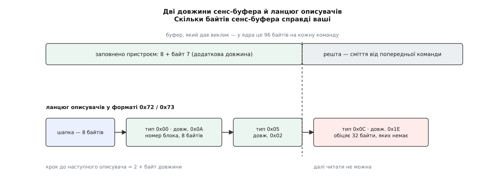

# ⚙️ Розібрати сенс-дані власноруч: від купи байтів до вироку

Напишемо програму, яка бере сирий сенс-буфер — той самий рядок шістнадцяткових чисел, що видно в журналі ядра або в дампі після `SG_IO`, — і друкує з нього чотири речі: сенс-ключ, пару ASC/ASCQ, номер збійного блока й вирок, що його над цією командою ухвалило б ядро. Жодної бібліотеки: усе потрібне тут — уміння не повірити байтам, які самі про себе брешуть.

Спокуса написати розбирач у чотири рядки величезна: ключ — молодші біти байта 2, ASC — байт 12, ASCQ — байт 13, номер блока — чотири байти від байта 3. Кожен із цих чотирьох рядків неправильний, і неправильний по-своєму. Цікавий тут не результат, а перелік перевірок, що до нього ведуть: у ядрі вони займають три невеликі функції, і жодна з них не зайва.

## Чим брешуть байти

**Розкладок дві, і вони не схожі.** Молодші сім бітів байта 0 — код відповіді: `0x70` і `0x71` означають фіксовану розкладку, `0x72` і `0x73` — описову. У фіксованій сенс-ключ лежить у байті 2, в описовій на цьому місці вже ASC, а ключ переїхав у байт 1. Розбирач, який цього не питає, на буфері `72 03 11 00 …` упевнено доповість «сенс-ключ 0x11» — число, якого серед шістнадцяти ключів навіть немає.

**Старший біт байта 0 — не частина коду.** Це біт VALID, і стосується він лише одного поля — того, де лежить номер блока. Пристрій ставить його, коли номер справді щось означає, і знімає, коли причина провалу до конкретного блока не прив'язана: зміна стану, неготовність, невідома команда. Тому `f0` і `70` — той самий код відповіді `0x70` з різною довірою до чотирьох байтів посередині.

**Довжин у буфера дві, і вірити треба меншій.** Одну називає той, хто нас покликав: у ядра це 96 байтів, відведених під сенс-дані кожної команди. Другу називає сам пристрій — байт 7, «додаткова довжина»: скільки байтів після восьмого він насправді заповнив. Буфер один на команду й уживається повторно, тому за межею заповненого лежать не нулі, а рештки попереднього провалу. А в описовій розкладці до цих двох додається третя довжина — власна в кожного описувача ланцюга.

Коротка відповідь буває й цілком чесною. Пристрій має право покласти в байт 7 трійку — тобто заповнити всього одинадцять байтів — і тоді ASC із ASCQ у звіті просто немає, бо їхнє місце — байти 12 і 13. Розбирач, який прочитає їх усе одно, доповість пару, узяту з чужого провалу, — і це найпідступніша з усіх помилок, бо пара буде цілком правдоподібна. Тому читання ASC у коді стоїть під умовою про довжину, а не під умовою про розкладку.



*Дві межі, за які не можна ступити: та, до якої пристрій заповнив буфер, і та, до якої дотягується описувач.*

**Номер блока має два розміри.** У фіксованій розкладці на нього відведено чотири байти, в описовій — вісім. Це не примха: чотирма байтами найбільший адресований блок — 4294967295, тобто близько двох тебібайтів при секторі 512 байтів, і саме тіснота цього поля породила описову розкладку. Наслідок для розбирача підступний: чотири байти, прочитані в описовій розкладці за звичкою, — це **старша** половина восьмибайтового числа, а вона в будь-якого реального диска нульова. Програма не впаде й не пожаліється: вона впевнено доповість «збійний блок 0».

## Три питання, які ядро тримає нарізно

Розбір розпадається на три дії, що нічого не знають одна про одну, — так само, як у самому ядрі.

Перша: **нормалізація** — з'ясувати розкладку й дістати ключ, ASC і ASCQ. У ядрі це `scsi_normalize_sense()`. Друга: **пошук описувача заданого типу** в ланцюгу описової розкладки — `scsi_sense_desc_find()`. Третя: **поле «інформація»** — номер блока, який у двох розкладках лежить у різних місцях і має різний розмір; `scsi_get_sense_info_fld()`.

Усі три — чисті функції над масивом байтів, і саме тому вони живуть у `scsi_common.c`, спільному для тієї частини ядра, що надсилає команди, і тієї, що їх приймає. Четверта дія — **вирок** — уже не чиста: щоб вирішити долю команди, треба знати сам пристрій (скільки повторів лишилося, чи дозволено будити мотор), тож `scsi_decide_disposition()` разом із `scsi_check_sense()` лежить окремо, в обробнику помилок.

Складати багатобайтові числа доведеться руками, старшим байтом уперед: SCSI — світ [великого порядку байтів](topic:programming/bits-bytes-endianness), і накладати на буфер структуру з `uint64_t` тут не можна ні за вирівнюванням, ні за порядком.

## Код

Головну мову тут задає сама справа — C: ідеться про сирі байти зі стандарту, зразок для звірки написаний тією ж мовою, а результат мусить читатися поруч із кодом ядра. Другою вкладкою — коротший варіант на Python, коли треба просто вкинути рядок із `dmesg` і побачити відповідь.

:::tabs
```c
/* sensedecode.c — розбір сенс-даних SCSI й вирок, що його ухвалило б ядро.
   Складання: cc -O2 -Wall -Wextra -o sensedecode sensedecode.c
   Запуск:    ./sensedecode f0 00 03 00 00 20 03 0a 00 00 00 00 11 00 00 00 00 00
              ./sensedecode -s 28                       (статус без сенс-даних) */
#include <stdbool.h>
#include <stdint.h>
#include <stdio.h>
#include <stdlib.h>
#include <string.h>

/* ── 1. Нормалізація: розкладка, ключ, ASC, ASCQ ─────────────────────────── */

struct sense_hdr {
    uint8_t response_code;      /* 0x70…0x73 — уже без біта VALID           */
    uint8_t sense_key;          /* молодші 4 біти свого байта               */
    uint8_t asc, ascq;
    uint8_t additional_length;  /* байт 7; лише в описовій розкладці        */
};

static bool sense_valid(uint8_t rc)    { return (rc & 0x70) == 0x70; }
static bool sense_deferred(uint8_t rc) { return rc >= 0x70 && (rc & 1); }

static bool normalize_sense(const uint8_t *b, int len, struct sense_hdr *h)
{
    memset(h, 0, sizeof *h);
    if (!b || len <= 0)
        return false;

    h->response_code = b[0] & 0x7f;         /* старший біт — VALID, не код  */
    if (!sense_valid(h->response_code))
        return false;

    if (h->response_code >= 0x72) {                       /* описова        */
        if (len > 1) h->sense_key = b[1] & 0x0f;
        if (len > 2) h->asc  = b[2];
        if (len > 3) h->ascq = b[3];
        if (len > 7) h->additional_length = b[7];
    } else {                                              /* фіксована      */
        if (len > 2) h->sense_key = b[2] & 0x0f;
        if (len > 7) {
            int filled = b[7] + 8;          /* стільки пристрій заповнив    */
            if (filled < len)
                len = filled;               /* далі — сміття з минулого разу */
            if (len > 12) h->asc  = b[12];
            if (len > 13) h->ascq = b[13];
        }
    }
    return true;
}

/* ── 2. Пошук описувача заданого типу ───────────────────────────────────── */

static const uint8_t *desc_find(const uint8_t *b, int len, uint8_t type)
{
    if (len < 8 || b[7] == 0)
        return NULL;
    if ((b[0] & 0x7f) < 0x72 || (b[0] & 0x7f) > 0x73)
        return NULL;

    int left = b[7];                        /* стільки байтів обіцяє пристрій */
    if (left > len - 8)
        left = len - 8;                     /* але не більше, ніж нам дали    */

    const uint8_t *d = b + 8;
    for (int k = 0; k + 2 <= left; ) {
        int step = d[1] + 2;                /* тип + байт довжини + вміст     */
        if (k + step > left)
            break;                          /* описувач обрізано — стоп       */
        if (d[0] == type)
            return d;
        d += step;
        k += step;
    }
    return NULL;
}

/* ── 3. Поле «інформація» — номер збійного блока ─────────────────────────── */

static bool sense_info(const uint8_t *b, int len, uint64_t *out)
{
    if (len < 7)
        return false;

    switch (b[0] & 0x7f) {
    case 0x70:
    case 0x71:
        if (!(b[0] & 0x80))                 /* біт VALID знято — число ні про що */
            return false;
        *out = ((uint64_t)b[3] << 24) | ((uint64_t)b[4] << 16) |
               ((uint64_t)b[5] <<  8) |  (uint64_t)b[6];
        return true;
    case 0x72:
    case 0x73: {
        const uint8_t *d = desc_find(b, len, 0x00);   /* описувач «інформація» */
        if (!d || d[1] != 0x0a)
            return false;
        uint64_t v = 0;
        for (int i = 0; i < 8; i++)
            v = (v << 8) | d[4 + i];
        *out = v;
        return true;
    }
    default:
        return false;
    }
}

/* ── 4. Вирок ───────────────────────────────────────────────────────────── */

enum disposition { NEEDS_RETRY, ADD_TO_MLQUEUE, SUCCESS, FAILED };

static const char *verdict_name(enum disposition d)
{
    switch (d) {
    case NEEDS_RETRY:    return "NEEDS_RETRY    — повторити ту саму команду";
    case ADD_TO_MLQUEUE: return "ADD_TO_MLQUEUE — назад у чергу пристрою";
    case SUCCESS:        return "SUCCESS        — суд закінчено, віддати нагору";
    case FAILED:         return "FAILED         — до обробника помилок";
    }
    return "?";
}

/* спрощене scsi_check_sense(): без прапорців пристрою (allow_restart,
   retry_hwerror, expecting_cc_ua) — лише те, що видно із самих сенс-даних */
static enum disposition check_sense(const uint8_t *b, int len)
{
    struct sense_hdr h;

    if (!normalize_sense(b, len, &h))
        return FAILED;                      /* сенс-даних нема — хай збере EH */
    if (sense_deferred(h.response_code))
        return NEEDS_RETRY;                 /* провал не цієї команди         */

    switch (h.sense_key) {
    case 0x0:                               /* NO SENSE                       */
    case 0x1:  return SUCCESS;              /* RECOVERED ERROR                */
    case 0xb:                               /* ABORTED COMMAND                */
        return h.asc == 0x10 ? SUCCESS : NEEDS_RETRY;   /* 0x10 — захист даних */
    case 0x2:                               /* NOT READY                      */
    case 0x6:                               /* UNIT ATTENTION                 */
        if (h.asc == 0x04 && h.ascq == 0x01) return NEEDS_RETRY;  /* готується */
        if (h.asc == 0x04 && h.ascq == 0x02) return FAILED;       /* мотор     */
        if (h.asc == 0x3f && h.ascq == 0x0e) return NEEDS_RETRY;  /* нові LUN  */
        return SUCCESS;
    case 0x3:                               /* MEDIUM ERROR                   */
        if (h.asc == 0x11 || h.asc == 0x13 || h.asc == 0x14)
            return SUCCESS;                 /* безнадійно: нагору як помилка  */
        return NEEDS_RETRY;
    default:   return SUCCESS;              /* ILLEGAL REQUEST, DATA PROTECT… */
    }
}

static enum disposition decide(uint8_t status, const uint8_t *b, int len)
{
    switch (status) {
    case 0x08:                              /* BUSY                           */
    case 0x28: return ADD_TO_MLQUEUE;       /* TASK SET FULL                  */
    case 0x02: return check_sense(b, len);  /* CHECK CONDITION                */
    default:   return SUCCESS;              /* GOOD, RESERVATION CONFLICT…    */
    }
}

/* ── 5. Друк ────────────────────────────────────────────────────────────── */

static const char *key_name(uint8_t k)
{
    static const char *n[16] = {
        "NO SENSE", "RECOVERED ERROR", "NOT READY", "MEDIUM ERROR",
        "HARDWARE ERROR", "ILLEGAL REQUEST", "UNIT ATTENTION", "DATA PROTECT",
        "BLANK CHECK", "VENDOR SPECIFIC", "COPY ABORTED", "ABORTED COMMAND",
        "(зарезервовано)", "VOLUME OVERFLOW", "MISCOMPARE", "COMPLETED",
    };
    return n[k & 0x0f];
}

int main(int argc, char **argv)
{
    uint8_t buf[264];                       /* стеля розкладки: 8 + 255       */
    int len = 0, i = 1;
    uint8_t status = 0x02;                  /* типово CHECK CONDITION         */
    bool have_status = false;

    if (argc > 2 && strcmp(argv[1], "-s") == 0) {
        status = (uint8_t)strtoul(argv[2], NULL, 16);
        have_status = true;
        i = 3;
    }
    for (; i < argc && len < (int)sizeof buf; i++) {
        char *end;
        unsigned long v = strtoul(argv[i], &end, 16);
        if (*end != '\0' || v > 0xff) {
            fprintf(stderr, "не байт: %s\n", argv[i]);
            return 2;
        }
        buf[len++] = (uint8_t)v;
    }
    if (len == 0 && !have_status) {
        fprintf(stderr, "вжиток: %s [-s статус] <байти сенс-даних, 16-ково>\n",
                argv[0]);
        return 2;
    }

    struct sense_hdr h;
    printf("статус       : %02x\n", status);
    if (len == 0) {
        printf("сенс-дані    : не надіслано\n");
    } else if (!normalize_sense(buf, len, &h)) {
        printf("сенс-дані    : непридатні (перший байт %02x)\n", buf[0]);
    } else {
        uint64_t info;
        printf("формат       : %s%s\n",
               h.response_code >= 0x72 ? "описовий" : "фіксований",
               sense_deferred(h.response_code) ? ", ВІДКЛАДЕНА помилка" : "");
        printf("сенс-ключ    : %x  %s\n", h.sense_key, key_name(h.sense_key));
        printf("ASC/ASCQ     : %02x/%02x\n", h.asc, h.ascq);
        if (sense_info(buf, len, &info))
            printf("збійний блок : %llu\n", (unsigned long long)info);
        else
            printf("збійний блок : не вказано\n");
    }
    printf("вирок        : %s\n", verdict_name(decide(status, buf, len)));
    return 0;
}
```
```python
#!/usr/bin/env python3
"""sensedecode.py — те саме для рядка, скопійованого з журналу.
   ./sensedecode.py 'f0 00 03 00 00 20 03 0a 00 00 00 00 11 00 00 00 00 00'"""
import sys

KEYS = ["NO SENSE", "RECOVERED ERROR", "NOT READY", "MEDIUM ERROR",
        "HARDWARE ERROR", "ILLEGAL REQUEST", "UNIT ATTENTION", "DATA PROTECT",
        "BLANK CHECK", "VENDOR SPECIFIC", "COPY ABORTED", "ABORTED COMMAND",
        "(зарезервовано)", "VOLUME OVERFLOW", "MISCOMPARE", "COMPLETED"]


def normalize(b):
    """→ (код відповіді, ключ, ASC, ASCQ) або None, якщо сенс-даних немає."""
    if not b or (b[0] & 0x70) != 0x70:
        return None
    rc, n = b[0] & 0x7f, len(b)
    if rc < 0x72 and n > 7:
        n = min(n, b[7] + 8)              # пристрій сам сказав, скільки заповнив
    at = lambda i: b[i] if i < n else 0
    if rc >= 0x72:
        return rc, at(1) & 0xf, at(2), at(3)
    return rc, at(2) & 0xf, at(12), at(13)


def desc_find(b, want):
    """описувач заданого типу в ланцюгу розкладки 0x72/0x73."""
    if len(b) < 8 or not (0x72 <= (b[0] & 0x7f) <= 0x73) or b[7] == 0:
        return None
    end, i = 8 + min(b[7], len(b) - 8), 8
    while i + 2 <= end:
        step = b[i + 1] + 2
        if i + step > end:                # описувач обрізано — далі не читаємо
            break
        if b[i] == want:
            return b[i:i + step]
        i += step
    return None


def info_field(b):
    """номер збійного блока або None."""
    if (b[0] & 0x7f) in (0x70, 0x71):
        if len(b) < 7 or not (b[0] & 0x80):        # біт VALID знято
            return None
        return int.from_bytes(b[3:7], "big")       # чотири байти
    d = desc_find(b, 0x00)
    return int.from_bytes(d[4:12], "big") if d and d[1] == 0x0a else None


def check_sense(b):
    h = normalize(b)
    if h is None:
        return "FAILED"
    rc, key, asc, ascq = h
    if rc & 1:                                     # відкладена помилка
        return "NEEDS_RETRY"
    if key in (0x0, 0x1):
        return "SUCCESS"
    if key == 0xb:
        return "SUCCESS" if asc == 0x10 else "NEEDS_RETRY"
    if key in (0x2, 0x6):
        if (asc, ascq) in ((0x04, 0x01), (0x3f, 0x0e)):
            return "NEEDS_RETRY"
        return "FAILED" if (asc, ascq) == (0x04, 0x02) else "SUCCESS"
    if key == 0x3:
        return "SUCCESS" if asc in (0x11, 0x13, 0x14) else "NEEDS_RETRY"
    return "SUCCESS"


def decide(status, b):
    if status in (0x08, 0x28):
        return "ADD_TO_MLQUEUE"
    return check_sense(b) if status == 0x02 else "SUCCESS"


if __name__ == "__main__":
    args, status = sys.argv[1:], 0x02
    if len(args) >= 2 and args[0] == "-s":
        status, args = int(args[1], 16), args[2:]
    data = bytes(int(x, 16) for x in " ".join(args).replace(",", " ").split())
    h = normalize(data) if data else None
    if h:
        rc, key, asc, ascq = h
        kind = "описовий" if rc >= 0x72 else "фіксований"
        print("формат       : " + kind + (", ВІДКЛАДЕНА" if rc & 1 else ""))
        print(f"сенс-ключ    : {key:x}  {KEYS[key]}")
        print(f"ASC/ASCQ     : {asc:02x}/{ascq:02x}")
        blk = info_field(data)
        print(f"збійний блок : {blk if blk is not None else 'не вказано'}")
    else:
        print("сенс-дані    : немає або непридатні")
    print(f"вирок        : {decide(status, data)}")
```
:::

## Що воно друкує

Один і той самий провал — непоправна помилка читання на блоці 8195 — у двох розкладках виглядає геть по-різному на дроті й однаково на виході.

```
$ ./sensedecode f0 00 03 00 00 20 03 0a 00 00 00 00 11 00 00 00 00 00
статус       : 02
формат       : фіксований
сенс-ключ    : 3  MEDIUM ERROR
ASC/ASCQ     : 11/00
збійний блок : 8195
вирок        : SUCCESS        — суд закінчено, віддати нагору

$ ./sensedecode 72 03 11 00 00 00 00 0c 00 0a 80 00 00 00 00 00 00 00 20 03
статус       : 02
формат       : описовий
сенс-ключ    : 3  MEDIUM ERROR
ASC/ASCQ     : 11/00
збійний блок : 8195
вирок        : SUCCESS        — суд закінчено, віддати нагору
```

Двадцять байтів проти вісімнадцяти, номер блока в іншому місці й іншого розміру — а діагноз той самий. Тепер поміняймо в описовому буфері єдиний біт: `72` на `73`.

```
$ ./sensedecode 73 03 11 00 00 00 00 0c 00 0a 80 00 00 00 00 00 00 00 20 03
статус       : 02
формат       : описовий, ВІДКЛАДЕНА помилка
сенс-ключ    : 3  MEDIUM ERROR
ASC/ASCQ     : 11/00
збійний блок : 8195
вирок        : NEEDS_RETRY    — повторити ту саму команду
```

Той самий ключ, той самий блок — інший вирок. І третій випадок, де номера блока немає, хоч байти на його місці ненульові:

```
$ ./sensedecode 70 00 06 00 00 20 03 0a 00 00 00 00 29 00 00 00 00 00
статус       : 02
формат       : фіксований
сенс-ключ    : 6  UNIT ATTENTION
ASC/ASCQ     : 29/00
збійний блок : не вказано
вирок        : SUCCESS        — суд закінчено, віддати нагору
```

## Пастки

**Відкладена помилка — не про вашу команду.** Непарний код відповіді (`0x71`, `0x73`) означає, що пристрій звітує про провал, який стався *раніше*: типово це запис, що осів у кеші пристрою й розсипався аж тоді, коли дійшов до носія. Команда, якій цей звіт причепили, ні в чому не винна, тому ядро першою ж перевіркою в `scsi_check_sense()` віддає `NEEDS_RETRY`. Номер блока в такому звіті теж стосується старого запису — приліпити його до поточного запиту означає звинуватити невинного.

**Ключ — чотири біти, а не байт.** Старші біти того самого байта зайняті окремими ознаками, здебільшого стрічковими: мітка файлу, кінець носія, невідповідність довжини запису. Маска `0x0f` тут не косметика: стрічковий привід, що дочитався до мітки файлу, кладе в байт 2 значення `0x80` — ключ `NO SENSE` плюс піднята ознака. Без маски розбирач доповість про ключ `0x80`, якого не існує; з маскою — про `NO SENSE`, тобто саме те, що сталося.

**Ознака дійсності перевіряється лише в одній розкладці.** У фіксованій біт VALID — єдина підстава вірити чотирьом байтам номера. В описовій ядро цього біта не питає взагалі: там сама присутність описувача типу `0x00` із довжиною `0x0a` і є сигналом, що номер справжній. Тому в коді це дві різні перевірки, і замінити одну одною не можна.

**Обрізаний ланцюг.** Пристрій міг покласти в байт 7 більше, ніж встиг передати транспорт, а описувач наприкінці — пообіцяти тридцять байтів, коли лишилося чотири. Тому в `desc_find()` дві незалежні межі: спершу затиск обіцяної довжини реальною, потім перевірка кожного кроку. Ядро тут трохи вільніше — його пошук може повернути описувач із обрізаним тілом, і саме тому місце виклику ще раз звіряє довжину описувача з `0x0a`, перш ніж читати вісім байтів.

**Описувач у ланцюгу не один.** Поряд із номером блока там може лежати ознака невідповідної довжини, показник ходу тривалої операції, ATA-статус від транслятора SATA. Тому пошук іде за типом, а не за місцем: перший описувач у ланцюгу нічим не зобов'язаний бути тим, по який ви прийшли.

**Зарезервовані коди проходять як описові.** Перевірка `(rc & 0x70) == 0x70` пропускає й `0x74`…`0x77`, а гілка вибирається за `>= 0x72`. Це навмисно: невідомий код відповіді краще розібрати новішою розкладкою, ніж відкинути звіт цілком.

## Ціна

Уся робота — один прохід по буферу, не довшому за 263 байти, без жодного виділення пам'яті й без залежностей. Це не оптимізація, а наслідок: розбирач мусить працювати в обробнику помилок, тобто там, де вже щось зламалося і де просити пам'яті — найгірша ідея.

Три перші функції — чисті функції над масивом байтів, і це робить їх смішно легкими для перевірки: подав масив, звірив поля. Заплатили за це тим, чого в них немає, — вирок тут спрощений. Справжній `scsi_decide_disposition()` дивиться ще й на байт хоста (мовчання дроту, розрив каналу), рахує залишок дозволених повторів і питає прапорці конкретного пристрою — саме тому `NEEDS_RETRY` у ядра означає «повторити, **якщо** спроби ще лишилися», а не «повторити завжди».

Отримати живий буфер для перевірки нескладно: [наскрізний канал до пристрою](topic:unix-linux/scsi-generic-passthrough) віддає сенс-дані тієї команди, яку ви надіслали власноруч, — разом зі статусом і байтом хоста, тобто рівно тим набором, над яким судить ядро.
