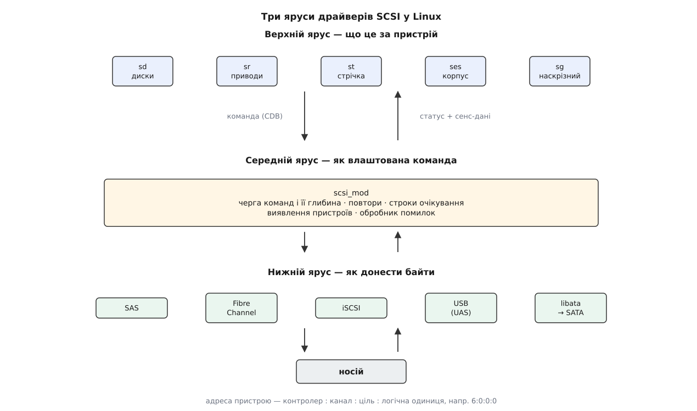
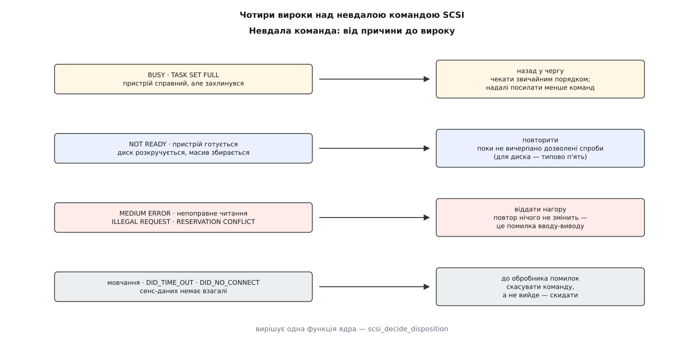
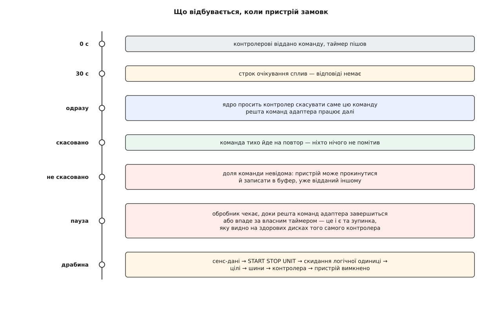

# Підсистема SCSI: команди, сенс-коди й обробка помилок

<preknowlist>
- [Блоковий пристрій: сектори, блоки й черга запитів](topic:unix-linux/block-device-model) — носій показує себе пронумерованим масивом секторів, а ядро складає звертання до нього в чергу запитів.
- [Файл пристрою: символьний і блоковий](topic:unix-linux/device-file-model) — доступ до заліза йде через вузол у `/dev`, і за вузлом стоїть драйвер, а не вміст носія.
- [Керуючий канал до драйвера: ioctl](topic:unix-linux/ioctl-interface) — окремий шлях у драйвер для всього, що не вкладається в читання й запис.
- [Модель пристроїв у sysfs](topic:unix-linux/sysfs-device-model) — кожен пристрій ядра має теку з атрибутами, які читаються й міняються звичайними файлами.
- [Переривання й відкладені частини](topic:unix-linux/interrupts-bottom-halves) — залізо повідомляє про завершення роботи перериванням, а тривалу обробку виносять з обробника.
- [DMA і відображення буферів](topic:unix-linux/dma-and-buffers) — пристрій сам переносить дані в пам'ять, звертаючись до неї власними адресами.
</preknowlist>

## Пристрій, до якого не дотягнутися

Драйвер мікросхеми, розпаяної на тій самій платі, працює просто: поклав число в регістр, прочитав біт стану, побачив результат. Уся розмова триває наносекунди й відбувається в адресному просторі процесора.

З носієм даних так не виходить. Між процесором і диском лежить кабель, а часом і мережа завдовжки континент. Диск — не набір регістрів, а окрема машина зі своїм процесором, своєю пам'яттю й своїм уявленням про те, що зараз важливо. Звідси чотири наслідки, з яких і виростає все інше.

Раз: **звернутися не можна, можна тільки надіслати повідомлення**. Отже, все, що потрібно для виконання роботи, мусить уміститися в один самодостатній пакет — інакше пристрій отримає половину наказу й чекатиме на другу.

Два: **додаткове запитання коштує стільки ж, скільки саме звертання**. Отже, відповідь «не вийшло» мусить нести причину із собою, а не відсилати по неї окремим ходом.

Три: **пристрій живе своїм життям і між нашими звертаннями встигає змінитися** — його могли вимкнути й увімкнути, у ньому могли поміняти носій. Отже, він мусить мати спосіб нав'язати новину тому, хто про неї не питав.

Чотири: **повідомлення може просто зникнути** — обірвався кабель, завис контролер, пристрій пішов у себе й не повернувся. Отже, потрібні строки очікування й спосіб силоміць повернути собі керування.

Набір домовленостей, який відповідає на всі чотири питання, зветься SCSI (англ. *Small Computer System Interface* — інтерфейс малих обчислювальних систем). Це не тип роз'єму: роз'єм давно помер, а мова, якою розмовляють із носіями, лишилася — і сьогодні нею говорять SAS, Fibre Channel, iSCSI, флешка в USB-порту й навіть звичайний SATA-диск. Як так вийшло, що шина зникла, а її словник пережив усіх, розказано в [історії SASI й SCSI](topic:unix-linux/scsi-subsystem/hist-sasi-to-scsi.md): один інтерфейс однієї фірми, злиття з розробкою конкурента, стандарт ANSI 1986 року — і кілька хвиль транспортів, кожен із яких переносив ті самі команди по-новому.

## Наказ, що вміщується в десять байтів

Самодостатній пакет із наказом зветься CDB (англ. *Command Descriptor Block* — блок опису команди). Це короткий рядок байтів, де перший байт — код операції, а решта — параметри саме цієї операції.

Довжина CDB не довільна: історично старші три біти коду операції утворювали номер групи, а група задавала довжину — шість, десять, дванадцять або шістнадцять байтів. Прийом дешевий і корисний: пристрій, який ще не впізнав команду, вже знає, скільки байтів прочитати з дроту. Пізніші редакції стандарту цю жорсткість послабили й додали команди змінної довжини, але каркас лишився той самий.

**Прочитати вісім блоків, починаючи з блока 8192.**

```
байт 0     : 28              READ(10)
байт 1     : 00              прапорці (кеш, захист даних)
байти 2–5  : 00 00 20 00     номер першого блока = 0x2000 = 8192
байт 6     : 00              група для обліку
байти 7–8  : 00 08           скільки блоків = 8
байт 9     : 00              керуючий байт
```

Десять байтів — і в них немає жодної згадки про пам'ять. Куди класти прочитане, скільки того буде й у який бік воно поїде — справа транспорту, а не команди. Саме через це той самий CDB без єдиної правки їде і мідним кабелем, і оптикою, і всередині TCP-пакета: команда описує *що зробити з носієм*, транспорт — *як донести байти*. Розділення далося не задарма, але воно й дозволило мові пережити своє залізо.

## Один байт відповіді — і чому цього мало

На кожну команду пристрій повертає байт стану. Переважна більшість відповідей — `GOOD` (нуль), і саме тому відповідь коротка: платити довгим звітом за кожне вдале читання безглуздо.

Решта значень цього байта — не діагноз, а вказівка, що робити далі. `BUSY` і `TASK SET FULL` кажуть «я живий, але зараз не можу — прийди пізніше»; це навіть не помилка, а прохання пригальмувати. `RESERVATION CONFLICT` означає «цей пристрій зараз належить іншому» — так домовляються вузли кластера, що бачать одне сховище. І, нарешті, `CHECK CONDITION` — «щось пішло не так, причина лежить окремо».

Розділення на «сталося погане» й «ось що саме» виглядає зайвим кроком, але воно принципове. Байт стану читає кожна команда, а причину — лише та невелика частка, яка справді впала. Коли б причина завжди їхала повним звітом, за неї платили б усі.

## Три числа, що звужують причину

Звіт про причину зветься сенс-даними (англ. *sense data* — дані про відчуте). Усередині — трирівневе звуження.

**Сенс-ключ** — чотири біти, шістнадцять значень. Це не діагноз, а *клас рішення*. `NOT READY` — пристрій справний, але поки не готовий. `MEDIUM ERROR` — не читається сам носій. `HARDWARE ERROR` — зламалося залізо пристрою. `ILLEGAL REQUEST` — команда неправильна або невідома. `UNIT ATTENTION` — «у мене дещо змінилося». `DATA PROTECT` — запис заборонено. `ABORTED COMMAND` — команду зірвано на півдорозі. `RECOVERED ERROR` — усе вдалося, але з другої спроби, і пристрій вважає за потрібне попередити.

**ASC** (англ. *additional sense code*) — що саме сталося, вже в межах класу. **ASCQ** (той самий код із уточненням) — який саме відтінок події.

Ієрархія тут не для краси. Драйвер, який нічого не знає про конкретну модель, мусить ухвалити рішення — повторити, здатися, зачекати. Для рішення досить ключа, і ключів рівно стільки, скільки різних рішень буває. ASC і ASCQ адресовані вже людині й журналу: їх тисячі, вони описують кожну дрібницю, і код ядра дивиться на них лише у вузьких, наперед відомих випадках.

**Розбір реальних сенс-даних у фіксованому форматі.**

```
f0 00 03 00 00 20 03 0a 00 00 00 00 11 00 00 00 00 00
 │     │  └────┬────┘  │              └─┬─┘
 │     │       │       │                └── ASC=0x11, ASCQ=0x00
 │     │       │       └─── ще 10 байтів після цього
 │     │       └─── поле «інформація» = 0x2003 = блок 8195
 │     └─── сенс-ключ = 3 → MEDIUM ERROR
 └─── 0x70 = поточна помилка, фіксований формат; +0x80 = поле «інформація» дійсне
```

Читається це так: збійний блок носія, а саме — непоправна помилка читання, і збоїть блок номер 8195, тобто четвертий з тих восьми, які просили. Пристрій уже зробив усе, що міг, усередині себе — покрутив головкою, перепробував код виправлення — і здався.

Фіксований формат має вроджену тісноту: поле «інформація» — чотири байти, а номери блоків давно вилізли за чотири мільярди. Тому поряд живе описовий формат (коди відповіді `72` і `73`), де замість жорсткої розкладки — послідовність описувачів різного типу, і номер блока в ньому займає вісім байтів. Розкладку обох форматів, перелік сенс-ключів і найчастіші пари ASC/ASCQ зібрано окремо — у [довідці зі статусів і сенс-кодів](topic:unix-linux/scsi-subsystem/api-sense-and-status.md).

> 🔧 **Навіщо це.** Коли диск сиплеться, різниця між `MEDIUM ERROR` і `HARDWARE ERROR` вирішує долю даних: у першому випадку пошкоджено окремі блоки й решту носія ще можна вичитати, у другому пристрій уже не пристрій. А `ILLEGAL REQUEST` на команді, яку ви щойно ввімкнули в налаштуваннях, майже завжди означає не поломку, а те, що модель просто не вміє того, чого від неї хочуть.

Дістати ці три числа з купи байтів — робота на пів сотні рядків, і вона повторюється в кожному засобі діагностики. Розібраний до кінця приклад такого розбирача, який приймає обидва формати й друкує заразом рішення, що його ухвалило б ядро, лежить у [коді розбирача сенс-даних](topic:unix-linux/scsi-subsystem/proj-decode-sense.md).

## Чому причину не питають окремо

Спершу за причиною ходили окремою командою `REQUEST SENSE`. Пристрій, повернувши `CHECK CONDITION`, притримував звіт у себе й відмовлявся приймати нову роботу, доки звіт не заберуть. Схема робоча, але дорога: кожна невдача — це зайвий обмін, а на невдачах якраз і не можна економити часом, бо їх буває багато й підряд.

Тому всі сучасні транспорти сенс-дані **надсилають разом зі статусом**, у тій самій відповіді. Ядро тримає під це в кожній команді буфер на 96 байтів; коли команда повертається з `CHECK CONDITION`, звіт уже в ньому. Якщо ж транспорт старий і звіту не приніс, ядро зробить те, що робилося колись, — надішле `REQUEST SENSE` само, і це буде найперший крок його обробника помилок.

## Новина, яку пристрій мусить нав'язати

Пристрій не має способу подзвонити першим. Уся розмова — тільки у відповідь на команду. А новини бувають: хтось витяг диск із кишені, масив дав пристрою нову місткість, шлях до сховища перейшов у активний стан.

Вихід один: повісити новину на найближчу команду, яка прийде. Пристрій завалює її з `CHECK CONDITION`, а в сенс-даних ставить ключ `UNIT ATTENTION` — «увага, я вже не той, з ким ти говорив останнього разу». Новина віддається один раз кожному, хто про неї ще не чув, і після цього знімається.

Найчастіші приводи: `29/00` — пристрій щойно перезавантажився; `28/00` — можливо, змінився носій; `2A/09` — змінилася місткість; `3F/0E` — змінився перелік логічних одиниць; `2A/06` — змінився стан доступу до шляху.

Ядро дивиться на це тверезо: команда, яку принесли в жертву новині, ні в чому не винна, тож майже завжди її просто повторюють, а сам факт запам'ятовують. Виняток — знімний носій із кодом «можливо, змінився носій»: тут команду навмисно провалюють нагору, бо програма, що читала стару платівку, мусить дізнатися про підміну, а не отримати мовчки вміст нової. Останній із наведених кодів — про перемикання шляхів, і на ньому тримається вся логіка [багатошляховості на device mapper](topic:unix-linux/dm-multipath): масив повідомляє, який шлях тепер головний, єдиним доступним йому способом — провалюючи чужу команду.

## Три яруси драйверів

Тепер видно, що робота природно розпадається на три різні знання, і Linux розкладає її саме так.



*Верхній ярус знає, що означає пристрій; середній — як влаштована команда; нижній — як донести байти. Мінятися може будь-який, не чіпаючи двох інших.*

**Верхній ярус** знає, *чим є* пристрій. Драйвер `sd` знає, що в диска є місткість, кеш запису й сектори, і вміє перекласти запит блокового рівня в `READ(10)` або `WRITE(16)`. `sr` знає про приводи оптичних дисків, `st` — про стрічку з її поняттям поточної позиції, `ses` — про корпус із вентиляторами й індикаторами. `sg` не знає нічого й навмисно: він віддає наскрізний канал у простір користувача, [яким можна надіслати пристроєві будь-яку команду власноруч](topic:unix-linux/scsi-generic-passthrough).

**Середній ярус** — модуль `scsi_mod` — не знає про носії нічого, зате знає все про команди: як виділити структуру команди, як покласти її в чергу, скільки їх пристрій витримує одночасно, коли повторювати, коли здаватися. Тут же живе перелік пристроїв і їхнє виявлення.

**Нижній ярус** — драйвер контролера — навпаки, нічого не знає про команди. Його справа — узяти CDB з буфером і повернути статус із сенс-даними, а як саме воно поїде, це його особиста таємниця.

Адреса пристрою в цій конструкції складається з чотирьох чисел: контролер, канал на ньому, ціль на каналі, логічна одиниця в цілі. У журналі вона виглядає як `6:0:0:0`, і за нею ж названо теки в `/sys/class/scsi_device/`.

Виграш від такого розкладу видно з того, хто ним скористався. Диск у корзині SAS, полиця по Fibre Channel, том по iSCSI, флешка в USB-порту — усі дають ті самі команди й отримують ті самі сенс-коди, бо новий транспорт вимагає написати лише нижній ярус. Навіть SATA-диск, чия рідна мова — ATA, а не SCSI, приходить у систему як `/dev/sdX`: [шар libata](topic:unix-linux/libata) перекладає команди туди й назад, аби не писати другий блоковий стек. Машина може й сама виступити пристроєм — [ціль SCSI в ядрі](topic:unix-linux/scsi-target-lio) віддає своє сховище назовні тією самою мовою. А от [NVMe](topic:unix-linux/nvme-in-linux) від цієї спадщини свідомо відмовився: там черги влаштовано інакше, і тягти за собою чужий словник виявилося дорожче, ніж написати свій.

## Вирок

Коли команда повернулася з чимось, крім `GOOD`, хтось мусить вирішити її долю. У ядрі це робить одна функція — `scsi_decide_disposition`, і вона віддає один із чотирьох вироків.

Правило, за яким вона судить, коротке: **повторювати варто лише те, чия причина минуща**. Друга спроба має сенс, коли між нею й першою світ міг змінитися на краще; якщо ж причина стала, повтор лише марнує секунди й приховує проблему.



*Той самий провал може означати «зачекай», «спробуй ще», «здавайся» або «рятуй адаптер» — вирок залежить від того, чия це біда: черги, носія, команди чи дроту.*

`BUSY` і `TASK SET FULL` — вирок «назад у чергу»: пристрій справний, просто захлинувся. Команда повертається на блоковий рівень і чекатиме звичайним порядком; на `TASK SET FULL` ядро ще й пригадає, скільки команд воно посилало, і надалі посилатиме менше.

`NOT READY` з кодом «пристрій готується» — вирок «повторити». Диск розкручується, масив збирається; за секунду він відповість інакше.

А от `MEDIUM ERROR` із непоправною помилкою читання повторювати не будуть. Пристрій уже перепробував усе, що вміє, і кожна наша спроба коштуватиме ще кілька секунд заради того самого «ні». `ILLEGAL REQUEST` не повторюють із тієї ж причини: команда, якої пристрій не розуміє, не стане зрозумілішою вдруге. На цьому, до речі, тримається все розпізнавання можливостей — ядро посилає команду й дивиться, чи не відповіли йому «не знаю такої».

`RESERVATION CONFLICT` віддають нагору негайно: чекати нема на що, поки інший вузол не відпустить пристрій.

Окремо стоїть **байт хоста** — вирок нижнього ярусу не про пристрій, а про доставку. `DID_NO_CONNECT` означає, що на тому кінці нікого немає; `DID_TIME_OUT` — що відповіді не дочекалися; `DID_TRANSPORT_DISRUPTED` — що обірвався сам канал. Це різна біда: якщо мовчить дріт, сенс-даних не буде взагалі, і судити доведеться без них.

Тут ховається пастка в назвах. Вирок «здаватися» зветься в коді `SUCCESS`, і це означає не «вийшло», а «суд закінчено, віддавайте результат нагору» — результат при цьому може бути помилкою вводу-виводу. Коли ж усі вироки вичерпано й лишається `FAILED`, команду передають туди, де починається найдорожче.

Кількість повторів обмежена наперед — драйвер диска типово дозволяє п'ять. Далі команда стає помилкою незалежно від того, наскільки минущою здавалася причина.

## Мовчання

Найгірша відповідь — її відсутність. Тому кожна команда виходить із таймером; для диска це типово тридцять секунд, і число видно та можна змінити у файлі `timeout` в теці пристрою.

Коли таймер спрацював, ядро спершу пробує найдешевше: скасувати саме цю команду й нікого більше не турбувати. Воно ставить у чергу окрему роботу, яка гукає контролер: «забудь про команду з таким-то номером». Якщо контролер відповів, що скасував, і повтори ще лишилися, команда тихо йде на другий захід, а решта системи нічого не помічає.

## Чому падає весь адаптер

Якщо скасувати не вдалося, ситуація змінюється якісно. Ядро більше не знає, що пристрій робить із тією командою. Може, він її вже забув. А може, за хвилину прокинеться й запише дані в буфер, який ядро тим часом віддало комусь іншому — і це буде тиха руйнація чужої пам'яті, найгірше з того, що взагалі буває.

Гарантовано вбити команду можна лише скиданням. Але скидання не вбиває одну команду — воно вбиває **всі** незавершені команди пристрою, цілі або шини. Отже, перш ніж скидати, треба знати долю кожної з них.

Саме тому обробник помилок улаштовано так, як улаштовано: він чекає, доки *всі* команди адаптера або завершаться, або впадуть, і лише тоді береться до роботи. Нові команди на цей час притримують.



*Скасування коштує мало й нікому не заважає. Скидання вимагає володіти долею всіх команд адаптера — і тому починається аж тоді, коли останній таймер дотикав.*

Наслідок відчутний і болючий. Один завислий пристрій із тридцятисекундним таймером на контролері з глибокою чергою затримує весь адаптер рівно на стільки, скільки тікає найповільніший із незавершених таймерів. Диски, що працюють нормально, стоять поруч і чекають, бо висять на тому самому контролері.

> 🔧 **Навіщо це.** Звідси два налаштування, які рятують продуктивні системи. Атрибут `eh_deadline` у теці контролера обмежує загальний час порання з помилками: коли він вичерпався, ядро припиняє драбину й одразу скидає весь адаптер — грубо, зате швидко й передбачувано. А на сховищі з кількома шляхами навпаки знижують `timeout` окремого пристрою: краще визнати шлях мертвим за кілька секунд і перевести навантаження на сусідній, ніж тридцять секунд тримати заручником увесь контролер.

## Драбина

Дочекавшись тиші, обробник іде вгору за жорсткістю, і порядок кроків диктує ціна помилки: спершу те, що зачіпає найменше.

Крок перший — **зібрати сенс-дані** для тих команд, що прийшли без них. Часто на цьому все й закінчується: якщо звіт каже «то була просто зміна стану», ніякого скидання не треба.

Крок другий — **`START STOP UNIT`**: а раптом пристрій усього лиш заснув і його треба розбудити.

Далі — власне скидання, чотирма сходинками. **Логічної одиниці** — гине робота одного тому. **Цілі** — гине робота всіх томів за одним пристроєм. **Шини** — гине робота всіх, хто на ній висить. **Контролера** — гине все. Кожна наступна сходинка розширює коло постраждалих, і саме тому починають знизу.

Якщо не подіяло ніщо, пристрій позначають як вимкнений. Це не примха, а милосердя: відтоді кожна команда до нього провалюється миттєво, не займаючи ні черги, ні дроту, і система, яка досі повзла, знову починає працювати — без одного пристрою, зате швидко.

Наприкінці обробник розбирає накопичену купу: те, що вдалося врятувати, вертається на повтор; те, що ні, віддається нагору як помилка вводу-виводу — і вже блоковий рівень вирішує, чи стане це помилкою файлової системи.

## Читати сліди

Уся ця машинерія лишає в журналі кілька рядків, які читаються буквально.

```
sd 6:0:0:0: [sdb] tag#12 FAILED Result: hostbyte=DID_OK
sd 6:0:0:0: [sdb] tag#12 Sense Key : Medium Error [current]
sd 6:0:0:0: [sdb] tag#12 Add. Sense: Unrecovered read error
sd 6:0:0:0: [sdb] tag#12 CDB: Read(10) 28 00 00 00 20 00 00 00 08 00
blk_update_request: critical medium error, dev sdb, sector 8195
```

`6:0:0:0` — адреса з чотирьох чисел, за нею пристрій знаходиться в `/sys`. `hostbyte=DID_OK` — найважливіше слово в усьому уривку: транспорт спрацював бездоганно, тож кабель, контролер і мережа поза підозрою. Сенс-ключ називає винного — носій. Уточнення каже, що саме сталося. Далі йде сам CDB тими байтами, які поїхали на пристрій, — той самий `READ(10)` із блока 8192 на вісім блоків. І останній рядок, уже від блокового рівня, називає точний номер збійного блока, узятий із поля «інформація» сенс-даних.

П'ять рядків — і зрозуміло все: що просили, хто відмовив, чому й на якому саме блоці. Шукати винного більше ніде.

## Що з цього лишилося

Кабель SCSI зник із машин років двадцять тому, і його вже ніхто не пам'ятає. Пережила його не мова команд сама по собі, а рішення, яке за нею стоїть: **сховище — це окрема машина, з якою домовляються, а не пристрій, яким керують**. З цього рішення випливає геть усе — самодостатній пакет наказу, стан із причиною в одній відповіді, право пристрою нав'язати новину, строки очікування й драбина примусу.

Найкращий доказ — NVMe. Його автори свідомо не взяли ні CDB, ні сенс-кодів, почали з чистого аркуша — і прийшли до самодостатнього пакета команди, поля стану з розгорнутим кодом помилки й власної драбини скидань. Не тому, що наслідували SCSI, а тому, що вихідні умови ті самі: далекий пристрій, дорогий обмін і неминучі відмови. Словник можна переписати; чотири наслідки, з яких він виріс, переписати не можна.
