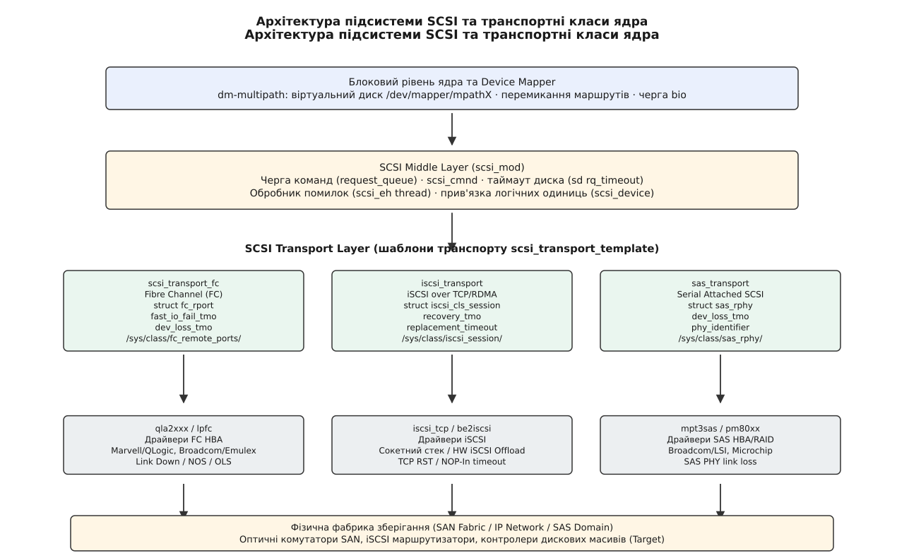
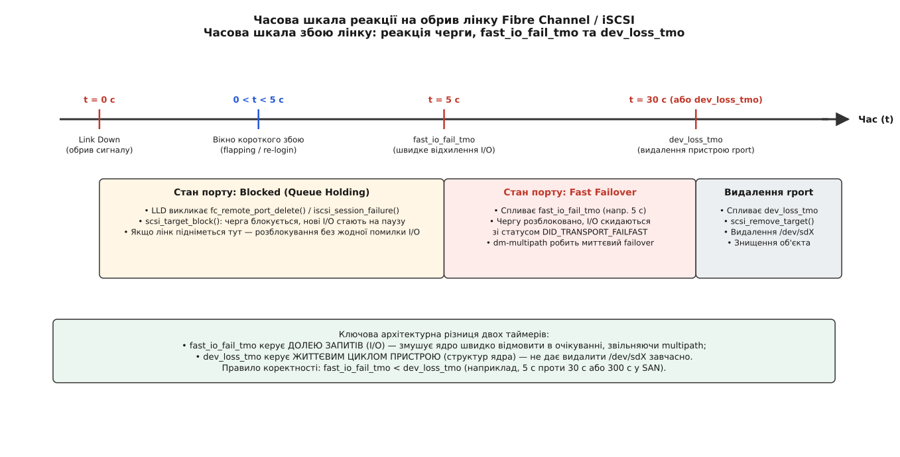
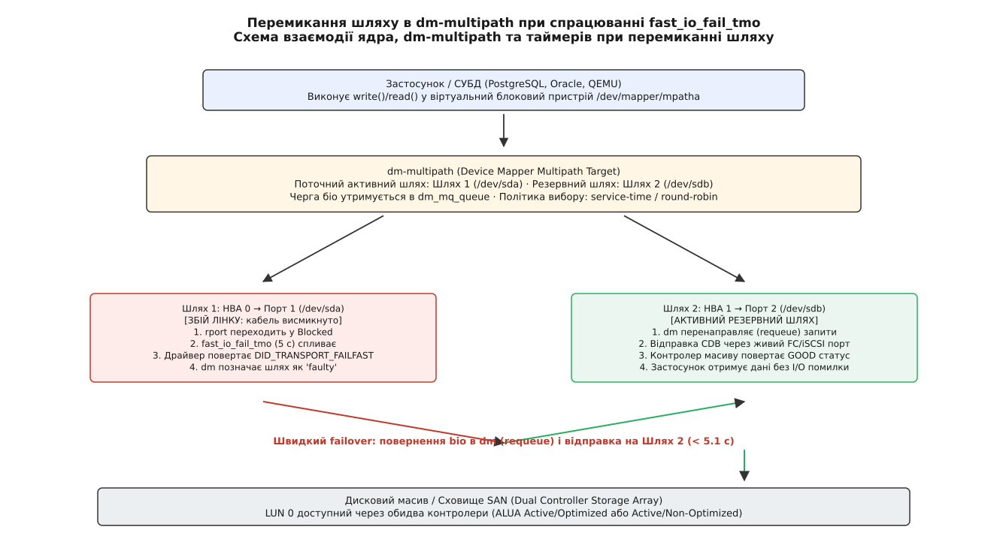
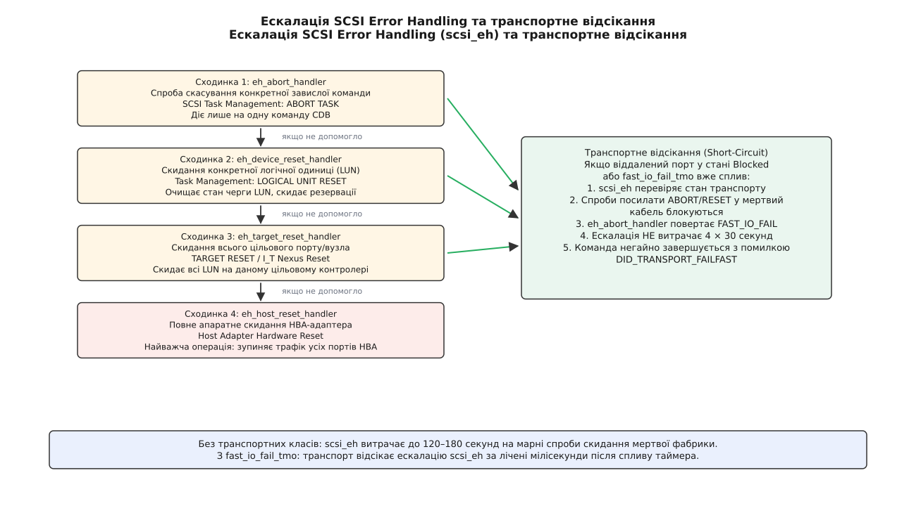

# Таймери транспорту SCSI: dev_loss_tmo, fast_io_fail_tmo і шлях помилки вгору

<preknowlist>
- [Підсистема SCSI: команди, сенс-коди й обробка помилок](book:unix-linux/scsi-subsystem) — команди CDB, байт статусу, сенс-дані та багаторівнева обробка помилок.
- [Багатошляховість на device mapper](book:unix-linux/dm-multipath) — об'єднання кількох фізичних маршрутів до одного LUN у відмовостійкий пристрій.
- [Блоковий пристрій: сектори, блоки й черга запитів](book:unix-linux/block-device-model) — стек обробки біо, черги запитів та відкладення виконання.
- [Модель пристроїв у sysfs](book:unix-linux/sysfs-device-model) — віддзеркалення апаратних зв'язків ядра у файловій системі.
- [Протокол iSCSI у Linux](book:unix-linux/iscsi-in-linux) — інкапсуляція команд SCSI у TCP/IP з'єднання.
- [Асиметричний логічний доступ SCSI (ALUA)](book:unix-linux/scsi-alua) — цільові групи портів, стани Active/Optimized та перемикання контролерів сховища.
</preknowlist>

## Коли кабель висмикнуто: дилема між панікою та зависанням

Навантажена реляційна база даних виконує сорок тисяч операцій введення-виведення на секунду через корпоративну мережу зберігання даних Fibre Channel. У розпал робочого дня оптичний комутатор фабрики перезавантажується після збою живлення, або інженер випадково зачіпає оптичний патчкорд у серверній стійці. Фізичний сигнал на приймачі хост-адаптера зникає за частки мікросекунди.

У цей момент операційна система стикається з фундаментальною інженерною суперечністю між надійністю збереження даних та безперервністю обслуговування запитів.

Якщо блоковий рівень ядра зреагує негайно і провалить усі активні запити системною помилкою введення-виведення `EIO` (англ. *Input/Output error*), файлова система миттєво перейде в режим захисту від пошкодження метаданих — змонтується лише для читання (`Read-Only filesystem`). СУБД аварійно завершить роботу, транзакції обірвуться, а сервер випаде з робочого кластера. Такий сценарій є неприйнятним, якщо комутатор просто перезавантажувався протягом кількох секунд або лінк відновився після короткого збою оптичного трансивера.

Якщо ж ядро вирішить терпляче чекати на повернення диска, покладаючись виключно на стандартний таймер команди SCSI (який за замовчуванням становить 30 або 60 секунд на кожну операцію), усі процеси, що виконують синхронний запис або очікують на скидання журналів транзакцій, зависнуть у стані непереривного очікування ядра — `D state` (англ. *uninterruptible sleep*). Протягом тридцяти секунд черги застосунків переповняться, пули з'єднань вичерпаються, сторожові таймери кластера вирішать, що вузол повністю відмовив, і ініціюють його примусове перезавантаження (fencing/stonith).

Ситуація додатково загострюється підсистемою керування віртуальною пам'яттю. Коли процеси записують дані у сторінковий кеш (page cache), накопичуються «брудні» сторінки. Якщо фонове скидання сторінок на диск блокується через зависання черги SCSI, ядро вмикає механізм прямого витіснення пам'яті (*direct reclaim*). Будь-який процес у системі, якому знадобиться виділити пам'ять, починає блокуватися в очікуванні завершення операцій запису, що спричиняє лавиноподібне зависання навіть тих служб, які не звертаються до сховища напряму.

Для подолання цієї дилеми в ядрі Linux існує окремий архітектурний рівень — транспортні класи SCSI (англ. *SCSI Transport Classes*). Їхнє завдання полягає в тому, щоб відокремити поведінку фізичного середовища передачі даних від логіки самого накопичувача, розщепивши процес реакції на аварію на два незалежні таймери: таймер швидкої відмови запитів `fast_io_fail_tmo` та таймер повного видалення пристрою `dev_loss_tmo`.

## Архітектура транспортного прошарку (SCSI Transport Classes)

Історично підсистема SCSI в ядрі Linux складалася з трьох жорстко розмежованих ярусів: верхнього ярусу пристроїв (драйвери `sd` для дисків, `st` для магнітних стрічок, `sr` для оптичних приводів), середнього ярусу `scsi_mod` (керування чергами запитів `scsi_cmnd`, обробка тайм-аутів і запуск відновлення після помилок) та низькорівневих драйверів апаратних адаптерів (LLD — *Low-Level Drivers*).

Коли на початку 2000-х років паралельна шина SCSI поступилася місцем складним мережевим фабрикам — Fibre Channel, Serial Attached SCSI (SAS) та iSCSI, з'ясувалося, що середній ярус ядра не розуміє мережевої природи цих інтерфейсів. Для ядра `scsi_mod` будь-який пристрій був просто диском на локальній шині з чотирма координатами `Host:Channel:Target:LUN`. Якщо оптичний кабель обривався, драйвер адаптера (наприклад, QLogic або Emulex) не мав штатного механізму повідомити ядру: «диск не зламався, просто тимчасово пропала оптична мережа». Кожен виробник контролерів писав власні закриті модулі, власні таймери в драйверах і власні нестандартні утиліти конфігурації.

Щоб навести лад, розробники ядра виділили спільну функціональність у проміжний шар — транспортні класи ядра.

```
                  ┌─────────────────────────────────────────┐
                  │    Блоковий рівень та dm-multipath     │
                  │   /dev/mapper/mpatha  (керування bio)   │
                  └────────────────────┬────────────────────┘
                                       │
                  ┌────────────────────┴────────────────────┐
                  │        SCSI Middle Layer (scsi_mod)     │
                  │ scsi_cmnd · request_queue · scsi_device │
                  └────────────────────┬────────────────────┘
                                       │
         ┌─────────────────────────────┼─────────────────────────────┐
         │ scsi_transport_fc           │ iscsi_transport             │ sas_transport
         │ struct fc_rport             │ struct iscsi_cls_session    │ struct sas_rphy
         │ fast_io_fail_tmo            │ recovery_tmo                │ dev_loss_tmo
         │ dev_loss_tmo                │ replacement_timeout         │ phy_identifier
         └─────────────┬───────────────┴─────────────┬───────────────┴─────────────┬───────────┘
                       │                             │                             │
         ┌─────────────┴───────────────┐┌────────────┴───────────────┐┌────────────┴───────────┐
         │ LLD: qla2xxx / lpfc         ││ LLD: iscsi_tcp / be2iscsi  ││ LLD: mpt3sas / pm80xx   │
         │ Fibre Channel HBA           ││ iSCSI Software / Hardware  ││ SAS HBA / Expanders     │
         └─────────────┬───────────────┘└────────────┬───────────────┘└────────────┬───────────┘
                       │                             │                             │
                       ▼                             ▼                             ▼
                 [ Оптична SAN ]               [ IP / Ethernet ]             [ SAS Домен ]
```


*Архітектура підсистеми SCSI та транспортні класи ядра: поділ обов'язків між блоковим рівнем, середнім ярусом scsi_mod, транспортними шаблонами та низькорівневими драйверами HBA.*

У ядрі з'явилися спеціалізовані модулі: `scsi_transport_fc` для Fibre Channel, `scsi_transport_iscsi` для iSCSI, `scsi_transport_sas` для SAS та `scsi_transport_srp` для RDMA-протоколу SCSI RDMA Protocol.

Кожен транспортний клас реєструє в ядрі шаблон `struct scsi_transport_template` і вводить у системну модель поняття *віддаленого порту* (англ. *remote port* або `rport` у Fibre Channel, `session` в iSCSI, `rphy` у SAS). Віддалений порт — це мережева сутність, кінцева точка фабрики (наприклад, цільовий контролер дискового масиву), якій належать логічні одиниці зберігання (LUN).

Завдяки цьому середній ярус ядра більше не працює з абстрактними координатами на шині: він знає, через який саме віддалений порт доступний кожен диск `/dev/sdX`, і підпорядковує чергу команд стану цього мережевого порту.

## Анатомія обриву: від втрати сигналу до блокування черги

Що саме відбувається всередині операційної системи в момент, коли зв'язок зі сховищем зникає?

Розглянемо специфіку виявлення обривів для кожного з трьох провідних транспортів зберігання даних:

### Fibre Channel: апаратні примітиви та втрата світла

У мережах Fibre Channel обрив фізичного каналу фіксується трансивером SFP на рівні фізичного кодування (FC-0 / FC-1). Якщо оптоволокно перерізано або висмикнуто, приймач адаптера фіксує подію LOS (англ. *Loss of Signal*) через падіння оптичної потужності нижче порогу чутливості фотодіода.

Якщо ж кабель цілий, але віддалений комутатор чи порт цільового масиву вимикається, на лінк надходять спеціальні 4-байтові службові примітиви упорядкованих послідовностей (англ. *Ordered Sets*):
- `NOS` (*Not Operational Sequence*) — передавач сповіщає про перехід у неробочий стан;
- `OLS` (*Offline Sequence*) — порт переходить в автономний режим ініціалізації;
- `LIP` (*Loop Initialization Primitive*) — перезапуск арбітражного кільця у застарілих топологіях FC-AL.

Мікропрограма HBA миттєво генерує апаратне переривання. Драйвер адаптера (`qla2xxx` для QLogic/Marvell або `lpfc` для Emulex/Broadcom) викликає функцію транспортного класу `fc_remote_port_delete(rport)`.

### iSCSI: розрив TCP-з'єднань та таймаути NOP-In

У транспорті iSCSI зв'язок базується на сокетах TCP/IP. Збій мережі може проявитися двома шляхами:
1. Швидкий розрив: отримання пакета `TCP RST` або помилки `ICMP Host/Network Unreachable` від проміжних маршрутизаторів при падінні лінку.
2. «Тихий» обрив: кабель відключено, пакети зникають без відповіді. У цьому разі зв'язок контролюється періодичним надсиланням службових повідомлень `NOP-Out` з очікуванням відповіді `NOP-In`.

Якщо відповідь не надходить протягом таймауту `noop_out_timeout` (зазвичай 5–10 секунд), стек `open-iscsi` або апаратний драйвер iSCSI Offload (наприклад, `be2iscsi`, `bnx2i`) перериває сесію і викликає `iscsi_session_failure(cls_session, ISCSI_ERR_CONN_FAILED)`.

### SAS: події PHY Down та експандери

У середовищі Serial Attached SCSI зв'язок між HBA та дисками організовано через прямі фізичні лінії (PHY) або комутатори-розширювачі (SAS Expanders). При відключенні кабелю контролер PHY втрачає бітову синхронізацію і генерує подію `PHY Down`. Якщо диск підключено через експандер, останній надсилає хост-адаптеру широкомовне повідомлення `Broadcast (Change)` (BCAST). Драйвер контролера (`mpt3sas`) опитує таблицю експандера і викликає `sas_rphy_delete(rphy)`.

### Механізм блокування черги ядра

Попри різницю у фізичних протоколах, реакція транспортних класів ядра на виклик функції видалення/збою порту є повністю уніфікованою:

1. **Зміна стану порту.** Поле `port_state` віддаленого порту переводиться зі стану `Online` у стан `Blocked` (`FC_PORTSTATE_BLOCKED` у FC або `ISCSI_SESSION_FAILED` в iSCSI).
2. **Блокування черги команд (Queue Blocking).** Транспортний клас викликає внутрішні функції середнього ярусу `scsi_target_block()` та `scsi_device_block()`. Драйвер блокового рівня негайно припиняє передавати нові запити введення-виведення у чергу HBA-контролера.
3. **Утримання запитів (Queue Holding).** Усі нові операції читання та запису, що надходять від файлових систем або застосунків до дисків цього порту, не відхиляються з помилкою, а стають на паузу і накопичуються в пам'яті блокового планувальника ядра (`request_queue`).
4. **Старт системних таймерів.** Транспортний клас запускає таймери зворотного відліку: `fast_io_fail_tmo` та `dev_loss_tmo`.

> 🔧 **Навіщо це.** Блокування черги — це головний захисний бар'єр проти мікрозбоїв на фабриці. У реальних мережах Fibre Channel короткочасні втрати лінку на 100–500 мілісекунд трапляються регулярно: це може бути процес повторного логіну порту (PRLI — *Process Login*), перебудова топології комутатора або оновлення конфігурації зон (zoning). Якби ядро не блокувало чергу, кожен такий мікрозбій призводив би до сотень аварійних помилок у системних журналах і розриву користувацьких з'єднань.

## Два таймери на одному обриві: fast_io_fail_tmo та dev_loss_tmo

Блокування черги рятує від мікрозбоїв, але породжує нову небезпеку: якщо кабель обірвано назавжди, скільки часу операційна система має право утримувати запити на паузі?

Одного лічильника часу для цієї задачі принципово недостатньо. Причина криється в різниці між двома системними сутностями: *запитами введення-виведення* (I/O) та *структурами пристрою в пам'яті ядра* (`struct scsi_device` та файл `/dev/sdX`).

Саме тому транспортні класи оперують парою узгоджених таймерів.

```
 Час (t) ──►
 0 c                          5 c                                  30 c (або 300 c)
 ├─── Link Down               ├─── fast_io_fail_tmo                ├─── dev_loss_tmo
 │                            │                                    │
 ▼                            ▼                                    ▼
┌────────────────────────────┬────────────────────────────────────┬──────────────────────┐
│  Стан: BLOCKED             │  Стан: FAST FAIL                   │  Стан: DELETED       │
│  • Черга I/O заморожена    │  • Черга I/O розблокована          │  • Виклик            │
│  • Запити чекають у RAM    │  • Усі I/O повертаються негайно    │    scsi_remove_target│
│  • Якщо зв'язок повернеться│    зі статусом                     │  • Демонтаж /dev/sdX │
│    — нуль помилок для ОС   │    DID_TRANSPORT_FAILFAST          │  • Знищення об'єкта  │
│                            │  • dm-multipath робить failover    │    rport у sysfs     │
│                            │  • Пристрій /dev/sdX ще існує      │                      │
└────────────────────────────┴────────────────────────────────────┴──────────────────────┘
```


*Часова шкала реакції на обрив лінку Fibre Channel / iSCSI: фаза блокування черги, швидке відхилення I/O через fast_io_fail_tmo та остаточне вилучення пристрою за dev_loss_tmo.*

### fast_io_fail_tmo: керування долею запитів

Таймер швидкої відмови `fast_io_fail_tmo` (англ. *Fast I/O Failure Timeout*) визначає, скільки секунд ядро дозволяє тримати чергу запитів заблокованою в очікуванні відновлення фізичного каналу.

Якщо протягом встановленого часу (наприклад, 5 секунд) порт не повернувся в стан `Online`, транспортний клас ухвалює рішення: чекати далі не можна, оскільки застосунки ризикують зависнути.

У цей момент ядро виконує такі дії:
- Транспортний клас переводить порт у режим швидкого відхилення;
- Черга пристрою розблоковується;
- Усі накопичені в пам'яті запити, а також усі нові операції, що надходять до цього диска, негайно завершуються з системним статусом `DID_TRANSPORT_FAILFAST` (байт результату хоста `0x0f`).

Головна особливість статусу `DID_TRANSPORT_FAILFAST` полягає в тому, що для середнього ярусу SCSI та підсистеми Device Mapper це не є звичайною помилкою читання сектора (`EIO`). Цей статус чітко сигналізує: *«диск фізично живий, але даний конкретний мережевий шлях до нього наразі заблоковано»*.

### dev_loss_tmo: керування життєвим циклом пристрою

Паралельно з `fast_io_fail_tmo` продовжує цокати другий таймер — `dev_loss_tmo` (англ. *Device Loss Timeout*). Він визначає максимальний ліміт терпіння ядра щодо самого існування цільового пристрою в операційній системі.

Поки діє `dev_loss_tmo`, операційна система зберігає всі внутрішні структури: об'єкт `struct scsi_device`, вузол у дереві `/sys/class/scsi_device/` та файл блокового пристрою `/dev/sda`. Навіть якщо `fast_io_fail_tmo` вже сплив і всі запити повертаються з помилкою failfast, сам пристрій `/dev/sda` нікуди не зникає з системи.

Якщо ж зв'язок не відновився до вичерпання `dev_loss_tmo` (наприклад, 30 секунд за замовчуванням або 300 секунд у великих SAN):
- Ядро остаточно визнає, що віддалений порт безповоротно зник із фабрики;
- Викликається функція `scsi_remove_target()`, яка рекурсивно видаляє всі логічні одиниці LUN, що належали цьому порту;
- Файли `/dev/sdX` видаляються з каталогу `/dev`;
- Підсистема `udev` надсилає подію `remove`, сповіщаючи простір користувача про демонтаж обладнання;
- Об'єкт `rport` переходить у фінальний стан `FC_PORTSTATE_DELETED` і звільняє пам'ять.

### Деградація сигналу та маргінальні порти (Marginal Ports)

Починаючи з версій ядра Linux 5.3, транспортні класи отримали новий механізм виявлення деградації каналу зв'язку без повного обриву світла. У середовищі SAN часто виникає ситуація, коли оптоволокно забруднене або виникає виснаження буферних кредитів (Buffer-to-Buffer Credit starvation). Лінк фізично активний, але відсоток пошкоджених кадрів або затримок зростає в сотні разів («flapping port» або «slow drain device»).

Для обробки таких прихованих збоїв драйвери HBA аналізують лічильники бітових помилок і надсилають у транспортний клас подію маргінального стану. Порт переводиться у стан `FC_PORTSTATE_MARGINAL`, а команди завершуються зі статусом `DID_TRANSPORT_MARGINAL`. Демон `multipathd` ізолює такий деградований шлях ще до того, як застосунки почнуть страждати від критичних затримок.

### Правило узгодження двох таймерів

Між цими таймерами діє непорушне математичне та логічне правило ядра:

```
fast_io_fail_tmo < dev_loss_tmo
```

Значення таймера швидкої відмови зобов'язане бути суворо меншим за таймер видалення пристрою. Якщо адміністратор або сценарій спробує записати в sysfs значення `fast_io_fail_tmo`, яке перевищує поточний `dev_loss_tmo`, ядро поверне системну помилку `-EINVAL`.

Розглянемо три можливі сценарії розвитку подій при налаштуваннях `fast_io_fail_tmo = 5` та `dev_loss_tmo = 30`:

**Сценарій 1: Короткий збій (відновлення на 3-й секунді).**
Лінк упав, черга заблокувалася. На 3-й секунді оптичний сигнал повертається. HBA виконує повторну ініціалізацію порту. Транспортний клас переводить порт назад у `FC_PORTSTATE_ONLINE` і викликає `scsi_target_unblock()`. Черга відкривається, усі накопичені запити безперешкодно надсилаються у сховище. Застосунок зафіксував лише невелику трисекундну затримку (jitter), жодна помилка I/O не виникла.

**Сценарій 2: Аварія одного каналу за наявності багатошляховості (відновлення через 2 хвилини).**
Оптичний кабель пошкоджено. Перші 5 секунд черга утримує запити. На 5-й секунді спливає `fast_io_fail_tmo`. Запити починають швидко відхилятися з кодом `DID_TRANSPORT_FAILFAST`. Підсистема багатошляховості перехоплює цей код і перемикає потік даних на резервний оптичний кабель. Пристрій `/dev/sda` лишається в системі як тимчасово непрацездатний шлях. Коли через 2 хвилини інженер замінює кабель, лінк піднімається, порт повертається в `Online`, і демон багатошляховості повертає шлях у робочий стан без повторного створення файлів `/dev/`.

**Сценарій 3: Повний демонтаж сховища (зв'язок не повернувся).**
Дискову полицю було вимкнено назавжди. На 5-й секунді спрацьовує `fast_io_fail_tmo`, скидаючи активні I/O. На 30-й секунді спливає `dev_loss_tmo`. Ядро констатує смерть цілі, видаляє застарілі пристрої `/dev/sda`, очищає таблиці маршрутизації та вивільняє системну пам'ять.

Повний перелік параметрів sysfs для всіх трьох транспортів (FC, iSCSI, SAS) та значення бітових масок результату команди зібрано у [довіднику sysfs-атрибутів транспорту SCSI та налаштувань multipath](book:unix-linux/scsi-transport-timeouts/api-transport-sysfs.md).

## Шлях помилки вгору: взаємодія з dm-multipath і multipathd

Таймер `fast_io_fail_tmo` створювався не для ізольованого використання: його головне призначення — бути джерелом сигналу для підсистеми багатошляховості [dm-multipath](book:unix-linux/dm-multipath).

Сучасні дискові масиви корпоративного рівня підключаються до серверів щонайменше через два незалежні оптичні комутатори (Фабрика A та Фабрика B) та два контролери сховища, утворюючи матрицю з 4, 8 або 16 маршрутів до кожного логічного тому LUN. Кожен фізичний маршрут операційна система бачить як окремий дисковий пристрій: `/dev/sda`, `/dev/sdb`, `/dev/sdc`, `/dev/sdd`. Драйвер Device Mapper об'єднує їх у єдиний віртуальний відмовостійкий пристрій `/dev/mapper/mpatha`.

```
                    ┌─────────────────────────────────────────┐
                    │    Застосунок (PostgreSQL / СУБД)       │
                    │        write() / read() в mpatha        │
                    └────────────────────┬────────────────────┘
                                         │
                    ┌────────────────────┴────────────────────┐
                    │          dm-multipath target            │
                    │   /dev/mapper/mpatha  (стан: ACTIVE)    │
                    └──────────┬───────────────────┬──────────┘
                               │                   │
                     (Шлях 1: /dev/sda)    (Шлях 2: /dev/sdb)
                               │                   │
                               ▼                   ▼
                     [ ОБРИВ КАБЕЛЮ ]     [ АКТИВНИЙ РЕЗЕРВ ]
                               │                   │
                        fast_io_fail_tmo           │
                            (5 с)                  │
                               │                   │
                               ▼                   │
                     DID_TRANSPORT_FAILFAST        │
                               │                   │
                               └───────► bio ──────┘
                                  (requeue & failover)
                                       (< 100 мс)
```


*Перемикання збійного маршруту в dm-multipath при отриманні статусу DID_TRANSPORT_FAILFAST: повернення bio в чергу та прозорий failover на резервний шлях.*

Коли застосунок надсилає команду запису у `/dev/mapper/mpatha`, драйвер `dm-multipath` вибирає активний шлях (наприклад, `/dev/sda`) і передає туди запит.

Якщо на цьому шляху виникає обрив оптичного лінку:
1. Порт переходить у `Blocked`, і запит зависає в черзі на 5 секунд.
2. Після спливу `fast_io_fail_tmo = 5` ядро повертає запит драйверу `dm-multipath` зі статусом `DID_TRANSPORT_FAILFAST`.
3. Отримавши `FAILFAST`, `dm-multipath` розуміє, що проблема не в пошкодженні даних, а у відмові каналу. Він негайно позначає шлях `/dev/sda` як `faulty` (збійний).
4. Запит не повертається застосунку з помилкою! Драйвер `dm-multipath` повертає структуру `bio` у власну внутрішню чергу (механізм *requeue*) і негайно перенаправляє її на резервний шлях `/dev/sdb`.
5. Резервний шлях надсилає команду через живий адаптер, контролер масиву успішно записує дані на пластини й повертає статус `GOOD`.
6. Застосунок успішно завершує системний виклик `write()`. Увесь збій зв'язку на першій фабриці призвів лише до короткої п'ятисекундної паузи у виконанні операції.

### Роль демона multipathd та відновлення (failback)

Поки ядро на льоту перенаправляє запити введення-виведення, у просторі користувача працює системний демон `multipathd`.

Демон регулярно опитує стан усіх зареєстрованих фізичних шляхів за допомогою модуля перевірки `path_checker` (зазвичай використовується перевірка `tur` — надсилання легкої команди SCSI `TEST UNIT READY`).

Коли шлях переходить у стан `faulty`, `multipathd` починає опитувати його з підвищеною увагою. Якщо через деякий час оптичний комутатор завантажується і лінк відновлюється, чергова перевірка `TEST UNIT READY` повертає успішний статус `GOOD`. Демон `multipathd` фіксує відновлення зв'язку, перевіряє стан [ALUA](book:unix-linux/scsi-alua) на порту і виконує процедуру повернення на основний маршрут (*failback*), знову розподіляючи навантаження між обома лінками.

### Небезпека параметрів no_path_retry та queue_if_no_path

Що має робити `dm-multipath`, якщо аварія виявилася глобальною і **всі доступні фізичні шляхи** вийшли з ладу?

Поведінка системи в цій критичній ситуації визначається директивою `no_path_retry` у файлі конфігурації `/etc/multipath.conf`:

- `no_path_retry fail` (або `0`): Якщо всі шляхи відмовили, `dm-multipath` негайно провалює всі нові та накопичені операції системною помилкою `EIO`. Застосунки негайно падають, файлові системи переходять у read-only, але пам'ять ядра залишається вільною.
- `no_path_retry queue` (еквівалент опції `features "1 queue_if_no_path"`): Драйвер Device Mapper зупиняє передачу помилок нагору і починає нескінченно утримувати всі запити застосунків у буферах оперативної пам'яті, очікуючи, що адміністратори колись полагодять сховище.

> ⚠️ **Пастка конфігурації.** Опція `queue_if_no_path` корисна для короткочасних аварій, але смертельно небезпечна при тривалих катастрофах. Якщо масив відключився на кілька годин, а база даних продовжує генерувати тисячі транзакцій на секунду, черга `dm-multipath` безконтрольно поглинатиме сторінки оперативної пам'яті (`slab` ядра). Коли вільна пам'ять вичерпається, почне спрацьовувати OOM-killer ядра (Out Of Memory Killer), який почне хаотично вбивати системні процеси, включаючи сам демон `multipathd` та SSH-сервер, перетворюючи сервер на некерований «зомбі».

Практичну утиліту для прослуховування подій uevent через сокет Netlink та покроковий сценарій безпечного тестування перемикання шляхів під навантаженням наведено в [практичному проекті з моніторингу подій rport та симуляції збоїв у SAN](book:unix-linux/scsi-transport-timeouts/proj-multipath-failover.md).

## Таймери вже надісланих команд і SCSI Error Handling (scsi_eh)

Досі ми розглядали долю тих запитів, які надходять до ядра **після** або в момент виявлення обриву. Але що відбувається з тими командами, які вже були передані апаратному адаптеру HBA і відправлені в оптоволокно за мікросекунду до аварії?

Ці команди перебувають на обліку в середньому ярусі ядра `scsi_mod`. Кожна передана команда отримує власний сторожовий таймер — таймаут команди диска `rq_timeout` (зазвичай 30 секунд для стандартних дисків у `/sys/block/sdX/device/timeout`).

Оскільки кабель обірвано, цільовий контролер ніколи не поверне відповідь на цю команду. Через 30 секунд таймер середнього ярусу спрацьовує, і ядро запускає важкий механізм відновлення після помилок — потік ядра `scsi_eh_X` (англ. *SCSI Error Handler*).

```
                                 [ Сплив таймер команди rq_timeout (30 c) ]
                                                    │
                                                    ▼
 ┌─────────────────────────────────────────────────────────────────────────────────────────────────────┐
 │ Потік scsi_eh: 4 сходинки ескалації                                                                 │
 │                                                                                                     │
 │  Сходинка 1: eh_abort_handler ───────► Спроба скасувати конкретну команду (ABORT TASK)              │
 │        │                                                                                            │
 │        ▼ (якщо не допомогло)                                                                        │
 │  Сходинка 2: eh_device_reset_handler ─► Скидання логічної одиниці (LOGICAL UNIT RESET)             │
 │        │                                                                                            │
 │        ▼ (якщо не допомогло)                                                                        │
 │  Сходинка 3: eh_target_reset_handler ─► Скидання цільового порту (TARGET RESET / I_T Nexus)         │
 │        │                                                                                            │
 │        ▼ (якщо не допомогло)                                                                        │
 │  Сходинка 4: eh_host_reset_handler ──► Повне скидання HBA-адаптера (Host Reset)                    │
 └──────────────────────────────────────────────────┬──────────────────────────────────────────────────┘
                                                    │
                   ┌────────────────────────────────┴────────────────────────────────┐
                   │                                                                 │
                   ▼                                                                 ▼
      [ БЕЗ транспортного класу ]                                       [ З транспортним класом ]
      • Спроби відправки у мертвий дріт                                 • Перевірка: port у BLOCKED?
      • Очікування 4 × 30 с = 120 секунд                                • Сплив fast_io_fail_tmo?
      • Повне заморожування адаптера                                    • МИТТЄВИЙ SHORT-CIRCUIT:
                                                                          eh_abort_handler -> FAST_IO_FAIL
                                                                        • Команда скидається за мілісекунди
```


*Чотири сходинки ескалації scsi_eh та механізм транспортного відсікання, який зупиняє марні спроби скидання мертвої фабрики.*

### Чотири сходинки класичної ескалації scsi_eh

Обробник помилок SCSI діє за принципом ескалації насилля — від точкового втручання до повного апаратного перезавантаження:

1. **Скасування команди (`eh_abort_handler`).** Драйвер адаптера намагається надіслати в бік сховища службове повідомлення керування завданнями Task Management Function: `ABORT TASK`, вимагаючи скасувати виконання саме цієї завислої команди.
2. **Скидання логічної одиниці (`eh_device_reset_handler`).** Якщо скасування не вдалося, драйвер шле наказ `LOGICAL UNIT RESET`. Цільовий контролер повинен очистити чергу команд для даного конкретного LUN і скинути всі внутрішні блокування.
3. **Скидання цілі або шини (`eh_target_reset_handler` / `eh_bus_reset_handler`).** Наказ `TARGET RESET` (або скидання зв'язку I_T Nexus). Цільовий контролер примусово перезавантажує всі свої логічні одиниці.
4. **Скидання хост-адаптера (`eh_host_reset_handler`).** Якщо сховище взагалі не відповідає, ядро виконує найважчу операцію: повністю переініціалізує мікросхему HBA-адаптера на материнській платі сервера.

### Транспортне відсікання (Short-Circuit)

У класичній паралельній шині SCSI кожен крок ескалації супроводжувався власним тайм-аутом (до 30 секунд на кожну спробу). У результаті повний цикл спроб скинути мертвий диск міг тривати **від двох до чотирьох хвилин**, протягом яких увесь адаптер HBA був повністю заблокований для будь-якої іншої роботи.

Транспортні класи вирішують цю проблему завдяки механізму *транспортного відсікання* (англ. *transport short-circuiting*).

Коли потік `scsi_eh` прокидається для обробки завислої команди, функція `fc_eh_timed_out()` або відповідний обробник транспортного класу негайно перевіряє стан віддаленого порту:

```c
/* Фрагмент логіки обробки тайм-ауту в drivers/scsi/scsi_transport_fc.c */
enum blk_eh_timer_return fc_eh_timedout(struct scsi_cmnd *scmd)
{
    struct fc_rport *rport = starget_to_rport(scsi_target(scmd->device));

    if (rport->port_state == FC_PORTSTATE_BLOCKED) {
        if (rport->flags & FC_RPORT_FAST_FAIL_TIMEDOUT) {
            /* fast_io_fail_tmo вже сплив: відсікаємо ескалацію scsi_eh */
            return BLK_EH_DONE;
        }
        /* Порт заблоковано, але fast_io_fail_tmo ще діє: продовжуємо таймер */
        return BLK_EH_RESET_TIMER;
    }
    return BLK_EH_DONE;
}
```

Якщо порт уже перебуває у стані `Blocked` і таймер `fast_io_fail_tmo` вичерпано, транспортний клас забороняє драйверу виконувати безглузді спроби відправки `ABORT TASK` або `RESET` у розірване оптоволокно. Функція відновлення негайно повертає статус швидкої відмови, і команда провалюється за частки мікросекунди без проходження багаторівневої ескалації `scsi_eh`.

Для додаткового захисту від зависання `scsi_eh` у конфігурації ядра та `multipath.conf` використовується параметр `eh_deadline`. Він встановлює абсолютний часовий ліміт (наприклад, 30 секунд), після вичерпання якого ядро припиняє будь-які подальші спроби реанімації адаптера і безумовно завершує всі завислі команди з помилкою.

## Конфігурація та налаштування через sysfs і multipath.conf

Усі параметри транспортних таймерів доступні для інспекції та динамічної зміни на працюючому сервері через файлову систему `sysfs`.

### Дослідження стану портів Fibre Channel

Віддалені порти Fibre Channel розташовані в каталозі `/sys/class/fc_remote_ports/`:

```bash
# Перегляд списку зареєстрованих віддалених портів
ls -l /sys/class/fc_remote_ports/

# Виведення поточного стану та налаштувань таймерів конкретного rport
cat /sys/class/fc_remote_ports/rport-0:0-1/port_state
cat /sys/class/fc_remote_ports/rport-0:0-1/fast_io_fail_tmo
cat /sys/class/fc_remote_ports/rport-0:0-1/dev_loss_tmo
```

Якщо необхідно змінити значення таймерів на льоту (наприклад, під час діагностики чи налаштування), нові значення записуються безпосередньо у відповідні псевдофайли. Пам'ятаючи про правило `fast_io_fail_tmo < dev_loss_tmo`, спочатку збільшують `dev_loss_tmo`, а потім змінюють `fast_io_fail_tmo`:

```bash
# Збільшення ліміту видалення пристрою до 300 секунд
echo 300 > /sys/class/fc_remote_ports/rport-0:0-1/dev_loss_tmo

# Встановлення таймера швидкої відмови на 5 секунд
echo 5 > /sys/class/fc_remote_ports/rport-0:0-1/fast_io_fail_tmo
```

### Дослідження сесій iSCSI

Для протоколу iSCSI параметри таймерів зосереджені в каталозі `/sys/class/iscsi_session/`:

```bash
# Перегляд активних сесій iSCSI
cat /sys/class/iscsi_session/session1/state
cat /sys/class/iscsi_session/session1/recovery_tmo
cat /sys/class/iscsi_session/session1/targetname
```

Таймер `recovery_tmo` в iSCSI виконує ту саму функцію, що й `dev_loss_tmo` у Fibre Channel: він визначає, скільки секунд демон `iscsid` намагатиметься відновити розірване TCP-з'єднання перед тим, як ядро остаточно демонтує блокові пристрої.

### Узгодження з multipath.conf

Ручне редагування файлів у `sysfs` діє лише до першого перезавантаження сервера або перепідключення порту. Для постійного закріплення налаштувань використовується конфігураційний файл `/etc/multipath.conf`:

```
defaults {
    # Швидке перемикання I/O при аварії каналу (5 секунд блокування)
    fast_io_fail_tmo        5

    # Утримувати структури пристрою rport у ядрі 300 секунд
    dev_loss_tmo            300

    # Опитування стану шляху за допомогою SCSI Test Unit Ready кожні 5 с
    path_checker            tur
    polling_interval        5

    # Граничний час роботи обробника помилок scsi_eh
    eh_deadline             30

    # Утримувати чергу запитів при відмові всіх шляхів
    no_path_retry           queue
}

devices {
    device {
        vendor              "PURESTORAGE"
        product             "FlashArray"
        fast_io_fail_tmo    5
        dev_loss_tmo        600
        path_grouping_policy group_by_prio
        prio                alua
    }
}
```

Коли демон `multipathd` запускається або виявляє появу нового пристрою через `udev`, він автоматично зчитує налаштування з `multipath.conf` і записує відповідні значення у псевдофайли `fast_io_fail_tmo` та `dev_loss_tmo` для кожного пов'язаного порту в `sysfs`.

## Еталонні моделі поведінки при збоях

Щоб закріпити розуміння роботи підсистеми транспорту SCSI, зіставимо дві діаметрально протилежні архітектурні конфігурації серверів.

### Модель 1. Сервер без багатошляховості (Single-Path)

Сервер підключено до дискового масиву одним оптичним кабелем без використання `dm-multipath`.

У такій конфігурації швидке відхилення запитів не має сенсу: якщо кабель упав, резервного маршруту немає. Будь-яка помилка, повернута застосунку, призведе до аварії СУБД.

- **Налаштування:** `fast_io_fail_tmo = off` (або вимкнено), `dev_loss_tmo = 30`.
- **Поведінка при збої:** При обриві лінку порт переходить у `Blocked`, і черга запитів блокується. Ядро терпляче утримує всі операції в пам'яті до 30 секунд. Якщо протягом цього часу зв'язок відновлюється — сервер продовжує роботу без жодної системної помилки. Якщо за 30 секунд лінк не повернувся — пристрій видаляється, а застосунки отримують фінальний `EIO`.

### Модель 2. Корпоративний кластер із багатошляховістю (Multi-Path SAN)

Сервер підключено до корпоративного масиву через два HBA-адаптери та дві незалежні фабрики SAN. На рівні ОС працює `dm-multipath`.

У цій конфігурації головна мета — мінімізувати час простою застосунку при відмові одного компонента мережі.

- **Налаштування:** `fast_io_fail_tmo = 5`, `dev_loss_tmo = 300` (або `infinity`), `no_path_retry = queue`.
- **Поведінка при збої:** При пошкодженні кабелю першої фабрики порт блокує чергу рівно на 5 секунд (захист від мікрозбоїв). На 5-й секунді спрацьовує `fast_io_fail_tmo`, запити миттєво відхиляються з кодом `DID_TRANSPORT_FAILFAST`, `dm-multipath` перенаправляє їх на другу фабрику, і СУБД продовжує роботу без втрати транзакцій. Пристрій першого шляху зберігається в ядрі протягом 300 секунд, дозволяючи оптичному лінку спокійно відновитися після перезавантаження комутатора.

Завдяки розділенню обов'язків між середнім ярусом SCSI, транспортними класами ядра та підсистемою Device Mapper, операційна система Linux перетворює небезпечну апаратну аварію фізичної оптичної магістралі на прозору для користувача мікрозатримку, зберігаючи цілісність файлових систем і безперервність обробки даних.
