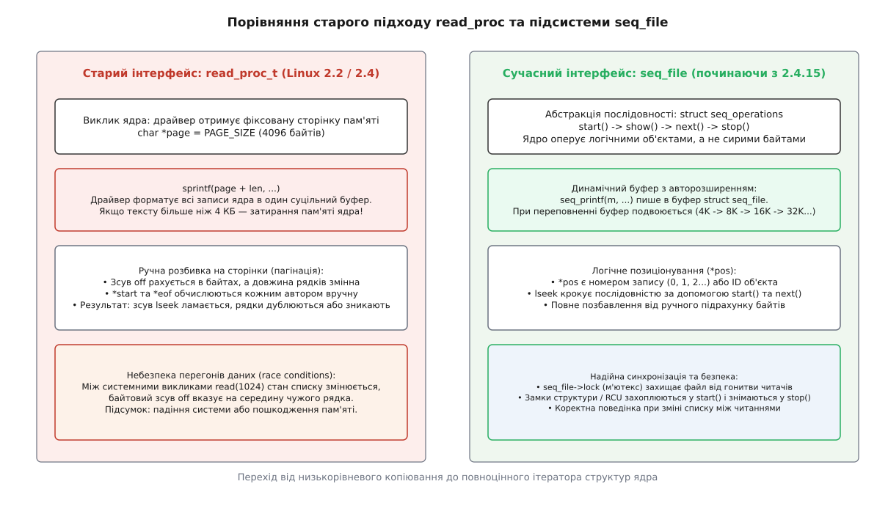
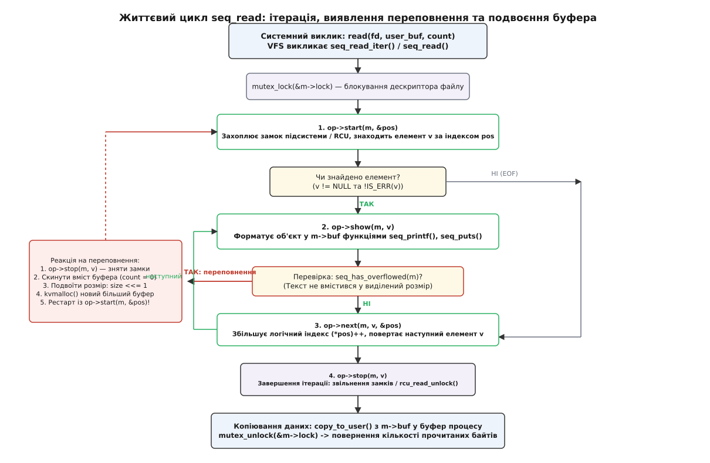
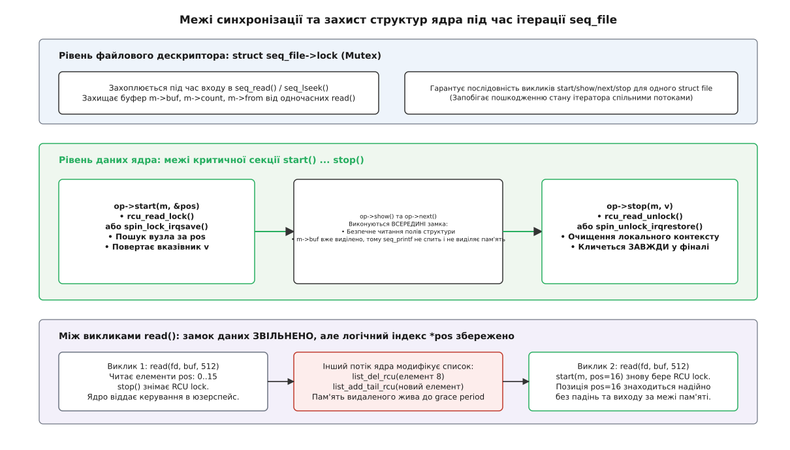

# Інтерфейс seq_file: ітератор текстового виводу ядра

<preknowlist>
- [Архітектура procfs та структура /proc/[pid]](book:unix-linux/procfs-architecture-and-proc-pid) — віртуальна файлова система як дзеркало внутрішнього стану ядра.
- [Кеш каталогових записів (dcache)](book:unix-linux/dentry-cache) — операції `file_operations`, системний виклик `read()` та зміщення `loff_t *ppos`.
- [RCU: читання без замків і відкладене звільнення](book:unix-linux/rcu-read-copy-update) — блокування під час ітерації структур без очікування читачів.
- [Пам'ять ядра: slab та kvmalloc](book:unix-linux/kernel-memory-slab) — виділення неперервних буферів, `kmalloc` проти `vmalloc`.
- [Модулі ядра](book:unix-linux/kernel-modules) — реєстрація вузлів та очищення ресурсів при вивантаженні.
</preknowlist>

Коли процес користувача виконує команду `cat /proc/net/dev` або читає стан дисків у `/proc/partitions`, ядро Linux мусить розгорнути внутрішні зв'язні списки, масиви та дерева об'єктів у суцільний текстовий потік ASCII. На перший погляд це виглядає як звичайний запис у файл. Проте у просторі ядра за цим викликом стоїть фундаментальна проблема: обсяг внутрішніх структур ядра наперед невідомий, самі структури безперервно змінюються іншими процесами та перериваннями прямо під час читання, а системний виклик `read()` із простору користувача може запитувати дані довільними мікропорціями — хоч по одному байту за раз.

Спроба розв'язати цю задачу наївним копіюванням через статичний буфер призводить або до аварійного затирання пам'яті ядра, або до складних помилок пагінації. Для подолання цієї кризи у ядрі Linux створено підсистему **`seq_file`** (*sequence file* — файл послідовності), яка замінює хаотичне форматування байтів суворим математичним контрактом віртуального ітератора.

---

## Проблема фіксованої сторінки: чому ламався старий read_proc

У ранніх версіях ядра Linux (до серії 2.4 включно) створення файлів у `/proc` спиралося на простий інтерфейс зворотного виклику `read_proc_t`. Коли процес звертався до псевдофайлу, підсистема VFS (*Virtual File System* — віртуальна файлова система) виділяла одну фізичну сторінку оперативної пам'яті розміром `PAGE_SIZE` (на архітектурі x86 — рівно 4096 байтів) і передавала покажчик на неї у функцію драйвера:

```c
int (*read_proc_t)(char *page, char **start, off_t off,
                   int count, int *eof, void *data);
```

Передбачалося, що драйвер викличе `sprintf(page, ...)` або послідовність таких викликів, заповнить сторінку текстом і поверне кількість згенерованих байтів.

Поки система містила кілька мережевих карт, один диск і десяток переривань, увесь звіт вміщався у 500–1500 байтів, і механізм працював бездоганно. Проте з появою серверів із сотнями мережевих інтерфейсів, тисячами дисків RAID та десятками тисяч відкритих TCP-сокетів стара модель зазнала повного краху через три системні дефекти.

### 1. Переповнення буфера та пошкодження пам'яті ядра

Функція драйвера, виконуючи цикл по списку пристроїв або сокетів, форматувала текст за допомогою звичайного `sprintf(page + len, ...)`. Якщо сумарний текст перевищував 4096 байтів, покажчик виходив за межі виділеної сторінки пам'яті.

У просторі ядра немає механізму динамічного нарощування стека чи захисних сторінок навколо буфера VFS: `sprintf` починав записувати ASCII-символи поверх сусідніх об'єктів у пам'яті ядра — дескрипторів процесів, сторінок дискового кешу чи таблиць сторінок. Це призводило до непередбачуваних збоїв системи (*kernel panic*) або прихованого пошкодження даних, причину якого було неможливо локалізувати.

### 2. Пекло ручної пагінації та розрив байтових меж

Щоб дозволити вивід обсягом понад 4 КБ, розробники розширили `read_proc_t` параметрами зміщення: `off_t off`, `char **start` та `int *eof`. За задумом, якщо процес читав файл частинами (наприклад, утиліта `cat` з буфером 1024 байти), драйвер мусив пропустити перші `off` байтів і повернути наступні `count` байтів.

Це створило нерозв'язну проблему невідповідності між байтовими зсувами та текстовими записами:
- Системний виклик `read(fd, user_buf, 1024)` оперує суто байтовим зміщенням `off`.
- Драйвер оперує логічними записами різної довжини (наприклад, `"eth0: 12435 843\n"` — 17 байтів, а `"vlan1042: 98124814 1249124\n"` — 29 байтів).

Кожен автор драйвера був змушений власноруч писати складні розрахунки: ітерувати структури, підраховувати сумарну довжину рядків, визначати, який саме рядок перетинає межу `off`, розрізати цей рядок навпіл і виставляти покажчик `*start`. Майже ніхто в ядрі не міг реалізувати цю математику без помилок. У результаті при читанні файлів частинами користувацькі програми стикалися з дублюванням рядків, пропуском записів або вічними циклами.

### 3. Гонитва даних між викликами read

Системні виклики `read()` з простору користувача виконуються дискретно: процес викликає `read()` для першого кілобайта, обробляє його, і через кілька мілісекунд викликає `read()` для наступного. Між цими двома викликами ядро продовжує жити: мережевий стек може створити 50 нових сокетів або видалити десяток старих.

Коли процес приходив із другим викликом `read()` зі зсувом `off = 1024`, старий байтовий зсув уже не відповідав структурі списку. Покажчик потрапляв на середину випадкового числа нового елемента. Вивід перетворювався на сміття.


*Архітектурний зсув: перехід від ручного заповнення фіксованої сторінки до централізованого ітератора об'єктів.*

Детальний історичний контекст того, як розробники ядра долали цю кризу та чому стара модель протрималася до релізу Linux 2.4, викладено у вставці [Від смітника sprintf до єдиного ітератора: як народився seq_file](book:unix-linux/seq-file-iterator/hist-seq-file-evolution.md).

---

## Абстракція послідовності: перетворення колекцій ядра на текстовий потік

У 2001 році провідний архітектор VFS Олександр Віро (*Alexander Viro*) запропонував кардинально розділити відповідальність:
1. **Драйвер** знає тільки про свої об'єкти (вузли списку, елементи масиву) і вміє форматувати рівно один об'єкт за раз.
2. **Підсистема ядра `seq_file`** бере на себе всю роботу з буферизацією, виділенням пам'яті, контролем переповнення, підтримкою `lseek()`, пагінацією та копіюванням даних у простір користувача.

В основі підсистеми лежить концепція **послідовності** (*sequence*). Будь-який структурований вивід ядра розглядається як впорядкований набір дискретних елементів, проіндексованих 64-бітним цілим числом `*pos` (*logical position* — логічна позиція).

Цей контракт описується структурою чотирьох обов'язкових покажчиків на функції `struct seq_operations`, визначеною в `<linux/seq_file.h>`:

```c
struct seq_operations {
	void * (*start) (struct seq_file *m, loff_t *pos);
	void   (*stop)  (struct seq_file *m, void *v);
	void * (*next)  (struct seq_file *m, void *v, loff_t *pos);
	int    (*show)  (struct seq_file *m, void *v);
};
```

Зв'язок між цими чотирма методами утворює замкнений протокол ітерації:

- **`start(m, pos)`** — «Підготувати ресурси та знайти елемент із номером `*pos`». Метод ініціалізує контекст обходу, захоплює необхідні блокування (наприклад, критичну секцію RCU або спінлок) і повертає непрозорий покажчик `v` на знайдений об'єкт. Якщо елемента з таким індексом немає (досягнуто кінця послідовності), повертається `NULL`.
- **`show(m, v)`** — «Сформувати текстове представлення елемента `v`». Метод записує текст у проміжний буфер ядра `m` за допомогою спеціальних функцій форматування (таких як `seq_printf`). Повертає `0` у разі успіху або спеціальний код `SEQ_SKIP`, якщо об'єкт потрібно приховати.
- **`next(m, v, pos)`** — «Перейти до наступного елемента». Метод збільшує лічильник `(*pos)++` і повертає покажчик `v` на наступний об'єкт або `NULL`, якщо послідовність вичерпано.
- **`stop(m, v)`** — «Завершити прохід та звільнити ресурси». Метод викликається **завжди** наприкінці читання. Його головне призначення — зняти блокування, захоплені в `start()`, і звільнити тимчасовий стан.

---

## Внутрішній устрій: структура struct seq_file та її роль у VFS

Коли процес у просторі користувача відкриває псевдофайл (системний виклик `open()`), функція відкриття драйвера викликає `seq_open(file, &my_seq_ops)`. VFS виділяє екземпляр керуючої структури `struct seq_file` і зберігає покажчик на неї у полі `file->private_data` відкритого файлового дескриптора.

Розглянемо ключові поля `struct seq_file` (`fs/seq_file.c`):

```c
struct seq_file {
	char *buf;
	size_t size;
	size_t from;
	size_t count;
	size_t pad_until;
	loff_t index;
	loff_t read_pos;
	struct mutex lock;
	const struct seq_operations *op;
	int poll_event;
	const struct file *file;
	void *private;
};
```

Поле `buf` вказує на лінійний буфер у пам'яті ядра, виділений через `kvmalloc()` (початково розміром `size = PAGE_SIZE` — 4096 байтів). Поле `count` фіксує кількість байтів корисного тексту, уже записаних функціями `show()`, а `from` позначає зміщення всередині `buf`, з якого дані мають копіюватися у буфер процесу під час наступного виклику `copy_to_user()`.

Поле `index` зберігає логічний номер запису, на якому зупинився ітератор, а `lock` є м'ютексом (`struct mutex`), що забезпечує взаємне виключення потоків. Якщо кілька потоків одного процесу або різні процеси зі спільним файловим дескриптором одночасно викликають `read()`, м'ютекс `lock` серіалізує їхні запити, запобігаючи руйнуванню внутрішніх покажчиків буфера.

Поле `private` використовується авторами драйверів для передачі довільного контексту (наприклад, покажчика на структуру пристрою `struct device` чи мережевий простір імен `struct net`), що позбавляє необхідності створювати глобальні змінні.

Поле `poll_event` дозволяє псевдофайлам інтегруватися з механізмами очікування подій `poll()` та `epoll()`. Коли внутрішній стан ядра змінюється, підсистема може збільшити лічильник `poll_event` і пробудити сплячі процеси через чергу очікування `wait_queue_head_t`.

---

## Життєвий цикл читання: як працює seq_read() та механізм подвоєння буфера

Коли користувацька програма виконує системний виклик `read(fd, user_buf, count)`, VFS викликає стандартний обробник `seq_read()` (або сучасніший `seq_read_iter()`).

Розглянемо покроковий алгоритм виконання цього виклику всередині ядра:

1. **Захоплення м'ютексу:** Ядро бере блокування `mutex_lock(&m->lock)`.
2. **Перевірка залишку в буфері:** Якщо після попереднього системного виклику `read()` у буфері `m->buf` ще залишилися невичитані байти (`m->count > m->from`), ядро негайно копіює їх користувачеві через `copy_to_user()`, оновлює зміщення `m->from` та повертає кількість переданих байтів. Це забезпечує ефективну роботу програм, які читають файл крихітними порціями (наприклад, по 1 чи 16 байтів).
3. **Ініціалізація нового проходу:** Якщо буфер порожній (`m->from == m->count`), буфер скидається (`m->from = m->count = 0`), і ядро починає новий цикл генерації:
   - Викликається `m->op->start(m, &m->index)`. Функція драйвера захоплює блокування даних (наприклад, `rcu_read_lock()`) і повертає покажчик `v` на початковий об'єкт.
4. **Основний цикл генерації:**
   - Поки `v` не дорівнює `NULL` і буфер не заповнений до потрібного обсягу:
     - Фіксується початковий обсяг даних перед форматуванням: `size_t prev_count = m->count`.
     - Викликається `m->op->show(m, v)`. Драйвер форматує об'єкт у буфер через `seq_printf()`.
     - **Перевірка переповнення:** Після кожного виклику `show()` ядро перевіряє стан буфера макросом `seq_has_overflowed(m)`.
     - Якщо буфер переповнився (текст не вмістився у виділений розмір `m->size`), ядро **негайно зупиняє цикл**:
       1. Викликається `m->op->stop(m, v)` для зняття блокувань даних.
       2. Увесь частково згенерований текст відкидається (`m->count = 0`).
       3. Розмір буфера подвоюється: `m->size <<= 1` (4 КБ -> 8 КБ -> 16 КБ -> 32 КБ...).
       4. Виділяється новий більший буфер пам'яті через `kvmalloc(m->size, GFP_KERNEL_ACCOUNT)`.
       5. Цикл **перезапускається з самого початку**, викликаючи `m->op->start(m, &m->index)`.
     - Якщо переповнення не сталося:
       - Ядро аналізує результат виконання `show()`. Якщо функція повернула код `SEQ_SKIP`, ядро скасовує байти поточного елемента, відновлюючи лічильник `m->count = prev_count`.
       - Викликається `v = m->op->next(m, v, &m->index)`, який інкрементує `m->index` і повертає наступний елемент.
5. **Завершення ітерації:**
   - Викликається `m->op->stop(m, v)`, який звільняє блокування даних.
6. **Копіювання користувачеві:** Накопичені в `m->buf` дані копіюються в буфер користувача `user_buf` через `copy_to_user()`.
7. **Звільнення м'ютексу:** Викликається `mutex_unlock(&m->lock)`, і системний виклик повертає кількість фактично прочитаних байтів.


*Схема виконання seq_read(): чергування методів ітератора, перехоплення переповнення та геометричне розширення буфера.*

Геометричне зростання буфера (множення на 2) гарантує амортизовану складність `O(N)` при генерації виводу будь-якого розміру. Навіть якщо один окремий рядок має довжину 100 КБ, `seq_file` автоматично збільшить буфер до 128 КБ і сформує його за кілька ітерацій, не вимагаючи від автора драйвера жодного рядка спеціального коду.

---

## Пам'ять та сучасний інтерфейс seq_read_iter

У сучасних версіях ядра Linux традиційний виклик `seq_read()` замінено на уніфікований обробник `seq_read_iter(struct kiocb *iocb, struct iov_iter *iter)`. Ця оптимізація пов'язана з еволюцією підсистеми VFS:

1. **Векторний ввід-вивід (scatter-gather I/O):** Використання структури `struct iov_iter` дозволяє передавати дані безпосередньо у вектор користувацьких буферів (`struct iovec` для системного виклику `readv()`) без створення проміжних копій у пам'яті процесу. Функція `copy_to_iter()` копіює порцію тексту з `m->buf` напряму у відповідні сегменти адреси користувача.
2. **Стратегія виділення пам'яті kvmalloc:** Початковий буфер розміром 4096 байтів виділяється через швидкий алокатор slab (`kmalloc()`). Проте якщо обсяг виводу зростає до 64 КБ чи 1 МБ, спроба виділити фізично неперервний блок пам'яті через `kmalloc` може спричинити фрагментацію оперативної пам'яті або відмову через брак пам'яті вищих порядків (*high-order allocation failure*).
   Тому функція `seq_buf_alloc()` використовує помічник `kvmalloc(size, GFP_KERNEL_ACCOUNT)`:
   - Для розмірів до однієї-двох сторінок пам'ять виділяється зі звичайного пулу ядра `kmalloc`.
   - Для великих буферів функція автоматично перемикається на `vmalloc()`, який виділяє фізично розрізнені сторінки, збираючи їх у віртуально неперервний адресний простір.
3. **Облік пам'яті в контролерах cgroups:** Прапорець `GFP_KERNEL_ACCOUNT` гарантує, що динамічно виділені буфери `seq_file` враховуються в лімітах споживання пам'яті того контейнера чи процесу (`memcg`), який ініціював читання псевдофайлу. Це надійно захищає хост-систему від атак вичерпання пам'яті (*Denial of Service*), коли зловмисник відкриває тисячі файлів `/proc` з великими таблицями.

---

## Позиціонування та пагінація: логічний індекс проти байтового зміщення

Найважливіша концептуальна деталь підсистеми полягає в інтерпретації змінної `*pos`.

> **Правило проектування `seq_file`:** Змінна `*pos` у методах `start()` та `next()` є **не байтовим зсувом у файлі**, а **порядковим номером об'єкта в послідовності** (0, 1, 2, 3...).

Коли користувацький процес викликає системний виклик `lseek(fd, offset, SEEK_SET)`, поведінка залежить від того, як підсистема транслює зсув:
- Якщо використовується стандартний обробник `seq_lseek()`, підсистема скидає внутрішній стан ітератора і починає послідовно викликати `start(m, &pos)` та `next(m, v, &pos)`, починаючи з нульового індексу, доки лічильник позиції не досягне запитаного значення `offset`.

### Патерн SEQ_START_TOKEN для табличних заголовків

Більшість діагностичних файлів у `/proc` мають вигляд таблиць, де перший рядок містить назви колонок:

```
ID     Name             Status     Temp(C)  BusErrors
-----------------------------------------------------
1000   sensor_temp_00   ONLINE     22       0
1001   sensor_temp_01   FAULT      23       3
```

Якщо елементи реального списку пронумеровані від `0` до `N-1`, постає питання: де і коли друкувати заголовок таблиці? Якщо надрукувати його у `start()`, він друкуватиметься повторно при кожному виклику `read()`.

Для вирішення цієї задачі застосовується стандартизований патерн із фіктивним покажчиком **`SEQ_START_TOKEN`** (визначеним у ядрі як `((void *)1)`):

1. У методі `start()`:
   ```c
   static void *my_seq_start(struct seq_file *m, loff_t *pos)
   {
       rcu_read_lock();
       if (*pos == 0)
           return SEQ_START_TOKEN; /* Позиція 0 зарезервована під шапку */

       return find_node_by_index(*pos - 1);
   }
   ```
2. У методі `show()`:
   ```c
   static int my_seq_show(struct seq_file *m, void *v)
   {
       if (v == SEQ_START_TOKEN) {
           seq_puts(m, "ID     Name             Status     Temp(C)  BusErrors\n");
           seq_puts(m, "-----------------------------------------------------\n");
           return 0;
       }

       struct my_node *node = v;
       seq_printf(m, "%-6d %-16s %-10s %-8d %lu\n",
                  node->id, node->name, node->status, node->temp, node->errs);
       return 0;
   }
   ```
3. У методі `next()`:
   ```c
   static void *my_seq_next(struct seq_file *m, void *v, loff_t *pos)
   {
       (*pos)++; /* Обов'язковий інкремент лічильника! */
       if (v == SEQ_START_TOKEN)
           return get_first_node(); /* Перехід від шапки до 1-го елемента */

       return get_next_node(v);
   }
   ```

### Фатальна пастка забутого інкременту

Найпоширеніша помилка початківців під час написання методу `next()` — це повернення наступного елемента списку без збільшення значення покажчика `*pos`.

Якщо функція повертає покажчик на наступний вузол, але забуває виконати `(*pos)++`, зовнішній цикл `seq_read()` продовжує викликати `next()`, проте логічна позиція файлу не змінюється. Якщо буфер переповниться і відбудеться подвоєння пам'яті, перезапуск `start()` почнеться зі старої незмінної позиції `*pos`. Ядро потрапляє у нескінченний цикл рестартів у просторі ядра, що призводить до 100% завантаження процесора та мертвого зависання читаючого процесу.

---

## Спеціалізовані ітератори ядра: списки, хеш-таблиці та IDR

Для типових структур даних ядра Linux підсистема `seq_file` надає готові низькорівневі помічники, які звільняють розробника від написання ручних циклів пошуку за індексом `pos`.

### 1. Зв'язні списки struct list_head

Для стандартних списків `struct list_head` ядро пропонує функції `seq_list_start()`, `seq_list_start_rcu()`, `seq_list_next()` та `seq_list_next_rcu()`:

```c
static void *dev_seq_start(struct seq_file *m, loff_t *pos)
{
    rcu_read_lock();
    return seq_list_start_rcu(&device_list_head, *pos);
}

static void *dev_seq_next(struct seq_file *m, void *v, loff_t *pos)
{
    return seq_list_next_rcu(v, &device_list_head, pos);
}
```

Функція `seq_list_start_rcu` самостійно проходить кільцевий список до позиції `*pos`, коректно опрацьовуючи випадок порожнього списку.

### 2. Хеш-таблиці struct hlist_head

Складніші структури, такі як глобальні таблиці відкритих мережевих сокетів або кеш файлових дескрипторів, організовані у вигляді масиву хеш-кошиків `struct hlist_head[]`.

У цьому разі логічний індекс `*pos` не є лінійним номером: ядро розкладає `*pos` на дві координати — номер кошика хеш-таблиці та зміщення вузла всередині ланцюжка колізій. Для цього використовуються функції `seq_hlist_start()`, `seq_hlist_start_rcu()`, `seq_hlist_next()` та `seq_hlist_next_rcu()`. Коли ітератор доходить до кінця одного кошика, функція `seq_hlist_next` автоматично переходить до наступного непорожнього кошика масиву.

---

## Інструменти форматування виводу та сімейство функцій seq_*

Усередині методу `show()` категорично заборонено використовувати прямі функції запису на кшталт `sprintf` чи `copy_to_user`. Увесь вивід повинен спрямовуватися виключно через сімейство допоміжних функцій `seq_*`, які безпечно взаємодіють із динамічним буфером дескриптора `struct seq_file`.

Повний перелік сигнатур та детальний опис усіх макросів і допоміжних функцій підсистеми наведено в довіднику [Інтерфейс підсистеми seq_file: структури, операції та допоміжні функції](book:unix-linux/seq-file-iterator/api-seq-file-ops.md).

Розглянемо основні інструменти форматування:

- **`seq_printf(m, fmt, ...)`** — аналог `snprintf`, що приймає рядок формату та змінну кількість аргументів. Автоматично контролює залишок буфера. Якщо довжина згенерованого рядка перевищує залишок `m->size - m->count`, функція не псує пам'ять, а виставляє прапорець переповнення `m->count = m->size`.
- **`seq_puts(m, s)`** — високоефективний запис фіксованого рядка (наприклад, заголовка чи розділювальної смуги). Уникає витрат на парсинг специфікаторів формату `%`.
- **`seq_putc(m, c)`** — запис одного символу (найчастіше роздільника стовпчиків `\t` чи символу нового рядка `\n`).
- **`seq_pad(m, c)`** — доповнює рядок символом `c` до досягнення певної позиції вирівнювання, заданої полем `m->pad_until`. Дозволяє будувати бездоганно рівні таблиці без складних розрахунків довжини слів.
- **`seq_escape(m, s, esc)`** — копіює рядок `s`, замінюючи символи з набору `esc` (наприклад, пробіли, лапки чи символи табуляції) на вісімкові коди `\ooo`. Це критично важливо при виводі імен мережевих інтерфейсів чи шляхів монтування, які можуть містити пробіли й зламати парсинг утилітами користувача.
- **`seq_hex_dump(m, prefix_str, prefix_type, rowsize, groupsize, buf, len, ascii)`** — вбудований шістнадцятковий дамп пам'яті (аналог консольного `hexdump -C`), незамінний для налагоджувальних файлів у `debugfs`.

### Різниця між seq_file та seq_buf

У ядрі Linux існує схожа за назвою бібліотека **`seq_buf`** (`<linux/seq_buf.h>`, `lib/seq_buf.c`). Важливо розрізняти їхнє призначення:
- **`seq_file`** — це повноцінна підсистема VFS з ітератором, динамічним масштабуванням пам'яті через `kvmalloc` та системними викликами `read/lseek`.
- **`seq_buf`** — це легковісна структура форматування тексту у фіксований буфер пам'яті ядра. Вона використовується в підсистемах трасування `ftrace`, точках спостереження `tracepoints` та механізмах друку printk, де створення файлового дескриптора VFS є неможливим або надлишковим.

---

## Синхронізація, паралелізм та межі блокувань

Одне з найважливіших питань архітектури ядра — як безпечно читати структури даних, які в цей самий момент змінюються іншими процесами чи обробниками апаратних переривань.

Підсистема `seq_file` оперує двома повністю незалежними рівнями блокувань:

1. **Рівень файлового дескриптора (`m->lock`):** М'ютекс усередині `struct seq_file`. Він захищає цілісність самого буфера `m->buf`, покажчиків `m->count` та `m->from` від конкурентного доступу кількох потоків, які виконують `read()` на одному відкритому файлі. Цей м'ютекс захоплюється і звільняється самою підсистемою `seq_file`.
2. **Рівень структур даних ядра:** Блокування, які захищають цілісність колекції об'єктів драйвера (списку, дерева чи хеш-таблиці). Ці блокування захоплюються авторами драйвера у методі `start()` і знімаються у методі `stop()`.


*Синхронізація двох рівнів: м'ютекс дескриптора файлу проти критичних секцій RCU/spinlock під час обходу структур ядра.*

### Ітерація списків під захистом RCU

Найбільш ідіоматичним та масштабованим способом організації ітератора в сучасному ядрі Linux є використання механізму **RCU** (*Read-Copy-Update*):

```c
static void *dev_seq_start(struct seq_file *m, loff_t *pos)
{
    /* 1. Входимо в критичну секцію читача RCU */
    rcu_read_lock();

    /* 2. Шукаємо вузол за логічним індексом */
    return seq_list_start_rcu(&device_list_head, *pos);
}

static void *dev_seq_next(struct seq_file *m, void *v, loff_t *pos)
{
    /* 3. Переходимо до наступного елемента списку */
    return seq_list_next_rcu(v, &device_list_head, pos);
}

static void dev_seq_stop(struct seq_file *m, void *v)
{
    /* 4. Завжди виходимо з критичної секції RCU */
    rcu_read_unlock();
}
```

Чому ця схема бездоганна:
- Читання відбувається **без будь-яких блокуючих очікувань**. Навіть якщо 64 процесори одночасно вичитують файл `/proc/device_inventory`, вони не блокують один одного.
- Якщо паралельний потік модифікує список (наприклад, видаляє вузол через `list_del_rcu(node)` та звільняє пам'ять через `kfree_rcu(node, rcu)`), підсистема RCU гарантує, що фізична пам'ять вузла не буде звільнена доти, доки поточний виклик `dev_seq_stop()` не виконає `rcu_read_unlock()`.

### Правила сну та контексту виконання

Чи може метод `show()` блокуватися або спати?
- Функція `seq_printf()` **ніколи не спить і не виділяє пам'ять**, оскільки вона пише у вже попередньо виділений буфер `m->buf`. Тому `seq_printf()` можна безпечно викликати навіть тоді, коли у `start()` захоплено неспальний спінлок `spin_lock_irqsave()`.
- Проте якщо сам метод `show()` викликає сторонні функції ядра, які захоплюють м'ютекси чи очікують вводу-виводу, метод `start()` зобов'язаний використовувати сплячі блокування (наприклад, `mutex_lock()` або `down_read(&rwsem)`), а не спінлоки чи RCU.

---

## Інтеграція з kernfs, sysfs та debugfs

Хоча `seq_file` створювався для `procfs`, його архітектура виявилася настільки вдалою, що стала універсальним стандартом для всіх псевдофайлових систем ядра:

1. **debugfs:** Налагоджувальна файлова система ядра використовує `seq_file` як основний інструмент експорту великих масивів діагностики (дампи регістрів PCIe, конфігурації тактових генераторів, черги DMA). Помічник `debugfs_create_file()` приймає готову структуру `file_operations` із функціями `seq_read` та `seq_lseek`.
2. **kernfs та cgroups v2:** Підсистема `kernfs`, яка є спільним фундаментом для `sysfs` та `cgroupfs`, містить вбудовану адаптацію `kernfs_ops`. Багаторядкові файли статистики контрольних груп (такі як `cpu.stat`, `memory.stat`, `cgroup.procs`) використовують адаптований колбек `seq_show`, автоматично отримуючи захист від переповнення сторінки.
3. **Обмеження sysfs:** У традиційній моделі пристроїв `sysfs` діє суворе правило проектування: «один атрибут — одне значення» розміром не більше `PAGE_SIZE`. Тому класичні атрибути `sysfs` (`struct device_attribute`) не потребують `seq_file`. Проте для бінарних атрибутів (`struct bin_attribute`) та складних звітів топології підсистема `seq_file` залишається незамінною.

---

## Діагностика, динамічні зміни даних та крайові випадки

### Зміна стану списку між системними викликами

Розглянемо ситуацію: користувацька утиліта читає великий список пристроїв блоками по 256 байтів:
1. Виклик `read()` зчитує записи з індексами `pos = 0..15`. Метод `stop()` знімає замок RCU, і керування повертається в простір користувача.
2. У цей момент інший потік ядра видаляє пристрій номер 5 зі списку.
3. Процес виконує наступний `read()`. Метод `start()` викликається з індексом `pos = 16`.
4. Драйвер захоплює новий `rcu_read_lock()` і відраховує 16-й елемент у поточному стані списку.

Утиліта користувача коректно прочитає залишок списку. Оскільки ітератор спирається на логічні індекси `*pos`, а не на байтові зсуви у згенерованому тексті, зміна довжини імен або видалення вузлів ніколи не призведе до читання пошкоджених символів чи падіння ядра. Проте якщо порядок елементів у колекції нестабільний, розробники використовують у `start()` пошук за унікальними монотонними ідентифікаторами або 64-бітними ключами об'єктів.

### Переривання сигналами та пам'ять

- **Сигнали:** Якщо процес очікує на захоплення внутрішнього м'ютексу `m->lock` і в цей момент отримує сигнал (наприклад, `SIGINT` через комбінацію `Ctrl+C`), функція `seq_read()` перериває очікування і повертає значення `-ERESTARTSYS`. VFS коректно повертає процес на повтор виклику після обробки сигналу або передає помилку користувачеві.
- **Обмеження розміру буфера:** Механізм геометричного подвоєння буфера має захисний ліміт `KMALLOC_MAX_SIZE` (зазвичай кілька мегабайтів). Якщо некоректно написаний драйвер увійде у вічний цикл запису без завершення рядка, `seq_file` не вичерпає всю оперативну пам'ять сервера, а поверне помилку `-ENOMEM`.

> 🔧 **Навіщо це.**
> - **Коли виводиться масив або список об'єктів:** використовуйте повноцінний інтерфейс `proc_create_seq()` з таблицею `struct seq_operations`. Це гарантує стабільну пагінацію для списків будь-якого розміру (від 10 елементів до 1 000 000) без витоків пам'яті.
> - **Коли виводиться фіксована статистика або кілька чисел:** використовуйте спрощений помічник `proc_create_single()` або `single_open()`. Він автоматично створить внутрішній ітератор і безпечно подвоїть буфер, позбавивши вас необхідності писати методи `next()` та `stop()`.

Повний працюючий приклад драйвера з реєстрацією вузла `/proc`, демонстрацією RCU-ітератора та тестовою програмою на C/C++ наведено у практичній вставці [Практична реалізація ітератора procfs для динамічного списку пристроїв](book:unix-linux/seq-file-iterator/proj-seq-proc-driver.md).
