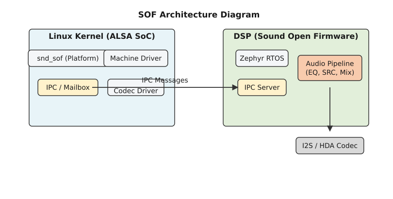
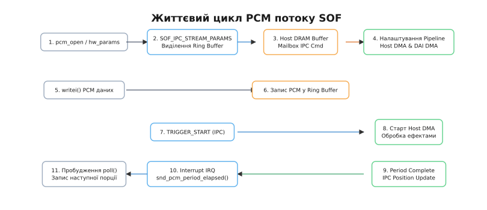

# Аудіоплатформа Sound Open Firmware (SOF) та ALSA SoC

<preknowlist>
- [Символьні та блочні пристрої](topic:unix-linux/character-and-block-devices) — системні виклики `ioctl`, файлові операції VFS та взаємодія драйверів з простіром користувача.
- [Прямий доступ до пам'яті (DMA)](topic:unix-linux/dma-and-buffers) — кільцеві буфери, когерентна пам'ять та апаратні переривання обробки періодів.
- [Опис апаратури через Device Tree](topic:unix-linux/device-tree) — представлення платформних пристроїв, вузли DAI та конфігурація звукових шин у вбудованих системах.
</preknowlist>

Сучасні ноутбуки та мобільні платформи на базі процесів Intel Tiger Lake, Meteor Lake або NXP i.MX8M стикаються з жорсткими вимогами до обробки звуку: стереопотоки високої чіткості (48 kHz або 96 kHz з 24-бітною квантизацією) мають відтворюватися без затримок і клацань, навіть якщо центральний процесор (CPU) перебуває у глибоких станах енергозбереження (C-states). Виконання обробки звуку — від банального регулювання гучності та еквалізації до ехоподавлення (AEC) та розпізнавання голосу — безпосередньо на ядрах CPU викликає постійні переривання сну, що призводить до прискореного розряду батареї або опущень PCM-буферів (buffer underrun).

Для вирішення цієї проблеми до складу багатьох систем на кристалі (SoC) було додано апаратні цифрові сигнальні процесори (Audio DSP). Проте тривалий час вендори постачали прошивку для цих DSP у вигляді закритих бінарних блобів із власницькими драйверами ядра. Будь-який збій у закритому коді спричиняв зависання аудіопідсистеми без можливості діагностики. Аудіоплатформа **Sound Open Firmware (SOF)** разом із підсистемою ядра **ALSA SoC (ASoC)** виправляє цей дефект, надаючи повністю відкриту RTOS для DSP, стандартизований драйвер ядра Linux та відкритий інструментарій топології.

## 1. Архітектура ALSA System on Chip (ASoC) та Dynamic PCM (DPCM)

Класична підсистема ядра ALSA розроблялася з розрахунку на комп'ютерні аудіокарти PCI та USB, де аудіокодек (ЦАП/АЦП) та системний інтерфейс перебували на одній платі з жорсткою конфігурацією. У мобільних та вбудованих SoC-системах ситуація відмінна: цифровий аудіоінтерфейс (DAI) інтегровано у процесор, тоді як аналоговий кодек є окремою мікросхемою, причому той самий процесор може з'єднуватися з різними кодеками у різних моделях пристроїв.

Для розчеплення залежностей ASoC розділяє аудіодрайвер на три незалежні модулі:

1. **Machine Driver (Драйвер плати)**: описує безпосереднє з'єднання між процесором та кодеком на конкретній материнській платі (наприклад, "DAI I2S0 процесора підключено до DAI кодека Realtek ALC5682"). Він також містить логіку виявлення підключення навушників (jack detection) та управління зовнішніми підсилювачами живлення.
2. **Platform Driver (Драйвер SoC)**: керує апаратними ресурсами всередині процесора — налаштуванням DMA-контролерів для передачі даних із RAM, регістрами цифрових інтерфейсів та роботою з вбудованим аудіо-DSP.
3. **Codec Driver (Драйвер кодека)**: керує регістрами зовнішньої мікросхеми кодека (підсилювачі, мультиплексори, зміщення постійної складової, управління ЦАП/АЦП).

Детальний процес еволюції від класичного ALSA до відкритих прошивок висвітлює [Історія еволюції аудіо-DSP в Linux](topic:unix-linux/sound-open-firmware-sof/hist-sof.md).

### Цифрові аудіоінтерфейси (DAI) та узгодження шин

Зв'язок між SoC та зовнішнім кодеком здійснюється через цифрові аудіоінтерфейси (DAI). ASoC підтримує декілька фізичних протоколів:

- **I2S (Inter-IC Sound)**: трипровідна шина (BCLK — часовий сигнал бітів, LRCLK — вибір лівого/правого каналу, SDIN/SDOUT — серійні дані). Використовується в більшості ARM SoC.
- **PCM / DSP Mode**: аналогічний I2S, але підтримує більше двох каналів (TDM — Time Division Multiplexing) на одній лінії даних.
- **SoundWire (MIPI Alliance)**: сучасна двопровідна шина для мобільних систем, яка об'єднує аудіодані, регістри управління та переривання на єдиній паралельній лінії.
- **Intel High Definition Audio (HDA)**: стандартизована шина Intel для ПК, що використовує лінк із частотою 24 MHz для передачі багатоканального звуку.

ASoC забезпечує узгодження параметрів між Platform DAI та Codec DAI під час налаштування потоку (виклик `hw_params`). Драйвер перевіряє, щоб обидва боки підтримували однакову частоту дискретизації, розрядність та підтяжку часових сигналів (Master/Slave clocking).

### Роль Dynamic PCM (DPCM) та зв'язування FE/BE

З появою вбудованих DSP традиційне пряме з'єднання "PCM-пристрій -> hardware DAI" виявилося недостатнім. Обробка звуку вимагає складної маршрутизації: аудіопотік від медіаплеєра має проходити через еквалайзер, потік від телефонного дзвінка — через алгоритм ехоподавлення, а системні сповіщення — змішуватися з ними безперервно.

Для цього ASoC застосовує концепцію **Dynamic PCM (DPCM)**, яка розбиває шлях аудіо на дві частині:

- **Front-End (FE)**: віртуальні PCM-пристрої (`/dev/snd/pcmC0D0p`), які бачать програми користувацького простору (PipeWire, PulseAudio). FE пов'язані із системною оперативною пам'ятяттю (DRAM) та обслуговують системні виклики `writei()` або `readi()`.
- **Back-End (BE)**: фізичні цифрові аудіоінтерфейси (I2S, PCM, SoundWire, HDA), підключені до зовнішнього кодека.

DPCM дозволяє динамічно комутувати будь-який FE-пристрій із будь-яким BE-інтерфейсом через граф обробки всередині DSP. Драйвер SOF виступає як Platform-драйвер ASoC, який транслює конфігурацію DPCM у внутрішній граф обробки сигналів на DSP.

Під час переключення режимів відтворення (наприклад, під час виходу навушників із роз'єму) DPCM може динамічно відключити один Back-End (скажімо, шину I2S кодека навушників) та підключити інший Back-End (наприклад, шину SoundWire динаміків) без зупинки або перезапуску Front-End PCM-потоку у користувацькому просторі.

Управління живленням у DPCM здійснюється через механізм **DAPM (Dynamic Audio Power Management)**. DAPM автоматично вимикає живлення неохоплених вузлів графа (неактивні підсилювачі, не використовувані генератори частоти BCLK), коли відповідний маршрут FE -> BE не провадить аудіодані.

## 2. Архітектура Sound Open Firmware (SOF) та Zephyr RTOS

Проект **Sound Open Firmware** охоплює два ключові компоненти: відкриту прошивку реального часу, яка виконується безпосередньо на аудіо-DSP (архітектури Tensilica Xtensa, RISC-V або ARM), та уніфікований драйвер ядра Linux (`snd_sof`).

Внутрішня ОС прошивки SOF побудована на базі **Zephyr RTOS**. Це надає прошивці повноцінну систему квантування часу, синхронізацію примітивами (м'ютекси, семафори), управління пам'яттю та уніфікований шар абстракції драйверів (HAL) для різних мікроархітектур DSP.

```
+-------------------------------------------------------------------------+
|                          Користувацький простір                         |
|           PipeWire / PulseAudio / ALSA-lib / alsatplg                   |
+-------------------------------------------------------------------------+
                                    |
            Системні виклики ioctl / VFS device nodes
                                    v
+-------------------------------------------------------------------------+
|                         Ядро Linux (ALSA SoC)                           |
|  +------------------------+  +---------------------------------------+  |
|  |   ASoC DPCM (FE / BE)  |  |           snd_sof Core                |  |
|  |  & ALSA Core Control   |  |   Topology Parser & IPC Dispatcher    |  |
|  +------------------------+  +---------------------------------------+  |
|                                                  |                      |
|                                    snd_sof_dsp_ops                      |
+-------------------------------------------------------------------------+
                                    |
                    PCIe / MMIO SRAM Mailbox & Doorbell IRQ
                                    v
+-------------------------------------------------------------------------+
|                     Audio DSP (Sound Open Firmware)                     |
|  +------------------------+  +---------------------------------------+  |
|  |    Zephyr RTOS Core    |  |               IPC Server              |  |
|  |  Scheduler & Memory    |  |        Message Queue Handler          |  |
|  +------------------------+  +---------------------------------------+  |
|                                                  |                      |
|                         Audio Pipeline Components                       |
|           (Host DMA -> Volume/PGA -> EQ -> SRC -> Mixer -> DAI DMA)     |
+-------------------------------------------------------------------------+
                                    |
                         Фізичні шини I2S / SoundWire / HDA
                                    v
+-------------------------------------------------------------------------+
|                  Зовнішній аудіокодек (Hardware Codec)                  |
+-------------------------------------------------------------------------+
```


*Архітектура Sound Open Firmware у ядрі Linux та зв'язок з ASoC і DSP.*

### Модель виконання задач у Zephyr RTOS

Під час старту DSP ядра Zephyr RTOS ініціалізують вектор переривань та створюють декілька фундаментальних ниток (threads):

1. **IPC Server Thread**: нитка з високим пріоритетом, яка очікує на апаратні переривання Doorbell від Host CPU. Вона розпаковує IPC-повідомлення з Mailbox SRAM та викликає відповідні обробники створення або керування пайплайнами.
2. **Scheduler Thread (LL Task)**: нитка квантування часу з жорсткими часовими обмеженнями (real-time). Вона активується таймером або апаратним перериванням DMA кожні 1–2 мілісекунди.
3. **Background Worker Thread (DP Task)**: фонова нитка для обчислювально важких завдань, що не вимагають мікросекундної точності.

Память у прошивці SOF ділиться на статочний пуфер (для тексту коду та векторів переривань) та динамічну купу (Heap), якою керує менеджер пам'яті Zephyr (`k_malloc()`). Буфери аудіосемплів виділяються у спеціальній пам'яті L2 SRAM DSP, щоб уникнути звернень до повільної зовнішньої DRAM під час обробки аудіокадрів.

### Графи та компоненти обробки (Pipelines)

Аудіодані всередині DSP обробляються у вигляді орієнтованих графів — **пайплайнів (pipelines)**. Пайплайн складається з послідовно з'єднаних компонентів:

1. **Host DMA Component**: читає буфери PCM-даних із системної оперативної пам'яті Host CPU через DMA.
2. **Volume / PGA (Programmable Gain Amplifier)**: виконує цифрове масштабування амплітуди семплів та плавне наростання/загасання гучності (ramping).
3. **SRC (Sample Rate Converter)**: здійснює високоефективну передискретизацію частоти (наприклад, з 44.1 kHz у 48 kHz).
4. **Equalizer (FIR/IIR)**: застосовує цифрові фільтри для корекції амплітудно-частотної характеристики системних динаміків.
5. **Mixer Component**: підсумовує декілька аудіопотоків від різних FE-пристроїв.
6. **DAI DMA Component**: записує оброблені семпли в FIFO-регістри фізичного аудіоінтерфейсу (I2S, SoundWire).

В прошивці SOF задачі обробки розділяються за вимогами до затримок. Планувальник Zephyr RTOS підтримує нитки **Low Latency (LL)**, які викликаються апаратними перериваннями DMA кожні 1–2 мілісекунди для забезпечення безперервного потоку, та нитки **Data Processing (DP)**, які виконують обчислювально важкі алгоритми (наприклад, формування променя мікрофонної решітки або приглушення шуму нейромережами) у фоновому режимі.

## 3. Драйвер ядра Linux (`snd_sof`) та абстракція `snd_sof_dsp_ops`

Драйвер SOF у ядрі Linux розворушується як Platform-драйвер у підсистемі ASoC і розташовується в директорії ядра `sound/soc/sof/`. Його завданнями є завантаження бінарного образу прошивки на DSP, розпакування топології аудіографа, обробка міжпроцесного зв'язку (IPC) та обслуговування PCM-потоків.

Головною структурою даних, яка представляє екземпляр SOF-контролера в ядрі, є `struct snd_sof_dev` (визначена у `sound/soc/sof/sof-priv.h`):

```c
struct snd_sof_dev {
    struct device *dev;
    spinlock_t ipc_lock;
    struct snd_sof_ipc *ipc;
    
    /* Опис апаратних областей MMIO */
    void __iomem *bar[SOF_MAX_MMIO_BAR_COUNT];
    struct snd_dma_buffer fw_state_buffer;
    
    enum snd_sof_fw_state fw_state;
    struct snd_soc_component *component;
    
    /* Таблиця апаратно-залежних callback-функцій */
    const struct snd_sof_dsp_ops *ops;
    
    /* Контекст топології та підсистеми живлення */
    struct list_head pcm_list;
    struct list_head kcontrol_list;
    struct list_head widget_list;
};
```

Оскільки апаратні реалізації DSP відрізняються у вендорів (Intel HDA DSP, NXP i.MX8 DSP, MediaTek DSP), ядро Linux абстрагує специфіку платформи через таблицю віртуальних функцій `struct snd_sof_dsp_ops`:

```c
struct snd_sof_dsp_ops {
    int (*run)(struct snd_sof_dev *sdev);
    int (*reset)(struct snd_sof_dev *sdev);
    int (*load_firmware)(struct snd_sof_dev *sdev);
    
    /* Функції обслуговування поштової скриньки IPC */
    int (*send_msg)(struct snd_sof_dev *sdev, struct snd_sof_ipc_msg *msg);
    ipc_irq_handler_t irq_handler;
    
    /* Управління регістрами DMA та Boot */
    int (*block_read)(struct snd_sof_dev *sdev, u32 bar, u32 offset, void *dest, size_t size);
    int (*block_write)(struct snd_sof_dev *sdev, u32 bar, u32 offset, void *src, size_t size);
};
```

Під час ініціалізації пристрою (наприклад, на шині PCIe або ACPI) відповідний платформний модуль (наприклад, `snd-sof-pci-intel-tgl` або `snd-sof-of-imx8m`) реєструє екземпляр `snd_sof_dsp_ops`. Це дозволяє ядру виконувати завантаження прошивки та ініціалізацію IPC без знання специфіки конкретного кремнію.

### Механізм передачі IPC-повідомлень у драйвері ядра

Для надсилання команд драйвер ядра використовує функцію `sof_ipc_tx_message()`. Цей виклик є синхронним з точки зору викликаючого потоку:

1. Драйвер захоплює блокування `sdev->ipc_lock`.
2. Записує байтовий заголовок і корисне навантаження у регістр або пам'ять Mailbox SRAM через `ops->block_write()`.
3. Спеціальним викликом `ops->send_msg()` дзвонить у регістр Doorbell.
4. Потік ядра засинає на черзі очікування `wait_event_timeout()` з таймаутом у 500 мілісекунд.
5. При надходженні апаратного переривання від DSP обробник `ops->irq_handler()` зчитує відповідь з Mailbox, розбуджує заснулий потік та повертає код статусу.

### ALSA Topology Framework та аналіз вендорних кортежів

Топологія аудіографів (які компоненти підключені, їх параметри, регістри управління гучністю) відрізняється для кожної моделі ноутбука чи плати. Щоб уникнути жорсткого кодування графа в C-коді драйвера, SOF використовує **ALSA Topology Framework**.

Під час завантаження пристрою драйвер запитує бінарний файл топології (наприклад, `sof-tgl-max98357a-rt5682.tplg`) з користувацького простору через системний виклик ядра `request_firmware()`. Драйвер аналізує бінарний образ `.tplg` та виконує дві дії:

1. **Реєстрація у ядрі**: створює віджети ASoC DAPM (Dynamic Audio Power Management) та елементи управління ALSA Mixer (які бачить `alsamixer`).
2. **Конфігурація DSP**: витягує з файлу топології "приватні вендорні кортежі" (vendor tuples) і надсилає їх у вигляді IPC-команд на DSP, наказуючи прошивці створити необхідні вузли пайплайна у пам'яті Zephyr RTOS.

Функція ядра `sof_parse_tokens()` розшифровує бінарні токени з файлу `.tplg`:

- `SOF_TPLG_KBOX_PIPELINE_ID` -> задає ідентифікатор графа та викликає `sof_ipc_pipeline_new()`.
- `SOF_TPLG_KBOX_COMP_TYPE` -> визначає тип вузла (Volume, SRC, Mixer) і викликає `sof_ipc_comp_new()`.
- `SOF_TPLG_KBOX_BUFFER_SIZE` -> виділяє внутрішні кільцеві буфери між вузлами в SRAM DSP.

Дворазові структури IPC-команд, заголовки повідомлень та формати вендорних кортежів детально висвітлені у [Специфікація IPC протоколу та топології](topic:unix-linux/sound-open-firmware-sof/api-ipc.md).

## 4. Життєвий цикл аудіопотоку (PCM) у SOF

Розглянемо послідовність дій, яка відбувається під час запуску відтворення звуку програмою у користувацькому просторі.

```
Userspace (ALSA)         snd_sof (Kernel)            Mailbox / DRAM           SOF DSP (Zephyr)
       |                        |                           |                        |
       |--- 1. pcm_open ------->|                           |                        |
       |    hw_params           |                           |                        |
       |                        |--- 2. STREAM_PARAMS ----->|                        |
       |                        |    Alloc Ring Buffer      |--- 3. IPC Cmd -------->|
       |                        |                           |                        |--- 4. Setup Pipeline ->
       |                        |                           |                        |    Host & DAI DMA
       |                        |<-- 5. ACK IPC ------------|<-- Response -----------|
       |                        |                           |                        |
       |--- 6. writei(samples)->|                           |                        |
       |                        |--- 7. Copy to DRAM ------>|                        |
       |                        |                           |                        |
       |                        |--- 8. TRIGGER_START ----->|--- 9. IPC Start ------>|
       |                        |                           |                        |--- 10. Start Host DMA ->
       |                        |                           |                        |    Process Audio
       |                        |                           |<-- 11. Period IPC -----|
       |<-- 12. poll wakeup ----|<-- Period Elapsed IRQ ----|   Position Update      |
```


*Життєвий цикл аудіопотоку: від виклику userspace до обробки у Zephyr RTOS.*

Послідовність кроків управління потоком:

1. **Відкриття пристрою (Open)**:
   Програма відкриває пристрій ALSA (наприклад, через `snd_pcm_open()`). Драйвер SOF ініціалізує структуру `struct snd_sof_pcm` та закріплює за потоком відповідний Front-End (FE) пристрій DPCM.

2. **Налаштування параметрів (hw_params)**:
   Програма передає частоту дискретизації, кількість каналів та формат семплів. Драйвер ядра виділяє фізично неперервний когерентний кільцевий буфер (Ring Buffer) у системній оперативній пам'яті (Host DRAM) за допомогою функцій DMA API ядра (`dma_alloc_coherent()`).
   Після цього драйвер формує IPC-повідомлення `SOF_IPC_STREAM_PCM_PARAMS` і записує його у Mailbox SRAM пристрою, сповіщаючи DSP про адресу та розмір виділеного DRAM-буфера.

3. **Запуск потоку (trigger START)**:
   При виклику `snd_pcm_start()` або досягненні порога заповнення буфера драйвер надсилає IPC-команду `SOF_IPC_STREAM_TRIG_START`. DSP ініціалізує Host DMA контролер для зчитування даних із DRAM-буфера і запускає ланцюжок обробки в Zephyr RTOS.

4. **Обслуговування періодів (Period Elapsed Interruption)**:
   Поки Host DMA перекачує аудіодані з системної пам'яті у локальну SRAM пам'ять DSP, прошивка SOF регулярно відстежує кількість оброблених кадрів. При досягненні межі періоду (period boundary) DSP надсилає зворотне IPC-повідомлення `SOF_IPC_STREAM_POSITION` або ініціює апаратне переривання Doorbell.
   Обробник переривання у драйвері ядра викликає ALSA-функцію `snd_pcm_period_elapsed()`, яка розблоковує потоки користувацького простору, що очікували в системному виклику `poll()` або `select()`, дозволяючи їм записати наступну порцію аудіоданих.

Для забезпечення узгодженості даних між Host CPU та DSP DMA у коді викликів `hw_params` та `pointer` застосовуються бар'єри пам'яті `smp_wmb()` та `smp_rmb()`. Це запобігає ситуації, коли Host CPU оновив індекс запису `host_ptr`, але через затримки кеш-ліній CPU DSP прочитав застарілі індекси й виконав повторне відтворення старого періоду (audio stuttering).

Практичну емуляцію цього життєвого циклу та код обміну IPC наведено у [Емуляція IPC та PCM потоку](topic:unix-linux/sound-open-firmware-sof/proj-pcm-stream.md).

## 5. Енергозбереження та стани живлення (D0i3 та Dynamic Power Gating)

Однією з головних переваг перенесення обробки звуку на DSP є ефективне управління живленням аудіопідсистеми. Підсистема `snd_sof` інтегрована з фреймворком `pm_runtime` ядра Linux і підтримує такі стани живлення:

- **D0 (Full Active)**: DSP працює на максимальній частоті, Host DMA перекачує аудіодані, усі блоки L2 SRAM та шини DAI підключені до джерела живлення.
- **D0i3 (Low Power Active)**: спеціальний стан низького споживання для відтворення аудіо у фоновому режимі (Low Power Audio Playback). У цьому стані основні ядра CPU переведені в режим сну C7/C10, інтерфейс PCIe переведено у L1.1/L1.2, а DSP працює на зниженій частоті лише з необхідними блоками SRAM, які зберігають контекст прошивки.
- **D3hot / D3cold (Full Power Gate)**: коли всі PCM-потоки закриті і не виконуються задачі розпізнавання голосу, підсистема `pm_runtime` відключає подачу живлення на DSP та шини DAI.

Перехід між станами здійснюється автоматично через системні виклики `pm_runtime_get_sync()` під час створення нового потоку та `pm_runtime_put_autosuspend()` після закриття останнього PCM-пристрою.

## 6. Діагностика, простеження (Tracing) та аварійне відновлення

На відміну від закритих бінарних прошивок, Sound Open Firmware надає розширену інфраструктуру для трасування та діагностики роботи DSP в режимі реального часу.

### Інспектування через debugfs

Після завантаження драйвера `snd_sof` у файловій системі `debugfs` створюється деревина діагностичних вузлів за шляхом `/sys/kernel/debug/sof/`:

- `/sys/kernel/debug/sof/sof-log`: кільцевий буфер системних повідомлень прошивки (dmesg прошивки SOF). Спеціальна утиліта `sof-logger` читає цей бінарний файл у реальному часі та декодує повідомлення прошивки за допомогою бази текстових рядків, витягнутих з файла ELF-образу прошивки.
- `/sys/kernel/debug/sof/ipc_trace`: журнал останніх надісланих та отриманих IPC-повідомлень із точними часовими мітками.
- `/sys/kernel/debug/sof/pipeline_state`: дамп поточного стану активних графових компонентів (запущені, зупинені, переповнення буфера).
- `/sys/kernel/debug/sof/box_dump`: дамп вмісту Mailbox SRAM пам'яті на момент останньої помилки.

> 🔧 **Навіщо це.**
> Під час виникнення клацань чи затримок звуку (audio glitches) за допомогою утиліти `sof-trace` розробник може точно визначити причину: чи це Host CPU не встиг заповнити DRAM-буфер (underrun на боці ядра), чи це нитка Zephyr RTOS на DSP пропустила свій квант часу через вищий пріоритет іншого завдання.

### Крайові випадки та обробка помилок (Firmware Panic & Recovery)

В апаратних системах можливі критичні збої у коді DSP: звернення за невалідними адресами пам'яті, зациклення або помилки апаратних шин. SOF реалізує багаторівневий механізм виявлення та відновлення після помилок:

1. **DSP Watchdog Timeout**:
   У прошивці SOF працює апаратний або програмний таймер watchdog. Якщо планувальник Zephyr RTOS не скидає таймер упродовж заданого інтервалу (наприклад, 500 мс), DSP генерує фатальне переривання на Host CPU.
   Драйвер `snd_sof` перехоплює це переривання, зчитує регістр паніки DSP (`DSP Panic Register`) і зберігає дамп стек-фрейму в `/sys/kernel/debug/sof/panic_dump`.

2. **IPC Timeout**:
   Коли драйвер ядра надсилає IPC-повідомлення, він запускає таймер очікування відповіді (зазвичай 500 мс). Якщо DSP не відповідає (не скидає біт у регістрі Doorbell), драйвер ядра фіксує IPC Timeout.

3. **Автоматичне відновлення (DSP Reset & Recovery)**:
   При виявленні паніки або таймауту IPC драйвер `snd_sof` не аварійно вимикає аудіосистему. Замість цього він ініціює процедуру відновлення:
   - Переводить DSP в стан апаратного скидання (DSP Reset) через callback `ops->reset()`.
   - Повторно завантажує бінарний образ прошивки в SRAM DSP через `ops->load_firmware()`.
   - Реконструює граф топології, повертаючи активні PCM-потоки у стан, що передував аварії, і відновлює відтворення звуку.

Завдяки такій архітектурі SOF досягає високої надійності в корпоративних та споживчих Linux-системах, поєднуючи продуктивність апаратних сигнальних процесорів із відкритістю та діагностованістю ядра Linux.
