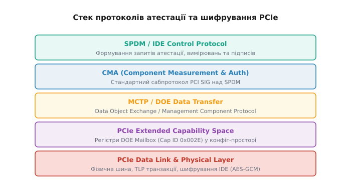
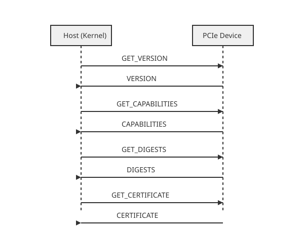
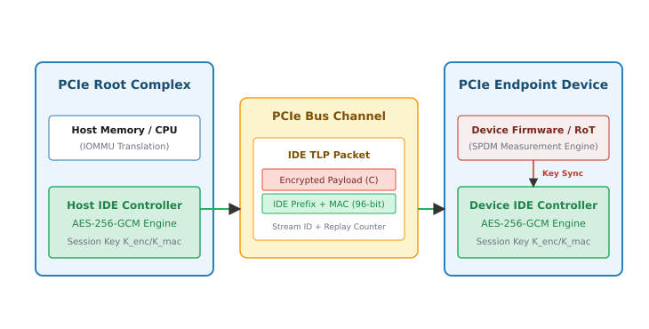

# Протокол атестації пристроїв SPDM на шинах PCIe

<preknowlist>
- [Підсистема PCIe у Linux](book:unix-linux/pcie-express-bus-subsystem) — конфігураційні простори, TLP та розширені можливості (Extended Capabilities).
- [Механізм DMA та IOMMU](book:unix-linux/dma-mapping-subsystem-and-iommu) — прямий доступ периферії до пам'яті та трансляція адрес I/O.
- [Конфіденційні обчислення SEV/TDX](book:unix-linux/confidential-computing-sev-tdx) — захист пам'яті віртуальних машин та вимірювальне середовище виконання.
</preknowlist>

Коли периферійний пристрій підключається до шини PCI Express, він отримує прямий допуск до системної шини та фізичної оперативної пам'яті через транзакції прямого доступу (Direct Memory Access, DMA). Якщо мікрокод мережевої карти, NVMe-накопичувача або графічного прискорювача піддається модифікації зловмисником чи підміняється на етапі виробництва, цей пристрій отримує можливість читати довільні регіони RAM, вилучати криптографічні ключі ядра або модифікувати структури даних процедури завантаження. Механізми ізоляції адрес IOMMU не вирішують цю проблему самостійно, оскільки вони оперують виключно адресами пристроїв і не перевіряють автентичність прошивки та відсутність фізичних маніпуляцій над апаратним забезпеченням. Для подолання цієї прогалини створено протокол Security Protocol and Data Model (SPDM) у поєднанні з апаратним шифруванням PCIe IDE.

## 1. Загрози периферійного периметра та межі IOMMU

Сучасна архітектура безпеки обчислювальних систем будується навколо суворого розмежування привілеїв: ядро захищає свій адресний простір від користувацьких процесів за допомогою сторінкової адресації MMU, а апаратний блок IOMMU транслює та обмежує DMA-запити від периферійних пристроїв PCIe. Проте безпека IOMMU спирається на два критичні припущення, які у реальних умовах часто виявляються хибними:
1. Пристрій, що видає себе за певний PCI BDF (Bus:Device:Function), є саме тим пристроєм, виробленим довіреним вендором.
2. Мікрокод (Firmware), завантажений у внутрішню пам'ять контролера пристрою, є цілісним і не містить бекдорів чи модифікацій.

Якщо зловмисник підключає підроблений пристрій (Rogue PCIe Device) або виконує атаки типу PCILeech за допомогою FPGA-плат, такий пристрій може підробляти ідентифікатори Vendor ID та Device ID. З точки зору ядра Linux та таблиць IOMMU, пристрій виглядає як стандартний мережевий адаптер Intel або Mellanox. Пристрою виділяється відповідний DMA-буфер. Проте скомпрометована прошивка може генерувати транзакції TLP (Transaction Layer Packets), спрямовані за межі наданого буфера, або виконувати атаки на перехоплення ключів до ініціалізації правил IOMMU під час завантаження ОС (Early Boot Phase).

Додатково виникає загроза фізичного втручання в канал зв'язку (Interposer Attack). Навіть якщо сам пристрій є абсолютно довіреним, зловмисник із фізичним доступом до сервера може підключити апаратний аналізатор між PCIe-слотом та платою. Такий аналізатор здатний підглядати незахищений трафік шини або підміняти пакети даних безпосередньо у мідних доріжках.

Для криптографічного доведення автентичності пристрою та перевірки його прошивки до моменту виділення DMA-ресурсів консорціум DMTF у співпраці з PCI-SIG розробив стандарт SPDM. Детальний аналіз передумов створення стандарту та еволюції загроз на шинах вводу-виводу наведено в [історичному екскурсі про стандартизацію SPDM](book:unix-linux/spdm-device-attestation/hist-spdm-genesis.md).

## 2. Архітектура протоколу SPDM

Security Protocol and Data Model (SPDM) — це криптографічний протокол второго та третього рівнів за класифікацією DMTF, що працює за архітектурою Запит-Відповідь (Request-Response). У системі завжди визначені дві криптографічні ролі:
- **Requestor (Запитувач)**: Елемент системи, що ініціалізує атестацію та перевіряє довіру. У контексті Linux ролем Requestor виступає ядро операційної системи (підсистема PCI та `libspdm`).
- **Responder (Відповідач)**: Периферійний пристрій PCIe, що містить апаратний корінь довіри (Device Root of Trust, RoT), криптографічний контролер та захищене сховище приватного ключа.


*Багатошарова архітектура з механізмом з'єднання: від розширеної можливості DOE у конфігураційному просторі PCIe до рівнів CMA, SPDM та апаратного шифрування IDE.*

Стандарт SPDM визначає чітку послідовність криптографічних фаз, кожна з яких базується на результатах попередньої.

### Фаза 1: Узгодження можливостей та алгоритмів (Discovery & Negotiation)

Під час первинного виявлення пристрою хост надсилає повідомлення `GET_VERSION`. У відповідь пристрій повертає список підтримуваних версій специфікації SPDM (наприклад, 1.0, 1.1, 1.2, 1.3). Хост обирає найвищу спільну версію та надсилає команду `GET_CAPABILITIES`.

Під час обміну `CAPABILITIES` сторони узгоджують такі параметри:
- Підтримка атестації вимірювань (`CERT_CAP`, `MEAS_CAP`).
- Підтримка асиметричного підпису та генерації рукостискання (`CHAL_CAP`).
- Підтримка сесійного шифрування та обміну ключами (`KEY_EX_CAP`, `ENCRYPT_CAP`, `MAC_CAP`).
- Максимальний розмір бінарного кадру (Response/Request Buffer Size).

На етапі `NEGOTIATE_ALGORITHMS` хост та пристрій обирають конкретні апаратні алгоритми:
- **Base Asym Alg**: Алгоритм асиметричного підпису (ECDSA з кривими P-256/P-384/P-521 або RSA-3048/4096).
- **Base Hash Algo**: Криптографічний хеш для вимірювань та ланцюжків (SHA-256, SHA-384, SHA-512 або SHA3).
- **DHE / AEAD Algo**: Алгоритми еліптичного Diffie-Hellman (SECP384R1, x25519) та симетричного шифрування (AES-256-GCM, ChaCha20-Poly1305) для подальшої сесії.

Якщо пристрій зустрічає помилку у форматі запиту або не підтримує запитаний алгоритм, він повертає спеціальне повідомлення `ERROR` з кодом помилки (наприклад, `0x01 InvalidRequest`, `0x03 UnexpectedRequest` або `0x05 DecryptError`). Обробник ядра аналізує цей код і скасовує сесію.

### Фаза 2: Автентифікація ідентичності та сертифікати (Certificate & Identity)

Після узгодження криптографічних параметрів хост вилучає дайджести сертифікатів за допомогою `GET_DIGESTS`. Пристрій може містити до 8 слотів сертифікатів (`Slot 0` .. `Slot 7`). Хост обирає цільовий слот та надсилає серію запитів `GET_CERTIFICATE` для завантаження повного ланцюжка сертифікатів X.509 ASN.1.

Ланцюжок містить:
1. **Root Certificate (Корневий сертифікат)**: Підписаний центральним органом сертифікації вендора (Vendor Root CA).
2. **Intermediate Certificates (Проміжні сертифікати)**: Сертифікати заводу-виробника або лінійки продуктів.
3. **Device Leaf Certificate (Кінцевий сертифікат пристрою)**: Сертифікат, прив'язаний до унікального серійного номера або селектора сертифіката конкретного чіпа (Device Identity).

Ядро Linux перевіряє отриманий ланцюжок на відповідність публічним кореневим сертифікатам, що імпортовані у системний keyring ядра (`system_keyring`). Перевірка включає аналіз терміну дії сертифіката, відповідність політик призначення ключа (Key Usage / Extended Key Usage) та перевірку списків відкликання CRL або OCSP. Якщо ланцюжок не підтверджується довіреним коренем, ініціалізація пристрою зупиняється.

### Фаза 3: Виклик-Відповідь та вимірювання прошивки (Challenge & Measurements)

Для доведення того, що пристрій не просто надав чужий публічний сертифікат, а справді володіє відповідним приватним ключем, хост надсилає команду `CHALLENGE` із випадковим 32-байтним одноразовим числом (Nonce). Пристрій вираховує хеш від об'єднаних контекстів узгодження, додає Nonce, підписує отриманий масив своїм приватним ключем і повертає відповідь `CHALLENGE_AUTH`. Хост перевіряє підпис за допомогою раніше завантаженого публічного ключа з кінцевого сертифіката.


*Детальна послідовність обміну повідомленнями SPDM між хостом (Requestor) та периферійним пристроєм (Responder) через поштовий ящик DOE.*

Наступним кроком є вилучення криптографічних вимірювань за допомогою `GET_MEASUREMENTS`. Пристрій зчитує з внутрішніх регістрів безпеки (Security Registers / PCRs) хеші всіх виконаних модулів прошивки, конфігураційних таблиць та параметрів мікрокоду.

Повідомлення `MEASUREMENTS` повертає:
- Індекс вимірювання (Measurement Index 1..N).
- Тип вимірювання (Raw Bitstream, Digest, ASCII Manifest).
- Криптографічний хеш блоку прошивки.
- Цифровий підпис ECDSA/RSA над усім блоком вимірювань та Nonce хоста.

Хост зіставляє отримані хеші з еталонними значеннями маніфесту цілісності (Reference Integrity Manifest, RIM), наявними в системі. Якщо хоча б один біт прошивки пристрою був підроблений, хеш виявляється недійсним, і атестація вважається проваленою.

Структура маніфесту цілісності RIM будується за специфікаціями TCG (Trusted Computing Group) та IETF CoRIM (Concise Software Identification / CBOR Object Reference Integrity Manifest). RIM містить офіційно підписану декларацію від виробника обладнання, де для кожного індексу вимірювання (Measurement Block) вказано точний криптографічний хеш (SHA-384 або SHA-512), припустимі версії мікрокоду та допустимі конфігураційні біти ревізії кремнію. Ядро Linux виконує перевірку цифрового підпису самого маніфесту RIM за допомогою ключів безпечного завантаження перед тим, як порівнювати хеші пристрою з еталонними значеннями RIM.

## 3. Транспортний шар PCIe: DOE та CMA

Протокол SPDM є транспортно-незалежним, тобто його бінарні пакети можуть передаватися через будь-яку шину (I2C, SMBus, MCTP). Проте для прямої взаємодії ядра Linux із пристроями на шині PCI Express консорціум PCI-SIG стандартизував апаратний шар **Data Object Exchange (DOE)** та профіль **Component Measurement and Authentication (CMA)**.

### Розширена можливість Data Object Exchange (DOE)

DOE надає стандартний поштовий ящик (Mailbox) безпосередньо у розширеному конфігураційному просторі пристрою (PCI Express Extended Capability Space, Capability ID `0x002E`). Це гарантує, що ядро може виконувати атестацію пристрою до того, як для пристрою будуть увімкнені BAR (Base Address Registers) і сформовані таблиці DMA.

Поштовий ящик DOE складається з чотирьох 32-бітних регістрів:
- **DOE Control Register**: Містить прапорці ініціалізації transmission (`DOE Go`), переривань (`DOE Interrupt Enable`) та примусового скидання (`DOE Abort`).
- **DOE Status Register**: Відображає готовність даних у FIFO (`DOE Data Out Ready`), стан обробки контролером (`DOE Busy`) та прапорці помилок (`DOE Error`).
- **DOE Write Data Mailbox**: 32-бітний FIFO-поштовий ящик для запису кадру хостом.
- **DOE Read Data Mailbox**: 32-бітний FIFO-поштовий ящик для зчитування кадру-відповіді.

### Формат кадру інкапсуляції CMA / SPDM

Кожне SPDM-повідомлення переноситься всередині стандартизованого кадру DOE Header та інкапсуляції CMA:

```
 31                            16 15                            0
+--------------------------------+-------------------------------+
|          Vendor ID             |         Data Object Type      | Word 0 (DOE Header)
+--------------------------------+-------------------------------+
|            Reserved            |       Length (in 32-bit DW)   | Word 1 (DOE Header)
+--------------------------------+-------------------------------+
| SPDM Version (0x11/0x12)       | Request/Response Code (0x84..) | Word 2 (CMA / SPDM)
+--------------------------------+-------------------------------+
| Param1 (Slot / Opt)            | Param2 (Index / Selector)     | Word 3 (SPDM Header)
+--------------------------------+-------------------------------+
|                      Payload (Data / Cert / Signature)         | Word 4..N
+----------------------------------------------------------------+
```

Для стандартних SPDM-повідомлень через CMA полі `Vendor ID` встановлюється у значення `0x0001` (PCI-SIG Defined), а `Data Object Type` дорівнює `0x0001` (PCI-SIG Securing Protocol / CMA).

Ядро Linux обробляє записи у поштовий ящик DOE через асинхронні черги подій. Хост записує заголовки та корисне навантаження у Write Register, встановлює прапорець `DOE Go` і очікує переривання MSI-X або опитує прапорець `DOE Data Out Ready`. Детальний опис системних атрибутів та регістрів наведено у [довіднику sysfs-інтерфейсу ядра та регістрів DOE](book:unix-linux/spdm-device-attestation/api-spdm-kernel-sysfs.md).

## 4. Реалізація SPDM у ядрі Linux

Підтримка SPDM в операційній системі Linux зорганізована в підсистемі PCI (`drivers/pci/pcie/cma.c` та `drivers/pci/doe.c`) з використанням вбудованої ядерної бібліотеки `libspdm`.

### Архітектура підсистеми атестації ядра

Коли підсистема PCI виявляє новий пристрій на шині під час сканування (PCI Bus Enumeration), вона перевіряє наявність структури DOE Extended Capability:

```
[PCI Bus Enumeration]
        │
        ▼
[PCI Device Discovered]
        │
        ├──► Does Device have DOE Ext Cap (0x002E)?
        │         │
        │         ├── NO  ──► [Standard Probe without SPDM]
        │         │
        │         └── YES ──► [Initialize pci_doe_state]
        │                           │
        │                           ▼
        │                   [Run CMA/SPDM State Machine]
        │                           │
        │                           ├──► 1. Negotiate SPDM 1.2
        │                           ├──► 2. Validate Cert Chain vs system_keyring
        │                           ├──► 3. Verify Challenge ECDSA Signature
        │                           └──► 4. Fetch & Verify Measurements vs RIM
        │                                       │
        │                                       ├── FAILED ──► [Deny Probe / Isolate IOMMU]
        │                                       │
        │                                       └── PASSED ──► [Enable Driver & Setup IDE]
```

1. **Ініціалізація DOE-структур**: Створюється об'єкт `struct pci_doe_state`, який прив'язується до конкретної апаратної адреси BDF.
2. **Запуск автомата станів SPDM**: Драйвер `cma.c` ініціює обмін повідомленнями через `libspdm`.
3. **Перевірка політики**: Результати порівнюються з налаштуваннями безпеки ядра (`pci=spdm_strict` або `pci=spdm_permissive`).
4. **Обробка результатів**:
   - При успішній атестації пристрій переводиться у стан `measurement_passed`, ядро дозволяє пробувати відповідний драйвер пристрою (наприклад, `nvme` або `ixgbe`) і налаштовує канальне шифрування PCIe IDE.
   - При невдалій атестації ядро забороняє реєстрацію пристрою, видає подібну до audit лог-подію та конфігурує IOMMU у режим повної блокування транзакцій (`drop all DMA`).

Бібліотека `libspdm`, інтегрована у ядро Linux, реалізована як ізольований модуль без зовнішніх залежностей від користувацького простору. Вона використовує внутрішній криптографічний API ядра (`crypto/hash.h`, `crypto/akcipher.h`) для виконання швидкого обчислення хешів SHA-384/SHA-512 та верифікації асиметричних підписів ECDSA на еліптичних кривих SECP384R1.

Внутрішня функція `pci_cma_authenticate()` у ядрі керує викликами `libspdm`. Вона динамічно виділяє пам'ять під буфери кадерів із прапорцями `GFP_KERNEL` (оскільки атестація виконується у контексті процесу з можливістю засинання при очікуванні переривань поштового ящика DOE). Якщо під час виконання обміну повідомленнями пристрій перериває зв'язок або виникає таймаут відповіді (>2000 мс), стан атестації позначається як `failed`, а в `dmesg` виводиться відповідне попередження підсистеми аудиту.

Практичний приклад створення власної користувацької утиліти перевірки атестації пристроїв показано у [практичній утиліті атестації мовами C та C++](book:unix-linux/spdm-device-attestation/proj-spdm-attestation-verifier.md).

## 5. Захист даних у русі: PCIe IDE (Integrity and Data Encryption)

Успішна атестація SPDM підтверджує, що прошивка пристрою не була підроблена на момент завантаження. Однак після того, як пристрій переходить у робочий режим, залишається загроза фізичного перехоплення пакетів TLP безпосередньо на мідних провідниках шини PCIe за допомогою підключених зондів чи інтерпозерів.

Для захисту даних під час передачі використовується технологія **PCIe IDE (Integrity and Data Encryption)**.


*Захист каналу зв'язку PCIe IDE: проходження TLP-пакету через AES-256-GCM шифрувальний двигун на основі ключів, отриманих під час SPDM-сесії.*

### Механізм генерації та розподілу ключів

1. **SPDM Session Key Exchange**: Після перевірки вимірювань хост і пристрій виконують фазу `KEY_EXCHANGE` в SPDM 1.2. Використовуючи алгоритм Diffie-Hellman на еліптичних кривих (ECDHE), сторони вираховують спільний секрет (Shared Secret).
2. **Деривація ключів (HKDF)**: За допомогою криптографічної функції HKDF-Expand згенерований секрет розщеплюється на два набори ключів:
   - `K_enc`: 256-бітний ключ шифрування для AES-GCM.
   - `K_mac`: 128-бітний або 96-бітний ключ перевірки цілісності та підпису пакетів.
3. **Завантаження ключів в IDE Controllers**: Отримані ключі апаратно завантажуються в IDE-контролер Root Complex (на боці CPU) та в IDE-контролер Endpoint пристрою.

### Апаратне шифрування TLP-пакетів

IDE працює на рівні Transaction Layer підсистеми PCIe. Коли хост або пристрій надсилає TLP-пакет, модуль IDE виконує такі трансформації:

- **Шифрування корисного навантаження (Payload)**: Дані TLP шифруються за допомогою симетричного алгоритму AES-256-GCM у режимі підрахунку Galois/Counter Mode.
- **Додавання IDE Prefix та MAC**: До пакета додається 32-бітний заголовок IDE Prefix (містить Stream ID та лічильник послідовності Sequence Number) і 96-бітний код автентифікації повідомлення Message Authentication Code (MAC).
- **Захист від повторення (Replay Protection)**: Кожен TLP-пакет містить монотонно зростаючий лічильник. Якщо отримувач виявляє пакет із повторюваним або застарілим Sequence Number, транзакція відкидається, а пристрій генерує переривання безпеки (PCIe IDE Error Event).

Режими розгортання IDE:
- **Link IDE**: Захищає повністю весь фізичний канал між двома сусідніми портами (наприклад, між Root Port та PCIe Switch).
- **Selective IDE**: Захищає конкретний потік даних між конкретним BDF хоста та конкретним BDF периферійного пристрою, навіть якщо транзит здійснюється через кілька міжпроміжних свічів.

В архітектурах Compute Express Link (CXL 2.0 / 3.0) технологія PCIe IDE розширюється до профілю CXL IDE, який забезпечує шифрування не лише стандартних пам'яткових TLP-пакетів (CXL.io), але й низьколатентних протоколів когерентності кешів (CXL.cache) та спільного використання оперативної пам'яті (CXL.mem). Це дозволяє будувати захищені серверні кластери, де зовнішні пули RAM залишаються захищеними від фізичного зчитування на міжпроцесорних міжз'єднаннях.

Конфіденційні обчислення (Confidential Computing) у віртуалізованих середовищах Intel TDX та AMD SEV-SNP покладаються на зашифровані канали CXL/PCIe IDE. Віртуальна машина-гость (Guest VM) отримує прямий доступ до SR-IOV Virtual Function пристрою тільки після того, як гіпервізор та ядро підтвердять атестацію SPDM пристрою і налаштують індивідуальний селективний потік Selective IDE Stream, що гарантує захист від читання пам'яті сусідніми віртуальними машинами чи сам гіпервізором.

## 6. Крайні випадки та стійкість до атак

Впровадження SPDM та PCIe IDE додає нові виклики до стабільності роботи підсистеми вводу-виводу операційної системи.

### Сценарії гарячого підключення (Hot-Plug) та скидання (FLR)

Коли пристрій виключається або перезавантажується за допомогою механізму Function Level Reset (FLR), апаратний корінь довіри пристрою скидає свої сесійні ключі SPDM. У цей момент ядро Linux зобов'язане:
1. Анулювати поточний стан `pci_doe_state` та зупинити IDE Stream.
2. Повторно запустити повний цикл атестації SPDM (`GET_VERSION` -> `GET_CERTIFICATE` -> `MEASUREMENTS`).
3. Виконати новий обмін ключами `KEY_EXCHANGE` та повторно завантажити симетричні ключі в IDE-контролери.

Якщо пристрій під час гарячого заміщення відмовляється пройти атестацію протягом заданого таймауту (за замовчуванням 2000 мс), ядро ізолює слот і відключає подачу живлення на порт PCIe Hot-Plug Controller.

### Фізична атака відключення та підміни ключів (Downgrade Attack)

Зловмисник може спробувати скомпрометувати зв'язок шляхом примусового скидання версії протоколу до SPDM 1.0 (де відсутня підтримка вимірювань прошивки та сесійного шифрування). Для захисту від цього в специфікації SPDM 1.2 введено обов'язкову перевірку транскрипту узгодження (Transcript Hash). Наприкінці обміну повідомленнями пристрій надсилає підписаний хеш усіх попередніх кадерів запитів та відповідей. Якщо зловмисник модифікував список підтримуваних версій у пакеті `VERSION`, хеш транскрипту не співпаде, і хост скасує з'єднання.

Впровадження SPDM та PCIe IDE перетворює шину PCI Express з незахищеного каналу зв'язку на криптографічно ізольоване середовище виконання, що відповідає суворим вимогам концепції Zero Trust у сучасних центрах обробки даних.
