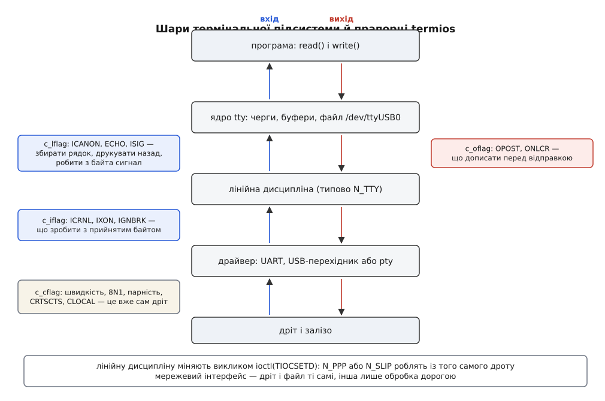
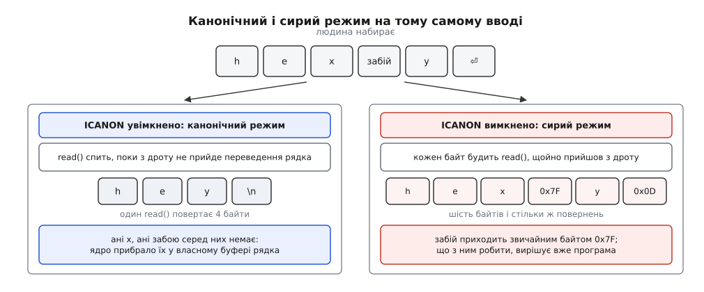
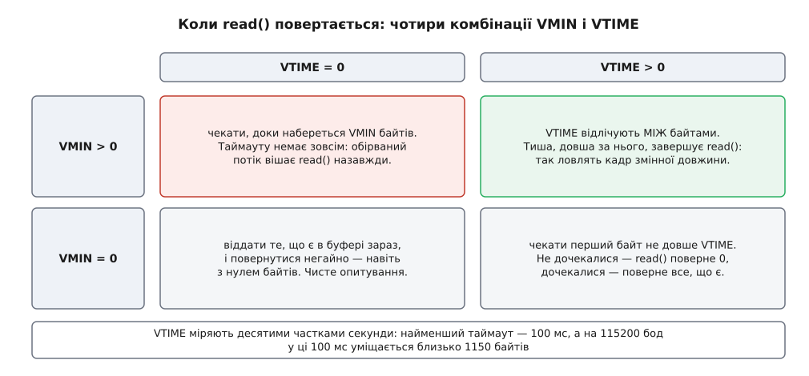

# TTY і послідовний порт: модель termios

<preknowlist>
- [Файловий дескриптор](topic:unix-linux/file-descriptor) — маленьке число, яким процес називає ядру вже відкритий об'єкт вводу-виводу.
- [«Усе є файлом»](topic:unix-linux/everything-is-a-file) — один набір викликів `open`/`read`/`write`/`close` на об'єкти геть різної природи.
- [Файл пристрою](topic:unix-linux/device-file-model) — запис у `/dev`, за яким стоїть не вміст на носії, а драйвер; символьний пристрій віддає потік байтів без поняття «позиція».
- [ioctl](topic:unix-linux/ioctl-interface) — окремий канал команд до драйвера для всього, що не вкладається в «читати» й «писати».
- [Сигнал](topic:unix-linux/signal-model) — асинхронне сповіщення від ядра процесові, у якого є типова дія (наприклад, померти).
- [Блокуючий і неблокуючий режим](topic:unix-linux/blocking-and-nonblocking) — що фізично означає «виклик чекає» і що змінює прапорець `O_NONBLOCK`.
- [Кадр UART](topic:communications/uart-frame) — стартовий біт, біти даних, необов'язкова парність і стоповий біт; поза кадром на лінії тиша.
- [Швидкість baud](topic:communications/baud-rate) — скільки символьних інтервалів лінія передає за секунду й чому обидва кінці мусять домовитися заздалегідь.
- [ASCII](topic:programming/ascii-utf8) — таблиця символів, у якій перші 32 коди не літери, а керуючі: `0x03`, `0x04`, `0x0D`, `0x1B`.
</preknowlist>

До комп'ютера під'єднали плату — через USB-перехідник, і в системі з'явився `/dev/ttyUSB0`. Далі все виглядає звично: `open`, `write`, `read`, `close`. Але цей файл поводиться так, ніби всередині нього хтось живе.

Ви записуєте байт `0x0A` — на дроті осцилограф показує два байти, `0x0D 0x0A`. Ви читаєте — і `read` не повертає нічого, хоча плата вже надіслала півсотні байтів: він чекає на переведення рядка. У двійковому потоці трапляється байт `0x13` — і зв'язок завмирає, а сам байт до вас не доходить. А все, що плата надсилає, за мить вилітає назад до неї тим самим дротом, ніби хтось посередині переказує їй її ж слова.

Жодне з цих чотирьох дивацтв не є помилкою драйвера. Усі чотири — корисна робота, яку хтось колись замовив. Просто замовляли її для випадку, коли на іншому кінці дроту не плата, а людина.

Уявіть той інший випадок. На кінці дроту стоїть друкарська машинка з клавіатурою — телетайп; вона шле по одному байту на кожну натиснуту клавішу й друкує на папері кожен байт, що приходить назад. Людина помиляється і тисне забій. Хтось мусить прибрати помилковий символ, і цей хтось — не машинка: у неї немає пам'яті, вона вміє лише слати й друкувати. Отже, редагування набраного лягає на комп'ютер. Але й не на прикладну програму: тоді кожна програма реалізовувала б забій по-своєму, а половина не реалізовувала б зовсім. Лишається ядро — і Unix поклав цю роботу саме туди.

Звідси й береться все подальше. Між дротом і вашим `read` стоїть шар обробки, який ядро вставляє в кожен такий пристрій, а `termios` — набір вимикачів над цим шаром. Розібратися з портом означає рівно одне: знати, що робить кожен вимикач і чому він там узагалі є.

## Що стоїть між дротом і read()

Термінальна підсистема ядра складається з трьох частин, і плутанина зазвичай виникає тому, що всі три звуть словом «tty».

Найнижча — **драйвер**. Він знає залізо: регістри мікросхеми UART на материнській платі, або протокол USB-перехідника, або взагалі нічого фізичного, якщо це псевдотермінал. Драйвер віддає вгору сирі байти й приймає байти вниз, а ще керує тим, що є в дроті поза байтами: швидкістю, парністю, окремими лініями керування.

Найвища — **ядро tty**: буфери, черги, файл у `/dev` і вся механіка, через яку ваш `read` засинає й прокидається.

А посередині — **лінійна дисципліна** (англ. *line discipline*), і саме вона робить усе те дивне з початку. Це змінний шар: ядро тримає їх кілька, кожна під своїм номером, і типова зветься `N_TTY` — та, що обробляє текст для людини. Викликом `ioctl(fd, TIOCSETD, &ldisc)` на тому самому дескрипторі можна поставити іншу: `N_PPP` або `N_SLIP` перетворюють потік байтів на мережевий інтерфейс ([SLIP](topic:communications/slip-protocol) — найпростіше кадрування IP-пакетів у послідовному потоці), `N_GSM` розкладає один дріт до модема на кілька логічних каналів. Дріт той самий, файл той самий — змінюється тільки те, що з байтами роблять дорогою.



*Вхідний і вихідний потоки проходять через різні набори прапорців, тому налаштування ніколи не симетричні.*

> 🔧 **Навіщо це.** Коли двійкові дані з плати приходять зіпсованими, шукати причину треба пошарово: чи це дріт (не збігається швидкість — сміття в усіх байтах), чи це лінійна дисципліна (зникають саме `0x11` і `0x13`, або кожен `0x0D` стає `0x0A`), чи це вже ваш код. Три шари — три різні набори підозрюваних, і плутати їх дорого.

## Канонічний режим: ядро збирає рядок

Головний вимикач лінійної дисципліни зветься `ICANON`, і поки він увімкнений, ядро працює не з байтами, а з рядками.

Кожен байт, що прийшов з дроту, потрапляє не до вашої програми, а до внутрішнього буфера рядка. Там він може ще й не дожити до вас: байт забою прибирає попередній символ із буфера, `Ctrl+W` прибирає ціле слово, `Ctrl+U` — увесь набраний рядок. Ваш `read` тим часом спить. Він прокинеться, коли прийде переведення рядка — і поверне одразу все, що накопичилося, разом із самим `\n`. Рядок довший за 4096 байтів ядро обрізає: після 4095-го символу обробка триває, але зайві байти до термінального переведення рядка воно просто викидає.

Ще один вимикач, `ECHO`, відповідає за друк назад: кожен прийнятий символ ядро відсилає у зворотний бік, щоб людина бачила, що набрала. Тому програма, яка читає пароль, не малює зірочки — вона знімає `ECHO`, і символи просто не повертаються.

І третій, `ISIG`. Дріт несе лише байти, а людині потрібен спосіб сказати «зупинись» програмі, яка вже нічого не читає. Позасмугового каналу в дроті немає, тож його зробили з байтів: `ISIG` вмикає перевірку кожного вхідного символу проти трьох заданих. `Ctrl+C` (`0x03`) стає сигналом `SIGINT`, `Ctrl+\` — `SIGQUIT`, `Ctrl+Z` — `SIGTSTP`. Сам байт до програми не доходить: він перетворився на сигнал і зник. Кому саме той сигнал іде — окреме питання з власною механікою ([керування завданнями](topic:unix-linux/job-control) — термінал пам'ятає одну «передню» групу процесів, і саме їй дістаються термінальні сигнали, а фонова група, що спробує читати з термінала, отримує `SIGTTIN` і зупиняється).

`Ctrl+D` в цьому ряду виглядає схоже, але працює інакше. Це не сигнал, а символ `VEOF`: він змушує ядро віддати `read`-ові все накопичене негайно, не чекаючи переведення рядка. Якщо накопиченого немає, `read` повертає нуль — тобто рівно те, що програма вважає кінцем файлу. Нічого при цьому не закривається: наступний `read` знову чекатиме на ввід.



*У канонічному режимі помилковий символ і забій до програми не доходять — редагування відбувається в буфері ядра.*

Для розмови з людиною це все безцінно: найпростіша програма з `read` у циклі одразу вміє редагування рядка й переривання з клавіатури, не написавши для цього жодного рядка коду. Для розмови з платою це все — шкода: рядків там немає, `0x03` усередині двійкового кадру нічого не переривав, а забій нічого не стирав.

## Сирий режим і питання «коли повертатися»

Вимкнути `ICANON` — означає домовитися з ядром, що воно більше не збирає рядки, а віддає байти. Разом із ним для двійкового обміну знімають `ECHO` (щоб не відсилати платі її ж дані), `ISIG` (щоб `0x03` лишався байтом) та вхідні перетворення. Готова функція `cfmakeraw` робить це все одним викликом.

Але щойно рядків не стало, з'являється нове питання, якого раніше не було: а **коли** тепер `read` має повернутися? Раніше відповідь давав `\n`. Тепер її мусите дати ви — двома числами в масиві `c_cc`.

`VMIN` — скільки байтів мусить накопичитися, щоб `read` повернувся. `VTIME` — скільки чекати, у десятих частках секунди. Разом вони дають чотири різні режими очікування, і кожен потрібен для свого:

- **`VMIN` > 0, `VTIME` = 0.** `read` спить, доки не набереться `VMIN` байтів. Без таймауту зовсім: якщо плата замовкла на середині — програма стоїть назавжди.
- **`VMIN` > 0, `VTIME` > 0.** `VTIME` стає **міжбайтовим** таймером: він запускається після кожного прийнятого байта й скидається наступним. Пауза довша за `VTIME` — `read` повертає те, що встиг зібрати. Це природний спосіб ловити кадр змінної довжини: тиша на лінії сама позначає його кінець.
- **`VMIN` = 0, `VTIME` > 0.** Таймер відлічує від початку виклику. Прийшов бодай один байт — повертаємо; не прийшло нічого — повертаємо нуль через `VTIME`.
- **`VMIN` = 0, `VTIME` = 0.** Опитування без очікування: скільки байтів є зараз, стільки й віддамо, хоч би нуль.



*Одна пара чисел заміняє собою і поняття «пакет», і поняття «таймаут» — інших меж у потоці байтів немає.*

Класична пастка — виставити `VMIN` рівним очікуваній довжині кадру й лишити `VTIME` нулем. Поки лінія чиста, все працює; перший же загублений байт вішає читача навіки, бо умова «набралося рівно стільки» більше ніколи не справдиться. Другий бік пастки протилежний: `VMIN`=0, `VTIME`=0 у циклі перетворює програму на активне опитування, яке крутить процесор намарно. Ці два числа стосуються лише блокуючого режиму — з `O_NONBLOCK` `read` завжди повертається негайно, а чекати доводиться через `poll` чи `epoll`.

## Чотири слова прапорців

Усі вимикачі зібрано в одну структуру, і поділені вони не за призначенням, а **за місцем, де діють**:

```c
struct termios {
    tcflag_t c_iflag;   /* обробка того, що прийшло з дроту */
    tcflag_t c_oflag;   /* обробка того, що йде в дріт */
    tcflag_t c_cflag;   /* сам дріт: швидкість, кадр, лінії керування */
    tcflag_t c_lflag;   /* «локальне»: рядки, відлуння, сигнали */
    cc_t     c_cc[NCCS];/* особливі символи: VMIN, VTIME, VINTR, VEOF… */
};
```

Такий поділ пояснює першу дивину зі вступу. `c_oflag` містить `OPOST` — вимикач вихідної обробки взагалі, а під ним `ONLCR`, який дописує повернення каретки перед кожним переведенням рядка. Він там не випадково: телетайп мав дві окремі механічні дії — повернути каретку до лівого краю й прокрутити папір на рядок, — і кожна вимагала свого символу. Тому текст із одним `\n` на телетайпі друкувався сходинкою вниз і вправо, а не стовпчиком. Ядро дописує другий символ саме тут, на виході, і `\n` у вашому буфері перетворюється на `0x0D 0x0A` вже після того, як програма з ним попрощалася.

Дзеркальний прапорець `ICRNL` у `c_iflag` робить зворотне: клавіша Enter шле `0x0D`, а програми чекають `0x0A` — ядро замінює. Там же живе `IXON`, який з'їдає з потоку `0x11` і `0x13`, і саме він винен у третій дивині зі вступу. Повний перелік полів, прапорців і функцій розібрано окремо ([довідник termios](topic:unix-linux/tty-and-termios/api-termios.md) — усі чотири слова прапорців, індекси `c_cc`, функції швидкости й керування чергою, а також те, які прапорці Linux має понад POSIX).

Історія цієї структури пояснює й те, чому вона така: `termios` виріс із системвіївського `termio`, а до нього співіснували два несумісні світи налаштування термінала, і POSIX наприкінці 1980-х вибрав один ([звідки взявся термінал у ядрі](topic:unix-linux/tty-and-termios/hist-teletype.md) — телетайпи, `sgtty` проти `termio`, і як «tty» стало назвою для всього, що має лінійну дисципліну).

## Дріт: c_cflag

Три слова прапорців описують обробку, а `c_cflag` — єдине, що описує **фізику**. Змінити тут щось означає перепрограмувати залізо.

Насамперед швидкість і формат кадру. `CS8` каже «вісім бітів даних», відсутність `PARENB` — «без парності», відсутність `CSTOPB` — «один стоповий біт»; разом це той самий формат, який усі звуть 8N1. Швидкість ставлять не полем, а функціями `cfsetispeed`/`cfsetospeed` зі сталою на кшталт `B115200`, бо історично швидкість кодували номером у таблиці. Через це нестандартні швидкості довго були недосяжні, і Linux додав обхід: `ioctl` з `TCSETS2` і структурою `termios2`, де в `c_cflag` ставлять `BOTHER`, а самі числа кладуть у `c_ispeed`/`c_ospeed`.

Формат кадру відразу дає арифметику, без якої не вибрати ні таймаутів, ні розміру буфера.

**Плата шле кадр із 64 байтів на 115200 бод, формат 8N1. Скільки це триває?**

```
кадр 8N1  = 1 старт + 8 даних + 0 парності + 1 стоп = 10 бітів на байт
байтів/с  = 115200 ÷ 10                             = 11520
час байта = 10 ÷ 115200                             ≈ 86.8 мкс
час кадру = 64 ÷ 11520                              ≈ 5.56 мс
```

Звідси видно ціну кожного числа. Найменший можливий `VTIME` — одна десята секунди, тобто 1150 байтових інтервалів: як міжбайтовий таймаут це дуже щедро, і кадр за 5.56 мс він розірве лише при справді довгій паузі. Заразом видно, чому `read` майже ніколи не віддає весь кадр за раз: перший байт розбудить читача через 87 мкс, коли решти шістдесяти трьох ще фізично немає на дроті. Складання цілого кадру з кількох `read` — не крайній випадок, а норма.

Далі — лінії поза даними. Крім `TX` і `RX`, класичний послідовний порт має лінії керування, успадковані від часів, коли на іншому кінці стояв модем: `DTR` і `RTS` — вихідні, `DSR`, `CTS` і `DCD` — вхідні. `CLOCAL` каже ядру ігнорувати їх усі. Без нього `open` на порту чесно чекатиме появи несучої на `DCD` — і зависне назавжди, якщо ніякого модема там ніколи не було. Тому в коді для плати `CLOCAL` ставлять завжди, а разом із ним `CREAD` — дозвіл приймачеві взагалі приймати.

На цих же лініях тримається апаратне керування потоком, `CRTSCTS`: приймач, у якого закінчується місце в буфері, знімає свій `RTS`, і передавач на іншому кінці зупиняється. Це те саме, що й `IXON`, тільки чесне — сигнал іде окремим дротом, а не окремим байтом усередині даних. Для двійкового обміну придатне лише воно: програмне керування потоком назавжди відбирає у вас два коди зі 256 можливих.

Окремо стоїть **розрив** (англ. *break*) — не байт, а стан: передавач тримає лінію в нулі довше, ніж триває цілий кадр, чого при нормальній передачі статися не може ([break-сигнал UART](topic:communications/break-signal-uart) — як приймач відрізняє розрив від байта з нульовим кодом). Програма створює його викликом `tcsendbreak`, а що робити з отриманим — вирішують `IGNBRK` і `BRKINT`.

І остання, найвідоміша пастка. Прапорець `HUPCL` каже опустити модемні лінії, коли пристрій закриє останній процес, а більшість драйверів піднімає `DTR` на відкритті. На платах, де `DTR` через конденсатор заведено на вхід скидання мікроконтролера, це означає, що кожен `open` перезапускає плату. Звідси й `stty -F /dev/ttyUSB0 -hupcl`, і пауза перед першим байтом у робочому коді.

## Як міняти налаштування, щоб не зламати

Порядок роботи з `termios` завжди однаковий: прочитати поточний стан, змінити в ньому потрібні біти, записати назад. Створювати структуру з нуля не можна — у ній є поля, які ви не збиралися чіпати.

```c
int fd = open("/dev/ttyUSB0", O_RDWR | O_NOCTTY | O_NONBLOCK);  /* не чекати несучої */
if (fd < 0)
    return -1;

struct termios tio;
if (tcgetattr(fd, &tio) < 0)          /* прочитали, як є */
    return -1;

cfmakeraw(&tio);                      /* зняли ICANON, ECHO, ISIG, перетворення */
cfsetispeed(&tio, B115200);
cfsetospeed(&tio, B115200);
tio.c_cflag |= CLOCAL | CREAD;        /* модемних ліній тут немає */
tio.c_cflag &= ~CRTSCTS;              /* апаратного керування потоком теж */
tio.c_cc[VMIN]  = 1;                  /* повернутися, щойно прийде байт; */
tio.c_cc[VTIME] = 1;                  /* таймер стартує лише з першим із них */

if (tcsetattr(fd, TCSAFLUSH, &tio) < 0)
    return -1;

/* CLOCAL уже в силі — тепер блокуючий read() може чесно спати */
fcntl(fd, F_SETFL, fcntl(fd, F_GETFL) & ~O_NONBLOCK);

struct termios check;                 /* tcsetattr каже «успіх», */
tcgetattr(fd, &check);                /* якщо застосував ХОЧ ЩОСЬ */
if ((check.c_cflag & (CSIZE | PARENB | CSTOPB | CRTSCTS))
        != (tio.c_cflag & (CSIZE | PARENB | CSTOPB | CRTSCTS))
    || check.c_lflag != tio.c_lflag
    || cfgetospeed(&check) != cfgetospeed(&tio))
    return -1;                        /* драйвер узяв не все — це помилка */
```

Другий аргумент `tcsetattr` вирішує долю того, що вже в дорозі. `TCSANOW` міняє режим негайно — байти, які вже лежать у вихідній черзі, підуть у дріт уже за новими правилами. `TCSADRAIN` дочекається, поки черга спорожніє. `TCSAFLUSH` дочекається виходу й **викине** непрочитаний ввід — саме те, що треба на старті, коли в буфері може лежати сміття від попередньої програми.

Перевірка після запису виглядає надмірною, але вона обов'язкова, і причина в самій угоді виклику: `tcsetattr` повертає успіх, якщо драйвер зміг застосувати **бодай частину** запитаного. Драйвер, що не вміє `CRTSCTS`, або той, чий дільник не дає запитаної швидкости, тихо залишить своє — і код без звірки поїде працювати з налаштуваннями, яких не замовляв. Звіряти треба саме замовлені поля, а не всю структуру байт у байт: у ній є вирівнювальні проміжки й поля, які драйвер має право нормалізувати по-своєму.

Останнє, про що забувають найчастіше: налаштування належать пристроєві, а не процесові. Ваша програма зняла `ECHO` й `ICANON` з термінала — і померла від сигналу, не встигнувши їх повернути. Термінал лишиться сліпим і німим для наступної програми, бо повертати нікому. Тому режим зберігають одразу після відкриття й відновлюють на всіх шляхах виходу, зокрема з обробника сигналу. Команда `stty sane` існує саме для тих випадків, коли цього не зробили. Робочу програму з правильним відновленням, складанням кадру з кількох `read` і навмисно зробленими помилками розібрано окремо ([розмова з платою через послідовний порт](topic:unix-linux/tty-and-termios/proj-serial-port.md) — повний код відкриття, налаштування, читання кадру за міжбайтовою паузою та відновлення стану).

## Термінал без дроту

Дивно тут ось що: усе описане існує й тоді, коли ніякого дроту немає.

Вікно емулятора термінала не має ні UART, ні швидкости, ні ліній `DTR`. Але всередині нього — та сама конструкція: пара пристроїв, де замість драйвера заліза стоїть програма ([псевдотермінал](topic:unix-linux/pseudo-terminal) — ведучий і ведений кінці, де ведучий тримає емулятор, а ведений виглядає для оболонки звичайним `/dev/pts/N`). Лінійна дисципліна там працює точнісінько так само: `ICANON` збирає рядки, `ISIG` перетворює `0x03` на `SIGINT`, `ONLCR` дописує повернення каретки — у нікуди, бо каретки немає вже півстоліття. Виклик `cfsetospeed` на псевдотерміналі теж спрацює, і швидкість чесно збережеться; просто ні на що не вплине.

Саме через це те, чим програма керує терміналом, розділене надвоє. `termios` — це поведінка каналу, і вона однакова для дроту й для вікна. А все, чого в дроті бути не могло, живе поза `termios`: розмір вікна в символах питають окремим `ioctl` (`TIOCGWINSZ`), і про зміну розміру ядро сповіщає окремим сигналом `SIGWINCH`; курсором і кольорами програма керує зовсім не через ядро, а вставляючи в звичайний вихідний потік послідовності байтів, які тлумачить уже емулятор на тому кінці ([керуючі послідовності термінала](topic:unix-linux/terminal-escape-sequences) — чому текст, картинка й керування йдуть одним потоком і як приймач їх розрізняє).

Тому й перевірка `isatty(fd)` означає не «це екран», а рівно одне: «за цим дескриптором стоїть лінійна дисципліна». Саме на неї спираються програми, вирішуючи, чи фарбувати вивід і чи скидати буфер після кожного рядка ([буферизація stdio](topic:unix-linux/stdio-buffering) — бібліотека перемикається з порядкового буфера на поблоковий, щойно бачить, що вихід не термінал). А `/dev/tty` — окремий файл, який завжди веде до керуючого термінала того процесу, що його відкрив: так програма дістається до людини навіть тоді, коли всі три стандартні потоки перенаправлено.

Отже, `/dev/ttyUSB0` ніколи не був трубою до заліза. Це файл, за яким стоїть узгоджувальний шар із власною політикою — і чотири слова `termios` існують саме для того, щоб цю політику можна було вимкнути, коли на іншому кінці не людина.
