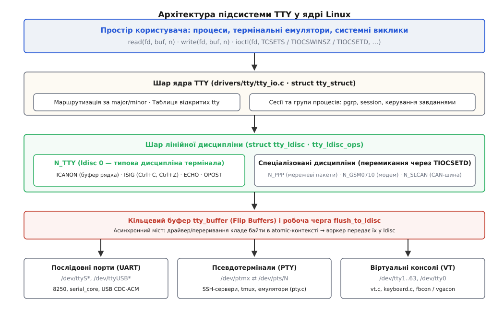
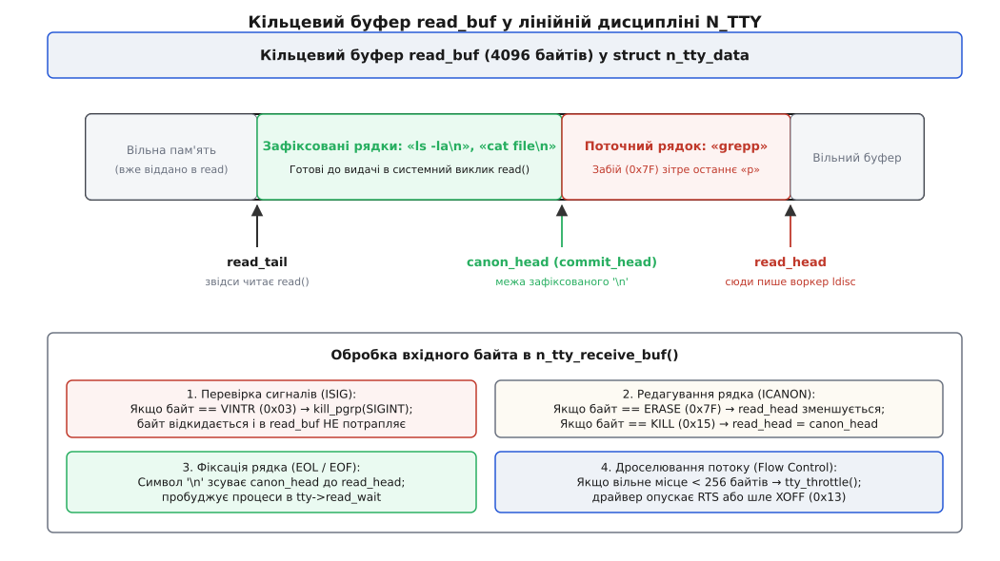
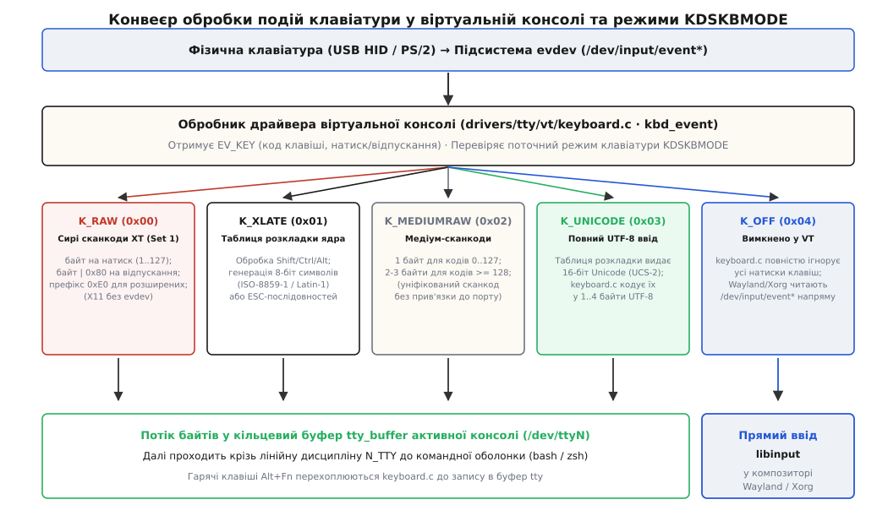
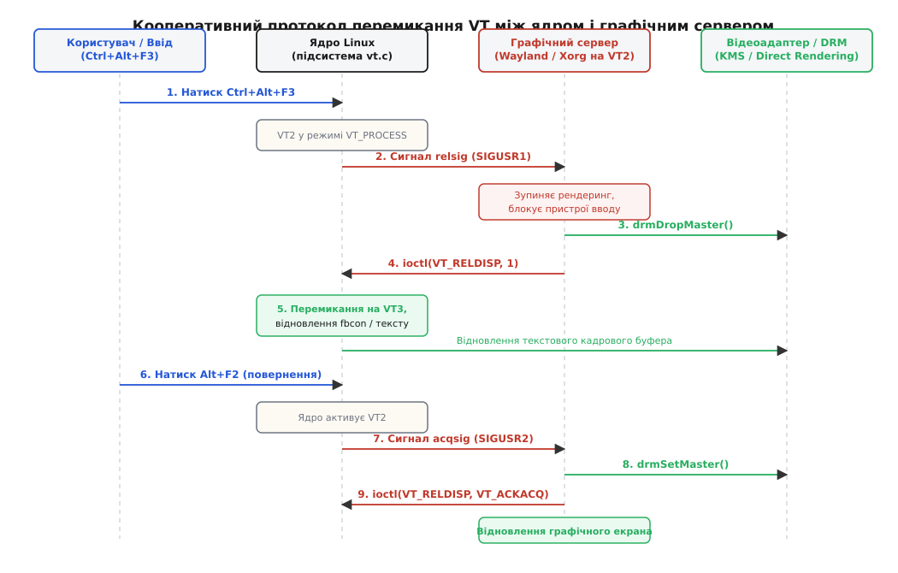

# Шар TTY та віртуальні консолі: лінійна дисципліна й режими клавіатури

<preknowlist>
- [Файловий дескриптор](topic:unix-linux/file-descriptor) — цілочисельний індекс у таблиці відкритих файлів процесу для читання й запису байтів.
- [Файл пристрою](topic:unix-linux/device-file-model) — спеціальний вузол у `/dev`, що адресує драйвер ядра замість блоків файлової системи.
- [Старший і молодший номери пристрою](topic:unix-linux/major-minor-numbers) — пара чисел `(major, minor)`, яка пов'язує файл у `/dev` із таблицею драйверів у ядрі.
- [Переривання, softirq і робочі черги](topic:unix-linux/interrupts-bottom-halves) — обробка апаратних сигналів, контексти переривань та відкладене виконання в ядрі.
- [TTY і модель termios](topic:unix-linux/tty-and-termios) — трирівневий стек термінала, прапорці введення/виведення, канонічний режим та обробка спеціальних символів.
- [Псевдотермінали PTY](topic:unix-linux/pseudo-terminal) — парні кінцеві точки master/slave для емуляторів терміналів у просторі користувача.
- [Віртуальна консоль Linux](topic:unix-linux/virtual-console) — текстовий екран і вбудований емулятор термінала ядра на фізичному відеоадаптері.
- [ioctl](topic:unix-linux/ioctl-interface) — системний виклик для передавання керуючих команд і структур безпосередньо драйверу.
- [Модель сигналів](topic:unix-linux/signal-model) — асинхронні повідомлення ядра процесам, зокрема генерація `SIGINT`, `SIGTSTP`, `SIGWINCH` та `SIGHUP`.
- [Підсистема введення evdev](topic:unix-linux/input-event-codes-and-evdev) — потік структур `input_event` від апаратних клавіатур та мишей.
- [DRM/KMS](topic:unix-linux/drm-kms) — керування режимами відеоадаптера, буферами кадру й правами доступу DRM master.
</preknowlist>

Програма виконує `write(1, "\n", 1)` і засинає на виклику `read(0, buf, 100)`. В одній системі дескриптори `0` і `1` прив'язані до послідовного порту `/dev/ttyS0` на мікросхемі UART 16550A. В іншій — до вузла `/dev/pts/3`, створеного графічним емулятором термінала всередині сесії Wayland. У третій — до першої віртуальної консолі `/dev/tty1`, яка відображається пікселями на моніторі через кадровий буфер відеоадаптера й отримує події від USB-клавіатури.

Попри те, що фізична природа цих трьох пристроїв не має жодної спільної риси, поведінка дескрипторів виявляється абсолютно ідентичною. В усіх трьох випадках натискання Backspace видаляє останній символ із буфера до того, як його побачить виклик `read()`; натискання `Ctrl+C` генерує сигнал `SIGINT` передній групі процесів і миттєво перериває виконання; запис байта `0x0A` (`\n`) надсилає на екран або в лінію послідовність `\r\n`; а фоновий процес, який намагається прочитати ввід без дозволу, отримує сигнал `SIGTTIN` і призупиняється ядром.

Якби логіка редагування рядків, перехоплення керуючих комбінацій та керування сесіями реалізовувалася всередині кожного окремого драйвера заліза, ядро містило б десятки дублюючих реалізацій з неминучими розбіжностями в поведінці. Щоб розділити обслуговування апаратних черг і термінальну логіку, ядро Linux об'єднує всі ці пристрої в трирівневу підсистему TTY (англ. *teletypewriter*).



*Вхідні й вихідні байти обов'язково проходять крізь проміжний шар лінійної дисципліни та асинхронні кільцеві буфери flip buffers.*

## Трирівнева архітектура TTY у ядрі Linux

Термінальний стек ядра Linux у теці `drivers/tty/` чітко розмежовує три рівні відповідальності:

1. **Верхній шар: Ядро TTY (TTY Core).** Файл `drivers/tty/tty_io.c` надає інтерфейс файлових операцій VFS (`struct file_operations`: `tty_open`, `tty_read`, `tty_write`, `tty_ioctl`, `tty_poll`). Цей шар маршрутизує відкриття пристроїв за їхніми старшими й молодшими номерами (`major/minor`), відстежує стан відкритих дескрипторів, утримує лічильники посилань на об'єкти ядра та реалізує керування завданнями (англ. *job control*), прив'язуючи термінал до лідера сесії та передньої групи процесів (`pgrp`).
2. **Середній шар: Лінійна дисципліна (Line Discipline).** Абстракція `struct tty_ldisc`, представлена за замовчуванням модулем `drivers/tty/n_tty.c` (`N_TTY`, номер 0). Саме цей шар перетворює сирий потік байтів на інтерактивний термінал для людини: формує канонічний буфер рядка, обробляє клавіші видалення символів, перехоплює символи переривання (`VINTR`, `VQUIT`, `VSUSP`) і надсилає відповідні сигнали, відтворює луну символів на екран (`ECHO`), розгортає символи табуляції та відстежує поточну колонку виводу.
3. **Нижній шар: Драйвер пристрою TTY (TTY Driver).** Модулі конкретних пристроїв, що реєструють структуру `struct tty_driver`. Драйвер взаємодіє безпосередньо з апаратурою або програмним джерелом даних і поділяється на три фундаментальні родини:
   - **Послідовні порти (UART):** драйвери `8250/16550`, `serial_core.c`, USB-перехідники FTDI/CH340/CDC-ACM (`/dev/ttyS*`, `/dev/ttyUSB*`, `/dev/ttyACM*`).
   - **Псевдотермінали (PTY):** драйвер `drivers/tty/pty.c`, що створює парні кінцеві точки `/dev/ptmx` (master) та `/dev/pts/N` (slave) для SSH-демонів, термінальних мультиплексорів (`tmux`, `screen`) та віконних емуляторів.
   - **Віртуальні консолі (Virtual Terminals, VT):** драйвер `drivers/tty/vt/vt.c`, який перетворює фізичний відеоадаптер і клавіатуру машини на набір незалежних термінальних пристроїв `/dev/tty1`..`/dev/tty63`.

Зв'язок між цими рівнями є динамічним: системний виклик `ioctl(fd, TIOCSETD, &ldisc)` дозволяє на льоту замінити стандартну текстову лінійну дисципліну `N_TTY` на мережеву дисципліну `N_PPP` або `N_GSM0710`, перетворивши той самий послідовний порт на мережевий інтерфейс без зміни драйвера мікросхеми. Про те, як виникла ця модульна концепція і чому в ранніх версіях Unix її не було, детально описано у вставці [еволюція лінійних дисциплін у Unix](topic:unix-linux/tty-layer-and-virtual-consoles/hist-line-discipline-evolution.md).

---

## Анатомія ядра TTY: структури `struct tty_struct`, `tty_driver` та `tty_port`

Стан кожного активного термінального з'єднання в ядрі описується набором взаємопов'язаних структур мови C.

```
                    ┌───────────────────────────────────────────────┐
                    │               struct tty_struct               │
                    ├───────────────────────────────────────────────┤
                    │  *driver  ──► struct tty_driver               │
                    │  *ops     ──► struct tty_operations           │
                    │  *ldisc   ──► struct tty_ldisc                │
                    │  *port    ──► struct tty_port                 │
                    │  *link    ──► struct tty_struct (для PTY)     │
                    │  termios  ──► struct ktermios (прапорці)      │
                    │  *pgrp    ──► struct pid (передній процес)    │
                    │  read_wait, write_wait (черги очікування)     │
                    │  ldisc_sem (блокування зміни дисципліни)      │
                    └───────────────────────────────────────────────┘
```

Головним об'єктом є `struct tty_struct` (визначена в `<linux/tty.h>`). Її ключові поля:
- `struct tty_driver *driver` — вказівник на зареєстрований драйвер, який створив цей термінальний вузол.
- `const struct tty_operations *ops` — таблиця функцій зворотного виклику драйвера (`open`, `close`, `write`, `put_char`, `flush_chars`, `ioctl`, `throttle`, `unthrottle`, `set_termios`, `hangup`).
- `struct tty_ldisc *ldisc` — екземпляр поточної активної лінійної дисципліни.
- `struct ktermios termios` — поточні термінальні прапорці введення (`c_iflag`), виведення (`c_oflag`), керування лінією (`c_cflag`), локальних режимів (`c_lflag`) та масив спеціальних символів (`c_cc`).
- `struct pid *pgrp` та `struct pid *session` — структури ідентифікаторів передньої групи процесів та сесії, якій належить даний термінал. Коли лінійна дисципліна перехоплює `Ctrl+C`, вона відправляє сигнал саме процесам групи `pgrp`.
- `struct tty_port *port` — структура, що відображає апаратний стан порту (лічильник відкриттів, стан ліній DTR/RTS, виявлення несучої частоти DCD, блокування та системні черги).
- `struct tty_struct *link` — перехресне посилання на парний TTY. Для віртуальних консолей і послідовних портів воно дорівнює `NULL`, а для псевдотерміналів зв'язує master-кінець `/dev/ptmx` зі slave-кінцем `/dev/pts/N`.
- `struct ld_semaphore ldisc_sem` — семафор блокування доступу до лінійної дисципліни. Він гарантує, що операція зміни дисципліни (`TIOCSETD`) або закриття термінала не відбудеться одночасно з виконанням `read()` або `write()`.
- `wait_queue_head_t read_wait` та `write_wait` — черги засинання й пробудження процесів при блокуючому читанні або записі.

Драйвер реєструє свій клас у системі за допомогою функції `tty_register_driver()`, передаючи структуру `struct tty_driver`. Вона визначає:
- Діапазон старших і молодших номерів (`major`, `minor_start`, `num`).
- Тип пристрою (`TTY_DRIVER_TYPE_SERIAL`, `TTY_DRIVER_TYPE_PTY`, `TTY_DRIVER_TYPE_CONSOLE`).
- Підтип і системні прапорці: `TTY_DRIVER_REAL_RAW` (драйвер оптимізовано для сирого введення), `TTY_DRIVER_RESET_TERMIOS` (скидати налаштування termios до стандартних при закритті останнього дескриптора), `TTY_DRIVER_DYNAMIC_DEV` (динамічне створення вузлів у `/dev` через devtmpfs).

### Послідовність відкриття `/dev/ttyN` та встановлення керуючого термінала

Коли процес викликає системний виклик `open("/dev/tty1", O_RDWR)`:
1. VFS знаходить інод символьного пристрою з номерами `(major=4, minor=1)` і викликає загальну функцію `chrdev_open`.
2. `chrdev_open` передає керування функції `tty_open()` у `drivers/tty/tty_io.c`.
3. `tty_open()` шукає в глобальній таблиці вже відкритий екземпляр `struct tty_struct` для цього номера. Якщо це перше відкриття, ядро виділяє нову структуру через `alloc_tty_struct()`.
4. Ядро ініціалізує лінійну дисципліну за замовчуванням викликом `tty_ldisc_get(tty, N_TTY)` і викликає функцію `ldisc->ops->open()`.
5. Ядро викликає специфічний метод драйвера `driver->ops->open(tty, filp)`. Для віртуальних консолей це функція `con_open()` у `drivers/tty/vt/vt.c`, яка виділяє буфер екрана та прив'язує емулятор.
6. Якщо процес не має керуючого термінала і є лідером нової сесії (`setsid()`), а прапорець `O_NOCTTY` не вказано, відкритий TTY автоматично стає керуючим терміналом сесії процесу.

Якщо в процесі роботи зв'язок із терміналом розривається (наприклад, апаратний модем фіксує падіння напруги на лінії DCD або виконується системний виклик `vhangup()`), ядро викликає функцію `tty_hangup(tty)`. При цьому всім процесам сесії надсилається сигнал `SIGHUP`, буфери введення-виведення скидаються, а всі подальші спроби запису у дескриптор повертають помилку `EIO` (I/O error), тоді як спроби читання повертають `0` (EOF).

---

## Двигун передавання: кільцеві буфери flip buffers і робочі черги ядра

Найскладнішою інженерною задачею при проектуванні TTY-шару є узгодження контекстів виконання. Апаратний контролер (UART або USB-контролер) отримує байти в контексті апаратного переривання (англ. *hard IRQ*) або відкладеного обробника (англ. *softirq / tasklet*). У цьому контексті процесор виконує атомарний код:
- Категорично заборонено засинати або викликати функції, що можуть заблокувати потік (наприклад, захоплювати м'ютекси або виділяти пам'ять без прапорця `GFP_ATOMIC`).
- Заборонено безпосередньо звертатися до структур простору користувача або викликати складні функції лінійної дисципліни, які можуть брати семафори.

З іншого боку, системний виклик `read()`, що очікує на дані, виконується в контексті процесу користувача. Щоб з'єднати швидке джерело апаратних переривань із процесом без втрати байтів і без блокувань, ядро використовує підсистему **flip buffers** (файл `drivers/tty/tty_buffer.c`).

```
  [ Апаратне переривання UART / клавіатури ]
                     │
                     ▼ tty_insert_flip_string()
  ┌─────────────────────────────────────────────────────────┐
  │  struct tty_bufhead (кільце сторінок struct tty_buffer) │
  │  [Блок 512B] ──► [Блок 512B] ──► [Блок 512B] (вільний)  │
  └─────────────────────────────────────────────────────────┘
                     │
                     ▼ tty_flip_buffer_push() (планує worker)
  ┌─────────────────────────────────────────────────────────┐
  │  Робоча черга ядра: flush_to_ldisc                      │
  │  (виконується в контексті kworker/u:X)                  │
  └─────────────────────────────────────────────────────────┘
                     │
                     ▼ ldisc->ops->receive_buf2()
  ┌─────────────────────────────────────────────────────────┐
  │  Лінійна дисципліна N_TTY (read_buf 4096B)              │
  └─────────────────────────────────────────────────────────┘
                     │
                     ▼ wake_up_interruptible(&tty->read_wait)
  [ Процес користувача: read(0, buf, 100) прокидається ]
```

Апаратний драйвер або обробник клавіатури записує отримані байти викликом функції:

```c
int tty_insert_flip_string(struct tty_port *port, const unsigned char *chars, size_t size);
```

Ця функція копіює байти в активний блок пам'яті `struct tty_buffer` (розміром зазвичай від 512 байтів до кількох кілобайтів) всередині структури `struct tty_bufhead`. Кожен байт супроводжується байтом прапорця (`TTY_NORMAL`, `TTY_BREAK`, `TTY_PARITY`, `TTY_FRAME`), що фіксує помилки апаратного кадрування.

Після завершення запису порції даних обробник викликає:

```c
void tty_flip_buffer_push(struct tty_port *port);
```

Функція `tty_flip_buffer_push()` не виконує обробку негайно. Вона планує відкладену задачу в системній робочій черзі ядра (`system_unbound_wq`), яка запускає функцію `flush_to_ldisc`.

Воркер `flush_to_ldisc` виконується в повноцінному контексті ядра (`kworker`), де дозволено захоплювати блокування. Він вилучає заповнені блоки `tty_buffer`, перемикає покажчики буферної голови на вільні блоки (звідси назва *flip*) і викликає метод активної лінійної дисципліни `ldisc->ops->receive_buf2()` (або `receive_buf()`), передаючи туди масив байтів разом з їхніми апаратними прапорцями.

---

## Лінійна дисципліна N_TTY: канонічний буфер, сигнали та дроселювання

Модуль `drivers/tty/n_tty.c` є серцем термінальної взаємодії. Внутрішній стан дисципліни зберігається в структурі `struct n_tty_data`, яка утримує кільцевий буфер вхідних даних `read_buf` розміром рівно 4096 байтів (`N_TTY_BUF_SIZE`).



*Покажчик canon_head відокремлює повністю зафіксовані рядки від поточного рядка, який редагується наживо.*

Буфер координується чотирма основними індексами:
- `read_head` — позиція, куди воркер `flush_to_ldisc` записує наступний вхідний байт.
- `read_tail` — позиція, з якої системний виклик `read()` забирає байти для передачі в простір користувача.
- `canon_head` — межа останнього завершеного рядка, що закінчився символом `\n`, `EOF` (`0x04`) або `EOL`.
- `commit_head` — позиція фіксації даних для запобігання стану гонитви між перериваннями та читачами.

### Канонічний режим (`ICANON`)

Коли в термінальних налаштуваннях увімкнено прапорець `ICANON` (`termios.c_lflag & ICANON`), лінійна дисципліна працює в режимі накопичення та редагування рядків:

1. **Накопичення символів:** кожен звичайний друкований символ записується в комірку `read_buf[read_head % 4096]`, після чого `read_head` збільшується на одиницю. Процес, що викликав `read()`, продовжує спати в черзі `tty->read_wait`, оскільки `canon_head == read_tail` (готових рядків немає).
2. **Стирання символу (`ERASE` / Backspace / `0x7F` або `0x08`):** якщо вхідний байт збігається з `termios.c_cc[VERASE]`, ядро не додає його в буфер. Замість цього воно перевіряє, чи `read_head > canon_head`. Якщо поточний незавершений рядок містить символи, `read_head` зменшується на 1 (або на розмір UTF-8 символу). Якщо увімкнено прапорець `ECHOE`, лінійна дисципліна відправляє у вихідний потік термінала послідовність `\b \b` (backspace, space, backspace), що фізично стирає символ на екрані.
3. **Стирання слова (`WERASE` / `Ctrl+W` / `0x17`):** відкочує `read_head` назад крізь пробіли до початку попереднього слова.
4. **Стирання рядка (`KILL` / `Ctrl+U` / `0x15`):** миттєво скидає `read_head = canon_head`, повністю очищаючи весь набраний незавершений рядок.
5. **Фіксація рядка (`\n` / `0x0A` або `EOL`):** коли надходить символ переведення рядка, він записується в буфер, після чого ядро прирівнює `canon_head = read_head`. Умова `canon_head != read_tail` стає істинною. Ядро викликає `wake_up_interruptible(&tty->read_wait)`. Системний виклик `read()` прокидається й копіює весь готовий рядок (разом із `\n`) у буфер користувача.
6. **Обробка кінця файлу (`EOF` / `Ctrl+D` / `0x04`):** символ `c_cc[VEOF]` змушує ядро зафіксувати поточний вміст (`canon_head = read_head`) і розбудити `read()` **без додавання самого байта 0x04 у буфер**. Якщо перед натисканням `Ctrl+D` були набрані символи, `read()` повертає накопичений текст. Якщо ж буфер був порожнім (`read_head == canon_head`), `read()` негайно повертає `0` байтів, що в стандарті POSIX означає настання кінця файлу (EOF).

### Неканонічний (сирий) режим (`~ICANON`)

Якщо прапорець `ICANON` скинуто, поняття рядків зникає. Будь-який байт стає доступним для читання негайно. Поведінка виклику `read()` повністю визначається двома параметрами в масиві `c_cc`:
- `VMIN` — мінімальна кількість байтів, яку вимагає процес.
- `VTIME` — значення тайм-ауту в десятих долях секунди (1/10 с).

Матриця поведінки неканонічного режиму:

```
┌─────────────────┬─────────────────────────────────────────────────────────────────┐
│ Параметри       │ Поведінка системного виклику read()                             │
├─────────────────┼─────────────────────────────────────────────────────────────────┤
│ VMIN > 0        │ Блокується до появи першого байта. Після цього запускається     │
│ VTIME > 0       │ таймер VTIME: якщо наступний байт не надходить за VTIME*0.1 с,  │
│                 │ read() повертає наявні байти; інакше чекає до накопичення VMIN. │
├─────────────────┼─────────────────────────────────────────────────────────────────┤
│ VMIN > 0        │ Чистий блокуючий ввід: read() спить, доки в буфері не з'явиться │
│ VTIME == 0      │ рівно VMIN байтів. Жодних тайм-аутів немає.                     │
├─────────────────┼─────────────────────────────────────────────────────────────────┤
│ VMIN == 0       │ Таймер загального очікування: запускається в момент виклику.    │
│ VTIME > 0       │ Повертає стільки байтів, скільки встигло прийти за VTIME*0.1 с; │
│                 │ якщо нічого не надійшло, повертає 0.                            │
├─────────────────┼─────────────────────────────────────────────────────────────────┤
│ VMIN == 0       │ Чисте неблокуюче опитування: read() повертає доступні байти     │
│ VTIME == 0      │ негайно; якщо буфер порожній, повертає 0.                       │
└─────────────────┴─────────────────────────────────────────────────────────────────┘
```

### Генерація сигналів термінала (`ISIG`)

Якщо встановлено прапорець `ISIG` (`termios.c_lflag & ISIG`), функція `n_tty_receive_char_special()` аналізує кожен вхідний байт **до** його потрапляння в буфер `read_buf`:
- `VINTR` (`Ctrl+C` / `0x03`) → генерує сигнал `SIGINT`.
- `VQUIT` (`Ctrl+\` / `0x1C`) → генерує сигнал `SIGQUIT` (зі збереженням дампу пам'яті core dump).
- `VSUSP` (`Ctrl+Z` / `0x1A`) → генерує сигнал `SIGTSTP` (зупинка процесу).

Коли збіг знайдено:
1. Байт керуючої комбінації **викидається** і в `read_buf` не потрапляє.
2. Ядро визначає передню групу процесів термінала `tty->pgrp`.
3. Викликається функція `kill_pgrp(tty->pgrp, sig, 1)`, яка надсилає сигнал усім процесам групи.
4. Якщо не встановлено прапорець `NOFLSH`, лінійна дисципліна негайно очищає буфери вводу й виводу (`read_head = read_tail = canon_head`), запобігаючи виконанню команд, що стояли в черзі.

### Обробка вихідного потоку та розкриття табуляцій

Шар `N_TTY` обробляє не лише вхідні, а й вихідні дані, що надходять від виклику `write()` (`termios.c_oflag`):
- `OPOST` (Output Post-processing): глобальний перемикач постобробки виводу. Якщо він вимкнений, байти надсилаються в драйвер без змін.
- `ONLCR` (Map NL to CR-NL): автоматично транслює символ переведення рядка `0x0A` (`\n`) у дводіапазонну пару `0x0D 0x0A` (`\r\n`), повертаючи каретку на початок рядка.
- `OCRNL` (Map CR to NL): транслює символ повернення каретки `0x0D` у `0x0A`.
- `TAB3` / `XTABS` (Expand Tabs to Spaces): лінійна дисципліна відстежує поточну горизонтальну колонку курсора (`ldata->column`). Зустрівши байт табуляції `0x09` (`\t`), ядро генерує від 1 до 8 пробілів так, щоб наступний символ опинився на позиції, кратній восьми.

### Керування розміром вікна (`TIOCSWINSZ`)

Термінал зберігає геометрію екранного вікна у структурі `struct winsize` (кількість рядків `ws_row`, стовпчиків `ws_col`, ширина та висота в пікселях `ws_xpixel`, `ws_ypixel`). Коли користувач змінює розмір вікна емулятора, графічний процес викликає `ioctl(fd, TIOCSWINSZ, &ws)`. Ядро записує нові розміри у `tty->winsize` і відправляє асинхронний сигнал `SIGWINCH` (Window Change) передній групі процесів `tty->pgrp`, спонукаючи текстові редактори (`vim`, `nano`) та оболонки перемалювати екран під новий розмір.

### Керування потоком і дроселювання (Flow Control & Throttling)

Якщо процес-читач завис або виконує складні обчислення, а апаратний порт продовжує надсилати дані на швидкості 115200 бод, буфер `read_buf` (4096 байтів) почне переповнюватися.

Щоб запобігти втраті даних:
1. **Верхня межа (High-water mark):** коли в `read_buf` залишається менше ніж 256 вільних байтів, функція `n_tty_check_throttle()` викликає `tty_throttle(tty)`.
2. `tty_throttle()` викликає метод драйвера `driver->ops->throttle(tty)`.
   - Для апаратного керування потоком (`CRTSCTS`) драйвер UART опускає лінію **RTS** (Ready To Send), змушуючи передавач на тому кінці дроту апаратно призупинити передачу.
   - Для програмного керування (`IXOFF`) лінійна дисципліна відправляє у вихідний потік символ `VSTOP` (`Ctrl+S` / `0x13` / XOFF).
3. **Нижня межа (Low-water mark):** коли процес нарешті вичитує дані з `read_buf` і кількість вільних байтів перевищує 512, ядро викликає `tty_unthrottle(tty)`. Драйвер піднімає лінію RTS або відправляє символ `VSTART` (`Ctrl+Q` / `0x11` / XON), відновлюючи передачу.

---

## Підсистема віртуальних консолей (`vt`)

Підсистема віртуальних консолей Linux (`drivers/tty/vt/`) поєднує стандартний TTY-драйвер із вбудованим у ядро емулятором термінала та підсистемою виводу на екран.

У системі існують чотири різні типи термінальних файлів у каталозі `/dev`:
- `/dev/tty1`..`/dev/tty63` (major 4, minor 1..63) — конкретні віртуальні консолі. Кожна з них має власний екземпляр `struct vc_data`, власний буфер екрана у відеопам'яті, власні таблиці кольорів і стан емулятора.
- `/dev/tty0` (major 4, minor 0) — спеціальний псевдопристрій-аліас, який завжди адресований до **поточної активної** віртуальної консолі (тієї, що наразі відображається на моніторі).
- `/dev/console` (major 5, minor 1) — системна консоль повідомлень ядра (куди спрямовується вивід `printk`). Вона може бути перенаправлена на `/dev/tty0`, послідовний порт `/dev/ttyS0` або мережевий консольний драйвер `netconsole` через параметр завантаження ядра `console=`.
- `/dev/tty` (major 5, minor 0) — магічний вузол процесу, що посилається на його власний керівний термінал (якщо процес має відкритий сеанс TTY).

### Структура `struct vc_data` та драйвери відображення `struct consw`

Кожна віртуальна консоль описується структурою `struct vc_data` (файл `<linux/vt_kern.h>`), яка утримує:
- Геометрію: кількість стовпчиків `vc_cols` та рядків `vc_rows`.
- Позицію курсора: `vc_x`, `vc_y`.
- Стан емулятора: поточні кольори тексту й тла за стандартом ANSI, стан розбору керуючих послідовностей VT102/ECMA-48.
- Буфер екрана `vc_screenbuf` — масив 16-бітних слів. Молодший байт кожного слова містить індекс гліфа шрифту, а старший байт — колірний атрибут VGA (колір тексту, колір тла, біт яскравості та біт мерехтіння).

Вивід буфера на реальний монітор здійснюється через таблицю функцій `struct consw` (Console Switch). Ядро підтримує кілька бекендів:
- `vgacon` (`drivers/video/console/vgacon.c`) — прямий запис у текстову відеопам'ять VGA за адресою `0xB8000` (для режиму x86 BIOS/CSM).
- `fbcon` (`drivers/video/console/fbcon.c`) — графічний кадровий буфер, що відмальовує піксельні матриці шрифтів на кадрових буферах DRM/KMS.
- `dummycon` — заглушка для систем без відеоадаптера.

---

## Режими клавіатури консолі: K_RAW, K_XLATE, K_MEDIUMRAW, K_UNICODE та K_OFF

Коли користувач натискає фізичну клавішу на клавіатурі, апаратний контролер (USB HID або контролер PS/2) генерує переривання. Підсистема введення ядра (`drivers/input/`) перетворює його на подію `input_event` з типом `EV_KEY`, кодом клавіші (наприклад, `KEY_A` = 30) та значенням (`1` — натиснуто, `0` — відпущено, `2` — автоповтор).

Драйвер віртуальної консолі `drivers/tty/vt/keyboard.c` реєструє власний обробник `kbd_handler` у підсистемі `input`. Спосіб, у який код клавіші потрапляє до активного TTY, залежить від **режиму клавіатури**, що встановлюється керуючим викликом `ioctl(fd, KDSKBMODE, mode)`.



*Режими KDSKBMODE визначають, чи транслюватиметься сканкод розкладкою ядра, чи передаватиметься у сирому вигляді, чи блокуватиметься повністю.*

Підсистема підтримує п'ять режимів трансляції:

1. **`K_RAW` (`0x00` — сирі сканкоди):**
   - Ядро перетворює вхідний код `KEY_*` у класичний сканкод стандарту IBM PC XT (Set 1).
   - Натискання клавіші генерує один байт у діапазоні `0x01..0x7F`.
   - Відпускання клавіші кодується встановленням старшого біта: `код | 0x80`.
   - Розширені клавіші (стрілки, Home, Insert) генерують префікс `0xE0`, за яким слідує байт коду.
   - Цей режим використовувався ранніми серверами XFree86 для безпосереднього опитування клавіатури до стандартизації інтерфейсу `evdev`.
2. **`K_XLATE` (`0x01` — 8-бітна трансляція за розкладкою):**
   - Стандартний текстовий режим. Коди клавіш пропускаються крізь внутрішні таблиці розкладки ядра (`key_maps`), завантажені утилітою `loadkeys`.
   - Ядро самостійно відстежує стан клавіш-модифікаторів: Shift, Control, Alt, AltGr, CapsLock.
   - Якщо комбінація відповідає звичайному знаку, ядро генерує 8-бітний символ кодування ISO-8859-1 (Latin-1) або ASCII.
   - Функціональні клавіші транслюються в escape-послідовності (наприклад, клавіша «Стрілка вгору» перетворюється на 3 байти: `\x1B [ A`).
3. **`K_MEDIUMRAW` (`0x02` — медіум-сканкоди):**
   - Проміжний формат, що не залежить від особливостей мікросхем контролерів клавіатури.
   - Коди клавіш від 0 до 127 кодуються одним байтом: значення від `0x00` до `0x7F` для натискання, та `0x80..0xFF` для відпускання.
   - Коди клавіш від 128 до 255 транслюються у мультибайтову послідовність: перший байт містить маску `0x80 | (код >> 7)`, другий — `код & 0x7F`.
   - Це дозволило бібліотекам графічного інтерфейсу (SVGAlib, X11) отримувати однозначні коди клавіш без прив'язки до сканкодів портів `0x60/0x64`.
4. **`K_UNICODE` (`0x03` — Unicode / UTF-8):**
   - Сучасний повнофункціональний режим консолі Linux.
   - Таблиця розкладки повертає 16-бітні кодові точки Unicode (UCS-2).
   - Функція `to_utf8()` у `keyboard.c` автоматично кодує їх у потік від 1 до 4 байтів стандарту UTF-8 (наприклад, літера «Ї» транслюється в два байти `0xD0 0x87`) і відправляє у flip buffer активної віртуальної консолі.
5. **`K_OFF` (`0x04` — повне вимкнення):**
   - Обробник `keyboard.c` повністю ігнорує всі події клавіатури, крім спеціальних системних комбінацій Magic SysRq (якщо вони увімкнені).
   - У буфер TTY не надсилається жодного байта.
   - Цей режим є критично важливим для сучасних Wayland-композиторів (Sway, GNOME Mutter, KDE KWin) та серверів Xorg на KMS: вони відкривають вузли `/dev/input/event*` напряму через `libinput` і вимикають TTY-трансляцію, щоб натискання клавіш у графічних вікнах не потрапляли в термінальну чергу фонової консолі.

Повний перелік числових значень керуючих викликів, сигнатур та структур даних для роботи з клавіатурою наведено у вставці [довідник керуючих викликів VT та клавіатури](topic:unix-linux/tty-layer-and-virtual-consoles/api-vt-keyboard-ioctls.md).

---

## Перемикання VT і кооперативний протокол передавання дисплея

Коли на комп'ютері працює кілька користувацьких середовищ (наприклад, графічна сесія Wayland на `/dev/tty2` та аварійна текстова оболонка на `/dev/tty3`), виникає проблема розподілу ресурсів графічного процесора.

Якщо користувач тисне `Ctrl+Alt+F3`, перебуваючи у Wayland:
1. Графічний процесор у цей момент виконує конвеєр малювання, тримає активні кадрові буфери у відеопам'яті та володіє статусом DRM-майстра (`DRM Master`).
2. Якщо ядро раптово перемкне екран на `fbcon` текстової консолі без узгодження, виникне апаратний конфлікт: драйвер текстової консолі спробує переналаштувати таймінги дисплейного контролера (CRTC), а композитор продовжить надсилати сторінки кадрового буфера через OpenGL/Vulkan, що призведе до зависання відеокарти.

Щоб запобігти цьому, ядро реалізує протокол **кооперативного перемикання** через режим `VT_PROCESS`.



*Дисплейний сервер віддає права DRM-майстра за сигналом relsig і відновлює графічні площини після сигналу acqsig.*

### Кроки узгодженого перемикання:

1. **Реєстрація:** при старті графічний сервер переводить свою віртуальну консоль у режим `VT_PROCESS` викликом:
   ```c
   struct vt_mode vtm = {
       .mode = VT_PROCESS,
       .relsig = SIGUSR1,  /* сигнал відпускання */
       .acqsig = SIGUSR2,  /* сигнал повернення */
   };
   ioctl(vt_fd, VT_SETMODE, &vtm);
   ```
2. **Ініціація зміни консолі:** користувач тисне `Ctrl+Alt+F3` (або програма викликає `ioctl(fd, VT_ACTIVATE, 3)`).
3. **Запит на звільнення (`relsig`):** ядро виявляє, що активна консоль працює в режимі `VT_PROCESS`. Ядро **не перемикає екран негайно**, а надсилає графічному серверу сигнал `relsig` (`SIGUSR1`).
4. **Реакція сервера:** графічний сервер перехоплює сигнал:
   - Призупиняє таймери рендерингу.
   - Скидає права головного пристрою DRM викликом `drmDropMaster(drm_fd)`.
   - Вимикає сканування подій від пристроїв введення `evdev`.
   - Підтверджує готовність ядру викликом `ioctl(vt_fd, VT_RELDISP, 1)`.
5. **Активація нової консолі:** отримавши підтвердження, ядро безпечно перемикає активний екран на `/dev/tty3`, відновлює шрифти текстового кадрового буфера `fbcon` та активує трансляцію клавіатури для нової сесії.
6. **Повернення назад:** коли користувач тисне `Alt+F2` для повернення у графічний сеанс, ядро активує `/dev/tty2` і надсилає графічному серверу сигнал `acqsig` (`SIGUSR2`).
7. **Відновлення графіки:** сервер отримує сигнал, викликає `drmSetMaster(drm_fd)`, переналаштовує площини відображення KMS, надсилає ядру фінальне підтвердження `ioctl(vt_fd, VT_RELDISP, VT_ACKACQ)` і відновлює графічний цикл.

Повний робочий код сесійного менеджера з підтримкою `signalfd`, `epoll` та RAII-обгорток мовами C та C++ подано у вставці [практична реалізація сесійного менеджера з перемиканням VT](topic:unix-linux/tty-layer-and-virtual-consoles/proj-vt-mode-switch.md).

---

## Сучасна архітектура: сесійний менеджер `systemd-logind` та безпривілейований Wayland

В історичній моделі X11 графічний сервер запускався з правами суперкористувача (`root` або з бітом `SUID`), оскільки пряме відкриття вузлів `/dev/tty0`, `/dev/ttyN` та виконання викликів `VT_SETMODE` і `KDSKBMODE` вимагає привілеїв `CAP_SYS_ADMIN`.

У сучасній архітектурі Linux цей підхід визнано небезпечним. Керування віртуальними терміналами та апаратними пристроями покладено на системну службу **`systemd-logind`** (або аналоги на зразок `seatd`/`elogind`):

```
  ┌─────────────────────────────────────────────────────────┐
  │                 Користувацький сеанс                    │
  │     Wayland-композитор (Sway / GNOME Shell / KWin)      │
  │     (працює як звичайний неієрархічний користувач)      │
  └─────────────────────────────────────────────────────────┘
          ▲                              │
          │ D-Bus: PauseDevice /         │ D-Bus: TakeControl /
          │ ResumeDevice                 │ TakeDevice(/dev/dri/card0)
          ▼                              ▼
  ┌─────────────────────────────────────────────────────────┐
  │                 Служба systemd-logind                   │
  │     (керує місцем seat0, володіє VT_PROCESS на /dev/ttyN) │
  └─────────────────────────────────────────────────────────┘
          ▲
          │ Системні виклики ioctl(VT_SETMODE), KDSKBMODE
          ▼
  ┌─────────────────────────────────────────────────────────┐
  │                   Ядро Linux (vt.c)                     │
  └─────────────────────────────────────────────────────────┘
```

1. Служба `systemd-logind` запускається з правами `root`, відкриває призначену віртуальну консоль (наприклад, `/dev/tty2`) і переводить її в режим `VT_PROCESS`.
2. Користувацький композитор запускається без привілеїв і з'єднується з `logind` через системну шину D-Bus, викликаючи метод `org.freedesktop.login1.Session.TakeControl()`.
3. Композитор не відкриває файли `/dev/dri/card0` або `/dev/input/event*` самостійно: він запитує їх через метод `TakeDevice()`. Служба `logind` відкриває пристрої від імені `root` і передає відкриті дескриптори композитору через механізм передавання файлових дескрипторів у сокетах UNIX (допоміжне повідомлення `SCM_RIGHTS`).
4. Коли користувач ініціює перемикання консолей, `logind` отримує сигнал від ядра, автоматично відкликає дескриптори (змушуючи ядро блокувати виклики читання/запису DRM та evdev через внутрішній механізм закриття доступу), надсилає композитору сигнал D-Bus `PauseDevice` і самостійно підтверджує перемикання ядру через `VT_RELDISP`.
5. При поверненні на сесію `logind` надсилає сигнал `ResumeDevice` і повертає композитору доступ до дескрипторів.

Завдяки цьому графічний стек повністю ізольовано від низькорівневих TTY-викликів, а безпека системи більше не залежить від наявності прав суперкористувача у складних графічних бібліотеках рендерингу.
