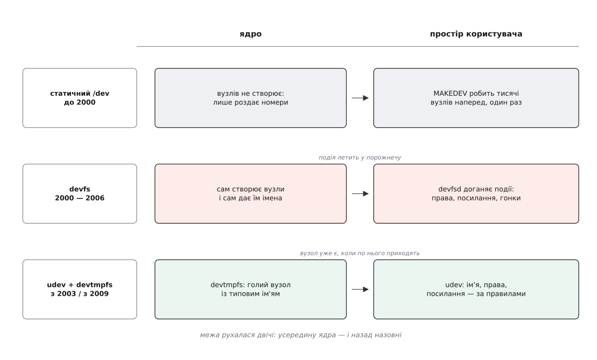

# 📜 Як іменування пристроїв виїхало з ядра

Нинішній розподіл праці — ядро створює голий вузол, а ім'я, права й посилання роздає звичайна програма — не був ані очевидним, ані первісним. До нього дійшли за чверть століття, і по дорозі спробували протилежне: віддати всю роботу ядру. Спроба провалилася так виразно, що її код викинули з ядра назавжди. Ця історія варта переказу, бо в ній видно, чому [межа між ядром і простором користувача](book:unix-linux/kernel-and-userspace) стоїть саме там, де стоїть.

*Межа рухалася двічі: усередину ядра — і назад назовні, але не туди, звідки виїхала.*

## Тисяча вузлів наперед

У класичному Unix `/dev` була звичайною текою на диску, і вузли в ній створювали заздалегідь — усі, які теоретично могли знадобитися. Робив це скрипт `MAKEDEV`, що викликав `mknod` кількасот, а згодом і кілька тисяч разів. Це працювало, доки [пара чисел усередині вузла](book:unix-linux/major-minor-numbers) була сталою величиною: старший номер закріплений за драйвером назавжди, молодший — за портом на платі. Другий послідовний порт — це `/dev/ttyS1`, хоч є він у машині, хоч нема.

Ламатися ця схема почала з двох боків одночасно. По-перше, номери скінчилися: 8 біт на старший номер, а драйверів дедалі більше, і роздавати їх централізовано ставало неможливо. По-друге — і це важливіше — з'явилися шини, де пристрої приходять і йдуть за життя системи: USB, PCMCIA, FireWire. Заздалегідь створити вузол для фотоапарата, якого ще не купили, неможливо в принципі. А `/dev` із десятьма тисячами вузлів, з яких живі три, — не просто безлад: він бреше про те, що в машині є.

## devfs: спробувати зробити це в ядрі

Відповідь напрошувалася сама: якщо ядро й так знає про кожен пристрій усе, хай воно саме й наповнює `/dev`. Річард Ґуч (Richard Gooch) написав `devfs` — [псевдо-файлову систему](book:unix-linux/pseudo-filesystems), яка показувала вузол рівно доти, доки живий пристрій. Її прийняли в ядро 2.3.46 на початку 2000 року (це задокументовано в історії ядра; сама робота почалася раніше).

Ідея була чиста, а от наслідки — ні, і всі вони росли з одного кореня: ядро вміє **виявити** пристрій, але не вміє ухвалювати рішення про політику.

Перше: імена. Правила іменування були зашиті в код драйверів, і кожна їх зміна ламала чужі скрипти — а обіцянку [не ламати інтерфейс простору користувача](book:unix-linux/userspace-abi-stability) ядро береже свято. Сталого імені, прив'язаного до конкретного примірника — до серійного номера перехідника, до мітки на диску, — devfs не давав узагалі. Щоб дати таке ім'я, треба прочитати перші блоки диска й розібрати чужий формат, а цього ядро робити не буде.

Друге: усе, що не є ім'ям. Права, група-власник, символічні посилання для сумісності — це теж політика, і в devfs її винесли назовні, у демона `devfsd`. Демон слухав, що робить ядро, і бігом виправляв за ним: щойно з'явився вузол — поставити правильну групу. Отут і сиділа гонка, яку не можна усунути принципово. Вузол уже існує й уже відкривається — а демон іще не дійшов до нього. Проміжок малий, але він є, і в ньому пристрій доступний із неправильними правами. Зсунути демона «раніше» неможливо: раніше за появу вузла немає чого виправляти.

Третє: ціна. Код розбору імен, кешування й монтування жив у ядрі, і кожна його вада коштувала вже не збоєм програми, а станом усієї системи.

Кілька років devfs був позначений як застарілий, а тоді його код прибрали з ядра — останнім випуском, де він ще був, лишився 2.6.17, а вийшло ядро без нього у 2.6.18 у вересні 2006 року (задокументовано; окремі дистрибутиви кинули devfs ще раніше, бо на той час уже мали заміну).

## udev, 2003: ту саму роботу — назовні

Заміна з'явилася ще до того, як devfs викинули. У ядрі 2.6 з'явилися дві речі, яких раніше бракувало: [sysfs](book:unix-linux/sysfs-device-model) — дерево, де кожен пристрій має теку з атрибутами й видимим батьком по шині, — і сповіщення про появу пристрою. Разом вони дали простору користувача те, чого йому бракувало: **повну картину пристрою та мить, коли він з'явився**. А маючи це, іменування можна робити де завгодно — зокрема й у звичайній програмі.

Цю програму написали Ґреґ Кроа-Гартман (Greg Kroah-Hartman) і Кай Зіверс (Kay Sievers); допомагав Ден Стеклофф (Dan Stekloff). Задум Кроа-Гартман виклав на Ottawa Linux Symposium у липні 2003 року — доповідь так і звалася: реалізація devfs у просторі користувача. Перший випуск вийшов у листопаді того ж таки 2003 року. Дати й авторство задокументовані в матеріалах симпозіуму та в історії проєкту.

Сповіщення спершу працювало найпрямішим із можливих способів: ядро на кожну подію запускало окрему програму-помічника `/sbin/hotplug`. Просто — і згубно, коли вмикають концентратор із двадцятьма пристроями: двадцять запусків процесу поспіль, кожен коштує пам'яті й часу. Згодом ядро стало розсилати ті самі події широкомовно через [netlink](book:unix-linux/netlink-protocol), а udev — слухати сокет одним постійним процесом. Це та сама схема, що працює й тепер.

Головне ж, чого не міг devfs, udev отримав задарма: у просторі користувача можна прочитати з диска мітку файлової системи, запустити допоміжну програму, підняти таблицю відповідностей із файла — і зліпити ім'я з чого завгодно.

## devtmpfs, 2009: частина роботи вертається — але не та

За кілька років виявилося, що один шматок роботи все-таки лишили не там. Поки udev іще не запущений — а це вся рання [початкова файлова система](book:unix-linux/initramfs), — вузлів у `/dev` немає взагалі, і кожен дистрибутив ліпив собі власний спосіб зробити перші вузли руками.

Латку написав Кай Зіверс, і в ядрі 2.6.32 (грудень 2009) з'явився `devtmpfs`: ядро саме тримає в пам'яті `/dev` і саме кладе туди вузол, щойно з'являється пристрій. Формулювання в анонсі ядра — «tmpfs-based /dev, яку веде ядро» (задокументовано).

Здається, ніби це повернення devfs. Не є ним — і різниця тут суттєва. `devtmpfs` створює **голий вузол із типовим ім'ям і мінімальними правами** — і на цьому спиняється. Він не тлумачить імена, не має демона, за яким треба виправляти, не претендує на політику. Уся політика — стале ім'я, права, група, посилання — лишилася там-таки, у правилах udev. Ядру віддали рівно ту частину, якої ніхто інший зробити не може: бути на місці раніше за будь-яку програму.

Гонка при цьому не зникла — вона стала чесною й видимою. Вузол справді існує ще до того, як udev його побачив, тільки з правами `root:root` і режимом `0600`, тож у проміжку до нього просто ніхто не дістанеться, крім суперкористувача.

## 2012: злиття із systemd і форк

Останній поворот — організаційний, не технічний. У квітні 2012 року код udev влили в дерево [systemd](book:unix-linux/systemd-model): версія systemd 183 стала першою, що містила udev усередині себе. Аргумент авторів був простий — це той самий колектив, ті самі бібліотеки, ті самі механізми запуску служб на появу пристрою, і тримати два дерева означає дублювати роботу.

Того ж року проєкт Gentoo зробив форк — `eudev`, щоб мати udev, який збирається й працює без systemd. Причини заявляли двоякі: одна принципова — не заганяти всі дистрибутиви в залежність від однієї системи ініціалізації; друга цілком практична — тодішні зміни в udev вимагали, щоб `/usr` була змонтована вже на момент старту, а це для частини установок означало обов'язковий initramfs там, де раніше без нього обходилися. Це заявлені сторонами мотиви, а не оцінка їхньої слушності; технічний бік суперечки стосувався переважно збирання й залежностей, а не самої моделі подій. Gentoo оголосив про припинення підтримки eudev наприкінці 2021 року, після чого проєкт підхопили незалежні супровідники.

Варто згадати й третю гілку, тихішу: `mdev` із BusyBox — мініатюрний обробник тих самих подій для вбудованих систем, де udev завеликий. Що подія доступна назовні у вигляді звичайного тексту, а рішення ухвалює звичайна програма, — саме це й дозволяє замінити цю програму на скрипт у півтори сотні рядків і нічого в ядрі не міняти.
