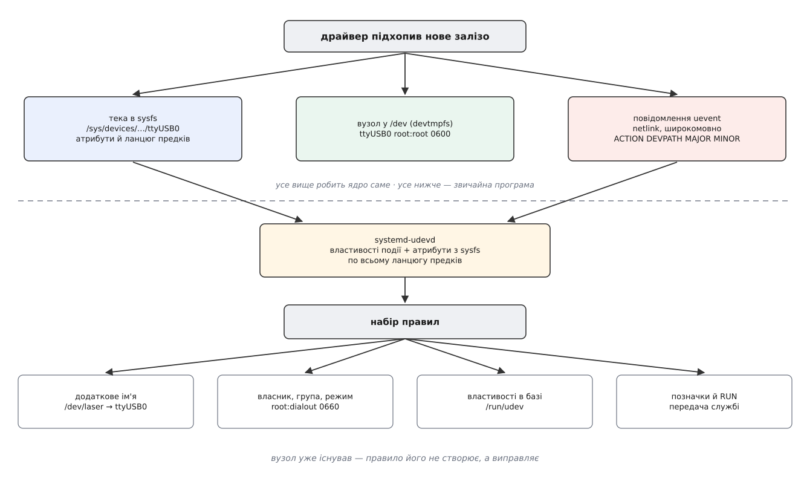
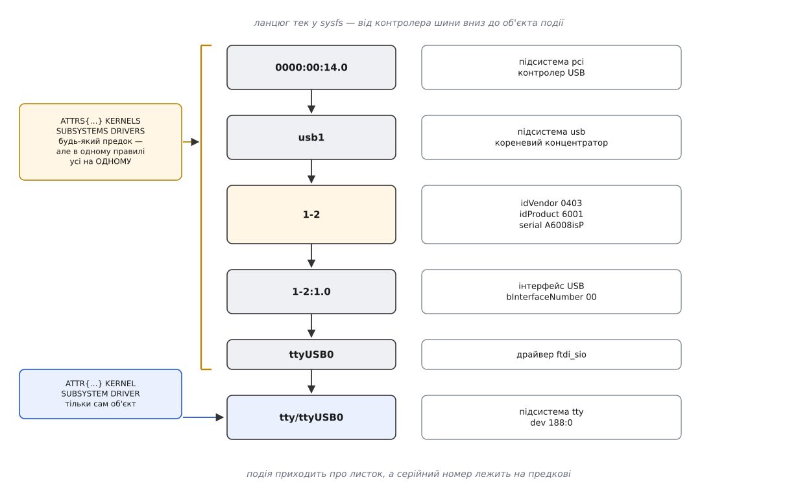
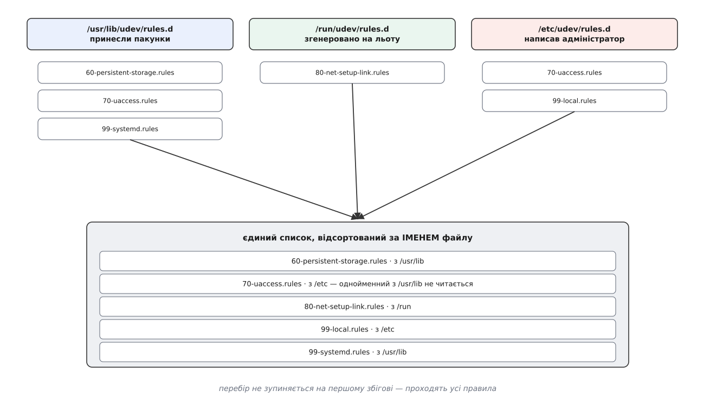

# udev: іменування пристроїв і правила

<preknowlist>
- [Файл пристрою](book:unix-linux/device-file-model) — вузол у `/dev`, крізь який `open`/`read`/`write` доходять до драйвера; буває символьний і блоковий.
- [Старший і молодший номери](book:unix-linux/major-minor-numbers) — пара чисел усередині вузла, за якою ядро знаходить драйвер і конкретний примірник пристрою.
- [Модель пристроїв у sysfs](book:unix-linux/sysfs-device-model) — дерево `/sys/devices`, де кожен пристрій має власну теку з атрибутами й батьком по шині.
- [Псевдо-файлові системи](book:unix-linux/pseudo-filesystems) — зокрема `devtmpfs`: файлова система в пам'яті, яку ядро саме наповнює вузлами `/dev`.
- [netlink](book:unix-linux/netlink-protocol) — сокет, яким ядро надсилає повідомлення в простір користувача, зокрема широкомовні.
- [Біти прав](book:unix-linux/permission-bits) — власник, група, режим і що саме вони дозволяють.
- [Групи доступу до пристроїв](book:unix-linux/device-access-groups) — звичай роздавати доступ до заліза через групу (`dialout`, `video`, `plugdev`).
- [Символічні посилання](book:unix-linux/hard-and-symbolic-links) — окремий файл, що містить шлях і розв'язується під час відкриття.
- [Межа ядра й простору користувача](book:unix-linux/kernel-and-userspace) — що ядро мусить робити саме, а що віддає звичайним програмам.
- [systemd](book:unix-linux/systemd-model) — юніти й залежності; знадобиться там, де на під'єднання пристрою треба підняти службу.
</preknowlist>

Два однакові перехідники з USB на послідовний порт, увімкнені в сусідні гнізда: один іде до верстата, другий — до метеостанції. У системі вони виглядають так:

```sh
$ ls -l /dev/ttyUSB*
crw-rw---- 1 root dialout 188, 0 сер  8 09:12 /dev/ttyUSB0
crw-rw---- 1 root dialout 188, 1 сер  8 09:12 /dev/ttyUSB1
```

Котрий із них верстат — із цих рядків не видно. Гірше: після перезавантаження або після того, як хтось витяг і встромив назад один зі шнурів, нулик і одиниця можуть помінятися місцями. Числа роздаються в порядку появи, а порядок появи залежить від того, який контролер шини встиг опитати свої гнізда першим. Програма, що жорстко відкриває `/dev/ttyUSB0`, одного ранку почне слати команди різання в метеостанцію.

Отже, потрібне ім'я, яке не залежить від порядку появи.

## Чому таке ім'я не роздає ядро

З чого взагалі можна зліпити стале ім'я? Варіантів рівно стільки, скільки в пристрою є прикмет, що не міняються від увімкнення до увімкнення. Перехідник має зашитий виробником серійний номер. Він має місце на шині — гніздо, у яке його встромили. Диск має мітку й ідентифікатор файлової системи, записані в перших секторах. Камера має рядок із назвою моделі.

Кожна з цих прикмет дає стале ім'я — але стале по-різному. Якщо перехідники живуть у своїх шафах і їх ніхто не переставляє, правильний ключ — гніздо: замінили несправний перехідник новим, а верстат так і лишився верстатом. Якщо ж пристрої кочують між гніздами й машинами, правильний ключ — серійний номер, а гніздо як ключ лише шкодить. Обидві відповіді правильні, і вибір між ними залежить не від заліза, а від того, як влаштована конкретна майстерня.

Це і є межа: ядро вміє **виявити** пристрій і прочитати з нього прикмети, але «котра з прикмет тут головна» — рішення людини, яка збирала установку. Ядро таких рішень не ухвалює: усе, що воно віддає назовні, стає [частиною незмінного інтерфейсу](book:unix-linux/userspace-abi-stability) — схему іменування, обрану раз, потім не поміняєш, бо на неї вже спираються чужі скрипти. Схема, яка пасувала б усім, не існує, а отже, будь-яка обрана ядром була б помилкою для половини установок.

Є й друга причина, суто технічна. Частину прикмет узагалі не видно з пристрою: щоб дізнатися мітку файлової системи, треба прочитати перші блоки з диска й розібрати чужий формат; щоб зрозуміти, котра з двох камер «головна», може знадобитися запустити допоміжну програму й подивитися на її вивід. Розбирати формати й запускати програми ядро не буде — не тому що не може, а тому що кожен такий крок у ядрі коштує стабільності всієї системи.

Тож роботу ділять. Ядро робить те, чого не може ніхто інший: помічає появу пристрою, видає йому номери, публікує все, що про нього знає, і створює мінімальний вузол у `/dev`. Далі воно **сповіщає** простір користувача — і замовкає. А ім'я, права й усе решта вирішує звичайна програма. Ця програма зветься **udev** (від англ. *userspace /dev* — «`/dev`, що робиться в просторі користувача»).

Щоб щось вирішувати, цій програмі потрібні три речі: дізнатися про подію, дістати про пристрій усе, і мати куди записати рішення. Розберімо їх по черзі.

## Що саме ядро віддає назовні

Коли драйвер підхоплює нове залізо, ядро реєструє пристрій у своїй внутрішній моделі, і з цього автоматично випливають три сліди.

**Тека в sysfs** — з атрибутами пристрою та посиланням на батька по шині. Це повний опис: серійний номер, ідентифікатори виробника й моделі, швидкість, стан.

**Вузол у `/dev`** — з типовим ім'ям від драйвера, власником `root:root` і режимом `0600`. Створює його не udev, а саме ядро, через `devtmpfs` — файлову систему в пам'яті, яку ядро наповнює саме (вона з'явилася в ядрі 2.6.32 наприкінці 2009 року, автор — Кай Зіверс). Наслідок важливіший, ніж здається: на мить, коли udev дізнається про пристрій, вузол **уже існує**, і хтось уже міг його відкрити.

**Повідомлення про подію** — так званий *uevent*, широкомовно розіслане через netlink-сокет. Це простий текст із пар «ключ=значення»:

```text
ACTION=add
DEVPATH=/devices/pci0000:00/0000:00:14.0/usb1/1-2/1-2:1.0/ttyUSB0/tty/ttyUSB0
SUBSYSTEM=tty
DEVNAME=ttyUSB0
MAJOR=188
MINOR=0
SEQNUM=4137
```

Зверніть увагу, чого тут немає: серійного номера, виробника, швидкості. Повідомлення каже, **що** сталося і **де про це читати** — `DEVPATH` є шляхом у sysfs. Дублювати туди весь опис немає сенсу, бо тека вже стоїть на місці; а `MAJOR`/`MINOR` присутні тому, що без них неможливо створити вузол, не читаючи sysfs узагалі.



*Ядро створює теку в sysfs, мінімальний вузол у /dev і розсилає повідомлення; усе, що робить ім'я осмисленим, відбувається вже в просторі користувача.*

## Демон і об'єкт події

Слухає цей сокет демон `systemd-udevd`. Він відкриває netlink дуже рано під час завантаження — саме тому, що пропущене повідомлення нізвідки не візьмеш удруге.

На кожну подію демон збирає **об'єкт**: властивості з самого повідомлення, плюс атрибути з теки sysfs за `DEVPATH`, плюс атрибути **всіх батьківських тек угору по шині**. Останнє — не дрібниця, а серцевина всієї конструкції, і ось чому.

Подія прийшла про `ttyUSB0` — маленький об'єкт підсистеми `tty`, у якого своїх атрибутів майже нема. Серійний номер належить не йому: він лежить на USB-пристрої, тобто на два-три рівні вище по дереву. Ідентифікатор виробника — там само. Номер гнізда теж не на листку: він зашитий в ім'я того самого предка — `1-2` означає другу гілку першої шини. Тобто прикмети, за якими взагалі можна впізнати верстат, розсипані по всьому ланцюгу предків.



*Подія приходить про листок дерева, а прикмети, за якими пристрій упізнають, лежать на його предках.*

Звідси дві родини ключів у правилах. `KERNEL`, `SUBSYSTEM`, `DRIVER`, `ATTR{…}` питають **сам пристрій**, про який прийшла подія. `KERNELS`, `SUBSYSTEMS`, `DRIVERS`, `ATTRS{…}` — у множині — питають «чи є десь угору по ланцюгу предок, у якого це так».

І звідси ж головна пастка. **Усі ключі в множині, ужиті в одному правилі, мусять збігтися на ОДНОМУ й тому самому предкові.** Якби було інакше, правило «десь угорі є пристрій із серійним номером A6008isP і десь угорі є пристрій із ідентифікатором виробника 0403» справджувалося б і тоді, коли ці дві прикмети належать різним предкам, — тобто чіпляло б геть чужі пристрої. Саме тому команда, якою ці прикмети вишукують, друкує їх **згрупованими по предках** і попереджає, що брати їх можна лише з однієї групи:

```sh
$ udevadm info --attribute-walk --name=/dev/ttyUSB0
  looking at device '/devices/.../ttyUSB0/tty/ttyUSB0':
    KERNEL=="ttyUSB0"
    SUBSYSTEM=="tty"
  looking at parent device '/devices/.../1-2':
    KERNELS=="1-2"
    SUBSYSTEMS=="usb"
    ATTRS{idVendor}=="0403"
    ATTRS{idProduct}=="6001"
    ATTRS{serial}=="A6008isP"
```

Скопіювати два рядки з різних блоків — типова причина правила, яке «чомусь не спрацьовує» або, навпаки, чіпляє все підряд.

## Правило як рядок таблиці

Рішення записують не скриптом, а таблицею. Причин три, і всі практичні. Під час завантаження демон перемелює тисячі подій і розкладає їх по кількох робочих процесах — паралельно, а скрипти паралелити небезпечно. Набір правил — це **дані**, тож кожен пакунок може принести свій шматок, і всі шматки зіллються без узгоджень. І той самий набір мусить давати той самий результат, коли його переганяють по вже наявних пристроях, а не по свіжих подіях.

Правило — це один рядок із пар «ключ-оператор-значення», розділених комами. Ключі бувають двох родів: ті, що **питають**, і ті, що **призначають**. Питальні вживають `==` і `!=`, призначальні — `=`, `+=`, `-=` і `:=`. Правило спрацьовує, коли зійшлися **всі** його питальні ключі; тоді виконуються всі призначення того самого рядка.

Різниця між призначальними операторами варта окремого слова, бо частина ключів тримає **список**, а не одне значення: `SYMLINK`, `RUN`, `TAG`. Для них `=` затирає список цілком, `+=` дописує ще один елемент, `-=` вилучає. Оператор `:=` призначає значення й **забороняє** пізнішим правилам його міняти — потрібен саме тому, що правила не зупиняються на першому збігу.

> 🔧 **Навіщо це.** Правило для власного заліза пишуть так: спершу `udevadm info --attribute-walk` на вже під'єднаному пристрої, щоб побачити прикмети й вибрати блок предка; потім рядок із питальними ключами з цього блоку; потім `udevadm test /sys/class/tty/ttyUSB0` — він проганяє весь набір правил і друкує, що вийшло, нічого не змінюючи в системі. Так помилку видно до того, як ви перезавантажилися й лишилися без пристрою.

Повний перелік ключів, операторів і підстановок винесено окремо: [ключі правил udev](book:unix-linux/udev-rules/api-rule-keys.md) — довідка з усіма питальними й призначальними ключами, підстановками на кшталт `%k`, `$attr{…}`, `%c`, а також з `IMPORT`, `PROGRAM`, `GOTO` і `OPTIONS`. Тут вистачить того, що вже названо.

Ось правило, яке вирішує задачу з двома перехідниками:

```udev
SUBSYSTEM=="tty", ATTRS{idVendor}=="0403", ATTRS{idProduct}=="6001", ATTRS{serial}=="A6008isP", SYMLINK+="laser", GROUP="dialout", MODE="0660"
```

Питальна частина: подія про об'єкт підсистеми `tty`, у якого серед предків є USB-пристрій із саме таким виробником, моделлю й серійним номером — і всі три прикмети взяті з одного блоку виводу. Призначальна: додати посилання, віддати групі `dialout`, відкрити їй читання й запис. Результат:

```sh
$ ls -l /dev/laser
lrwxrwxrwx 1 root root 7 сер  8 09:31 /dev/laser -> ttyUSB0
```

Тепер `ttyUSB0` може стати `ttyUSB1`, а `/dev/laser` вестиме куди слід.

## Звідки береться порядок правил

Файли правил лежать у трьох місцях, і кожне має свого господаря: `/usr/lib/udev/rules.d` — те, що принесли пакунки; `/run/udev/rules.d` — те, що згенеровано на льоту; `/etc/udev/rules.d` — те, що написав адміністратор.

Далі працюють **два різні механізми**, і плутати їх дорого.

Порядок виконання визначає **ім'я файлу**, а не тека: усі файли з усіх трьох тек зливаються в один список і сортуються за іменем. Саме тому імена починають із числа — `60-persistent-storage.rules`, `99-local.rules`: число задає місце в черзі.

Перекриття визначає **тека**: якщо в двох теках лежить файл із **однаковим** іменем, виграє той, що з важливішої (`/etc` над `/run`, `/run` над `/usr/lib`), а решта не читаються взагалі. Із цього випливає звичний прийом: щоб вимкнути набір правил, принесений пакунком, у `/etc/udev/rules.d` кладуть **порожній** файл із тим самим іменем.



*Файли зливаються в один список за іменем; тека вирішує лише долю однойменних файлів.*

Ще одне, що ламає очікування: перебір **не зупиняється** на першому збігові. Для кожної події проходять усі правила набору, і пізніше правило може перезаписати те, що вирішило раніше. Звідси й потреба в `:=`, і те, що власні правила зазвичай ставлять із великим числом — щоб вони йшли останніми.

## Що правило справді змінює

Список коротший, ніж здається, і кожен пункт має причину бути саме таким.

**Ім'я — тільки додаткове.** Перейменувати вузол, який створило ядро, не можна: він уже стоїть у `/dev` і хтось міг його відкрити, а перенос файлу під ногами в того, хто тримає його розкритим, — гарантована плутанина. Тому працює лише `SYMLINK+=`, тобто **ще одне** ім'я поруч. Пристрій може мати їх кілька; коли два різні пристрої претендують на одне посилання, черговість вирішує `OPTIONS+="link_priority=…"`, а посилання завжди веде до того, хто нині виграв.

**Права.** `OWNER`, `GROUP`, `MODE` — і це, попри всі розмови про іменування, найчастіша причина, чому взагалі пишуть правила: свіжо під'єднаний пристрій за замовчуванням належить `root` і закритий, а працювати з ним має звичайний користувач. Поруч живе `TAG+="uaccess"` — позначка, за якою права на пристрій динамічно віддають тому, хто зараз фізично сидить за цією машиною.

**Властивості.** `ENV{…}="…"` дописує в об'єкт події пару «ключ-значення». Її прочитають наступні правила — і, що важливіше, її збереже база даних демона в `/run/udev`, звідки її беруть уже інші програми. Тобто правила не лише правлять `/dev`, а й **збагачують опис пристрою** для всієї системи.

**Ім'я мережевого інтерфейсу.** Тут `NAME=` таки перейменовує — бо в інтерфейсу немає вузла в `/dev`, у нього є ім'я всередині ядра, і поки він не піднятий, ядро дозволяє його змінити. Саме звідси беруться імена штибу `enp3s0` замість `eth0`: правила рахують ім'я з місця пристрою на шині PCI. Схему ввели в systemd 197 на початку 2013 року — і рівно з тієї самої причини, з якої ми почали цю розмову: `eth0` і `eth1` роздавалися в порядку появи, і на машині з двома картками правило брандмауера могло після перезавантаження опинитися не на тому інтерфейсі.

**Запуск програми.** `RUN+=` — і саме тут найчастіше помиляються.

## Чому RUN — не місце для служби

Програми з `RUN` запускає демон після того, як відпрацювали правила події. Він же їх і **вбиває**, коли обробку події завершено, — разом з усім деревом нащадків. На обробку є ліміт часу (типово 180 секунд, змінюється через `udev.event_timeout=` у командному рядку ядра); поки програма не завершилася, робочий процес демона зайнятий і черга подій за ним стоїть.

Отже, `RUN` придатний для короткої дії: записати щось у sysfs, ввімкнути живлення, покласти прапорець. Спроба підняти звідти власного демона закінчується або тим, що його вб'ють разом із подією, або тим, що він зависне на чиємусь очікуванні й підвісить обробку подій усієї системи.

Правильна передача виглядає інакше: правило лише **позначає** пристрій, а довгу роботу виконує служба. Позначка `TAG+="systemd"` робить пристрій видимим для systemd як юніт (`dev-ttyUSB0.device`), а `ENV{SYSTEMD_WANTS}="…"` каже, яку службу підняти, коли цей юніт стає активним. Демон тоді живе у власному контролі ресурсів, з власним перезапуском і власним журналом, а udev до нього не має жодного стосунку. Розібраний приклад із правилом, юнітом-шаблоном і типовими помилками — у вставці [правило плюс служба: як реагувати на під'єднання довгою роботою](book:unix-linux/udev-rules/proj-hotplug-service.md).

## Пристрої, що з'явилися до демона

Лишається діра: демон стартує не першим. Поки він піднімався, ядро вже знайшло диски, мережеві картки й половину USB, і всі ті повідомлення пішли в нікуди.

Латати це окремим механізмом «обійти все й налаштувати» означало б мати дві різні гілки коду, які неминуче розійдуться. Тому обрали інше: у кожній теці sysfs є файл `uevent`, доступний на **запис**. Записали туди слово `add` — і ядро розсилає таке саме повідомлення, ніби пристрій щойно з'явився. Команда `udevadm trigger` просто обходить sysfs і пише в ці файли.

Тож старт системи не має власного шляху виконання: він синтезує ті самі події, і правила застосовуються тим самим кодом. Побічна користь — та сама: змінили правила, виконали `udevadm trigger` для потрібної підсистеми, і нові імена з'явилися без перезавантаження.

Оскільки обробка асинхронна, іноді треба дочекатися кінця: `udevadm settle` блокується, поки черга подій не спорожніє. Це потрібно, наприклад, монтуванню за міткою — доки правила не створили `/dev/disk/by-uuid/…`, монтувати нічого.

## Те, чим ви вже користуєтесь

Найпоказовіше в цій конструкції те, що більшість людей ніколи не писала жодного правила — і все одно на неї спирається. Теки `/dev/disk/by-uuid/`, `/dev/disk/by-label/`, `/dev/serial/by-id/`, `/dev/input/by-path/` не існують у ядрі: це посилання, які створюють правила, принесені дистрибутивом, тим самим `SYMLINK+=`. Рядок `UUID=…` у `/etc/fstab` працює саме тому, що якесь правило прочитало мітку з першого сектора й повісило на пристрій ім'я.

Історію того, як до цієї схеми дійшли — через `devfs`, який намагався робити те саме всередині ядра й програв, — розібрано окремо: [чому іменування пристроїв виїхало з ядра](book:unix-linux/udev-rules/hist-udev-birth.md).
