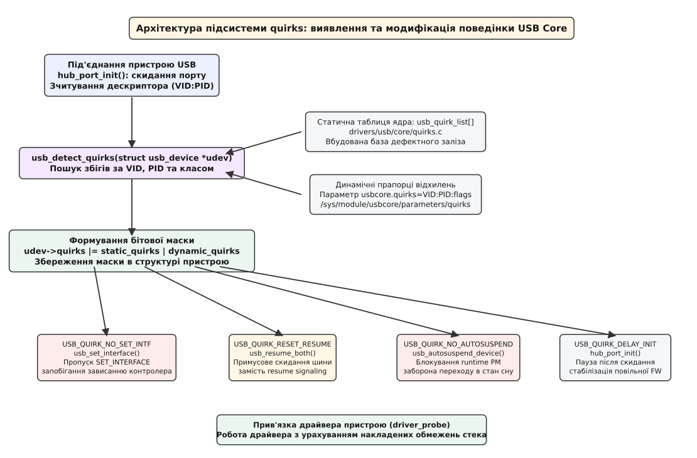
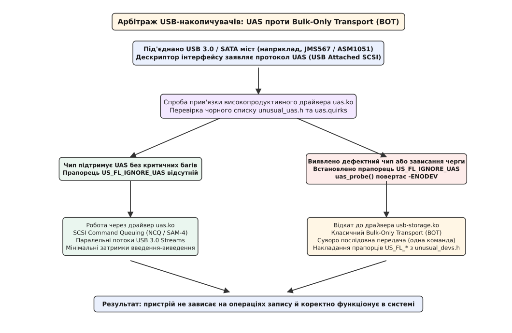
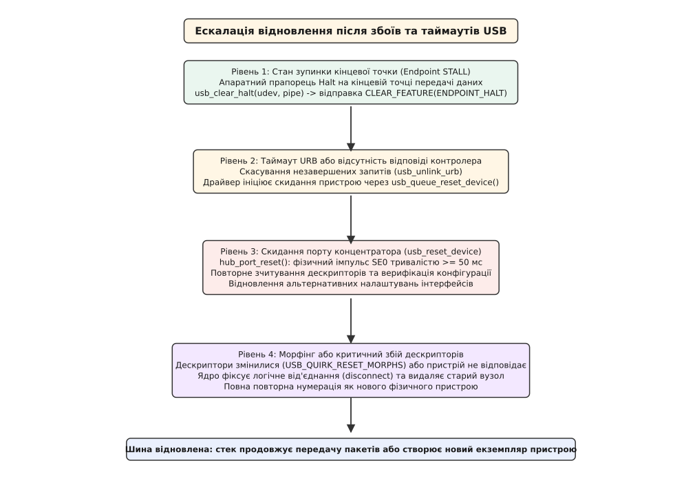

# Хиби пристроїв USB: чорні списки й прапорці відхилень

<preknowlist>
- [Символьні та блочні пристрої](book:unix-linux/character-and-block-devices) — роздвоєння файлів пристроїв у каталозі `/dev` та їхні шляхи в ядрі.
- [Файлова система sysfs, kobject та sysfs_dirent](book:unix-linux/sysfs-kobject-sysfs-dirent) — відображення топології пристроїв ядра та керування параметрами драйверів.
- [Призупинення й пробудження системи: suspend to RAM у ядрі](book:unix-linux/system-suspend-resume) — стани керування живленням та операції відновлення пристроїв.
- [kobject, kref і час життя об'єктів ядра](book:unix-linux/kobject-kref-lifetime) — механіка лічильників посилань та життєвий цикл структур драйверів.
</preknowlist>

Коли користувач під'єднує новий USB-пристрій до порту комп'ютера, хост-контролер ініціює строго регламентовану послідовність низькорівневих запитів нумерації: подає імпульс скидання на лінії шини, зчитує стандартні дескриптори, призначає унікальну 7-бітну адресу та конфігурує кінцеві точки (endpoints). Якщо прошивка мікроконтролера всередині пристрою містить помилку — наприклад, не очікує запиту на перемикання інтерфейсу або некоректно обробляє вихід із режиму енергозбереження, — пристрій перестає відповідати на керувальному каналі EP0, викликаючи 5-секундний таймаут хост-контролера, аварійне скидання шини та повідомлення про критичний збій у системному журналі.

Без спеціального механізму адаптації операційна система була б змушена або беззастережно відхиляти будь-яке обладнання з найменшими вадами прошивки, перетворюючи мільйони споживчих приладів на непрацездатні електронні компоненти, або перенасичувати загальний код шини нескінченними розгалуженнями під окремі мікросхеми. Ядро Linux вирішує цю фундаментальну суперечність за допомогою спеціалізованої підсистеми обходу апаратних хиб — **USB device quirks** (від англ. *quirk* — дивина, примха, відхилення).

Ця підсистема є гнучким захисним бар'єром між формальними специфікаціями консорціуму USB-IF та реальними мікросхемами на ринку. Вона дозволяє централізовано модифікувати протокольні послідовності ядра для конкретних комбінацій виробників і моделей за допомогою набору бітових прапорців, що призначаються як статично через вбудовані таблиці ядра, так і динамічно через параметри модуля та інтерфейси файлової системи `sysfs`.

## 1. Реальне залізо проти специфікацій USB-IF: природа апаратних дефектів

Специфікації Universal Serial Bus (починаючи від USB 1.0/1.1 і завершуючи сучасними ревізіями USB 3.2 та USB4) формулюють вичерпні вимоги до часових інтервалів, кінцевих автоматів (finite-state machines) та структури бінарних дескрипторів. Відповідно до стандарту кожен USB-пристрій повинен мати кінцеву точку нуль (Endpoint 0, EP0) типу Control, яка зобов'язана гарантовано обробляти стандартні керувальні запити: `GET_DESCRIPTOR`, `SET_ADDRESS`, `SET_CONFIGURATION`, `SET_INTERFACE`, `CLEAR_FEATURE(ENDPOINT_HALT)` та `GET_STATUS`.

Фізичний рівень шини USB 2.0 оперує диференціальною парою ліній D+ та D-. У процесі узгодження швидкості (Speed Negotiation) пристрій сигналізує свій базовий тип за допомогою підтягувальних резисторів 1.5 кОм (на лінію D+ для Full-Speed або на D- для Low-Speed). Для переходу в режим High-Speed (480 Мбіт/с) контролери виконують процедуру «чирпування» (Chirp Sequence): пристрій видає струмовий імпульс Chirp K, на який концентратор відповідає серією парних імпульсів Chirp K-J.

Надшвидкісні стандарти USB 3.x додають окремі екрановані диференціальні пари передавача (TX) і приймача (RX), де узгодження зв'язку виконується апаратним автоматом станів Link Training and Status State Machine (LTSSM) через стани `Rx.Detect`, `Polling`, `U0` (активна передача) та енергозберігаючі стани `U1`, `U2`, `U3`.

Масове виробництво споживчої електроніки керується жорсткими економічними обмеженнями, через що реальні мікросхеми містять численні відхилення від ідеальних стандартів:

1. **Мінімізація собівартості кристала:** У недорогих мікроконтролерах обсяг пам'яті програм (ROM/Flash) та статичної оперативної пам'яті (SRAM) обмежений кількома сотнями байтів. Розробники прошивок часто реалізують лише мінімальний набір інструкцій, необхідних для проходження найпростішого тесту на одній версії операційної системи Windows, повністю ігноруючи решту обов'язкових станів протоколу.
2. **Нерозділені апаратні буфери FIFO:** Апаратні трансивери USB на дешевих чипах часто мають єдиний буфер FIFO для прийому та передачі. Якщо хост надсилає два послідовні пакети Setup без витримки тривалої паузи, внутрішній буфер мікроконтролера переповнюється, і контролер або повертає помилку `STALL`, або перестає стробувати тактовий сигнал.
3. **Помилки в обчисленні розмірів та адрес дескрипторів:** Програмісти прошивок часто плутають індексацію масивів, розміри дескрипторів та значення байта довжини `bLength`. Типовою вадою є повернення значення поля `wMaxPacketSize = 0` для кінцевих точок, посилання на неіснуючі строкові індекси (наприклад, номер рядка 255 при наявності лише двох рядків у пам'яті) або перекриття адрес дескрипторів конфігурації.
4. **Некоректна реалізація станів сну (LPM, U1–U3):** Протоколи енергозбереження вимагають швидкого переходу ліній у низьковольтний режим та миттєвого відновлення синхронізації при появі трафіку. Численні контролери USB-хабів, мережевих карт та аудіоінтерфейсів при переході в стан низького енергоспоживання втрачають напругу на внутрішніх регістрах конфігурації або вимикають тактовий генератор, через що при пробудженні вони взагалі не відповідають на запити.
5. **Збої в розгалужувачах із багатьма Transaction Translators (Multi-TT):** Концентратори USB 2.0, що обслуговують змішані підключення High-Speed та Full/Low-Speed пристроїв, використовують перетворювачі транзакцій (Transaction Translators, TT). Бюджетні мікросхеми часто некоректно планують розщеплені транзакції (Split Transactions), викликаючи зависання буферів передачі.

У результаті хост-контролер операційної системи стикається з пристроями, які формально заявляють сумісність із USB, але практично порушують специфікацію на кожному кроці протокольного обміну.

## 2. Архітектура підсистеми quirks у ядрі Linux

Підсистема quirks у ядрі Linux організована як шар попередньої фільтрації, інтегрований у базовий механізм нумерації та конфігурування шини (USB Core). Її реалізація зосереджена у файлах `drivers/usb/core/quirks.c`, `drivers/usb/core/hub.c` та заголовному файлі `include/linux/usb/quirks.h`.

### Процедура нумерації в `hub_port_init()`

Коли пристрій під'єднується до фізичного порту, демон концентратора `hub_event()` запускає функцію `hub_port_init()`. Процедура нумерації включає такі кроки:

1. **Апаратне скидання порту (Port Reset):** Концентратор переводить лінії порту в стан Single-Ended Zero (SE0 — обидві лінії D+ та D- притиснуті до нуля) щонайменше на 50 мс для USB 2.0. Пристрій переходить у стан `Default` і відповідає на тимчасову нульову адресу (Address 0).
2. **Зчитування початкового дескриптора пристрою:** Хост надсилає пакет `GET_DESCRIPTOR (Device)` на кінцеву точку EP0. Залежно від схеми нумерації (нова схема з 64-байтовим буфером або стара схема з 8-байтовим буфером), ядро читає початок дескриптора для визначення максимального розміру пакета нульової точки (`bMaxPacketSize0`).
3. **Призначення адреси (`SET_ADDRESS`):** Хост призначає пристрою унікальну адресу шини від 1 до 127. Пристрій переходить у стан `Address`.
4. **Повне зчитування 18-байтового дескриптора:** Ядро читає повний дескриптор `struct usb_device_descriptor`, отримуючи `idVendor`, `idProduct` та номер ревізії `bcdDevice`.

Отримавши базові ідентифікатори виробника та моделі, ядро негайно викликає функцію `usb_detect_quirks()`:

```c
// drivers/usb/core/quirks.c
void usb_detect_quirks(struct usb_device *udev)
{
    udev->quirks = usb_detect_static_quirks(udev, usb_quirk_list);
    udev->quirks |= usb_detect_dynamic_quirks(udev);

    if (udev->quirks)
        dev_dbg(&udev->dev, "USB quirks for this device: %x\n",
                udev->quirks);

    // Додаткові дії за наявності специфічних прапорців
    if (udev->quirks & USB_QUIRK_NO_AUTOSUSPEND)
        udev->autosuspend_disabled = 1;
}
```

Поле `udev->quirks` являє собою 32-бітну бітову маску (`u32`), де кожен біт активує певну зміну в логіці ядра. Ця маска зберігається в структурі `struct usb_device` і супроводжує об'єкт пристрою протягом усього його життєвого циклу.



*Архітектура підсистеми quirks: послідовність виявлення дефектного обладнання під час нумерації, формування бітової маски udev->quirks та умовні розгалуження в критичних шляхах ядра.*

Статична таблиця `usb_quirk_list[]` містить масив структур `struct usb_device_id`, що зіставляють конкретні значення `idVendor`, `idProduct` або діапазони ревізій прошивок `bcdDevice` із набором прапорців `USB_QUIRK_*`:

```c
static const struct usb_device_id usb_quirk_list[] = {
    // Вебкамера Logitech QuickCam Pro 4000
    { USB_DEVICE(0x046d, 0x08b2), .driver_info = USB_QUIRK_RESET_RESUME },

    // Зовнішній звуковий контролер C-Media
    { USB_DEVICE(0x0d8c, 0x000c), .driver_info = USB_QUIRK_NO_SET_INTF },

    // Кардридер Alcor Micro
    { USB_DEVICE(0x058f, 0x6366), .driver_info = USB_QUIRK_NO_LPM },

    // Маркер кінця списку
    { }
};
```

Коли будь-яка підсистема ядра (керування живленням, налаштування кінцевих точок, запит рядків, відправка URB) збирається виконати стандартну дію, вона перевіряє відповідний біт у `udev->quirks`. Якщо біт встановлено, стандартна операція замінюється безпечним обхідним маневром.

## 3. Анатомія ключових прапорців відхилень (Core Quirks)

Кожен прапорець у `include/linux/usb/quirks.h` усуває конкретну апаратну ваду або ваду прошивки. Розглянемо детально внутрішню механіку всіх ключових прапорців ядра та наслідки відсутності відповідного обходу.

### 1. `USB_QUIRK_NO_SET_INTF` (маска `0x00000004`, літера `c`)

За стандартом USB після успішного встановлення конфігурації за допомогою `SET_CONFIGURATION` ядро зобов'язане перевести всі інтерфейси у вихідний стан, надіславши керувальний запит `SET_INTERFACE` з номером альтернативного налаштування 0:
```text
bmRequestType: 0x01 (Host-to-Device, Standard, Interface)
bRequest:      0x0B (SET_INTERFACE)
wValue:        0x0000 (Alternate Setting = 0)
wIndex:        0x0000 (Interface Number = 0)
```

Багато дешевих звукових карт, цифрових мікрофонів та вебкамер мають лише одне альтернативне налаштування. Їхні розробники не передбачили обробника для запиту `SET_INTERFACE`. Отримавши цей пакет на нульовій кінцевій точці, контролер пристрою повертає помилку `STALL` або взагалі блокує обробку черги переривань. Хост фіксує таймаут, вважає пристрій несправним і припиняє ініціалізацію.

У функції `usb_set_interface()` (`drivers/usb/core/message.c`) ядро перевіряє прапорець `USB_QUIRK_NO_SET_INTF`:
```c
if (udev->quirks & USB_QUIRK_NO_SET_INTF)
    return 0; // Пропуск відправки пакета, якщо пристрій вже в alt 0
```
Завдяки цьому пристрій успішно продовжує роботу без відправлення небезпечного для нього пакета.

### 2. `USB_QUIRK_RESET_RESUME` (маска `0x00000002`, літера `b`)

Коли комп'ютер переходить у стан сну (Suspend to RAM), шина USB переводиться у режим низького енергоспоживання. При пробудженні системи стандарт вимагає, щоб хост-контролер згенерував сигнал відновлення (Resume Signaling — утримання стану лінії `K-state` протягом щонайменше 20 мс), після чого пристрій повинен продовжити нормальний обмін даними зі збереженням раніше налаштованих параметрів.

Проте багато USB-пристроїв (особливо сканери відбитків пальців, Bluetooth-модулі та дешеві USB-концентратори) під час знеструмлення або глибокого сну повністю скидають внутрішню пам'ять і втрачають призначену 7-бітну адресу шини. Спроба ядра надіслати їм пакет після пробудження призводить до відсутності відповіді (помилка `-ENODEV` або `-ETIMEDOUT`).

Прапорець `USB_QUIRK_RESET_RESUME` змінює логіку функції `usb_resume_both()`: замість звичайного сигналу пробудження ядро виконує повноцінне апаратне скидання порту (`usb_reset_and_verify_device()`), заново встановлює адресу пристрою та відновлює налаштування його кінцевих точок.

### 3. `USB_QUIRK_NO_AUTOSUSPEND` (маска `0x00400000`, літера `r`)

Підсистема динамічного керування живленням ядра (Runtime PM) автоматично переводить неактивні USB-пристрої у режим низького енергоспоживання `autosuspend` після певного інтервалу простою (за замовчуванням 2 секунди).

Деякі пристрої (зокрема промислові конвертери USB-RS485, захисні апаратні токени та 4G/LTE-модеми) не здатні коректно виходити з режиму `autosuspend` без перезавантаження всієї шини або мають апаратні дефекти трансивера, що викликають неконтрольоване споживання струму. Прапорець `USB_QUIRK_NO_AUTOSUSPEND` вимикає автоматичне засинання пристрою безпосередньо під час його реєстрації в системі, встановлюючи прапорець `udev->autosuspend_disabled = 1`.

### 4. `USB_QUIRK_DELAY_INIT` (маска `0x00000040`, літера `g`) та `USB_QUIRK_DELAY_CTRL_MSG` (маска `0x00002000`, літера `n`)

Після подачі напруги живлення або імпульсу скидання порту тривалістю не менше 50 мс мікроконтролер пристрою повинен перезапустити внутрішнє ядро, запустити фазове автопідстроювання частоти (PLL) та ініціалізувати структури дескрипторів. Швидкі мікроконтролери роблять це за лічені мікросекунди, однак повільні вбудовані мікросхеми (наприклад, із зовнішньою повільною EEPROM) потребують до 1000–2000 мс.

Якщо ядро надішле перший запит `GET_DESCRIPTOR` раніше, ніж пристрій буде готовий, транзакція завершиться помилкою `device not responding to setup address`. Прапорець `USB_QUIRK_DELAY_INIT` вставляє гарантовану мікропрограмну затримку (100–1000 мс) у функції `hub_port_init()` перед початком опитування дескрипторів.

Прапорець `USB_QUIRK_DELAY_CTRL_MSG` діє схожим чином, але додає примусову паузу (зазвичай 5–20 мс) між кожним послідовним керувальним повідомленням на нульовій кінцевій точці, рятуючи від переповнення внутрішній апаратний буфер дешевих мікросхем.

### 5. `USB_QUIRK_STRING_FETCH_255` (маска `0x00000001`, літера `a`)

Стандартний дескриптор рядка USB передається в кодуванні UTF-16LE. Заголовок дескриптора містить поле довжини `bLength` (1 байт) та тип дескриптора `bDescriptorType` (1 байт). Оскільки максимальне значення байта довжини дорівнює 255, ядро стандартно запитує 255 байтів буфера.

Проте контролери ряду старих сканерів та аудіоінтерфейсів містять апаратний лічильник довжини, що підтримує лише парні значення або максимальний розмір 256. При отриманні запиту на непарні 255 байтів контролер блокує шину. Прапорець `USB_QUIRK_STRING_FETCH_255` змушує ядро зчитувати строкові дескриптори двоетапно: спочатку зчитується 2-байтовий заголовок для визначення реального розміру рядка, а потім запитується рівно потрібна кількість байтів.

### 6. `USB_QUIRK_DEVICE_QUALIFIER` (маска `0x00000100`, літера `i`)

Дескриптор `DEVICE_QUALIFIER` містить інформацію про те, як High-Speed пристрій працюватиме, якщо його перемкнути на швидкість Full-Speed (і навпаки). Деякі прості Full-Speed пристрої (миші, клавіатури, адаптери) не реалізують обробку цього запиту. Коли хост надсилає `GET_DESCRIPTOR(DEVICE_QUALIFIER)`, контролер пристрою впадає в стан невідновлюваної апаратної помилки. Прапорець блокує надсилання запиту.

### 7. `USB_QUIRK_IGNORE_REMOTE_WAKEUP` (маска `0x00000200`, літера `j`)

Функція `Remote Wakeup` дозволяє периферійному пристрою (наприклад, клавіатурі або мережевому адаптеру) розбудити сплячий хост-комп'ютер, згенерувавши сигнал K-state на шині. Дефектні сенсори оптичних мишей або зашумлені радіомодулі надсилають постійні хибні сигнали пробудження, унеможливлюючи перехід системи в режим сну. Прапорець змушує ядро примусово вимикати функцію `DEVICE_REMOTE_WAKEUP` для відповідного пристрою.

### 8. `USB_QUIRK_NO_LPM` (маска `0x00000400`, літера `k`)

Link Power Management (LPM) дозволяє шині переходити в проміжні енергозберігаючі стани (стан L1 для USB 2.0 та стани U1/U2 для USB 3.0) із часом відновлення у кілька мікросекунд. Багато аудіокарт, USB-накопичувачів та відеокамер не встигають вийти зі стану L1 за регламентований час (BESL — Best Effort Service Latency), що призводить до втрати аудіобуферів, тріску в динаміках або обриву передачі даних. Прапорець повністю вимикає LPM для пристрою.

### 9. `USB_QUIRK_LINEAR_FRAME_INTR_BINTERVAL` (`0x00000800`, `l`) та `USB_QUIRK_LINEAR_UFRAME_INTR_BINTERVAL` (`0x00000080`, `h`)

Поле `bInterval` дескриптора переривної кінцевої точки визначає період опитування пристрою. Для Full-Speed воно вимірюється в мілісекундах (кадрах), а для High-Speed специфікація USB 2.0 вимагає логарифмічного кодування: період дорівнює `2^(bInterval-1)` мікрокадрів (де 1 мікрокадр = 125 мкс). Багато виробників помилково вказували пряме лінійне число мікрокадрів або кадрів. Прапорці коригують розрахунок періоду опитування в ядрі, повертаючи правильну частоту виклику обробників переривань.

### 10. `USB_QUIRK_RESET_MORPHS` (маска `0x00000010` у поєднанні зі спеціальними обробниками)

Деякі пристрої (зокрема мікроконтролери зі скачуваною прошивкою Cypress FX2, DFU-завантажувачі або 3G-модеми з віртуальними CD-ROM перемикачами режиму `usb_modeswitch`) кардинально змінюють свою поведінку після апаратного скидання:
- пристрій змінює свої ідентифікатори Vendor ID та Product ID;
- змінюється кількість інтерфейсів та кінцевих точок;
- пристрій логічно від'єднується від шини і з'являється як абсолютно новий фізичний пристрій.

Якщо ядро під час процедури відновлення очікує, що дескриптори пристрою залишаться незмінними, воно фіксує невідповідність дескрипторів конфігурації і видає помилку `device descriptor has changed`. Прапорець `USB_QUIRK_RESET_MORPHS` вказує ядру, що після скидання слід очікувати повного переродження пристрою (morphing), тому старий об'єкт пристрою повинен бути логічно знищений, а новий — зареєстрований з нуля.

## 4. Динамічне передавання прапорців: параметр `usbcore.quirks` та керування через sysfs

Вбудована таблиця `usb_quirk_list[]` компілюється безпосередньо у бінарний образ ядра або модуль `usbcore`. Якщо інженер або кінцевий користувач стикається з новим пристроєм, якого ще немає в офіційному дереві вихідного коду Linux, ядро надає механізм динамічного передавання прапорців без необхідності перекомпільовувати ядро.

### Формат параметра `usbcore.quirks`

Параметр передається через командний рядок завантажувача (GRUB/systemd-boot) або як аргумент завантаження модуля:

```text
usbcore.quirks=VID:PID:flags[,VID:PID:flags...]
```

Кожен запис складається з трьох елементів, розділених двокрапками:
1. `VID` — 4-значне шістнадцяткове число Vendor ID (наприклад, `04b4`).
2. `PID` — 4-значне шістнадцяткове число Product ID (наприклад, `8613`).
3. `flags` — комбінація символів або шістнадцяткове число з префіксом `0x`.

Ядро підтримує зручну літерну нотацію для більшості поширених прапорців (`a` для `STRING_FETCH_255`, `b` для `RESET_RESUME`, `c` для `NO_SET_INTF`, `g` для `DELAY_INIT`, `k` для `NO_LPM`, `r` для `NO_AUTOSUSPEND` тощо).

*Приклад конфігурації завантажувача:*
```text
GRUB_CMDLINE_LINUX_DEFAULT="quiet splash usbcore.quirks=04b4:8613:gcr,046d:08b2:b"
```
У цьому прикладі для чипа Cypress FX2 (`04b4:8613`) вмикаються прапорці затримки ініціалізації (`g`), пропуску встановлення інтерфейсу (`c`) та блокування автопризупинення (`r`), а для камери Logitech (`046d:08b2`) — примусове скидання при пробудженні (`b`).

### Зміна прапорців наживо через sysfs

Починаючи з ядра Linux 3.12, параметр `quirks` доступний для читання та запису через файлову систему `sysfs`:

```bash
# Перегляд поточних динамічних правил ядра
cat /sys/module/usbcore/parameters/quirks

# Додавання нового правила для пристрою на льоту
echo "04b4:8613:gcr" | sudo tee /sys/module/usbcore/parameters/quirks
```

Коли новий рядок записується в цей файл, функція обробника `param_set_quirks()` у ядрі динамічно виділяє пам'ять та додає новий елемент до глобального зв'язного списку `dynamic_quirks`. Кожен наступний виклик `usb_detect_quirks()` під час під'єднання пристрою буде автоматично накладати нові прапорці.

## 5. Сховища даних і протоколи транспорту: `usb-storage`, `uas` та `unusual_devs.h`

Особливе місце в екосистемі USB займають накопичувачі інформації. Історично для них було розроблено два принципово різні протоколи транспорту:
1. **Bulk-Only Transport (BOT, драйвер `usb-storage.ko`):** Стандарт USB Mass Storage Class, розроблений у 1999 році. Працює суворо послідовно: хост надсилає командний блок Command Block Wrapper (CBW), передає дані через Bulk-точки і чекає на фінальний статус Command Status Wrapper (CSW). Черги команд відсутні: глибина черги (Queue Depth) суворо дорівнює 1.
2. **USB Attached SCSI Protocol (UAS, драйвер `uas.ko`):** Сучасний стандарт, що з'явився разом із USB 3.0. Використовує апаратні потоки USB 3.0 Streams, дозволяючи передавати команди SCSI, статуси та дані паралельно з підтримкою апаратної оптимізації черг Native Command Queuing (NCQ) до 32 одночасних запитів.

### Архітектура unusual_devs.h та прапорці `US_FL_*`

Через колосальну кількість дешевих китайських флеш-контролерів та перехідників USB-to-SATA/NVMe драйвер `usb-storage` має власну ізольовану таблицю відхилень, визначену в `drivers/usb/storage/unusual_devs.h` та `include/linux/usb_usual.h`.

Записи формуються за допомогою макроса `UNUSUAL_DEV()`:

```c
UNUSUAL_DEV( 0x174c, 0x55aa, 0x0000, 0x9999,
        "ASMedia",
        "ASM1051E SATA Bridge",
        USB_SC_DEVICE, USB_PR_DEVICE, NULL,
        US_FL_IGNORE_UAS | US_FL_BROKEN_FUA | US_FL_NO_SAME ),
```



*Арбітраж протоколів накопичувачів USB: блокування драйвера uas.ko за допомогою прапорця US_FL_IGNORE_UAS та відкат на безпечний драйвер usb-storage.ko.*

### Ключові прапорці підсистеми зберігання даних:

- **`US_FL_IGNORE_UAS` (маска `0x00000100`, літера `u`):** Багато ранніх контролерів USB 3.0 SATA мостів (наприклад, ASMedia ASM1051, JMicron JMS567, Realtek RTL9210 старих ревізій) рекламують підтримку UAS у своїх дескрипторах інтерфейсу. Проте під час паралельної обробки черги команд під високим навантаженням або при використанні команди TRIM контролер моста втрачає синхронізацію потоків, спричиняючи таймаут SCSI та зависання системи вводу-виводу. Прапорець `US_FL_IGNORE_UAS` змушує драйвер `uas.ko` відмовитися від прив'язки до пристрою (функція `uas_probe()` повертає `-ENODEV`), завдяки чому пристрій автоматично підхоплюється стабільним драйвером `usb-storage.ko`.
- **`US_FL_IGNORE_RESIDUE` (маска `0x00000004`, літера `r`):** За стандартом BOT після завершення передачі даних пристрій повертає поле `dCSWDataResidue` у блоці CSW, яке показує різницю між запитаним та фактично переданим обсягом даних. Багато контролерів успішно записують усі дані, але помилково повертають ненульовий залишок. Без цього прапорця ядро вважає запис неповним і виконує нескінченні повтори.
- **`US_FL_CAPACITY_HEURISTICS` (маска `0x00000020`, літера `c`):** Відповідно до специфікації SCSI команда `READ_CAPACITY` повертає логічний номер останнього сектора (LBA = Total_Sectors - 1). Деякі флешки повертають загальну кількість секторів (`Total_Sectors`). Коли файлова система намагається прочитати останній сектор за отриманою адресою, контролер видає помилку I/O. Прапорець віднімає 1 сектор від значення, отриманого від пристрою.
- **`US_FL_BROKEN_FUA` (маска `0x00000200`, літера `b`):** Біт Force Unit Access (FUA) вимагає, щоб контролер записав дані безпосередньо в незалежну пам'ять, оминаючи свій внутрішній кеш. Якщо міст не підтримує цей біт, команди запису з прапорцем `REQ_FUA` зависають. Прапорець змушує ядро транслювати FUA у явні команди `SYNCHRONIZE_CACHE`.
- **`US_FL_FIXED_COMMAND` (маска `0x00000008`, літера `f`):** Фіксує довжину командного блоку SCSI на рівні 10 або 12 байтів, транслюючи застарілі 6-байтові команди `READ_6`/`WRITE_6`, на які контролери відповідають панічним зависанням.
- **`US_FL_MODE_XLATE` (маска `0x00000010`, літера `m`):** Автоматично перехоплює та транслює запити `MODE_SENSE_6` у 10-байтовий еквівалент `MODE_SENSE_10`.
- **`US_FL_SINGLE_LUN` (маска `0x00000001`, літера `s`):** Забороняє запит `GET_MAX_LUN` та блокує сканування несуміжних LUN для дешевих кардридерів, які видають помилку при спробі опитування другого слота.
- **`US_FL_NO_SAME` (маска `0x00000400`, літера `o`):** Забороняє надсилання команд `WRITE_SAME_10` / `WRITE_SAME_16`, що використовуються для швидкого занулення секторів та операцій Discard (TRIM), запобігаючи руйнуванню внутрішніх таблиць трансляції SSD.
- **`US_FL_MAX_SECTORS_64` (маска `0x00000800`, літера `k`) та `US_FL_MAX_SECTORS_240` (маска `0x00001000`, літера `d`):** Обмежують максимальний розмір одного I/O блоку відповідно до 32 КіБ або 120 КіБ для захисту від переповнення апаратного DMA-буфера старих мостів.

Динамічно прапорці для накопичувачів передаються через параметр `usb-storage.quirks=VID:PID:flags`:

```bash
# Примусове відключення UAS для конкретного SSD-кишені
echo "174c:55aa:u" | sudo tee /sys/module/usb_storage/parameters/quirks
```

## 6. Обробка пошкоджених дескрипторів, таймаути та каскадне відновлення (`usb_reset_device`)

Окрім списків quirks, ядро Linux реалізує суворі алгоритми санітизації (sanitization) пошкоджених дескрипторів та багаторівневий механізм відновлення після збоїв передачі даних.

### Санітизація дескрипторів під час парсингу

Під час виконання функції `usb_get_configuration()` (`drivers/usb/core/config.c`) ядро виділяє буфер для зчитування повного дерева дескрипторів конфігурації. Парсер послідовно перевіряє такі інваріанти:
1. **Валідація розмірів заголовків:** Кожен дескриптор повинен мати довжину `bLength >= 2` та не виходити за межі виділеного буфера `wTotalLength`. Якщо довжина менша за 2, парсер зупиняється, запобігаючи нескінченному циклу обробки.
2. **Перевірка розміру пакета кінцевої точки:** Якщо дескриптор кінцевої точки містить `wMaxPacketSize == 0`, ядро відхиляє таку точку або замінює її мінімально допустимим значенням (наприклад, 8 байтів для Control/Interrupt або 64/512 байтів для Bulk), оскільки нульовий розмір призвів би до ділення на нуль у планувальнику URB хост-контролера.
3. **Контроль номерів кінцевих точок:** Ядро перевіряє, щоб номер кінцевої точки не перевищував 15 для кожного напрямку (IN/OUT), а типи передач відповідали допустимим комбінаціям стандарту.

### Ескалація процедури відновлення шини

Якщо під час нормальної роботи пристрій припиняє відповідати на пакети даних або генерує помилки транзакцій, драйвер та USB Core запускають 4-рівневу процедуру ескалації відновлення:



*Ескалація відновлення після збоїв та таймаутів USB: від очищення стану зупинки кінцевої точки до апаратного скидання порту та повторної нумерації.*

1. **Рівень 1: Очищення стану зупинки (`usb_clear_halt`):**
   Якщо кінцева точка повертає статус `STALL` (наприклад, через помилку протоколу або буфера), драйвер викликає `usb_clear_halt(udev, pipe)`. Хост надсилає на нульову кінцеву точку стандартний запит `CLEAR_FEATURE (ENDPOINT_HALT)` та скидає чергу даних (Data Toggle Bit) у нуль.
2. **Рівень 2: Скасування запитів URB та таймаути:**
   Якщо запит не завершується протягом встановленого таймауту (зазвичай 5–30 секунд залежно від типу операції), драйвер викликає `usb_unlink_urb()`. Хост-контролер видаляє транзакцію з апаратного кільця дескрипторів DMA та повертає статус `-ECONNRESET` або `-ETIMEDOUT`.
3. **Рівень 3: Апаратне скидання порту (`usb_reset_device`):**
   Якщо скасування URB не відновлює працездатність, драйвер або підсистема ядра викликає `usb_reset_device(udev)`. Хост-контролер генерує на відповідному порті концентратора імпульс Single-Ended Zero (SE0) тривалістю не менше 50 мс. Перед скиданням ядро сповіщає всі прив'язані драйвери через зворотний виклик `pre_reset()`, блокуючи нові операції вводу-виводу. Після ресету ядро повторно встановлює адресу пристрою, зчитує базові дескриптори, верифікує їхню незмінність і викликає `post_reset()`, відновлюючи роботу драйверів.
4. **Рівень 4: Логічне від'єднання та повторна реєстрація:**
   Якщо після скидання порту дескриптори пристрою виявилися іншими або пристрій не відповідає на команду `SET_ADDRESS`, ядро оголошує пристрій логічно від'єднаним (`logical disconnect`). Старий екземпляр пристрою видаляється з підсистеми драйверів, а шина ініціює повний цикл нової нумерації, створюючи новий вузол у каталозі `/dev`.

---

## 7. Підсумковий огляд та посилання на вставки

Підсистема USB device quirks є критично важливим архітектурним компонентом операційної системи Linux, що забезпечує безперебійне функціонування тисяч моделей споживчих та промислових пристроїв. Вона відокремлює чисту реалізацію стандарту USB-IF від численних компенсаційних механізмів, необхідних для роботи з дефектними, застарілими або нестандартними мікроконтролерами.

Для детальнішого ознайомлення з історією створення, повним реєстром прапорців та практичними методами діагностики рекомендується звернутися до тематичних вставок:

- Детальний аналіз того, як розвивалася філософія підтримки нестандартного заліза від ранніх ядер Linux 2.2 до сучасної централізованої системи винятків, наведено у вставці про [історію еволюції підсистеми quirks](book:unix-linux/usb-device-quirks/hist-usb-quirks-evolution.md).
- Вичерпний структурний довідник усіх числових масок `USB_QUIRK_*` та прапорців накопичувачів `US_FL_*` із детальним описом їхнього впливу на стек ядра наведено у вставці [довідник прапорців USB Core та USB Storage](book:unix-linux/usb-device-quirks/api-usb-quirk-flags.md).
- Практичні інструкції з виявлення помилок за допомогою `dmesg`/`usbmon`, розрахунку бітових масок та утиліту скидання шини мовами C та C++ зібрано у вставці [практичний проект динамічного завантаження quirks та скидання шини](book:unix-linux/usb-device-quirks/proj-dynamic-usb-quirk-loader.md).
