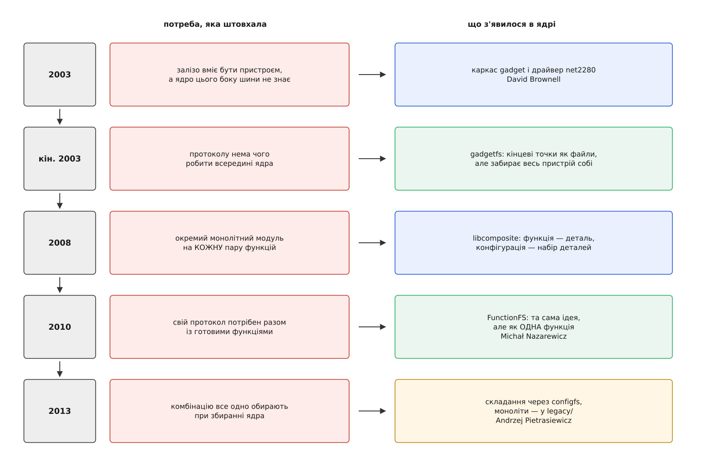

# 📜 Родовід підсистеми gadget

Підсистему, якою Linux прикидається чужим пристроєм, ніхто не спроєктував цілком: вона нарощувалася двадцять років, і кожен її шар — відповідь на цілком конкретну незручність попереднього. Знати цей родовід варто не з поваги до старовини, а тому, що в дереві ядра досі живуть усі покоління одразу: побачивши `g_ether` поруч із каталогами `configfs`, легше зрозуміти, що це не два рівноправні способи, а старий і новий.

## Другого боку шини просто не було

На початку двотисячних Linux умів бути хостом добре, а пристроєм — ніяк. Контролери, здатні бути пристроєм, уже випускалися, і код під них писали — але кожен виробник писав свій, під свій кремній, зі своїми викликами. Функція й залізо в такому коді були одним шматком, тож «зробити накопичувач» на новому контролері означало написати накопичувач наново.

Каркас, що розрубав цей вузол, увів **David Brownell** у 2003 році. Розріз проходив по одній лінії: **знизу драйвер контролера (UDC)**, який знає регістри й нічого не знає про призначення пристрою, **згори драйвер гаджета**, який знає протокол і нічого не знає про регістри. Між ними — вузький набір операцій: виділити заявку, покласти її в кінцеву точку, дізнатися про завершення. Перше залізо, на якому це поїхало, — контролер NET2280 фірми NetChip (згодом PLX Technology); заголовок драйвера `net2280.c` досі несе копірайт 2003 року. Свій документ «USB Gadget API for Linux», датований 20 серпня 2004, Brownell називає першим таким API на Linux — і, наскільки видно з дерева ядра, це не перебільшення.

Вигода від розрізу арифметична. Без нього n функцій на m контролерах вимагають n·m реалізацій; із ним — n плюс m. Уся подальша історія — це повторення того самого прийому на дедалі вищих поверхах.

Каркас увійшов у гілку 2.6, а версії для тодішньої стабільної 2.4 теж існували — документація ядра про це каже прямо, хоч конкретний номер випуску (зазвичай згадують 2.4.23) первинним джерелом підтвердити не вдалося.



*Жоден крок не скасовував попереднього — кожен лише виносив назовні те, що доти було зшите в один шматок.*

## Протокол, якому нема чого робити в ядрі

Перша ж незручність спливла того самого року. Гаджет часто потрібен не для стандартного класу, а для власного протоколу — приладу, тестового стенда, іграшки. Писати заради цього модуль ядра — дорого: помилка валить машину, цикл правки вимагає перезавантаження модуля, а налагоджувати доводиться без звичних інструментів.

Наприкінці 2003 Brownell дописує **gadgetfs** — файлову систему, у якій кінцеві точки стають файлами. Заголовок `inode.c` несе копірайт 2003–2004 Brownell і 2003 Agilent Technologies. Логіка проста до нахабства: програма відкриває `ep0`, записує туди дескриптори, далі читає з нього керуючі запити й відповідає на них; кожна інша кінцева точка — окремий файл із `read()` та `write()`. Протокол виконується звичайним процесом, і його можна ганяти під налагоджувачем.

Ім'я файлу в дереві ядра — `inode.c`, і воно не випадкове: це справді повноцінна файлова система, з власними інодами, а не тонка обгортка над символьним пристроєм. Вибір форми тут і є вся ідея. Файл уміє те, чого не вміє жоден спеціальний виклик: його відкриває звичайний процес зі звичайними правами, його бачить `strace`, його читає й пише будь-яка мова, і жодного нового інтерфейсу вчити не треба.

Разом із свободою gadgetfs приніс обмеження, яке згодом його й поховало: він є драйвером гаджета **цілком**. Він володіє нульовою кінцевою точкою одноосібно, тож поставити поряд із ним готову мережеву функцію чи накопичувач неможливо в принципі. Або весь пристрій ваш, або нічого.

## Комбінаторний вибух

Тим часом ту саму хворобу «усе або нічого» проходила й вбудована половина. Кожен гаджет був монолітом: `g_ether` робив мережеву карту, `g_serial` — послідовний порт, `g_mass_storage` — накопичувач. Монолітність тут не лінощі автора, а неминучість: модуль сам володів нульовою точкою, сам віддавав повний набір дескрипторів, сам роздавав номери інтерфейсів. Дві такі речі не складалися між собою жодним чином — їх треба було зшивати руками, у коді.

І їх зшивали. У дереві з'явилися `g_cdc`, `g_acm_ms`, `g_multi`, `g_nokia` — окремі модулі під окремі комбінації. Ім'я `g_nokia` тут особливо промовисте: цілий модуль ядра існував заради набору функцій одного конкретного телефона. Дорога не мала кінця, бо рахунок тут не додавання, а перебір підмножин:

```
функцій у дереві            n = 10
можливих непорожніх наборів 2¹⁰ − 1 = 1023
написано модулів                   ≈ 15
```

Тобто покрито відсоток із півтора, і кожен новий приладобудівник, якому потрібна своя пара, або чекає, або пише модуль сам.

Розв'язок Brownell готував із 2006-го (копірайт `composite.c` — 2006–2008), а в дерево він потрапив у 2.6.27 восени 2008 року. **Ядро композиції** забирає собі все спільне: нульову точку, стандартні запити, нумерацію. Функції лишається описати саму себе — шматок дескрипторів із порожніми місцями замість номерів. Після цього `g_multi` перестав бути окремою реалізацією і став тонким склеюванням наявних деталей.

## Дві половини нарешті сходяться

Тепер видно порожню клітинку: вбудовані функції вміють складатися, а функція в просторі користувача — ні. gadgetfs лишався все-або-нічого й у нову схему не вкладався. А потреба стала масовою: телефони на Android хотіли водночас накопичувач, мережу й фірмові протоколи на кшталт adb, які в ядрі нікому не потрібні.

У 2010 році **Michał Nazarewicz** із Samsung Electronics пише **FunctionFS** — файл `f_fs.c`, який у заголовку прямо каже «на основі inode.c (GadgetFS)». Це та сама ідея, перекладена мовою композиції: не цілий пристрій, а **одна функція**, яку складають із рештою нарівні. Дескриптори тепер віддає не ядро, а демон — і поки він їх не віддав, гаджет не запуститься. Код увійшов у 2.6.35 (літо 2010).

Розріз тут той самий, що й сім років до того, тільки проведений вище: раніше відділили залізо від протоколу, тепер — межу процесу від межі функції. Питання «у ядрі це чи в програмі» перестало бути питанням про весь пристрій і стало властивістю однієї деталі. Саме тому телефон міг показувати накопичувач із ядра й фірмовий протокол із демона — в одному наборі дескрипторів, без жодного спільного коду між ними.

## Каталоги замість переліку модулів

Лишалася остання жорсткість, і вона була найдошкульніша на практиці. Набір функцій усе одно замикався в момент збирання: щоб додати другий послідовний порт, треба було інший модуль або перезбирання ядра. Складання пристрою вирішувалося там, де сидить розробник ядра, а не там, де стоїть машина.

Перший камінь поклав **Sebastian Andrzej Siewior**: 23 грудня 2012 року він надіслав патч із промовистою назвою «usb/gadget: the start of the configfs interface» — тридцятий у серії з тридцяти. Ідея спиралася на [configfs](topic:unix-linux/configfs): файлову систему, де `mkdir` не показує наявний об'єкт ядра, а створює новий. Складання пристрою з деталей лягає на це один в один — каталог на функцію, символьне посилання на належність.

Довести це до системи випало **Анджеєві Пєтрасевичу** (Andrzej Pietrasiewicz) із Samsung R&D Institute Poland. Його рукою написана документація ядра «Linux USB gadget configured through configfs», датована 25 квітня 2013, — але важливіша за документацію багаторічна чорна робота: кожну наявну функцію треба було переписати під новий інтерфейс, зберігши старий робочим. Сам `drivers/usb/gadget/configfs.c` з'явився в ядрі 3.11 (осінь 2013). У липні 2014 той самий автор розібрав злежану теку: функції поїхали в `function/`, драйвери контролерів — в `udc/`, а старі монолітні гаджети — в **`legacy/`**, де їх видно й досі. Слово «legacy» тут не вирок: модулі лишилися робочими, просто нового туди більше не додають.

Про цей крок часто згадують доповідь на LinuxCon North America 2013 — правдоподібно за часом і авторством, але первинним записом підтвердити не вдалося, тож рахуймо це переказом, а не фактом.

## Що видно з відстані

У родоводі впадає в око одна риса: жоден крок не викидав попереднього. Каркас 2003-го досі несе всю підсистему, gadgetfs досі в дереві, монолітні модулі досі збираються. Кожне покоління лише виносило назовні той шматок, що доти був намертво вшитий усередину: спершу залізо відділили від протоколу, потім спільну частину протоколу — від окремої функції, потім функцію — з ядра в процес, і врешті вибір комбінації — з часу збирання в час роботи.

Тому імена модулів у сучасній системі читаються як археологічний зріз. `net2280` — 2003-й, `gadgetfs` — той самий рік, `libcomposite` — 2008-й, `f_fs` — 2010-й, каталог `usb_gadget` у `configfs` — 2013-й. Усі п'ять шарів працюють одночасно, в одному ядрі, і кожен тримає той розріз, заради якого його свого часу зробили.
