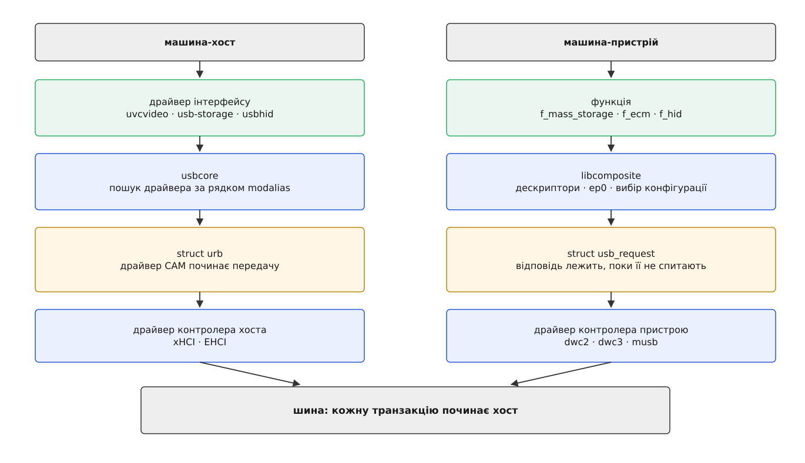
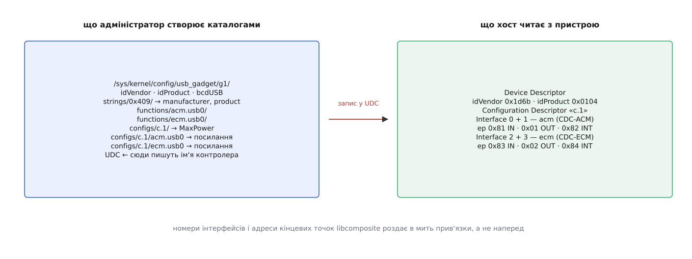
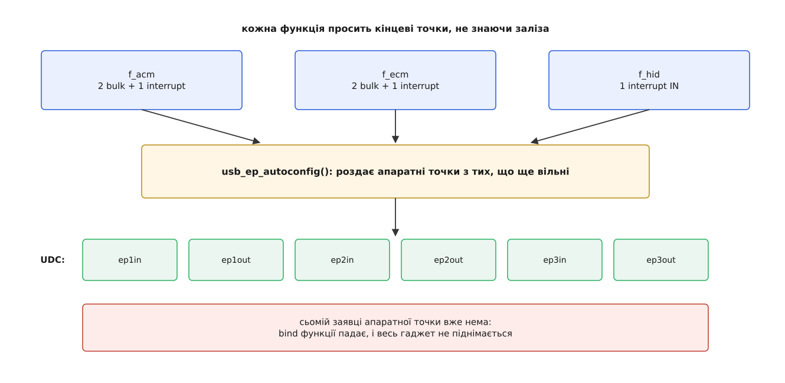

# USB-gadget: Linux у ролі пристрою, а не хоста

<preknowlist>
- [USB у Linux: шина, класи, доступ із простору користувача](book:unix-linux/usb-in-linux) — протилежний бік: `usbcore`, прив'язка драйвера до інтерфейсу, URB як одиниця передачі.
- [Енумерація USB](book:programming/usb-enumeration) — що хост робить із новоприбулим: скидання, адреса, читання дескрипторів, вибір конфігурації.
- [Кінцеві точки USB](book:programming/usb-endpoints) — чотири типи передач і особлива роль нульової точки.
- [Класи USB](book:programming/usb-device-classes) — трійка байтів класу й те, як за нею хост упізнає функцію.
- [Модель пристроїв у sysfs](book:unix-linux/sysfs-device-model) — ядро показує свої об'єкти каталогами з атрибутами.
- [configfs: об'єкти ядра, які створює простір користувача](book:unix-linux/configfs) — на відміну від sysfs, тут `mkdir` не показує наявне, а створює нове.
- [Модулі ядра: завантаження, параметри, залежності](book:unix-linux/kernel-modules) — код підсистеми довантажують у працююче ядро на ходу.
- [Ядро й простір користувача](book:unix-linux/kernel-and-userspace) — межа, через яку програма просить ядро, а не чіпає залізо сама.
</preknowlist>

Візьми маленьку плату — скажімо, Raspberry Pi Zero — і встроми її одним-єдиним кабелем у ноутбук. За кілька секунд у ноутбуці з'явиться новий мережевий інтерфейс, і по ньому вже можна зайти на плату по ssh. А тепер найцікавіше: на самій платі теж працює Linux, теж повноцінний, з тим самим ядром. І він ноутбука не побачив узагалі. У його журналі — жодного рядка про під'єднану річ.

Один кабель, два комп'ютери, і рівно один з них помітив другого. Ця несиметричність — не збіг обставин і не недогляд: вона закладена в самій шині, і саме з неї виростає все, про що йдеться далі.

## Роль вирішує залізо, а не налаштування

На кожному відрізку USB-кабелю є рівно один господар. Він задає питання: «хто ти», «дай», «візьми». Другий бік лише відповідає — і не має права заговорити першим. Питання «а чому не навпаки» безглузде: шина побудована так, що ініціативи знизу просто не існує.

Кому з двох випало питати — визначає кремній. Контролер хоста подає живлення на порт, породжує кадри, роздає адреси, тримає кореневий хаб. Контролер пристрою (у документації ядра — UDC, USB device controller) нічого з цього не вміє. Він уміє одне: підтягнути лінію даних до живлення, щоб сказати «я тут», і далі відповідати на те, що прилетить. Це різні блоки в мікросхемі з різними регістрами.

Тому звичайний настільний комп'ютер не стане пристроєм ніколи. За його роз'ємами стоїть тільки контролер хоста, і жодне налаштування не додасть туди того, чого нема. А в системах на кристалі — там, де на одному кремнії живуть і процесор, і периферія, — блоки `dwc2`, `dwc3`, `musb` часто містять обидві половини й уміють перемикатися; на цьому й тримається [зміна ролей OTG](book:programming/usb-otg). Перевірка чесна й коротка:

```
$ ls /sys/class/udc/
fe980000.usb
```

Порожньо — розмову закінчено, машина може бути тільки хостом. Є ім'я — саме воно й знадобиться далі, бо ним вмикають готовий пристрій.

> 🔧 **Навіщо це.** Розробляти гаджет на машині без UDC все одно можна: модуль `dummy_hcd` створює пару «віртуальний контролер хоста + віртуальний UDC», з'єднану уявним кабелем усередині ядра. Ім'я `dummy_udc.0` з'являється в `/sys/class/udc`, зібраний на ньому пристрій енумерує та сама машина, і в `lsusb` він виглядає як справжній. Вся логіка перевіряється на ноутбуці, і лише прошивка UDC лишається неохопленою.

## Що означає «бути пристроєм» для коду

Коли Linux — хост, його драйвери діють. Драйвер вирішує, що йому потрібні дані, складає запит і кидає його в чергу; шина обслуговує запит, бо хост має право її зайняти. Уся ініціатива йде згори вниз.

Коли Linux — пристрій, ініціативи в нього немає взагалі. Поки хост не спитає, не відбувається нічого. Код гаджета не «робить» — він **готує відповіді наперед і чекає**. Це перевертає модель повністю, і кожна наступна деталь підсистеми випливає саме звідси.

Найперша відповідь, яку треба мати напоготові, — це відповідь на питання «хто ти». Хост шле її нульовою кінцевою точкою, пакетом SETUP, і чекає на відповідь у жорстко обмежений час. Тут спливає обставина, до якої варто звикнути: **пристрій не є нічим, крім своїх дескрипторів**. Немає такої фізичної властивості — «бути клавіатурою». Клавіатура — це та річ, яка на питання про дескриптори віддала певні байти, а далі шле восьмибайтові звіти в переривальну кінцеву точку. Гаджет, який віддасть ті самі байти й ті самі звіти, і буде клавіатурою — з погляду хоста без жодних застережень. Саме на цьому стоїть родина атак, розібрана в темі про [класи USB](book:programming/usb-device-classes): роз'єм не вміє відрізнити флешку від клавіатури, бо відрізняти нічого — річ сама себе оголошує.

Одиниця роботи на боці гаджета — `struct usb_request`. Зовні вона схожа на URB: буфер, довжина, функція-завершувач. Але значення в неї протилежне.

```c
req = usb_ep_alloc_request(ep_in, GFP_KERNEL);
req->buf      = buf;
req->length   = len;
req->complete = tx_done;
ret = usb_ep_queue(ep_in, req, GFP_ATOMIC);   /* повертається негайно */
```

URB, покладений у чергу, означає «піди й забери». `usb_request`, покладений у чергу, означає «ось приготоване; віддай, коли спитають». Завершувач `tx_done` спрацює тоді, коли хост надішле в цю кінцеву точку токен IN — тобто в момент, який гаджет не вибирає й не може наблизити. Якщо хост не питає, заявка просто лежить у черзі скільки завгодно довго.



*Ліворуч — знайомий стек хоста, праворуч — його дзеркало. Різниця не в кількості поверхів, а в тому, що на боці гаджета жоден із них не має права почати передачу.*

Звідси випливає найчастіший симптом, з яким стикаються при налагодженні: гаджет «мовчить», хоча в коді все правильно. Найімовірніше, він не мовчить, а чекає — заявки в черзі, а хост їх не забирає, бо на його боці ніхто не відкрив відповідний вузол.

## Три поверхи підсистеми, і чому їх саме три

Уяви, що кожен вид пристрою пишуть цілком: окремий код мережевої карти під `dwc2`, окремий — під `musb`, окремий — під `dwc3`. Десять контролерів і десять функцій дали б сотню драйверів, дев'яносто з яких — переписування того самого. Плюс друга обставина: справжній пристрій рідко буває чимось одним. Телефон одночасно і накопичувач, і налагоджувальний канал, і мережа. Отже, потрібен ще й той, хто складе кілька функцій в один пристрій і розсудить їх між собою.

Обидві потреби й дали нинішній поділ.

**Драйвер UDC** знає регістри конкретного контролера, апаратні кінцеві точки, переривання й електрику. Назовні він показує однакову для всіх абстракцію: `struct usb_gadget` зі списком `struct usb_ep`. Далі нікого не обходить, чий це кремній.

**Ядро композиції** — модуль `libcomposite`. Контролер обслуговує рівно один драйвер гаджета за раз, і в сучасній збірці цей драйвер — саме воно; звідси й володіння нульовою кінцевою точкою: розбирає стандартні запити, віддає дескриптори, обробляє вибір конфігурації та альтернативного налаштування, а класові запити переадресовує тій функції, якій вони належать.

**Функції** — `f_acm` (послідовний порт), `f_ecm` і `f_ncm` (мережа), `f_mass_storage` (накопичувач), `f_hid`, `f_uac2` (звук), `f_fs`. Кожна знає лише свій протокол і нічого — ні про залізо, ні про сусідів.

Побачити цей поділ у роботі найлегше на шляху одного керуючого запиту. Драйвер UDC вичитує з нульової точки вісім байтів SETUP і передає їх композиції. Стандартні запити — «дай дескриптор», «ось твоя адреса», «увімкни конфігурацію» — вона обробляє сама, бо тільки вона знає складену картину цілком. Запит із позначкою класового та з номером інтерфейсу в полі отримувача вона переадресовує тій функції, якій цей інтерфейс належить.

Функція мусить відповісти негайно: покласти дані у спільну заявку нульової точки й повернути їхню кількість — або повернути від'ємне число, і тоді композиція виставить на точці стан застрягання, що для хоста означає «такого я не вмію». Часу на роздуми стандарт майже не дає, і хост, не дочекавшись, скине шину. Коли відповідь справді потребує часу — наприклад, спитати щось у демона в просторі користувача, — функція повертає окреме значення `USB_GADGET_DELAYED_STATUS`: обіцянку завершити стадію підтвердження пізніше, коли відповідь буде.

Тут з'являється наслідок, який ловить майже кожного, хто вперше збирає гаджет із кількох функцій. Функція не пише свої дескриптори остаточно: вона віддає **шматок** із порожніми місцями замість номерів. Номери інтерфейсів і адреси кінцевих точок проставляє `libcomposite`, і робить це в момент прив'язки, підряд, у тому порядку, у якому функції складені в конфігурацію. Додав ще одну функцію перед наявними — усі номери за нею з'їхали.



*Один інтерфейс на боці адміністратора — каталог, один інтерфейс на боці хоста — запис у дескрипторі. Проміжок між ними заповнює `libcomposite`, і саме тому номери інтерфейсів не можна знати наперед.*

Практично це б'є по правилах на боці хоста: правило [udev](book:unix-linux/udev-rules), написане на номер інтерфейсу, зламається від додавання ще однієї функції у гаджет. Надійно чіпляються за клас інтерфейсу та серійний номер, а не за позицію.

Друге, суворіше обмеження — апаратне. Кінцевих точок у UDC скінченна й невелика кількість: типово шість-вісім програмованих, іноді ще й із обмеженням «ця вміє тільки bulk, а ця тільки interrupt». Функція під час прив'язки просить те, що їй треба, викликом `usb_ep_autoconfig()`, і той видає першу вільну відповідну. Коли вільних не лишилося, виклик повертає порожньо, прив'язка функції падає — і разом із нею не піднімається весь гаджет, залишивши в журналі коротке й малозмістовне повідомлення про помилку.



*Кошторис рахують не в конфігурації, а в залізі. Тому функція, якій не вистачило точки, ламає не себе, а весь пристрій.*

## Чому композицію винесли в каталоги

Спершу гаджет був монолітом. Модуль `g_ether` робив мережеву карту, `g_serial` — послідовний порт, `g_mass_storage` — накопичувач; параметри — рядком у `modprobe`, комбінація — жорстко зашита в код модуля. Хочеш послідовний порт разом із мережею — потрібен окремий модуль саме на цю пару. Кількість потрібних комбінацій росте швидше, ніж хтось готовий їх писати, і будь-яка зміна вимагає перезавантаження модуля. Як підсистема дійшла від першого монолітного каркаса до нинішньої збірки — розказано у вставці [родовід підсистеми gadget](book:unix-linux/usb-gadget/hist-gadget-lineage.md).

Розв'язок виявився не в новому інтерфейсі виклику, а в наявній файловій системі. У `configfs` каталог — не показ наявного, як у sysfs, а **створення нового**: `mkdir` змушує ядро завести об'єкт, символьне посилання виражає належність одного об'єкта іншому, а запис у файл задає властивість. Складання пристрою з деталей лягає на це один в один.

Ось повний робочий сценарій — послідовний порт і мережевий інтерфейс в одному пристрої:

```sh
modprobe libcomposite
mount -t configfs none /sys/kernel/config

cd /sys/kernel/config/usb_gadget
mkdir g1 && cd g1

echo 0x1d6b > idVendor      # Linux Foundation
echo 0x0104 > idProduct     # Multifunction Composite Gadget
echo 0x0200 > bcdUSB        # заявляємо USB 2.0

mkdir -p strings/0x409      # 0x409 — англійська (США)
echo "0123456789"        > strings/0x409/serialnumber
echo "Своя майстерня"    > strings/0x409/manufacturer
echo "Пристрій на Linux" > strings/0x409/product

mkdir -p configs/c.1/strings/0x409
echo "Порт і мережа" > configs/c.1/strings/0x409/configuration
echo 250 > configs/c.1/MaxPower          # міліампери

mkdir functions/acm.usb0                 # послідовний порт
mkdir functions/ecm.usb0                 # мережевий інтерфейс

ln -s functions/acm.usb0 configs/c.1/
ln -s functions/ecm.usb0 configs/c.1/

ls /sys/class/udc                        # → fe980000.usb
echo fe980000.usb > UDC                  # ось тут пристрій оживає
```

Кожен рядок тут — не робота з файлами, а команда ядру. `mkdir g1` створює об'єкт-гаджет; `mkdir functions/acm.usb0` заводить **примірник** функції — крапка розділяє тип і довільне ім'я примірника, тож `acm.usb0` і `acm.usb1` дадуть два незалежні послідовні порти. Символьне посилання каже: «цей примірник входить у цю конфігурацію». А `configs/c.1` — конфігурація з номером 1; пристрій має право оголосити кілька, і хост вибере одну.

Останній рядок стоїть окремо від усіх. До нього нічого не сталося: підтяжка на лінії даних вимкнена, і для хоста в роз'ємі порожньо, навіть якщо кабель уже встромлений. Запис імені контролера в файл `UDC` прив'язує зібрану конструкцію до заліза — і саме тоді `libcomposite` просить у функцій дескриптори, роздає номери, домовляється про кінцеві точки й нарешті вмикає підтяжку. Хост бачить під'єднання й починає питати.

Зворотний бік такий самий простий:

```sh
echo "" > UDC        # хост миттєво бачить від'єднання
```

Це не аварія й не хитрощі: для хоста це те саме, що висмикнутий кабель, а такий стан USB зобов'язаний переживати штатно. Тому змінити конфігурацію гаджета — це відв'язати, перекласти посилання, прив'язати назад. Повний перелік каталогів, атрибутів кожної функції, порядок розбирання гаджета й окремі речі на кшталт дескрипторів для автоматичного впізнавання у Windows зібрано у вставці [контракт configfs-гаджета](book:unix-linux/usb-gadget/api-configfs-gadget.md).

> 🔧 **Навіщо це.** Плата з одним роз'ємом і без мережі — це не глухий кут. Три десятки рядків такого сценарію дають налагоджувальний послідовний порт, мережу до ноутбука й розділ, який на ноутбуці монтується як флешка, — усе одночасно й тим самим кабелем, яким плата живиться. Саме так роблять службові режими промислових і медичних приладів, де другого роз'єму просто немає куди ставити.

## Коли функція має жити в просторі користувача

Не кожен протокол хочеться тримати в ядрі. MTP, яким телефони віддають файли, або налагоджувальний канал adb — це складні, багатостанові протоколи, що змінюються швидше за цикл релізів ядра; писати їх модулем — брати на себе біль, якого можна не брати.

Для цього існує окрема функція `f_fs`, вона ж FunctionFS. Ззовні вона така сама, як інші: примірник створюють каталогом, посиланням вводять у конфігурацію. Але власного протоколу вона не має — вона віддає його програмі.

```sh
mkdir functions/ffs.myfunc
ln -s functions/ffs.myfunc configs/c.1/

mkdir -p /dev/ffs-myfunc
mount -t functionfs myfunc /dev/ffs-myfunc
```

У точці монтування з'явиться єдиний файл `ep0`. Демон відкриває його й пише туди дві порції даних: спершу двійковий блок з описом своїх інтерфейсів і кінцевих точок, далі — рядки. Щойно ядро це прийняло, поруч виникають файли `ep1`, `ep2` — по одному на кінцеву точку, і звичайні `read()`/`write()` на них стають передачами на шині. Той самий `ep0` далі працює каналом подій: із нього демон вичитує повідомлення про прив'язку, увімкнення конфігурації, від'єднання та адресовані йому керуючі запити.

Порядок тут жорсткий і незвичний: **гаджет не прив'яжеться до UDC, поки демон не віддав дескриптори**. Ядро не вигадує їх за програму, а програма може запуститися пізніше — тож запис у `UDC` просто чекатиме. Робочий приклад такої функції — від блоку дескрипторів до циклу обміну й коректної реакції на від'єднання — розібрано у вставці [своя функція через FunctionFS](book:unix-linux/usb-gadget/proj-ffs-function.md).

## Межа ілюзії

Кілька речей гаджет не контролює принципово, і код мусить це передбачати.

**Скидання й від'єднання будь-якої миті.** Хост має право скинути шину коли завгодно; усі заявки, що висіли в чергах, завершаться з помилкою, і завершувачі побачать це посеред обміну. Це не виняткова ситуація, а звичайний робочий стан — той самий, що й на боці хоста.

**Сон шини.** Якщо хост припиняє слати кадри, пристрій зобов'язаний перейти в стан спокою, а живлячись від шини — впасти до одиниць міліампер. Функція дізнається про це окремим зворотним викликом, і те, що вона в цю мить робила, доведеться зупинити; подробиці самого механізму — у темі про [призупинення й відновлення USB](book:programming/usb-suspend-resume).

**Смуга й черга.** Планує передачі хост, і жодним налаштуванням на боці гаджета цього не змінити. Заявлений у дескрипторі `bInterval` — це прохання, а не гарантія; про те, як хост розкладає транзакції по кадрах, ідеться в темі про [драйвер контролера хоста](book:unix-linux/usb-host-controller).

І одна річ, яка спершу дивує. На боці гаджета в `/dev` не з'являється нічого, що представляло б «пристрій, яким ми прикидаємось». Це логічно: гаджет — не пристрій своєї машини, він пристрій **чужої**. Якщо функції потрібні дані, вона бере їх звідкись іще: `f_mass_storage` отримує шлях до файлу-образу через атрибут у configfs, `f_ecm` заводить локальний мережевий інтерфейс `usb0`, `f_fs` віддає все демонові. Свій вузол з'являється лише там, де його створює сама функція для власних потреб, а не як відображення того, чим бачить машину хост.

Саме тут і виявляється головне. Роль — питати чи відповідати — залізо фіксує намертво. А от **чим** машина є всередині цієї ролі, залізо не визначає ніяк: це вибір трьох символьних посилань і кількох чисел у текстових файлах. Та сама плата, той самий кабель, той самий UDC — інші каталоги, і в `lsusb` на іншому кінці з'явиться геть інший пристрій з іншим іменем. Тотожність тут не властивість речі, а дані, які річ про себе повідомляє.
