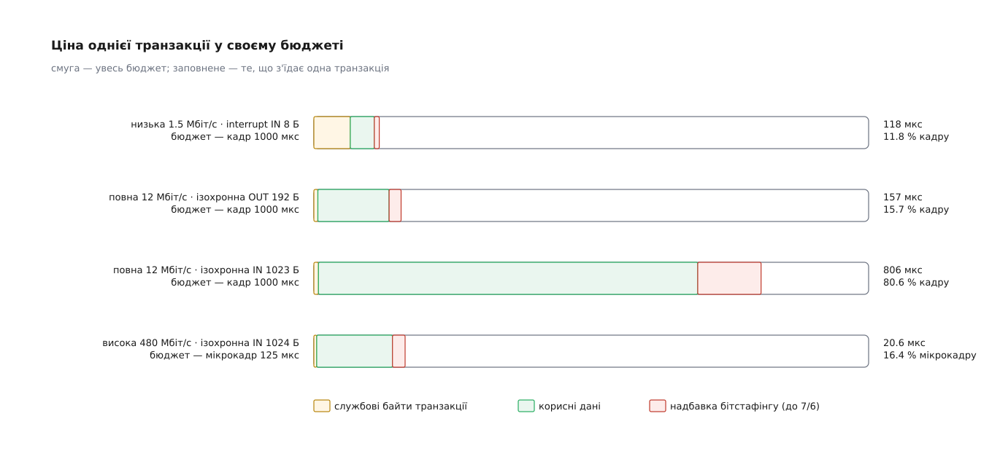
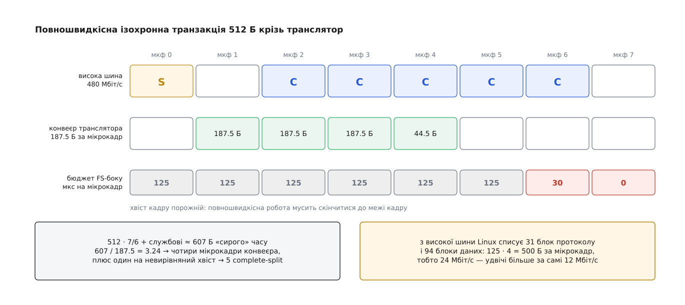

# 🧮 Арифметика періодичної смуги USB

Ізохронна камера не просить смуги — вона називає число, і хост або знаходить для цього числа місце в кожному мікрокадрі, або відмовляє ще до першого байта. Порахуємо це число до кінця: від бітової швидкості до тієї межі, за якою команда Configure Endpoint повертає Bandwidth Error.

## Скільки байтів узагалі вміщається

Бюджет — це просто добуток швидкості на тривалість проміжку розкладу. Повна й низька швидкості живуть у кадрі завдовжки мілісекунду, висока — у мікрокадрі завдовжки 125 мкс.

```
низька       1.5 Мбіт/с · 1 мс      = 1500 біт    = 187.5 байта на кадр
повна         12 Мбіт/с · 1 мс      = 12000 біт   = 1500 байтів на кадр
висока       480 Мбіт/с · 125 мкс   = 60000 біт   = 7500 байтів на мікрокадр
SuperSpeed     5 Гбіт/с · 125 мкс   (8b/10b)      = 62500 байтів на мікрокадр
```

Ці числа — стеля, якої не буває. З них треба відняти дві різні речі, кожна з яких віднімає більше, ніж здається, а на решту накласти ще й окрему стелю.

## Що з'їдає сама транзакція

Одна транзакція — це не пакет даних, а щонайменше два пакети, а частіше три: токен від хоста, дані, рукостискання. Кожен пакет несе поле синхронізації, ідентифікатор PID, контрольну суму й ознаку кінця, а між пакетами шина мусить розвернутися — це теж час. Структуру полів розібрано окремо: [протокольний рівень USB](topic:programming/usb-protocol-layer) — те, з яких саме пакетів складається транзакція й що в кожному з них лежить.

Складати ці поля вручну не потрібно: стандарт дає готові суми на транзакцію, і ядро Linux несе їх буквально — у функції `usb_calc_bus_time()`.

```
висока швидкість, ізохронна (без рукостискання)     38 байт-часів = 304 біти
висока швидкість, із рукостисканням                 55 байт-часів = 440 бітів
повна швидкість, ізохронна OUT                    6265 нс ≈ 75 біт-часів
повна швидкість, ізохронна IN                     7268 нс ≈ 87 біт-часів
повна швидкість, із рукостисканням                9107 нс ≈ 109 біт-часів
низька швидкість, interrupt IN         64060 нс + 2 · 333 нс на налаштування хаба
затримка хоста, повна й низька швидкість                1000 нс
```

Впадає в око розрив між рядками. На високій швидкості службові 55 байт-часів — це 0.92 мкс із 125. На низькій самі лише службові поля коштують 64 мкс — шістнадцяту частину цілого кадру, ще нічого не передавши. Причина одна: службові поля мають ту саму довжину в бітах, а біт на низькій швидкості триває в 320 разів довше, ніж на високій.

Два доданки по 333 нс у низькошвидкісному рядку — окрема плата за те, що власної шини в низької швидкості немає. Вона їде всередині повношвидкісного кадру, і перед кожною такою транзакцією хост шле преамбулу, за якою хаби перемикають свої низові порти на повільний режим; перемикання туди й назад коштує часу, і його теж закладено в бюджет.

## Бітстафінг: множник 7/6

Друге відрахування ховається в самому кодуванні. USB передає біти в NRZI й, щоб приймач не загубив синхронізації на довгій одноманітності, вставляє нуль після шести одиниць поспіль — [фізичне кодування USB](topic:programming/usb-physical/math-nrzi.md) показує, звідки береться саме шістка. Наслідок для арифметики: у найгіршому разі на кожні шість бітів даних шина везе сім.

Планувати можна тільки за найгіршим випадком — розклад складають наперед, а які байти піде везти камера, ніхто не знає. Тому ядро рахує довжину даних із множником 7/6 і додає близько трьох бітів запасу:

```
ціна(n байтів) = службові + біт-час · (3.1 + ⌊7 · 8 · n / 6⌋)

висока швидкість, ізохронний пакет 1024 Б:
⌊7 · 8 · 1024 / 6⌋ = ⌊9557.3⌋ = 9557 бітів
(304 + 3.1 + 9557) · 2.083 нс = 20547 нс ≈ 20.55 мкс
```



*Що повільніша швидкість, то більшу частку смуги з'їдає незмінна службова частина.*

Тепер видно, скільки насправді стоїть за «сирими» 7500 байтами:

```
без стелі:   125 мкс / 20.55 мкс = 6.08 → 6 пакетів = 6144 Б з 7500 (82 %)
bulk 512 Б:  ⌊7 · 8 · 512 / 6⌋ = 4778;  (440 + 3.1 + 4778) · 2.083 нс = 10.87 мкс
             125 / 10.87 = 11.5 → 11 транзакцій = 5632 Б = 45.1 МБ/с
```

Звідси й розбіжність зі звичною цифрою «тринадцять пакетів по 512 у мікрокадрі»: тринадцять виходить, лише якщо бітстафінгу немає зовсім.

## Стелі 90 % і 80 %

Періодичним кінцевим точкам не віддають увесь бюджет. На повній швидкості їм дозволено щонайбільше 90 % кадру, на високій — 80 % мікрокадру. Причина не бюрократична: control-передачі — це те, чим система енумерує новий пристрій і рятує застряглий. Якщо ізохронний потік з'їсть шину дощенту, рятувати її буде нічим — не лишиться місця навіть на керуючий запит.

Ядро тримає ці стелі як звичайні числа. Спершу — ліміт у «блоках», де блок дорівнює 1 байту на повній швидкості, 4 байтам на високій і 16 на SuperSpeed:

```
1500 · 6/7 = 1285.7                     → FS_BW_LIMIT = 1285   (кадр)
7500 · 6/7 = 6428.6;  6428.6 / 4 = 1607 → HS_BW_LIMIT = 1607   (мікрокадр)
62500 / 16 = 3906.25                    → SS_BW_LIMIT = 3906   (мікрокадр)
```

Множник 6/7 у перших двох рядках — той самий бітстафінг, уже вирахуваний із самого ліміту; у SuperSpeed його немає, бо там кодування інше, і ліміт дорівнює цілому мікрокадру. А відсоток резерву віднімають зверху:

```
⌈20 · 1607 / 100⌉ = 322 блоки
1607 − 322 = 1285 блоків = 5140 байтів на мікрокадр
```

П'ять із половиною кілобайтів замість семи з половиною — оце і є справжня стеля періодичного трафіку на високій швидкості.

## Інтервал буває лише степенем двійки

Періодична кінцева точка називає не лише розмір пакета, а й період опитування — поле `bInterval` дескриптора ([кінцеві точки USB](topic:programming/usb-endpoints): односторонній канал зі своїм типом передач, розміром пакета й бажаним періодом). У xHCI період закодовано полем Interval, і значення N означає обслуговування раз на 2ᴺ · 125 мкс. Проміжних значень немає — тільки степені двійки.

Округлюють **униз**, і це не дрібниця. Пристрій, що просив 10 мс, дістає 8:

```
bInterval = 10 кадрів = 10 мс = 80 мікрокадрів
fls(80) − 1 = 7 − 1 = 6   →   2⁶ = 64 мікрокадри = 8 мс
```

Округлення вгору порушило б обіцянку затримки, дане ж униз лише додає пристроєві опитувань — і саме тому звичайна миша з `bInterval = 10` опитується не сто разів на секунду, а сто двадцять п'ять. Платить за це розклад: кінцева точка займає смугу так, ніби просила 8 мс, тобто на чверть більше, ніж хотіла.

## Як складають точки з різними періодами

Періоди в розкладі різні, і просто додати ціни не можна: точка з інтервалом 1 бере своє в кожному мікрокадрі, а точка з інтервалом 64 — лише в одному з шістдесяти чотирьох. Розкласти рідкісні по вільних місцях цілком реально, і апаратний планувальник це вміє.

Перевірка перед запуском усе одно рахує інакше. Вона питає не «чи знайдеться розклад», а «чи витримає найгірший мікрокадр»: ціни точок із рідшими періодами зводять до найщільнішого інтервалу, ніби всі вони зійшлися в одному місці. У ядрі це так і названо — найгірший сценарій розкладу для будь-якого одного інтервалу.

Обережність не зайва. Розклад живий: пристрої вмикаються, засинають, міняють альтернативні налаштування, і збіг, який сьогодні не стається, завтра станеться. Дозволити конфігурацію, яка тримається лише на вдалому розташуванні, означало б віддати ізохронний потік на волю випадку — а саме він і не переживає пропущеного мікрокадру. Тому далі ми складаємо ціну клавіатури з періодом 8 мс і ціну камери, що працює в кожному мікрокадрі, так, ніби вони зустрічаються постійно.

## Повна й низька швидкість крізь транслятор

Повношвидкісний пристрій за високошвидкісним хабом розмовляє не з хостом, а з транслятором транзакцій усередині хаба — механізм описано в [USB-хабі](topic:programming/usb-hub). Хост шле транслятору start-split, той сам проводить повільну транзакцію на своєму боці, а потім хост забирає результат серією complete-split. Через це такий пристрій витрачає **два бюджети одразу**.

Перший — повношвидкісний бік транслятора. Ядро тримає його розклад по мікрокадрах:

```
max_tt_usecs = { 125, 125, 125, 125, 125, 125, 30, 0 }
сума = 6 · 125 + 30 = 780 мкс на кадр
```

Хвіст обнулено не з обережності: повношвидкісна робота мусить скінчитися до межі кадру, а транзакція, почата надто пізно, перетнула б її. Отже на повний бік транслятора припадає 780 мкс, а не 900.

Одразу видно наслідок, об який б'ються на практиці. Максимальний ізохронний пакет повної швидкості — 1023 байти, а поміститься менше:

```
ціна(n) = 7268 + 1000 + 83.54 · (3.1 + ⌊28n/3⌋) нс ≤ 780000 нс
83.54 · (3.1 + BT) ≤ 780000 − 8268 = 771732   →   BT ≤ 9234
28n/3 ≤ 9234                                  →   n ≤ 989
```

Повношвидкісна камера на максимальному пакеті за високошвидкісним хабом не запуститься ніколи — не через хаб, а через арифметику.

Другий бюджет — сама висока шина, де лежать split-транзакції. Скільки їх? Конвеєр транслятора йде зі швидкістю 12 Мбіт/с, тобто 187.5 байта за мікрокадр; повільна транзакція займає стільки мікрокадрів, скільки в неї вміщається її подовжений бітстафінгом обсяг, і ще один — бо початок транзакції не вирівняний по межі мікрокадру.



*Хост мусить зарезервувати complete-split у кожному мікрокадрі, у якому відповідь може прийти, — навіть якщо прийде вона в одному.*

Саме тому ядро списує з високої шини помітно більше, ніж пристрій здатен спожити: 31 блок чистого протоколу плюс 94 блоки даних, разом 125 блоків по 4 байти — 500 байтів за мікрокадр, або 8.3 мкс. У перерахунку на секунду це 32 Мбіт/с — майже втричі більше за ті 12 Мбіт/с, якими живе сам пристрій.

## Де саме вмикається Bandwidth Error

Складімо все на одній високошвидкісній шині. Стеля мікрокадру — 0.80 · 125 = 100 мкс.

```
камера A, ізохронна, 3 × 1024 Б    3 · 20.55 = 61.6 мкс     разом  61.6
клавіатура за транслятором                    8.3 мкс       разом  69.9
миша за транслятором                          8.3 мкс       разом  78.2
                                    лишилося 100 − 78.2 = 21.8 мкс
камера B, 1 × 1024 Б                         20.55 мкс      разом  98.8  ✔
камера B, 2 × 1024 Б                         41.1  мкс      разом 119.3  ✘
```

Повільний бік транслятора при цьому й не напружується: низькошвидкісна клавіатура з восьмибайтовим звітом коштує 118 мкс, миша з чотирибайтовим — 93 мкс, разом 211 із дозволених 780.

Межа проходить рівно між двома альтернативними налаштуваннями другої камери. Поки вона просить один пакет на мікрокадр, сума 98.8 мкс уміщається під стелю, і `usb_set_interface()` мовчки спрацьовує. Варто застосункові попросити вищу якість — інтерфейс перемикається на два пакети, сума стає 119.3 мкс, контролер відповідає на Configure Endpoint кодом Bandwidth Error, драйвер перекладає його в `-ENOSPC`, і на екрані з'являється «не вдалося запустити відео».

Показово, у чому саме тут не вистачило місця. Дві камери разом просять 4096 байтів корисних даних на мікрокадр — 55 % від «сирих» 7500. Решту з'їли службові поля, надбавка бітстафінгу, двадцятивідсотковий резерв на control і подвійна плата за двох повільних пристроїв, які самі за секунду перекажуть менше, ніж камера за один мікрокадр.
