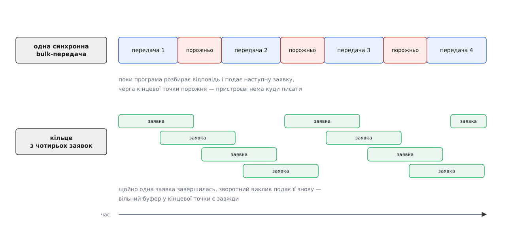

# ⚙️ Пристрій без драйвера: робоча програма на libusb

Плата з власною прошивкою оголошує один інтерфейс класу `ff` і пару bulk-точок — жоден драйвер у ядрі до неї не прив'яжеться, тож увесь обмін доводиться писати самому. Зберемо на C програму, яка знаходить цю плату серед кількох однакових, забирає інтерфейс собі, безперервно качає з нього потік і переживає висмикнутий кабель.

## Задача

У списку `lsusb` плата видна як `1209:0001`: ідентифікатор виробника `0x1209` роздає спільнота pid.codes для відкритого заліза, а `0x0001` — з їхнього діапазону, зарезервованого під тестування. Інтерфейс у неї один, номер `0`, клас `ff`; у ньому дві bulk-кінцеві точки — `0x01` на запис у пристрій і `0x81` на читання з нього. Протокол простий: коротка команда в `0x01`, коротка відповідь із `0x81`. Окремо плата безперервно шле телеметрію в ту саму `0x81`, і жодного відліку загубити не можна.

Від програми хочемо чотирьох речей: щоб вона запускалася звичайним користувачем без `sudo`, брала саме свою плату, не падала від висмикнутого кабелю й підхоплювала його назад.

## Ідея: беруть три речі, а «пристрою» немає

У коді на libusb немає одного об'єкта «пристрій». Є дві різні речі з дуже різним часом життя. `libusb_device` — це опис, знайдений переліком: дешевий, з лічильником посилань, живе, доки тримають список. `libusb_device_handle` — це вже відкритий [файловий дескриптор](topic:unix-linux/file-descriptor) на `/dev/bus/usb/BBB/DDD`, і лише він дає право щось передавати.

Розрізняти їх варто через те, що з ними робить висмикнутий кабель. Дескриптор не псується: як об'єкт мови C він лишається цілим, а от кожен виклик над ним відтепер повертає `LIBUSB_ERROR_NO_DEVICE`. Полагодити нічого не можна — зникнення не оборотне. Звідси кістяк усієї програми: знайти → відкрити → забрати інтерфейс → працювати → на `NO_DEVICE` віддати все назад і шукати наново. Ніяких повторних спроб над мертвим дескриптором: його закривають.

> 🔧 **Навіщо це.** Найдовші пошуки в такому коді починаються з питання «чому воно працює під `sudo` і не працює без». Відповідь майже завжди в одному з двох кодів: `LIBUSB_ERROR_ACCESS` — не пустили до файлу, `LIBUSB_ERROR_BUSY` — файл відкрили, але інтерфейс уже чужий. Вони приходять з різних кроків і лікуються по-різному, тож найкорисніша річ у коді — друкувати `libusb_error_name(rc)` на кожному кроці окремо, а не одне спільне «не вдалося».

## Знайти саме свою плату

Пара VID/PID називає модель, а не примірник. Дві однакові плати в одній машині — і перелік віддасть обидві, а котра з них перша, залежить від порядку енумерації в ядрі й міняється між увімкненнями. Надійно розрізняє їх серійний номер, але дістати його дорожче: у дескрипторі пристрою лежить не рядок, а його індекс `iSerialNumber`, тимчасом як сам рядок читається окремою керуючою передачею — тобто вже через відкритий дескриптор. Тому фільтрують у два кроки: спершу дешево, за VID/PID, узагалі нічого не відкриваючи, а серійний номер звіряють лише в тих, хто пройшов.

```c
/* vendorio.c — інтерфейс класу ff у своїх руках
   збирання:  cc -O2 -Wall -o vendorio vendorio.c -lusb-1.0            */
#include <libusb-1.0/libusb.h>
#include <signal.h>
#include <stdio.h>
#include <stdlib.h>
#include <string.h>
#include <sys/time.h>

#define VID     0x1209      /* pid.codes: VID для відкритого заліза */
#define PID     0x0001      /* тестовий PID із їхнього діапазону    */
#define IFACE   0
#define EP_OUT  0x01
#define EP_IN   0x81
#define RING    4           /* скільки заявок тримаємо в польоті    */

static volatile sig_atomic_t running = 1;
static void on_sigint(int sig) { (void)sig; running = 0; }

static libusb_device_handle *find_device(libusb_context *ctx, const char *serial)
{
	libusb_device **list;
	libusb_device_handle *found = NULL;
	ssize_t n = libusb_get_device_list(ctx, &list);

	if (n < 0)
		return NULL;

	for (ssize_t i = 0; i < n && !found; i++) {
		struct libusb_device_descriptor d;
		libusb_device_handle *h;
		unsigned char sn[64];
		int rc;

		if (libusb_get_device_descriptor(list[i], &d) != 0)
			continue;
		if (d.idVendor != VID || d.idProduct != PID)
			continue;

		rc = libusb_open(list[i], &h);
		if (rc != 0) {
			/* Чужа плата з тим самим VID/PID, до якої нас не пустили,
			   не привід кидати пошук власної.                        */
			fprintf(stderr, "%d-%d: %s\n",
			        libusb_get_bus_number(list[i]),
			        libusb_get_device_address(list[i]),
			        libusb_error_name(rc));
			continue;
		}

		if (!serial) {
			found = h;
			continue;
		}
		/* iSerialNumber — це індекс, а не рядок: по ньому йде
		   окрема керуюча передача до самого пристрою.        */
		if (d.iSerialNumber &&
		    libusb_get_string_descriptor_ascii(h, d.iSerialNumber,
		                                       sn, sizeof sn) > 0 &&
		    strcmp((char *)sn, serial) == 0)
			found = h;
		else
			libusb_close(h);
	}

	libusb_free_device_list(list, 1);   /* 1 — відпустити посилання */
	return found;
}
```

## Забрати інтерфейс

Забирання виняткове: інтерфейс належить або драйверові в ядрі, або одному процесові в просторі користувача, і третього стану немає. У класу `ff` претендента з ядра не буде, але писати код так, наче його не буде ніколи, — погана ставка: та сама програма завтра піде на пристрій, де потрібний інтерфейс уже тримає `cdc_acm` чи `ftdi_sio`.

`libusb_set_auto_detach_kernel_driver()` — вимикач на самому дескрипторі, а не глобальне налаштування. Увімкнений, він відчіпляє ядерний драйвер саме того інтерфейса, який ми забираємо, і — що важливіше — сам чіпляє його назад під час `libusb_release_interface()`. Поза Linux такого механізму немає, і виклик чесно повертає `LIBUSB_ERROR_NOT_SUPPORTED`; тоді те саме роблять руками.

```c
static int claim_iface(libusb_device_handle *h)
{
	int rc = libusb_set_auto_detach_kernel_driver(h, 1);

	if (rc == LIBUSB_ERROR_NOT_SUPPORTED) {          /* не Linux */
		if (libusb_kernel_driver_active(h, IFACE) == 1)
			libusb_detach_kernel_driver(h, IFACE);
	}

	rc = libusb_claim_interface(h, IFACE);
	if (rc == LIBUSB_ERROR_BUSY)
		fprintf(stderr, "інтерфейс %d зайнятий: ядерний драйвер "
		        "або інший примірник цієї ж програми\n", IFACE);
	else if (rc != 0)
		fprintf(stderr, "claim: %s\n", libusb_error_name(rc));
	return rc;
}

/* Один синхронний обмін: команда → відповідь. */
static int ask(libusb_device_handle *h,
               const unsigned char *cmd, int cmd_len,
               unsigned char *rsp, int rsp_cap, int *rsp_len)
{
	int sent = 0;
	int rc = libusb_bulk_transfer(h, EP_OUT, (unsigned char *)cmd,
	                              cmd_len, &sent, 1000);
	if (rc != 0)
		return rc;
	if (sent != cmd_len)          /* половина команди гірша за жодну */
		return LIBUSB_ERROR_IO;

	return libusb_bulk_transfer(h, EP_IN, rsp, rsp_cap, rsp_len, 1000);
}
```

Три речі в цьому синхронному шматку кусаються найчастіше.

Лічильник `sent` заповнюється навіть тоді, коли виклик повернув `LIBUSB_ERROR_TIMEOUT`: libusb ріже довгу передачу на шматки, і час міг вийти на середині. Тому таймаут на записі не означає, що пристрій нічого не отримав, — він означає лише, що ми більше не чекаємо.

Короткий пакет — не помилка, а розділовий знак. У bulk немає поля довжини: кінцем повідомлення служить пакет, коротший за `wMaxPacketSize`. Звідси класична пастка — повідомлення рівно на 512 байтів: пристрій вислав повний пакет і замовк, хост вважає, що продовження ще буде, і чекає до таймаута. Лікують це з боку прошивки, дописуючи пакет нульової довжини; сам механізм — у темі про [кінцеві точки USB](topic:programming/usb-endpoints). Для програми на хості звідси випливає інше: буфер просять кратний розміру пакета, а сам розмір беруть не з голови, а з дескриптора — `libusb_get_max_packet_size()`.

І про нуль: `timeout` у нулі — це не «не чекати», а «чекати вічно». Синхронний виклик із нулем на кінцевій точці, куди пристрій зараз нічого не шле, вішає потік намертво, і скасувати його ззовні нема чим.

## Потік: чому синхронного циклу не досить

Телеметрію можна було б забирати тим самим `libusb_bulk_transfer()` у циклі — так і роблять, доки не помічають дірок у даних. Річ не у швидкості коду. Між двома синхронними викликами в черзі кінцевої точки немає жодного запиту, а без запиту хост не питає пристрій узагалі: дані по bulk ідуть лише у відповідь на маркер від хоста. Немає маркера — відліки лишаються в буфері плати, і коли той переповниться, нові нікуди дівати.



*Ліки — не швидший цикл, а кілька заявок у польоті одночасно.*

`libusb_submit_transfer()` кладе заявку в чергу й негайно повертається, а коли передача відбудеться, libusb покличе зворотний виклик — із того потоку, що качає події. Подавши чотири заявки й повторно подаючи кожну прямо в її ж зворотному виклику, дістаємо кільце, у якому черга не порожніє ніколи.

```c
struct stream {
	libusb_context         *ctx;
	libusb_device_handle   *h;
	struct libusb_transfer *ring[RING];
	int  inflight;
	int  alive;              /* 0 — пристрій зник або нас спиняють  */
	int  pkt;                /* wMaxPacketSize кінцевої точки       */
	unsigned char stalled;   /* точку треба розтикати в головному циклі */
};

static void consume(const unsigned char *data, int len)
{
	printf("[.] потік: %d байтів, перший 0x%02x\n", len, len ? data[0] : 0);
}

static void LIBUSB_CALL on_done(struct libusb_transfer *t)
{
	struct stream *s = t->user_data;

	switch (t->status) {
	case LIBUSB_TRANSFER_COMPLETED:
		consume(t->buffer, t->actual_length);   /* actual_length, не length */
		break;
	case LIBUSB_TRANSFER_TIMED_OUT:
		break;                                  /* просто нічого не було */
	case LIBUSB_TRANSFER_STALL:
		s->stalled = t->endpoint;   /* синхронних викликів тут не можна */
		s->alive = 0;
		break;
	default:                        /* NO_DEVICE, CANCELLED, ERROR… */
		s->alive = 0;
		break;
	}

	if (s->alive && libusb_submit_transfer(t) == 0)
		return;                     /* пішла в чергу знову — не чіпаємо */

	for (int i = 0; i < RING; i++)
		if (s->ring[i] == t)
			s->ring[i] = NULL;
	s->inflight--;
	libusb_free_transfer(t);        /* FREE_BUFFER звільнить і буфер */
}

static int stream_start(struct stream *s)
{
	s->alive = 1;
	for (int i = 0; i < RING; i++) {
		struct libusb_transfer *t = libusb_alloc_transfer(0);
		int len = s->pkt * 8;
		unsigned char *buf = t ? malloc(len) : NULL;

		if (!buf) {
			libusb_free_transfer(t);
			break;
		}
		libusb_fill_bulk_transfer(t, s->h, EP_IN, buf, len,
		                          on_done, s, 0);   /* 0 — без таймауту */
		t->flags = LIBUSB_TRANSFER_FREE_BUFFER;

		if (libusb_submit_transfer(t) != 0) {
			libusb_free_transfer(t);
			break;
		}
		s->ring[i] = t;
		s->inflight++;
	}
	return s->inflight;
}

static void stream_stop(struct stream *s)
{
	s->alive = 0;                  /* зворотні виклики більше не подають */
	for (int i = 0; i < RING; i++)
		if (s->ring[i])
			libusb_cancel_transfer(s->ring[i]);

	/* Скасування лише просить. Заявка жива, поки не прийшов її
	   зворотний виклик, — тож качаємо події, доки не спорожніє.  */
	while (s->inflight > 0) {
		struct timeval tv = { 1, 0 };
		if (libusb_handle_events_timeout_completed(s->ctx, &tv, NULL) < 0)
			break;
	}
}
```

Зворотний виклик бігає в контексті обробки подій, і це накладає жорстку заборону: усередині нього не можна кликати нічого із синхронного боку libusb — ні `libusb_bulk_transfer()`, ні `libusb_clear_halt()`, ні читання рядкових дескрипторів. Усі вони самі чекають на події, а потік уже всередині обробника подій. Саме тому застряглу кінцеву точку ми не розтикаємо на місці, а лише запам'ятовуємо в полі `stalled`.

## Гаряче під'єднання

Про від'єднання програма дізнається задарма: заявки в польоті завершуються зі статусом `LIBUSB_TRANSFER_NO_DEVICE`. А от щоб дізнатися про появу, доводиться підписатися.

```c
static int LIBUSB_CALL on_hotplug(libusb_context *ctx, libusb_device *dev,
                                  libusb_hotplug_event ev, void *user)
{
	(void)ctx; (void)dev; (void)ev;
	/* Тут лише прапорець: ніякого відкриття й ніякого очікування. */
	*(int *)user = 1;
	return 0;                    /* 0 — лишити підписку, 1 — зняти */
}

int main(void)
{
	libusb_context *ctx = NULL;
	libusb_hotplug_callback_handle cbh;
	struct stream s = { 0 };
	int arrived = 0, rc;

	signal(SIGINT, on_sigint);

#if defined(LIBUSB_API_VERSION) && LIBUSB_API_VERSION >= 0x0100010A
	rc = libusb_init_context(&ctx, NULL, 0);   /* із 1.0.27 */
#else
	rc = libusb_init(&ctx);                    /* до 1.0.27 іншого не було */
#endif
	if (rc != 0 || !libusb_has_capability(LIBUSB_CAP_HAS_HOTPLUG))
		return 1;
	s.ctx = ctx;

	libusb_hotplug_register_callback(ctx,
		LIBUSB_HOTPLUG_EVENT_DEVICE_ARRIVED,
		LIBUSB_HOTPLUG_ENUMERATE,       /* покликати й на вже під'єднані */
		VID, PID, LIBUSB_HOTPLUG_MATCH_ANY,
		on_hotplug, &arrived, &cbh);

	while (running) {
		struct timeval tv = { 0, 200000 };
		libusb_handle_events_timeout_completed(ctx, &tv, NULL);

		if (arrived && !s.h) {
			arrived = 0;
			s.h = find_device(ctx, "A7F3");
			if (s.h && claim_iface(s.h) == 0) {
				unsigned char cmd[] = { 0x01, 0x00 }, rsp[64];
				int got = 0;

				if (ask(s.h, cmd, sizeof cmd, rsp, sizeof rsp, &got) == 0)
					printf("[i] відповідь: %d байтів\n", got);

				s.pkt = libusb_get_max_packet_size(
						libusb_get_device(s.h), EP_IN);
				if (s.pkt <= 0)
					s.pkt = 512;
				stream_start(&s);
			} else if (s.h) {
				libusb_close(s.h);
				s.h = NULL;
			}
		}

		if (s.h && !s.alive) {
			stream_stop(&s);
			if (s.stalled) {                 /* точка застрягла, плата жива */
				libusb_clear_halt(s.h, s.stalled);
				s.stalled = 0;
				stream_start(&s);
			} else {
				printf("[-] пристрій зник — закриваю дескриптор\n");
				libusb_release_interface(s.h, IFACE);
				libusb_close(s.h);
				s.h = NULL;
			}
		}
	}

	if (s.h) {
		stream_stop(&s);
		libusb_release_interface(s.h, IFACE);  /* авто-відчеплення поверне драйвер */
		libusb_close(s.h);
	}
	libusb_hotplug_deregister_callback(ctx, cbh);
	libusb_exit(ctx);
	return 0;
}
```

Найкорисніша дрібниця тут — прапорець `LIBUSB_HOTPLUG_ENUMERATE`. З ним libusb покличе зворотний виклик і на ті пристрої, що вже під'єднані на момент підписки. Тобто «знайти при старті» й «дочекатися під'єднання» стають одним і тим самим кодом, а не двома гілками, які завжди розходяться в поведінці.

Друга дрібниця: події гарячого під'єднання приходять, лише поки хтось качає `libusb_handle_events*`. Програма, що просто спить, не дізнається нічого. Якщо в застосунку вже є власний цикл, libusb віддає свої дескриптори через `libusb_get_pollfds()` — тоді його події вплітають у [наявний цикл готовності](topic:unix-linux/select-poll-epoll) замість окремого потоку.

```sh
$ cc -O2 -Wall -o vendorio vendorio.c -lusb-1.0
$ ./vendorio
[i] відповідь: 6 байтів
[.] потік: 512 байтів, перший 0xa5
[-] пристрій зник — закриваю дескриптор
[.] потік: 512 байтів, перший 0xa5
```

Кабель висмикнули перед третім рядком і встромили назад перед четвертим — програма цього навіть не назвала подією, бо для неї це звичайний оберт головного циклу.

## Пастки

**`LIBUSB_ERROR_ACCESS` лікують не через `sudo`.** Вузли `/dev/bus/usb` за замовчуванням доступні всім на читання й нікому, крім `root`, на запис, а будь-яка передача — це запис. Дозвіл звужують [правилом udev](topic:unix-linux/udev-rules) до конкретних VID/PID. Тонкість, на якій втрачають години: правило спрацьовує на подію від ядра, тож поки пристрій не перевтикнули, той самий код під тим самим користувачем поводиться по-різному до й після.

**`LIBUSB_ERROR_BUSY` не завжди про ядро.** Забирання виняткове й між процесами: другий примірник вашої ж програми дістане `BUSY` так само, як дістав би через ядерний драйвер. Розрізняє їх `libusb_kernel_driver_active()` — у другому випадку він чесно скаже, що драйвера немає.

**Скасувати — не означає звільнити.** `libusb_cancel_transfer()` лише просить; заявка жива, поки не прийшов її зворотний виклик зі статусом `LIBUSB_TRANSFER_CANCELLED`. Звільнити її раніше — звільнити пам'ять, у яку ядро ще писатиме. Тому вихід виглядає саме так: скасувати всі, качати події, доки лічильник у польоті не впаде до нуля, і тільки тоді `libusb_release_interface()`, `libusb_close()`, `libusb_exit()` — у порядку, зворотному до забирання.

**`actual_length`, а не `length`.** У заявці `length` — скільки ми просили, `actual_length` — скільки прийшло. Плутанина між ними дає найтихішу з можливих помилок: програма щоразу розбирає повний буфер, дописуючи до справжніх даних хвіст із попередньої передачі.

**Виклик над зниклим пристроєм не повторюють.** `LIBUSB_ERROR_NO_DEVICE` — не тимчасова невдача. Дескриптор закривають, покажчик обнулюють і чекають на нове під'єднання; навіть якщо ту саму плату встромити в те саме гніздо, це буде інша адреса на шині й інший файл у `/dev/bus/usb`, а отже інший дескриптор.
