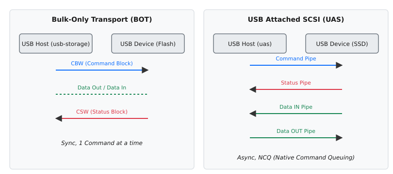

# Накопичувачі по USB: клас mass storage, драйвери usb-storage і uas

<preknowlist>
- [USB у Linux](topic:unix-linux/usb-in-linux) — пристрій сам описує себе дескрипторами, а обмін іде через ендпойнти під орудою хост-контролера.
- [Підсистема SCSI](topic:unix-linux/scsi-subsystem) — команда до диска це пакет байтів, який може везти будь-який транспорт.
- [Модель блокового пристрою](topic:unix-linux/block-device-model) — накопичувач видно як пронумеровані сектори за вузлом на кшталт `/dev/sdb`.
</preknowlist>

Коли ви під'єднуєте звичайну флешку, зовнішній жорсткий диск чи високошвидкісний зовнішній NVMe SSD через порт USB, операційна система якимось чином повинна побачити їх як стандартні блокові пристрої. У світі Linux такі пристрої магічно з'являються у вигляді `/dev/sda` чи `/dev/sdb`, наче це звичайні внутрішні SATA чи SAS диски. Як саме система абстрагує різнобарв'я USB-флешок від різних виробників і підводить їх під спільний знаменник SCSI?

## Проблема інкапсуляції команд

Шина USB — це універсальний послідовний інтерфейс. Він створювався для підключення мишок, клавіатур, принтерів, а згодом — і накопичувачів. Оскільки Linux (як і інші ОС) вже мав потужну та перевірену роками підсистему SCSI для роботи з дисками, винахідники USB-сховищ вирішили не придумувати новий стек команд. Замість цього вони стали «запаковувати» (інкапсулювати) перевірені часом команди SCSI у пакети USB, передавати їх по кабелю, а на стороні пристрою — розпаковувати і виконувати.

Для стандартизації цього процесу був створений USB Mass Storage Class (MSC) — клас пристроїв USB, що описує, як саме слід передавати дані.

Спосіб паковання команд змінювався не раз: у першому варіанті (CBI) команда йшла керівним каналом, дані — масивним, а статус приходив перериванням; потім усе звелося до двох масивних каналів, а з приходом USB 3.0 з'явився повністю паралельний варіант. Коротку хроніку цих трьох поколінь зібрано окремо — [від CBI до UAS](topic:unix-linux/usb-mass-storage/hist-usb-storage-evolution.md): що саме гальмувало на кожному кроці й чим це виправляли.

## Bulk-Only Transport (BOT) і драйвер `usb-storage`

Найпоширенішим протоколом для USB MSC став **BOT (Bulk-Only Transport)**. Як випливає з назви, він використовує виключно Bulk-ендпойнти шини USB (один для передачі даних до пристрою, інший — від пристрою).

Алгоритм роботи BOT є суворо синхронним і складається з трьох фаз:
1. **CBW (Command Block Wrapper)**: Хост (комп'ютер) відправляє пристрою блок, у якому загорнута SCSI-команда (наприклад, READ(10) — прочитати певні сектори).
2. **Data**: Передача самих даних (якщо команда передбачає обмін даними). Це може бути Bulk In (читання) або Bulk Out (запис).
3. **CSW (Command Status Wrapper)**: Пристрій відправляє хосту підтвердження успішного чи неуспішного завершення команди.

За реалізацію цього протоколу в ядрі Linux відповідає драйвер `usb-storage`. Коли пристрій ідентифікує себе як USB Mass Storage (клас `08`, підклас `06` — SCSI), `usb-storage` створює віртуальний SCSI-адаптер і реєструє пристрій у SCSI-підсистемі.


*Ліворуч BOT: одна пара масивних каналів, і наступна команда чекає на статус попередньої. Праворуч UAS: чотири окремі канали, тож команди, дані й статуси йдуть одночасно й не блокують одне одного.*

### Обмеження BOT
Проблема BOT полягає у його напівдуплексності та синхронності. Хост не може відправити наступну команду (CBW), поки не отримає статус попередньої (CSW). Це означає, що відсутня черга команд (Command Queuing). Для старих USB 2.0 флешок це не було проблемою, адже їхня власна пам'ять була повільнішою за шину. Але з появою швидких USB 3.0 SSD цей синхронний підхід (ping-pong) став величезним вузьким місцем. Диск простоює, чекаючи, поки USB-канал звільниться від підтвердження статусу.

## Протокол UAS (USB Attached SCSI) і драйвер `uas`

Щоб вирішити проблеми BOT, з виходом USB 3.0 (і появою режиму SuperSpeed) був розроблений новий стандарт — **UAS (USB Attached SCSI Protocol)**, або UASP.

UAS використовує можливості [потоків (Streams)](topic:unix-linux/usb-bulk-streams) — механізму USB 3.0, який дозволяє мати кілька незалежних логічних передач в одному масивному ендпойнті, — та розбиває передачу на чотири окремі канали (pipes):
1. **Command Pipe**: для відправки команд.
2. **Status Pipe**: для отримання статусів виконання.
3. **Data IN Pipe**: для читання даних.
4. **Data OUT Pipe**: для запису даних.

Пристрій оголошує ці чотири канали в дескрипторах: кожен ендпойнт UAS-налаштування несе дескриптор `PIPE_USAGE` із номером від 1 до 4, і саме за ним ядро розкладає їх по місцях (`uas_find_endpoints()`, `drivers/usb/storage/uas-detect.h`). Двома реченнями різницю між двома наборами примітивів зведено в [обгортках BOT і каналах UAS](topic:unix-linux/usb-mass-storage/api-bot-vs-uas.md): що саме передається в CBW/CSW і чим це відрізняється від чотириканальної схеми.

Головна перевага UAS — це повна підтримка асинхронності та **черги команд**: у пристрої одночасно живе кілька SCSI-команд, кожна зі своїм тегом (в описах UASP цю здатність за аналогією з SATA часто називають NCQ, хоча сам механізм тут суто SCSI-івський). Драйвер може «накидати» пристрою кілька десятків команд підряд через Command Pipe, не чекаючи їх завершення. Пристрій сам оптимізує порядок їх виконання і повертає дані та статуси через інші канали у міру готовності.

У Linux за це відповідає драйвер `uas`. Вибір між `uas` і `usb-storage` ядро робить **один раз — коли прив'язує драйвер до інтерфейсу**, і суто за описом пристрою, а не за тим, як він поводитиметься далі. Рішення ухвалює функція `uas_use_uas_driver()` (`drivers/usb/storage/uas-detect.h`): вона шукає в дескрипторах альтернативне налаштування з протоколом UAS і всі чотири канали, звіряє пристрій зі списком відомих особливостей (прапорець `US_FL_IGNORE_UAS`) і питає хост-контролер, чи вміє той потоки та розсіяне передавання. Усе зійшлося — вантажиться `uas`, що дає значний приріст продуктивності (особливо при випадковому читанні/записі) та зменшує навантаження на процесор (завдяки меншій кількості переривань). Не зійшлося — функція повертає нуль, `uas_probe()` віддає `-ENODEV`, і пристрій дістається `usb-storage`: його `storage_probe()` (`drivers/usb/storage/usb.c`) відступає з `-ENXIO` лише тоді, коли UAS справді придатний. Коли причина саме в списку особливостей, у журналі це видно окремим рядком: `UAS is ignored for this device, using usb-storage instead`; решта причин відмови друкують власні повідомлення.

Зворотного переходу під час роботи немає — це не «відкат за помилками». Якщо вже прив'язаний `uas` починає збоїти, ядро скидає пристрій; коли після скидання потоки не піднялися, `uas_post_reset()` повертає одиницю й драйвер відв'яжуть — але `usb-storage` пристрій усе одно не візьме, бо дескриптори не змінилися і `uas_use_uas_driver()` знову скаже «придатний». Щоб конкретна модель працювала в BOT, треба змінити саме вхідні дані цієї перевірки — [список особливостей USB-накопичувачів](topic:unix-linux/usb-mass-storage/proj-usb-storage-quirks.md): параметр `usb-storage.quirks=abcd:1234:u` виставляє тому самому пристроєві `US_FL_IGNORE_UAS`, після чого на наступному під'єднанні його підбере `usb-storage`.

## Діагностика в системі

Підключення пристрою можна легко побачити в журналах ядра. Наприклад, класична USB-флешка, що працює через BOT:

```text
usb 1-1: new high-speed USB device number 2 using xhci_hcd
usb-storage 1-1:1.0: USB Mass Storage device detected
scsi host4: usb-storage 1-1:1.0
scsi 4:0:0:0: Direct-Access     Kingston DataTraveler 3.0 PQ: 0 ANSI: 6
sd 4:0:0:0: [sdb] 30218842 512-byte logical blocks: (15.5 GB/14.4 GiB)
```

Зверніть увагу на рядок `scsi host4: usb-storage`.

А ось швидкий зовнішній SSD, що працює через UAS:

```text
usb 2-2: new SuperSpeed Gen 1 USB device number 3 using xhci_hcd
uas: registered Device 2-2:1.0
scsi host5: uas
scsi 5:0:0:0: Direct-Access     Samsung Portable SSD T5  0    PQ: 0 ANSI: 6
sd 5:0:0:0: [sdc] 976773168 512-byte logical blocks: (500 GB/466 GiB)
```

Тут ядро використало драйвер `uas` (`scsi host5: uas`).
Ви також можете переконатись у цьому за допомогою `lsusb -t`:
```text
/:  Bus 02.Port 1: Dev 1, Class=root_hub, Driver=xhci_hcd/6p, 10000M
    |__ Port 2: Dev 3, If 0, Class=Mass Storage, Driver=uas, 5000M
```
Клас Mass Storage, але драйвер — `uas`.

Розуміння різниці між цими двома драйверами та їх еволюції дає глибоке розуміння того, чому швидкість зовнішнього накопичувача залежить не лише від кольору USB-порту, але й від правильної підтримки протоколу як з боку контролера диска, так і з боку ядра операційної системи.
