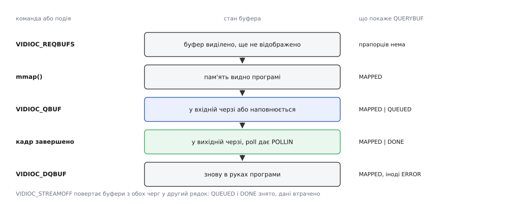

# 📋 Контракт V4L2: виклики, структури, помилки

Довідник ioctl-інтерфейсу відеопристрою: які команди існують, яку структуру бере кожна, які поля заповнює програма, а які переписує драйвер, і що саме означає кожен код помилки — звірено з документацією ядра `userspace-api/media/v4l`. Тримати це в голові немає сенсу: найчастіша поломка в роботі з `/dev/videoN` — не помилка логіки, а поле, яке драйвер переписав, а програма не перечитала.

## Форма виклику й напрямок передавання

Усе, крім `open`, `close`, `mmap` і `poll`, ходить одним каналом:

```c
int ioctl(int fd, VIDIOC_XXX, &arg);   /* 0 — успіх; −1 — помилка, причина в errno */
```

Напрямок закодовано в самому номері команди: `_IOR` — драйвер лише заповнює структуру, `_IOW` — лише читає її, `_IOWR` — читає й **переписує ту саму пам'ять**. Більшість команд V4L2 — саме `_IOWR`, і це не дрібниця запису: [механіка ioctl](book:unix-linux/ioctl-interface) копіює структуру в ядро й повертає назад, тож після виклику в ній лежить відповідь драйвера, а не ваше прохання.

Звідси перше практичне правило: **обнуляйте структуру перед кожним викликом** (`= {0}` або `memset`). Усі поля `reserved` мають бути нулями — це умова сумісності з майбутніми версіями; крім того, більшість структур містить об'єднання, і сміття в незаповненій гілці драйвер має право прочитати.

| виклик | аргумент | напрямок | що робить |
| --- | --- | --- | --- |
| `VIDIOC_QUERYCAP` | `v4l2_capability` | ← драйвер | хто це такий і що вміє |
| `VIDIOC_ENUM_FMT` | `v4l2_fmtdesc` | `index` → , решта ← | перебір кодувань пікселів |
| `VIDIOC_ENUM_FRAMESIZES` | `v4l2_frmsizeenum` | `index`, `pixel_format` → | роздільності для кодування |
| `VIDIOC_ENUM_FRAMEINTERVALS` | `v4l2_frmivalenum` | `index`, формат, розмір → | частоти для роздільності |
| `VIDIOC_G_FMT` | `v4l2_format` | `type` → , формат ← | що стоїть зараз |
| `VIDIOC_S_FMT` | `v4l2_format` | ↔ | поставити формат; драйвер виправляє поля на місці |
| `VIDIOC_TRY_FMT` | `v4l2_format` | ↔ | те саме, але пристрою не чіпає |
| `VIDIOC_REQBUFS` | `v4l2_requestbuffers` | ↔ | виділити пул; `count` повертається справжній |
| `VIDIOC_CREATE_BUFS` | `v4l2_create_buffers` | ↔ | додати буфери до наявних, можливо іншого формату |
| `VIDIOC_QUERYBUF` | `v4l2_buffer` | `index`, `type`, `memory` → | зсув і довжина буфера для `mmap`, поточні прапорці |
| `VIDIOC_PREPARE_BUF` | `v4l2_buffer` | ↔ | закріпити сторінки й узгодити кеші заздалегідь |
| `VIDIOC_QBUF` | `v4l2_buffer` | → драйвер | віддати буфер у вхідну чергу |
| `VIDIOC_DQBUF` | `v4l2_buffer` | `type`, `memory` → , решта ← | забрати наповнений; блокує без `O_NONBLOCK` |
| `VIDIOC_EXPBUF` | `v4l2_exportbuffer` | `type`, `index`, `plane` → , `fd` ← | віддати дескриптор dma-buf на буфер |
| `VIDIOC_STREAMON` | `const int *` (тип буферів) | → драйвер | увімкнути потік |
| `VIDIOC_STREAMOFF` | `const int *` | → драйвер | вимкнути й **повернути всі буфери** з обох черг |
| `VIDIOC_QUERYCTRL` | `v4l2_queryctrl` | `id` → , опис ← | тип, межі, крок, назва керування |
| `VIDIOC_QUERY_EXT_CTRL` | `v4l2_query_ext_ctrl` | `id` → , опис ← | те саме для 64-бітних, масивів і складених |
| `VIDIOC_G_CTRL` / `S_CTRL` | `v4l2_control` | ↔ | одне ціле значення |
| `VIDIOC_S_EXT_CTRLS` | `v4l2_ext_controls` | ↔ | кілька значень одним викликом |
| `VIDIOC_SUBSCRIBE_EVENT` | `v4l2_event_subscription` | → драйвер | підписатися на подію |
| `VIDIOC_DQEVENT` | `v4l2_event` | ← драйвер | забрати подію з черги |

Перелічувальні виклики (`ENUM_*`) закінчуються не окремою ознакою, а помилкою: коли індекс вийшов за останній елемент, драйвер повертає **`EINVAL`**. Цикл `for (x.index = 0; ioctl(...) == 0; x.index++)` — це не хитрість, а документована форма.

## v4l2_capability: що питати першим

```c
struct v4l2_capability {
    __u8  driver[16];     /* ім'я модуля ядра: "uvcvideo", "bcm2835-isp"   */
    __u8  card[32];       /* назва пристрою для людини                     */
    __u8  bus_info[32];   /* фізичне місце: "usb-0000:00:14.0-4"           */
    __u32 version;        /* версія ядра, KERNEL_VERSION(a,b,c)            */
    __u32 capabilities;   /* усе, що вміє ФІЗИЧНИЙ пристрій цілком         */
    __u32 device_caps;    /* що вміє САМЕ ЦЕЙ вузол /dev/videoN            */
    __u32 reserved[3];
};
```

Різниця двох останніх полів — джерело класичної помилки. `capabilities` — це об'єднання можливостей усіх вузлів, які експортує пристрій; тюнер із радіовиходом покаже там і відео, і радіо. Перевіряти треба `device_caps`, і лише якщо в `capabilities` стоїть `V4L2_CAP_DEVICE_CAPS` (0x80000000); без цього прапорця поле не заповнене й дивитися доводиться на `capabilities`.

| прапорець | значення |
| --- | --- |
| `V4L2_CAP_VIDEO_CAPTURE` / `_OUTPUT` | однопланове захоплення / виведення |
| `V4L2_CAP_VIDEO_CAPTURE_MPLANE` / `_OUTPUT_MPLANE` | те саме для площинних форматів |
| `V4L2_CAP_VIDEO_M2M` / `_M2M_MPLANE` | обидві черги на одному вузлі — кодек, масштабувальник |
| `V4L2_CAP_META_CAPTURE` | вузол віддає не кадри, а метадані (статистику) |
| `V4L2_CAP_STREAMING` | працює обмін буферами; без нього лишається тільки `read` |
| `V4L2_CAP_READWRITE` | `read`/`write` підтримано (на камерах буває, на кодеках — ні) |
| `V4L2_CAP_IO_MC` | входи-виходи задає граф медіаконтролера, а не `S_INPUT` |
| `V4L2_CAP_DEVICE_CAPS` | поле `device_caps` заповнене |

## Формат: v4l2_format і його об'єднання

```c
struct v4l2_format {
    __u32 type;                                /* єдине поле, обов'язкове завжди */
    union {
        struct v4l2_pix_format        pix;     /* однопланові CAPTURE / OUTPUT   */
        struct v4l2_pix_format_mplane pix_mp;  /* багатопланові *_MPLANE         */
        struct v4l2_window            win;     /* оверлей                        */
        struct v4l2_vbi_format        vbi;
        struct v4l2_sliced_vbi_format sliced;
        struct v4l2_sdr_format        sdr;
        struct v4l2_meta_format       meta;
        __u8                          raw_data[200];
    } fmt;
};
```

Гілку об'єднання обирає `type`, і помилка тут не діагностується компілятором: заповнити `fmt.pix` при типі `..._MPLANE` — значить покласти ширину туди, де драйвер читатиме зовсім інше поле.

| поле `v4l2_pix_format` | тип | хто ставить | зміст |
| --- | --- | --- | --- |
| `width`, `height` | `__u32` | програма; драйвер виправляє | розмір у пікселях, округлений до можливостей апаратури |
| `pixelformat` | `__u32` | програма | чотирилітерний код, `v4l2_fourcc('N','V','1','2')` |
| `field` | `__u32` | програма; драйвер виправляє | `V4L2_FIELD_NONE` для прогресивного кадру |
| `bytesperline` | `__u32` | **лише драйвер** | крок рядка з урахуванням вирівнювання; 0 для стиснених |
| `sizeimage` | `__u32` | **лише драйвер** | скільки байтів треба під повний кадр |
| `colorspace`, `xfer_func`, `ycbcr_enc`, `quantization` | `__u32` | драйвер на CAPTURE, програма на OUTPUT | опис колірного простору |
| `priv` | `__u32` | програма | `V4L2_PIX_FMT_PRIV_MAGIC`, інакше розширені поля ігноруються |
| `flags` | `__u32` | програма | наприклад, попередньо помножена альфа |

Багатопланова структура влаштована інакше: спільні `width`, `height`, `pixelformat`, `field`, `colorspace`, далі `plane_fmt[VIDEO_MAX_PLANES]` (вісім елементів) і `num_planes`. Кожен елемент — це `struct v4l2_plane_pix_format`, і в ньому **`sizeimage` стоїть перед `bytesperline`**, тобто в протилежному до `v4l2_pix_format` порядку. Позиційна ініціалізація (`{ 1408, 1081344 }`) мовчки поміняє їх місцями; пишіть за іменами полів. Що означають самі чотирилітерні коди й звідки береться різний крок у площин — у темі про [формати пікселів](book:algorithms/pixel-formats).

## Буфери: запит, опис, прапорці

```c
struct v4l2_requestbuffers {
    __u32 count;          /* просимо стільки — отримуємо скільки вийшло */
    __u32 type;           /* enum v4l2_buf_type                         */
    __u32 memory;         /* enum v4l2_memory                           */
    __u32 capabilities;   /* ← драйвер: що ця черга взагалі вміє        */
    __u8  flags;          /* V4L2_MEMORY_FLAG_NON_COHERENT              */
    __u8  reserved[3];
};
```

Поле `capabilities` — найдешевший спосіб дізнатися можливості черги, бо приходить без окремого виклику: `V4L2_BUF_CAP_SUPPORTS_MMAP` (0x001), `_USERPTR` (0x002), `_DMABUF` (0x004), `_REQUESTS` (0x008), `_ORPHANED_BUFS` (0x010), `_M2M_HOLD_CAPTURE_BUF` (0x020), `_MMAP_CACHE_HINTS` (0x040), `_MAX_NUM_BUFFERS` (0x080), `_REMOVE_BUFS` (0x100). Запит із `count = 0` звільняє всі буфери й водночас лишається законним способом просто прочитати `capabilities`.

`VIDIOC_CREATE_BUFS` бере `v4l2_create_buffers` — це `count`, `memory`, вкладений `struct v4l2_format`, ті самі `capabilities`, `flags` і `max_num_buffers`; на поверненні `index` каже, з якого номера пішли нові буфери. Ним доточують буфери до вже виділених, не зупиняючи потік.

| поле `v4l2_buffer` | тип | зміст |
| --- | --- | --- |
| `index` | `__u32` | номер буфера; на `DQBUF` його ставить драйвер |
| `type`, `memory` | `__u32` | тип черги й модель пам'яті — заповнює програма завжди |
| `bytesused` | `__u32` | скільки байтів реально записано (для стиснених ≠ `length`) |
| `flags` | `__u32` | стан буфера й ознаки кадру |
| `field` | `__u32` | порядок полів для черезрядкового відео |
| `timestamp` | `struct timeval` | час кадру; за замовчуванням `CLOCK_MONOTONIC` |
| `sequence` | `__u32` | лічильник кадрів драйвера — **розрив у ньому і є втрачений кадр** |
| `m.offset` / `m.userptr` / `m.fd` / `m.planes` | об'єднання | зсув для `mmap`, вказівник, дескриптор dma-buf або масив площин |
| `length` | `__u32` | розмір буфера (для площинних — кількість елементів `m.planes`) |
| `request_fd` | `__s32` | дескриптор запиту, якщо стоїть `V4L2_BUF_FLAG_REQUEST_FD` |



*Прапорці `QUEUED` і `DONE` у драйверах на videobuf2 — а це майже всі — взаємовиключні: буфер або в черзі на запис, або вже готовий.*

| прапорець `V4L2_BUF_FLAG_` | значення | зміст |
| --- | --- | --- |
| `MAPPED` | 0x000001 | буфер відображено в адресний простір програми |
| `QUEUED` | 0x000002 | у вхідній черзі або саме зараз наповнюється |
| `DONE` | 0x000004 | у вихідній черзі, чекає на `DQBUF` |
| `ERROR` | 0x000040 | кадр забрано, але дані побиті; буфер усе одно треба повернути |
| `KEYFRAME` / `PFRAME` / `BFRAME` | 0x08 / 0x10 / 0x20 | тип кадру для стисненого потоку |
| `LAST` | 0x100000 | останній кадр, який апаратура віддасть; далі `DQBUF` дасть `EPIPE` |
| `IN_REQUEST` | 0x000080 | буфер належить запиту й ще не поданий |
| `REQUEST_FD` | 0x800000 | поле `request_fd` дійсне |
| `PREPARED` | 0x000400 | буфер уже підготовлено до передавання |
| `TIMESTAMP_MASK` | 0x00e000 | маска джерела часу: `UNKNOWN` 0, `MONOTONIC` 0x2000, `COPY` 0x4000 |
| `TSTAMP_SRC_MASK` | 0x070000 | що саме позначено часом: `EOF` 0, `SOE` 0x10000 (початок експозиції) |

Типи черги: `V4L2_BUF_TYPE_VIDEO_CAPTURE` (1), `VIDEO_OUTPUT` (2), `VIDEO_CAPTURE_MPLANE` (9), `VIDEO_OUTPUT_MPLANE` (10), `META_CAPTURE` (13), `META_OUTPUT` (14). Моделі пам'яті: `V4L2_MEMORY_MMAP` (1), `USERPTR` (2), `DMABUF` (4).

`VIDIOC_EXPBUF` заповнює `struct v4l2_exportbuffer` — `type`, `index`, `plane` ставить програма, `fd` повертає драйвер; у `flags` дозволені лише `O_CLOEXEC`, `O_RDONLY`, `O_WRONLY`, `O_RDWR`. Далі цей дескриптор живе за загальними правилами [dma-buf](book:unix-linux/dma-buf), а буфер лишається живим, доки його тримає хоч хтось.

## Керування

`VIDIOC_QUERYCTRL` повертає `v4l2_queryctrl`: `id`, `type`, `name[32]`, `minimum`, `maximum`, `step`, `default_value`, `flags` — усе, з чого будується повзунок в інтерфейсі. Ідентифікатори не суцільні, тому перебирати їх лічильником не можна: до `id` домішують **`V4L2_CTRL_FLAG_NEXT_CTRL`**, і драйвер повертає наступне наявне керування з більшим номером. Розширений `VIDIOC_QUERY_EXT_CTRL` дає те саме 64-бітними числами плюс `elems`, `elem_size`, `nr_of_dims`, `dims[]` — без нього масивні й складені керування (матриці кодеків) описати неможливо.

| прапорець керування | зміст |
| --- | --- |
| `DISABLED` (0x0001) | назавжди недоступне на цьому залізі — не показувати |
| `GRABBED` (0x0002) | тимчасово зайняте; запис дасть `EBUSY` |
| `READ_ONLY` (0x0004) | лише читання; запис дасть `EINVAL` |
| `INACTIVE` (0x0010) | не має сенсу при поточних налаштуваннях (витримка при автоекспозиції) |
| `WRITE_ONLY` (0x0040) | читання дасть `EACCES` |
| `VOLATILE` (0x0080) | значення змінюється саме — питати щоразу заново |
| `HAS_PAYLOAD` (0x0100) | значення лежить за вказівником, а не в `value` |

```c
struct v4l2_ext_controls {
    __u32 which;       /* V4L2_CTRL_WHICH_CUR_VAL / DEF_VAL / MIN_VAL /
                          MAX_VAL / REQUEST_VAL                        */
    __u32 count;
    __u32 error_idx;   /* ← драйвер: номер керування, на якому впало   */
    __s32 request_fd;
    __u32 reserved[1];
    struct v4l2_ext_control *controls;
};
```

`error_idx` розрізняє два зовсім різні провали: якщо він дорівнює `count`, перевірка не пройшла ще до заліза й **не застосовано нічого**; якщо менший — до цього номера значення вже поставлені, а стан решти невизначений. Атомарність тут гарантується лише в першому випадку.

## Події

```c
struct v4l2_event_subscription sub = {
    .type  = V4L2_EVENT_SOURCE_CHANGE,   /* 5 */
    .id    = 0,                          /* номер пада, якщо їх кілька */
    .flags = V4L2_EVENT_SUB_FL_SEND_INITIAL,   /* 0x1: одразу віддати поточний стан */
};
ioctl(fd, VIDIOC_SUBSCRIBE_EVENT, &sub);
```

Готовність події видно тим самим `poll` — але не в `POLLIN`, а в **`POLLPRI`**; на цьому спотикаються, поклавши вузол в [епол разом із сокетами](book:unix-linux/select-poll-epoll) і чекаючи лише на читність. `VIDIOC_DQEVENT` віддає `v4l2_event`: `type`, `u` (об'єднання з даними події), `pending` (скільки лишилося в черзі), `sequence`, `timestamp`, `id`. Черга подій скінченна, тож `sequence` із розривом означає, що частину подій ви проґавили.

`V4L2_EVENT_SOURCE_CHANGE` несе `struct v4l2_event_src_change` з єдиним полем `changes`; прапорець `V4L2_EVENT_SRC_CH_RESOLUTION` (0x0001) означає, що джерело змінило роздільність. Це не попередження, а команда до дії: потік треба зупинити, переузгодити формат, перевиділити буфери й запустити знову. Для декодера це штатна подія — розмір кадру відомий лише після розбору заголовків потоку. Ще три типи: `V4L2_EVENT_VSYNC` (1), `V4L2_EVENT_EOS` (2), `V4L2_EVENT_CTRL` (3) — останній повідомляє, що керування змінив хтось інший, і саме він дозволяє двом програмам не сперечатися за налаштування камери.

## Коди помилок і що вони насправді означають

Загальні правила [errno](book:programming/errno) тут доповнені точними значеннями для кожного виклику.

| код | де виникає | що означає |
| --- | --- | --- |
| `EINVAL` | будь-де | параметр поза межами — **або** кінець переліку в `ENUM_*`; це не збій |
| `EAGAIN` | `DQBUF` | вузол відкрито з `O_NONBLOCK`, а у вихідній черзі порожньо — чекайте `poll` |
| `EPIPE` | `DQBUF` на кодеку | буфер із `V4L2_BUF_FLAG_LAST` уже забрано, більше кадрів не буде |
| `EPIPE` | `STREAMON` | драйвер налаштовує формат на падах, а конвеєр зібрано неузгоджено |
| `ENODATA` | `G_STD`, `G_DV_TIMINGS` | цей вхід чи вихід не працює з відеостандартами взагалі |
| `ENOTTY` | будь-де | драйвер такого виклику не має — саме цим `ENOTTY` відрізняється від `EINVAL` |
| `EBUSY` | `S_FMT`, `REQBUFS` | пристрій уже передає потік або буфери виділені; спершу `STREAMOFF` |
| `EIO` | `DQBUF` | збій усередині або зникнення сигналу; кадр утрачено, потік іноді живий |
| `ENOMEM` | `REQBUFS`, `CREATE_BUFS` | не вийшло виділити пам'ять під DMA — просіть менше буферів |
| `ENOSPC` | `STREAMON` на USB | не вистачає смуги ізохронного каналу: інша камера на тому ж контролері |
| `ERANGE` | `S_CTRL` | значення поза `minimum`…`maximum` або не кратне `step` |
| `EACCES` | `G_CTRL` | керування тільки для запису або кнопка |
| `ENOLINK` | `STREAMON` | у графі медіаконтролера не ввімкнено потрібний зв'язок |
| `EBADR` | `QBUF` | плутанина із запитами: прапорець `REQUEST_FD` там, де його не чекали |

Розрізняти `EINVAL` і `ENOTTY` варто окремим рядком: перший означає «так не можна», другий — «цей драйвер такого не вміє». Програма, яка перебирає `ENUM_FRAMESIZES`, на старому драйвері отримає `ENOTTY` з нульового ж індексу — і мусить не впасти, а просто взяти те, що дає `G_FMT`.

## Мінімальний робочий виклик

Найкоротше, що дає повну картину можливостей вузла й не чіпає жодного налаштування:

```c
int fd = open("/dev/video0", O_RDWR | O_NONBLOCK);

struct v4l2_capability cap = {0};
if (ioctl(fd, VIDIOC_QUERYCAP, &cap) < 0) { perror("QUERYCAP"); return -1; }

__u32 caps = (cap.capabilities & V4L2_CAP_DEVICE_CAPS)
           ? cap.device_caps : cap.capabilities;      /* саме цей вузол */
if (!(caps & V4L2_CAP_VIDEO_CAPTURE) || !(caps & V4L2_CAP_STREAMING))
    return fprintf(stderr, "%s: не камера з обміном буферами\n", cap.card), -1;

struct v4l2_fmtdesc f = { .type = V4L2_BUF_TYPE_VIDEO_CAPTURE };
for (f.index = 0; ioctl(fd, VIDIOC_ENUM_FMT, &f) == 0; f.index++) {
    printf("%.4s  %s\n", (char *)&f.pixelformat, f.description);

    struct v4l2_frmsizeenum s = { .pixel_format = f.pixelformat };
    for (s.index = 0; ioctl(fd, VIDIOC_ENUM_FRAMESIZES, &s) == 0; s.index++)
        if (s.type == V4L2_FRMSIZE_TYPE_DISCRETE)
            printf("    %ux%u\n", s.discrete.width, s.discrete.height);
        else
            printf("    %u..%u крок %u\n", s.stepwise.min_width,
                   s.stepwise.max_width, s.stepwise.step_width);
}
if (errno != EINVAL) perror("ENUM_FMT");   /* EINVAL — штатний кінець переліку */
```

Три речі тут не косметичні. Вибір між `device_caps` і `capabilities` — єдиний спосіб не переплутати відеовузол із вузлом метаданих того самого пристрою. Друк `%.4s` по адресі `pixelformat` працює тому, що `v4l2_fourcc` кладе першу літеру в молодший байт: там, де молодший байт лежить першим (little-endian — тобто на всіх звичних платформах), байти в пам'яті йдуть у порядку літер. І остання перевірка `errno` відрізняє нормальне завершення переліку від справжнього збою — без неї програма мовчки покаже порожній список на вузлі, який просто зайнятий іншим процесом.
