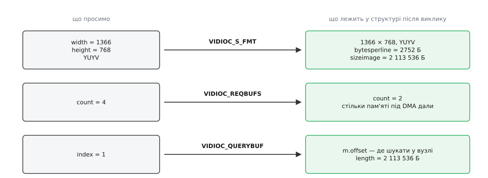

# ⚙️ Цикл захоплення кадру на C: від відкриття вузла до останнього munmap

Це повна робоча програма, яка знімає кадри з `/dev/video0` і кладе один на диск, — півтори сотні рядків, у яких немає жодного зайвого виклику. Розбирати її варто не заради коду, а заради порядку: кожен крок стоїть саме там, де стоїть, бо наступний без нього не працює, а мало не половина рядків нічого в драйвера не просить — вони читають, що драйвер на прохання відповів.

## Обгортка, без якої решта коду бреше

Будь-який `ioctl` до відеопристрою може повернутися ні з чим лише тому, що процесові прийшов сигнал. Це не поломка: виклик заснув у ядрі, чекаючи, доки драйвер відпустить свій м'ютекс, обробник сигналу розбудив сон, і ядро віддало `-1` з `errno == EINTR`. Кожен сигнал, на який програма поставила власний обробник без `SA_RESTART`, — `SIGINT` для чистого виходу, `SIGCHLD`, `SIGALRM` від власного таймера — стає джерелом таких повернень.

Тому програма починається не з `open`, а з обгортки:

```c
static int xioctl(int fd, unsigned long req, void *arg)
{
    int r;
    do { r = ioctl(fd, req, arg); } while (r == -1 && errno == EINTR);
    return r;
}

#define FAIL(m) do { perror(m); exit(EXIT_FAILURE); } while (0)
```

Повторювати тут безпечно саме тому, що перерваний виклик не встиг зробити нічого: `VIDIOC_QBUF`, зупинений сигналом, не поставив буфер у чергу наполовину. Це не універсальний дозвіл — виклики, що встигли перенести частину даних, повертають не `EINTR`, а кількість зробленого, і повторювати їх без зсуву покажчика означає загубити або продублювати байти; [коли перезапуск безпечний, а коли ні](book:unix-linux/eintr-and-restart) — окрема розмова. Керуючі виклики V4L2 у цьому сенсі неподільні, тож петля на місці.

## Відкрити і спитати, чим воно є

```c
int fd = open("/dev/video0", O_RDWR | O_NONBLOCK);
if (fd == -1) FAIL("open /dev/video0");

struct v4l2_capability cap;
if (xioctl(fd, VIDIOC_QUERYCAP, &cap) == -1) FAIL("VIDIOC_QUERYCAP");

unsigned caps = (cap.capabilities & V4L2_CAP_DEVICE_CAPS)
              ? cap.device_caps : cap.capabilities;

if (!(caps & V4L2_CAP_VIDEO_CAPTURE)) { fputs("вузол не знімає відео\n",  stderr); return 1; }
if (!(caps & V4L2_CAP_STREAMING))     { fputs("немає черги буферів\n",    stderr); return 1; }
```

Три дрібниці, кожна з яких коштувала комусь вечора. Перша: `O_RDWR`, а не `O_RDONLY`, хоч ми лише знімаємо, — структури налаштувань ідуть у драйвер, а частина драйверів вузол, відкритий лише на читання, просто не приймає. Друга: `O_NONBLOCK` тут не про швидкість, а про те, щоб жоден виклик не завис назавжди, коли камеру висмикнули з роз'єму; готовність ми питатимемо окремо.

Третя й найтонша — два поля можливостей замість одного. Історично `capabilities` описує **весь фізичний пристрій**: якщо тюнер створює і `/dev/video0`, і `/dev/radio0`, у цьому полі стоятиме об'єднання можливостей обох вузлів, і перевірка «а чи вміє воно захоплювати відео» пройде навіть на радіовузлі. Пізніше додали `device_caps` — можливості **саме відкритого вузла**; його наявність драйвер оголошує прапорцем `V4L2_CAP_DEVICE_CAPS` у старому полі. Звідси й вибір у коді: є новий прапорець — читаємо `device_caps`, немає — вдовольняємося старим полем.

## Формат: попросити й перечитати

```c
struct v4l2_format fmt;
memset(&fmt, 0, sizeof fmt);                 /* нулі обов'язкові: ядро судить резервні поля */
fmt.type                = V4L2_BUF_TYPE_VIDEO_CAPTURE;
fmt.fmt.pix.width       = 1366;
fmt.fmt.pix.height      = 768;
fmt.fmt.pix.pixelformat = V4L2_PIX_FMT_YUYV;
fmt.fmt.pix.field       = V4L2_FIELD_NONE;
if (xioctl(fd, VIDIOC_S_FMT, &fmt) == -1) FAIL("VIDIOC_S_FMT");

const unsigned H      = fmt.fmt.pix.height;         /* могло змінитися */
const unsigned STRIDE = fmt.fmt.pix.bytesperline;   /* крок рядка в пам'яті */
const unsigned ROW    = fmt.fmt.pix.width * 2;      /* корисних байтів у рядку, YUYV */
```

`memset` тут не гігієна, а вимога: невиставлені поля структури мають бути нулями, інакше драйвер має право відхилити виклик через сміття в резервних полях — а сміття в автоматичній змінній буде обов'язково.

Далі — головна пастка всього захоплення. Виклик успішний, картинка та сама, яку просили, і виникає спокуса рахувати адресу рядка як `y · width · 2`. Апаратура так пам'ять не розкладає: блок обробки зображення вирівнює початок кожного рядка на свою кратність, і між кінцем одного рядка та початком наступного лишається дірка.

```
корисних байтів у рядку   = 1366 · 2            = 2732 Б
вирівнювання рядка на 64  : 2732 / 64 = 42.7  → 43 блоки
крок рядка bytesperline   = 43 · 64             = 2752 Б
на рядок припадає дірки   = 2752 − 2732         =   20 Б
sizeimage                 = 2752 · 768          = 2 113 536 Б
```

Двадцять байтів здаються нічим, але похибка накопичується: рядок `y`, прочитаний з кроком 2732 замість 2752, зсунутий на `y · 20` байтів, тобто на `y · 10` пікселів ліворуч. Через `2732 / 20 ≈ 137` рядків зсув доростає до цілого рядка — картинка розповзається діагональними сходами, дуже впізнаваними, щойно раз їх побачиш.



*Ліворуч — те, що програма вписала в структуру, праворуч — те, що в ній лежить після виклику. Жодне з цих чисел не можна вигадати самому: усі три виклики повертають відповідь у той самий буфер, у який прийняли прохання.*

Правило коротке: після `S_FMT` ходити по пам'яті лише кроком `bytesperline`, а розмір кадру брати з `sizeimage`. Скільки байтів у рядку **корисні** — окреме знання, воно залежить від кодування пікселів, і для YUYV це рівно два байти на піксель; для планарних кодувань кроків стільки, скільки площин ([формати пікселів і буферів зображення](book:algorithms/pixel-formats)). Обидва числа зустрічаються в тій самій петлі — одне визначає, звідки читати, друге, скільки взяти:

```c
/* Кладе кадр на диск без дірок вирівнювання. */
static void save_raw(const char *path, const unsigned char *base,
                     unsigned stride, unsigned row, unsigned height)
{
    FILE *f = fopen(path, "wb");
    if (!f) FAIL("fopen");
    for (unsigned y = 0; y < height; y++)
        fwrite(base + (size_t) y * stride, 1, row, f);   /* крок stride, корисних row */
    fclose(f);
}
```

## Пул буферів і відображення

```c
enum { WANT = 4, MAXBUF = 8, SKIP = 10 };

struct v4l2_requestbuffers req;
memset(&req, 0, sizeof req);
req.count  = WANT;
req.type   = V4L2_BUF_TYPE_VIDEO_CAPTURE;
req.memory = V4L2_MEMORY_MMAP;
if (xioctl(fd, VIDIOC_REQBUFS, &req) == -1) FAIL("VIDIOC_REQBUFS");

if (req.count < 2 || req.count > MAXBUF) {
    fprintf(stderr, "драйвер дав %u буферів — не наш випадок\n", req.count);
    return 1;
}

struct { void *start; size_t len; } bufs[MAXBUF];

for (unsigned i = 0; i < req.count; i++) {
    struct v4l2_buffer b;
    memset(&b, 0, sizeof b);
    b.type = V4L2_BUF_TYPE_VIDEO_CAPTURE;
    b.memory = V4L2_MEMORY_MMAP;
    b.index  = i;
    if (xioctl(fd, VIDIOC_QUERYBUF, &b) == -1) FAIL("VIDIOC_QUERYBUF");

    bufs[i].len   = b.length;
    bufs[i].start = mmap(NULL, b.length, PROT_READ | PROT_WRITE,
                         MAP_SHARED, fd, b.m.offset);
    if (bufs[i].start == MAP_FAILED) FAIL("mmap");
}
```

Цикл ходить не до `WANT`, а до `req.count`, і це не перестрахування. Драйвер виділяє не звичайні сторінки, а пам'ять, придатну для запису самим пристроєм: на платі без блоку трансляції адрес шини кадр має лежати суцільним фізичним шматком, а запас таких шматків на живій системі скінченний, і пам'ять із часом фрагментується ([DMA і відображення буферів](book:unix-linux/dma-and-buffers)). Чотири буфери по два мегабайти — це вісім мегабайтів суцільної пам'яті, і драйвер цілком може віддати два. Зустрічний випадок теж передбачений інтерфейсом: драйвер має право видати **більше**, ніж просили, якщо його конвеєр інакше не працює. Тому перевіряють обидві межі, а цикли ходять по поверненому числу.

`b.m.offset` — не адреса, а зсув усередині самого вузла: `mmap` викликають на дескрипторі камери, і ядро підставляє під ці сторінки ту саму фізичну пам'ять, у яку писатиме пристрій.

## Черга, потік і цикл

```c
for (unsigned i = 0; i < req.count; i++) {           /* УСІ буфери — драйверові */
    struct v4l2_buffer b;
    memset(&b, 0, sizeof b);
    b.type = V4L2_BUF_TYPE_VIDEO_CAPTURE;
    b.memory = V4L2_MEMORY_MMAP;
    b.index  = i;
    if (xioctl(fd, VIDIOC_QBUF, &b) == -1) FAIL("VIDIOC_QBUF");
}

enum v4l2_buf_type type = V4L2_BUF_TYPE_VIDEO_CAPTURE;
if (xioctl(fd, VIDIOC_STREAMON, &type) == -1) FAIL("VIDIOC_STREAMON");

unsigned seen = 0;
while (seen < SKIP + 1) {
    struct pollfd pfd = { .fd = fd, .events = POLLIN };

    int pr = poll(&pfd, 1, 2000);
    if (pr == -1) { if (errno == EINTR) continue; FAIL("poll"); }
    if (pr ==  0) { fputs("дві секунди без кадру\n", stderr); break; }

    struct v4l2_buffer b;
    memset(&b, 0, sizeof b);
    b.type = V4L2_BUF_TYPE_VIDEO_CAPTURE;
    b.memory = V4L2_MEMORY_MMAP;
    if (xioctl(fd, VIDIOC_DQBUF, &b) == -1) {
        if (errno == EAGAIN) continue;               /* готовність збрехала */
        FAIL("VIDIOC_DQBUF");
    }

    if (b.flags & V4L2_BUF_FLAG_ERROR)
        fputs("кадр пошкоджений, пропускаємо\n", stderr);
    else if (++seen > SKIP)
        save_raw("frame.raw", bufs[b.index].start, STRIDE, ROW, H);

    if (xioctl(fd, VIDIOC_QBUF, &b) == -1) FAIL("VIDIOC_QBUF");  /* назад — завжди */
}
```

`STREAMON` вмикає сенсор назавжди, а не на один кадр, тож усі буфери мають бути в черзі **до** нього: у порожню чергу перші кадри падають безслідно.

Перевірка `EINTR` після `poll` не дублює обгортку `xioctl`, бо `poll` до неї не входить і входити не може: цей виклик належить до тих небагатьох, які ядро не перезапускає ніколи — навіть коли обробник сигналу поставлений із `SA_RESTART`. Петля навколо `poll` обов'язкова завжди ([select, poll, epoll](book:unix-linux/select-poll-epoll)).

Найдивніша гілка — `EAGAIN` одразу після успішного `poll`. Дескриптор щойно сказав «читай», а `DQBUF` каже «нема чого». Суперечності немає: `poll` повідомляє про стан у минулому, а `DQBUF` діє в теперішньому, і між ними встиг втрутитися хтось інший — другий потік тієї самої програми, процес, що успадкував дескриптор через `fork`, або сам драйвер, що скасував чергу. У блокуючому режимі така мить просто перетворилася б на очікування всередині ядра; ми відкрили вузол з `O_NONBLOCK`, тож дістаємо `EAGAIN` — не помилку, а відповідь «зараз нічого немає» ([блокуючий і неблокуючий режим](book:unix-linux/blocking-and-nonblocking)).

Окремо стоїть `V4L2_BUF_FLAG_ERROR`. Драйвер міг втратити частину кадру — обірвався USB-пакет, переповнився приймач MIPI — і в такому разі він не робить виклик невдалим, а віддає буфер із прапорцем. Це навмисно: помилка, повернена кодом, лишає буфер у невизначеному стані, а прапорець на успішно забраному буфері дає програмі право спокійно повернути його в чергу. Що й робить останній рядок циклу — `QBUF` виконується на **будь-якому** шляху, бо не повернений у чергу буфер зникає з обігу назавжди, і після кількох таких кадрів камера просто замовкає.

## Чому перші кадри темні

`SKIP` у коді — не забобон. Автоматична експозиція сенсора влаштована як контур зворотного зв'язку: блок статистики міряє яскравість готового кадру, обчислює поправку до часу експозиції й підсилення, записує її в регістри сенсора — і та набирає чинності лише з наступного кадрового інтервалу, а часом і через один. Поки не з'явився перший кадр, міряти нема чого, тож `STREAMON` стартує з якогось стандартного значення, і контур сходиться за кілька кадрів. Разом із затримкою на калібрування рівня чорного та стабілізацію тактового генератора сенсора це дає впізнавану картину: перший кадр майже чорний, далі яскравість наростає й за десяток кадрів виходить на потрібну.

Звідси практичний висновок, який дорого коштує авторам утиліт-«знімків»: узяти рівно один кадр і вимкнути потік — найгірший можливий спосіб зробити фото. Або відкидають перші кадри, як тут, або взагалі вимикають автоматику (`V4L2_CID_EXPOSURE_AUTO` у `V4L2_EXPOSURE_MANUAL` плюс явні експозиція й підсилення) і знімають із наперед відомими значеннями.

## Зупинка й ціна кадру

```c
xioctl(fd, VIDIOC_STREAMOFF, &type);        /* спершу зупинити апаратуру */
for (unsigned i = 0; i < req.count; i++)
    munmap(bufs[i].start, bufs[i].len);     /* аж потім прибрати сторінки */
close(fd);
```

Порядок тут єдино можливий. `STREAMOFF` зупиняє апаратуру й повертає програмі всі буфери з обох черг — і лише після нього можна знімати відображення, бо `munmap` під працюючим DMA прибирає сторінки з-під пристрою, що досі в них пише. Зворотний бік теж корисно знати: `STREAMOFF` скидає стан обох черг, тож щоб зняти ще щось, доведеться знову покласти в чергу всі буфери й знову викликати `STREAMON`.

Лишається порахувати, у що обходиться сама конструкція.

```
системних викликів на кадр = poll + DQBUF + QBUF = 3
при 30 кадрах на секунду   = 3 · 30              = 90 викликів/с
один виклик                ≈ 1.5 мкс
разом на керування         = 90 · 1.5 мкс        ≈ 135 мкс/с

для порівняння — одне копіювання кадру:
2 113 536 Б при 10 ГБ/с    ≈ 210 мкс на КОЖЕН кадр
при 30 к/с                 = 30 · 210 мкс        = 6300 мкс/с
```

Увесь керуючий тракт коштує приблизно в сорок сім разів менше, ніж одне-єдине копіювання кадру, якого ця конструкція й дозволяє уникнути, — і це ще без урахування того, що два мегабайти на кадр вимивають із кеша процесора все інше. Саме заради цієї різниці програма й виглядає складніше, ніж `read` у циклі.
