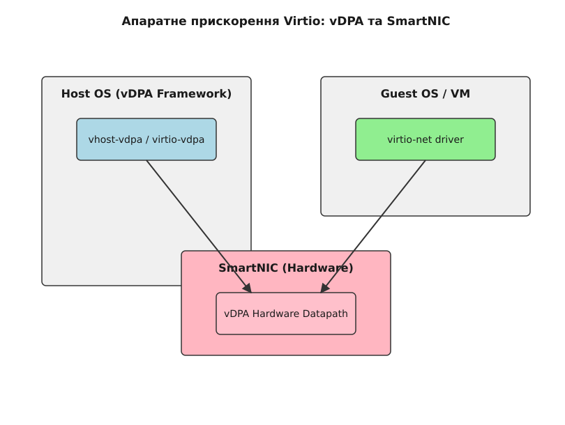
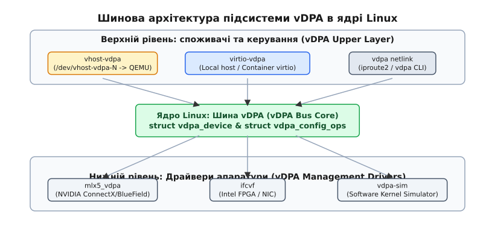
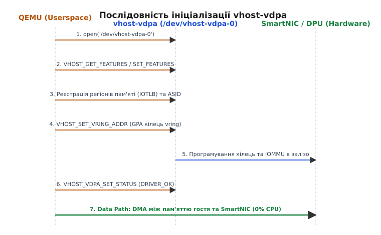

# Апаратне прискорення Virtio: vDPA та SmartNIC

<preknowlist>
- [vhost і vDPA](book:unix-linux/vhost-and-vdpa) — відмінність vhost від vDPA та мотиви розділення шляху даних.
- [virtio: паравіртуалізована шина й віртчерги](book:unix-linux/virtio-transport) — кільцеві буфери, дескриптори та механіка split/packed rings.
- [IOMMU: трансляція адрес](book:programming/iommu) — трансляція шинних адрес IOVA/GPA у фізичні адреси HPA та апаратне ізолювання пристроїв.
- [Концепції ядра Linux](book:unix-linux/kernel-and-userspace) — системні виклики, VFS, ioctl та файлові дескриптори.
</preknowlist>

У сучасних хмарних інфраструктурах високої щільності зі швидкостями мережі 100, 200 та 400 Гбіт/с обробка мережевого стеку віртуалізації стає головним споживачем обчислювальних ресурсів гіпервізора. Класичні програмні підходи — `vhost-net` у ядрі або `vhost-user` (DPDK) у просторі користувача — змушені спалювати десятки ядер центрального процесора (англ. *Central Processing Unit*, CPU) хоста виключно на копіювання дескрипторів віртчерг (англ. *virtqueues*), обробку системних переривань та арбітраж пакетів. Альтернативне пряме прокидання віртуальних функцій (VF) SR-IOV (Single Root I/O Virtualization) забезпечує передачу даних на швидкості кремнію, але повністю позбавляє гіпервізори універсальності: віртуальна машина прив'язується до конкретної апаратної карти конкретного вендора, втрачаючи можливість живої міграції (англ. *live migration*) між середовищами.

Фреймворк **vDPA (virtio Data Path Acceleration)** у ядрі Linux усуває цю давню інфраструктурну дилему. Він пропонує гібридну архітектуру: шлях управління (англ. *Control Path*) залишається програмним і стандартизованим для гіпервізора QEMU, а шлях даних (англ. *Data Path*) делегується безпосередньо апаратному контролеру SmartNIC або DPU (Data Processing Unit).

---

## 1. Архітектурна дилема: Control Path проти Data Path

Фундаментальна ідея vDPA полягає в суворому розділенні двох контурів виконання пристрою введення-виведення:

1. **Control Path (Шлях управління):** Операції ініціалізації пристрою, узгодження прапорців можливостей (англ. *feature negotiation*), налаштування MAC-адрес, виділення кілець, зміна режимів фільтрації та конфігурація RSS (Receive Side Scaling). Цей рівень є відносно повільним, вимагає гнучкості та виконується програмно силами гіпервізора та ядра хоста.
2. **Data Path (Шлях даних):** Операції безпосереднього пересилання мережевих пакетів або блоків диска: зчитування дескрипторів доступних буферів, виконання прямого доступу до пам'яті (англ. *Direct Memory Access*, DMA), оновлення індексів використаних буферів та генерування переривань. Цей рівень вимагає екстремальної швидкості та мінімальних затримок.


*Розділення Control Path (через QEMU та vhost-vdpa) та Data Path (прямий DMA-доступ між пам'яттю гостя та SmartNIC).*

У класичних реалізаціях virtio обидва шляхи обробляються програмно. При використанні `vhost-net` кожен пакет вимагає перемикання між гостем, ядром та воркером vhost. При використанні `vhost-user` виділені ядра CPU хоста опитують буфери в режимі 100% завантаження (Poll Mode Driver, PMD). У випадку SR-IOV обидва шляхи віддаються апаратурі, через що гіпервізор повністю втрачає контроль над станом пристрою та не може перехопити модифікації пам'яті під час міграції.

У vDPA апаратний пристрій SmartNIC забезпечений специфічним ASIC чи FPGA мікрокодом, який здатен напряму інтерпретувати кільцеві структури даних virtqueue у пам'яті віртуальної машини (GPA — *Guest Physical Address*), залишаючи Control Path під контролем ядра хоста та QEMU. 

Детальний аналіз еволюції шляхів даних від емуляції e1000 до сучасного vDPA наведено у [історії розвитку прискорення I/O від емуляції до vDPA](book:unix-linux/vdpa-virtio-data-path-acceleration/hist-vdpa-evolution.md).

---

## 2. Підсистема vDPA Bus у ядрі Linux

Починаючи з версії Linux 5.7, у ядрі функціонує спеціалізована шина **vDPA Bus** (`drivers/vdpa/`), яка створює уніфікований шар абстракції між пропрієтарним залізом та споживачами послуг віртуалізації.

```
                    ┌──────────────────────────────────────────┐
                    │            Простір користувача            │
                    │         (QEMU / KVM / libvirt)           │
                    └────────────────────┬─────────────────────┘
                                         │ /dev/vhost-vdpa-N
┌────────────────────────────────────────┴────────────────────────────────────────┐
│                        Драйвери-споживачі (Upper Drivers)                       │
│  ┌───────────────────────┐  ┌───────────────────────┐  ┌─────────────────────┐  │
│  │      vhost-vdpa       │  │      virtio-vdpa      │  │    vdpa netlink     │  │
│  └───────────┬───────────┘  └───────────┬───────────┘  └──────────┬──────────┘  │
├──────────────┼──────────────────────────┼─────────────────────────┼─────────────┤
│              └──────────────────────────┼─────────────────────────┘             │
│                                  vDPA Bus Core                                  │
│                   (struct vdpa_device & struct vdpa_config_ops)                 │
├─────────────────────────────────────────┬───────────────────────────────────────┤
│    Драйвери управління залізом (vDPA Management Drivers / Hardware Layer)       │
│  ┌───────────────────────┐  ┌───────────────────────┐  ┌─────────────────────┐  │
│  │      mlx5_vdpa        │  │         ifcvf         │  │      vdpa_sim       │  │
│  │   (NVIDIA / Mellanox) │  │        (Intel)        │  │     (Simulator)     │  │
│  └───────────┬───────────┘  └───────────┬───────────┘  └──────────┬──────────┘  │
└──────────────┼──────────────────────────┼─────────────────────────┼─────────────┘
               ▼                          ▼                         ▼
    ┌──────────────────────┐   ┌──────────────────────┐  ┌────────────────────┐
    │ ConnectX / BlueField │   │  Intel FPGA / NIC    │  │     RAM Host       │
    └──────────────────────┘   └──────────────────────┘  └────────────────────┘
```


*Три шари vDPA: керуючі драйвери заліза, шина vDPA Bus та верхній шар споживачів і керування.*

### 2.1. Нижній шар: Драйвери управління (Management Drivers)

Низькорівневі драйвери виробників обладнання відповідають за зв'язок шини vDPA з реальним PCI-пристроєм:
- `mlx5_vdpa`: Драйвер для мережевих карт NVIDIA/Mellanox ConnectX-6 Dx, ConnectX-7 та DPU BlueField-2/3.
- `ifcvf`: Драйвер для апаратних віртуальних функцій Intel (FPGA SmartNIC, PAC N3000, IPU E2000).
- `vdpa_sim`: Програмний симулятор vDPA пристрою в ядрі Linux, який використовується для налагодження та автоматичного тестування стеку без наявності фізичного SmartNIC.

Ці драйвери реєструють пристрій управління `struct vdpa_mgmt_dev`, який експонує метод створення логічних екземплярів vDPA-пристроїв (`vdpa_device`).

### 2.2. Верхній шар: Драйвери-споживачі (Upper Drivers)

Шина vDPA має два драйвери-споживачі створеного пристрою й окремий керуючий інтерфейс:

1. **`vhost-vdpa`:** Основний режим для віртуалізації. Драйвер створює символьний пристрій у `/dev/vhost-vdpa-N`. Гіпервізор QEMU відкриває цей файл і за допомогою команд `ioctl` передає конфігурацію віртчерг в апаратуру.
2. **`virtio-vdpa`:** Режим для контейнерів або локального хоста. Драйвер підключає vDPA пристрій безпосередньо до стандартної шини virtio в ядрі хоста. У системі з'являється звичайний мережевий інтерфейс `ethX` під управлінням драйвера `virtio_net`, але всі пакети обробляються апаратним SmartNIC із нульовим навантаженням на CPU.
3. **`vdpa netlink`:** Не споживач пристрою, а керуючий інтерфейс самої шини: ядерний Netlink-канал, яким утиліта `vdpa` з пакета `iproute2` динамічно створює, налаштовує та видаляє пристрої з командного рядка.

Повний перелік структур ядра та функціональних операцій наведено у [структурах ядра vdpa_config_ops та ioctl-інтерфейсі vhost-vdpa](book:unix-linux/vdpa-virtio-data-path-acceleration/api-vdpa-kernel-ops.md).

---

## 3. Апаратний Virtqueue Offload у SmartNIC та DPU

Щоб SmartNIC міг обслуговувати `virtqueue` без участі центрального процесора хоста, його контролер (ASIC або FPGA) реалізує апаратний автомат станів (англ. *Finite State Machine*, FSM) декодування кілець virtio.

### 3.1. Обробка Split Ring та Packed Virtqueue у залізі

Стандарт virtio підтримує два формати кільцевих буферів:

- **Split Virtqueues (Класичні розділені черги):** Складаються з трьох окремих областей пам'яті: Descriptor Table (таблиця дескрипторів), Available Ring (кільце доступних буферів від гостя) та Used Ring (кільце використаних буферів від пристрою). Для обробки одного пакета SmartNIC має звернутися до всіх трьох областей — щонайменше три окремі DMA-операції читання/запису по PCIe.
- **Packed Virtqueues (Упаковані черги):** Усі три елементи об'єднано в один лінійний масив дескрипторів, де гість та пристрій синхронізуються за допомогою однобітового прапорця фази (англ. *wrap counter / phase bit*). Сучасні SmartNIC (наприклад, BlueField-3) оптимізовані саме під Packed Virtqueues: замість звернень до трьох окремих областей лишається робота з одним масивом, тож кількість транзакцій по PCIe падає в рази.

```
Класична черга (Split Virtqueue):
[ Guest RAM Descriptor Table ] <──┐
[ Guest RAM Available Ring   ] ───┼── DMA Read (3 транзакції PCIe) ──> [ SmartNIC ASIC Engine ]
[ Guest RAM Used Ring        ] <──┘

Упакована черга (Packed Virtqueue):
[ Single Descriptor Array    ] <═════ DMA Read/Write (1 транзакція) ═══> [ SmartNIC ASIC Engine ]
```

### 3.2. Внутрішній конвеєр SmartNIC: Оффлоад очікування та обчислень

Сучасний мережевий контролер SmartNIC містить декілька спеціалізованих блоків обробки кадрів:

1. **Parser & Flow Table Engine:** Мережевий пакет надходить із фізичного порту (PHY) і перевіряється за апаратними таблицями фільтрації (eSwitch / OpenFlow / P4). Якщо пакет відповідає правилу заголовочного потоку конкретної віртуальної машини, він направляється у віртуальну чергу Rx цієї VM.
2. **Hardware Checksum & TSO Offload:** SmartNIC самостійно обчислює контрольні суми TCP/UDP/IP та виконує сегментацію великих пакетів (TCP Segmentation Offload, TSO) до розміру MTU, зменшуючи кількість дескрипторів, які гість має підготувати в пам'яті.
3. **Interrupt Re-mapping та Direct Delivery:** Коли пакет записано в пам'ять гостя через DMA, SmartNIC генерує переривання MSI-X. Якщо платформа підтримує пряму доставку (Interrupt Remapping разом із posted interrupts у складі IOMMU), переривання потрапляє одразу у віртуальне переривання vCPU, не піднімаючи обробника в ядрі хоста; без такої підтримки його спершу приймає хост і подає гостю через `irqfd`.

### 3.3. Вирівнювання пам'яті та топологія NUMA

Для досягнення максимальної швидкості DMA-транзакцій по шині PCIe (TLP — *Transaction Layer Packet*) кільцеві буфери віртчерг мусять бути суворо вирівняні в оперативній пам'яті host-системи:
- Сам стандарт virtio вимагає скромного вирівнювання кілець (16, 2 та 4 байти для Descriptor, Available і Used), але заради швидкості їх вирівнюють щонайменше по кеш-рядку (64 байти), а частіше — по межі сторінки (4096 байтів).
- Виділення пам'яті Hugepages (2 МБ або 1 ГБ) усуває промахи в IOMMU IOTLB та системному TLB CPU.
- Контролер SmartNIC та оперативна пам'ять, виділена для віртуальної машини, повинні належати до одного **NUMA-вузла** (Non-Uniform Memory Access). Перетин шини QPI/UPI між процесорними роз'ємами при DMA-читанні дескрипторів додає до 80–120 нс затримки на кожній транзакції.

### 3.4. Ізоляція пам'яті та Address Space Identifier (ASID)

Апаратний пристрій SmartNIC повинен мати безпечний доступ до пам'яті віртуальної машини, не маючи можливості пошкодити пам'ять інших VM або ядра хоста. Для цього використовується трансляція адрес через апаратний **IOMMU** (Input-Output Memory Management Unit).

Під час запуску QEMU передає в vDPA таблицю відображення гостьових фізичних адрес (GPA) у фізичні адреси хоста (HPA — *Host Physical Address*). Черги пристрою поділено на групи самою апаратурою; ioctl `VHOST_VDPA_SET_GROUP_ASID` лише призначає групі **ASID (Address Space Identifier)** — окрему таблицю відображення:

- **Data ASID (ASID 0):** Простір адрес для основних черг передачі даних (Rx/Tx). Включає сторінки RAM віртуальної машини.
- **Control ASID (ASID 1):** Окремий простір адрес для керуючої черги (Control Virtqueue, CVQ), яка використовується для зміни MAC-адрес або налаштування фільтрів RSS (Receive Side Scaling).

Це гарантує, що навіть при збої контролера SmartNIC DMA-допуск буде обмежено лише виділеним ареалом пам'яті конкретної віртуальної машини.

---

## 4. Інтерфейс /dev/vhost-vdpa-N та послідовність викликів QEMU

Взаємодія між гіпервізором QEMU та драйвером `vhost-vdpa` відбувається через системні виклики `ioctl()`.


*Послідовність викликів ioctl між QEMU, ядром хоста та апаратним SmartNIC під час запуску пристрою.*

### Етапи конфігураційного сеансу:

1. **Відкриття дескриптора:** QEMU відкриває файл символьного пристрою `/dev/vhost-vdpa-0`.
2. **Узгодження capabilities:** Викликом `ioctl(fd, VHOST_GET_FEATURES, &features)` QEMU запитує бітову маску апаратних можливостей SmartNIC (наприклад, підтримка `VIRTIO_F_RING_PACKED`, `VIRTIO_NET_F_CSUM`, `VIRTIO_NET_F_MRG_RXBUF`). Після цього QEMU відправляє узгоджений набір через `VHOST_SET_FEATURES`.
3. **Реєстрація IOMMU та пам'яті:** QEMU надсилає структуру регіонів пам'яті гостя, програмуючи таблиці IOMMU SmartNIC через vDPA API.
4. **Конфігурація віртчерг (Virtqueues):**
   - `VHOST_SET_VRING_NUM`: Встановлює розмір черги (наприклад, 256 або 1024 дескриптори).
   - `VHOST_SET_VRING_ADDR`: Передає адреси кілець Descriptor, Available та Used у просторі IOVA (для `vhost-vdpa` він зазвичай збігається з GPA).
   - `VHOST_SET_VRING_BASE`: Передає початковий індекс дескриптора (`last_avail_idx`).
5. **Налаштування сигналізації (Eventfd):**
   - `VHOST_SET_VRING_KICK`: Передає дескриптор `eventfd` для сигналу *doorbell* від гостя до SmartNIC.
   - `VHOST_SET_VRING_CALL`: Передає дескриптор `eventfd` для переривань MSI-X від SmartNIC до гостя.
6. **Активація пристрою:** QEMU записує байт статусу `VIRTIO_CONFIG_S_DRIVER_OK` за допомогою `VHOST_VDPA_SET_STATUS`. Драйвер `vhost-vdpa` подає апаратну команду в SmartNIC, і з цього моменту шлях даних починає оброблятися 100% апаратно.

Практичну програму, яка реалізує ці виклики на мовах C та C++, наведено в [прикладі користувацької програми на C та C++ для опитування vhost-vdpa](book:unix-linux/vdpa-virtio-data-path-acceleration/proj-vdpa-ioctl-query.md).

---

## 5. Механіка живої міграції (Live Migration) та Shadow Virtqueues (SVQ)

Головна перевага vDPA порівняно з чистим SR-IOV — збереження можливості живої міграції (Live Migration) віртуальної машини між фізичними серверами без розриву мережевих з'єднань.

Під час живої міграції гіпервізору необхідно розв'язати дві проблеми:
1. Зафіксувати точний стан індексів кілець virtqueue (щоб новий хост знав, який дескриптор обробляти наступним).
2. Відстежувати модифіковані сторінки пам'яті (англ. *Dirty Page Tracking*), які SmartNIC записує у RAM гостя під час прийому мережевих пакетів (Rx DMA).

```
Кроки живої міграції під vDPA:

[ QEMU Source ] ──1. VHOST_VDPA_SUSPEND / зняття DRIVER_OK──> [ SmartNIC ASIC ] (Зупинка DMA)
[ QEMU Source ] ──2. VHOST_GET_VRING_BASE───────────> [ SmartNIC ASIC ] (Зчитування last_avail_idx)
[ QEMU Source ] ──3. Передача стану VM по мережі──> [ QEMU Target ]
[ QEMU Target ] ──4. VHOST_SET_VRING_BASE───────────> [ Target SmartNIC ] (Відновлення індексів)
[ QEMU Target ] ──5. VHOST_VDPA_SET_STATUS(DRIVER_OK)> [ Target SmartNIC ] (Запуск DMA)
```

### 5.1. Зчитування та відновлення стану черг

Під час стадії зупинки (англ. *stop phase*) міграції QEMU не скидає пристрій у `RESET` — скидання знищило б стан черг разом із індексами, — а зупиняє його: знімає біт `DRIVER_OK` або, на новіших ядрах, викликає `VHOST_VDPA_SUSPEND`. Аж тоді драйвер vDPA викликає функцію `.get_vq_state()` відповідного SmartNIC, вичитує поточні індекси `last_avail_idx` та `last_used_idx` і передає їх на новий хост.

На цільовому хості QEMU передає ці індекси в новий SmartNIC через виклик `VHOST_SET_VRING_BASE` до моменту виклику `DRIVER_OK`. Апаратура починає обробку черги з того місця, де зупинився попередній сервер.

### 5.2. Апаратне відстеження брудних сторінок та Shadow Virtqueues (SVQ)

Сучасні SmartNIC (NVIDIA ConnectX-6 Dx / BlueField) містять апаратний модуль відстеження dirty pages. Під час ітеративного копіювання пам'яті QEMU вмикає dirty logging. SmartNIC при виконанні кожного DMA-запису на прийом пакетів встановлює відповідний біт у бітовій карті (bitmap) в пам'яті хоста.

Якщо SmartNIC не має апаратного dirty logging або не вміє віддавати стан керуючої черги (CVQ) під час міграції, QEMU задіює технологію **Shadow Virtqueues (SVQ)**. У цьому режимі QEMU проміжно перехоплює дверні дзвінки гостя, копіює дескриптори у проміжне тіньове кільце в RAM хоста й самостійно відмічає змінені сторінки, гарантуючи цілісність міграції без розриву мережевих з'єднань.

---

## 6. Контейнерний формат vDUSE та альтернативні режими

Окрім фізичних SmartNIC, екосистема vDPA підтримує програмне розширення **vDUSE (vDPA Device in Userspace)**, представлене в Linux 5.15.

```
┌────────────────────────────────────────────────────────────────────────┐
│                        Контейнер / KubeVirt VM                         │
└───────────────────────────────────┬────────────────────────────────────┘
                                    │ /dev/vhost-vdpa-N
┌───────────────────────────────────┴────────────────────────────────────┐
│                  vDPA Bus Core & vhost-vdpa Driver                     │
├───────────────────────────────────┬────────────────────────────────────┤
│                           vDUSE Kernel Module                          │
└───────────────────────────────────┬────────────────────────────────────┘
                                    │ /dev/vduse/vdpa-name
┌───────────────────────────────────┴────────────────────────────────────┐
│                    Userspace vDPA Daemon (DPDK/OVS)                    │
└────────────────────────────────────────────────────────────────────────┘
```

vDUSE дозволяє розробникам створювати емульовані vDPA пристрої повністю у просторі користувача без наявності апаратного SmartNIC. Демон у просторі користувача відкриває `/dev/vduse/vdpa-name` і реєструє пристрій на шині vDPA. Після цього гіпервізор або контейнер працюють із символьним пристроєм `/dev/vhost-vdpa-N` так само, як із фізичним залізом. Це забезпечує єдину архітектуру введення-виведення для мікросервісів Kubernetes та гіпервізорів KVM.

---

## 7. Практична конфігурація через утиліту `vdpa` (iproute2)

Управління пристроями vDPA у Linux здійснюється за допомогою утиліти `vdpa` з пакету `iproute2`. Утиліта працює через ядерний інтерфейс Netlink.

### 7.1. Інспектування пристроїв управління (Management Devices)

Перевірити наявність апаратних карт, здатних створювати vDPA-пристрої:

```bash
vdpa mgmtdev show
```

Приклад виводу для мережевої карти NVIDIA ConnectX-6 Dx:
```
pci/0000:03:00.2:
  supported_classes net
  max_supported_vqs 256
  dev_features VIRTIO_F_ANY_LAYOUT VIRTIO_RING_F_INDIRECT_DESC VIRTIO_NET_F_MAC
```

### 7.2. Створення логічного vDPA-пристрою

Створити vDPA пристрій з іменем `vdpa0` на основі PCI-функції `0000:03:00.2` і призначити йому статичну MAC-адресу:

```bash
vdpa dev add name vdpa0 mgmtdev pci/0000:03:00.2 mac 52:54:00:fa:11:22
```

Після виконання цієї команди на шині vDPA з'являється пристрій `vdpa0`; символьний вузол `/dev/vhost-vdpa-0` виникає тоді, коли цей пристрій прив'язано до драйвера `vhost_vdpa` — прив'язка до `virtio_vdpa` натомість дає звичайний мережевий інтерфейс.

### 7.3. Перевірка статусу та конфігурації

```bash
vdpa dev show vdpa0
```
Вивід:
```
vdpa0: type network mgmtdev pci/0000:03:00.2 max_vqs 16 max_vq_size 1024
```

Перевірити детальні параметри конфігураційного простору:
```bash
vdpa dev config show vdpa0
```
Вивід:
```
vdpa0: mac 52:54:00:fa:11:22 link up mtu 1500 max_features 0x100000001
```

### 7.4. Запуск віртуальної машини QEMU з бекендом vhost-vdpa

Для підключення створеного пристрою `vdpa0` у віртуальну машину QEMU використовується аргумент `-netdev vhost-vdpa`:

```bash
qemu-system-x86_64 \
  -enable-kvm \
  -m 8G -smp 4 \
  -drive file=guest_os.qcow2,if=virtio \
  -netdev vhost-vdpa,vhostdev=/dev/vhost-vdpa-0,id=netdev0 \
  -device virtio-net-pci,netdev=netdev0,id=net0,mac=52:54:00:fa:11:22 \
  -object memory-backend-file,id=mem,size=8G,mem-path=/dev/hugepages,share=on \
  -numa node,memdev=mem
```

---

## 8. Діагностика та усунення несправностей (sysfs, tracepoints, помилки)

Для моніторингу та діагностики роботи підсистеми vDPA в ядрі Linux використовується структура `sysfs`, механізм `tracepoints` та аналіз системних повідомлень `dmesg`.

### 8.1. Структура в sysfs

Інформація про зареєстровані пристрої та драйвери знаходиться в дереві `/sys/bus/vdpa/`:

- `/sys/bus/vdpa/devices/vdpa0/`: Каталог пристрою `vdpa0`.
- `/sys/bus/vdpa/devices/vdpa0/driver`: Сімлінк на драйвер-споживач (наприклад, `vhost_vdpa` або `virtio_vdpa`).
- `/sys/bus/vdpa/devices/vdpa0/virtio_device/`: Якщо підключено драйвер `virtio-vdpa`, тут містяться класичні атрибути пристрою virtio (vendor, device, status).

### 8.2. Трасування шляху управління

Окремого класу подій `vhost_vdpa:*` ванільне ядро не оголошує, а набір доступних tracepoints залежить від версії та конфігурації, тож перше — подивитися, що взагалі зареєстровано:

```bash
ls /sys/kernel/tracing/events/ | grep -i -e vdpa -e vhost
```

Якщо нічого не знайдено, шлях управління спостерігають або з боку системного виклику, або через `kprobe` на функціях драйвера:
```bash
# усі ioctl конкретного процесу QEMU
perf trace -e ioctl -p $(pidof qemu-system-x86_64)

# входження в обробник ioctl драйвера vhost-vdpa (код команди — у другому аргументі)
bpftrace -e 'kprobe:vhost_vdpa_unlocked_ioctl { printf("cmd=0x%lx\n", arg1); }'
```

### 8.3. Типові апаратні помилки та діагностика

1. **`EBUSY` при створенні пристрою:** Виникає, якщо PCI-функція (VF) вже зайнята іншим драйвером (наприклад, `vfio-pci` або стандартним `mlx5_core`). Вирішується звільненням пристрою в `sysfs` перед прив'язкою до `mlx5_vdpa`.
2. **`EFAULT` при `VHOST_SET_VRING_ADDR`:** Свідчить про те, що адреса кілець `desc`, `avail` чи `used`, надана QEMU, не закріплена в RAM хоста (missing Hugepages lock) або не відповідає масці вирівнювання сторінки (`pin_user_pages()`).
3. **`EOPNOTSUPP` під час активації `DRIVER_OK`:** Виникає, якщо QEMU спробував увімкнути прапорець (наприклад, `VIRTIO_F_RING_PACKED`), який не підтримується прошивкою даної моделі SmartNIC.

### 8.4. Оптимізація виділення Hugepages та закріплення сторінок (Memory Pinning)

При використанні `vhost-vdpa` для досягнення стабільної роботи без падінь швидкості гіпервізор QEMU мусить попередньо виділити й закріпити сторінки пам'яті (Memory Pinning). Внутрішньоядерний драйвер `vhost_vdpa` під час реєстрації регіонів пам'яті викликає `pin_user_pages()`, щоб заблокувати гостьові фізичні сторінки (GPA) в оперативній пам'яті хоста. Це унеможливлює витиснення сторінок у файл підкачки (swap) або їх переміщення механізмом NUMA balancing під час виконання DMA-транзакцій SmartNIC.

Крім того, виділення Hugepages розміром 1 ГБ дозволяє скорочити кількість записів у таблиці IOTLB SmartNIC у 262 144 рази порівняно зі стандартними 4-кілобайтними сторінками. Це зменшує кеш-промахи в апаратному контролері IOMMU SmartNIC і знижує міжчипову затримку при високих навантаженнях.

---

## 9. Аналіз продуктивності та накладних витрат

> 🔧 **Навіщо це.**
> Застосування vDPA замість програмних шляхів даних дозволяє вивільнити від 4 до 16 ядер CPU на кожен 100-гігабітний мережевий порт сервера віртуалізації. У масштабах дата-центру це помітна частка обчислювальної потужності, повернена самим застосункам.

### Порівняльна характеристика методів віртуалізації мережі:

| Параметр | QEMU Virtio (Software) | vhost-net (Kernel) | vhost-user (DPDK) | SR-IOV (VFIO) | vDPA (SmartNIC) |
| :--- | :--- | :--- | :--- | :--- | :--- |
| **Data Path обробка** | CPU QEMU (Userspace) | CPU Kernel Thread | CPU DPDK PMD (100% Core) | Hardware ASIC | Hardware ASIC |
| **CPU overhead хоста** | Дуже високий | Високий | 100% виділених ядер | **0%** | **0%** |
| **Затримка (Round-trip)** | ~40–80 мкс | ~10–15 мкс | ~3–5 мкс | ~1.5 мкс | **~1.8 мкс** |
| **Пропускна здатність** | < 10 Gbps | ~30–40 Gbps | ~100 Gbps | > 100 Gbps | **> 100 Gbps** |
| **Live Migration** | Так | Так | Так | Ні | **Так** |
| **Vendor Lock-in в VM** | Ні (Standard virtio) | Ні (Standard virtio) | Ні (Standard virtio) | Так (Vendor Driver) | **Ні (Standard virtio)** |

vDPA поєднує продуктивність та низьку затримку апаратного SR-IOV із гнучкістю та стандартними драйверами паравіртуалізації virtio. Завдяки цьому технологія стала стандартом для побудови інфраструктур KVM у сучасних хмарних платформах.
