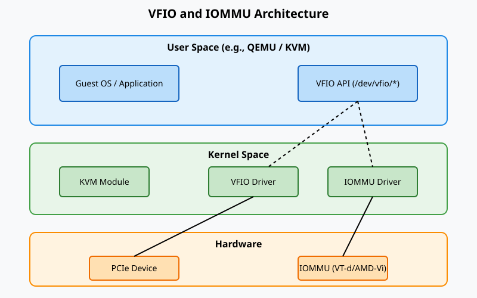

# Парапрохідність пристроїв та IOMMU-групи (VFIO)

<preknowlist>
- [Концепції ядра Linux](book:unix-linux/kernel-and-userspace) — базові поняття системних викликів та VFS.
</preknowlist>

Сучасні системи віртуалізації стикаються з фундаментальним компромісом між продуктивністю та ізоляцією. Емуляція апаратних пристроїв гарантує безпеку, але створює значне навантаження на центральний процесор та вносить затримки (latency). Для додатків, що вимагають максимальної пропускної здатності та мінімальних затримок — таких як високопродуктивні обчислення (HPC), машинне навчання на GPU, 10/40/100 GbE мережеві інтерфейси та швидкісні NVMe накопичувачі — програмна емуляція не є життєздатним рішенням.

Технологія **прокидання пристроїв (Device Passthrough)** дозволяє гостьовій операційній системі (Guest OS) безпосередньо взаємодіяти з фізичним апаратним забезпеченням, минаючи рівень емуляції гіпервізора. У ядрі Linux стандартним та найбільш безпечним механізмом для реалізації цього є **VFIO (Virtual Function I/O)**. 

У цій статті ми детально розглянемо архітектуру VFIO, роль IOMMU, концепцію IOMMU-груп, внутрішні механізми ядра (зокрема `vfio-pci` та `vfio_iommu_type1`), процеси DMA-мапінгу та практичні аспекти налаштування прокидання PCIe пристроїв у середовищі QEMU/KVM.

---

## 1. Фундаментальні проблеми прямого доступу до обладнання

Щоб зрозуміти, навіщо потрібен VFIO, необхідно спочатку розглянути дві головні проблеми, які виникають при наданні гостьовій системі або процесу простору користувача (userspace) прямого доступу до апаратного забезпечення:

### 1.1. Direct Memory Access (DMA) та ізоляція пам'яті
Пристрої PCI/PCIe здатні виконувати DMA-операції — пряме читання та запис в оперативну пам'ять системи без участі центрального процесора. Якщо гостьовій системі надати повний контроль над фізичним пристроєм, вона може налаштувати цей пристрій на читання або запис у будь-яку ділянку фізичної оперативної пам'яті хоста, включно з пам'яттю інших віртуальних машин або самого гіпервізора. Це повністю руйнує модель ізоляції віртуалізації, дозволяючи зловмисній (або просто помилковій) гостьовій ОС скомпрометувати всю систему.

Гостьова ОС оперує *гостьовими фізичними адресами (GPA - Guest Physical Address)*, які насправді є віртуальними адресами з точки зору хост-системи. Проте апаратний пристрій для DMA-операцій використовує реальні *хостові фізичні адреси (HPA - Host Physical Address)*. Якщо гостьова ОС накаже пристрою здійснити DMA-запис за адресою GPA `0x1000`, пристрій спробує записати дані за фізичною адресою `0x1000` на шині хоста, що неминуче призведе до пошкодження даних хоста.

### 1.2. Переривання (Interrupts)
Фізичні пристрої генерують переривання, щоб повідомити процесору про завершення операції або наявність нових даних. Історично PCI-пристрої використовували лінійні переривання (INTx). Сучасні PCIe-пристрої використовують переривання на основі повідомлень — MSI (Message Signaled Interrupts) та MSI-X.
MSI/MSI-X по суті є DMA-записами (операціями запису в пам'ять) за спеціальними адресами, які контролер переривань (наприклад, APIC) інтерпретує як переривання. Без належного контролю, гостьова система може налаштувати пристрій на генерацію довільних переривань, спричиняючи відмову в обслуговуванні (DoS) або порушуючи роботу інших пристроїв хоста.

## 2. IOMMU (Input-Output Memory Management Unit)

Вирішенням цих проблем є апаратний компонент під назвою **IOMMU**. Як і звичайний MMU (Memory Management Unit), який транслює віртуальні адреси процесора у фізичні, IOMMU виконує трансляцію адрес для периферійних пристроїв.

### 2.1. Архітектура IOMMU
IOMMU розміщується між периферійною шиною (PCIe Root Complex) та контролером оперативної пам'яті. Основні реалізації IOMMU:
*   **Intel VT-d** (Virtualization Technology for Directed I/O)
*   **AMD-Vi** (раніше відомий як IOMMU)
*   **ARM SMMU** (System MMU)


*Рис. 1: Взаємодія VFIO та IOMMU в Linux.*

IOMMU виконує дві критично важливі функції:
1.  **DMA Remapping (Трансляція DMA адрес):** IOMMU перехоплює всі DMA-запити від пристроїв. Він використовує таблиці сторінок IOMMU (які налаштовує ядро хоста) для трансляції I/O віртуальних адрес (IOVA), наданих пристроєм, у реальні хостові фізичні адреси (HPA). Якщо пристрій намагається отримати доступ до адреси, для якої немає валідного запису в таблиці трансляції IOMMU (DMA Fault), транзакція блокується, а ядру хоста надсилається звіт про помилку (DMAR fault).
2.  **Interrupt Remapping (Перенаправлення переривань):** IOMMU перехоплює транзакції MSI/MSI-X і валідує їх. Завдяки цій функції гостьова система не може генерувати довільні переривання, намагаючись записати дані у регістри APIC; IOMMU пропустить лише ті переривання, які були явно дозволені гіпервізором. Це ключова вимога для безпечного призначення пристроїв віртуальним машинам.

### 2.2. Забезпечення безпеки через IOMMU
Використовуючи IOMMU, гіпервізор (KVM) або фреймворк VFIO може створити безпечне середовище для пристрою. Гіпервізор налаштовує таблиці IOMMU так, щоб IOVA (які бачить пристрій) відповідали GPA (гостьовим фізичним адресам).
Коли гостьовий драйвер налаштовує пристрій на DMA-передачу, він передає йому GPA. Пристрій відправляє транзакцію з цією адресою. IOMMU перехоплює транзакцію, перевіряє свої таблиці сторінок, транслятує GPA у відповідну HPA і дозволяє транзакції досягти оперативної пам'яті хоста. Гостьова ОС залишається повністю ізольованою: вона не може наказати пристрою модифікувати пам'ять поза межами виділеної їй оперативної пам'яті, оскільки IOMMU просто відхилить таку транзакцію.

---

## 3. IOMMU-групи (IOMMU Groups)

Найважливішою і часто найскладнішою для розуміння концепцією у прокиданні пристроїв є **IOMMU-групи**.

IOMMU-група — це найменший набір фізичних пристроїв, який може бути ізольований апаратним IOMMU. Це означає, що всі пристрої в межах однієї IOMMU-групи не можуть бути безпечно ізольовані один від одного з точки зору DMA-доступу, але група в цілому ізольована від усіх інших пристроїв системи.

### 3.1. Чому існують IOMMU-групи?
У ідеальному світі кожен PCI/PCIe пристрій міг би бути ізольований індивідуально (кожен пристрій у власній групі). Однак топологія шини PCIe та особливості апаратної маршрутизації роблять це не завжди можливим.

Пристрої можуть обмінюватися даними один з одним безпосередньо через PCIe комутатори (свічі), не звертаючись до Root Complex, де зазвичай розташований IOMMU. Це явище називається *Peer-to-Peer (P2P) DMA*. Якщо два пристрої підключені до одного комутатора PCIe, який не підтримує механізми ізоляції портів, один пристрій може виконати DMA-запит до іншого. 

Якщо ми передамо Пристрій A гостьовій машині, а Пристрій B залишимо хосту, і при цьому вони знаходяться під одним PCIe-комутатором без належної ізоляції, гостьова система може наказати Пристрою A зчитати або змінити пам'ять, що належить Пристрою B, обходячи таким чином IOMMU (адже транзакція P2P ніколи не досягає Root Complex і IOMMU).

### 3.2. Access Control Services (ACS)
Для вирішення проблеми P2P DMA стандарт PCIe запровадив функцію **ACS (Access Control Services)**. ACS дозволяє PCIe-свічам та мостам контролювати маршрутизацію транзакцій. Зокрема, ACS може змусити комутатор надсилати *всі* P2P транзакції вгору до Root Complex, де вони будуть перевірені та транслятовані IOMMU.

Якщо кожен компонент у шляху від пристрою до Root Complex (усі мости та комутатори) підтримує та має увімкнений ACS, ядро Linux може гарантувати повну ізоляцію, і пристрій отримає власну IOMMU-групу.
Якщо ж у ланцюжку є пристрій (наприклад, інтегрований у чипсет міст), який не підтримує ACS, ядро Linux мусить вважати, що всі пристрої "за" цим мостом можуть безперешкодно виконувати DMA один до одного. Відповідно, з міркувань безпеки, ядро об'єднає всі ці пристрої в одну загальну IOMMU-групу.

### 3.3. Правило цілісності IOMMU-груп
Фундаментальне правило VFIO: **Ви не можете прокинути окремий пристрій, ви повинні передати всю IOMMU-групу цілком**. 

Всі пристрої в одній IOMMU-групі повинні керуватися одним драйвером (наприклад, драйвером `vfio-pci`), або частина пристроїв у групі не повинна мати завантаженого драйвера взагалі. Якщо ви хочете передати відеокарту віртуальній машині, але вона знаходиться в одній IOMMU-групі з вашим хостовим USB-контролером або мережевою картою, ви будете змушені відв'язати драйвери хоста і від USB/Мережі, залишивши хост без них (або передати їх всі у ВМ). Це часта проблема на десктопних материнських платах, де виробники інтегрують безліч пристроїв за одним мостом без підтримки ACS.

#### Перевірка IOMMU-груп у sysfs
Ядро Linux надає інформацію про IOMMU-групи через віртуальну файлову систему `sysfs`. Топологія доступна у `/sys/kernel/iommu_groups/`.

Скрипт на bash для виведення всіх пристроїв і їхніх IOMMU-груп:
```bash
#!/bin/bash
shopt -s nullglob
for g in $(find /sys/kernel/iommu_groups/* -maxdepth 0 -type d | sort -V); do
    echo "IOMMU Group ${g##*/}:"
    for d in $g/devices/*; do
        echo -e "\t$(lspci -nns ${d##*/})"
    done
done
```
Цей скрипт покаже структуру, наприклад:
```
IOMMU Group 14:
	00:1f.0 ISA bridge [0601]: Intel Corporation Z390 Chipset LPC/eSPI Controller [8086:a2c9] (rev 10)
	00:1f.3 Audio device [0403]: Intel Corporation Cannon Lake PCH cAVS [8086:a2f0] (rev 10)
	00:1f.4 SMBus [0c05]: Intel Corporation Cannon Lake PCH SMBus Controller [8086:a2a3] (rev 10)
	00:1f.5 Serial bus controller [0c80]: Intel Corporation Cannon Lake PCH SPI Controller [8086:a2a4] (rev 10)
IOMMU Group 15:
	01:00.0 VGA compatible controller [0300]: NVIDIA Corporation GP104 [GeForce GTX 1080] [10de:1b80] (rev a1)
	01:00.1 Audio device [0403]: NVIDIA Corporation GP104 High Definition Audio Controller [10de:10f0] (rev a1)
```
Як бачимо, VGA-контролер та його HDA Audio частина (що використовується для HDMI звуку) знаходяться в одній групі 15. Для їх прокидання у ВМ потрібно прив'язати драйвер `vfio-pci` до обох пристроїв (01:00.0 та 01:00.1).

---

## 4. Архітектура та компоненти VFIO

**VFIO (Virtual Function I/O)** — це фреймворк у ядрі Linux (представлений у версії 3.6), який замінив старий і менш безпечний механізм KVM Device Assignment (KVM-assign). На відміну від KVM-assign, який був жорстко прив'язаний до KVM, VFIO є універсальним інтерфейсом простору користувача (userspace) для прямого доступу до пристроїв. VFIO може використовуватися не тільки гіпервізорами (QEMU/KVM, Firecracker, Cloud Hypervisor), але й додатками простору користувача, наприклад, DPDK (Data Plane Development Kit) або SPDK (Storage Performance Development Kit), які пишуть власні драйвери для мережевих карт або NVMe накопичувачів, працюючи повністю в userspace без переключень контексту у ядро, досягаючи гігантської продуктивності.

VFIO базується на парадигмі безпечного (secure) IOMMU. Він розроблений таким чином, щоб зробити неможливим порушення безпеки хоста застосунком з userspace, який використовує пристрій.

Архітектура VFIO складається з кількох модулів ядра, кожен з яких виконує свою роль.

### 4.1. Основний модуль (vfio)
Головний модуль `vfio` надає загальний фреймворк та абстракції. Він створює символьний пристрій `/dev/vfio/vfio` — головний контрольний вузол (control node). 
Застосунки простору користувача (наприклад, QEMU) відкривають цей файл-пристрій для взаємодії з фреймворком. Він реалізує API на основі системних викликів `ioctl`.

### 4.2. IOMMU-бекенди (vfio_iommu_type1)
VFIO є модульним відносно реалізації IOMMU. Backend модуль відповідає за програмування апаратного IOMMU.
Найпоширенішим є модуль `vfio_iommu_type1`, який реалізує підтримку x86 систем з IOMMU (Intel VT-d та AMD-Vi) і дотримується семантики Type1.
Цей модуль керує IOMMU доменами, відповідає за прив'язку (pinning) сторінок оперативної пам'яті (щоб вони не були витіснені в swap під час роботи DMA) та налаштовує таблиці трансляції IOMMU (створюючи відповідності між IOVA та HPA за допомогою `VFIO_IOMMU_MAP_DMA` ioctl).
Існують також інші бекенди, наприклад `vfio_iommu_spapr_tce` для архітектури IBM POWER.

### 4.3. Bus-specific драйвери пристроїв (vfio-pci)
Ці модулі забезпечують специфічну для шини взаємодію з апаратним забезпеченням. 
`vfio-pci` — це найпопулярніший драйвер, який прив'язується до PCI/PCIe пристроїв. З точки зору підсистеми PCI ядра Linux, `vfio-pci` — це звичайний драйвер пристрою. Коли пристрій (наприклад, GPU) прив'язаний до `vfio-pci`, драйвер хоста (наприклад, `nouveau`, `amdgpu`, `nvidia`) більше не контролює цей пристрій. 

Завдання `vfio-pci`:
*   Надавати механізми читання/запису у конфігураційний простір PCI (PCI Config Space).
*   Керувати відображенням BAR-регістрів (Base Address Registers) пристрою в пам'ять userspace процесу (через `mmap`).
*   Маршрутизувати переривання. Він перехоплює INTx або налаштовує MSI/MSI-X через ядро (використовуючи eventfd) і передає їх у QEMU для подальшої ін'єкції у гостьову ОС.

Крім `vfio-pci` існують `vfio-platform` для SoC-пристроїв (AMBA шина), `vfio-ap` для крипто-акселераторів IBM s390 тощо.

---

## 5. Процес ініціалізації VFIO з userspace (QEMU)

Розглянемо, як QEMU взаємодіє з VFIO для прокидання пристрою. Ця послідовність системних викликів демонструє строгий підхід VFIO до безпеки IOMMU-груп.

1.  **Відкриття контейнера:** QEMU відкриває головний вузол `/dev/vfio/vfio` для створення нового "VFIO-контейнера". Контейнер — це абстракція, яка представляє один IOMMU-домен (єдиний простір трансляції адрес).
    ```c
    int container_fd = open("/dev/vfio/vfio", O_RDWR);
    ```

2.  **Перевірка версії та API:** 
    ```c
    ioctl(container_fd, VFIO_GET_API_VERSION);
    ioctl(container_fd, VFIO_CHECK_EXTENSION, VFIO_TYPE1_IOMMU);
    ```

3.  **Відкриття IOMMU-групи:** QEMU знаходить, до якої групи належить пристрій, та відкриває файл групи, який VFIO створює в `/dev/vfio/<номер_групи>`. Цей файл з'являється лише тоді, коли *всі* пристрої у цій групі прив'язані до VFIO-сумісних драйверів (або не мають драйверів). Якщо хоч один пристрій у групі контролюється звичайним драйвером хоста (наприклад `xhci_hcd`), спроба відкрити файл групи провалиться або його там просто не буде.
    ```c
    int group_fd = open("/dev/vfio/42", O_RDWR);
    ```

4.  **Приєднання групи до контейнера:** QEMU додає групу до свого контейнера. Це вказує ядру, що пристрої в цій групі тепер працюватимуть у просторі адрес цього контейнера.
    ```c
    ioctl(group_fd, VFIO_GROUP_SET_CONTAINER, &container_fd);
    ```

5.  **Встановлення типу IOMMU:** Після приєднання групи, QEMU наказує контейнеру ініціалізувати бекенд IOMMU (Type1).
    ```c
    ioctl(container_fd, VFIO_SET_IOMMU, VFIO_TYPE1_IOMMU);
    ```

6.  **Отримання файлового дескриптора пристрою:** Тільки зараз, маючи безпечний налаштований IOMMU домен, QEMU може отримати доступ до самого PCI пристрою, зробивши запит до файлового дескриптора групи. 
    ```c
    int device_fd = ioctl(group_fd, VFIO_GROUP_GET_DEVICE_FD, "0000:01:00.0");
    ```
    `device_fd` використовується для мапінгу BAR (MMIO) та налаштування переривань.

7.  **Налаштування DMA (Memory Pinning & Mapping):** Коли QEMU виділяє оперативну пам'ять для віртуальної машини (RAM), він повинен повідомити IOMMU про ці сторінки пам'яті. QEMU викликає ioctl `VFIO_IOMMU_MAP_DMA` на контейнері.
    Для кожної виділеної ділянки гостьової пам'яті (GPA), QEMU передає ядру віртуальну адресу користувача (HVA - Host Virtual Address), гостьову фізичну адресу (IOVA/GPA) та розмір.
    
    Ядро (через `vfio_iommu_type1`) виконує наступне:
    *   Визначає HPA (фізичну адресу) для наданої HVA.
    *   Виконує **page pinning** (закріплення сторінок). Це означає, що ядро забороняє відправляти ці сторінки пам'яті у swap (файл підкачки). Якщо сторінка буде відправлена в swap, а фізичний пристрій спробує зробити туди DMA, він прочитає/запише випадкові дані, оскільки IOMMU не інтегрований з підсистемою page fault ядра процесора (до появи технології PCIe PRI/PASID, яка наразі рідко застосовується).
    *   Програмує апаратні таблиці сторінок IOMMU, додаючи запис: `IOVA (GPA) -> HPA`.

Після цього пристрій готовий до безпечної роботи під повним контролем QEMU.

---

## 6. Практичне налаштування VFIO Passthrough

Для того, щоб прокинути PCIe-пристрій (наприклад, GPU) у віртуальну машину на Linux, необхідно виконати серію кроків. Налаштування вимагає ретельної підготовки хост-системи.

### Крок 1. Увімкнення IOMMU в BIOS/UEFI та ядрі
В налаштуваннях материнської плати потрібно знайти і активувати опції `Intel VT-d` або `AMD IOMMU`. Також можуть знадобитись опції типу `SR-IOV`, `ACS`, `AER`.

Далі IOMMU потрібно активувати у ядрі Linux через параметри завантаження (GRUB, systemd-boot). У файл `/etc/default/grub` до рядка `GRUB_CMDLINE_LINUX_DEFAULT` додаємо:
*   Для Intel: `intel_iommu=on iommu=pt`
*   Для AMD: `amd_iommu=on iommu=pt` (хоча на нових ядрах AMD IOMMU часто ввімкнено за замовчуванням).

Параметр `iommu=pt` (Passthrough mode для IOMMU) оптимізує продуктивність пристроїв, що залишаються на хості. У цьому режимі IOMMU пропускає DMA транзакції хостових пристроїв 1:1 без трансляції, що зменшує накладні витрати IOMMU (TLB miss), тоді як пристрої, передані через VFIO, використовують виділені домени трансляції.

Після оновлення GRUB і перезавантаження, слід перевірити dmesg:
```bash
dmesg | grep -e DMAR -e IOMMU
```
Повинно з'явитися повідомлення на зразок `DMAR: IOMMU enabled` або `AMD-Vi: Interrupt remapping enabled`.

### Крок 2. Ізоляція пристрою та прив'язка до vfio-pci
Ядро не дозволить QEMU захопити пристрій, якщо він зайнятий драйвером хоста (наприклад `nvidia`). Потрібно змусити ядро використовувати `vfio-pci` для цільового пристрою ще до старту графічного сервера.
Визначаємо PCI ID нашого пристрою (vendor:device).
```bash
lspci -nn | grep -i nvidia
01:00.0 VGA compatible controller [0300]: NVIDIA Corporation GP104 [GeForce GTX 1080] [10de:1b80]
01:00.1 Audio device [0403]: NVIDIA Corporation GP104 High Definition Audio Controller [10de:10f0]
```
У цьому прикладі ID: `10de:1b80` та `10de:10f0`.

Передаємо їх модулю `vfio-pci` під час завантаження через параметр ядра, або створюємо конфігураційний файл modprobe:
`/etc/modprobe.d/vfio.conf`:
```
options vfio-pci ids=10de:1b80,10de:10f0
```
Для того, щоб `vfio-pci` захопив пристрій раніше драйверів GPU, додаємо модулі в initramfs. Налаштовуємо порядок завантаження модулів:
`/etc/initramfs-tools/modules` (Ubuntu/Debian) або `/etc/mkinitcpio.conf` (Arch):
```
vfio_pci
vfio
vfio_iommu_type1
vfio_virqfd
```
Після регенерації initramfs (`update-initramfs -u`) та перезавантаження, перевіряємо, який драйвер використовується:
```bash
lspci -k -s 01:00.0
01:00.0 VGA compatible controller: NVIDIA Corporation GP104 [GeForce GTX 1080]
	Kernel driver in use: vfio-pci
	Kernel modules: nvidiafb, nouveau, nvidia_drm, nvidia
```
Якщо `Kernel driver in use` вказує на `vfio-pci` — ізоляція пройшла успішно. Пристрій більше не доступний хосту і очікує підключення userspace застосунку.

### Крок 3. Налаштування libvirt/QEMU
Тепер пристрій можна призначити віртуальній машині. Якщо використовується менеджер віртуалізації libvirt (через virt-manager), пристрій додається як `Host PCI Device`. 

Libvirt автоматично генерує необхідні аргументи для QEMU, але "під капотом" це виглядає як аргумент командного рядка:
```
-device vfio-pci,host=01:00.0,id=hostdev0,bus=pci.0,addr=0x8
-device vfio-pci,host=01:00.1,id=hostdev1,bus=pci.0,addr=0x9
```
XML конфігурація libvirt:
```xml
<hostdev mode='subsystem' type='pci' managed='yes'>
  <source>
    <address domain='0x0000' bus='0x01' slot='0x00' function='0x0'/>
  </source>
  <address type='pci' domain='0x0000' bus='0x00' slot='0x08' function='0x0'/>
</hostdev>
```
Атрибут `managed='yes'` вказує libvirt автоматично відв'язати драйвер хоста (bind/unbind) та перемкнути його на `vfio-pci` під час старту ВМ, а після зупинки — повернути назад. Якщо пристрій не ізольований жорстко при завантаженні системи, libvirt спробує зробити це динамічно. Але для GPU зазвичай потрібна жорстка ізоляція (Крок 2), оскільки Xorg/Wayland і консольний фреймбуфер хоста міцно захоплюють GPU і динамічне відв'язування часто призводить до зависання хоста (kernel panic).

---

## 7. SR-IOV: Віртуалізація на апаратному рівні

Традиційний VFIO дозволяє віддати один фізичний пристрій лише одній віртуальній машині. Що робити, якщо ми хочемо передати швидкісну 40-гігабітну мережеву карту десяткам віртуальних машин одночасно, забезпечуючи кожній прямий DMA-доступ та продуктивність bare-metal?
Для цього була створена специфікація **SR-IOV (Single Root I/O Virtualization)**. 

SR-IOV дозволяє одному PCIe-пристрою (наприклад, NIC або NVMe SSD) представлятися гіпервізору як кілька незалежних PCIe-пристроїв.
Пристрій з підтримкою SR-IOV розділяється на:
1.  **Physical Function (PF):** Це повноцінна PCI-функція, яка підтримує можливості налаштування пристрою і SR-IOV. PF контролюється хостом.
2.  **Virtual Functions (VF):** Це "полегшені" PCI-функції. Вони мають конфігураційний простір та BAR для DMA-доступу, але не мають доступу до загальних налаштувань апаратного забезпечення. Кожен VF можна передати окремій віртуальній машині за допомогою `vfio-pci`.

### Активація SR-IOV у Linux
Щоб увімкнути віртуальні функції (VFs) на мережевій карті, що підтримує SR-IOV, потрібно записати їх бажану кількість у файл `sriov_numvfs` у директорії sysfs фізичної функції (PF).
```bash
# Знайти максимальну кількість VF, що підтримує пристрій
cat /sys/bus/pci/devices/0000:03:00.0/sriov_totalvfs
64

# Увімкнути 4 віртуальні функції
echo 4 > /sys/bus/pci/devices/0000:03:00.0/sriov_numvfs
```
Після виконання цієї команди на шині PCI (`lspci`) з'являться 4 нові пристрої (Virtual Functions). Вони матимуть власні незалежні IOMMU-групи, оскільки апаратне забезпечення SR-IOV та мости гарантують їхню повну ізоляцію і захист від P2P DMA атак між віртуальними машинами.
Потім кожну з цих VF можна відв'язати від стандартного драйвера (наприклад `ixgbevf`), прив'язати до `vfio-pci` і передати QEMU.
Мережевий комутатор вбудований безпосередньо в апаратну мережеву плату забезпечує апаратну комутацію пакетів між цими VF і фізичним портом без участі процесора.

---

## 8. NPT/EPT та взаємодія з IOMMU

Сучасна віртуалізація спирається на апаратну підтримку віртуалізації пам'яті: Nested Page Tables (AMD NPT) або Extended Page Tables (Intel EPT). 

При використанні програмної емуляції, коли гостьова система записує дані в пам'ять емульованого пристрою (MMIO), гіпервізор перехоплює сторінкову помилку (VM-Exit), розпізнає запис і виконує операцію.
При використанні VFIO (passthrough), гіпервізор налаштовує EPT/NPT таким чином, щоб сторінки пам'яті (BAR), що належать фізичному пристрою, були безпосередньо відображені в гостьовий фізичний адресний простір (GPA).

Коли гостьовий драйвер записує команду в регістр пристрою:
1. Процесор транслятує гостьову віртуальну адресу (GVA) в гостьову фізичну (GPA) через гостьові таблиці сторінок.
2. Процесор використовує EPT/NPT для трансляції GPA в хостову фізичну адресу (HPA).
3. Звернення за цією HPA потрапляє безпосередньо на шину PCIe, доставляючи команду в BAR фізичного пристрою.

Ця транзакція виконується суто на апаратному рівні **без VM-Exit**. Це дозволяє досягти затримок, ідентичних до native-системи.
Водночас IOMMU забезпечує зворотний шлях: коли сам пристрій (через DMA) намагається зчитати дані з RAM, IOMMU транслятує IOVA(GPA) в HPA.

Таким чином, CPU MMU (через EPT/NPT) захищає фізичну пам'ять від процесора, що працює в контексті віртуальної машини, а IOMMU захищає фізичну пам'ять від пристрою на шині PCIe.

---

## 9. ACS Override Patch (Ризики та обхід)

Як зазначалося раніше, якщо PCIe-мости материнської плати не підтримують Access Control Services (ACS), ядро об'єднує багато пристроїв в одну велетенську IOMMU-групу. 

У спільноті VFIO-ентузіастів (r/VFIO), які будують системи для геймінгу на віртуальних машинах Windows, популярним є патч ядра **"ACS Override Patch"**. Цей неофіційний патч ядра ігнорує реальні апаратні можливості і змушує ядро примусово розбити пристрої на окремі IOMMU-групи, ніби всі мости підтримують ACS ізоляцію.

Параметр завантаження патченого ядра виглядає так: `pcie_acs_override=downstream,multifunction`.

### Наслідки безпеки
Використання ACS Override ламає фундаментальні гарантії ізоляції IOMMU. Віртуальна машина може використовувати P2P DMA (пряму комунікацію пристроїв через міст) для модифікації пам'яті іншого пристрою в тій же (реальній) групі, що залишився на хості. Якщо віртуальна машина зламана, або просто містить багований драйвер, вона може перезаписати регістри хостового пристрою, спричинити паніку ядра (kernel panic) на хості або гірше — прочитати дані хоста.
Для Enterprise-рішень, хмарних провайдерів та продакшн-систем використання ACS-Override суворо заборонено. Натомість використовується серверне апаратне забезпечення корпоративного класу (Intel Xeon, AMD EPYC), де топологія PCIe і чипсети від початку спроектовані з повною підтримкою ACS та глибокої IOMMU-ізоляції.

## Підсумки

VFIO та IOMMU надають надійний, високопродуктивний і безпечний інтерфейс для доступу до апаратного забезпечення безпосередньо з userspace та віртуальних машин. Використовуючи строгий мапінг DMA (закріплення сторінок пам'яті) та перенаправлення переривань, система гарантує, що неконтрольований код гостя ніяк не зможе зашкодити пам'яті чи стабільності хоста. А разом з технологіями на зразок SR-IOV, ця екосистема стала фундаментом для сучасної мережевої віртуалізації (NFV/SDN) та хмарної інфраструктури.
