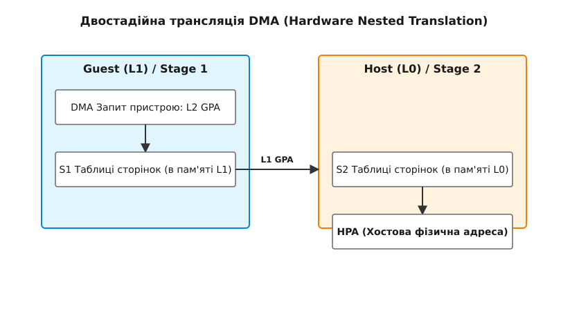

<preknowlist>
- [KVM та QEMU](book:unix-linux/kvm-and-qemu-architecture) — ролі хоста L0, гостьової віртуальної машини L1 та вкладеного гостя L2.
- [DMA та підсистема IOMMU](book:unix-linux/dma-mapping-subsystem-and-iommu) — базові принципи апаратного перетворення адрес та ізоляції пристроїв.
- [VFIO passthrough](book:unix-linux/vfio-passthrough) — безпечне прокидання PCI-пристроїв у просторі користувача.
- [Вкладена віртуалізація в KVM](book:unix-linux/nested-virtualization-kvm) — налаштування та принципи запуску гіпервізора всередині віртуальної машини.
</preknowlist>

# Віртуальний IOMMU (vIOMMU) для вкладеного прокидання

Пряме прокидання 100-гігабітної мережевої карти PCIe у вкладену віртуальну машину L2 завершується апаратним збоєм `DMAR Fault` на хості L0 під час першої ж спроби DMA-запису, якщо пристрій надсилає адреси L2 GPA (Guest Physical Address), про які фізичний IOMMU нічого не знає. Фізичний IOMMU хоста програмується гіпервізором L0 виключно для трансляції адрес L1 GPA у фізичні адреси хоста HPA (Host Physical Address). Коли L1-гіпервізор намагається ізолювати пристрій для L2, він мусить самостійно керувати трансляцією адрес DMA. Проте без доступу до апаратного IOMMU гіпервізор L1 не здатний налаштувати правила ізоляції, а будь-яка спроба DMA за адресами L2 обривається фізичним IOMMU хоста. Цю суперечність розв'язує **віртуальний IOMMU (vIOMMU)** — програмний пристрій в L0, який надає L1 ілюзію власного апаратного IOMMU та повного контролю над трансляцією DMA.

## Проблема DMA у вкладеному середовищі

Без віртуалізації, у звичайній роботі, пристрій виставляє на шину PCIe фізичну адресу оперативної пам'яті (HPA). IOMMU (Input/Output Memory Management Unit) перехоплює цей запит і перевіряє, чи має пристрій право писати за цією адресою.

У звичайній віртуалізації з IOMMU (один рівень L1) гіпервізор L0 налаштовує апаратний IOMMU так, щоб пристрій оперував гостьовими фізичними адресами (L1 GPA). Фізичний IOMMU бере L1 GPA і за своїми таблицями сторінок перетворює її на HPA.

У середовищі вкладеної віртуалізації виникає трирівнева адресація:
1. Гіпервізор L0 на хості контролює фізичний IOMMU і володіє таблицями L1 GPA → HPA.
2. Віртуальна машина L1 отримує фізичний PCI-пристрій через VFIO.
3. ОС всередині L1 запускає власний гіпервізор і створює вкладену віртуальну машину L2.
4. Гіпервізор L1 намагається прокинути цей самий пристрій у L2 через VFIO.
5. Пристрій, виконуючи команду від L2, надсилає на шину PCIe адресу L2 GPA.

Фізичний IOMMU на хості L0 налаштований лише на таблицю L1 GPA → HPA. Отримавши адресу L2 GPA, апаратний контролер IOMMU шукає її у своїх таблицях. Оскільки адреси L2 GPA там немає (або вона вказує на сторонню пам'ять L1), IOMMU блокує транзакцію, перериває процесор і генерує `DMAR Fault`.

Щоб L1 міг безпечно керувати пристроєм і заповнювати власний мапінг L2 GPA → L1 GPA, йому потрібен доступ до контролера IOMMU. Оскільки надати прямий доступ до фізичного заліза L0 не може (це порушило б безпеку хоста), QEMU на хості створює **віртуальний IOMMU (vIOMMU)**.

Ланцюг нижче — послідовність трансляції адрес, а не шлях сигналу: фізично транзакція PCIe проходить лише через фізичний IOMMU, а vIOMMU — це місце, де L1 задає правила першого кроку.

```
[Пристрій PCIe] ──(L2 GPA)──> [правила L1, задані через vIOMMU] ──(L1 GPA)──> [правила L0 у фізичному IOMMU] ──(HPA)──> [DRAM]
```

## Як працює Віртуальний IOMMU

vIOMMU — це емульований програмний пристрій (наприклад, `intel-iommu` або `virtio-iommu` в QEMU), який презентується гостьовій системі L1 як апаратний PCI-пристрій чи системний контролер. Під час завантаження ядро L1 виявляє vIOMMU через ACPI-таблиці DMAR (для Intel VT-d) або IORT (для ARM SMMU) і завантажує стандартний штатний драйвер IOMMU.

З точки зору ядра L1, vIOMMU працює як реальне залізо:
1. Драйвер L1 виділяє сторінки пам'яті під таблиці трансляції IOMMU.
2. Драйвер L1 записує фізичну адресу (L1 GPA) цих таблиць у віртуальні MMIO-регістри vIOMMU.
3. Коли L1 прокидає пристрій у L2, він будує у своїй пам'яті таблиці трансляції L2 GPA → L1 GPA.
4. L1 надсилає команду інвалідації кешу (IOTLB Invalidation) до vIOMMU.

Однак сам по собі vIOMMU не обробляє електричні сигнали PCIe. Фізичний пристрій під'єднаний до фізичного IOMMU на хості L0. Щоб апаратний IOMMU зміг виконати DMA-запит з адресою L2 GPA, гіпервізор L0 використовує один із двох підходів: **Тіньові таблиці сторінок (Shadow IOMMU)** або **Апаратну вкладену трансляцію (Hardware Nested Translation)**.

### Підхід 1: Тіньові таблиці сторінок IOMMU (Shadow IOMMU)

Тіньовий підхід застосовується, коли фізичний IOMMU хоста не підтримує апаратну двостадійну трансляцію.

У цьому режимі QEMU (L0) повністю перехоплює всі операції L1 з vIOMMU:
1. Драйвер L1 будує у своїй пам'яті таблицю `L2 GPA → L1 GPA`.
2. QEMU перехоплює команди інвалідації IOTLB від L1 (для цього в QEMU вмикається прапорець `caching-mode=on`, який змушує L1 повідомляти про будь-яку зміну в таблицях).
3. QEMU бере мапінг L1 (`L2 GPA → L1 GPA`) і зіставляє його з власною таблицею пам'яті L1 (`L1 GPA → HPA`).
4. В результаті математичного об'єднання QEMU отримує підсумкову результуючу таблицю: **`L2 GPA → HPA`**.
5. QEMU командою `ioctl(VFIO_IOMMU_MAP_DMA)` в ядрі L0 записує цю об'єднану тіньову таблицю безпосередньо у **фізичний IOMMU**.

> 🔧 **Навіщо це.** Тіньові таблиці дозволяють запустити вкладене прокидання на старішому обладнанні з підтримкою IOMMU. Проте ціна за це — катастрофічне падіння продуктивності: кожна зміна мапінгу викликає VM-exit, переключає контекст у QEMU, виконує системні виклики ядра L0 і перепрограмовує фізичне залізо.

Покрокова послідовність обробки змін у Shadow IOMMU:

```
1. L1 Kernel  ──(Оновлення pgtbl)──> Пам'ять L1
2. L1 Kernel  ──(IOTLB Invalidate)──> vIOMMU MMIO Regs (VM-Exit у L0 QEMU)
3. QEMU (L0)  ──(Обчислення L2->HPA)──> sys_ioctl(VFIO_IOMMU_MAP_DMA)
4. L0 Kernel  ──(Запис у фізичний HW)──> Фізичний IOMMU Registers
```

Накладні витрати Shadow IOMMU пов'язані з тим, що у сучасних мережевих картах або дискових контролерах динамічне створення мапінгів для нових буферів (dynamic DMA mapping) відбувається на кожен пакет чи блок даних. У результаті помітна частка процесорного часу йде не на корисні обчислення, а на обслуговування переключень між режимами VMX root та non-root — на навантаженнях із дрібними пакетами це коштує більше за саму корисну роботу.

### Підхід 2: Апаратна вкладена трансляція (Two-Stage Translation)

Сучасні IOMMU (Intel VT-d 3.0+ Scalable Mode, ARM SMMUv3) підтримують двостадійну трансляцію адрес (Two-Stage Translation) на рівні кремнію.

Апаратний IOMMU спроможний послідовно виконати два незалежні кроки трансляції для одного DMA-запиту:
- **Стадія 1 (Stage 1 / S1):** Перетворює L2 GPA (або віртуальну адресу GVA) у L1 GPA. Таблицями сторінок Стадії 1 керує виключно гостьова ОС L1.
- **Стадія 2 (Stage 2 / S2):** Перетворює L1 GPA у підсумкову адресу хоста HPA. Таблицями сторінок Стадії 2 керує гіпервізор L0.

Коли пристрій ініціює DMA з адресою L2 GPA, контролер IOMMU апаратно зчитує таблиці Стадії 1 з пам'яті L1, знаходить L1 GPA, а потім за таблицями Стадії 2 знаходить HPA.

Схема взаємодії при апаратній вкладеній трансляції:

```
[ Пристрій (DMA) ] ──(L2 GPA)──> [ Stage 1 (S1) Table ] ──(L1 GPA)──> [ Stage 2 (S2) Table ] ──(HPA)──> [ DRAM ]
                                  (Керується ОС L1)                    (Керується L0 KVM)
```

1. QEMU в L0 налаштовує Стадію 2 (L1 GPA → HPA) для віртуальної машини L1.
2. Коли L1 записує адресу своєї кореневої таблиці сторінок у vIOMMU, QEMU передає цю адресу (L1 GPA кореня) у ядро L0.
3. Ядро L0 налаштовує фізичний IOMMU так, щоб покажчик Стадії 1 для цього пристрою вказував безпосередньо на таблиці L1 у пам'яті гостя.
4. З цього моменту сам **запис** у таблиці сторінок L1 не спричиняє VM-exit: фізичний IOMMU читає оновлені таблиці з пам'яті L1 самостійно. Вихід у L0 лишається тільки на командах інвалідації IOTLB — апаратура не вгадає, що запис у пам'яті вже застарів, тож L1 мусить оголосити зміну явно.

## Структури даних Intel VT-d DMAR та ARM SMMUv3

Щоб краще уявити, як фізичний контролер оперує вкладеними таблицями, розглянемо структури даних пам'яті для двох провідних архітектур.

### Intel VT-d Scalable Mode

В архітектурі Intel VT-d пристрої PCI ідентифікуються через селектор `Bus:Device:Function (BDF)`. Дерево трансляції містить:
1. **Root Table:** 256 записів по 16 байтів, індексованих за номером шини PCI (Bus). Кожен запис вказує на Context Table.
2. **Context Table:** 256 записів, індексованих за номером пристрою та функції (`Dev:Fn`). У режимі Scalable Mode запис вказує на PASID Directory.
3. **PASID Directory & PASID Table:** Багаторівнева структура, що дозволяє асоціювати з одним пристроєм до 1 мільйона адресних просторів (PASID). Кожен запис PASID містить:
   - `PASID Entry S1 Pointer`: адреса кореня 4- або 5-рівневої таблиці сторінок Стадії 1. У вкладеному режимі це L1 GPA — апаратура доганяє її через Стадію 2.
   - `PASID Entry S2 Pointer`: Фізична адреса (HPA) кореня EPT/NPT таблиці сторінок Стадії 2.

При виконанні DMA-запиту апаратний магістральний контролер IOMMU спочатку використовує `PASID Entry S1 Pointer` для трансляції `L2 GPA → L1 GPA`, а на кожному кроці проходу по таблиці S1 застосовує `PASID Entry S2 Pointer` для перетворення адреси самого елемента таблиці з `L1 GPA` у `HPA`.

Пошук у каталозі PASID здійснюється у два етапи: вищі біти PASID визначають номер першого рівня (PASID Directory), а нижчі — конкретний запис у PASID Table. Це дозволяє гіпервізорам динамічно виділяти пам'ять лише для задіяних процесів або віртуальних машин L2.

### ARM SMMUv3 Architecture

В ARM SMMUv3 пристрої ідентифікуються за `StreamID` (еквівалент BDF). Ієрархія структур:
1. **Stream Table Entry (STE):** Вхідна точка для кожного пристрою. Запис STE містить поле `Config`, окремі біти якого вмикають Стадію 1 і Стадію 2:
   - `STE.S1ContextPtr`: вказує на дескриптор Context Descriptor (CD) Стадії 1 у пам'яті L1.
   - `STE.S2TTB`: вказує на Translation Table Base Стадії 2 в ядрі L0.

При вкладеному прокиданні гіпервізор L0 вмикає у `STE.Config` обидві стадії, а гіпервізор L1 через vIOMMU записує свої значення у віртуальний CD, який L0 зв'язує з `STE.S1ContextPtr`.

Особливістю ARM SMMUv3 є те, що всі конфігураційні запити надсилаються через кільцевий буфер Command Queue, розташований безпосередньо у пам'яті RAM. Через неї йдуть і конфігураційні команди, і інвалідації: драйвер ставить у чергу пачку команд і чекає на одне підтвердження замість запису в регістр на кожну дію. Intel VT-d має власну чергу інвалідації в пам'яті, але конфігурування там лишається за MMIO-регістрами.

## Порівняльний аналіз архітектур вкладеної трансляції

| Параметр | Intel VT-d (Scalable Mode) | ARM SMMUv3 | AMD-Vi (vIOMMU) | RISC-V IOMMU |
|---|---|---|---|---|
| **Назва Стадії 1** | Stage 1 (GVA/L2 GPA → L1 GPA) | Stage 1 (GVA/L2 GPA → L1 GPA) | Guest Translation | First Stage |
| **Назва Стадії 2** | Stage 2 (L1 GPA → HPA) | Stage 2 (L1 GPA → HPA) | Host Translation | Second Stage |
| **Командний інтерфейс** | MMIO / Invalidation Queue | RAM Command Queue | MMIO / Command Buffer | RAM Ring Buffer |
| **Ідентифікатор процесу** | PASID (20 біт) | SubstreamID / PASID | PASID | PASID |
| **Вкладений API ядра** | IOMMUFD (VT-d S1) | IOMMUFD (SMMUv3 CD) | IOMMUFD (AMD GCR3) | IOMMUFD (First Stage) |

## Прокидання пристроїв через VFIO всередині L1

Послідовність дій ядра L1 під час передачі пристрою у вкладену VM L2:

1. **Виявлення vIOMMU:** Ядро L1 під час завантаження розбирає ACPI DMAR або IORT, ініціалізує підсистему IOMMU та будує `/sys/kernel/iommu_groups/`.
2. **Прив'язка до vfio-pci:** Адміністратор відв'язує пристрій від штатного драйвера і прив'язує до `vfio-pci`:
   ```bash
   echo 0000:00:05.0 > /sys/bus/pci/devices/0000:00:05.0/driver/unbind
   echo 10de 1eb8 > /sys/bus/pci/drivers/vfio-pci/new_id
   ```
3. **Формування домену:** QEMU (в L1) відкриває `/dev/vfio/vfio`, додає групу пристрою та надсилає `ioctl(VFIO_IOMMU_MAP_DMA)` для створення мапінгів L2.
4. **Оновлення трансляції:** Драйвер vIOMMU в L1 записує нові елементи в таблиці Стадії 1. При апаратній трансляції фізичний IOMMU одразу бачить ці зміни в RAM L1.

Всі ці кроки виконуються прозоро для користувацьких додатків в L2. Гостьова ОС в L2 бачить пристрій як звичайний PCI-контролер і навіть не здогадується про існування проміжних рівнів віртуалізації.

## Внутрішня інтеграція ядра Linux: KVM MMU та IOMMUFD

KVM і підсистема IOMMU в ядрі L0 працюють над однією й тією самою гостьовою пам'яттю, але кожна веде власні таблиці: модуль KVM (`arch/x86/kvm/mmu/mmu.c`) формує EPT (Extended Page Tables) для доступів процесора, а IOMMUFD — таблиці Стадії 2 для доступів пристроїв. Спільної таблиці між ними немає. 

Узгодженість тримається не на сповіщеннях, а на закріпленні сторінок. Створюючи мапінг Стадії 2, IOMMUFD запінює сторінки гостя L1 (`pin_user_pages_fast()` з прапорцем `FOLL_LONGTERM`). Запінена сторінка не піде у swap, її не перенесе ущільнення пам'яті й не зіллє KSM — тобто фізичне розташування, записане в таблицях Стадії 2, не може змінитися за спиною пристрою. Мапінг знімається лише явним `IOMMU_IOAS_UNMAP` або закриттям дескриптора, і аж тоді сторінки розпінюються.

Координація дій між KVM MMU та IOMMUFD у процесі звільнення або перерозподілу пам'яті гарантує, що пристрої PCI не зможуть виконати неавторизоване читання чи запис за адресами, які більше не належать віртуальній машині. Це забезпечує повну ізоляцію хостової оперативної пам'яті. У разі спроби доступу за межами дозволеного домену апаратний контролер IOMMU обриває транзакцію, записує опис збою у свій регістр помилок і піднімає переривання, за яким ядро друкує `DMAR Fault`.

## IOTLB, PRI та Interrupt Remapping у vIOMMU

Повноцінна віртуалізація IOMMU вимагає емуляції не лише трансляції адрес, але й супутніх апаратних механізмів.

### Кешування IOTLB та ATS

IOMMU містить внутрішній кеш трансляцій — **IOTLB (Input/Output TLB)**. Коли L1 змінює мапінг у своїх таблицях, застарілі записи в IOTLB мусять бути скинуті. L1 надсилає команду інвалідації у vIOMMU, яка прокидається до фізичного IOMMU.

Якщо пристрій підтримує **ATS (Address Translation Services)**, він кешує адреси у власному внутрішньому DevTLB. При інвалідації vIOMMU транслює команду інвалідації в PCIe TLP-пакети `Invalidate Request`, які відправляються на фізичний пристрій.

Обробка інвалідації DevTLB виконується за схемою запит-відповідь: контролер IOMMU надсилає пакет пристрою і чекає на `Invalidate Completion`. Спиняються при цьому не ядра CPU, а той потік, що ініціював інвалідацію: він не може вважати стару трансляцію мертвою, доки підтвердження не прийшло.

### Interrupt Remapping (Перепризначення переривань, vIR)

Пристрої PCIe надсилають переривання MSI/MSI-X шляхом звичайного запису даних за спеціальною адресою APIC (`0xFEE00000`). Без захисту шкідливий пристрій міг би записати довільне значення і згенерувати фальшиве переривання на будь-якому ядрі CPU.

Апаратний Interrupt Remapping перехоплює такі записи і використовує таблицю **IRTE (Interrupt Remapping Table Entry)**:
- vIOMMU надає L1 віртуальну таблицю IRTE.
- Коли L1 налаштовує MSI для прокинутого в L2 пристрою, він записує вектор у віртуальну IRTE.
- QEMU в L0 перехоплює інвалідацію кешу переривань і перепрограмовує **фізичну IRTE** на хості.
- Фізичне переривання від пристрою безпечно перехоплюється KVM (L0), ін'єктується як віртуальне переривання в L1, а L1 передає його в L2.

### Page Request Interface (PRI) та Shared Virtual Memory (SVM)

Технологія **PASID (Process Address Space ID)** дозволяє IOMMU розрізняти не лише пристрої, а й окремі процеси всередині L2. Завдяки **Shared Virtual Memory (SVM)** пристрій може використовувати ті самі віртуальні адреси, що й процес у просторі користувача L2.

При виникненні промаху сторінки пристрій надсилає запит **PRI (Page Request Interface)**. Фізичний IOMMU перехоплює PRI, ядро L0 перетворює його на віртуальний PRI для vIOMMU, vIOMMU викликає переривання в L1, а ядро L1 (або L2) підвантажує сторінку з диска і повертає відповідь пристрою.

## IOMMUFD та розвиток ядра Linux

Традиційний фреймворк `vfio_iommu_type1` оперував жорсткими концепціями "контейнерів", що ускладнювало керування двостадійною трансляцією. Для розв'язання цієї проблеми в ядро Linux було впроваджено підсистему **IOMMUFD**.

IOMMUFD надає гнучкий API користувацького простору, де таблиці сторінок IOMMU представлені як окремі об'єкти **HWPT (Hardware Page Table)**:
- QEMU в L0 створює HWPT Стадії 2 (L1 GPA → HPA).
- QEMU створює вкладену HWPT Стадії 1 та пов'язує її з HWPT Стадії 2, передаючи ядру покажчик на кореневу структуру L1.

Практичну реалізацію створення вкладених доменів у системі розглядає [Налаштування вкладеної трансляції через IOMMUFD у C та C++](book:unix-linux/viommu-virtual-iommu/proj-nested-iommufd-bind.md).

Завдяки розділенню обов'язків між файловими дескрипторами пристроїв та таблиць сторінок, IOMMUFD дозволяє одночасно прив'язувати кілька пристроїв до однієї вкладеної HWPT Стадії 1, мінімізуючи споживання пам'яті у ядрі.

## Конфігурація vIOMMU в QEMU та libvirt

Приклад виклику QEMU для запуску L1 з підтримкою `intel-iommu` у режимі Shadow IOMMU:

```bash
qemu-system-x86_64 -m 8G -cpu host \
  -machine q35,accel=kvm,kernel-irqchip=split \
  -device intel-iommu,intremap=on,caching-mode=on \
  -device vfio-pci,host=03:00.0,id=hostdev0
```

Обов'язкові параметри:
- `machine q35`: надає емуляцію шини PCIe.
- `kernel-irqchip=split`: розділяє обробку переривань між KVM та QEMU для роботи Interrupt Remapping (`intremap=on`).
- `caching-mode=on`: змушує драйвер L1 надсилати інвалідації при будь-якій зміні таблиць (необхідно для Shadow IOMMU).

Конфігурація у libvirt XML:

```xml
<domain type='kvm'>
  <features>
    <ioapic driver='qemu'/>
  </features>
  <devices>
    <iommu model='intel'>
      <driver intremap='on' caching_mode='on'/>
    </iommu>
    <hostdev mode='subsystem' type='pci' managed='yes'>
      <source>
        <address domain='0x0000' bus='0x03' slot='0x00' function='0x0'/>
      </source>
    </hostdev>
  </devices>
</domain>
```

### Альтернатива: virtio-iommu

На відміну від складного емулятора Intel VT-d, **`virtio-iommu`** — це пара-віртуалізований стандарт IOMMU. Драйвер `virtio-iommu` в L1 не маніпулює віртуальними MMIO-регістрами, а відправляє чіткі команди `MAP` і `UNMAP` через стандартну чергу `virtqueue` прямо в гіпервізор L0.

Переваги `virtio-iommu`:
- **Кросплатформеність:** однаково працює на x86_64, ARM64 та RISC-V.
- **Простота:** відсутня потреба сканувати складні багаторівневі структури сторінок в пам'яті L1.
- **Продуктивність:** менші накладні витрати порівняно з Shadow VT-d.

Проте для досягнення найвищої швидкості вкладеного прокидання індустрія віддає перевагу апаратній двостадійній трансляції, оскільки `virtio-iommu` все одно вимагає виходу в гіпервізор на кожну команду `MAP`/`UNMAP` при зміні адресного простору.

## Поглиблений аналіз простеження: tracepoints та перф-моніторинг IOMMU

Для налагодження продуктивності та виявлення прихованих затримок під час обробки DMA-запитів ядро Linux надає набір вбудованих точок трасування (tracepoints).

Трасування подій IOMMU здійснюється через файлову систему `tracefs`:

```bash
# Увімкнення моніторингу подій DMAR та IOMMU
echo 1 > /sys/kernel/tracing/events/intel_iommu/enable
echo 1 > /sys/kernel/tracing/events/iommu/enable

# Перегляд журналу трасування в реальному часі
cat /sys/kernel/tracing/trace_pipe
```

Ключові події трасування підсистеми IOMMU:
- `iommu:map`: фіксує створення нового мапінгу (відображення адреси IOVA на фізичну сторінку).
- `iommu:unmap`: фіксує видалення мапінгу та розмір звільненого регіону пам'яті.
- події підсистеми `intel_iommu` (черга інвалідації, збої DMAR): їхній склад залежить від версії ядра, тож перелік наявного дає `ls /sys/kernel/tracing/events/intel_iommu/`.

При використанні BPF-скриптів (через `bpftrace`) розробники можуть вимірювати точний розподіл затримок між моментом видачі команди інвалідації драйвером L1 та моментом отримання підтвердження від апаратного контролера L0:

```bash
bpftrace -e 'kprobe:iommu_map { @start[tid] = nsecs; } kretprobe:iommu_map /@start[tid]/ { @latency = hist(nsecs - @start[tid]); delete(@start[tid]); }'
```

## Діагностика, sysfs-інспекція та усунення несправностей

При роботі з vIOMMU важливим є вміння діагностувати проблеми на хості L0 та в L1:

### Перевірка стану через sysfs у ядрі

В системі Linux стан підсистеми IOMMU можна відстежувати через каталог `/sys/class/iommu/`:

```bash
# Перевірка наявних контролерів IOMMU
ls -la /sys/class/iommu/

# Перевірка IOMMU груп для прокинутого пристрою
ls -la /sys/bus/pci/devices/0000:03:00.0/iommu_group/devices/
```

Якщо пристрій знаходиться у спільній IOMMU-групі з іншими пристроями шини (наприклад, через відсутність розширення ACS у PCI-мосту), VFIO не віддасть групу процесу, доки кожен пристрій групи не відв'язаний від свого драйвера й не прив'язаний до `vfio-pci` або `pci-stub`.

### Типові проблеми та методи виправлення

1. **Збої `DMAR Fault` у dmesg хоста L0:**
   - *Причина:* Пристрій виконав DMA за адресою, відсутньою в таблицях Стадії 2 або тіньових таблицях.
   - *Рішення:* Перевірити наявність `caching-mode=on` в QEMU при використанні Shadow IOMMU.
2. **L1 не бачить контролера IOMMU:**
   - *Причина:* Відсутність ACPI DMAR таблиць або відсутній параметр `intel_iommu=on` у командному рядку ядра L1.
   - *Рішення:* Перевірити `dmesg | grep -i dmar` в L1 та пересвідчитися, що конфігурація ядра L1 містить `CONFIG_INTEL_IOMMU=y`.
3. **Низька швидкість I/O у вкладеному гості L2:**
   - *Причина:* Використання Shadow IOMMU замість апаратної двостадійної трансляції через велику кількість VM-exits.
   - *Рішення:* Перейти на процесор та IOMMU з підтримкою Hardware Nested Translation або використовувати Huge Pages для зменшення кількості записів сторінок.


*Двостадійна трансляція адрес (Two-Stage Translation) в апаратному IOMMU: Стадія 1 (S1) виконує перетворення L2 GPA в L1 GPA під контролем гостя L1, а Стадія 2 (S2) перетворює L1 GPA в HPA під контролем хоста L0.*
