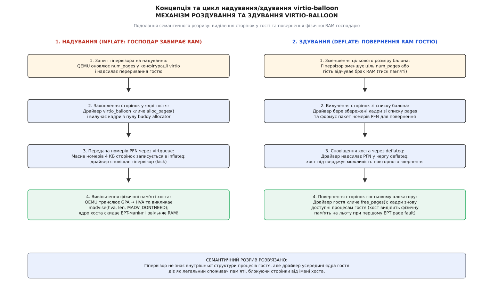
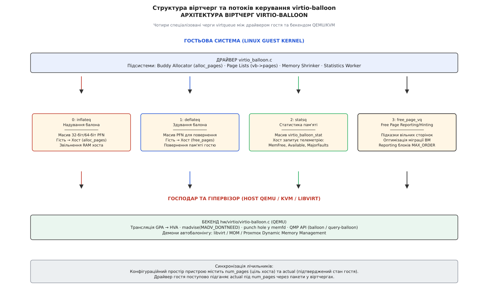
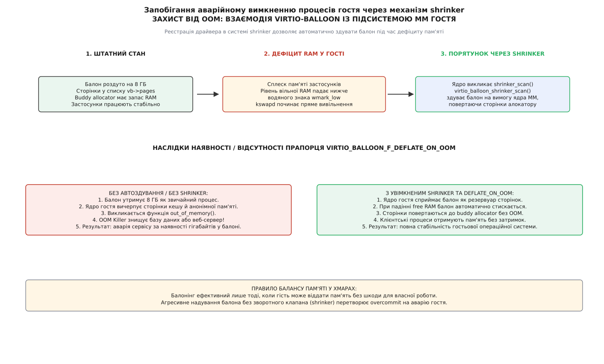
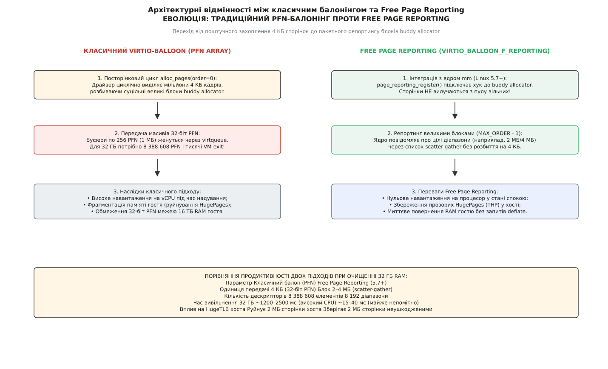

# virtio-balloon: надування балона й повернення сторінок господарю

<preknowlist>
- [Апаратна віртуалізація](topic:programming/hardware-virtualization) — як процесор виконує гостьовий код у режимі non-root і чому переходи між гостем і хостом (VM-exit) коштують тисячі тактів.
- [Розподілювач фізичних сторінок buddy allocator](topic:unix-linux/physical-page-allocator) — механізм парних блоків степенів двійки, сторінкові зони та порядок виділення пам'яті в ядрі.
- [Паравіртуалізований транспорт virtio](topic:unix-linux/virtio-transport) — кільцеві віртчерги (virtqueues), дескрипторні таблиці vring та асинхронні повідомлення kick/interrupt.
- [Overcommit пам'яті та OOM-killer](topic:unix-linux/overcommit-and-oom) — оцінка дефіциту ресурсів Committed_AS, евристика `oom_badness` та аварійне вилучення процесів.
- [Вкладені сторінкові таблиці EPT/NPT](topic:unix-linux/kvm-mmu-ept-npt) — дворівнева трансляція адрес GVA → GPA → HPA та обробка сторінкових помилок гіпервізора.
- [Дедуплікація сторінок KSM](topic:unix-linux/ksm-page-merging) — сканування анонімної пам'яті хоста та злиття ідентичних кадрів під Copy-On-Write.
- [Модель відображення пам'яті mmap](topic:unix-linux/mmap-model) — анонімні регіони, відкладене виділення пам'яті (demand paging) та системний виклик `madvise`.
</preknowlist>

## Семантичний розрив і трагедія надлишкового виділення

Фізичний сервер із 512 ГБ оперативної пам'яті запускає тридцять дві віртуальні машини, кожній з яких виділено статичний ліміт у 16 ГБ. На папері всі 512 ГБ пам'яті сервера вичерпано до останнього байта. Проте реальні сервіси всередині кожної віртуальної машини — веб-сервери, мікросервіси та бази даних у періоди низької активності — сумарно споживають лише по 3 ГБ оперативної пам'яті на кожну віртуальну машину.

Усередині кожної гостьової ОС 13 ГБ залишаються вільними у списках розподілювача сторінок buddy allocator. Сумарно понад 416 ГБ дорогої фізичної пам'яті хоста простоюють без діла. Проте адміністратор не може запустити на цьому сервері жодної нової віртуальної машини, оскільки статичне квотування пам'яті вичерпало доступний ліміт.

```
Фізична RAM хоста       = 512 ГБ
Виділено віртуальним машинам (32 · 16 ГБ) = 512 ГБ [формально 100% заповнення]
Реально зайнято гостями (32 · 3 ГБ)      = 96 ГБ  [реально зайнято лише 18.75%]
Простоює у списках buddy allocator       = 416 ГБ [заблоковано семантичним розривом]
```

Чому гіпервізор KVM/QEMU не може просто забрати ці 416 ГБ вільної пам'яті й віддати їх іншим процесам хоста?

Причина криється у фундаментальному явищі віртуалізації — семантичному розриві (англ. *semantic gap*). Гіпервізор бачить пам'ять гостя виключно як суцільний анонімний регіон, створений через виклик `mmap()`, і дворівневі таблиці трансляції Extended Page Tables ([EPT](topic:unix-linux/kvm-mmu-ept-npt)). Якщо гостьове ядро під час завантаження чи перевірки цілісності хоча б один раз записало байти у свої 16 ГБ фізичних адрес гостя (англ. *Guest Physical Address, GPA*), процесор зафіксував сторінкову помилку EPT-fault. Гіпервізор виділив реальну 4 КіБ сторінку хоста (англ. *Host Physical Address, HPA*) і прописав зв'язок у таблицях EPT.

Від цієї миті для апаратури хоста всі 16 ГБ пам'яті вважаються «зайнятими». Гіпервізор не має доступу до внутрішніх структур ядра гостя: він не знає, які сторінки належать важливим процесам, які є дисковим кешем, а які вже давно повернуто у списки вільних сторінок гостьового розподілювача.

Спроба гіпервізора примусово витіснити пам'ять гостя у звичайний файл підкачування хоста (англ. *host swapping*) призводить до руйнівного колапсу — подвійного свопінгу (англ. *double paging*). Гіпервізор може скинути на диск сторінку, де зберігається планувальник гостьового ядра або таблиці сторінок процесів. Коли гість намагається виконати звичайний код, процесор зупиняється на апаратному виході з віртуальної машини (англ. *VM-exit*), очікуючи повільного дискового читання на боці хоста. Одночасно гостьова ОС також намагається витісняти свої сторінки, перевантажуючи емульовані дискові контролери каскадними затримками.

Єдиний спосіб розв'язати цю проблему — створити спільний паравіртуалізований протокол, за яким гість добровільно та усвідомлено вивільняє непотрібні йому фізичні кадри пам'яті.

## Концепція балона: надування та здування

Ідея механізму балонінгу (від італ. *pallone* — великий м'яч, запозиченого через фр. *ballon*) полягає у розміщенні всередині гостьової операційної системи спеціального паравіртуалізованого драйвера `virtio_balloon`. Цей драйвер не керує жодним фізичним чипом, але поводиться всередині гостя як легітимний, ненажерливий системний процес.

Коли гіпервізору потрібно повернути частину фізичної пам'яті хоста, він наказує гостьовому драйверу «надути балон» (англ. *inflate*). Драйвер звертається до стандартного розподілювача сторінок гостьового ядра й виділяє потрібну кількість сторінок. Гостьове ядро вважає ці сторінки законно зайнятими й прибирає їх зі своїх вільних списків, гарантуючи, що жоден інший процес гостя не запише туди дані.

Отримавши список виділених сторінок, драйвер `virtio_balloon` передає їхні гостьові фізичні номери (англ. *Page Frame Numbers, PFN*) гіпервізору через спеціальну чергу повідомлень virtqueue. Отримавши номери PFN, гіпервізор знаходить відповідні ділянки у віртуальному просторі процесу QEMU та викликає системний виклик `madvise(addr, len, MADV_DONTNEED)`. Ядро хоста негайно вивільняє фізичні кадри оперативної пам'яті (HPA) та скидає записи в таблицях EPT, повертаючи гігабайти пам'яті в загальний пул хоста.


*Цикл перерозподілу пам'яті: драйвер гостя захоплює вільні сторінки через alloc_pages і передає PFN хосту, після чого гіпервізор скидає EPT-мапінг через madvise*

Коли гостьовій системі знову потрібна пам'ять (або хост послаблює обмеження), відбувається зворотний процес — «здування балона» (англ. *deflate*):
1. Гіпервізор зменшує цільовий обсяг балона в конфігураційному просторі virtio;
2. Драйвер гостя вилучає збережені сторінки зі свого внутрішнього списку;
3. Драйвер сповіщає гіпервізор через чергу `deflateq` про намір повернути сторінки гостю;
4. Драйвер викликає функцію `free_pages()`, повертаючи кадри до гостьового [розподілювача фізичних сторінок](topic:unix-linux/physical-page-allocator);
5. Коли гостьові процеси вперше звертаються за цими адресами, апаратний блок MMU фіксує EPT page fault, і ядро хоста на льоту виділяє чисті фізичні сторінки (demand paging).

Детальна історія створення цієї ідеї — від патенту Карла Вальдшпурґера у VMware ESX до сучасної стандартизації в Linux — наведена у вставці [Історія еволюції балонінгу](topic:unix-linux/virtio-balloon/hist-ballooning-evolution.md).

Порахуймо економічний ефект від динамічного балонінгу на сервері віртуалізації:

**Умова: 40 віртуальних машин із лімітом 16 ГБ RAM кожна, середнє реальне навантаження 4 ГБ на ВМ, цільовий розмір балона 10 ГБ на кожну ВМ.**

```
Загальна квота пам'яті = 40 · 16 ГБ
                       = 640 ГБ

Реальне споживання     = 40 · 4 ГБ
                       = 160 ГБ

Вивільнено балонінгом  = 40 · 10 ГБ
                       = 400 ГБ [вивільнено через madvise DONTNEED]

Фактично зайнято хостом = 640 ГБ - 400 ГБ
                        = 240 ГБ [160 ГБ під навантаження + 80 ГБ резерв гостям]

Коефіцієнт ущільнення  = 640 ГБ / 240 ГБ
                       = 2.67 [перекомітування пам'яті 2.67x без ризику OOM]
```

## Анатомія віртуальних черг virtio-balloon

Згідно зі специфікацією OASIS Virtio, пристрій `virtio-balloon` ідентифікується номером `VIRTIO_ID_BALLOON` (`5`) і підтримує до п'яти спеціалізованих віртуальних черг (англ. *virtqueues*), кожна з яких відповідає за окремий аспект керування пам'яттю.


*Архітектура взаємодії: окремі черги для надування, здування, телеметрії та оптимізації вільних сторінок*

### 1. Черга надування (`inflateq`, індекс 0)
Черга передає повідомлення від гостя до хоста. Коли драйвер надуває балон, він виділяє сторінки й записує їхні 32-бітні (або 64-бітні) номери PFN у масив. 

У класичній схемі PFN обчислюється шляхом бітового зсуву гостьової фізичної адреси на розмір базової сторінки 4 КіБ:

```
PFN = GPA >> 12       [ділення адреси на 4096 байтів]
GPA = PFN << 12       [зворотне обчислення базової фізичної адреси]
```

Драйвер упаковує PFN у масив `__virtio32 pfns[256]` (розмір пакета 1 МіБ пам'яті), додає дескриптор у кільце vring і виконує запис у регістр сповіщення (doorbell kick).

### 2. Черга здування (`deflateq`, індекс 1)
Черга використовується для інформування гіпервізора про те, що раніше заблоковані сторінки вилучаються з балона. За наявності прапорця `VIRTIO_BALLOON_F_MUST_TELL_HOST` гість не має права звертатися до сторінок або віддавати їх розподілювачу `free_pages()` доти, доки гіпервізор не підтвердить обробку дескриптора в `deflateq`. Це запобігає стану гонитви (англ. *race condition*), коли гість пише в пам'ять, яку хост ще вважає вивільненою.

### 3. Черга статистики (`statsq`, індекс 2)
Черга телеметрії призначена для передачі детального зрізу споживання пам'яті гостя. На відміну від звичайних черг вводу-виводу, ініціатором запиту тут виступає хост.

Гіпервізор кладе в чергу порожній буфер розміром у кілька сотень байтів. Драйвер гостя тримає цей буфер у режимі очікування. Коли на хості спрацьовує таймер опитування (наприклад, кожні 2–5 секунд), QEMU сигналізує гостю. Драйвер `virtio_balloon` викликає внутрішню функцію ядра `all_vm_events()`, зчитує системні лічильники гостя й заповнює буфер масивом структур:

```c
/* include/uapi/linux/virtio_balloon.h */
struct virtio_balloon_stat {
    __virtio16 tag;   /* Тип метрики: VIRTIO_BALLOON_S_MEMFREE, S_AVAIL тощо */
    __virtio64 val;   /* Значення лічильника в байтах або кількості подій */
} __attribute__((packed));
```

Повний перелік тегів конфігурації, бітів функціональності та структури конфігураційного простору описано в окремій вставці [Специфікація та структури virtio-balloon](topic:unix-linux/virtio-balloon/api-virtio-balloon-spec.md).

### 4. Черга підказок вільних сторінок (`free_page_vq`, індекс 3)
Черга використовується протоколом Free Page Hinting під час живої міграції. Гіпервізор запитує в гостя діапазони сторінок, які зараз перебувають у списках вільної пам'яті buddy allocator. QEMU позначає ці сторінки як незмінені у бітовій карті міграції (dirty bitmap) і пропускає їх передачу через мережу, скорочуючи час простою ВМ на 60–80%.

## Драйвер ядра: реалізація в drivers/virtio/virtio_balloon.c

У вихідному коді ядра Linux драйвер `virtio_balloon` реалізує взаємодію між паравіртуальною шиною [virtio](topic:unix-linux/virtio-transport) та підсистемою керування пам'яттю (англ. *Memory Management, MM*).

Ключові структури драйвера зосереджені навколо керуючого дескриптора `struct virtio_balloon`:

```c
/* drivers/virtio/virtio_balloon.c */
struct virtio_balloon {
    struct virtio_device *vdev;
    struct virtqueue *inflate_vq, *deflate_vq, *stats_vq, *free_page_vq;

    /* Список захоплених сторінок, захищений спін-блокуванням */
    struct list_head pages;
    struct balloon_dev_info vb_dev_info;

    /* Робоча черга для виконання операцій надування/здування у фоні */
    struct work_struct update_balloon_size_work;
    struct work_struct update_balloon_stats_work;

    /* Лічильники сторінок */
    size_t num_pages;       /* Цільова кількість сторінок від хоста */
    size_t num_pfns;        /* Поточна кількість елементів у буфері */
    __virtio32 pfns[256];   /* Масив номерів кадрів для передачі */

    /* Механізм зворотного вивільнення при браку пам'яті в гості */
    struct shrinker *shrinker;
};
```

### Механізм виділення сторінок у balloon_inflate()

Коли гіпервізор змінює поле `num_pages` у конфігураційному просторі пристрою, драйвер отримує переривання конфігурації й планує запуск фонової задачі `update_balloon_size_work`.

Ядро виконує посторінкове надування через функцію `balloon_page_alloc()`:

```c
/* Витяг із логіки drivers/virtio/virtio_balloon.c */
static unsigned int fill_balloon(struct virtio_balloon *vb, size_t num)
{
    unsigned int num_allocated_pages = 0;

    while (num_allocated_pages < num) {
        /* Прапорці виділення: не спати довго, не шуміти в dmesg, не панікувати */
        struct page *page = alloc_pages(GFP_HIGHUSER | __GFP_NOWARN | 
                                        __GFP_NORETRY | __GFP_NOMEMALLOC, 0);
        if (!page) {
            /* Пам'ять гостя вичерпано — зупиняємо надування */
            break;
        }

        /* Ізолюємо сторінку від механізму компактизації ядра */
        balloon_page_enqueue(&vb->vb_dev_info, page);
        vb->pfns[vb->num_pfns++] = page_to_pfn(page);
        num_allocated_pages++;

        /* Буфер заповнено (256 сторінок = 1 МіБ) — скидаємо у віртчергу */
        if (vb->num_pfns == VIRTIO_BALLOON_ARRAY_PFNS_SIZE)
            tell_host(vb, vb->inflate_vq);
    }

    if (vb->num_pfns > 0)
        tell_host(vb, vb->inflate_vq);

    return num_allocated_pages;
}
```

Зверніть увагу на прапорці виділення пам'яті:
* `GFP_HIGHUSER` — дозволяє виділяти сторінки із зони `ZONE_HIGHMEM` або `ZONE_NORMAL`, які доступні для програм користувача;
* `__GFP_NORETRY` — забороняє розподілювачу сторінок виконувати важку компактизацію пам'яті (англ. *memory compaction*) або витіснення дискового кешу, якщо сторінок бракує;
* `__GFP_NOWARN` — пригнічує генерацію системних попереджень ядра (`OOM warning backtrace`) у журналі `dmesg`, коли пам'ять вичерпується природним шляхом під час надування;
* `__GFP_NOMEMALLOC` — запобігає використанню екстрених резервів пам'яті ядра (`emergency memory pools`), призначених виключно для обробки переривань і критичних операцій вводу-виводу.

### Зв'язування зі списком balloon_dev_info

Виділені сторінки не можуть просто зберігатися у випадковому масиві покажчиків, оскільки підсистема пам'яті Linux періодично виконує міграцію сторінок для боротьби з фрагментацією. Драйвер реєструє спеціальну структуру `struct balloon_dev_info`:

```c
/* include/linux/balloon_compaction.h */
struct balloon_dev_info {
    unsigned long isolated_pages;
    struct list_head pages;
    const struct address_space_operations *a_ops;
    struct inode *inode;
};
```

Кожна захоплена сторінка позначається спеціальним бітом `PageBalloon(page)` у полі прапорців `struct page`. Якщо ядро гостя починає процедуру компактизації пам'яті, підсистема MM виявляє прапорець `PageBalloon`, звертається до зареєстрованих методів `a_ops->migratepage` і безпечно переміщує заблоковану сторінку балона на іншу фізичну адресу без порушення цілісності гіпервізора.

При міграції сторінки драйвер оновлює внутрішні списки й передає хосту новий PFN, вилучаючи старий, що дозволяє гостьовій системі підтримувати великі неперервні ділянки пам'яті навіть під час активного утримання балона.

## Механіка хоста: QEMU, KVM та виклик madvise

Коли пакет дескрипторів із масивом PFN надходить у чергу `inflateq`, процес QEMU на боці хоста прокидається для обробки запиту.

Обробник у файлі `hw/virtio/virtio-balloon.c` (вихідний код QEMU) виконує трансляцію гостьових фізичних адрес у віртуальний адресний простір процесу QEMU:

```c
/* Спрощена логіка hw/virtio/virtio-balloon.c у QEMU */
static void virtio_balloon_handle_inflate(VirtIODevice *vdev, VirtQueue *vq)
{
    VirtQueueElement *elem;

    while ((elem = virtqueue_pop(vq, sizeof(VirtQueueElement)))) {
        size_t pfn_count = elem->out_sg[0].iov_len / sizeof(uint32_t);
        uint32_t *pfns = (uint32_t *)elem->out_sg[0].iov_base;

        for (size_t i = 0; i < pfn_count; i++) {
            /* 1. Обчислюємо гостьову фізичну адресу (GPA) */
            hwaddr gpa = (hwaddr)virtio_ldl_p(vdev, &pfns[i]) << VIRTIO_BALLOON_PFN_SHIFT;

            /* 2. Знаходимо MemoryRegionSection хоста за адресою GPA */
            MemoryRegionSection section = memory_region_find(get_system_memory(), gpa, 4096);
            if (!section.mr) continue;

            /* 3. Отримуємо віртуальну адресу хоста (HVA) всередині процесу QEMU */
            void *hva = qemu_map_ram_ptr(section.mr->ram_block, 
                                         section.offset_within_region);

            /* 4. Скидаємо фізичну пам'ять ядра хоста */
            qemu_madvise(hva, 4096, QEMU_MADV_DONTNEED);

            memory_region_unref(section.mr);
        }
        virtqueue_push(vq, elem, 0);
        virtio_notify(vdev, vq);
    }
}
```

### Що насправді робить MADV_DONTNEED?

Виклик системного виклику `madvise(hva, size, MADV_DONTNEED)` змушує ядро хоста виконати такі послідовні дії:
1. Знайти анонімні структури `struct page` (HPA), на які вказують відповідні записи в таблиці сторінок процесу QEMU;
2. Зменшити лічильник посилань на сторінки `page_count` до нуля й повернути фізичні кадри до пулу вільних сторінок ядра хоста;
3. Знедійснити відповідні записи в таблицях [EPT/NPT](topic:unix-linux/kvm-mmu-ept-npt) для віртуального процесора (vCPU);
4. Надіслати міжпроцесорне переривання [TLB shootdown](topic:unix-linux/tlb-shootdown) іншим фізичним ядрам хоста для інвалідації кешу трансляцій.

Якщо пам'ять гостя виділена не через анонімний `mmap`, а відображена з файлового бекенда (наприклад, сумісна пам'ять `memfd` або хугетаблиці `hugetlbfs`), QEMU замість `madvise` викликає системний виклик `fallocate(fd, FALLOC_FL_PUNCH_HOLE | FALLOC_FL_KEEP_SIZE, offset, len)`, пробиваючи дірку у файлі пам'яті й негайно вивільняючи фізичні блоки накопичувача або оперативної пам'яті.

Коли гостьове ядро згодом здуває балон і вперше записує дані у вивільнений кадр GPA, процесор фіксує апаратний вихід VM-exit за причиною `EXIT_REASON_EPT_VIOLATION`. Модуль ядра `kvm.ko` перехоплює виняток, викликає функцію обробки сторінкової помилки `handle_mm_fault()` для процесу QEMU, виділяє новий чистий фізичний кадр хоста, заповнений нулями, прописує його в таблицях EPT і повертає керування віртуальному процесору гостя. Для гостьової ОС цей процес є абсолютно прозорим і виглядає як звичайний запис у фізичну пам'ять.

## Взаємодія з великими сторінками (HugePages) та фрагментацією

Робота традиційного балонінгу з базовими 4 КіБ сторінками вступає у гострий конфлікт із технологіями прискорення трансляції пам'яті — прозорими великими сторінками (Transparent HugePages, THP) та виділеними пулами `hugetlbfs`.

### Руйнування 2 МіБ сторінок у гості

Коли гостьовий додаток (наприклад, база даних PostgreSQL або віртуальна машина Java) виділяє пам'ять великими сторінками по 2 МіБ, ядро гостя використовує сторінкові таблиці третього рівня (PMD entries). Якщо гіпервізор починає надування балона поодинокими 4 КіБ сторінками, гостьовий розподілювач вимушений викликати внутрішню процедуру ядра `split_huge_page()`:

```
2 МіБ суцільна сторінка (1 PMD запис) ──> 512 окремих 4 КіБ сторінок (512 PTE записів)
```

Це призводить до негайних негативних наслідків:
1. **Зростання навантаження на TLB:** Замість одного запису в буфері трансляції процесора гостя тепер потрібно 512 окремих записів, що спричиняє масові промахи TLB і падіння продуктивності коду на 15–25%.
2. **Неможливість зворотного склеювання:** Після здування балона сторінки повертаються до buddy allocator у випадковому порядку. Фоновий процес ядра `khugepaged` змушений витрачати процесорний час на сканування та компактизацію пам'яті, щоб знову зібрати 512 шматків у суцільний 2 МіБ блок.
3. **Руйнування EPT на хості:** Гіпервізор QEMU отримує поодинокі 4 КіБ адреси й виконує `madvise` над окремими сторінками, змушуючи ядро хоста також розбивати свої 2 МіБ EPT-мапінги на 512 дрібних записів.

Саме тому сучасні хмарні платформи відмовляються від класичного 4 КіБ PFN-балонінгу на користь технології Free Page Reporting, яка оперує виключно вирівняними блоками `pageblock_order` (2 МіБ на x86_64).

## Захист гостя: взаємодія зі Shrinker та запобігання OOM

Головна небезпека балонінгу — надмірне затягування зашморгу. Якщо оркестратор хоста накаже балону надутися на 12 ГБ у віртуальній машині з 16 ГБ RAM, а користувач раптово запустить операцію, яка потребує 6 ГБ пам'яті, ядро гостя опиниться в умовах жорсткого дефіциту ресурсів.

Якщо балон поводитиметься як звичайний «тупий» процес, ядро гостя почне скидати дискові кеші, витісняти пам'ять у гостьовий своп, а коли ресурс вичерпається — запустить підсистему аварійного вилучення процесів [OOM Killer](topic:unix-linux/overcommit-and-oom). Алгоритм `oom_badness` обере процес із найбільшим споживанням пам'яті й надішле сигнал `SIGKILL` серверу бази даних або веб-серверу! Це неприпустимий сценарій: сервіс зазнає аварії, хоча утримувачем 12 ГБ є службовий драйвер балона.

Для розв'язання цієї проблеми в ядрі Linux драйвер `virtio_balloon` інтегрується зі стандартним інтерфейсом зворотної віддачі сторінок — підсистемою `shrinker`.


*Автоматичне здування балона: при виникненні дефіциту пам'яті ядро гостя викликає shrinker, вилучаючи сторінки з балона замість знищення процесів*

### Робота shrinker у virtio-balloon

Під час завантаження драйвер реєструє зворотні виклики (callbacks) у підсистемі керування пам'яттю ядра гостя:

```c
/* drivers/virtio/virtio_balloon.c */
static unsigned long virtio_balloon_shrinker_scan(struct shrinker *shrinker,
                                                 struct shrink_control *sc)
{
    struct virtio_balloon *vb = shrinker->private_data;

    /* Ядро вимагає вивільнити sc->nr_to_scan сторінок для порятунку від OOM */
    unsigned long freed = leak_balloon(vb, sc->nr_to_scan);

    /* Оновлюємо лічильники й сповіщаємо хост */
    update_balloon_size(vb);
    return freed ? freed : SHRINK_STOP;
}

static unsigned long virtio_balloon_shrinker_count(struct shrinker *shrinker,
                                                  struct shrink_control *sc)
{
    struct virtio_balloon *vb = shrinker->private_data;

    /* Повідомляємо підсистемі MM, скільки сторінок утримує балон */
    return vb->num_pages;
}
```

Коли рівень вільної пам'яті гостя падає нижче критичного водяного знака `wmark_low`, потік вивільнення ядра `kswapd` або процес безпосереднього виділення (англ. *direct reclaim*) опитує всі зареєстровані shrinker-обробники системи.

Виявивши, що `virtio_balloon` тримає мільйони сторінок, ядро викликає функцію `virtio_balloon_shrinker_scan()`. Драйвер автоматично «спускає» балон, повертаючи сторінки назад у buddy allocator. Завдяки цьому гостьова система долає пік навантаження без виклику OOM Killer.

У специфікації Virtio цей механізм контролюється прапорцем `VIRTIO_BALLOON_F_DEFLATE_ON_OOM`. Якщо цей біт не узгоджено під час старту ВМ, гіпервізор забороняє гостю самовільно здувати балон, що підвищує жорсткість контролю ресурсів хостом, але створює ризик аварій усередині гостя.

## Еволюція: Free Page Reporting проти традиційного PFN-балонінгу

Традиційний балонінг, побудований на поштучному виділенні 4 КіБ сторінок і передачі масивів PFN через `inflateq`, має два важкі архітектурні недоліки:

1. **Фрагментація та руйнування HugePages.** Виділення мільйонів поодиноких сторінок розбиває неперервні 2 МіБ блоки як у гості, так і на хості. Гіпервізор втрачає можливість використовувати прозорі великі сторінки (англ. *Transparent HugePages, THP*), що призводить до деградації кешу трансляції [TLB](topic:programming/hardware-virtualization) і падіння швидкодії пам'яті на 15–30%.
2. **Величезне навантаження на vCPU.** Для очищення 32 ГБ пам'яті гостьовий драйвер мусить зробити 8 388 608 викликів `alloc_pages()` і згенерувати понад 32 000 пакетів у virtqueue. Процес надування завантажує процесор гостя на 100% протягом кількох секунд.


*Порівняння підходів: класичний PFN-балонінг проти сучасного пакетного Free Page Reporting*

### Механізм Free Page Reporting (Linux 5.7+)

Для подолання цих недоліків у ядрі Linux 5.7 з'явився механізм **Free Page Reporting** (`VIRTIO_BALLOON_F_REPORTING`).

Замість того щоб драйвер штучно захоплював пам'ять у власні списки, він реєструє зворотний хук безпосередньо в розподілювачі сторінок buddy allocator через інтерфейс `page_reporting_register()`:

```c
/* drivers/virtio/virtio_balloon.c */
static struct page_reporting_dev_info virtio_balloon_reporting_dev_info = {
    .report = virtio_balloon_report_pages,
};

/* Під час probe драйвера: */
if (virtio_has_feature(vb->vdev, VIRTIO_BALLOON_F_REPORTING)) {
    page_reporting_register(&virtio_balloon_reporting_dev_info);
}
```

Принцип роботи Free Page Reporting кардинально відрізняється від класичного балонінгу:
1. **Сторінки не блокуються в балоні.** Пам'ять залишається у списках вільних сторінок гостя. Гостьові процеси можуть виділити її будь-якої наносекунди без очікування здування (deflate).
2. **Звітування великими блоками.** Ядро гостя повідомляє хост лише про великі, повністю вільні блоки максимального порядку (`MAX_ORDER - 1`, зазвичай 2 МіБ або 4 МіБ).
3. **Використання Scatter-Gather.** Замість масивів 32-бітних PFN драйвер надсилає в чергу дескрипторів діапазони адрес `(базова адреса, довжина)`. Для 32 ГБ пам'яті передається лише 16 384 дескриптори замість 8.3 мільйонів!
4. **Збереження HugePages хоста.** Оскільки хост вивільняє пам'ять вирівняними 2 МіБ шматками, EPT-мапінг для великих сторінок хоста не руйнується.

Коли гостьовий потік вивільняє великий блок пам'яті, buddy allocator об'єднує сторінки до порядку `pageblock_order`. Спеціальний потік ядра `page_reporting_process` вилучає блок зі списку вільних сторінок, формує дескриптор scatter-gather і відправляє його у чергу `reporting_vq`. Хост скидає EPT-мапінг через `madvise(MADV_DONTNEED)`, а гість повертає блок назад у вільні списки, позначивши його прапорцем `PageReported()`. Якщо процесу гостя знову знадобиться пам'ять, він бере цю сторінку без жодної взаємодії з драйвером.

## Крайові випадки: Page Poisoning та Memory Failure

У реальній експлуатації віртуалізованих систем виникають специфічні апаратні та програмні сценарії, що вимагають спеціальної поведінки балона.

### Отруєння пам'яті (Page Poisoning)
Під час відлагодження гостьового ядра розробники вмикають механізм `CONFIG_PAGE_POISONING`, який заповнює щойно вивільнені сторінки контрольним байтом (наприклад, `0xaa` або `0xcc`). Якщо гіпервізор вивільнить таку сторінку через `madvise(MADV_DONTNEED)`, ядро хоста очистить її в нуль. При повторному виділенні гість очікуватиме байти отруєння, але прочитає нулі, що призведе до помилкового спрацьовування асертів ядра гостя.

Для запобігання цьому використовується біт `VIRTIO_BALLOON_F_PAGE_POISON`: гість передає хосту контрольне значення байта у полі `poison_val`, і QEMU знає, як правильно обробляти такі сторінки.

### Апаратні помилки пам'яті (Machine Check Exceptions)
Якщо фізичний модуль пам'яті сервера хоста зазнає невиправної ECC-помилки (Uncorrectable Error, UE) у кадрі, який утримується балоном, підсистема ядра хоста `memory-failure-hwpoison` ізолює пошкоджену сторінку. Оскільки сторінка вже була вилучена з таблиць EPT через `madvise`, гіпервізор не надсилає сигнал переривання `SIGBUS` гостю: збій апаратури хоста локалізується непомітно для віртуальної машини.

## Взаємодія з контрольними групами хоста (cgroups v2) та PSI

У сучасних хмарних гіпервізорах процес QEMU розміщується всередині окремої контрольної групи хоста (наприклад, `/sys/fs/cgroup/machine.slice/qemu-vm1.scope/`).

Хост встановлює ліміти пам'яті для віртуальної машини через файли `memory.high` та `memory.max`. Крім того, ядро хоста генерує метрики затримки доступу до ресурсів — Pressure Stall Information (PSI) у файлі `memory.pressure`.

Демони автоматичного балонінгу на хості підписуються на події затримки через системний виклик `epoll()` на файловому дескрипторі `memory.pressure`:

```bash
# Моніторинг затримки пам'яті контрольної групи віртуальної машини на хості
cat /sys/fs/cgroup/machine.slice/qemu-vm1.scope/memory.pressure
```

Приклад виводу PSI:
```text
some avg10=2.45 avg60=0.85 avg300=0.20 total=1489201
full avg10=0.00 avg60=0.00 avg300=0.00 total=0
```

Якщо показник `some avg10` перевищує поріг 5% (що свідчить про те, що процеси хоста починають чекати на вивільнення сторінок), демон автобалонінгу надсилає команду збільшення балона для менш пріоритетних ВМ, уникаючи спрацьовування жорсткого ліміту `memory.max` і примусового завершення процесу QEMU хостовим OOM-killer.

## Простеження та діагностика балонінгу через ftrace

Для аналізу поведінки балонінгу в реальному часі інженер ядра використовує стандартні точки трасування (англ. *tracepoints*) підсистеми `ftrace` та утиліту `trace-cmd`.

Усередині гостьової системи доступні спеціалізовані події виділення та віддачі сторінок:

```bash
# Увімкнення трасування драйвера балонінгу та підсистеми MM у гості
trace-cmd record -e virtio_balloon:balloon_inflate \
                 -e virtio_balloon:balloon_deflate \
                 -e kmem:mm_page_alloc \
                 -e kmem:mm_page_free
```

Приклад типового журналу трасування під час надування балона:
```text
kworker/u4:1-42  [001]  142.859102: balloon_inflate:      pfn=0x104820 nr_pages=256
kworker/u4:1-42  [001]  142.859115: mm_page_alloc:        pfn=0x104820 order=0 gfp_flags=GFP_HIGHUSER|__GFP_NORETRY
kworker/u4:1-42  [001]  142.859180: virtqueue_kick:       vq=0 desc_head=14 len=1024
```

На боці хоста за допомогою `perf` або `bpftrace` можна зафіксувати точний час виконання операції `madvise` та скидання записів EPT:

```bash
# Відстеження тривалості обробки запитів madvise процесом QEMU на хості
bpftrace -e 'kprobe:do_madvise /comm == "qemu-system-x86"/ { @start[tid] = nsecs; } 
             kretprobe:do_madvise /@start[tid]/ { 
                 @latency_us = hist((nsecs - @start[tid]) / 1000); 
                 delete(@start[tid]); 
             }'
```

У журналі видно, що середня затримка вивільнення 1 МіБ сторінок на хості становить 4–12 мікросекунд, що дозволяє динамічно керувати гігабайтами пам'яті без впливу на виконання високопріоритетних обчислювальних потоків.

## Порівняння: virtio-balloon проти KSM (Kernel Samepage Merging)

У практиці експлуатації гіпервізорів KVM постає питання: який інструмент перекомітування пам'яті обрати — паравіртуалізований балонінг чи прозору дедуплікацію сторінок [KSM](topic:unix-linux/ksm-page-merging)?

Обидва механізми доповнюють один одного, але вирішують різні задачі:

| Критерій | virtio-balloon | Kernel Samepage Merging (KSM) |
|:---|:---|:---|
| **Принцип дії** | Явне паравіртуалізоване виділення сторінок у гості та скидання EPT через `madvise`. | Прозоре сканування анонімної пам'яті хоста й злиття однакових сторінок під Copy-On-Write. |
| **Вимоги до гостя** | Потребує наявності встановленого драйвера `virtio_balloon` у гостьовій ОС. | Повністю прозорий для гостя, працює з будь-якою ОС (Windows, закриті BSD тощо). |
| **Накладні витрати CPU** | Нульові в стані спокою; короткочасне навантаження лише під час зміни розміру. | Постійні витрати фонового потоку `ksmd` на хешування та побайтове порівняння пам'яті. |
| **Швидкодія на запис** | Не впливає на швидкість подальших операцій запису в інші сторінки. | Викликає затримки: перший запис у дедупліковану сторінку викликає Page Fault і копіювання кадру. |
| **Вплив на NUMA-вузли** | Може викликати локальний перекіс пам'яті при виділенні на конкретному сокеті. | Зливає сторінки між NUMA-вузлами, збільшуючи міжсокетний трафік шини UPI/QPI. |
| **Ефективність** | Ідеально підходить для повернення великих масивів вільної пам'яті. | Ідеально підходить для однотипних ВМ із багатьма дубльованими даними (VDI, однакові ОС). |

### Врахування NUMA-топології хоста

На багатопроцесорних серверах із неоднорідним доступом до пам'яті (NUMA) процес QEMU зазвичай прив'язується до конкретного NUMA-вузла через політику бекенда:

```bash
# Конфігурація пам'яті QEMU з жорсткою прив'язкою до NUMA-вузла 0
-object memory-backend-ram,id=mem0,size=16G,policy=bind,host-nodes=0 \
-numa node,nodeid=0,cpus=0-3,memdev=mem0
```

Коли гостьовий драйвер надуває балон, ядро гостя може виділяти сторінки нерівномірно між віртуальними NUMA-вузлами. Це призводить до того, що на хості фізична пам'ять вивільняється переважно на одному сокеті, тоді як інший сокет залишається завантаженим. Демони автобалонінгу високого рівня повинні зчитувати топологію через `numactl --hardware` та враховувати розподіл пам'яті між вузлами при зміні лімітів.

## Оркестрація та автобалонінг: libvirt, Proxmox VE, oVirt

Управління балонінгом у хмарних середовищах здійснюється спеціальними демонами моніторингу, які зчитують метрики черги `statsq` і динамічно коригують розміри віртуальних машин.

```
   +───────────────────────────────────────────────────────────────+
   |                ОРКЕСТРАТОР (PROXMOX VE / LIBVIRT)             |
   |  • Зчитує Host_Free_RAM та Guest_Stats (Available, Free)      |
   |  • Якщо Host_Free < 10%: збільшує балон найменш навантажених  |
   |  • Якщо Guest_Available < 15%: зменшує балон, рятуючи гостя   |
   +───────────────────────────────────────────────────────────────+
                                   │
                           (Команда virsh / QMP)
                                   ▼
   +───────────────────────────────────────────────────────────────+
   |                          ПРОЦЕС QEMU                          |
   |  Змінює num_pages -> virtio_balloon -> EPT madvise DONTNEED   |
   +───────────────────────────────────────────────────────────────+
```

### Демон MOM у платформі oVirt / RHV

У корпоративних дистрибутивах віртуалізації oVirt та Red Hat Virtualization керування балонінгом покладено на службу **Memory Overcommit Manager (MOM)**. Демон MOM реалізує пропорційно-інтегральний (PI) регулятор, який безперервно зіставляє глобальний тиск пам'яті на хості з інтенсивністю сторінкових помилок у гостях.

Якщо хост наближається до вичерпання фізичної RAM, MOM розраховує квоту вилучення пропорційно доступній пам'яті кожної віртуальної машини, запобігаючи нерівномірному перекосу ресурсів.

### Керування через libvirt та virsh

Утиліта `virsh` дозволяє керувати розміром пам'яті ВМ «на льоту» без перезавантаження:

```bash
# Перевірка поточного розміру пам'яті та лімітів балона
virsh dominfo vm-database | grep -E "(Max memory|Used memory)"

# Зміна фактично виділеної пам'яті (надування або здування балона)
# Зменшуємо пам'ять гостя vm-database до 8 ГБ (8388608 КіБ)
virsh setmem vm-database 8388608 --live

# Увімкнення періодичного збору статистики statsq (кожні 3 секунди)
virsh dommemstat vm-database --period 3

# Перегляд детальної телеметрії пам'яті гостя
virsh dommemstat vm-database
```

Приклад виводу `virsh dommemstat`:
```text
actual 8388608
swap_in 0
swap_out 0
major_fault 14
minor_fault 285910
unused 4194304
available 6291456
usable 6291456
last_update 1724239010
disk_caches 1572864
hugetlb_pgalloc 0
hugetlb_pgfail 0
```

> 🔧 **Навіщо це.** Автобалонінг у Proxmox VE (механізм *Dynamic Memory Management*) використовує ці показники для реалізації плаваючого розподілу пам'яті: кожній ВМ призначаються параметри `min_memory` (гарантований мінімум) та `max_memory` (стеля споживання). Якщо вузол кластера відчуває дефіцит RAM, демон поступово роздуває балони у віртуальних машинах, забираючи надлишки дискового кешу, але ніколи не опускаючи виділений обсяг нижче рівня `min_memory`.

Робочий приклад створення власного демона моніторингу та керування балоном через сокет QMP мовами C, C++ та Python детально розібрано у практичній вставці [Демон автобалонінгу: динамічне керування пам'яттю через QMP](topic:unix-linux/virtio-balloon/proj-qmp-autoballoon.md).
