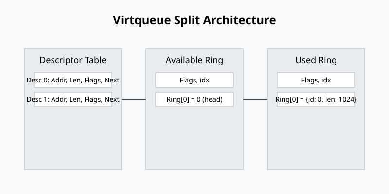

# Специфікація Virtio: virtqueues та vring

<preknowlist>
- [Концепції ядра Linux](book:unix-linux/kernel-and-userspace) — базові поняття системних викликів та VFS.
</preknowlist>

У світі віртуалізації ефективність операцій вводу/виводу (I/O) є ключовим фактором для досягнення високої продуктивності. Традиційний підхід, за якого гіпервізор повністю емулює існуюче апаратне забезпечення (наприклад, мережеву карту Intel e1000 або дисковий контролер IDE), вимагає значних витрат ресурсів. Кожна операція з регістрами пристрою призводить до виходу з віртуальної машини (VM exit), що сильно знижує пропускну здатність. 

Virtio — це стандартизований інтерфейс для параавіртуалізованих пристроїв, який розробляється консорціумом OASIS. Замість емуляції реального обладнання, virtio пропонує спеціально розроблений для віртуальних середовищ інтерфейс взаємодії між гостьовою операційною системою (frontend) та гіпервізором (backend). Це дозволяє мінімізувати кількість перемикань контексту та забезпечити швидкість I/O, яка наближається до нативної.

## 1. Загальна архітектура Virtio

Стандарт Virtio (зокрема версія 1.2, яка є однією з найсучасніших на даний момент) визначає кілька ключових абстракцій, на яких будується взаємодія:

- **Frontend (Драйвер):** Драйвер в гостьовій операційній системі, який знає, що він працює у віртуальному середовищі, і використовує virtio API для надсилання I/O запитів.
- **Backend (Пристрій):** Компонент у гіпервізорі (наприклад, QEMU, vhost-net, vhost-user), який отримує ці запити, виконує їх (можливо, використовуючи реальне обладнання хоста) та повертає результати.
- **Transport (Транспорт):** Механізм виявлення та конфігурації пристроїв (PCI/PCIe, MMIO, Channel I/O). Транспортний рівень відповідає за передачу інформації про конфігурацію, переривання та ініціалізацію virtqueues.
- **Virtqueues (Віртуальні черги):** Основний механізм обміну даними. Вони є кільцевими буферами в оперативній пам'яті (яка спільно використовується драйвером та пристроєм). 

Основою високої продуктивності virtio є те, що передача даних здійснюється безпосередньо через спільну пам'ять, а сигналізація (повідомлення про наявність нових даних) оптимізується за допомогою механізмів придушення переривань (event suppression).

## 2. Відкриття пристроїв та транспорт (virtio-pci та mmio)

Драйвер повинен спочатку знайти virtio пристрої та домовитися про їхні можливості.

### 2.1. Virtio over PCI Bus (virtio-pci)

У більшості середовищ x86/x86_64, virtio використовує шину PCI (або PCIe). Пристрої виглядають як звичайні PCI пристрої зі специфічними Vendor ID (0x1AF4 для Qumranet/Red Hat) та Device ID. 

Специфікація OASIS Virtio v1.0 (та новіші v1.1, v1.2) повністю змінила спосіб конфігурації PCI порівняно зі старою версією (Legacy Virtio). Замість використання I/O портів та базових регістрів (BAR0), сучасний virtio-pci використовує механізм **PCI Capabilities**.

У конфігураційному просторі PCI пристрою драйвер шукає специфічні Vendor-Specific Capabilities. Кожна така capability має тип, який вказує на її призначення:

- **VIRTIO_PCI_CAP_COMMON_CFG (1):** Загальна конфігурація. Тут знаходяться регістри для встановлення статусу пристрою, домовленості про фічі (Feature bits) та налаштування віртуальних черг (адреси, розмір тощо).
- **VIRTIO_PCI_CAP_NOTIFY_CFG (2):** Конфігурація повідомлень. Драйвер пише у специфічні адреси (doorbells), щоб повідомити пристрій (гіпервізор) про нові запити у чергах (kicks). Завдяки цій capability, кожна черга може мати свою окрему адресу для нотифікації, що дозволяє гіпервізору ефективніше обробляти події (наприклад, через ioeventfd у KVM).
- **VIRTIO_PCI_CAP_ISR_CFG (3):** Статус переривань. Використовується для legacy переривань (INTx), щоб дізнатися причину переривання. У сучасних системах з MSI-X цей регістр використовується рідко.
- **VIRTIO_PCI_CAP_DEVICE_CFG (4):** Специфічна конфігурація пристрою. Залежить від типу пристрою (наприклад, MAC адреса для virtio-net, або розмір диску для virtio-blk).

Використання PCI Capabilities дозволяє драйверам гнучко мапити ці регістри у пам'ять (Memory-Mapped I/O, MMIO), що забезпечує швидкий доступ без використання повільних інструкцій `in`/`out`.

### 2.2. Virtio over MMIO

У вбудованих системах, ARM та архітектурах без шини PCI, virtio використовує транспорт MMIO. Пристрої виявляються за допомогою Device Tree (або ACPI). Драйвер знаходить регіон пам'яті, де розташовані контрольні регістри (Magic Value, Version, DeviceID, VendorID), і конфігурує пристрій шляхом читання/запису за фіксованими зсувами (offsets). Конфігурація черг та фіч в MMIO простіша, ніж у PCI, але концептуально подібна.

## 3. Процес ініціалізації (Device Status Field)

Специфікація вимагає чіткої послідовності кроків при ініціалізації:
1. Записати `0` у регістр `status` (скидання пристрою - Reset).
2. Записати `ACKNOWLEDGE` (1) — операційна система побачила пристрій.
3. Записати `DRIVER` (2) — операційна система знає, як працювати з цим пристроєм.
4. Читання Device Features. Драйвер та пристрій обмінюються "feature bits" — прапорцями, що вказують на підтримку певних функцій (наприклад, checksum offloading, multiqueue, packed virtqueues).
5. Запис Driver Features (домовлена підмножина фіч).
6. Записати `FEATURES_OK` (8). Після цього драйвер перевіряє, чи пристрій погодився з конфігурацією.
7. Ініціалізація віртуальних черг (virtqueues) — виділення пам'яті, передача адрес (PFN у legacy, 64-bit фізичні адреси у v1.0+).
8. Записати `DRIVER_OK` (4) — драйвер готовий надсилати/отримувати запити. Якщо сталася критична помилка, записується `FAILED` (128).

## 4. Концепція Virtqueues та Vring

Основною магією virtio є **virtqueue**. Virtqueue — це структура даних у спільній пам'яті, через яку пересилаються масиви буферів (scatter-gather lists). Кожен пристрій має одну або більше черг. Наприклад, virtio-blk зазвичай має одну чергу для запитів, а virtio-net має чергу передачі (TX), чергу прийому (RX) та контрольну чергу.

Специфікація Virtio v1.2 підтримує два формати віртуальних черг:
- **Split Virtqueue** (Класичний vring)
- **Packed Virtqueue** (Новий, оптимізований формат)

## 5. Split Virtqueue

Split Virtqueue використовувався з найперших версій virtio. Назва "Split" походить від того, що структура даних розділена на три незалежні частини:
1. **Descriptor Table** (Таблиця дескрипторів)
2. **Available Ring** (Кільце доступних буферів)
3. **Used Ring** (Кільце використаних буферів)

Ці частини розташовуються у пам'яті послідовно (з урахуванням вимог до вирівнювання).



### 5.1. Descriptor Table

Descriptor Table — це масив структур `virtq_desc`. Дескриптор описує один неперервний блок пам'яті.

```c
struct virtq_desc {
    le64 addr;    // Фізична адреса буфера
    le32 len;     // Довжина буфера
    le16 flags;   // Прапорці (напр. VIRTQ_DESC_F_NEXT, VIRTQ_DESC_F_WRITE)
    le16 next;    // Індекс наступного дескриптора у ланцюжку (якщо F_NEXT)
};
```

Один I/O запит (наприклад, пакет мережі) може складатися з кількох розривних ділянок пам'яті (scatter-gather). Драйвер заповнює кілька дескрипторів, встановлюючи прапорець `VIRTQ_DESC_F_NEXT`, і пов'язує їх полем `next`. Останній дескриптор у ланцюжку не має цього прапорця. Прапорець `VIRTQ_DESC_F_WRITE` вказує, чи цей буфер призначений лише для читання пристроєм (від драйвера до пристрою), чи для запису (від пристрою до драйвера).

### 5.2. Available Ring (Кільце доступних буферів)

Available Ring заповнюється **лише драйвером**. Він вказує пристрою (гіпервізору), які ланцюжки дескрипторів готові для обробки.

```c
struct virtq_avail {
    le16 flags;
    le16 idx;
    le16 ring[QueueSize];
    le16 used_event;
};
```

Драйвер записує індекс "головного" (першого) дескриптора ланцюжка в масив `ring`, і збільшує `idx`. `idx` — це лічильник, який постійно зростає (вільно переповнюючись). Пристрій читає цей лічильник і порівнює зі своїм внутрішнім станом, щоб дізнатися, скільки нових запитів додано.
Поле `used_event` (частина механізму Event Suppression VIRTIO_F_EVENT_IDX) використовується драйвером для того, щоб сказати пристрою: "надішли мені переривання, лише коли ти обробиш стільки-то елементів", мінімізуючи кількість переривань.

### 5.3. Used Ring (Кільце використаних буферів)

Used Ring заповнюється **лише пристроєм** (гіпервізором). Він повідомляє драйверу, які ланцюжки дескрипторів уже оброблені (дані прочитані або записані).

```c
struct virtq_used_elem {
    le32 id;   // Індекс головного дескриптора
    le32 len;  // Кількість байт, які реально були записані пристроєм
};

struct virtq_used {
    le16 flags;
    le16 idx;
    struct virtq_used_elem ring[QueueSize];
    le16 avail_event;
};
```

Пристрій записує `id` дескриптора та `len` (довжину оброблених даних), а потім збільшує `idx`.
Драйвер перевіряє `idx` і звільняє відповідні дескриптори та пам'ять.

### 5.4. Механізм роботи (Workflow)

1. **Додавання буфера:** Драйвер знаходить вільні дескриптори, заповнює їх даними (адреса, розмір), створює ланцюжок.
2. Драйвер додає індекс першого дескриптора у `avail->ring`.
3. Драйвер збільшує `avail->idx`. Виконує бар'єр пам'яті (Memory Barrier), щоб гарантувати, що зміни видно гіпервізору.
4. **Kick:** Драйвер нотифікує гіпервізор (через VM exit, наприклад, запис в регістр VIRTIO_PCI_CAP_NOTIFY_CFG).
5. **Обробка:** Гіпервізор перехоплює нотифікацію (або працює в режимі поллінгу vhost). Він читає `avail->idx`, витягує індекси дескрипторів, читає пам'ять гостьової системи, виконує реальне I/O (відправляє пакет у мережу, пише на фізичний диск).
6. **Завершення:** Гіпервізор записує індекс дескриптора та довжину оброблених даних у `used->ring`.
7. Гіпервізор збільшує `used->idx`.
8. **Переривання:** Гіпервізор інжектує переривання в гостьову ОС (через irqfd, MSI-X).
9. Драйвер отримує переривання, читає `used->idx`, обробляє завершені I/O запити та звільняє дескриптори для повторного використання.

## 6. Проблеми Split Virtqueue

Хоча Split Virtqueue дуже успішний, він має архітектурні недоліки для високошвидкісних мереж (100+ Gbps) та швидких NVMe дисків:
- **Кешування процесором (Cache misses):** Дані розкидані по трьох різних структурах (Descriptor Table, Avail Ring, Used Ring). Процесору потрібно вичитувати різні cache lines з оперативної пам'яті.
- **Взаємодія з двома сторонами:** Для одного I/O запиту модифікуються структури в кількох місцях, що викликає інтенсивний обмін даними між кешами процесорів гостьової ОС та хоста.
- **Обмежена довжина черги:** Розмір кільця зазвичай становить 256, 512 або 1024.

## 7. Packed Virtqueue (v1.1+)

Щоб вирішити ці проблеми, у специфікації Virtio v1.1 була введена нова абстракція — **Packed Virtqueue** (домовляється через `VIRTIO_F_RING_PACKED`). 

Замість трьох розрізнених структур, Packed Virtqueue використовує **єдине кільце дескрипторів** (Descriptor Ring), яке спільно використовується драйвером та пристроєм.

```c
struct pvirtq_desc {
    le64 addr;
    le32 len;
    le16 id;     // Ідентифікатор буфера
    le16 flags;  // Прапорці статусу (AVAIL, USED, NEXT, WRITE)
};
```

### 7.1. Як працює Packed Virtqueue

1. Кільце являє собою масив `pvirtq_desc`.
2. Драйвер та пристрій відстежують внутрішній прапорець, який називається **Wrap Counter** (початково 1). Коли індекс обходу кільця досягає кінця масиву і повертається на початок, Wrap Counter інвертується (1 стає 0, потім 0 стає 1).
3. Прапорці `flags` кожного дескриптора тепер містять біти `AVAIL` (доступний для пристрою) та `USED` (використаний пристроєм).
4. Драйвер записує дескриптор, встановлюючи біт `AVAIL` таким самим, як поточний `Wrap Counter` драйвера, а біт `USED` — інвертованим.
5. Пристрій поллить/перевіряє дескриптори. Якщо він бачить, що `AVAIL != USED` (відповідає поточному Wrap Counter), він знає, що дескриптор наданий драйвером.
6. Після обробки пристрій записує результат (модифікує `len` якщо треба), і встановлює біти `AVAIL` і `USED` так, щоб вони дорівнювали поточному `Wrap Counter` пристрою.
7. Драйвер при перевірці бачить, що `AVAIL == USED` (що означає дескриптор оброблений).

**Переваги Packed Virtqueue:**
- **Cache Locality:** Оскільки є лише одна структура, і драйвер, і пристрій модифікують ті самі cache lines послідовно. Це різко зменшує cache misses.
- **Зменшення overhead:** Менше операцій з пам'яттю на кожен пакет.
- **Підтримка In-order:** Опціональна функція `VIRTIO_F_IN_ORDER`, яка гарантує, що пристрій використовує дескриптори в тому ж порядку, в якому вони були надані. Це дозволяє ще більше оптимізувати обхід кільця (можна перевіряти лише останній завершений дескриптор, а не кожен).

## 8. Придушення переривань (Event Suppression)

Одне з найдорожчих явищ у віртуалізації — це VM Exits (перемикання з гостьового режиму в гіпервізор, або навпаки, інжекція переривання з гіпервізора).
Virtio має потужний механізм для їх зменшення:

- **Interrupt Coalescing (Event suppression):** Якщо гіпервізор дуже швидко обробляє пакети (наприклад, мережа), він може не надсилати переривання для кожного пакету. Замість цього, драйвер може встановити `avail_event` на певне значення індексу в Used Ring. Це означає: "Не турбуй мене (без переривань), поки не обробиш N пакетів".
- **Notification Suppression:** Аналогічно, пристрій (гіпервізор) може встановити `used_event` у `Avail Ring`. Це означає: "Я зараз зайнятий обробкою черги і бачу нові пакети. Тобі (драйверу) не потрібно робити VM Exit (Kick) для кожного нового пакету, я сам прочитаю кільце". Якщо драйвер додає буфер і бачить, що індекс не перетнув межу `used_event`, він пропускає виконання операції Kick.

Для Packed Virtqueue цей механізм реалізований через окремі структури `Driver Event Suppression` та `Device Event Suppression`, які працюють аналогічно, але розташовані в окремих cache lines для оптимізації доступу.

## 9. Підсумок специфікації

Специфікація OASIS Virtio — це елегантний і надзвичайно ефективний дизайн, який витримав перевірку часом (з 2008 року). Перехід від legacy v0.95 до v1.0 зробив стандарт сумісним з сучасними шинними архітектурами (PCIe) та покращив endianness (всі поля стали strictly little-endian). Поява версій v1.1 та v1.2, зокрема введення Packed Virtqueues, дозволила virtio конкурувати за продуктивністю з апаратними SR-IOV (Single Root I/O Virtualization) пристроями, забезпечуючи гнучкість програмних рішень (Live Migration) разом із високою пропускною здатністю. Архітектура vring доводить, що прості структури даних у спільній пам'яті з продуманим управлінням кеш-лініями (cache coherency) можуть забезпечувати швидкість обробки мільйонів операцій вводу/виводу на секунду (IOPS).
