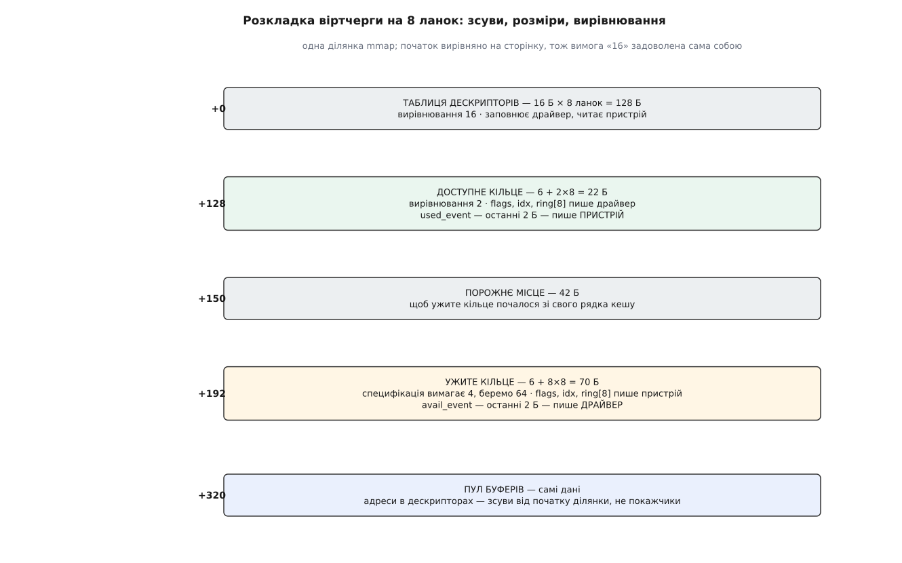
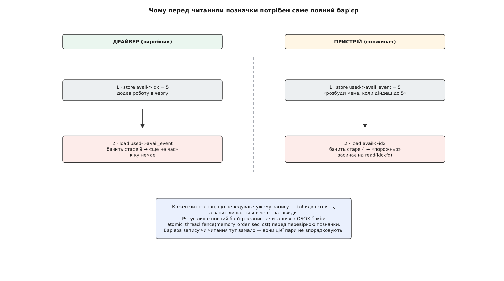

# ⚙️ Пройти віртчергу руками

Складімо обидва боки розділеної віртчерги — того, хто дає роботу, і того, хто її виконує — в одній програмі на C над спільною ділянкою пам'яті, без жодного ядерного інтерфейсу: це найдешевший спосіб побачити на власні очі, що весь контракт virtio справді зводиться до розкладки байтів плюс одного сигналу «глянь туди».

## Задача

Один потік грає драйвера, другий — пристрій. Спільного в них — ділянка пам'яті й два дескриптори [eventfd](book:unix-linux/eventfd-and-futex) (лічильник у ядрі, який один бік збільшує записом, а другий чекає на ньому читанням): перший заміняє кік у регістр, другий — переривання. Драйвер складає прохання з трьох ланок — заголовок, який пристрій лише читає, тіло, у яке пристрій пише, і байт статусу, — публікує його, забирає відповідь і повертає ланки в обіг. Пристрій прокидається, обходить ланцюг, виконує роботу просто в чужих буферах і звітує.

Ніякої піддавки тут немає: правила ті самі, за якими розмовляють гостьове ядро й `vhost` у ядрі господаря — [контрактові байдуже, хто саме обслуговує чергу](book:unix-linux/vhost-and-vdpa) (обробку можна винести в ядро господаря, в окремий процес або взагалі в кремній мережевої карти). Мірило успіху жорстке: зібрана з `-O2` програма крутиться на двох ядрах і не губить жодного запиту.

## Ідея

Два потоки одного процесу бачать спільну пам'ять точнісінько так само, як гість і господар, — через ту саму когерентність кешів, з тими самими правами на перестановку записів. Тож ділянку можна взяти найпростішу, `mmap` з `MAP_SHARED | MAP_ANONYMOUS`; щоб розвести боки по різних процесах, вистачить `fork` або [спільної пам'яті POSIX](book:unix-linux/posix-shared-memory).

Одну річ, однак, підробляти не можна. Пристрій не сидить у чужому просторі адрес: у дескрипторах лежать адреси в **його** системі координат, і кожну він мусить перекласти й перевірити. Тому в нашому коді `addr` — це зсув від початку ділянки, а не покажчик, і всі звертання йдуть через `xlate()` з перевіркою меж. Бекенд, який довіряє чужій адресі, віддає власний простір пам'яті тому, кого обслуговує.

## Три області, зсуви й вирівнювання

Розміри й вирівнювання беремо не зі `sizeof`, а з таблиці специфікації virtio 1.2 (§2.7): таблиця дескрипторів — 16 байтів на ланку з вирівнюванням 16, доступне кільце — 6 + 2·N з вирівнюванням 2, ужите — 6 + 8·N з вирівнюванням 4. Шістка в обох формулах — це `flags`, `idx` і поле-позначка наприкінці кільця, тож `used_event` і `avail_event` уже враховані.


*Специфікація вимагає для ужитого кільця вирівнювання 4; ми беремо 64 — і далі видно, чому.*

```c
/* vqwalk.c — обидва боки розділеної віртчерги над спільною пам'яттю.
 * gcc -O2 -Wall -Wextra -pthread vqwalk.c -o vqwalk                       */
#define _GNU_SOURCE
#include <stdatomic.h>
#include <stddef.h>
#include <stdint.h>
#include <stdio.h>
#include <stdlib.h>
#include <string.h>
#include <pthread.h>
#include <unistd.h>
#include <sys/mman.h>
#include <sys/eventfd.h>

#define QSZ      8u                 /* розмір черги — степінь двійки */
#define QMASK    (QSZ - 1u)
#define NO_LINK  0xffffu            /* кінець списку вільних ланок   */

#define DESC_F_NEXT   1u
#define DESC_F_WRITE  2u

struct vring_desc {                 /* рівно 16 байтів */
        uint64_t addr;              /* зсув від початку ділянки, НЕ покажчик */
        uint32_t len;
        uint16_t flags;
        uint16_t next;
};

struct vring_avail {                /* усе, крім used_event, пише драйвер */
        _Atomic uint16_t flags;
        _Atomic uint16_t idx;
        _Atomic uint16_t ring[QSZ];
        _Atomic uint16_t used_event;   /* сюди пише ПРИСТРІЙ */
};

struct vring_used_elem { uint32_t id; uint32_t len; };

struct vring_used {                 /* усе, крім avail_event, пише пристрій */
        _Atomic uint16_t flags;
        _Atomic uint16_t idx;
        struct vring_used_elem ring[QSZ];
        _Atomic uint16_t avail_event;  /* сюди пише ДРАЙВЕР */
};

#define DESC_BYTES   (16u * QSZ)
#define AVAIL_BYTES  (6u + 2u * QSZ)
#define USED_BYTES   (6u + 8u * QSZ)

_Static_assert(sizeof(struct vring_desc) == 16, "ланка мусить бути рівно 16 Б");
_Static_assert(sizeof(struct vring_avail) == AVAIL_BYTES, "розкладка avail поїхала");
_Static_assert(offsetof(struct vring_used, avail_event) == USED_BYTES - 2u, "позначка не там");

#define ALIGN_UP(x, a)  (((x) + (a) - 1u) & ~((size_t)(a) - 1u))

#define DESC_OFF   0u
#define AVAIL_OFF  ALIGN_UP(DESC_OFF + DESC_BYTES, 2)    /* = 128 */
#define USED_OFF   ALIGN_UP(AVAIL_OFF + AVAIL_BYTES, 64) /* = 192, спека вимагає лише 4 */
#define POOL_OFF   ALIGN_UP(USED_OFF + USED_BYTES, 64)   /* = 320 */
#define SLOT       512u                                  /* буфери одного прохання */
#define REGION     (1u << 20)

struct side {
        uint8_t            *base;
        struct vring_desc  *desc;
        struct vring_avail *avail;
        struct vring_used  *used;
        int kickfd, callfd;
};

static _Noreturn void die(const char *m) { fprintf(stderr, "%s\n", m); abort(); }

static void vring_place(struct side *s, void *base)
{
        s->base  = base;
        s->desc  = (struct vring_desc  *)((uint8_t *)base + DESC_OFF);
        s->avail = (struct vring_avail *)((uint8_t *)base + AVAIL_OFF);
        s->used  = (struct vring_used  *)((uint8_t *)base + USED_OFF);
}

static void *xlate(const struct side *s, uint64_t off, uint32_t len)
{
        if (off > REGION || len > REGION - off)
                return NULL;                  /* адреса поза ділянкою — відмова */
        return s->base + off;
}
```

Зверніть увагу на `USED_OFF`: специфікації вистачило б чотирьох байтів вирівнювання, і тоді ужите кільце почалося б одразу після доступного, у тому самому рядку кешу. Але доступне кільце пише драйвер, а ужите — пристрій, і рядок почав би ходити між ядрами на кожному запиті — [хибне спільне використання](book:programming/false-sharing) в чистому вигляді. Тому округлюємо до 64. І ще одна дрібниця з тієї ж родини: `sizeof(struct vring_used)` дорівнює 72, а не 70, бо компілятор доповнює структуру до свого вирівнювання, — розмір області треба брати з формули, інакше на щільнішій розкладці все з'їде.

## Бік драйвера: ланцюг, публікація, кік

Вільні ланки не потребують окремого масиву: вони лежать у самій таблиці, зшиті полем `next`. Ланцюг прохання будується просто проходом по цьому списку — і саме тому `next` у ланцюгу ніде не переписується, він уже вказує куди треба.

```c
struct driver { struct side s; uint16_t free_head, num_free, last_used, kicked_idx; };

static void free_list_init(struct driver *d)
{
        for (uint16_t i = 0; i < QSZ; i++)
                d->s.desc[i].next = (uint16_t)(i + 1u);
        d->s.desc[QSZ - 1].next = NO_LINK;
        d->free_head = 0;
        d->num_free  = QSZ;
}

struct sg { uint64_t off; uint32_t len; int device_writes; };

static int vq_add(struct driver *d, const struct sg *sg, unsigned n)
{
        if (n == 0 || d->num_free < n)
                return -1;                    /* ланок немає — спершу заберіть відповіді */

        uint16_t head = d->free_head, i = head;
        for (unsigned k = 0; k < n; k++) {
                struct vring_desc *dsc = &d->s.desc[i];
                dsc->addr  = sg[k].off;
                dsc->len   = sg[k].len;
                dsc->flags = (uint16_t)((sg[k].device_writes ? DESC_F_WRITE : 0u)
                                      | (k + 1u < n ? DESC_F_NEXT : 0u));
                i = dsc->next;                /* далі списком вільних */
        }
        d->free_head = i;
        d->num_free  = (uint16_t)(d->num_free - n);

        uint16_t ai = atomic_load_explicit(&d->s.avail->idx, memory_order_relaxed);
        atomic_store_explicit(&d->s.avail->ring[ai & QMASK], head, memory_order_relaxed);

        atomic_thread_fence(memory_order_release);   /* ланки — РАНІШЕ за новий idx */
        atomic_store_explicit(&d->s.avail->idx, (uint16_t)(ai + 1u), memory_order_relaxed);
        return head;
}

static int vring_need_event(uint16_t event_idx, uint16_t new_idx, uint16_t old)
{
        return (uint16_t)(new_idx - event_idx - 1u) < (uint16_t)(new_idx - old);
}

static void vq_kick(struct driver *d)
{
        uint16_t new_idx = atomic_load_explicit(&d->s.avail->idx, memory_order_relaxed);

        atomic_thread_fence(memory_order_seq_cst);   /* наш запис — до чужого читання */
        uint16_t event = atomic_load_explicit(&d->s.used->avail_event, memory_order_relaxed);

        uint16_t old = d->kicked_idx;
        d->kicked_idx = new_idx;
        if (vring_need_event(event, new_idx, old)) {
                uint64_t one = 1;
                if (write(d->s.kickfd, &one, sizeof one) < 0) die("kickfd");
        }
}
```

Порядок у `vq_add` не переставляється навіть подумки. Спершу заповнені ланки, потім номер голови в кільце, потім бар'єр — і аж тоді новий `idx`. Індекс тут відіграє роль публікації: доти, доки він старий, усе написане вище для пристрою просто не існує, а щойно він виріс — мусить існувати цілком.

## Бік драйвера: забрати відповідь і повернути ланки

```c
static void free_chain(struct driver *d, uint16_t head)
{
        uint16_t i = head, n = 1;
        while (d->s.desc[i].flags & DESC_F_NEXT) {
                i = d->s.desc[i].next;
                if (i >= QSZ || ++n > QSZ) die("зіпсований ланцюг");
        }
        d->s.desc[i].next = d->free_head;     /* хвіст чіпляємо до списку вільних */
        d->free_head = head;
        d->num_free  = (uint16_t)(d->num_free + n);
}

static int vq_get(struct driver *d, uint32_t *len_out)
{
        uint16_t ui = atomic_load_explicit(&d->s.used->idx, memory_order_relaxed);
        if (d->last_used == ui)
                return -1;                    /* нічого нового */

        atomic_thread_fence(memory_order_acquire);   /* idx прочитано — ТЕПЕР елемент */

        struct vring_used_elem *e = &d->s.used->ring[d->last_used & QMASK];
        uint32_t id = e->id;
        *len_out = e->len;
        d->last_used++;

        if (id >= QSZ) die("пристрій повернув неіснуючу ланку");
        free_chain(d, (uint16_t)id);
        return (int)id;
}

static void driver_wait(struct driver *d)
{
        atomic_store_explicit(&d->s.avail->used_event, d->last_used, memory_order_relaxed);
        atomic_thread_fence(memory_order_seq_cst);
        if (atomic_load_explicit(&d->s.used->idx, memory_order_relaxed) != d->last_used)
                return;                       /* поки писали позначку — уже приїхало */
        uint64_t ev;
        if (read(d->s.callfd, &ev, sizeof ev) != sizeof ev) die("callfd");
}
```

## Бік пристрою

```c
struct device { struct side s; uint16_t last_avail; unsigned served, todo; };
struct req_hdr { uint32_t seq, fill; };

static uint32_t serve_chain(struct device *v, uint16_t head)
{
        struct req_hdr hdr = { 0, 0 };
        uint32_t written = 0;
        unsigned nwr = 0, hops = 0;
        uint16_t i = head;

        for (;;) {
                if (i >= QSZ) die("номер ланки поза таблицею");
                struct vring_desc *dsc = &v->s.desc[i];
                uint32_t len = dsc->len;
                void *buf = xlate(&v->s, dsc->addr, len);
                if (!buf) die("буфер поза ділянкою");

                if (!(dsc->flags & DESC_F_WRITE)) {
                        if (len == sizeof hdr) memcpy(&hdr, buf, sizeof hdr);
                } else if (nwr++ == 0) {
                        memset(buf, (int)hdr.fill, len);   /* тіло відповіді */
                        written += len;
                } else {
                        *(uint8_t *)buf = 0;               /* байт статусу: гаразд */
                        written += 1;
                }

                if (!(dsc->flags & DESC_F_NEXT)) break;
                i = dsc->next;
                if (++hops >= QSZ) die("ланцюг довший за таблицю");
        }
        return written;
}

static void *device_thread(void *arg)
{
        struct device *v = arg;

        while (v->served < v->todo) {
                uint16_t avail_idx = atomic_load_explicit(&v->s.avail->idx,
                                                          memory_order_relaxed);
                if (v->last_avail == avail_idx) {           /* порожньо — замовляємо кік */
                        atomic_store_explicit(&v->s.used->avail_event, v->last_avail,
                                              memory_order_relaxed);
                        atomic_thread_fence(memory_order_seq_cst);
                        if (atomic_load_explicit(&v->s.avail->idx,
                                                 memory_order_relaxed) == v->last_avail) {
                                uint64_t ev;
                                if (read(v->s.kickfd, &ev, sizeof ev) != sizeof ev)
                                        die("kickfd");
                        }
                        continue;
                }

                atomic_thread_fence(memory_order_acquire);  /* idx прочитано — ТЕПЕР ланки */

                uint16_t head = atomic_load_explicit(&v->s.avail->ring[v->last_avail & QMASK],
                                                     memory_order_relaxed);
                v->last_avail++;
                uint32_t written = serve_chain(v, head);

                uint16_t ui = atomic_load_explicit(&v->s.used->idx, memory_order_relaxed);
                v->s.used->ring[ui & QMASK].id  = head;     /* ГОЛОВА ланцюга, не позиція */
                v->s.used->ring[ui & QMASK].len = written;
                atomic_thread_fence(memory_order_release);
                atomic_store_explicit(&v->s.used->idx, (uint16_t)(ui + 1u),
                                      memory_order_relaxed);
                v->served++;

                atomic_thread_fence(memory_order_seq_cst);
                uint16_t ev_idx = atomic_load_explicit(&v->s.avail->used_event,
                                                       memory_order_relaxed);
                if (vring_need_event(ev_idx, (uint16_t)(ui + 1u), ui)) {
                        uint64_t one = 1;
                        if (write(v->s.callfd, &one, sizeof one) < 0) die("callfd");
                }
        }
        return NULL;
}
```

Обидва боки виявилися дзеркальними — і це не збіг, а наслідок правила «одне поле — один письменник»: виробник публікує індексом, споживач читає індекс і лише потім дані, кожен замовляє собі пробудження у своєму кільці.

## Збірка й прогін

```c
#define ROUNDS 100000u

static void driver_loop(struct driver *d, unsigned rounds)
{
        unsigned sent = 0, got = 0;

        while (got < rounds) {
                while (sent < rounds && d->num_free >= 3) {
                        uint64_t slot = POOL_OFF + (uint64_t)d->free_head * SLOT;
                        struct req_hdr *h = (struct req_hdr *)(d->s.base + slot);
                        h->seq  = sent;
                        h->fill = 0x30u + (sent % 10u);

                        struct sg sg[3] = {
                                { slot,       (uint32_t)sizeof *h, 0 },  /* читає пристрій */
                                { slot + 64,  256,                 1 },  /* пише пристрій  */
                                { slot + 448, 1,                   1 },  /* байт статусу   */
                        };
                        if (vq_add(d, sg, 3) < 0) break;
                        sent++;
                }
                vq_kick(d);

                uint32_t len;
                while (vq_get(d, &len) >= 0)
                        got++;

                if (got == rounds)
                        break;
                if (sent == rounds || d->num_free < 3)   /* слати більше нічого — чекаємо */
                        driver_wait(d);
        }
}

int main(void)
{
        void *base = mmap(NULL, REGION, PROT_READ | PROT_WRITE,
                          MAP_SHARED | MAP_ANONYMOUS, -1, 0);
        if (base == MAP_FAILED) die("mmap");
        memset(base, 0, REGION);

        int kickfd = eventfd(0, 0), callfd = eventfd(0, 0);
        if (kickfd < 0 || callfd < 0) die("eventfd");

        static struct driver drv;
        static struct device dev;
        vring_place(&drv.s, base); drv.s.kickfd = kickfd; drv.s.callfd = callfd;
        vring_place(&dev.s, base); dev.s.kickfd = kickfd; dev.s.callfd = callfd;
        free_list_init(&drv);
        dev.todo = ROUNDS;

        pthread_t th;
        if (pthread_create(&th, NULL, device_thread, &dev) != 0) die("pthread_create");
        driver_loop(&drv, ROUNDS);
        pthread_join(th, NULL);
        puts("усі запити пройшли чергу й повернулися");
        return 0;
}
```

## Пастки

**Бар'єр, який зникає під `-O2`.** Якби поля кілець були звичайними `uint16_t`, компілятор мав би повне право винести читання `idx` із циклу очікування — і потік крутився б навколо значення, узятого один раз. Порятунок `asm volatile("" ::: "memory")` лікує лише компілятор, а не процесор, і на x86-64 помилка сховається: там записи й так не переставляються між собою. Проявиться вона на ARM, у продакшні, під навантаженням. `_Atomic` з `memory_order_relaxed` — це рівно те, чим у ядрі є `READ_ONCE`/`WRITE_ONCE`: доступ, який не можна ні викинути, ні розділити; впорядкування додає окремий [бар'єр](book:programming/memory-ordering-barriers).

**Загублене пробудження.** Найпідступніша з гонитв ховається не в даних, а в парі «замовив сповіщення — перевірив, чи є робота». Обидва боки роблять запис і зразу читання чужого запису, і саме цю пару — «запис, потім читання» — жоден бар'єр запису чи читання не впорядковує.


*Класична пастка «запис → читання»: без повного бар'єра з обох боків програма зупиняється намертво, і виглядає це як зависання пристрою.*

Другий шар захисту — повторна перевірка після запису позначки: обидва боки, замовивши сповіщення, ще раз дивляться на чужий індекс і засинають, тільки якщо він і досі старий.

**Гонитва «прочитав `idx` — прочитав ланку».** Дзеркало публікації. Побачити новий індекс і піти за номером голови без бар'єра читання — значить мати шанс дістати ланку зі сміттям минулого прохання: адреса стара, довжина нова. Пристрій слухняно пише 256 байтів кудись, куди права вже не давали.

**Переповнення кільця.** У доступному кільці рівно `QSZ` місць, і позиція береться як `idx & QMASK`. Опублікувати `QSZ + 1` прохання, не дочекавшись відповідей, — значить затерти запис, який пристрій ще не прочитав. Стримує це не перевірка кільця, а список вільних ланок: на кожне прохання йде щонайменше одна ланка, ланок усього `QSZ`, тому умова `num_free >= n` сама тримає кількість неопрацьованих прохань у межах. Ось чому в `vq_add` немає окремої перевірки на «кільце повне» — вона була б другим замком на ті самі двері.

**`id` — це номер голови, а не позиція в кільці.** Спокуса написати в `used->ring[…].id` значення `ui` (або `last_avail`) величезна: у простих прогонах вони часто збігаються. Розбіжаться вони рівно тоді, коли пристрій відповість не в тому порядку, у якому отримав, — і тоді драйвер поверне в список вільних чужий ланцюг. Той самий дескриптор опиниться у списку двічі, наступне прохання побудує ланцюг сам на себе, і `serve_chain` упреться в лічильник `hops`. Без цього лічильника пристрій просто зациклився б — тому обмеження довжини ланцюга розміром таблиці для бекенда обов'язкове, а не бажане.

**Переписаний `next`.** Будуючи ланцюг, страшенно кортить дописати в кожну ланку `dsc->next = наступна` — так наче поле саме про це й просить. Але `next` уже несе службу: він тримає список вільних ланок, і ланцюг просто йде по ньому. Варто його переписати — і хвіст ланцюга почне вказувати всередину самого ланцюга; `free_chain` після відповіді зациклиться або поверне у вільні лише частину ланок. Тече це повільно, по одній ланці на прохання, і виглядає як «черга з часом стає повільнішою». Ядро Linux будує ланцюг точно так само — проходом по вільному списку без запису `next`.

**Ширина `id`.** У `struct vring_used_elem` поле `id` — 32-бітне, хоча номер ланки не перевищує розміру черги й усередині драйвера ходить як `uint16_t`. Отже, той бік має де покласти будь-яке значення, і не завжди зі злого наміру: бекенд, що заповнив лише молодшу половину слова, віддасть у старшій те, що там лежало. Тому в `vq_get` стоїть перевірка `id >= QSZ` перед тим, як число стане номером ланки. Драйвер не зобов'язаний вірити тому, хто його обслуговує, — надто коли на тому кінці чужий процес або окрема плата.

**Порядок байтів.** У нашій вправі обидва боки — та сама машина, тож питання не постає. У справжньому virtio 1.x усі поля кілець — молодшим байтом уперед незалежно від того, на чому працює гість; спадкові пристрої до 1.0 вживали порядок байтів гостя, і саме на цьому ловляться бекенди, написані «за пам'яттю» на s390x.

## Скільки це коштує

На одне прохання припадає `n` записів по 16 байтів, один запис у доступне кільце й один в ужите — тобто час лінійний за довжиною ланцюга, без жодного виділення пам'яті та жодного замка. Синхронізації рівно чотири бар'єри на ходку. Перетинів межі — нуль, коли обидва боки зайняті: `vring_need_event` мовчить, поки споживач крутиться в циклі, і саме тому [кільце](book:algorithms/ring-buffer) виграє в емуляції регістрів не на один порядок.

Половину помилок x86-64 сховає: сильна модель пам'яті цієї машини сама впорядковує записи між собою й читання між собою, тож вирізані бар'єри публікації та читання на ній не проявляться ніколи. Справжній прогін для них — на aarch64, де переставляння видно неозброєним оком, плюс збірка з `-fsanitize=thread`, яка ловить недописані бар'єри як гонитву. А от повний бар'єр перед перевіркою позначки не безкоштовний і на x86: саме пару «запис, потім читання» ця машина переставляє через буфер запису, тож без нього прогін зависає на обох архітектурах. Найкорисніша вправа — прибирати бар'єри по одному й дивитися, за скільки кругів усе розсиплеться: `release` і `acquire` на x86 не розсиплються ніколи, на ARM — за секунди, а `seq_cst` розсиплеться скрізь.
