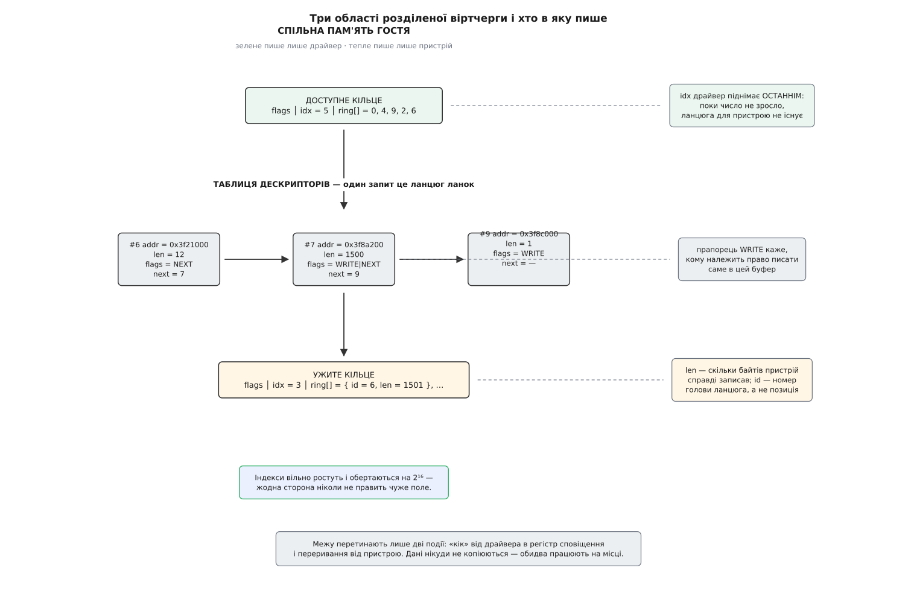
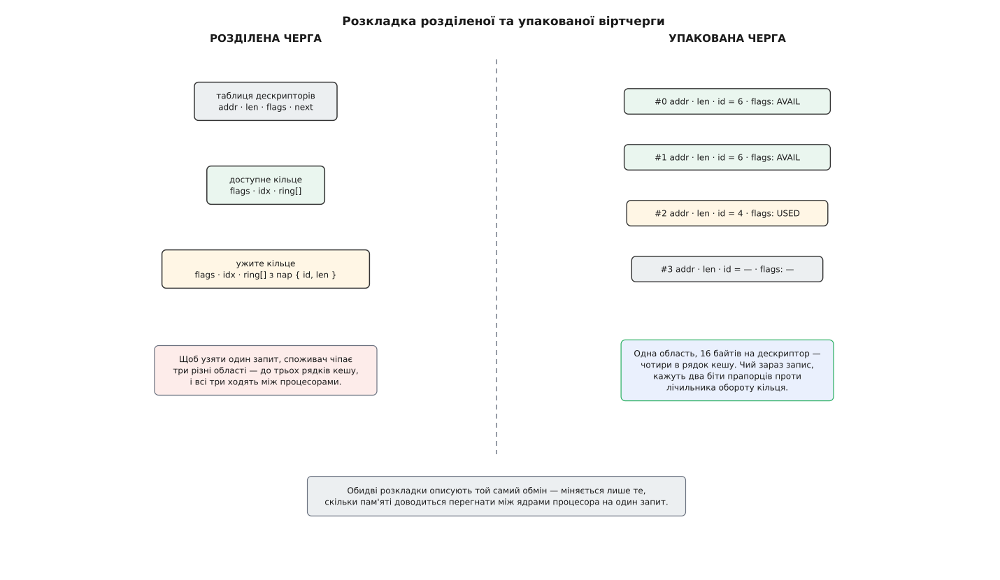
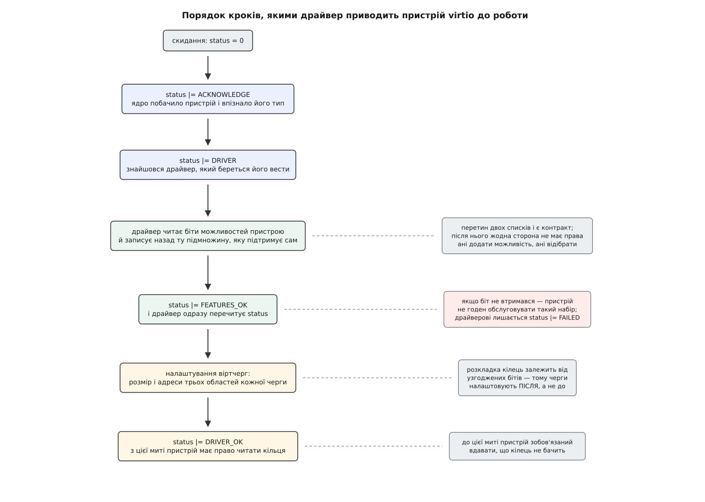

# virtio: паравіртуалізована шина й віртчерги

<preknowlist>
- [Апаратна віртуалізація](topic:programming/hardware-virtualization) — гість виконується на справжньому процесорі, але звертання до «заліза» перехоплює гіпервізор, і цей перехід коштує тисячі тактів.
- [DMA і відображення буферів](topic:unix-linux/dma-and-buffers) — пристрій читає й пише просто в пам'ять, а не переганяє байти через регістр.
- [Упорядкування пам'яті та бар'єри](topic:programming/memory-ordering-barriers) — процесор і компілятор вільно міняють порядок записів, і видимий іншому ядру порядок доводиться задавати явно.
- [Кільцевий буфер](topic:algorithms/ring-buffer) — виробник і споживач ходять по замкненому масиву, кожен зі своїм індексом.
- [Переривання, softirq і робочі черги](topic:unix-linux/interrupts-bottom-halves) — як пристрій повідомляє ядро, що робота скінчена, і чому обробник має бути коротким.
- [Прив'язка драйвера до пристрою](topic:unix-linux/driver-probe-and-binding) — ядро зіставляє знайдений на шині пристрій із драйвером за ідентифікаторами й кличе `probe`.
- [PCIe](topic:electronics/pcie) — простір конфігурації, вікна BAR і те, як пристрій узагалі стає видимим системі.
</preknowlist>

## Скільки коштує один запис у регістр

Віртуальна машина відправляє мережевий пакет. Драйвер усередині неї впевнений, що перед ним звичайна карта Intel — та сама, з якою він працював би на фізичному сервері. Він складає дескриптор у своєму кільці й записує нове значення в регістр «хвоста» карти, щоб та побачила роботу.

За цією адресою немає пам'яті. Процесор натикається на сторінку, для якої немає трансляції, зупиняє гостя й віддає керування гіпервізорові. Той мусить прочитати інструкцію, яку гість щойно намагався виконати, розібрати її — який регістр процесора, скільки байтів, куди, — знайти емульовану модель карти, змінити в ній поле, вирішити, чи не пора тепер відправити пакет, і аж потім пустити гостя далі.

Навіть коли весь цей шлях проходить у ядрі господаря, він коштує кілька тисяч тактів. Коли емуляцію робить процес у просторі користувача — а класичні моделі пристроїв живуть саме там, — додається ще й перемикання на цей процес і назад, і рахунок іде на мікросекунди. Порівняймо з тим, чим цей запис був би на справжній машині: сотні наносекунд на шині, і жодної зупинки.

**Умова: гість жене 1 Гбіт/с пакетами по 1500 байтів, драйвер емульованої карти чіпає регістри чотири рази на пакет, кожне звертання коштує 2 мкс.**

```
пакетів за секунду = 1_000_000_000 / (1500 · 8)
                   = 83 333

звертань за секунду = 83 333 · 4
                    = 333 332

витрачений час      = 333 332 · 2·10⁻⁶ с
                    = 0.67 с
```

Дві третини процесорної секунди йдуть не на пакети, а на перетини межі між гостем і господарем. Причому саме на перетини: корисної роботи в них нуль, вони існують лише тому, що гість вдає, ніби перед ним залізо.

## Гість, який знає, де він

Це вдавання нічого не купує. Гість не переїде з емульованої карти на справжню — образ їде в іншу хмару, а не в інший корпус. Тож єдиний спосіб не платити за перехоплення — перестати робити те, що перехоплюють: хай гість знає, що він гість, і говорить не мовою заліза, а мовою, вигаданою спеціально для цієї межі. Такий підхід називають паравіртуалізацією (гр. παρά — «поруч, обіч»): пристрій не вдають, про пристрій домовляються.

Домовленість дає повну свободу форми, і з ціни переходу одразу випливають два обмеження, яких мусить дотримуватися будь-яка розумна форма. Перше: переходів має бути мало. Друге: кожен перехід має нести багато роботи — якщо вже платимо мікросекунду, хай вона розрахується не за один пакет, а за пачку.

Лишається знайти, чим сторони можуть обмінюватися дешево. Такий канал є, і він єдиний: пам'ять гостя — це пам'ять господаря. Гіпервізор сам її виділив, він знає, де вона лежить, і може адресувати її будь-якої миті без жодного дозволу. Запис гостя в свою ж пам'ять коштує рівно стільки, скільки коштує запис у пам'ять, — жодних зупинок.

Звідси й конструкція. Увесь протокол переїжджає в пам'ять: обидві сторони читають і пишуть спільну структуру даних, а межу перетинають тільки для того, щоб сказати «глянь туди». Ця структура й називається віртчергою (англ. *virtqueue*), а набір правил довкола неї — virtio.

## Яку форму мусить мати ця структура

Форма не довільна — її диктують властивості того, що передають.

Дані ніколи не лежать одним шматком. Мережевий пакет — це маленький заголовок від драйвера плюс тіло, яке приїхало зі стека десь із іншої сторінки. Дискове прохання — це заголовок, кілька сторінок даних із різних місць і один байт статусу наприкінці. Отже, одиниця обміну — не буфер, а список пар «адреса, довжина».

Напрямок різний навіть усередині одного прохання. Заголовок пристрій читає, тіло при читанні з диска — пише, байт статусу — пише. Тому напрямок мусить бути властивістю кожної ланки, а не всього прохання. І це не підказка для оптимізації, а межа дозволеного: той, хто обслуговує чергу, не має права писати туди, куди гість права не давав.

Прохання виконуються не по черзі. Диск відповість на друге раніше, ніж на перше; десять пакетів можуть їхати одночасно. Значить, відповідь мусить називати, на що саме вона відповідає, — нести номер прохання, а не покладатися на порядок.

І найважливіше: обидві сторони працюють одночасно на різних ядрах. Спільного замка між гостем і гіпервізором не буває — гість може заснути з ним у руках, і господар не має чим його розбудити. Тому структуру розділяють так, щоб кожне поле мало рівно одного письменника: усе, що пише драйвер, пристрій лише читає, і навпаки. А замість прапорців «повно / порожньо», які довелося б правити обом, кожна сторона тримає власний лічильник, що вільно росте й обертається на 2¹⁶. Різниця двох лічильників і є відповіддю на питання «скільки нового з'явилося».

Складімо все разом — вийде розділена віртчерга (англ. *split virtqueue*), розкладка, з якою virtio жив від народження:

```c
/* include/uapi/linux/virtio_ring.h */
struct vring_desc {          /* таблиця дескрипторів: 16 байтів на ланку */
        __virtio64 addr;     /* фізична адреса буфера в пам'яті гостя     */
        __virtio32 len;
        __virtio16 flags;    /* NEXT (ланцюг триває) · WRITE · INDIRECT   */
        __virtio16 next;     /* номер наступної ланки ланцюга             */
};

struct vring_avail {         /* доступне кільце: пише лише драйвер        */
        __virtio16 flags;
        __virtio16 idx;      /* вільно росте, обертається на 2¹⁶          */
        __virtio16 ring[];   /* номери голів ланцюгів                     */
};

struct vring_used_elem { __virtio32 id; __virtio32 len; };

struct vring_used {          /* ужите кільце: пише лише пристрій          */
        __virtio16 flags;
        __virtio16 idx;
        struct vring_used_elem ring[];
};
```


*Таблиця дескрипторів — спільний склад ланок; кільця — дві односторонні дошки оголошень, кожна з одним письменником.*

Одна ходка виглядає так. Драйвер бере зі свого списку вільних три ланки, заповнює адреси й довжини, зшиває їх прапорцем `NEXT`, кладе номер голови ланцюга в `avail->ring[idx % розмір]` і піднімає `avail->idx`. Тоді — і тільки тоді — він робить «кік»: запис у регістр сповіщення, єдиний за всю ходку перетин межі. Пристрій бачить, що `avail->idx` зріс, проходить ланцюг, виконує роботу просто в пам'яті гостя, кладе в `used->ring` пару «номер голови, скільки байтів записано», піднімає `used->idx` і сигналить перериванням. Обробник у гості забирає готове й повертає ланки в список вільних.

Дані при цьому нікуди не копіюються. Пристрій працює з тими самими сторінками, у які стек гостя склав пакет: обидва бачать одну пам'ять, і копія була б чистою втратою.

## Чому порядок записів вирішує все

Тут ховається пастка, якої на емульованому залізі не було. Обидві сторони — звичайний код на звичайних процесорах, з буферами запису й позачерговим виконанням. Записи, які драйвер зробив у порядку «спершу дескриптори, потім `idx`», іншому ядру можуть стати видимими у зворотному порядку. Тоді пристрій побачить новий `idx`, піде за номером голови — і прочитає ланку, у якій ще лежить сміття з минулого разу.

Тому між заповненням дескрипторів і публікацією індексу стоїть бар'єр запису, а на боці споживача, між читанням індексу й читанням дескрипторів, — бар'єр читання. У Linux це `virtio_wmb()` / `virtio_rmb()`, і сила їх не стала: коли на тому кінці програма на тій самій когерентній машині, вистачає звичайного бар'єра для багатопроцесорності; коли ж на тому кінці справжнє залізо на шині — потрібен повноцінний бар'єр для доступу до пам'яті пристроями. Яку саме силу брати, вирішує узгоджений біт `VIRTIO_F_ORDER_PLATFORM`.

## Як домовитися мовчати

Ми звели ходку до двох перетинів межі — кіку й переривання. Під навантаженням і вони зайві: якщо пристрій зараз у циклі перебирає чергу, кік нічого йому не повідомляє, а лише витягує гостя з роботи. Так само переривання марне, якщо драйвер саме зараз розгрібає ужите кільце.

Тому кожна сторона публікує своє бажання у власному кільці — там, де вона єдиний письменник. Пристрій ставить `VRING_USED_F_NO_NOTIFY` в `used->flags`: «не кікай, я й сам дивлюся». Драйвер ставить `VRING_AVAIL_F_NO_INTERRUPT` в `avail->flags`: «не переривай, я зайнятий».

Прапорець грубий — він знає лише «мовчи» й «сигналь». Тонший спосіб дає можливість `VIRTIO_F_EVENT_IDX`: замість прапорця сторона пише число — «розбуди мене, коли твій індекс дійде ось сюди». Виробникові тепер треба вирішити, чи не переступив він щойно замовлену позначку. З числами, які вільно обертаються, порівняння «більше-менше» безглузде: 65 535 менше за 2 чи більше? Ядро розв'язує це так:

```c
/* include/uapi/linux/virtio_ring.h */
static inline int vring_need_event(__u16 event_idx, __u16 new_idx, __u16 old)
{
        return (__u16)(new_idx - event_idx - 1) < (__u16)(new_idx - old);
}
```

Обидві різниці рахуються за модулем 2¹⁶, тому це вже не позиції, а відстані — і обертання перестає щось означати. Права різниця — скільки записів ми щойно додали. Ліва — та сама відстань назад від нового індексу до замовленої позначки, зменшена на одиницю, щоб позначка, яку ми щойно перекрили останнім записом, ще рахувалася всередині. Якщо позначка потрапила в свіжододану ділянку, ліва відстань виявиться коротшою за праву.

**Умова: пристрій замовив сповіщення на позначці 65 534, драйвер підняв індекс із 65 533 до 2 — кільце якраз обернулося.**

```
old       = 65533
new_idx   = 2
event_idx = 65534

new_idx − old           = 2 − 65533 = 5        (за модулем 2¹⁶: додано 5 записів)
new_idx − event_idx − 1 = 2 − 65534 − 1 = 3

3 < 5  →  сповіщати
```

Позначка 65 534 справді лежить усередині доданої п'ятірки 65 533, 65 534, 65 535, 0, 1 — сповістити треба. А якби пристрій замовив позначку 4, до якої ми ще не дійшли, ліва різниця дала б 65 533, що не менше за 5, і кіку не було б.

> 🔧 **Навіщо це.** Коли віртуальна машина впирається в стелю пропускної здатності при вільному процесорі, дивіться не на смугу, а на лічильник виходів у гіпервізор (`perf kvm stat`, точка трасування `kvm_exit`). Якщо на кожен пакет припадає перетин межі, `VIRTIO_F_EVENT_IDX` не узгодився: або бекенд старий, або можливість вимкнено в описі машини. Це налаштування, а не залізо.

## Три області — забагато для одного дескриптора

Коли сповіщення притлумлено, головною витратою стає сама пам'ять. Щоб узяти один запит, споживач мусить прочитати доступне кільце, потім ланку в таблиці дескрипторів, потім записати в ужите кільце — три різні області, до трьох рядків кешу. І всі три постійно ходять між ядром, на якому крутиться гість, і ядром, на якому працює обслуговувач: кожен рядок то в одного, то в іншого. За когерентність кешів платять на кожному запиті.

Розкладка, у якій ця плата менша, з'явилася в специфікації virtio 1.1 (ухвалена OASIS 11 квітня 2019 року) — упакована віртчерга (англ. *packed virtqueue*). Область одна: масив дескрипторів по 16 байтів, чотири в рядок кешу. Ознака доступності переїхала в самі прапорці дескриптора — два біти, `AVAIL` і `USED`, які порівнюють із лічильником обороту, що перемикається щоразу, коли обхід доходить до кінця масиву. Пристрій, скінчивши роботу, переписує той самий елемент, кладучи в нього номер і довжину.


*Обмін той самий; різниця в тому, скільки пам'яті доводиться перегнати між ядрами на один запит.*

Правило «одне поле — один письменник» при цьому вціліло, просто письменник тепер міняється в часі: поки біти кажуть `AVAIL`, елемент належить пристроєві, поки `USED` — драйверові. Підтримка упакованої розкладки в гостьових драйверах Linux є з версії 5.0 (2019, Тівей Бє), а вмикається вона узгодженням біта `VIRTIO_F_RING_PACKED` — тобто дві розкладки мирно співіснують, і сторона, яка вміє лише стару, нічого не втрачає.

## Пристрій — це не тільки черга

Черга переносить дані, але перед першим байтом сторонам треба з'ясувати ще чотири речі: що це за пристрій, які необов'язкові вміння є в обох, у якому він зараз стані й де взяти його власні параметри — адресу MAC для мережевої карти, місткість для диска. Усе це virtio описує однаково для всіх пристроїв.

Уміння передають бітами можливостей. Пристрій виставляє 64-бітну маску того, що він пропонує; драйвер записує назад підмножину — те, що пропонує і що вміє сам. Перетин двох списків і є контракт на весь час роботи.

Стан пристрою — байт статусу, і кроки в ньому йдуть у строго визначеному порядку.


*Кожен крок оголошує іншій стороні, що вже можна, а чого ще не можна робити.*

Порядок тут не церемонія. Драйвер записує `FEATURES_OK` і **перечитує** статус: якщо біт не втримався, пристрій не годен обслуговувати саме такий набір, і драйверові лишається виставити `FAILED`. Віртчерги налаштовують після цієї перевірки, бо від узгоджених бітів залежить сама розкладка кілець — упакована вона чи розділена. А `DRIVER_OK` наприкінці — дозвіл: доти пристрій зобов'язаний удавати, що кілець не бачить, хоч адреси йому вже й дано. У зворотний бік працює `DEVICE_NEEDS_RESET`: пристрій виставляє його, коли зламався, і єдиний вихід — почати весь ланцюг із нуля.

Два біти в цій масці заслуговують окремої згадки, бо вони не про можливості, а про сам характер протоколу. `VIRTIO_F_VERSION_1` відділяє сучасну розкладку від спадкової: до специфікації 1.0 поля кілець мали порядок байтів гостя, а всі три області лежали одним шматком із вирівнюванням на сторінку. `VIRTIO_F_ACCESS_PLATFORM` каже, що адреси в дескрипторах — не сирі фізичні адреси гостя, а адреси, які ще пройдуть через трансляцію [IOMMU](topic:programming/iommu) (пристрій звертається до пам'яті не тими адресами, які бачить процесор, і блок трансляції заразом обмежує, куди йому взагалі можна). Тому драйвер зобов'язаний брати адреси через звичайний DMA-інтерфейс ядра, а не підставляти вміст сторінки навпростець.

> 🔧 **Навіщо це.** Живе перенесення машини на інший вузол ламається саме на цих бітах: гість уже прийняв якийсь набір, і новий господар мусить запропонувати щонайменше те саме. Тому засоби керування закріплюють за машиною версію моделі й не міняють її при оновленні гіпервізора — інакше набір бітів «попливе», і гість на новому вузлі виявиться з контрактом, якого ніхто не обіцяв.

## Шина, якої не існує

Ідентифікатор пристрою, біти, статус, конфігурація й адреси черг мусять кудись фізично лягти — і ось тут virtio доводиться зачепитися за щось справжнє. Це роблять транспорти, і їх кілька.

`virtio-pci` показує гостеві звичайний пристрій PCI від виробника `0x1af4`; у сучасній розкладці спільна конфігурація, область сповіщень і конфігурація самого пристрою лежать у вікнах BAR, а знайти їх дозволяють записи в просторі конфігурації. `virtio-mmio` обходиться без шини взагалі: просто вікно регістрів за відомою адресою, про яке ядро дізнається з [дерева пристроїв](topic:unix-linux/device-tree) (опис заліза, який передає завантажувач, коли перебрати шину неможливо) або з командного рядка; так живуть легкі монітори машин і вбудовані системи. На мейнфреймах s390x той самий пристрій під'єднують каналами через `virtio-ccw`.

Розкладка регістрів у цих трьох різна, а модель пристрою — та сама, і Linux ховає різницю за одним набором операцій: транспорт реалізує `struct virtio_config_ops`, а драйвер конкретного пристрою кличе `virtio_find_vqs()`, `virtqueue_add_sgs()`, `virtqueue_kick()`, `virtqueue_get_buf()` — і не знає, на чому він сидить. Самі ж пристрої virtio ядро вішає на програмну шину `virtio_bus` і зіставляє з драйверами за ідентифікатором типу, як на будь-якій справжній шині. Точні розкладки регістрів, номери бітів і номери типів пристроїв зібрано окремо ([контракт транспортів virtio](topic:unix-linux/virtio-transport/api-virtio-transports.md)). А як виглядає кільце зсередини, коли по ньому ходять руками, без жодного ядерного інтерфейсу, — розібрано в окремому розборі з кодом ([пройти віртчергу руками](topic:unix-linux/virtio-transport/proj-ring-walk.md)).

## Хто насправді сидить на тому кінці

Тепер видно наслідок, заради якого все це варто було затівати. Контракт virtio — це розкладка пам'яті плюс одна адреса для сповіщення. У ньому немає жодного слова про те, хто цю пам'ять обслуговує.

Отже, обслуговувати може будь-хто, аби мав до неї доступ. `vhost` переносить обробку черг у ядро господаря: емулятор налаштовує кільця, віддає ядру карту пам'яті гостя й дескриптор події — і далі пакет іде з гостя просто в мережевий стек господаря, ні разу не потрапивши в емулятор. `vhost-user` віддає те саме окремому процесові через сокет — так живуть програмні комутатори, що самі крутять мережеву карту. А `vDPA` робить останній крок: упаковану чергу реалізують у кремнії справжньої мережевої карти, і тоді незмінений гостьовий драйвер `virtio-net` керує фізичним залізом, а адреси з дескрипторів перекладає IOMMU. Що з цього виходить і де межі кожного варіанта — окрема тема ([vhost і vDPA](topic:unix-linux/vhost-and-vdpa)).

Гостьовий драйвер у всіх трьох випадках той самий, бо він ніколи й не звертався до гіпервізора — він звертався до структури в пам'яті.

Саме це, а не кільце, виявилося довговічним винаходом. Коли до 2008 року кожна система віртуалізації несла власний набір драйверів, а Расті Расселл (Rusty Russell) звів їх до однієї шини, він поміняв не швидкість, а рід контракту: замість «регістри, які треба тикати по одному» — «структура, про яку сторони домовилися». Контракт такого роду байдужий до того, хто його виконує, — і тому протокол, вигаданий, щоб обійти емулятор, врешті випалили в кремнії ([звідки взявся virtio](topic:unix-linux/virtio-transport/hist-virtio-birth.md)).
