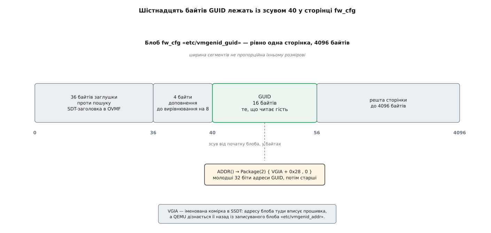

# 📋 Контракт VM Generation ID: що саме оголошує прошивка, QEMU і ядро

Механізм ідентифікатора покоління тримається на кількох рядках у таблицях прошивки й кількох символах у ядрі — і саме їх доводиться звіряти, коли треба зрозуміти, чому щось не спрацювало. Тут зібрано весь контракт: об'єкти ACPI, вузол дерева пристроїв, ключі й блоби QEMU, налаштування та експортовані символи Linux, а наприкінці — точний перелік того, чого простору користувача не дають.

## Бік прошивки: об'єкти ACPI

Пристрій оголошують у [таблицях ACPI](topic:programming/acpi-tables) — тому самому описі, з якого гість дізнається про залізо, що не знаходиться перебором шини. QEMU кладе його окремою SSDT: пристрій `VGEN` під `\_SB`.

| Об'єкт | Значення | Для чого |
|---|---|---|
| `_HID` | вендорський; у QEMU — `QEMUVGID` | ідентифікатор конкретної реалізації |
| `_CID` | `VM_Gen_Counter` — спільний для всіх гіпервізорів | за ним драйвер і впізнає механізм |
| `_DDN` | `VM_Gen_Counter` (QEMU) | назва для людини |
| `_STA` | `0x0F`, якщо адресу проставлено; `0x00`, якщо ні | «наявний, увімкнений, працює» / «дивитися нема на що» |
| `ADDR` | метод без аргументів → `Package(2)` з двох цілих | фізична адреса шістнадцяти байтів |
| `Notify(…, 0x80)` | з обробника GPE; у QEMU — `Notify(\_SB.VGEN, 0x80)` з `\_GPE._E05` | значення щойно змінили |

`ADDR` віддає адресу двома половинами: елемент `[0]` — молодші 32 біти, елемент `[1]` — старші. QEMU, який завжди розміщує блоб у 32-бітному просторі, повертає в `[1]` нуль.

На саму область специфікація Microsoft накладає чотири вимоги, і документація QEMU цитує їх під тими самими номерами:

| № | Вимога |
|---|---|
| R1a | буфер вирівняний на 8 байтів (сам буфер — 16 байтів) |
| R1b | лежить у гостьовому ОЗП, ПЗП або діапазоні MMIO пристрою |
| R1d | не покритий записом `AddressRangeMemory` чи `AddressRangeACPI` у карті E820 або UEFI |
| R1e | не в сторінці, яку можна відобразити з вимкненим кешуванням — тобто відображення лише кешовне |

Форму сповіщення специфікація не фіксує: сказано лише, що зміну треба показати через ACPI-сповіщення. QEMU бере перший вільний обробник, `\_GPE._E05`.

## Без ACPI: вузол дерева пристроїв

Там, де ACPI немає, ту саму пару «пам'ять плюс сигнал» описує [дерево пристроїв](topic:unix-linux/device-tree). Прив'язка живе у файлі `Documentation/devicetree/bindings/rng/microsoft,vmgenid.yaml`; усі три властивості обов'язкові.

```dts
rng@80000000 {
	compatible = "microsoft,vmgenid";
	reg = <0x80000000 0x1000>;
	interrupts = <GIC_SPI 35 IRQ_TYPE_EDGE_RISING>;
};
```

`reg` дає область із тими самими шістнадцятьма байтами (у прикладі під неї віддано цілу сторінку), `interrupts` — лінію, якою повідомляють про нове значення замість `Notify`.

## Бік QEMU

Пристрій вмикається одним ключем:

```
qemu-system-x86_64 … -device vmgenid,guid=auto
qemu-system-x86_64 … -device vmgenid,guid=324e6eaf-d1d1-4bf6-bf41-b9bb6c91fb87
```

Властивість `guid` має тип [UUID](topic:programming/uuid-and-guid); `auto` означає «згенеруй сам». Байти гість бачить у порядку little-endian — QEMU перевертає їх при записі. У libvirt тому самому пристроєві відповідає елемент `<genid/>` в XML домену.

Далі значення дістається гостю через два блоби каналу fw_cfg, яким QEMU передає прошивці іменовані шматки даних:

| Блоб | Розмір | Хто пише |
|---|---|---|
| `etc/vmgenid_guid` | 4096 байтів (`VMGENID_FW_CFG_SIZE`) | QEMU; гість лише читає |
| `etc/vmgenid_addr` | 4 байти | **гість**: прошивка вписує туди адресу, за якою розмістила блоб |

Ціла сторінка потрібна не задля шістнадцяти байтів, а щоб задовольнити R1d — сторінку цілком вилучають зі звичайного ОЗП. Сам GUID лежить із зсувом 40 (`VMGENID_GUID_OFFSET`), і цей зсув не випадковий.


*Перші 36 байтів — заглушка проти того, щоб OVMF прийняв початок блоба за заголовок таблиці ACPI; ще чотири доповнюють зсув до кратності восьми, як вимагає R1a.*

Зворотний запис адреси — не дрібниця, а те, завдяки чому механізм узагалі працює після відновлення. Прошивка сама вибирає, куди покласти блоб; вона вписує цю адресу в комірку `VGIA` всередині SSDT і той самий покажчик повертає QEMU через `etc/vmgenid_addr`. Відтоді QEMU знає гостьову фізичну адресу й може міняти вміст будь-коли, не чекаючи, поки прошивка виконається знову — а вона після `loadvm` і не виконується. З тієї ж причини значення `VGIA` зберігають через механізм VMState, тобто воно переживає збереження стану й міграцію.

З боку керування значення видно командою QMP:

```json
-> { "execute": "query-vm-generation-id" }
<- { "return": { "guid": "324e6eaf-d1d1-4bf6-bf41-b9bb6c91fb87" } }
```

## Бік ядра Linux

Драйвер `drivers/virt/vmgenid.c` з'явився у 5.18 як суто ACPI-шний, а у 6.10 його переробили на платформний — з двома таблицями впізнавання:

```c
static const struct of_device_id vmgenid_of_ids[] = {
	{ .compatible = "microsoft,vmgenid", },
	{ },
};

static const struct acpi_device_id vmgenid_acpi_ids[] = {
	{ "VMGENCTR", 0 },
	{ "VM_GEN_COUNTER", 0 },
	{ }
};
```

Два ACPI-рядки тут не з недбалості: `_CID` із початкової специфікації Microsoft довший, ніж дозволяє сам стандарт ACPI, тож Hyper-V додав другий, який у норму вкладається, — `VMGENCTR`, — а старий залишив заради сумісності з гостями Windows. Зверніть увагу й на регістр: у специфікації та в QEMU рядок записано як `VM_Gen_Counter`, а в таблиці ядра — самими великими літерами. Коли драйвер не прив'язується, звіряйте те, що справді віддала прошивка, — у `/sys/bus/acpi/devices/*/modalias`.

Вмикається драйвер налаштуванням `CONFIG_VMGENID` — `tristate "Virtual Machine Generation ID driver"`, `default y`. Довідка в `Kconfig` радить саме `y`, а не [модуль](topic:unix-linux/kernel-modules), і пояснює чому: захист має вмикатися дуже рано, а модуль на той час іще ніхто не завантажив.

Назовні, до решти ядра, стирчать три символи з `drivers/char/random.c`, і всі вони існують лише за `IS_ENABLED(CONFIG_VMGENID)`:

| Символ | Підпис | Хто викликає |
|---|---|---|
| `add_vmfork_randomness` | `void add_vmfork_randomness(const void *unique_vm_id, size_t len)` | драйвер, помітивши зміну; експортовано лише коли драйвер зібрано модулем |
| `register_random_vmfork_notifier` | `int register_random_vmfork_notifier(struct notifier_block *nb)` | підсистеми, яким треба знати про клонування (WireGuard) |
| `unregister_random_vmfork_notifier` | `int unregister_random_vmfork_notifier(struct notifier_block *nb)` | вони ж при вивантаженні |

Спрацювання видно в журналі ядра одним рядком — це найпростіший спосіб перевірити, що все склалося:

```
random: crng reseeded due to virtual machine fork
```

## Чого простору користувача не дають

Це найкоротша частина контракту, і саме її найчастіше шукають марно.

| Що | Стан |
|---|---|
| саме 128-бітне число | ядро не віддає його нікому: воно унікальне, але не таємне, тож іде в накопичувач без заліку жодного біта |
| файл у sysfs | немає; драйвер не заводить жодного атрибута |
| подія udev | протрималася рівно один випуск: з'явилася в 6.8, зникла в 6.9 |
| окремий пристрій `/dev/…` | пропонували, не взяли |

Історія з подією udev показова. Патч Бабіса Халіоса (Amazon) додавав `KOBJ_CHANGE` при зміні значення; Джейсон Доненфельд наклав на нього вето, супроводжувач теж відмовився брати, але за кілька місяців патч усе одно опинився в дереві. Скасовуючи його, Доненфельд пояснив це прямо: зміну ніхто не мав наміру вносити, вона потрапила туди помилково. Тож правил про [обробку подій udev](topic:unix-linux/udev-rules) для клонування писати нема на чому.

Ще раніше, 2021 року, Адріан Катанджіу (Amazon) провів сім редакцій серії «System Generation ID driver and VMGENID backend»: `drivers/misc/sysgenid.c` мав дати простору користувача `/dev/sysgenid` — лічильник поколінь, який можна читати, чекати на ньому через `poll()` і керувати ним [через ioctl](topic:unix-linux/ioctl-interface): `SYSGENID_SET_WATCHER_TRACKING`, `SYSGENID_TRIGGER_GEN_UPDATE`, `SYSGENID_WAIT_WATCHERS`. Серію не прийняли.

Лишився рівно один канал, і той непрямий: номер покоління генератора. Під час перезаряду ключа `crng_reseed()` кладе новий номер туди, звідки його бачить [vDSO](topic:unix-linux/vdso):

```c
if (IS_ENABLED(CONFIG_VDSO_GETRANDOM))
	smp_store_release((unsigned long *)&vdso_k_rng_data->generation, next_gen + 1);
```

Реалізація `getrandom()` у vDSO звіряє цей номер перед тим, як скористатися своїм закешованим станом. Тобто програма, яка бере випадковість [штатним шляхом](topic:unix-linux/random-devices), захищена автоматично й нічого про клонування не знає — а програма, якій потрібна не випадковість, а сам факт («я вже не той примірник, що орендував цю адресу»), не дізнається про нього ніяк.
