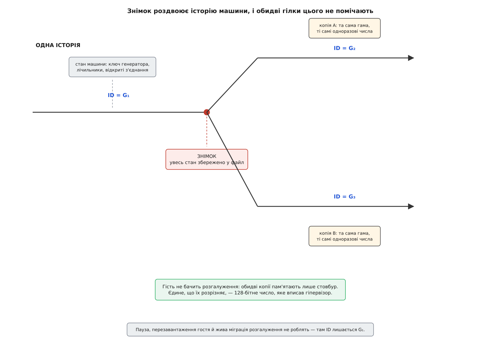
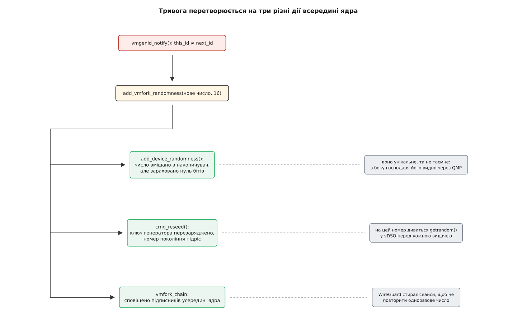

# VM Generation ID: як гість дізнається, що його клонували

<preknowlist>
- [Апаратна віртуалізація](book:programming/hardware-virtualization) — гість виконується на справжньому процесорі, але весь його стан належить гіпервізорові й повністю йому доступний.
- [Знімок і клон віртуальної машини](book:programming/vm-snapshot-and-clone) — гіпервізор уміє зберегти повний стан працюючої машини у файл, повернути її туди пізніше або запустити з того самого файла другу копію.
- [Джерело випадковості в ядрі](book:unix-linux/random-devices) — накопичувач, ключ генератора, `getrandom()`: звідки програми беруть непередбачні байти.
- [Криптографічний генератор випадкових чисел (CSPRNG)](book:algorithms/csprng) — із короткого таємного стану детерміновано розгортається потік, невідрізненний від шуму.
- [Потоковий шифр](book:algorithms/stream-cipher) — гама залежить від ключа й одноразового числа; повторити цю пару означає віддати відкритий текст.
- [Таблиці ACPI](book:programming/acpi-tables) — прошивка описує гостю те, чого не знайти перебором шини, і вміє надсилати йому сповіщення.
- [Дерево пристроїв](book:unix-linux/device-tree) — той самий опис недискаверабельного заліза там, де ACPI немає.
- [UUID і GUID](book:programming/uuid-and-guid) — 128-бітне число, унікальне без жодного реєстру.
</preknowlist>

## Машина, яка не помітила, що її стало дві

Ви зупинили працюючу машину, зберегли її стан у файл і запустили з цього файла дві копії. Кожна прокидається рівно там, де все спинилося: ті самі процеси, ті самі відкриті з'єднання, ті самі дані в буферах. Виглядає бездоганно, і саме в цьому лихо.

Бездоганність означає, що обидві копії однаково пам'ятають минуле. А в цьому минулому є речі, які машина пообіцяла більше ніколи не повторити: ключ генератора випадкових чисел, лічильник виданих одноразових значень, номер наступної транзакції. Пообіцяла — і зараз порушить обіцянку двічі, синхронно, не маючи жодного способу про це здогадатися.

Здогадатися заважає те, що будь-який прилад, яким машина могла б себе перевірити, лежить усередині скопійованого стану. Годинник? Гіпервізор відновить зсув лічильника тактів так само, як і решту регістрів, а стрибок настінного часу нічим не відрізняється від поправки NTP чи довгого засинання. Лічильник «скільки випадкових байтів я вже віддала»? Він скопійований разом з усім. Мітка «я — унікальний примірник», яку система собі колись записала? Записана на диску, диск теж скопійовано.

Це не хиба реалізації, а властивість самої операції. Копіювання охоплює спостерігача разом зі спостережуваним, тож зсередини воно невидиме за побудовою. Знає про нього рівно один — той, хто його виконав.

## Що саме ламається

Найгостріше страждає все, що виросло з генератора випадкових чисел. Ключ генератора в обох копіях однаковий, отже однаковий і потік, який він розгортає. Дві машини видадуть однакові сеансові ключі, однакові одноразові числа, однакові ідентифікатори, однакові початкові номери TCP-послідовностей.

Для потокового шифру збіг одноразового числа при тому самому ключі — не незручність, а кінець захисту: два різні відкриті тексти зашифровані однією гамою, і той, хто перехопив обидва, дістає їхню суму за модулем два без жодного ключа. Тому «дві копії почали з однакового стану» рівносильне «обидві віддали свій трафік».

Другий бік біди зовсім не криптографічний. Служба, яка веде монотонний журнал і роздає номери своїм співрозмовникам, після відкоту почне видавати номери, які вже комусь роздала — а співрозмовники ті номери вважають уже вжитими й нових даних під ними не приймуть. Саме ця, а не криптографічна, проблема й породила увесь механізм, про який тут ідеться: контролер домену Active Directory, відкочений із резервної копії, тихо руйнував реплікацію всієї мережі, і Microsoft довелося дати гостям спосіб помітити відкіт ([звідки взявся ідентифікатор покоління](book:unix-linux/vm-generation-id/hist-vmgenid-birth.md)).

## Яким узагалі може бути сигнал

Отже, сказати мусить гіпервізор. Питання лише — у якій формі, і на це питання відповідають вимоги, а не смак.

Перша вимога — **сигнал має читатися до того, як у гостя з'явиться хоч якась механіка**. Випадковість ядро витрачає з перших інструкцій; програма, що після відновлення робить перший запит, теж не чекатиме, поки хтось перебере шину. Це одразу відкидає пристрій на шині з чергами й драйвером: доки він знайдеться й ініціалізується, найгірше вже сталося.

Друга вимога — **звірку має бути дешево повторювати**. Не «спитати пристрій», а подивитися. Обидві вимоги задовольняє одна-єдина річ: комірка пам'яті. Гість читає її звичайним завантаженням з пам'яті, без пасток і без гіпервізорних переходів, і порівнює з тим, що запам'ятав раніше.

Третя вимога — **сигнал має пережити те, що гість у цей час не виконувався**. Коли машину відкочують, вона не працює: ніхто не може «прийняти повідомлення». Тому сигнал не подія, а стан: значення просто інше, ніж збережена копія. Гість помітить різницю тоді, коли гляне.

Четверта вимога — **прокинути того, хто не дивиться**. Порівнювати перед кожною дією ніхто не буде, тож поруч із пам'яттю потрібен поштовх — переривання чи сповіщення, яке гіпервізор посилає після зміни. Пам'ять дає можливість перевірити будь-коли, сповіщення — привід перевірити негайно; жодного з двох саме по собі не вистачає.

> 🔧 **Навіщо це.** Якщо ви пишете службу, для якої повторення власного стану неприпустиме — генератор ключів, видавач ідентифікаторів, лічильник подій, — не шукайте ознак клонування самотужки. Усе, що можна виміряти зсередини (стрибок годинника, зміна MAC-адреси, новий IP), або підробне, або запізніле. Єдина чесна ознака приходить із рівня нижче, і питання лише в тому, чи донесе її до вас ядро.

## Число, а не лічильник

Лишається вирішити, що саме класти в ту комірку. Природний перший здогад — лічильник: збільшуй на одиницю щоразу, коли машину роздвоїли.

Здогад розсипається на першому ж сценарії. Знімок відновлюють на іншому господарі, а часто й через місяці, з файла на полиці — новий гіпервізор не має звідки знати, до скількох дорахував старий. Гірше: дві копії з одного знімка збільшать лічильник кожна від того самого числа й отримають однакові значення, тобто механізм зламається саме там, де він найпотрібніший. Правильно збільшувати лічильник можна лише з єдиного центру, який стежить за всіма копіями всіх машин, — а такого центру немає й не буде.

Тому в комірці лежить не лічильник, а 128-бітне випадково згенероване число. Різність тут дістається задарма: два незалежні генератори не збігаються не тому, що хтось цим керує, а тому що ймовірність збігу мізерна. Порівняння «те саме чи інше» працює без жодного узгодження між господарями.

Наскільки мізерна — варто побачити числом, бо саме на цьому тримається вся конструкція.

**Умова: велика хмара, у якій за рік сталося десять мільярдів клонувань і відкотів, і кожен дав нове 128-бітне число.**

```
n = 10¹⁰                      скільки чисел згенеровано за рік
N = 2¹²⁸ ≈ 3.40 · 10³⁸        скільки їх узагалі можливо

ймовірність хоча б одного збігу ≈ n² / (2 · N)
                                = 10²⁰ / (6.81 · 10³⁸)
                                ≈ 1.5 · 10⁻¹⁹
```

Тобто на всю хмару за рік шанс, що бодай десь дві машини отримали однакові ідентифікатори, лежить у районі одного до десяти квінтильйонів. Ніякого обліку не треба: унікальність тут не забезпечують, вона виходить сама.

Одну річ про це число варто затямити відразу: воно **унікальне, але не таємне**. Його читає гість, його бачить гіпервізор, його можна спитати з боку господаря командою керування, а Windows узагалі віддає його програмам. Саме ця обставина визначає, як ядро Linux ним розпоряджається.


*Розгалуження видно тільки ззовні. Усередині кожної гілки минуле те саме, і єдиний слід поділу — 128-бітне число, вписане гіпервізором.*

## Де ці шістнадцять байтів лежать

Комірку треба ще знайти, і шукати її нема де: у карті пам'яті вона не позначена, перебором шини не знаходиться. Отже, адресу мусить назвати прошивка.

На платформах з ACPI гіпервізор оголошує пристрій зі своїм власним `_HID` (у QEMU — `QEMUVGID`) і спільним для всіх виробників `_CID` зі значенням `VM_Gen_Counter` — саме за цим сумісним ідентифікатором гість і впізнає механізм, хай хто його надає. Усередині пристрою є метод `ADDR`, який повертає пакет із двох цілих: молодша й старша половини фізичної адреси.

На саму сторінку накладено дві умови, і кожна з них розв'язує конкретну біду. Перша: місце вирізане з карти доступного гостю ОЗП. Інакше ядро рано чи пізно віддало б ту сторінку під власні дані, а гіпервізор і далі писав би туди свої шістнадцять байтів — тобто мовчки псував би чужу пам'ять. Друга: відображати її дозволено тільки як кешовну. Це прямий наслідок першої вимоги до сигналу — читання мусить бути звичайним завантаженням з пам'яті, а не зверненням до пристрою; за таке читання не платять ані пасткою в гіпервізор, ані повільним некешованим доступом. Платить за це гість тим, що в кеші може лежати старе значення, і саме тому самої лише пам'яті не досить: після зміни гіпервізор шле гостю ACPI-сповіщення з кодом `0x80`, а обробник сповіщення перечитує байти вже свідомо.

Там, де ACPI немає — а це типовий випадок для легких гіпервізорів на ARM, — ту саму пару описує вузол дерева пристроїв із сумісністю `microsoft,vmgenid`: `reg` дає ті самі шістнадцять байтів, а окрема лінія переривання заміняє сповіщення. Цей шлях з'явився в Linux 6.10 (2024).


*Уся «апаратура» — це адреса, названа прошивкою, шістнадцять байтів пам'яті й один сигнал. Точний вигляд об'єктів ACPI, вузла дерева пристроїв і налаштувань QEMU зібрано окремо ([контракт VM Generation ID](book:unix-linux/vm-generation-id/api-vmgenid-surface.md)).*

## Коли число мусить змінитися, а коли — ні

Тепер найважче в усьому механізмі, і воно не технічне. Треба вирішити, які саме події вважати роздвоєнням.

Одне речення породжує всю відповідь: ідентифікатор позначає **гілку історії, а не перерву в роботі**. Якщо після події існує рівно одне продовження того, що було, — це та сама машина, хай як довго вона стояла. Якщо продовжень стало два або машина повернулася в уже прожитий момент — це інша гілка.

Звідси все й випливає. Відновлення зі знімка чи з резервної копії — зміна: машина потрапила туди, де вже була. Копіювання образу, новий гість із шаблону, підняття запасної машини після аварії — зміна: продовжень стало більше ніж одне. А от пауза й відновлення, перезавантаження гостя, перезавантаження самого господаря й [жива міграція](book:programming/live-migration) — не зміна: історія одна, вона просто перервалася або переїхала. Особливо промовиста тут міграція: машину буквально перенесли на іншу фізичну плату, а ідентифікатор лишається старий, бо копії не виникло.

## Що робить із цим Linux

Драйвер `drivers/virt/vmgenid.c` з'явився у версії 5.18 (2022, Джейсон Доненфельд) — через десять років після появи самого механізму. Він до смішного малий, і кожен його рядок прямо випливає зі сказаного вище.

Під час `probe` драйвер бере адресу з `ADDR` (або з `reg`, якщо це дерево пристроїв), відображає сторінку й робить одну важливу річ — знімає власну копію:

```c
static void setup_vmgenid_state(struct vmgenid_state *state, void *virt_addr)
{
	state->next_id = virt_addr;
	memcpy(state->this_id, state->next_id, sizeof(state->this_id));
	add_device_randomness(state->this_id, sizeof(state->this_id));
}
```

`next_id` — покажчик у пам'ять гіпервізора, `this_id` — те, що там бачили востаннє. Порівняння цих двох і є весь механізм виявлення:

```c
static void vmgenid_notify(struct device *device)
{
	struct vmgenid_state *state = device->driver_data;
	u8 old_id[VMGENID_SIZE];

	memcpy(old_id, state->this_id, sizeof(old_id));
	memcpy(state->this_id, state->next_id, sizeof(state->this_id));
	if (!memcmp(old_id, state->this_id, sizeof(old_id)))
		return;
	add_vmfork_randomness(state->this_id, sizeof(state->this_id));
}
```

Звіряння, а не довіра до самого факту сповіщення, тут не зайва обережність: сповіщення могло прийти з іншої причини, а обробник переривання в дереві пристроїв узагалі оголошений спільним для лінії. Ознакою вважається тільки різниця значень.

## Чому домішування не додає таємниці, але рятує

Далі керує підсистема випадковості:

```c
/* drivers/char/random.c */
void __cold add_vmfork_randomness(const void *unique_vm_id, size_t len)
{
	add_device_randomness(unique_vm_id, len);
	if (crng_ready()) {
		crng_reseed(NULL);
		pr_notice("crng reseeded due to virtual machine fork\n");
	}
	blocking_notifier_call_chain(&vmfork_chain, 0, NULL);
}
```

Зверніть увагу, чого тут немає: ядро не зараховує жодного біта невідомості. Коментар над функцією каже прямо — число унікальне, але не таємне. Ядро не має права рахувати публічне значення як ентропію: хто завгодно з боку господаря може його прочитати.

Постає природне питання: навіщо ж тоді домішувати те, що нічого не додає?

Відповідь у тому, що потрібна тут не таємність, а **розбіжність**. У двох копій накопичувач був байт у байт однаковий; після домішування двох різних чисел він став різний. Обидві копії й далі однаково передбачувані для того, хто знав стан до знімка, — але вони більше не однакові між собою, а це вже прибирає катастрофу з однаковими одноразовими числами. Далі кожна копія почне збирати власні моменти переривань і власні байти від [virtio-rng](book:unix-linux/virtio-rng), і ці потоки розійдуться остаточно.

Розбіжності мало без другої дії — `crng_reseed()`. Домішане в накопичувач не діє, доки з нього не перезарядять ключ генератора, а звичайний перезаряд стається раз на хвилину. Хвилина після клонування — це десятки виданих ключів, тож перезаряд роблять негайно. Заразом росте номер покоління — те саме число, яке перевіряє реалізація `getrandom()` у [vDSO](book:unix-linux/vdso), перш ніж скористатися своїм закешованим станом; завдяки цьому програми, що беруть випадковість швидким шляхом, теж помічають подію.

Третя дія — оповіщення підписників усередині ядра. Найпоказовіший з них — WireGuard: він стирає наявні сеанси й змушує заново провести рукостискання, бо продовжити старий сеанс двома копіями означало б зашифрувати різні дані однією парою «ключ + одноразове число».


*Одна подія розходиться на три різні дії, і жодна з них не заміняє інші.*

## Де механізм протікає

Чесно назвати межі тут важливіше, ніж деінде, бо механізм легко сплутати з гарантією.

**Перегони.** Значення міняється, поки гість стоїть, а виконуватися він починає раніше, ніж до нього дійде сповіщення. У цьому проміжку ядро працює зі старим ключем генератора. Автор драйвера називав цю ваду вбудованою й шкодував, що пристрій не дає ще й 32-бітного слова-лічильника, яке можна було б дешево опитувати перед кожною видачею. Вікно коротке — стільки, скільки сповіщення йде від гіпервізора до драйвера, — проти хвилин, які були б без механізму.

**Простір користувача лишився майже ні з чим.** Ядро не віддає ані самого числа, ані події. Спробу надсилати про це подію udev у ядро внесли, а потім вилучили — рішення виявилося спірним, і суперечка тривала в обидва боки ([контракт VM Generation ID](book:unix-linux/vm-generation-id/api-vmgenid-surface.md) описує, що з цього лишилося). Те, що справді дійшло до користувача, — це номер покоління у vDSO (і то лише від 6.11, коли туди переїхав `getrandom()`), і покриває він рівно одну потребу: випадковість. Оренда DHCP, ідентифікатор вузла в кластері, унікальне ім'я машини, кеш із чужими даними — про них не дізнається ніхто, і службам доводиться помічати клонування власними, куди менш надійними способами.

**Механізм не скасовує вже зробленого.** Ключ, виданий до знімка, після відновлення виданий двічі; жоден перезаряд цього назад не забирає. Ідентифікатор покоління захищає майбутнє, не минуле.

**І він просто може бути відсутній.** Якщо гіпервізор пристрою не показує або ядро гостя старіше за 5.18, нічого з описаного не станеться, і зовні це виглядатиме точно так само, як справна робота. Перевірити наявність і побачити тривогу на власні очі можна за кілька хвилин у QEMU ([упіймати клонування власноруч](book:unix-linux/vm-generation-id/proj-catch-the-fork.md)).

Загалом виходить показова річ. Усього механізму — шістнадцять байтів пам'яті, один сигнал і драйвер на сотню рядків; складність тут не в реалізації, а в означенні. Найважче було домовитися, що саме вважати «тією самою машиною», — і саме тому ідентифікатор зроблено настільки дурним і настільки раннім: він мусить бути читабельним у ту єдину мить, коли машині не можна вірити нічого, зокрема й її власного уявлення про те, хто вона.
