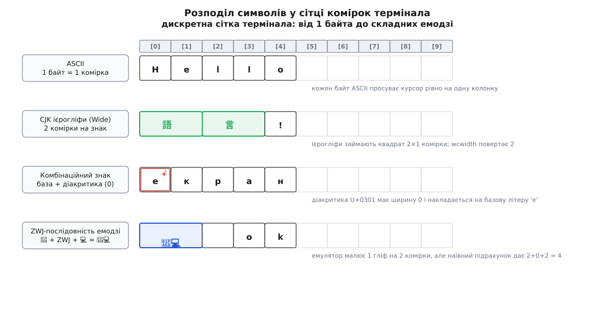
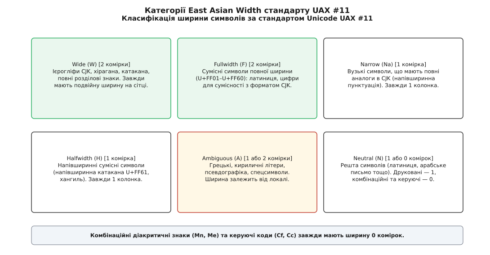
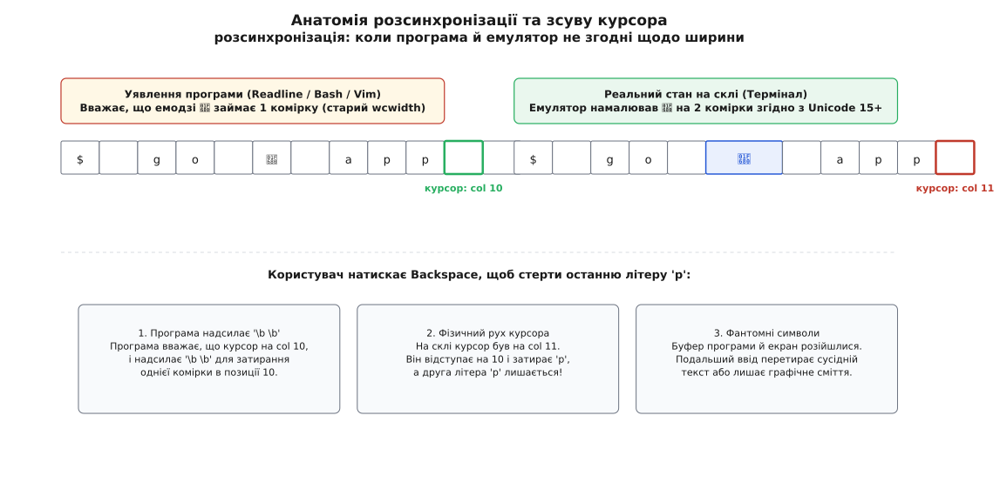

# Ширина символу в комірках: wcwidth, подвійні знаки й комбінаційні

<preknowlist>
- [TTY і termios](book:unix-linux/tty-and-termios) — шар ядра між програмою й терміналом: сирий режим, відлуння, передача байтів через дескриптор.
- [Керуючі послідовності термінала](book:unix-linux/terminal-escape-sequences) — ANSI-команди позиціювання курсора `ESC [ y ; x H`, очищення рядка та запиту стану `ESC [ 6 n`.
- [ncurses](book:unix-linux/ncurses) — повноекранні програми, буфер комірок `WINDOW` та широкосимвольні структури `cchar_t`.
- [ASCII і UTF-8](book:programming/ascii-utf8) — кодові позиції (code points), змінна довжина байтів від 1 до 4 та відмінність між байтом, символом і гліфом.
- [Локалі та кодування](book:unix-linux/locale-and-collation) — змінна `LC_CTYPE`, класифікація символів у libc та залежність функцій від активного середовища.
</preknowlist>

Ви запускаєте системний монітор `htop` або текстовий редактор `vim` у терміналі, у назві процесу з'являється емодзі 🚀 або ієрогліф 言, і вся екранна розмітка миттєво руйнується: вертикальні псевдографічні рамки розриваються зі зсувом на один стовпчик праворуч, текст наповзає на сусідні колонки таблиці, а натискання клавіші `Backspace` затирає порожнє місце перед курсором, залишаючи попередній символ недоторканим.

Ця поломка виникає через фундаментальну несумісність між растровим відтворенням довільного сучасного тексту та жорсткою дискретною сіткою моноширинного термінала. Графічний інтерфейс браузера чи віконного менеджера рендерить літери на векторному полотні з довільним піксельним кернінгом і пропорційними шрифтами. Термінал, натомість, мислить виключно матрицею прямокутних комірок фіксованого розміру `(рядок, стовпчик)`. У цій системі координат кожен видимий елемент зобов'язаний займати строго ціле число колонок: рівно 0, 1 або 2. Якщо програма в командному рядку та емулятор термінала хоча б на одну одиницю розходяться в оцінці ширини символу, їхній внутрішній стан координат курсора незворотно розсинхронізується.



*Різні категорії символів у сітці термінала: від одномісного ASCII до подвійних ієрогліфів, невагомої діакритики та складних складених емодзі.*

## Чотири несумісні довжини одного рядка

Коли програма взаємодіє з текстом у термінальному середовищі Unix, вона стикається з чотирма взаємно відмінними числовими вимірами того самого рядка:

Перший вимір — **байтовий обсяг у пам'яті** (`strlen`). В англійському слові `"code"` рівно чотири байти. У кириличному слові `"код"` шість байтів у кодуванні UTF-8 (по два байти на літеру). У японському слові `"言語"` шість байтів (по три байти на кожен ієрогліф). Для системних викликів введення-виведення `read(2)` та `write(2)` чи передачі даних через TCP-сокет важливий виключно цей фізичний розмір буфера. Проте для геометричного розташування тексту на екрані кількість байтів не дає жодної корисної інформації.

Другий вимір — **кількість кодових позицій Unicode** (*code points*). Слово `"код"` складається з 3 кодових позицій (`U+043A`, `U+043E`, `U+0434`). Але якщо літера «е» містить діакритичний наголос, вона може бути представлена в пам'яті двома різними шляхами згідно з правилами нормалізації Unicode: або як один прекомпонований символ `U+00E9` (форма NFC), або як послідовність двох незалежних кодових пунктів: базова літера `e` (`U+0065`) плюс комбінаційний знак наголосу Combining Acute Accent (`U+0301`) (форма NFD). Кількість кодових позицій різна (одна проти двох), проте візуально це той самий друкований знак.

Третій вимір — **кількість графемних кластерів** (*user-perceived character* за стандартом Unicode UAX #29). Це неподільні для людського ока символи, які сприймаються як єдиний графічний знак. Наприклад, складений емодзі жінки-технолога 👩‍💻 утворено трьома кодовими позиціями: жінка 👩 (`U+1F469`), з'єднувач нульової ширини ZWJ (`U+200D`) та персональний комп'ютер 💻 (`U+1F4BB`). Користувач сприймає цю композицію як одну-єдину неподільну піктограму.

Четвертий вимір — **термінальна ширина в комірках** (*terminal cell width*). Це кількість колонок моноширинної сітки, на яку фізично пересунеться курсор дисплея після виводу послідовності байтів:
- Латинський символ `"A"`: 1 байт, 1 кодова позиція, 1 графема → **1 комірка**.
- Ієрогліф кандзі `"語"`: 3 байти, 1 кодова позиція, 1 графема → **2 комірки**.
- Літера з діакритикою `"е́"` (`e` + `U+0301`): 3 байти, 2 кодові позиції, 1 графема → **1 комірка**.
- Складений емодзі 👨‍👩‍👧‍👦 (сім'я): 25 байтів, 7 кодових позицій, 1 графема → **2 комірки**.

Якщо програма вирівнює стовпчики таблиці за кількістю байтів (`strlen`) або символів (`mbstowcs`), вона неминуче отримує спотворений екран. Історично для з'ясування термінальної ширини було розроблено стандартний інтерфейс операційної системи ([від телетайпів до емодзі](book:unix-linux/wcwidth-and-cell-width/hist-from-monowidth-to-emojis.md) — як механічна каретка телетайпа визначила геометрію екранного буфера).

## Стандарт POSIX: функції `wcwidth(3)` та `wcswidth(3)`

Для забезпечення переносимості стандарт POSIX.1-2001 (спираючись на мовний стандарт ISO C99) визначив функції для розрахунку екранної ширини широких символів у системному заголовку `<wchar.h>`:

:::tabs
```c
#include <wchar.h>

int wcwidth(wchar_t wc);
int wcswidth(const wchar_t *pwcs, size_t n);
```
```cpp
#include <cwchar>

int wcwidth(wchar_t wc);
int wcswidth(const wchar_t *pwcs, std::size_t n);
```
:::

Функція `wcwidth` приймає один широкий символ `wc` (тип `wchar_t`, що в системі Linux є 32-бітним цілим числом, еквівалентним кодовій позиції Unicode) і повертає одне з чотирьох стандартизованих значень:
- **`0`**: символ не рухає курсор праворуч (нульовий термінатор `\0`, комбінаційні діакритичні знаки, керівні коди нульової ширини);
- **`1`**: стандартний друкований символ одинарної ширини (латиниця, кирилиця, цифри, пунктуація, математичні символи у західних локалях);
- **`2`**: повноширинний символ подвійної ширини (ієрогліфи CJK, східноазійські розділові знаки, класичні унітарні емодзі);
- **`-1`**: недрукований керівний символ (`\n`, `\r`, `\t`, керівні ANSI-послідовності `ESC`), або кодова позиція, не підтримувана в поточній активній локалі процесу.

Функція `wcswidth` обчислює сумарну ширину масиву з `n` широких символів. Вона послідовно викликає `wcwidth` для кожного елемента доти, доки не зустріне нуль-термінатор `\0` або не вичерпає ліміт `n`. Якщо хоча б один символ повертає `-1`, функція `wcswidth` негайно перериває обхід і повертає **`-1`** як ознаку неможливості розрахувати ширину рядка ([інтерфейс POSIX wcwidth](book:unix-linux/wcwidth-and-cell-width/api-posix-wcwidth.md) — повна специфікація контракту, потік-безпечність та робота з `uselocale`).

### Пастка локалі за замовчуванням

Найпоширеніша прихована пастка під час використання `wcwidth` полягає в ігноруванні системної локалі. Відповідно до стандарту ANSI C, кожен процес після запуску автоматично стартує в мінімальній локалі `"C"` (або `"POSIX"`). У цій базовій локалі визначено виключно 7-бітний набір символів ASCII (`0x00`..`0x7F`).

Якщо програма викличе `wcwidth(L'і')` або `wcwidth(L'語')` без попереднього налаштування локалі, функція поверне **`-1`**, оскільки для локалі `"C"` будь-який числовий код понад 127 є неприпустимим недрукованим символом.

Щоб `wcwidth` підтягнув реальні таблиці Unicode з системної бібліотеки `glibc` чи `musl`, програма зобов'язана на початку виконання функції `main` ініціалізувати категорію `LC_CTYPE` зі змінних середовища користувача:

:::tabs
```c
#include <stdio.h>
#include <wchar.h>
#include <locale.h>

int main(void) {
    /* Без цього виклику wcwidth працюватиме лише з 7-бітним ASCII */
    setlocale(LC_CTYPE, "");

    wchar_t chars[] = { L'A', L'ф', L'語', 0x0301, L'🚀', 0 };

    for (int i = 0; chars[i] != 0; ++i) {
        int w = wcwidth(chars[i]);
        printf("Символ U+%04X -> ширина: %2d комірки\n", (unsigned int)chars[i], w);
    }
    return 0;
}
```
```cpp
#include <iostream>
#include <cwchar>
#include <clocale>
#include <vector>
#include <iomanip>

int main() {
    // Увімкнення системної локалі для коректної класифікації Unicode
    std::setlocale(LC_CTYPE, "");

    const std::vector<wchar_t> chars = { L'A', L'ф', L'語', 0x0301, L'🚀' };

    for (wchar_t wc : chars) {
        int w = wcwidth(wc);
        std::cout << "Символ U+" << std::hex << std::uppercase << std::setw(4) 
                  << std::setfill('0') << static_cast<unsigned int>(wc) 
                  << " -> ширина: " << std::dec << std::setw(2) << std::setfill(' ') 
                  << w << " комірки\n";
    }
    return 0;
}
```
:::

## Стандарт Unicode UAX #11: властивість East Asian Width

Те, як саме системна бібліотека та емулятор термінала класифікують кодові позиції за шириною, регулюється офіційним додатком стандарту Unicode Standard Annex #11 (UAX #11: *East Asian Width*). Цей документ розділяє простір кодових позицій на шість фундаментальних категорій:



*Шість категорій стандарту UAX #11 та їхній вплив на кількість зайнятих стовпчиків у терміналі.*

1. **Wide (W — широкі):** символи, що типографічно займають повний квадрат (подвійну ширину моноширинної сітки) у східноазійських писемностях. До них належать уніфіковані ієрогліфи CJK (`U+4E00`..`U+9FFF`), знаки японських складових абеток хірагана й катакана, склади корейського письма хангиль (`U+AC00`..`U+D7A3`), а також повноширинні розділові знаки. **Ширина завжди дорівнює 2 коміркам.**
2. **Fullwidth (F — повноширинні сумісні):** символи сумісності з діапазону `U+FF01`..`U+FF60`. Це латинські літери, цифри та розділові знаки, створені для точної сумісності зі старими азійськими терміналами (наприклад, повноширинна літера `Ａ` `U+FF21` або цифра `１` `U+FF11`). **Ширина завжди дорівнює 2 коміркам.**
3. **Narrow (Na — вузькі):** символи, що мають повноширинні аналоги в категорії `Fullwidth` (наприклад, звичайні літери латинського алфавіту `ASCII`). **Ширина завжди дорівнює 1 комірці.**
4. **Halfwidth (H — напівширинні):** спеціальні символи сумісності з діапазону `U+FF61`..`U+FFDC` (напівширинна катакана та напівширинні корейські літери чамо). Вони призначалися для ранніх терміналів з обмеженим обсягом пам'яті, де японські знаки вміщували в одну 8-бітну комірку. **Ширина завжди дорівнює 1 комірці.**
5. **Neutral (N — нейтральні):** усі символи писемностей, які традиційно не використовуються в Східній Азії (латиниця, арабська мова, деванагарі, грузинське письмо тощо). Для звичайних друкованих символів цієї категорії **ширина дорівнює 1 комірці**; для комбінаційних знаків та керуючих кодів — 0.
6. **Ambiguous (A — неоднозначні):** критична категорія символів, які в традиційних західних кодуваннях (ISO 8859) завжди мали одинарну ширину (1 комірка), але в східноазійських національних кодуваннях (Shift-JIS, EUC-KR, Big5) займали подвійну ширину (2 комірки).

### Проблема категорії Ambiguous та контекст локалі

До категорії **Ambiguous** належать:
- Грецькі літери (`α`, `β`, `γ`, `Ω`);
- Кириличні літери (`Д`, `Ж`, `Щ`, `ю`, `я`);
- Символи псевдографіки одинарних і подвійних рамок (`─`, `│`, `┌`, `┐`, `┼`, `║`, `═`);
- Математичні та технічні знаки (`±`, `≠`, `≤`, `≥`, `∞`, `§`, `℃`, `µ`).

Скільки стовпчиків термінал має виділити під кириличну літеру «Ж» чи символ горизонтальної лінії `─`? Якщо активна європейська або американська локаль (`uk_UA.UTF-8`, `en_US.UTF-8`), категорія Ambiguous трактується як **одинарна (ширина 1)**. Проте в японській (`ja_JP.UTF-8`), китайській (`zh_CN.UTF-8`, `zh_TW.UTF-8`) чи корейській (`ko_KR.UTF-8`) локалях ці самі кодові позиції розглядаються як **подвійні (ширина 2)**.

Якщо користувач підключається через протокол SSH із японського клієнтського термінала до європейського сервера (або запускає сесію `tmux` зі змішаними змінними оточення), виникає важка розбіжність: серверний процес `vim` вважає рамку вікна одинарною, а клієнтський емулятор малює її на дві комірки, розриваючи весь інтерфейс. У текстовому редакторі `vim` для примусового перевизначення цієї поведінки існує спеціальна опція конфігурації: `set ambiwidth=single` або `set ambiwidth=double`.

> 🔧 **Навіщо це.** Якщо у віддаленій сесії SSH або всередині контейнера Docker псевдографіка рамок розповзається і ламає лінії таблиць, перевірте значення локалі. Встановлення `export LC_ALL=C.UTF-8` або `export LC_CTYPE=uk_UA.UTF-8` примусово повертає категорію Ambiguous до одинарної ширини в 1 комірку.

## Знаки нульової ширини та модифікатори

Не кожен видимий або функціональний символ має займати власну колонку в матриці екрана. Стандарт Unicode виділяє кілька класів символів, чия термінальна ширина дорівнює **0**:

### 1. Комбінаційні діакритичні знаки (Combining Marks)

У категоріях Unicode **Mn** (*Nonspacing Mark*) та **Me** (*Enclosing Mark*) розташовані знаки, які графічно накладаються на попередній базовий символ:
- Апострофи, наголоси, умлаути, тильди (`U+0300`..`U+036F`);
- Кириличні титли й комбінаційні літери (`U+0483`..`U+0489`);
- Комбінаційні символи обрамлення (наприклад, кружечок `U+20DD`).

Коли термінал зустрічає літеру `e` (`U+0065`), він розміщує її в поточній комірці і просуває курсор на 1 стовпчик праворуч. Коли наступним байтом надходить знак наголосу ` ́` (`U+0301`), функція `wcwidth(0x0301)` повертає `0`. Емулятор термінала не зсуває курсор, а рендерить діакритичний знак поверх уже намальованої літери `e` в тій самій комірці.

### 2. Керуючі формати та невидимі роздільники (Format Controls)

Символи категорії **Cf** (*Format Character*) не мають власного графічного накреслення і використовуються для керування потоком тексту:
- М'який перенос Soft Hyphen (`U+00AD`);
- Маркери двонаправленого тексту BiDi (LRM `U+200E`, RLM `U+200F`);
- Пробіл нульової ширини Zero Width Space (`U+200B`).

Усі вони мають `wcwidth == 0`, оскільки не займають простору на сітці дисплея.

### 3. З'єднувач нульової ширини (ZWJ) та нез'єднувач (ZWNJ)

Символи `U+200D` (**ZWJ** — *Zero Width Joiner*) та `U+200C` (**ZWNJ** — *Zero Width Non-Joiner*) первинно створювалися для правильного зв'язування літер в арабському письмі та індійських писемностях (деванагарі). У сучасних терміналах ZWJ відіграє роль сполучного елемента, що збирає складні послідовності емодзі в єдиний монолітний гліф. Сам по собі ZWJ має ширину 0, проте його вплив на сусідні символи докорінно змінює ширину всієї групи.

### 4. Варіативні селектори (Variation Selectors)

Варіативні селектори — це спеціальні коди нульової ширини, які вказують механізму рендерингу, як саме слід відображати попередній символ:
- **VS15 (`U+FE0E` — Variation Selector-15):** вимагає простого текстового монохромного відображення (ширина **1 комірка**);
- **VS16 (`U+FE0F` — Variation Selector-16):** вимагає повноколірного графічного емодзі-відображення (ширина **2 комірки**).

Розглянемо символ шестерні `⚙` (`U+2699`). Сам по собі цей символ є нейтральним або текстовим (ширина 1). Якщо після нього передати селектор `U+FE0E` (`⚙︎`), він залишається текстовим знаком шириною в 1 комірку. Якщо ж передати селектор `U+FE0F` (`⚙️`), сучасний емулятор зобов'язаний намалювати кольорове графічне емодзі, яке розширюється на **2 комірки**.

## Графемні кластери (UAX #29) та криза моделі `wcwidth`

Стандартний інтерфейс `wcwidth(wchar_t)` працює виключно з однією ізольованою кодовою позицією. Він не має пам'яті про попередні символи й не заглядає наперед. З появою складних емодзі за стандартом Unicode UAX #29 (*Unicode Text Segmentation: Grapheme Cluster Boundaries*) це призвело до повної втрати зв'язку між `wcwidth` та реальністю на екрані.

Розглянемо три класи конструкцій, на яких класичний `wcwidth` зазнає поразки:

### 1. Емодзі з модифікаторами відтінку шкіри (шкала Фітцпатріка)

Послідовність «жест великого пальця вгору з темним відтінком шкіри» 👍🏿 складається з двох окремих кодових позицій:
1. `U+1F44D` (Thumbs Up Sign) — категорія Wide, `wcwidth` = 2.
2. `U+1F3FF` (Emoji Modifier Fitzpatrick Type-6) — модифікатор шкіри, `wcwidth` = 2 (або 0 у застарілих libc).

Функція `wcswidth` підсумовує їхні ширини: `2 + 2 = 4` (або `2 + 0 = 2`). Якщо системна бібліотека повертає 4, програма резервує чотири комірки екрана. Проте графічний рушій емулятора термінала об'єднує їх в один гліф 👍🏿 і рендерить його рівно у **2 комірках**. Виникає десинхронізація на 2 порожні позиції.

### 2. Складені ZWJ-послідовності

Символ сім'ї 👨‍👩‍👧‍👦 утворений сімома кодовими позиціями Unicode, з'єднаними кодами ZWJ:

```
U+1F468 (Чоловік, 2) + U+200D (ZWJ, 0) + 
U+1F469 (Жінка, 2)  + U+200D (ZWJ, 0) + 
U+1F467 (Дівчинка, 2) + U+200D (ZWJ, 0) + 
U+1F466 (Хлопчик, 2)
```

Покроковий розрахунок через стандартний `wcwidth` дає такий результат:

```
  wcwidth(👨) = 2
+ wcwidth(ZWJ) = 0
+ wcwidth(👩) = 2
+ wcwidth(ZWJ) = 0
+ wcwidth(👧) = 2
+ wcwidth(ZWJ) = 0
+ wcwidth(👦) = 2
─────────────────
Сума wcswidth  = 8 комірок
Реальний екран = 2 комірки
Розрив        = 6 комірок
```

Програма очікує, що рядок займе 8 стовпчиків, і зсуває наступний текст на позицію 8. Але на склі намальовано один малюнок шириною у 2 стовпчики. Між малюнком і наступним текстом утворюється дірка в шість порожніх комірок. Якщо користувач спробує пересунути курсор назад, курсор почне «ходити по повітрю».

### 3. Прапори країн (пари регіональних індикаторів)

Прапор України 🇺🇦 не має власної унітарної кодової позиції в таблиці Unicode. Він кодується парою так званих регіональних індикаторів (*Regional Indicator Symbols*):
- `U+1F1FA` (Regional Indicator Symbol Letter U)
- `U+1F1E6` (Regional Indicator Symbol Letter A)

Окремо кожна літера індикатора має ширину 1 або 2 залежно від реалізації libc. Разом вони формують єдиний графемний кластер прапора шириною рівно у **2 комірки**.

## Анатомія розсинхронізації: дрейф курсора в CLI та TUI

Щоб зрозуміти, чому розбіжність у ширині руйнує роботу термінальних програм, простежимо внутрішню модель бібліотек редагування рядка (`readline` у `bash`, `zle` у `zsh`) та повноекранних інтерфейсів TUI (`ncurses`, `vim`, `tmux`).



*Як розбіжність в один стовпчик накопичує дрейф курсора й утворює фантомні символи при редагуванні.*

### Сценарій помилки: введення та затирання тексту в Bash

Уявімо командний рядок оболонки Bash, що використовує бібліотеку GNU Readline:
1. Користувач вводить команду: `git commit -m "🚀 app"`.
2. Бібліотека Readline для кожного символу викликає системну функцію `wcwidth`. Якщо версія `glibc` застаріла (наприклад, на сервері з дистрибутивом LTS), функція `wcwidth(0x1F680)` повертає **1** (символ ще не був позначений як Wide у старій таблиці).
3. Readline фіксує внутрішню координату курсора: `cur_col = 22`.
4. Емулятор термінала (наприклад, сучасний Alacritty чи GNOME Terminal із новим рушієм VTE), отримавши байти UTF-8 символу `🚀`, використовує власну актуальну таблицю Unicode 15.0 і малює ракету на **2 комірки**.
5. Фізичний курсор на склі термінала переміщується на стовпчик **23**. Внутрішній лічильник програми відстав від скла на 1 позицію.
6. Тепер користувач помічає помилку в слові `"app"` і тричі натискає клавішу `Backspace`.
7. Щоб стерти один символ, Readline надсилає в термінал стандартну послідовність повернення й затирання: `\b \b` (байт повернення на 1 крок `0x08`, пробіл `0x20` і знову байт `0x08`).
8. Readline вважає, що стирає літери в позиціях 22, 21, 20. Проте на склі курсор стояв у позиціях 23, 22, 21. У результаті пробіл затирає літеру `p`, літера `a` зміщується, а на екрані залишається понівечений хвіст `"a app"`.
9. Якщо натиснути клавішу `Ctrl+A` (перехід на початок рядка), курсор переміститься не на початок запрошення, а зупиниться на одну позицію правіше, накладаючи подальший набір тексту поверх старого запрошення.

### Сценарій помилки: зламані рамки у Vim та Tmux

У повноекранних програмах розсинхронізація призводить до розриву ліній вертикального розділення вікон. Якщо рядок зліва містить символ, для якого емулятор виділив 2 комірки, а редактор порахував 1, правий край вікна переповнює буфер і пересуває розділювач `│` праворуч. У результаті вертикальна лінія вікна перетворюється на пилкоподібний зигзаг.

## Реалізації розрахунку ширини та часовий розрив оновлень

Головна причина масової появи подібних помилок полягає в різній швидкості оновлення компонентів системи:

```
Консорціум Unicode (щорічний реліз: Unicode 14, 15, 16)
        │
        ├──> Емулятори терміналів (швидкий цикл: Kitty, Alacritty, WezTerm, VTE)
        │    Оновлюють таблиці ширини за тижні.
        │
        └──> Системні C-бібліотеки ОС (повільний цикл: GNU C Library, musl)
             Таблиці вбудовано в бінарний реліз glibc; на дистрибутивах 
             Debian/RHEL/Ubuntu LTS версії таблиць відстають на 3–7 років!
```

Щоб подолати цей розрив, сучасні утиліти командного рядка відмовляються від системного виклику `wcwidth(3)` на користь власних вбудованих таблиць розрахунку ширини ([рушій ширини графемних кластерів](book:unix-linux/wcwidth-and-cell-width/proj-grapheme-width-engine.md) — повна реалізація алгоритму сегментації та табличного пошуку мовами C та C++).

### Огляд незалежних бібліотек розрахунку ширини

| Бібліотека / Мова | Підхід до сегментації | Підтримка ZWJ та емодзі | Джерело таблиць |
| :--- | :--- | :--- | :--- |
| **POSIX `wcwidth` (glibc)** | Посимвольний (`wchar_t`) | Ні (завжди сумує компоненти) | Локаль системи (`localedata`) |
| **Markus Kuhn `wcwidth.c`** | Посимвольний (двійковий пошук) | Ні | Автогенерація з Unicode Character Database |
| **Rust `unicode-width`** | Посимвольний (`char`) | Частково (нова версія) | Актуальний стандарт Unicode |
| **Rust `unicode-segmentation`** | Повноцінні графемні кластери | Так (повна підтримка UAX #29) | UAX #29 state machine |
| **Python `wcwidth`** | Посимвольний + розширення | Частково | Регулярні релізи під нові версії Unicode |
| **Kitty Unicode parser** | Вбудований у термінал | Так (схлопування ZWJ на рівні сітки) | Власні оптимізовані 3-рівневі таблиці |

## Конвеєр рендерингу шрифтів в емуляторах терміналів

Щоб зрозуміти, як емулятор термінала малює гліфи на склі, розглянемо його внутрішню підсистему типографіки:

1. **Квантизатор комірок (Cell Quantizer):** термінал бере розміри базового моноширинного шрифту (наприклад, висоту кегля 18 пікселів і фіксовану ширину 9 пікселів на клітинку). Уся сітка розкреслюється на блоки `9×18`.
2. **Шрифтовий рушій (FreeType / HarfBuzz / CoreText):** коли емулятор отримує кодову позицію (або нормалізований графемний кластер), він запитує у FreeType векторний контур гліфа. Якщо символ належить до одинарних, рушій масштабує його пропорції так, щоб вмістити в габарити `9×18`.
3. **Обробка подвійних символів (Double-width allocation):** зустрівши ієрогліф CJK або емодзі, емулятор виділяє дві сусідні комірки `[col, col+1]` під єдиний гліф розміром `18×18` пікселів. Перша комірка позначається як активний носій символу, а друга комірка маркується спеціальним службовим прапорцем `ATTR_SPACER` (або `WIDE_CHAR_SPACER`). Спроба окремо надрукувати літеру в позицію сплинного спейсера призводить до автоматичного видалення або затирання всього подвійного символу.
4. **Вильоти та висячі гліфи (Overhanging glyphs):** якщо декоративний курсивний гліф (наприклад, літера *f*) або складна іконка виходить на 1–2 пікселі за межі комірки, графічний рушій емулятора використовує малювання з накладанням без обрізання (*overflow rendering*), запобігаючи візуальному зрізанню країв сусідніми літерами.

## Специфіка іконок Nerd Fonts та приватної області PUA

Популярні теми термінальних оболонок (`Starship`, `Powerlevel10k`, конфігурації `tmux` та `Neovim`) активно використовують спеціальні піктограми для відображення Git-статусу, номерів версій компіляторів, стану батареї та іконок файлів. Усі ці значки не стандартизовані консорціумом Unicode і розміщені в так званій приватній зоні — **Private Use Area (PUA)**:
- Основна зона PUA: `U+E000`..`U+F8FF`;
- Додаткові зони PUA: `U+F0000`..`U+FFFFD` та `U+100000`..`U+10FFFD`.

Оскільки стандарт Unicode за визначенням не приписує властивостей символам PUA, системні функції `wcwidth` повертають для них стандартне значення **1** (або `-1`). Проте в пропатчених шрифтах Nerd Fonts деякі іконки навмисно намальовані на 200% ширини (як подвійні значки), щоб вони не виглядали мікроскопічними поруч із великим текстом.

Це створює непереборну дилему для розробників TUI: якщо бібліотека вважає іконку одинарною, а шрифт термінала малює її на півтори або дві комірки, наступний друкований символ накладається на правий край значка. Щоб уникнути цього, сучасні генератори тем оформлення рекомендують додавати пробіл після кожного символу PUA або використовувати шрифти серії *Mono* (наприклад, `JetBrainsMono Nerd Font Mono`), де всі значки PUA примусово втиснуті в межі рівно однієї комірки.

## Сучасні стандарти та протоколи узгодження ширини

Текстовий інтерфейс терміналів поступово еволюціонує від сліпої віри в статичні системні таблиці до динамічних протоколів взаємодії.

### 1. Режим кластеризації графем (Terminal Mode 2027)

Робоча група розробників емуляторів терміналів (*Terminal Working Group*) запропонувала стандартизований режим керування для підтримки повних графемних кластерів:

```
Увімкнення режиму:  ESC [ ? 2027 h
Вимкнення режиму:   ESC [ ? 2027 l
```

Коли режим `2027` активовано:
- Емулятор термінала трактує комбінаційні знаки та послідовності `ZWJ` як неподільну графему;
- Будь-яка складена графема емодзі автоматично обмежується максимальною шириною у **2 комірки**;
- Програма може явно надсилати послідовності без остраху розірвати сітку.

### 2. Динамічне зондування ширини через запит стану курсора (DSR)

Якщо програмі критично необхідно знати, скільки саме комірок конкретний термінал виділяє під спірний символ, вона може скористатися апаратним зворотним зв'язком термінала за допомогою керуючої послідовності Device Status Report (`ESC [ 6 n`):

:::tabs
```c
#include <stdio.h>
#include <termios.h>
#include <unistd.h>

/* Визначення точної фізичної ширини символу шляхом опитування термінала */
int probe_actual_terminal_width(const char *utf8_char) {
    struct termios old_term, raw_term;
    tcgetattr(STDIN_FILENO, &old_term);
    raw_term = old_term;
    raw_term.c_lflag &= ~(ICANON | ECHO);
    tcsetattr(STDIN_FILENO, TCSANOW, &raw_term);

    /* 1. Запитуємо початкову позицію курсора */
    printf("\033[6n");
    fflush(stdout);
    int r1, c1;
    scanf("\033[%d;%dR", &r1, &c1);

    /* 2. Друкуємо досліджуваний символ */
    printf("%s", utf8_char);
    fflush(stdout);

    /* 3. Запитуємо кінцеву позицію курсора */
    printf("\033[6n");
    fflush(stdout);
    int r2, c2;
    scanf("\033[%d;%dR", &r2, &c2);

    /* Відновлюємо налаштування термінала */
    tcsetattr(STDIN_FILENO, TCSANOW, &old_term);

    /* Затираємо надрукований тестовий символ */
    printf("\r\033[K");
    fflush(stdout);

    return c2 - c1;
}
```
```cpp
#include <iostream>
#include <string_view>
#include <termios.h>
#include <unistd.h>
#include <cstdio>

// Визначення фізичної ширини символу на склі термінала в стилі C++
int probe_actual_terminal_width(std::string_view utf8_char) {
    termios old_term{}, raw_term{};
    tcgetattr(STDIN_FILENO, &old_term);
    raw_term = old_term;
    raw_term.c_lflag &= ~(ICANON | ECHO);
    tcsetattr(STDIN_FILENO, TCSANOW, &raw_term);

    // 1. Запит початкового стану
    std::cout << "\033[6n" << std::flush;
    int r1 = 0, c1 = 0;
    std::scanf("\033[%d;%dR", &r1, &c1);

    // 2. Вивід символу
    std::cout << utf8_char << std::flush;

    // 3. Запит фінального стану
    std::cout << "\033[6n" << std::flush;
    int r2 = 0, c2 = 0;
    std::scanf("\033[%d;%dR", &r2, &c2);

    tcsetattr(STDIN_FILENO, TCSANOW, &old_term);

    // Очищення тестового виводу
    std::cout << "\r\033[K" << std::flush;

    return c2 - c1;
}
```
:::

Цей метод вимагає переведення дескриптора в неблокувальний сирий режим `raw mode`, проте він дає стовідсотково точну відповідь для конкретного запущеного екземпляра емулятора, усуваючи будь-які здогадки щодо версій таблиць Unicode.

## Практична конфігурація середовища та утиліт

Для мінімізації помилок розсинхронізації в робочому оточенні Linux рекомендується дотримуватися таких практичних правил конфігурації:

1. **Глобальна ініціалізація локалі:** переконайтеся, що змінні середовища `LANG`, `LC_CTYPE` або `LC_ALL` встановлені в повноцінну локаль UTF-8 (наприклад, `uk_UA.UTF-8` або `C.UTF-8`). Запуск у застарілій системній локалі `C` або `POSIX` блокує роботу функцій сімейства `wcwidth`.
2. **Налаштування неоднозначної ширини у Vim / Neovim:** якщо ви працюєте в європейському середовищі, додайте у файл `~/.vimrc` рядок `set ambiwidth=single`. Це гарантує, що кириличні символи та псевдографічні рамки вважатимуться одномісними.
3. **Узгодження кодування в Tmux:** запускайте термінальний мультиплексор із ключем `tmux -u`, що примусово вмикає внутрішню підтримку UTF-8 незалежно від параметрів успадкованого середовища.
4. **Вибір шрифтів для розробки:** для запобігання наповзанню складних іконок віддавайте перевагу шрифтам із суфіксом `Mono` (наприклад, `FiraCode Nerd Font Mono` або `JetBrains Mono`), де графічні символи PUA строго обмежені шириною однієї стандартної комірки.

## Діагностика та практичні тести вирівнювання

Для швидкої перевірки власного емулятора термінала на коректність обробки ширини символів зручно використовувати короткий тестовий сценарій командного рядка:

```bash
#!/usr/bin/env bash
# Тестова сітка перевірки ширини символів термінала

printf "Колонки:  |12345678901234567890|\n"
printf "ASCII:    |%-20s|\n" "Hello World!"
printf "Кирилиця: |%-20s|\n" "Привіт, світе!"
printf "CJK Wide: |%-20s|\n" "言語処理 (NLP)"
printf "Accent:   |%-20s|\n" "е́кранний тест"
printf "Emoji:    |%-20s|\n" "🚀 ракета"
printf "ZWJ Емод: |%-20s|\n" "👨‍💻 розробник"
printf "Прапор:   |%-20s|\n" "🇺🇦 Україна"
```

Якщо права обмежувальна риска `|` у кожному рядку вишикувана в одну ідеальну вертикальну лінію, ваш емулятор термінала та системна бібліотека узгоджено інтерпретують ширину складних символів. Якщо ж вертикальна лінія зсувається праворуч або ліворуч — ви маєте справу з розсинхронізацією між системним `wcwidth` та графічним рушієм термінала.

Розуміння меж застосування `wcwidth`, структури категорій UAX #11 та механізмів згортання графемних кластерів UAX #29 є необхідною передумовою для побудови надійних консольних інструментів, що коректно працюють у багатомовному середовищі сучасного Unix.
