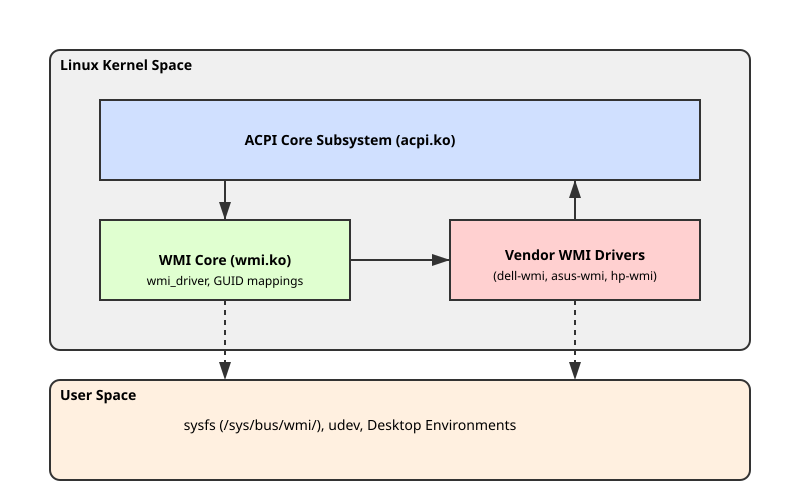

<preknowlist>
- Що таке ACPI (Advanced Configuration and Power Interface), його таблиці (DSDT, SSDT) та простір імен.
- Основні концепції драйверів пристроїв у ядрі Linux (структури `struct device`, `struct device_driver`).
- Поняття sysfs та udev у просторі користувача Linux.
</preknowlist>

# Інтерфейс WMI (ACPI-WMI) у драйверах Linux

Сучасні ноутбуки, моноблоки та навіть деякі настільні материнські плати містять велику кількість специфічних апаратних функцій, які не описуються стандартними специфікаціями на кшталт PCI чи USB. Гарячі клавіші регулювання яскравості, перемикачі бездротових мереж, підсвітка клавіатури, датчики відбитка пальця, керування вентиляторами, а також специфічні налаштування BIOS — усе це потребує каналу зв'язку між операційною системою та прошивкою пристрою. Історично вендори реалізовували це через власні ACPI-об'єкти з унікальними назвами. Однак із часом індустрія прийшла до уніфікованого механізму — **ACPI-WMI**.

## Що таке ACPI-WMI?

WMI (Windows Management Instrumentation) спочатку була створена компанією Microsoft як реалізація стандарту WBEM (Web-Based Enterprise Management) для керування компонентами операційної системи Windows. Пізніше Microsoft спільно з виробниками апаратного забезпечення розширила цю технологію для керування апаратурою (BIOS/UEFI), створивши специфікацію "WMI to ACPI Mapper".

Цей мапер дозволяє розробникам BIOS експортувати специфічні апаратні функції, події та дані через стандартний ACPI-інтерфейс, прив'язуючи їх до унікальних ідентифікаторів — GUID (Globally Unique Identifier). 

Хоча назва містить слово "Windows", сама специфікація є апаратною. Тому ядро Linux також має підсистему, яка реалізує цей стандарт (драйвер `wmi.ko`), дозволяючи розробникам Linux-драйверів звертатися до специфічних функцій ноутбуків від Dell, HP, ASUS, Lenovo, Acer та інших, використовуючи спільний інтерфейс.

## Архітектура ACPI-WMI

Основна ідея ACPI-WMI полягає в інкапсуляції вендорських методів у стандартний пристрій ACPI з ідентифікатором (HID - Hardware ID) `PNP0C14`. Коли ядро Linux ініціалізує ACPI і знаходить пристрій із таким ідентифікатором, воно передає керування драйверу `wmi`.


*Рис. 1. Архітектура підсистеми WMI у ядрі Linux.*

### Структура пристрою PNP0C14

Пристрій `PNP0C14` у просторі імен ACPI (DSDT або SSDT таблицях) зазвичай виглядає так:

```asl
Device (WMI1)
{
    Name (_HID, EisaId ("PNP0C14"))
    Name (_UID, 0x00)
    
    // WDG: WMI Data Guidance (опис підтримуваних GUID)
    Name (_WDG, Buffer() { ... })
    
    // Методи керування (Control Methods)
    Method (WMAB, 3, NotSerialized) { ... }
    Method (WQCD, 1, NotSerialized) { ... }
    Method (WSXY, 2, NotSerialized) { ... }
    
    // Метод отримання даних про події
    Method (_WED, 1, NotSerialized) { ... }
}
```

Ключовим об'єктом є `_WDG` (WMI Data Guidance). Це буфер, який містить масив структур (кожна по 20 байт). Кожна структура описує один підтримуваний GUID і прив'язує його до конкретних ACPI-методів.

#### Структура запису _WDG

Кожен 20-байтовий блок у буфері `_WDG` має таку структуру:

1. **GUID** (16 байт): Унікальний ідентифікатор, який ідентифікує блок даних, подію або метод. Наприклад, GUID `9DBB5994-A997-11DA-B012-B622A1EF5492` часто використовується для обробки гарячих клавіш у ноутбуках.
2. **Object ID** (2 байти): Двосимвольний рядок (у форматі ASCII), який додається до стандартних префіксів для формування назв ACPI-методів, що реалізують цей GUID. Наприклад, якщо Object ID — `AB`, то методи будуть називатися `WMAB`, `WQAB`, `WSAB`.
3. **Instance Count** (1 байт): Кількість екземплярів цього блоку (для даних) або методів.
4. **Flags** (1 байт): Прапорці, що вказують на тип і можливості цього GUID.

Прапорці можуть приймати такі значення (бітова маска):
- `0x01`: Цей GUID є дороговказним (Expensive). Означає, що збір даних для цього GUID потребує багато часу.
- `0x02`: Цей GUID є методом (Method). Він підтримує виконання методів через `WMxx`.
- `0x04`: Цей GUID є рядком (String). Дані, що повертаються, є ASCII-рядками.
- `0x08`: Цей GUID підтримує події (Event).

### Типи методів WMI

Залежно від прапорців у `_WDG`, підсистема WMI використовує різні ACPI-методи для взаємодії з BIOS. Префікси цих методів стандартизовані:

1. **`WQxx` (WMI Query)**: Використовується для читання даних, пов'язаних з GUID. Якщо Object ID — `AB`, то ядро викликатиме метод `WQAB`. Метод приймає один аргумент (індекс екземпляра) і повертає буфер із даними.
2. **`WSxx` (WMI Set)**: Використовується для запису даних. Метод приймає два аргументи: індекс екземпляра та буфер із новими даними.
3. **`WMxx` (WMI Method)**: Використовується, коли GUID має прапорець Method (`0x02`). Метод приймає три аргументи: індекс екземпляра, ідентифікатор методу (Method ID) та вхідний буфер. Повертає вихідний буфер. Це найпоширеніший спосіб реалізації складних викликів, таких як зміна налаштувань BIOS.
4. **`_WED` (WMI Event Data)**: Коли пристрій генерує подію (через ACPI Notify на пристрій PNP0C14), підсистема WMI перевіряє код події, знаходить відповідний GUID із прапорцем Event (`0x08`) і, якщо необхідно отримати додаткові дані про подію, викликає метод `_WED` із кодом події як аргументом.

## Підсистема WMI в ядрі Linux

Ядро Linux реалізує підтримку ACPI-WMI у модулі `wmi.ko` (`drivers/platform/x86/wmi.c`). Цей модуль є посередником між низькорівневим ACPI та драйверами конкретних пристроїв.

### Ініціалізація та парсинг _WDG

Коли ядро завантажується, драйвер `wmi` реєструється як обробник ACPI-пристроїв із HID `PNP0C14`. Для кожного знайденого пристрою він виконує такі дії:

1. Отримує буфер `_WDG` (виконуючи ACPI-запит).
2. Парсить буфер, розбиваючи його на 20-байтові записи.
3. Створює внутрішній список (registry) усіх знайдених GUID, їхніх Object ID та прапорців.
4. Створює структуру `wmi_device` (яка є обгорткою над стандартною `struct device`) для кожного знайденого GUID. Це дозволяє використовувати стандартну модель пристроїв ядра (Linux Device Model).
5. Реєструє шину `wmi_bus_type`.

### Шина WMI (`wmi_bus_type`)

У сучасних ядрах Linux WMI реалізовано як окрему шину (`bus`). Кожен підтримуваний GUID стає пристроєм на цій шині. Це означає, що розробники можуть писати драйвери, які "прив'язуються" (bind) до конкретних GUID, так само як драйвери USB прив'язуються до конкретних USB ID.

Структура `wmi_driver` виглядає так:

```c
struct wmi_driver {
    struct device_driver driver;
    const struct wmi_device_id *id_table;
    
    int (*probe)(struct wmi_device *wdev, const void *context);
    void (*remove)(struct wmi_device *wdev);
    void (*notify)(struct wmi_device *wdev, union acpi_object *dummy);
};
```

Драйвер реєструється за допомогою макросу `module_wmi_driver()`. У таблиці `id_table` драйвер вказує GUID, які він може обслуговувати:

```c
static const struct wmi_device_id asus_wmi_id_table[] = {
    { "97845ED0-4E6D-11DE-8A39-0800200C9A66", NULL },
    { }
};
MODULE_DEVICE_TABLE(wmi, asus_wmi_id_table);
```

### Обробка подій (WMI Events)

Одним із найважливіших завдань підсистеми WMI є обробка подій (наприклад, натискань гарячих клавіш). Механізм працює так:

1. Користувач натискає Fn-клавішу (наприклад, Fn+F5 для регулювання яскравості).
2. Embedded Controller (EC) ноутбука фіксує це і генерує SCI (System Control Interrupt).
3. ACPI-код BIOS виконує операцію `Notify(WMI1, 0x80)`. Код `0x80` та вище зарезервовано для вендорських подій.
4. Драйвер `wmi.ko` отримує цей Notify і перевіряє свій реєстр на наявність GUID із прапорцем Event і Notification Value, що дорівнює отриманому коду (`0x80`).
5. Якщо GUID знайдено, драйвер викликає `_WED` (WMI Event Data), щоб дізнатися деталі події (наприклад, яка саме клавіша була натиснута).
6. Отримавши дані (звичайно це ціле число, що є скан-кодом клавіші), драйвер викликає функцію `notify()` драйвера, який прив'язаний до цього GUID (наприклад, `dell-wmi` або `asus-wmi`).
7. Вендорський драйвер перетворює цей WMI-код на стандартний код введення Linux (наприклад, `KEY_BRIGHTNESSUP`) і відправляє його через підсистему `input`.

## Вендорські драйвери: Як вони працюють

Більшість функцій ноутбуків у Linux працюють завдяки модулям із суфіксом `-wmi`, які знаходяться в директорії `drivers/platform/x86/`. Найпопулярніші з них:

- `dell-wmi`: Обслуговує гарячі клавіші Dell, перемикач радіо (rfkill).
- `asus-wmi`: Дуже великий драйвер. Відповідає не лише за клавіші, а й за керування підсвіткою (включно з RGB на моделях ROG), швидкістю вентиляторів, обмеженням заряду батареї.
- `hp-wmi`: Підтримка гарячих клавіш HP, датчиків прискорення (для захисту жорстких дисків при падінні), керування термопрофілями.
- `thinkpad_acpi`: Хоча IBM/Lenovo мають власний ACPI-інтерфейс, сучасні ThinkPad активно використовують WMI, і цей драйвер тісно з ним інтегрується.

### Приклад взаємодії: Керування батареєю в ASUS

Розглянемо, як `asus-wmi.c` взаємодіє з BIOS для встановлення межі заряду батареї (наприклад, щоб батарея не заряджалася вище 80%, продовжуючи свій термін служби).

Коли користувач записує значення у файл sysfs (наприклад, `echo 80 > /sys/class/power_supply/BAT0/charge_control_end_threshold`), відбувається таке:

1. Метод sysfs-обробника в драйвері `asus-wmi` викликається з аргументом `80`.
2. Драйвер формує WMI-метод (виклик функції `wmi_evaluate_method`).
3. Виклик передається з такими параметрами: GUID керування пристроєм ASUS, ідентифікатор методу (Method ID, специфічний для налаштувань батареї) та вхідний буфер із числом 80.
4. Ядро (через `wmi.ko`) транслює це у виклик ACPI-методу `WMxx` пристрою `PNP0C14`.
5. BIOS виконує ACPI-метод і передає значення в Embedded Controller (EC).
6. EC фізично обмежує зарядку контролера батареї.

```c
// Спрощений приклад виклику методу з ядра
struct acpi_buffer input = { sizeof(u32), &value };
struct acpi_buffer output = { ACPI_ALLOCATE_BUFFER, NULL };
acpi_status status;

status = wmi_evaluate_method(ASUS_WMI_MGMT_GUID, 0, ASUS_WMI_METHODID_BATTERY, &input, &output);
if (ACPI_FAILURE(status))
    return -EIO;
```

## MOF: Managed Object Format

Специфікація WMI передбачає механізм самоопису: як операційна система або програми користувача мають дізнатися, що саме означають ті чи інші Method ID, які вхідні та вихідні типи даних вони потребують?

Для цього використовується MOF (Managed Object Format) — мова, що нагадує C++, для опису класів та методів WMI. Скомпілований двійковий BMOF (Binary MOF) вбудовується безпосередньо в ACPI DSDT.

Для його передачі зарезервовано спеціальний GUID: `05901221-D566-11D1-B2F0-00A0C9062910`.

Коли драйвер (чи утиліта користувача) бачить цей GUID у списку `_WDG`, він знає, що може виконати запит (Query) до нього. BIOS поверне стиснутий (або нестиснутий) BMOF-буфер.
Ядро Linux надає доступ до цього буфера через sysfs: `/sys/bus/wmi/devices/05901221-D566-11D1-B2F0-00A0C9062910/bmof`.

Існують утиліти у просторі користувача, такі як `wmi-bmof` або `fwts` (Firmware Test Suite), які можуть прочитати цей файл, декомпілювати BMOF і показати людинозрозумілий опис усіх класів, методів та властивостей, які експортує BIOS цього конкретного ноутбука. Це неймовірно корисно для реверс-інжинірингу та створення драйверів для нового обладнання, оскільки вендори рідко публікують документацію на свої WMI-інтерфейси.

## WMI у просторі користувача: Sysfs та Udev

Сучасні ядра Linux дозволяють програмам користувача взаємодіяти з WMI без необхідності писати драйвери ядра (за умови, що GUID підтримує лише читання/запис даних, а не складні методи чи події, які перехоплюються іншими драйверами).

Кожен WMI-пристрій представлений у `/sys/bus/wmi/devices/`. Наприклад, папка може мати назву `12345678-ABCD-1234-5678-1234567890AB`.
Всередині є кілька файлів, що описують можливості:
- `object_id`: Той самий 2-символьний ID.
- `setable`: Чи підтримує GUID запис (метод `WSxx`).
- `bmof`: BMOF буфер (якщо це GUID MOF).

Крім того, підсистема WMI генерує події `udev` при додаванні/видаленні пристроїв, що дозволяє писати скрипти, які автоматично реагують на появу певних апаратних функцій.

Для розробників утиліт (таких як системи керування живленням, налаштування LED-підсвітки тощо) WMI sysfs-інтерфейс є надійним способом взаємодії з апаратурою без необхідності патчити ядро, якщо BIOS надає стандартний data-block WMI.

## Налагодження та Реверс-інжиніринг (WMI)

Оскільки документація вендорів зазвичай закрита, створення драйверів для Linux — це процес реверс-інжинірингу. Основні етапи цього процесу:

1. **Дамп ACPI таблиць**: За допомогою інструменту `acpidump` та `iasl -d` розробники отримують вихідний код DSDT.
2. **Аналіз PNP0C14**: Пошук пристрою WMI та аналіз буфера `_WDG` (виявлення GUID).
3. **Декомпіляція BMOF**: Завдяки BMOF можна знайти назви методів та їхні аргументи, що дає підказки про те, що робить кожен Method ID (наприклад, якщо метод називається `SetKeyboardBacklight`).
4. **Трасування подій**: Використовуючи `acpi_listen` або утиліти `evtest`, розробники перевіряють, чи генеруються події при натисканні гарячих клавіш. Якщо події не генеруються, це означає, що WMI-подія надходить, але в ядрі немає драйвера для обробки (додавання GUID у вендорський драйвер).
5. **Динамічне налагодження**: Ядро має механізми (через `dyndbg`), що дозволяють увімкнути вивід кожного WMI виклику. Це дозволяє спостерігати, як рідний Windows-драйвер або інструменти вендора взаємодіють з WMI (через перехоплення у віртуальній машині з прокинутим ACPI, хоча це складно), або експериментувати просто з Linux.

## Підсумок

Інтерфейс ACPI-WMI є фундаментальним мостом між прошивкою сучасних комп'ютерів та операційною системою. Він позбавив вендорів необхідності вигадувати власні специфікації для кожного нового ноутбука, надавши єдиний формат (GUID, методи WQ, WS, WM, та події _WED). У ядрі Linux підсистема WMI розшифровує цей абстрактний інтерфейс і передає його конкретним драйверам, які вже створюють звичні для Linux пристрої: клавіатури, контролери підсвітки, датчики та налаштування батареї у `sysfs`. Розуміння архітектури WMI є обов'язковим для будь-кого, хто хоче налаштовувати або розробляти підтримку апаратних функцій ноутбуків у Linux.
