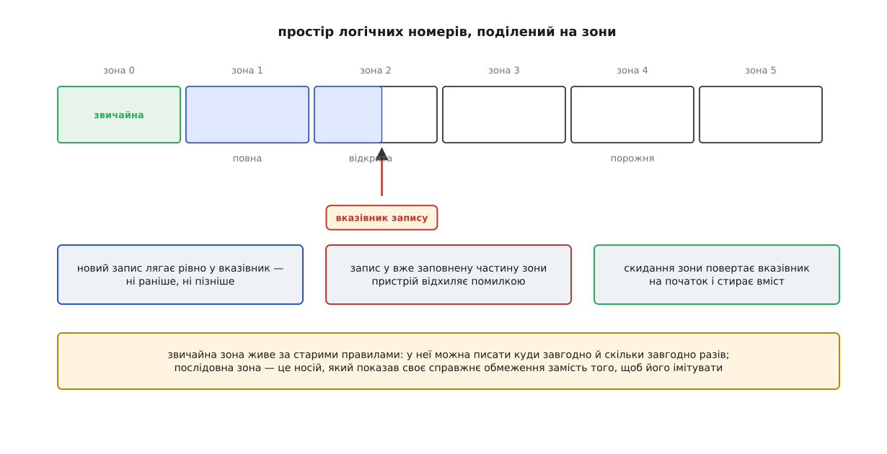
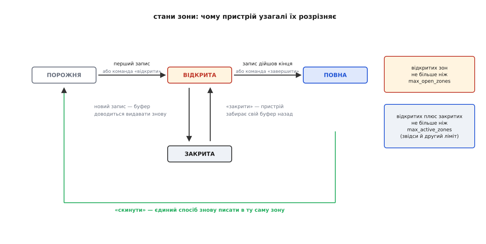
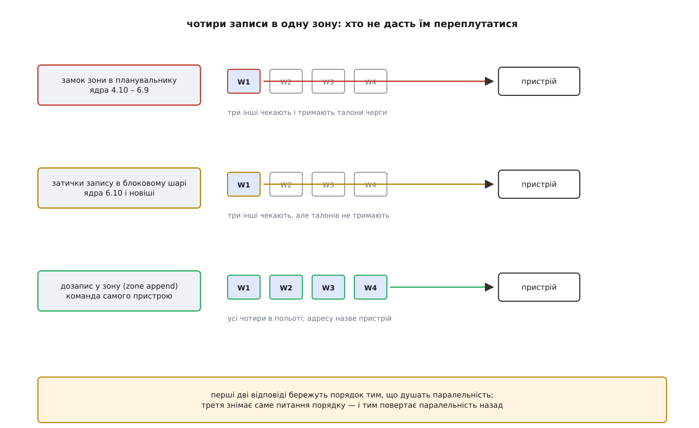

# Зонований блоковий пристрій: зони, послідовний запис і хто стежить за порядком

<preknowlist>
- [Блоковий пристрій: сектори, блоки й черга запитів](topic:unix-linux/block-device-model) — носій показує себе пронумерованим масивом секторів, а звертання до нього живе як окремий запит у черзі.
- [Планувальники блокового введення-виведення](topic:unix-linux/io-schedulers) — між поданням запиту й пристроєм є шар, що вільно переставляє запити місцями заради швидкості.
- [Шар трансляції флешу (FTL)](topic:algorithms/ftl-flash-translation) — контролер тримає таблицю відповідності логічного номера фізичному місцю й перекладає дані у фоні.
- [Discard і TRIM](topic:unix-linux/discard-and-trim) — носій не знає, які блоки вже мертві, доки файлова система йому цього не скаже.
- [NAND і NOR](topic:electronics/nand-nor) — флеш програмують сторінками, а стирають цілими блоками, і сторінку не можна переписати без стирання.
</preknowlist>

## Обіцянка, якої залізо не дає

Диск обіцяє просту річ: будь-який сектор можна перезаписати незалежно від сусідів, скільки завгодно разів. Ця обіцянка тримається на тому, що доріжки на пластині лежать окремо одна від одної — головка стає на потрібну й перемагнічує тільки її.

Але записувальна головка ширша за зчитувальну, і не через недбалість інженерів. Щоб надійно перевернути намагніченість зерна, потрібне сильне поле, а сильне поле важко звузити: воно розповзається вбік. Щоб натомість почути вже записану доріжку, вистачає слабкого сигналу з вузької смужки. Різниця між цими двома ширинами роками була стелею щільності: доріжки доводилося класти так рідко, як вимагає запис, хоча читати можна було й густіше.

Вихід знайшли простий до нахабності: класти доріжки **внапуск**, як черепицю на даху. Головка проходить, записує широку доріжку, зсувається не на всю свою ширину, а на третину — і наступний прохід затирає більшу частину попереднього, лишаючи від нього вузьку смужку. Смужки досить, щоб прочитати. Щільність зростає приблизно на чверть без жодної зміни у фізиці носія — саме за це технологію й узяли на озброєння.

Ціна вилазить, щойно щось треба переписати. Доріжка лежить під наступною; перезаписати її означає провести широкою головкою по тому, що вже частково накрите — і зіпсувати сусідку, а та накриває наступну, і так до кінця стрічки. Тому доріжки збивають у **смуги** по кілька сотень, а між смугами лишають пробіл, у якому широкій головці є де вміститися. Змінити один сектор усередині смуги = переписати смугу від цієї доріжки до її кінця. Сотні мегабайтів заради півкілобайта.

Флеш приходить до тієї самої форми з іншого боку. Комірку програмують сторінками по кілька кілобайтів, а повертають у чистий стан лише цілими блоками стирання розміром у мегабайти, і двічі поспіль запрограмувати сторінку без стирання не можна. Отже, і тут «перезаписати на місці» — операція, якої в наборі дієслів носія просто немає.

Обидва носії вміють **дописувати**. Перезаписувати вони не вміють — вони це вдають.

## Дві відповіді на одне обмеження

Перша відповідь очевидна: сховати. Хай контролер бреше — приймає запис у будь-який номер, кладе дані туди, де зараз є чисте місце, і тримає таблицю відповідності «логічний номер → фізичне місце». Так живе кожен звичайний SSD і так живуть диски з черепичним записом, які виробник назвав сумісними. Обіцянка формально виконана.

Рахунок за неї приходить чотирма рядками. Таблиця відповідності мусить десь лежати, і при дрібній зернистості це близько гігабайта оперативної пам'яті на терабайт місткості. Старі копії треба колись прибрати, а прибирання — це переписування живих даних, тобто зайві записи на носій понад ті, що просила система. Прибирання настає тоді, коли контролер визнав за потрібне, а не тоді, коли зручно програмі, — звідси затримки, що стрибають у десятки разів без видимої причини. І частину місткості доводиться тримати в резерві, щоб прибиральникові було куди перекладати.

Але найдорожчий рядок не в цьому переліку. Контролер не знає, що саме він зберігає. Для нього все — однакові пронумеровані блоки: він не бачить, які з них уже мертві (доки йому про це не сказали окремою командою [discard](topic:unix-linux/discard-and-trim)), і тим більше не бачить, які помруть разом. А той, хто це знає, сидить вище: файлова система знає, що цей журнал переповниться цілком, а цей файл перепишуть завтра повністю. Знання є нагорі, а рішення ухвалюють унизу — і жоден інтерфейс між ними цього знання не передає.

Друга відповідь звучить дивно рівно доти, доки не порахуєш цей рахунок: **не приховувати обмеження, а оголосити його в інтерфейсі**. Хай носій скаже прямо: ось так я влаштований, пиши відповідно. Тоді таблиця відповідності зникає з контролера — і не тому, що вона стала непотрібна, а тому, що її веде той, хто й так знає про дані більше.

## Зона і вказівник запису

Оголошення виглядає так. Простір логічних номерів ділять на суміжні ділянки однакового розміру. Кожна ділянка має власне число — номер сектора, у який дозволено писати **наступним**. Запис приймають лише рівно в це число; успішний запис зсуває його на свою довжину. Коли число дійшло до кінця ділянки, писати більше нікуди. Повернути його на початок можна єдиною командою, і вона стирає вміст ділянки цілком.

Ділянку звуть **зоною** (гр. *zṓnē* — пояс), а число — **вказівником запису**. Уся конструкція описує черепичну смугу чи групу блоків стирання достеменно: у зону можна дописувати, у зоні не можна нічого міняти, зону можна почати спочатку.



*Звичайна зона живе за старими правилами; послідовна зона приймає запис лише у вказівник, а повернути її на початок можна тільки скиданням.*

Зони бувають двох ґатунків. **Звичайна** зони вказівника не має й поводиться як шматок нормального диска — туди пишуть куди завгодно й скільки завгодно разів. Носій відводить під такі зони малу частку місткості (їх роблять із доріжок, покладених без напуску, або тримають під ними окремий буфер), і призначення в них одне: метадані, які за своєю природою переписують на місці. **Послідовна** зона — та сама, що описана вище.

Розрізняється й суворість вимоги. Пристрій, який відхиляє непослідовний запис помилкою, звуть **керованим хостом**: він не має чим приховати порушення й не вдає, що має. Пристрій **обізнаний із хостом** непослідовний запис прийме — але обробить його старим способом, через прихований буфер і подальше перекладання, тобто поверне всі витрати, від яких тікали. Третій різновид, **керований самим носієм**, зон назовні взагалі не показує; Linux навмисно позначає його як незонований, бо зонами тут керувати нема як, а вдавати, що можна, — гірше, ніж не мати їх.

Мову для цієї розмови стандартизували двічі й з двох боків: ZBC (INCITS 536-2016) описує зонові команди для SCSI, ZAC (INCITS 537-2016) — для ATA. Пізніше NVMe додав власний набір команд Zoned Namespace, ратифікований у червні 2020 року як TP 4053; окрему специфікацію Zoned Namespace Command Set 1.1 випустили в червні 2021-го. Шлях від першого черепичного диска до чесного інтерфейсу зайняв майже десятиліття й один гучний скандал — його [коротко переказано окремо](topic:unix-linux/zoned-block-devices/hist-shingles-and-honesty.md): хто й коли почав возити SMR, чому перші такі диски мовчали про свою природу і як мовчання закінчилося масовими збоями в масивах та позовом.

## Чому в зони є стани

Здавалося б, зоні досить одного числа — вказівника. Насправді пристрій розрізняє в ній кілька станів, і причина цілком матеріальна.

Зона, у яку зараз пишуть, коштує пристроєві ресурсу. Черепичному дискові треба тримати під неї енергонезалежний буфер: запис приходить порціями, а смуга, обірвана посередині, мусить пережити зникнення живлення. Твердотільному носієві відкрита зона займає блок стирання в стані програмування плюс буфер під сторінку. Ресурс цей скінченний і невеликий — одиниці або десятки зон, не тисячі.

Звідси й стани. Зона, у яку ще не писали, **порожня** і нічого не коштує. Перший запис робить її **відкритою** — пристрій виділив під неї буфер; те саме можна зробити наперед окремою командою, щоб пристрій не вирішував це сам у невдалий момент. Команда «закрити» повертає буфер пристроєві, лишаючи вказівник там, де він стоїть: зона стає **закритою** — писати в неї далі можна, але наступний запис знову вимагатиме буфера. Коли вказівник дійшов до кінця, зона **повна**; те саме можна оголосити достроково командою «завершити», відмовившись від решти місця. І окремо стоять стани зіпсованих зон: доступна лише для читання та відключена — так носій зізнається, що ділянка більше не тримає даних.



*Порожня зона нічого не коштує, відкрита займає буфер, закрита зберігає вказівник без буфера; скидання — єдина дорога назад.*

Раз ресурс скінченний, пристрій називає його межі наперед двома числами. Перше — скільки зон одночасно можуть бути відкритими. Друге — скільки зон одночасно можуть бути **активними**, тобто відкритими або закритими; закрита зона буфера не тримає, але пристрій усе одно пам'ятає про неї службові дані, і цієї пам'яті теж не безмежно. Друге число ніколи не менше за перше.

> 🔧 **Навіщо це.** Ці два числа перетворюють питання «скільки паралельних потоків запису тягне сховище» з питання смаку на арифметику. Якщо файлова система хоче вести окрему зону під журнал, окрему під дрібні файли й окрему під великі, а пристрій дозволяє чотирнадцять активних зон, — розкладка на двадцять потоків не сповільниться, а просто перестане працювати: команди почнуть повертати помилку про перевищення ліміту. Обидва числа, разом із розміром зони, їх кількістю та звітом про кожну, ядро віддає через sysfs та набір ioctl-ів — [що саме там лежить і як це читати](topic:unix-linux/zoned-block-devices/api-zone-interface.md), зібрано окремо.

## Розмір зони й ємність зони

Ядро мусить із номера сектора миттєво розуміти, у яку зону той потрапив, — цей перерахунок стоїть на шляху кожного запиту. Ділення тут завелика розкіш, тому Linux вимагає, щоб усі зони пристрою мали однаковий розмір і щоб цей розмір був степенем двійки в секторах: тоді номер зони — це зсув вправо, а початок зони — зсув уліво. Виняток один — остання зона носія: вона буває коротшою за решту, але крок адресації від цього не міняється.

Але фізична одиниця носія степенем двійки бути не зобов'язана: смуга черепичних доріжок має ту довжину, яку дала геометрія пластини, а блок стирання — ту, яку дала топологія кристала. Втискати їх у зручне для арифметики число означає викидати місткість.

NVMe розв'язав це, розділивши два поняття. **Розмір зони** — крок адресації, степінь двійки. **Ємність зони** — скільки логічних блоків від початку зони справді придатні до запису. Ємність не більша за розмір і ні до чого не прив'язана. Зона стає повною, коли вказівник дійшов до **ємності**, а не до кінця адресного простору зони; звертання за ємність повертає помилку. Хвіст кожної зони — це дірка в просторі номерів, крізь яку нічого не проходить.

**Пристрій із зоною в 1 ГіБ і ємністю 928 МіБ; куди потрапляють два сектори:**

```
розмір зони   = 2097152 секторів по 512 Б   (2²¹)
ємність зони  = 1900544 секторів

сектор 5000000:
  індекс зони = 5000000 >> 21               = 2
  початок     = 2 << 21                     = 4194304
  зсув у зоні = 5000000 − 4194304           = 805696
  805696 < 1900544                          → усередині ємності

сектор 6200000:
  індекс зони = 6200000 >> 21               = 2
  зсув у зоні = 6200000 − 4194304           = 2005696
  2005696 ≥ 1900544                         → у дірці, звертання відхилять
```

Наслідок для будь-якої розкладки нагорі однозначний: адресу не можна виводити з розміру зони. Корисне місце зони треба брати з її звіту, інакше остання порція кожної зони раз по раз падатиме на дірку.

## Хто стежить за порядком

Тепер найтонше. Зонований пристрій вимагає, щоб записи в одну зону приходили строго один за одним. Але шар вище віддає їх у ядро — а звідти до носія веде дорога, яка порядок не береже за побудовою.

Дорога ця виглядає так. Блоковий шар роздає запити по кількох [апаратних чергах](topic:unix-linux/block-layer-mq), по одній на групу процесорних ядер, — саме заради того, щоб ядра не билися за спільну структуру. Пристрій вибирає команди з черг у власному темпі й може взяти з другої раніше, ніж із першої. Планувальник між тим переставляє запити місцями свідомо, бо в цьому й полягає його робота. Нарешті, транспортна помилка спричиняє повтор — і повторений запит опиняється в потоці пізніше за тих, кого подали після нього.

Для звичайного носія жодне з цього не біда. Для зони це біда подвійна: запис, що прийшов не у вказівник, пристрій відхилить, а ті, що вже пройшли, вказівник зсунули — тож наївний повтор за старою адресою тепер напевно хибний.

Перша відповідь ядра з'явилася разом із самою підтримкою зон і жила з версії 4.10 по 6.9. Вона зветься **замком зони** й реалізована в планувальнику mq-deadline: для кожної послідовної зони планувальник випускає в політ щонайбільше один запис і не бере наступного, доки не повернувся попередній. Порядок збережено ціною паралельності — на зону в кожен момент працює рівно один запит. Побічний ефект був дошкульніший за саме обмеження: запис, що чекає своєї черги, тримає талон планувальника, а талонів скінченна кількість, тож він заважає й тому вводу-виводу, який до цієї зони не має стосунку. І оскільки механізм жив усередині одного планувальника, для пристрою, керованого хостом, mq-deadline був обов'язковим: поставити `none` означало зламати пристрій.

У ядрі 6.10 механізм переписали. **Затички запису** (робота Дам'єна Ле Моаля) винесли контроль порядку з планувальника в загальний шлях подання блокового шару. Затичка — це просто список bio на зону: перший іде до пристрою, решта чекають у списку. Оскільки чекають вони ще до перетворення на запити, талонів вони не тримають і нікому не заважають — а планувальник тепер може бути будь-який, зокрема й `none`.

Обидві відповіді роблять те саме: душать паралельність, щоб зберегти порядок. Третя відповідь приходить із боку пристрою й знімає питання цілком.

Команда **дозапису в зону** (zone append) міняє контракт: замість «запиши за адресою X» кажуть «допиши це в зону Z». Куди саме воно ляже, вирішує пристрій — і повертає адресу, за якою поклав. Питання порядку зникає разом із адресою: у політ можна віддати скільки завгодно дозаписів, пристрій сам вишикує їх у себе. Ядро підтримує таку операцію з версії 5.8 і оголошує в sysfs найбільший її розмір; з версії 6.10 блоковий шар уміє ще й **удавати** її звичайними записами через ті самі затички — тож шар вище пише код під одну модель, навіть коли під ним черепичний диск, який дозапису не знає.



*Замок і затички тримають у польоті один запис на зону; дозапис знімає саме питання порядку — і повертає паралельність.*

Плата за дозапис одна, зате принципова: той, хто пише, мусить прийняти адресу, якої не обирав. Файловій системі з жорсткою формулою «зсув у файлі → номер сектора» це не підходить взагалі. Файловій системі з таблицею відображення — навпаки, нічого не коштує: вона й так записує кудись, а потім запам'ятовує куди.

Побачити всю цю механіку можна й без черепичного диска: драйвер `null_blk` уміє зонований режим і дає повноцінний пристрій із зонами в пам'яті. [Невелика програма, що обходить зони, пише у вказівник і ловить помилку від запису повз нього](topic:unix-linux/zoned-block-devices/proj-walk-the-zones.md), показує поведінку швидше за будь-який опис.

## Кому це взагалі підходить

Вимога до шару вище виходить одна, зате жорстка: писати в зону суцільним потоком і вміти звільняти зону цілком. Це точний опис [лог-структурованої розкладки](topic:unix-linux/log-structured-filesystems) — тієї, що й так пише лише в кінець і прибирає сегментами. Тому підтримка зон приросла саме до тих файлових систем, які такими були за задумом: F2FS отримала її разом із першим зоновим кодом у 4.10, Btrfs — у 5.12 (її копіювання-при-записі лягає на дозапис у зону майже дослівно), XFS — у 6.15. Ширший огляд родин — [окрема тема](topic:unix-linux/filesystem-families).

Поруч стоять дві протилежні за духом речі. [zonefs](topic:unix-linux/zonefs) (ядро 5.6) показує кожну зону звичайним файлом і на цьому зупиняється: базі даних чи сховищу, яке саме вирішує, що куди класти, файлова система між ним і зонами тільки заважала б. [dm-zoned](topic:unix-linux/dm-zoned) (ядро 4.13) робить рівно навпаки — це ціль [device mapper](topic:unix-linux/device-mapper), яка показує зонований носій звичайним блоковим пристроєм, тримаючи звичайні зони як буфер і перекладаючи дані у фоні.

Друге варте того, щоб зупинитися. dm-zoned повертає ту саму трансляцію, заради усунення якої зони й придумали. Але повертає її на інший поверх — туди, де вона видима, вимірювана й може користуватися знанням про дані, якого контролер не має ніколи. У цьому й полягає справжня відповідь зонованого інтерфейсу: трансляцію не можна скасувати, бо її вимагає фізика носія. Її можна лише перенести до того, хто знає, що́ помре разом.

Останнє коло замикається на команді discard. Для звичайного SSD вона — підказка контролерові, який може її і проігнорувати. Для зонованого пристрою її роль виконує скидання зони: не підказка, а точна вказівка стерти рівно стільки, скільки носій і так стирає за раз. Обмеження, оголошене чесно, перетворило нечітку пораду на однозначну команду — і в цьому вся різниця між приховуванням і оголошенням.
