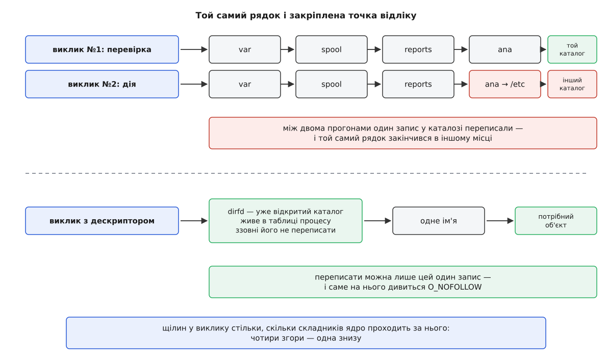
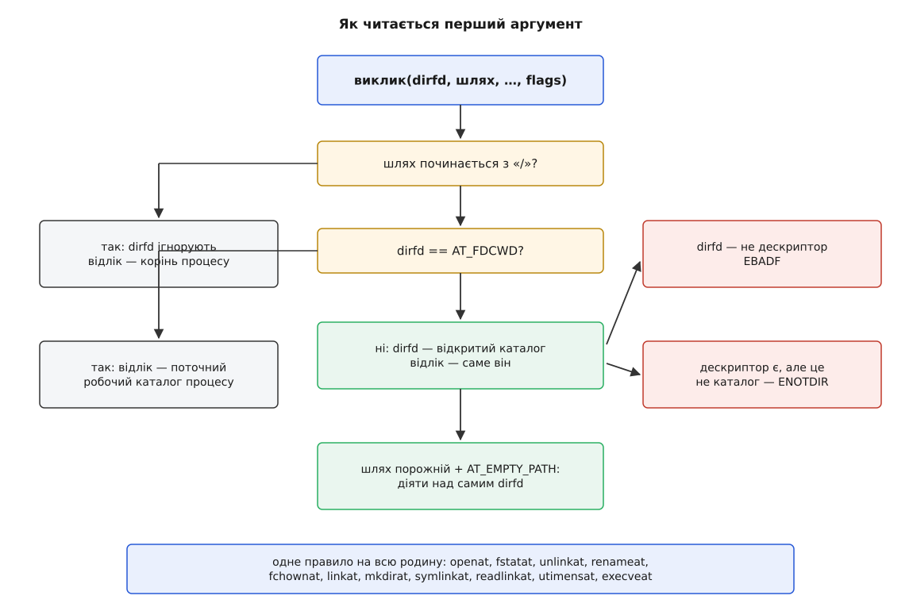
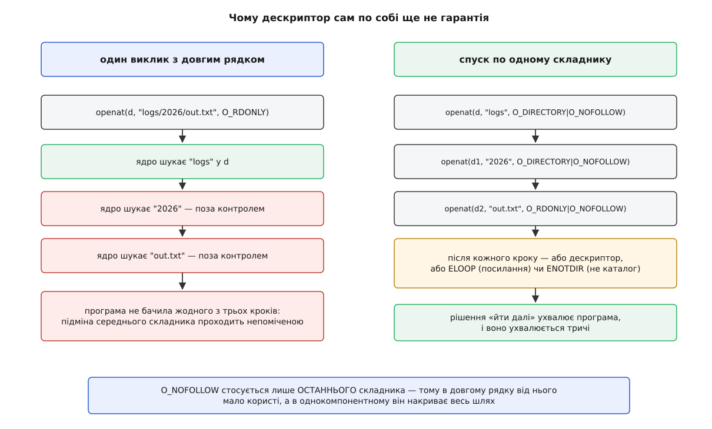
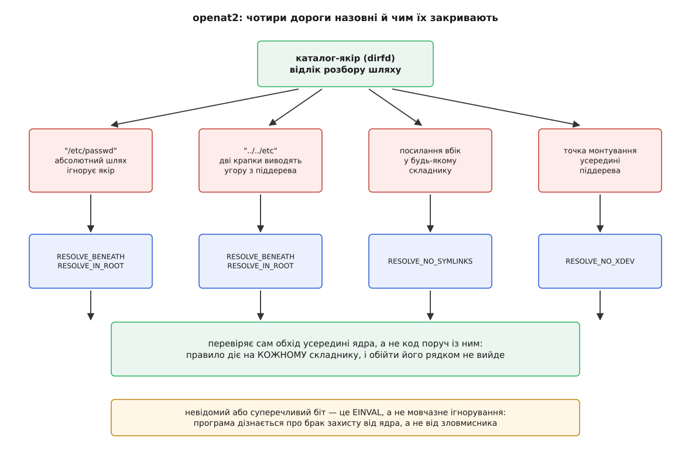

# Сімейство `*at`: шлях, відлічений від дескриптора каталогу

<preknowlist>
- [Файловий дескриптор](book:unix-linux/file-descriptor) — мале ціле число, яким процес називає вже відкритий об'єкт; поки дескриптор живий, він указує на той самий об'єкт і ні на що інше.
- [Розбір шляху](book:unix-linux/path-resolution) — ядро не знаходить шлях у довіднику, а проходить його складник за складником від точки відліку.
- [Каталог як відображення імен](book:unix-linux/directory-as-mapping) — каталог є файлом-таблицею, кожен рядок якої пов'язує ім'я з номером inode.
- [Inode: файл без імені](book:unix-linux/inode-model) — сам файл імені не має; ім'я живе в каталозі, і одному файлові може відповідати кілька імен або жодного.
- [Жорсткі й символьні посилання](book:unix-linux/hard-and-symbolic-links) — символьне посилання є окремим файлом, вміст якого є текстом іншого шляху, і ядро підставляє цей текст прямо посеред обходу.
- [Системний виклик](book:unix-linux/syscall-mechanics) — межа між програмою й ядром: аргументи копіюються всередину, робота робиться там, назад приходить результат або код помилки.
- [Біти прав і як їх перевіряють](book:unix-linux/permission-bits) — для каталогу біт `x` означає право шукати всередині, і його перевіряють на кожному складнику шляху.
- [Потоки в Linux](book:unix-linux/threads-as-tasks) — потоки одного процесу поділяють майже весь його стан, зокрема й той, що стосується роботи з файлами.
</preknowlist>

Служба звітів працює від імені `root` і мусить покласти файл у каталог користувача. Написана вона обережно: спершу перевіряє, що каталог справді належить тому, кому призначений звіт, і лише потім створює всередині файл.

```c
struct stat st;
if (lstat("/var/spool/reports/ana", &st) < 0) return -1;
if (!S_ISDIR(st.st_mode) || st.st_uid != uid_of_ana) return -1;

int fd = open("/var/spool/reports/ana/out.log", O_WRONLY | O_CREAT, 0644);
```

Між цими двома викликами Ана встигає зробити дві дії у власному каталозі:

```sh
$ mv /var/spool/reports/ana /var/spool/reports/ana.keep
$ ln -s /etc/cron.d /var/spool/reports/ana
```

Перевірка сказала правду — і сказала її про минуле. Другий виклик бачить уже інший каталог, і `root` створює файл у `/etc/cron.d`, куди Ана може писати те, що система за хвилину виконає від імені `root`.

Спокуса тут очевидна: додати перевірок. Перевірити ще й після відкриття, порівняти номери inode, відмовитися, якщо щось не збіглося. Жодна з цих добавок не працює, і причина не в тому, що їх мало.

## Чому ще одна перевірка не рятує

Здається, що рядок `/var/spool/reports/ana` — це адреса каталогу, як номер будинку. Тоді перевірка адреси мала б щось гарантувати. Але жодної таблиці «рядок → файл» у системі немає, і бути не може: ім'я зберігається рівно один раз, рядком у таблиці одного каталогу, і перейменування каталогу — це правка одного рядка, а не мільйона ключів у довіднику.

Тому ядро шлях не *знаходить*, а **виконує**: бере точку відліку, відрізає перший складник, шукає його в таблиці імен цього каталогу, робить знайдене новою точкою відліку — і так до кінця рядка. Це маленька програма, і кожен системний виклик, що приймає шлях, запускає її **наново, з нуля**.

Звідси й випливає все інше. Два виклики з однаковим рядком — це два незалежні запуски однієї програми, розділені в часі. Між ними в системі не заморожено нічого: будь-який рядок будь-якого каталогу на дорозі може змінитися, і другий запуск закінчиться в іншому місці. Перевірка стосується того запуску, у якому вона відбулася, і більше нічого.

Додаткові перевірки не міняють цієї арифметики, бо кожна з них — це ще один запуск тієї самої програми, отже, ще одна щілина. Три виклики замість двох дають дві щілини замість однієї. Це [класична гонка між перевіркою й використанням](book:programming/toctou-race): небезпечним є не окремий виклик, а **проміжок** між двома, і зашивати проміжки, додаючи виклики, — робота без кінця.

> 🔧 **Навіщо це.** Правило, яке з цього випливає, коротке: якщо між перевіркою й дією стоїть шлях, перевірка нічого не гарантує. Тому в аудиті коду шукають не «чи є перевірка», а «скільки разів рядок шляху перетнув межу ядра». Дві згадки того самого шляху в сусідніх викликах — це вже знахідка, і не має значення, наскільки ретельно написана перевірка між ними.

## Назва для середини дороги

Отже, шлях — не назва об'єкта, а маршрут до нього. Тоді потрібна інша назва: така, що вказує на **сам об'єкт** і не проходиться щоразу заново.

Така назва в системі вже є — файловий дескриптор. Він живе в таблиці процесу, всередині ядра, і вказує на конкретний відкритий об'єкт. Ані перейменування, ані підміна запису в каталозі його не зачіпають: у таблиці дескрипторів немає рядків, які зловмисник міг би переписати ззовні. Саме тому виклики з літерою `f` спереду — `fstat`, `fchmod`, `fchown` — гонок не мають узагалі: вони не бачать жодного імені.

Але цим годі скористатися там, де болить. `open` віддає дескриптор **кінця** дороги, а вся біда — в її **середині**: у складниках `/var`, `/spool`, `/reports`, `/ana`, які ядро проходило по одному й жоден з яких програма в руках не втримала. Щоб узяти щось у руки, треба це спершу відкрити — а щоб відкрити, треба назвати шляхом, який знову пройдеться повністю. Коло замикається.

Розірвати його можна рівно в одному місці. Дорога небезпечна тому, що вона довга. Якщо ж зробити її **однокроковою**, середини в неї не буде взагалі — і не буде чого підміняти. А для однокрокової дороги потрібне тільки одне: спосіб назвати **точку відліку** так, щоб вона не розв'язувалася наново.

Каталог теж можна відкрити, і дескриптор каталогу — така сама стійка назва, як і будь-який інший. Бракує лише можливості сказати ядрові: «відлічи цей відносний шлях не від кореня й не від поточного каталогу, а **ось звідси**». Саме цю можливість і додає сімейство `*at`: до кожного виклику, що приймає шлях, є двійник з тим самим іменем і суфіксом `at`, у якого першим аргументом стоїть дескриптор каталогу.



*Довгий рядок дає стільки щілин, скільки в ньому складників; дескриптор плюс одне ім'я лишає рівно одну.*

## Правило одного аргументу

Перший аргумент `dirfd` читається за трьома правилами, однаковими для всієї родини:

- шлях **абсолютний** (починається зі скісної риски) — `dirfd` ігнорується цілком, обхід іде від кореня процесу;
- шлях **відносний**, а `dirfd` — дескриптор відкритого каталогу — обхід іде від того каталогу;
- шлях **відносний**, а `dirfd` дорівнює сталій `AT_FDCWD` — обхід іде від поточного робочого каталогу, тобто виклик поводиться точнісінько як його старий двійник без суфікса.

Третє правило — не милиця для сумісності, а те, що дозволило родині витіснити попередників. Оскільки `openat(AT_FDCWD, …)` в усьому дорівнює `open(…)`, старий виклик можна просто не реалізовувати окремо: у glibc від версії 2.26 обгортка `open()` викликає всередині саме `openat()`, і на багатьох сучасних архітектурах системного виклику `open` в ядрі вже й немає — лишився тільки `openat`.

`AT_FDCWD` мусить бути значенням, яке ніколи не буде дійсним дескриптором, — інакше ядро не змогло б відрізнити прохання «від поточного каталогу» від прохання «від каталогу номер N». Дескриптори невід'ємні, тож стала від'ємна; у Linux це `-100`. Число саме по собі неважливе й **не є переносним**: POSIX значення не фіксує, і на інших системах воно інше (наприклад, `-1` на Haiku). У коді пишеться ім'я, ніколи не число.



*Одна розвилка на всю родину: правило читання аргументів однакове для `openat`, `fstatat`, `unlinkat`, `renameat` і решти.*

Дві помилки з цього правила варто знати напам'ять, бо вони плутаються. Якщо шлях відносний, а `dirfd` не є ані `AT_FDCWD`, ані дійсним дескриптором — `EBADF`. Якщо дескриптор дійсний, але відкриває не каталог — `ENOTDIR`. Обидві приходять **до** будь-якого звертання до файлової системи, тож помилка в передачі якоря видна одразу, а не за десять рівнів обходу.

## Що саме тримає дескриптор каталогу

Стійкість цієї конструкції варто зрозуміти точно, бо на око вона виглядає надійнішою, ніж є.

Дескриптор каталогу вказує на **об'єкт**, а не на ім'я. Наслідки прямі. Каталог перейменували — дескриптор указує туди ж; його перенесли в інше місце дерева — так само; його вилучили з батьківського каталогу, поки він у нас відкритий, — об'єкт живий, поки живий останній дескриптор, і `openat` від нього не впаде, просто нічого в ньому вже не знайде. Файлову систему з ним не відмонтувати: дескриптор тримає її зайнятою.

Так само важливо, чого дескриптор **не** дає. Він не заморожує **вміст** каталогу: записи всередині можна додавати, видаляти й підміняти скільки завгодно, і `openat(dfd, "x", …)` щоразу шукає `x` у таблиці наново. Він не робить безпечним багатоскладниковий шлях. І він не додає прав: ті самі перевірки біта `x` на кожному складнику лишаються, просто починаються не від кореня.

Що це дає — не «неможливість підміни», а **утримання в межах**. Дескриптор каталогу зафіксував піддерево; хай там що станеться з іменами всередині, звертання ніколи не почнеться поза ним. Для служби зі сцени на початку це різниця між «створили файл не там, де хотіли, — але всередині каталогу Ани» і «створили файл у `/etc/cron.d`». Перше — помилка, друге — здобутий root.

Найдешевший якір дає прапорець `O_PATH`: він відкриває місце в дереві, не відкриваючи самого об'єкта. Читати чи писати через такий дескриптор не можна, зате й права на читання каталогу для нього не потрібні — досить права пошуку по дорозі до нього. Для ролі точки відліку більшого й не треба, а плата менша.

## Один виклик — ще не один крок

Тепер найважливіша пастка, на якій сімейство `*at` найчастіше вживають хибно.

Виклик `openat(dfd, "logs/2026/out.txt", …)` **не є безпечним**. Дескриптор закріпив тільки початок дороги, а далі ядро розбирає той самий багатоскладниковий рядок звичайним обходом: `logs` може виявитися символьним посиланням, `2026` — теж, і жодного з цих кроків програма не бачить. Виграш обмежився тим, що дорога стала на кілька складників коротшою. Щілини лишилися.

Гарантія береться не з виклику, а з **дисципліни**: ядру за раз віддають рівно **один** складник імені, а спуск роблять самі.

```c
int walk_down(int dirfd, char *const comps[], int n)
{
    int d = dirfd;
    for (int i = 0; i < n; i++) {
        int next = openat(d, comps[i],
                          O_RDONLY | O_DIRECTORY | O_NOFOLLOW | O_CLOEXEC);
        if (d != dirfd) close(d);
        if (next < 0) return -1;      /* ELOOP — підмінили на посилання
                                         ENOTDIR — підмінили на файл */
        d = next;
    }
    return d;
}
```

Тут працює одна тонкість, заради якої все й робиться. Прапорець `O_NOFOLLOW` забороняє йти за символьним посиланням **лише в останньому складнику шляху** — саме тому в довгому рядку від нього мало користі. Але коли складник **єдиний**, «останній» означає «весь шлях»: інших складників просто немає, і прапорець дає повну гарантію. Підмінили запис на посилання — `ELOOP`; підмінили на звичайний файл — `ENOTDIR` завдяки `O_DIRECTORY`. Проскочити повз обидва не виходить.

Розгорнутий приклад такого обходу з вимірами й переліком пасток розібрано в [робочому прикладі рекурсивного проходу каталогом](book:unix-linux/directory-as-mapping/proj-walk-directory.md).



*Складники не зникають — вони переходять з-під контролю ядра під контроль програми, яка на кожному може відмовитися йти далі.*

Це не безкоштовно. Замість одного переходу в ядро виходить стільки переходів, скільки рівнів у шляху, плюс дескриптор, який треба вчасно закрити. Саме тому в GNU coreutils обхід дерева зроблено не рекурсією по рядках, а через дескриптори каталогів: режим `FTS_CWDFD` тримає якір і ходить `openat`/`fstatat`/`unlinkat` — точнісінько так, як у коді вище.

## Прапорці замість зоопарку викликів

У сімейства є друга властивість, не пов'язана з гонками, — і вона пояснює, чому нові виклики ядра тепер з'являються одразу у формі `*at`.

Стара родина файлових викликів розповзалася варіантами. Питання «а якщо останній складник — символьне посилання?» породило `stat` і `lstat`. Питання «а якщо об'єкт уже відкрито?» — `fstat`. Питання «видалити файл чи каталог?» — `unlink` і `rmdir`. Кожне запитання додавало не аргумент, а цілий новий виклик з власним іменем, власною сторінкою документації й власною реалізацією.

Форма `*at` замкнула це в один підпис: `(dirfd, шлях, свої аргументи, flags)`. Останній аргумент — набір бітів `AT_*`, які відповідають на ті самі питання, не плодячи викликів. `AT_SYMLINK_NOFOLLOW` перетворює `fstatat` на `lstat`. `AT_REMOVEDIR` перетворює `unlinkat` на `rmdir`. `AT_SYMLINK_FOLLOW` каже `linkat`, чи розкривати посилання в джерелі.

Одна зі сталих цього набору робить більше, ніж здається на перший погляд. `AT_EMPTY_PATH` означає: шлях порожній, працюй **над самим об'єктом, який відкриває `dirfd`**. Тобто `fstatat(fd, "", &st, AT_EMPTY_PATH)` — це `fstat(fd, &st)`, і жодного окремого виклику для цього більше не потрібно. Тому в `statx`, доданому в Linux 4.11 як заміна всьому родові `stat`, форма лише одна: вона накриває `stat`, `lstat` і `fstat` комбінаціями двох бітів. Прапорець (як і `AT_NO_AUTOMOUNT`) — розширення Linux, не частина POSIX.

Ту саму логіку видно і в найсвіжішому поповненні. Linux 6.13 додав `setxattrat`, `getxattrat`, `listxattrat` і `removexattrat` — не заради гонок, а щоб можна було працювати з [розширеними атрибутами](book:unix-linux/acl-and-xattr) через дескриптор без права на читання файлу. Доти це робили обхідним шляхом через `/proc/самого-себе/fd/N`, що вимагало змонтованого `/proc` і працювало не всюди.

Повний перелік викликів родини з підписами, допустимими бітами `AT_*`, версіями ядра й кодами помилок винесено в [окрему довідку](book:unix-linux/at-family-syscalls/api-at-family-reference.md): за клавіатурою вона потрібна, у тексті лише заважала б.

## Поточний каталог належить процесові, а не потокові

Є ще одна причина, чому родина `*at` з'явилася, і вона про зручність, а не про безпеку.

До неї спосіб «працювати всередині каталогу» був рівно один: перейти в нього викликом `chdir` і далі вживати відносні шляхи. Прийом старий і робочий — але поточний каталог є властивістю **всього процесу**, а не тієї частини коду, яка його змінила. Кожен `chdir` — глобальна зміна: інша частина програми, яка саме зараз відкриває файл за відносним шляхом, дістане не той файл, і ніякого сліду в її коді не буде.

З потоками це стає безумовною забороною. Потоки Linux поділяють структуру, у якій зберігаються корінь, поточний каталог і `umask`; саме це означає прапорець `CLONE_FS`, з яким їх створює бібліотека. Один потік викликав `chdir` — під усіма іншими змінилася земля. Виправити це можна хіба що глобальним замком навколо кожної операції з файлом, тобто ціною спільної роботи взагалі.

Дескриптор каталогу знімає проблему тим, що переносить «де я зараз» з глобального стану процесу в **звичайну змінну**. Кожен потік тримає власний якір, кожна рекурсивна функція — свій, і жоден з них нічого не змінює під сусідом. Формулювання з документації ядра точне: `openat` дозволяє програмі реалізувати поточний робочий каталог **на потік**, самими лише дескрипторами.

> 🔧 **Навіщо це.** Практичний висновок для будь-якої бібліотеки: `chdir` у бібліотечному коді — помилка, навіть якщо потоків у програмі сьогодні немає. Бібліотека не володіє поточним каталогом процесу, вона його позичає, і зміна, зроблена на час своєї операції, видима всім. Правильний інтерфейс для роботи з чужим каталогом — приймати `dirfd` параметром, як це роблять самі виклики ядра.

## Стеля, якої немає в дерева

Останній аргумент на користь дескрипторів помічають найпізніше — коли програма вже написана й падає на глибокому дереві.

Дерево каталогів не має обмеження на глибину: кожен `mkdir` додає рівень, і так скільки завгодно. А **рядок** шляху обмежений: ядро приймає в аргументі не більше `PATH_MAX` байтів, у Linux це 4096. Ці дві межі не узгоджені між собою, і не випадково: дерево живе у файловій системі, а `PATH_MAX` — це розмір буфера, у який ядро копіює аргумент виклику.

Через це рекурсія, що складає повний шлях на кожному рівні, ламається там, де сама файлова система здорова: каталог існує, кожен його складник коротший за межу, а от повний рядок у неї вже не влазить, і виклик повертає `ENAMETOOLONG`. Отримати такий каталог легко й без злого наміру — досить кількох сотень вкладених тек із довгими іменами.

Обхід через дескриптори цієї стелі не має взагалі, бо повного шляху ніколи не складає: на кожному рівні ядру передають одне ім'я, а воно обмежене вже не `PATH_MAX`, а `NAME_MAX` — 255 байтів, і в цю межу впирається сама файлова система, тобто такого імені просто не буває.

Заразом зникає й квадратична робота. Обхід, що на кожному рівні передає повний шлях, змушує ядро щоразу проходити всі складники згори: на глибині `d` виходить приблизно `d·(d+1)/2` пошуків імені замість `d`. Для дерева на десять рівнів це п'ятдесят п'ять пошуків замість десяти — приблизно вп'ятеро більше роботи; кеш каталогів різницю пом'якшує, але не прибирає.

## Що лишилося відчиненим — і що зробив `openat2`

Дисципліна «один складник за раз» закриває підміну на посилання. Але дірок у розборі шляху більше, ніж одна, і решту вона не бере.

Абсолютний шлях ігнорує якір за самим правилом читання аргументів: якщо ім'я, отримане ззовні, почалося зі скісної риски, `dirfd` не значить нічого. Складник `..` виводить угору з піддерева — і на нього немає прапорця. Символьне посилання, що вказує вбік, обробляється ядром без питань. Перехід через точку монтування теж нічим не стримується. Кожну з цих дірок можна затулити руками — перевірити перший символ, порахувати `..` у рядку, звірити `st_dev` після відкриття, — але всі ці перевірки роблять те саме, що й перевірка зі сцени на початку: судять про рядок, тоді як діє ядро.

Правильне місце для такої перевірки — усередині розбору, а не поруч із ним. Виклик `openat2`, доданий у Linux 5.6 (2020, автор — Алекса Сараї, SUSE), саме туди її й переніс. Замість цілого `int` прапорців він приймає структуру, у якій третє поле `resolve` керує **самим обходом**:

```c
struct open_how how = {
    .flags   = O_RDONLY | O_CLOEXEC,
    .resolve = RESOLVE_IN_ROOT | RESOLVE_NO_MAGICLINKS,
};
int fd = syscall(SYS_openat2, dirfd, untrusted_path, &how, sizeof how);
```

- `RESOLVE_BENEATH` — відмовити, якщо хоч один крок вивів за межі каталогу-якоря;
- `RESOLVE_IN_ROOT` — вважати якір коренем: `..` у ньому впирається в цей каталог, а абсолютні шляхи й абсолютні посилання відлічуються від нього ж (те саме, що [зміна кореня](book:unix-linux/chroot), але на час одного розбору й без жодних привілеїв);
- `RESOLVE_NO_SYMLINKS` — жодних переходів по посиланнях у **всіх** складниках, а не лише в останньому;
- `RESOLVE_NO_XDEV` — не перетинати [точки монтування](book:unix-linux/mount-model);
- `RESOLVE_NO_MAGICLINKS` — заборонити переходи по «чарівних» посиланнях `/proc`, що ведуть просто у відкритий об'єкт;
- `RESOLVE_CACHED` (з ядра 5.12) — відмовити, якщо хоч один складник іще не в кеші; це не про безпеку, а про швидкий шлях без блокувань.

Два перші прапорці — взаємно виключні: разом вони позбавлені сенсу, і ядро від версії 5.11 відхиляє таку пару замість того, щоб мовчки ігнорувати один із них.



*Кожен прапорець `RESOLVE_*` закриває один конкретний спосіб вийти за межі каталогу-якоря — перевірку робить сам обхід, а не код поруч із ним.*

Окремої уваги вартий не перелік прапорців, а два рішення в підписі. Аргументом іде **структура з розміром**: ядро бачить, яку її редакцію знає програма, і поля можна дописувати роками, не вигадуючи `openat3`. І, на відміну від `open`, невідомі або суперечливі біти тут **не ігноруються мовчки**, а дають `EINVAL`. Різниця принципова: коли старе ядро мовчки ковтає невідомий біт, програма вважає себе захищеною, а насправді працює без захисту — і дізнається про це від зловмисника. Помилка ж дозволяє перевірити підтримку прапорця просто спробувавши його й, за потреби, чесно перейти на повільніший запасний варіант.

## Коли форми `*at` не існує

Родина покриває майже все, що приймає шлях, але не все. `chdir` двійника з суфіксом не має — його роль виконує `fchdir`, який і так бере дескриптор. Немає його й у `getcwd`, бо там шлях є результатом, а не аргументом. `execveat` (ядро 3.19) з'явився пізніше за решту й закрив стару прогалину: [запуск програми](book:unix-linux/exec-semantics) з дескриптора, а не з імені, — з `AT_EMPTY_PATH` це виконання саме того файлу, який уже в руках.

Там, де форми `*at` немає досі, лишається обхідний шлях: `/proc/самого-себе/fd/N` — це запис, що веде просто у відкритий об'єкт, тож рядок `"/proc/self/fd/7/config"` розбереться від сьомого дескриптора. Ціна відома: потрібен змонтований [`/proc`](book:unix-linux/proc-filesystem), у [власному просторі імен монтувань](book:unix-linux/namespaces) його може не бути, і сам цей запис є чарівним посиланням — тобто те саме, що `RESOLVE_NO_MAGICLINKS` навмисно забороняє. Обхід на те й обхід: користуватися ним можна, покладатися — ні.

Родина `*at` не робить шляхи безпечними. Вона робить можливим **не користуватися ними**: чим менше складників програма віддає ядру за один раз, тим менше в неї щілин, і в найкращому разі складник лишається один. Тому в зрілому коді, який чіпає чуже дерево, повного шляху не видно взагалі — видно якір, ланцюжок імен по одному й прапорці, якими кожен крок або дозволено, або відмовлено.
