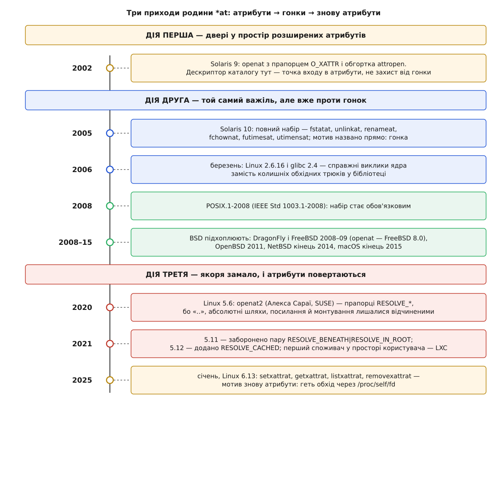

# 📜 Родина `*at` народилася не заради безпеки

Найвідоміше застосування цих викликів — закрити гонку між перевіркою й використанням. Але перший із них з'явився зовсім не для цього: він був службовими дверима в іншу частину файлової системи, і те, що ті двері виявилися ще й якорем проти підміни шляху, помітили пізніше. Далі родина приходила ще двічі, щоразу з іншого боку, і саме ця повторюваність — найцікавіше в її історії.

*Три хвилі, розділені роками, і два різні мотиви, що чергуються.*

## Sun і простір, у який не було входу

У Solaris 9 (2002) Sun Microsystems додала до файлів [розширені атрибути](topic:unix-linux/acl-and-xattr) — іменовані шматки даних, причеплені до файлу збоку від його вмісту: мітка безпеки, тип вмісту, службовий запис резервного копіювання. Реалізація в Solaris була незвично буквальною: атрибути там — не просто пари «ім'я → значення», а справжні файли в прихованому каталозі, що належить самому файлові.

Звідси й постала суто інженерна незручність. Якщо атрибут — це файл, його треба відкривати. Але жоден звичайний шлях у нього не веде: той прихований каталог не має імені в жодному нормальному каталозі, і вписати його в рядок неможливо. Потрібна була конструкція «відкрий мені щось **відносно вже відкритого файлу**» — тобто виклик, у якого точка відліку задана не рядком, а дескриптором.

Такою конструкцією і став `openat`. Прапорець `O_XATTR` казав ядру: рахуй цей дескриптор не як каталог, а як вхід у простір атрибутів того об'єкта. Для найчастішого випадку Sun додала ще й зручну обгортку `attropen`, яка сама відкриває файл, робить `openat` з `O_XATTR` і закриває зайве.

Зверніть увагу, чого тут немає. Немає жодного слова про гонки, підміну каталогу чи символьні посилання. Дескриптор узяли не тому, що він стійкий до підміни, а тому, що на потрібне місце просто не існувало шляху. Стійкість була побічним ефектом — властивістю, за яку тоді ніхто не платив.

## Той самий важіль, інша мета

Побічний ефект помітили швидко. У Solaris 10 (2005) набір розрісся до повного: `fstatat`, `unlinkat`, `renameat`, `fchownat`, `futimesat` і решта — двійник до кожного виклику, що приймає шлях. І цього разу мотив назвали прямо: уникнути [гонки між перевіркою й використанням](topic:programming/toctou-race) — ситуації, коли програма перевіряє щось за шляхом, а потім діє за тим самим шляхом, і між двома викликами шлях устигає повести в інше місце. Прапорець `O_XATTR` нікуди не подівся, але головним героєм став уже не він.

Це той рідкісний випадок, коли інструмент здобув друге життя без жодної зміни форми. Сигнатура `openat` у Solaris 10 така сама, як у Solaris 9. Змінилося тільки те, заради чого її пишуть у код.

> 🔧 **Навіщо це.** Історія тут не декоративна. Родину часто подають як «набір безпечних версій старих викликів» — і тоді незрозуміло, чому в ній опинилися такі речі, як `O_XATTR`, і чому набір саме такий. Якщо ж пам'ятати, що спершу був потрібен спосіб адресуватися від дескриптора, а безпека прийшла другою, форма родини перестає здаватися випадковою.

**Розбіжність джерел, яку варто назвати вголос.** Багато оглядів (зокрема ті, що переказують історію родини) приписують появу `openat` одразу Solaris 10. Це не помилка в дусі «переплутали версію», а наслідок різних питань: документація розширених атрибутів Solaris 9 описує `openat` з `O_XATTR` як чинний інтерфейс тієї версії, тоді як переліки нововведень Solaris 10 називають `openat` серед нових викликів **проти гонок** — разом із рештою набору. Обидва твердження правдиві щодо своїх фактів: виклик існував із дев'ятки, а родина в теперішньому вигляді й мотиві склалася в десятці. Плутанина виникає лише тоді, коли «поява виклику» й «поява родини» злипаються в одну дату.

## Стандарт, а потім довге розповзання

Далі йде звична для Unix послідовність: вдала річ, зроблена в одному постачальника, стає загальною. Набір увійшов у [POSIX.1-2008](topic:unix-linux/posix-standard) (IEEE Std 1003.1-2008) — редакцію стандарту, що описує спільний інтерфейс Unix-подібних систем і тим зобов'язує всіх, хто хоче зватися сумісним.

У Linux виклики з'явилися ще до стандарту й ледь не одночасно в ядрі та бібліотеці: ядро 2.6.16 вийшло 20 березня 2006 року, glibc 2.4 — того ж місяця. До того glibc уміла вдавати частину з них обхідними трюками через `/proc`, але це були підробки: вони працювали тільки там, де змонтована `/proc`, і саму гонку не закривали до кінця.

BSD-системи підхоплювали набір поволі й нерівно: DragonFly і FreeBSD — у 2008–2009 роках (`openat` увійшов у FreeBSD 8.0), OpenBSD — у 2011-му, NetBSD і macOS — у середині 2010-х. Більше десятиліття від першої реалізації до останнього великого переймача. Для інтерфейсу, який ніхто публічно не оскаржував, це багато — і це добре пояснює, чому переносні програми ще довго після 2008 року носили в собі запасні гілки «а якщо `*at` немає».

## Другий акт: якоря виявилося замало

Далі мала б настати тиша: набір є, стандарт є, усі його мають. Натомість у 2020 році в Linux 5.6 з'явився `openat2` — новий виклик з тією ж ідеєю точки відліку, але з набором прапорців `RESOLVE_*`, що обмежують сам обхід. Автор — Алекса Сараї (Aleksa Sarai) із SUSE.

Причина була простою й неприємною. Закріплена точка відліку прибирає гонку в **початку** шляху, але нічого не каже про те, куди шлях заведе далі. Складник `..` виводить назад угору, абсолютний рядок ігнорує якір узагалі, символьне посилання посеред дороги перекидає обхід в інше піддерево, а перетин точки монтування виносить його в іншу файлову систему. Для програми, що просто хоче не наступити на підмінений каталог, цього досить. Для програми, яка мусить **утримати** чужі шляхи всередині заданого піддерева — а саме це роблять середовища запуску контейнерів, — ні. Прапорці якраз і закривають ці чотири виходи.

Дрібніші правки показують, що інтерфейс доводили вже в бою: у 5.11 заборонили безглузду пару `RESOLVE_BENEATH|RESOLVE_IN_ROOT` (раніше вона мовчки поводилася як одна з них — тобто програма могла думати, що обмежень два, а діяло одне), у 5.12 додали `RESOLVE_CACHED`. Дозволити собі таку правду ядро змогло тому, що єдиним відомим споживачем `openat2` у просторі користувача на той час був LXC — набір інструментів для [контейнерів](topic:unix-linux/namespaces), який поєднання й так не вживав.

## Третій акт: атрибути повертаються

І тут коло замикається. У січні 2025 року Linux 6.13 додав `setxattrat`, `getxattrat`, `listxattrat`, `removexattrat` — тобто `*at`-двійники до операцій із розширеними атрибутами. Тими самими, з яких усе почалося.

Мотив цього разу знову не гонка. Старі виклики вміли працювати або зі шляхом, або з дескриптором, відкритим **на читання**, — а іноді потрібно ні те, ні те. Обхідний прийом був відомий і бридкий: відкрити файл як завгодно, а потім звернутися до нього рядком `/proc/self/fd/N`. Він вимагає змонтованої `/proc` і перетворює дескриптор назад на шлях — рівно навпаки до того, чого родина мала досягти. Канонічний приклад — `setfiles(8)`, що розставляє мітки [SELinux](topic:unix-linux/mac-selinux-apparmor) в атрибуті `security.selinux`: щоб просто записати мітку, програмі доводилося вимагати від системи права на читання вмісту файлу, яких їй за суттю роботи не треба.

## Чому форма пережила всі три мотиви

Складімо докупи: двері в атрибути (2002), захист від гонок (2005), утримання шляху в піддереві (2020), знову атрибути (2025). Чотири різні задачі, три різні десятиліття — і в кожній відповідь має ту саму форму: **дай ядру стійку точку відліку й одне ім'я замість довгого рядка**.

Це не збіг. Усі чотири задачі впираються в одну властивість шляху: рядок описує маршрут, а не об'єкт, і маршрут щоразу проходиться наново. Хто б не потребував протилежного — доступу до безіменного місця, незмінності між двома викликами чи гарантії не вийти за межу, — приходить до тієї самої вимоги. Тому родина `*at` і виявилася універсальною: вона не розв'язує чотири задачі, вона усуває одну спільну причину під ними.

І тому ж вона досі росте. Щоразу, коли в ядрі з'являється нова операція над файлом, питання «а чи потрібен їй двійник з `at`» уже не обговорюють — його просто ставлять.
